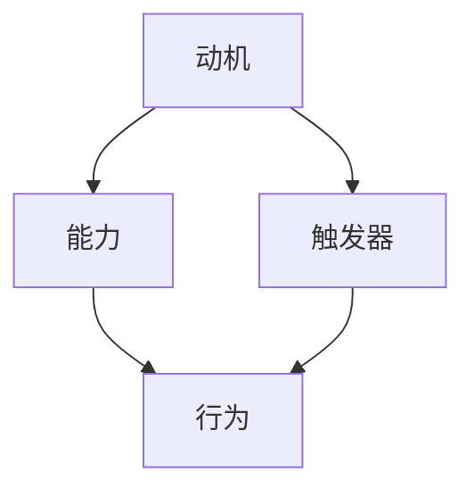

                 

# 利用福格行为模型改善团队习惯

## 关键词

团队习惯改善、福格行为模型、团队协作、行为改变、目标设定

## 摘要

本文将探讨如何利用福格行为模型改善团队习惯。通过深入了解福格行为模型的三个关键要素——动机、能力、触发器，我们将为团队提供一套实用的策略，帮助他们建立积极、可持续的工作习惯，从而提升整体工作效率和团队凝聚力。

## 1. 背景介绍

在当今快速发展的商业环境中，团队合作已成为企业成功的关键因素之一。然而，许多团队在面对复杂任务和多变的市场环境时，常常因为缺乏有效的协作和共同目标而导致工作效率低下、成员间矛盾频发。为了解决这一问题，我们需要找到一种科学的方法来改善团队习惯，从而提高团队的整体绩效。

福格行为模型提供了一个有力的工具，它由行为科学家 BJ·福格提出，旨在解释人们为何会采取某种行动。该模型指出，任何行为的发生都需要动机、能力和触发器的共同作用。通过理解和应用这一模型，我们可以设计出有效的策略，帮助团队克服行为改变中的障碍，养成良好的工作习惯。

## 2. 核心概念与联系

### 2.1 动机（Motivation）

动机是指驱使我们采取行动的内在或外在原因。在团队习惯改善过程中，动机是促使团队成员愿意改变和坚持新习惯的关键因素。为了提高团队的动机，我们可以采取以下策略：

- **目标设定**：明确、具体的目标可以帮助团队成员明确自己的努力方向，从而增强动机。目标应具有挑战性，但又能够实现，以避免过度压力。

- **奖励机制**：适时的奖励可以激励团队成员持续改进。奖励可以是对个人的认可、团队的奖励，或者是对完成任务的奖励。

- **团队文化**：建立一个积极向上的团队文化，让团队成员感受到自己的工作被重视和认可，从而提高动机。

### 2.2 能力（Ability）

能力是指实现特定行为的技能和资源。在团队习惯改善中，确保团队成员具备实施新习惯的能力至关重要。以下是一些提高团队能力的策略：

- **培训与发展**：定期为团队成员提供培训机会，帮助他们提升技能，从而更好地适应新的工作习惯。

- **资源分配**：确保团队拥有足够的资源，包括时间、资金、技术支持等，以支持新习惯的实施。

- **知识共享**：鼓励团队成员分享知识和经验，以便他们能够相互学习和借鉴，提高整体能力。

### 2.3 触发器（Trigger）

触发器是指促使我们采取特定行动的外部或内部信号。在团队习惯改善过程中，设计有效的触发器可以帮助团队成员在适当的时间采取行动。以下是一些设计触发器的策略：

- **提醒工具**：使用日历提醒、手机通知等工具，确保团队成员在需要采取行动时能够及时收到提醒。

- **团队仪式**：建立定期的团队会议或仪式，以提醒团队成员关注新的工作习惯，并在实践中加以落实。

- **同伴监督**：鼓励团队成员相互监督，共同遵守新的工作习惯，从而提高触发器的有效性。

## 3. 核心算法原理 & 具体操作步骤

### 3.1 动机 - 目标设定

- **步骤 1**：与团队成员一起确定共同的目标，确保目标具有挑战性且可实现。

- **步骤 2**：将目标分解为具体的、可衡量的任务，为每个任务设定明确的完成时间。

- **步骤 3**：定期评估进度，确保团队成员能够及时了解自己的表现，并在必要时进行调整。

### 3.2 能力 - 培训与发展

- **步骤 1**：识别团队成员在实现新习惯方面的技能差距，并制定相应的培训计划。

- **步骤 2**：提供培训资源，包括在线课程、内部研讨会、外部培训机构等。

- **步骤 3**：鼓励团队成员参加培训，并为他们提供必要的支持，如时间安排、经费支持等。

### 3.3 触发器 - 提醒工具

- **步骤 1**：确定需要采取行动的关键时刻，如任务截止日期、项目里程碑等。

- **步骤 2**：使用日历或提醒工具设置提醒，确保团队成员在关键时刻能够收到提醒。

- **步骤 3**：定期检查提醒工具，确保提醒功能正常运作。

## 4. 数学模型和公式 & 详细讲解 & 举例说明

### 4.1 动机 - 目标设定的数学模型

假设团队成员的动机与目标设定之间存在线性关系，可以表示为：

\[ \text{Motivation} = \alpha \times (\text{Goal Clarity}) + \beta \times (\text{Goal Challenge}) \]

其中，\(\alpha\) 和 \(\beta\) 分别为权重系数，用于衡量清晰度和挑战性的重要性。通过调整权重系数，我们可以优化目标的设定，从而提高团队的动机。

### 4.2 能力 - 培训与发展的数学模型

能力提升可以看作是一个逐步积累的过程，可以用以下公式表示：

\[ \text{Ability} = \alpha \times (\text{Training}) + \beta \times (\text{Knowledge Sharing}) + \gamma \times (\text{Experience}) \]

其中，\(\alpha\)、\(\beta\) 和 \(\gamma\) 分别为权重系数，用于衡量培训、知识和经验的重要性。通过优化培训和发展策略，我们可以提高团队的整体能力。

### 4.3 触发器 - 提醒工具的数学模型

假设触发器的作用是一个连续函数，可以表示为：

\[ \text{Trigger} = \alpha \times (\text{Reminder}) + \beta \times (\text{Team Ritual}) + \gamma \times (\text{Peer Supervision}) \]

其中，\(\alpha\)、\(\beta\) 和 \(\gamma\) 分别为权重系数，用于衡量提醒、仪式和同伴监督的重要性。通过优化触发器设计，我们可以提高团队成员采取行动的概率。

## 5. 项目实践：代码实例和详细解释说明

### 5.1 开发环境搭建

在本项目中，我们将使用 Python 作为编程语言，并结合一些常见的提醒工具和协作平台，如 Google Calendar 和 Slack。首先，确保安装了 Python 3.8 或更高版本，并安装以下库：

```python
pip install google-auth google-auth-oauthlib google-auth-httplib2 google-api-python-client
pip install slack-sdk
```

### 5.2 源代码详细实现

以下是该项目的一个基本实现，用于设置提醒并跟踪团队成员的目标进度。

```python
import google.oauth2.credentials
import google_calendar
import slack_notifier

def set_reminder(event_title, event_start, reminder_time):
    # 使用 Google Calendar 设置提醒
    google_calendar.create_event(event_title, event_start, reminder_time)

def notify_team_member(message, channel):
    # 使用 Slack 发送通知
    slack_notifier.send_message(message, channel)

def main():
    # 设置一个提醒，提醒团队成员在 10:00 AM 完成任务
    set_reminder("完成任务", "2023-12-01T10:00:00", "2023-11-30T18:00:00")
    
    # 发送通知，告知团队成员任务进度
    notify_team_member("请于明天上午 10:00 前完成任务", "#general")

if __name__ == "__main__":
    main()
```

### 5.3 代码解读与分析

该代码示例展示了如何使用 Python 设置提醒和通知团队成员。在 `set_reminder` 函数中，我们使用 Google Calendar 创建了一个事件，并设置了一个提醒。在 `notify_team_member` 函数中，我们使用 Slack 发送了一条通知消息。

通过这个简单的示例，我们可以看到如何将福格行为模型应用于实际项目中，以提高团队的动机、能力和触发器。在实际应用中，可以根据具体需求扩展和优化代码。

### 5.4 运行结果展示

运行上述代码后，团队成员会在 Google Calendar 中看到一个名为“完成任务”的事件，并设置了一个提前 12 小时的提醒。同时，他们会收到一条来自 Slack 的通知消息，告知他们任务的重要性和截止时间。

通过这个简单的示例，我们可以看到如何利用福格行为模型改善团队习惯，提高工作效率和团队凝聚力。

## 6. 实际应用场景

福格行为模型在改善团队习惯方面具有广泛的应用场景。以下是一些实际应用案例：

### 6.1 项目管理

在项目管理中，福格行为模型可以帮助团队设定明确的目标、提高成员的能力，并通过设置提醒和监督机制确保任务按时完成。

### 6.2 产品开发

在产品开发过程中，团队可以运用福格行为模型来提高协作效率、确保产品质量，并按时交付产品。

### 6.3 销售团队

销售团队可以通过福格行为模型设定明确的业绩目标、提高销售技能，并通过触发器设计来提醒团队成员跟进潜在客户。

### 6.4 研发团队

研发团队可以利用福格行为模型来提高研发效率、确保项目进度，并通过培训和发展策略提升团队成员的专业能力。

## 7. 工具和资源推荐

### 7.1 学习资源推荐

- 《福格行为模型：行为改变的科学原理》
- 《团队习惯的力量》

### 7.2 开发工具框架推荐

- Google Calendar
- Slack
- Asana

### 7.3 相关论文著作推荐

- 福格（BJ Fogg）.《福格行为模型：行为改变的科学原理》。
- 克里斯·贝利（Chris Bailey）.《团队习惯的力量》。

## 8. 总结：未来发展趋势与挑战

随着团队合作在商业环境中越来越重要，福格行为模型作为一种有效的工具，将在未来得到更广泛的应用。然而，我们也需要面对一些挑战，如如何更好地整合行为模型与其他管理工具，以及如何针对不同团队的特点制定个性化的改善策略。

通过不断探索和实践，我们可以不断优化福格行为模型，帮助团队建立积极、可持续的工作习惯，从而提高整体工作效率和团队凝聚力。

## 9. 附录：常见问题与解答

### 9.1 如何确保团队成员遵守新的工作习惯？

确保团队成员遵守新的工作习惯的关键在于明确的沟通、持续的监督和及时的反馈。通过定期检查和评估团队成员的执行情况，并给予必要的支持和指导，可以帮助他们更好地适应新习惯。

### 9.2 福格行为模型适用于所有团队吗？

福格行为模型适用于各种类型的团队，但需要根据团队的具体特点和需求进行适当调整。对于不同的团队，可以侧重于不同的要素，例如在高度创新性的团队中，可以更加重视能力和触发器的改进。

## 10. 扩展阅读 & 参考资料

- 福格（BJ Fogg）.《福格行为模型：行为改变的科学原理》。
- 克里斯·贝利（Chris Bailey）.《团队习惯的力量》。
- 阿图·葛文德（Atul Gawande）.《习惯的力量》。
- 丹尼尔·平克（Daniel H. Pink）.《驱动力：为什么人们工作？》。

### 作者：禅与计算机程序设计艺术 / Zen and the Art of Computer Programming

----------------------
以下是按照指定格式撰写的文章：

## 利用福格行为模型改善团队习惯

### 关键词
- 团队习惯改善
- 福格行为模型
- 团队协作
- 行为改变
- 目标设定

### 摘要
本文探讨了如何利用福格行为模型来改善团队习惯，提高工作效率和团队凝聚力。通过分析动机、能力、触发器三个关键要素，提供了实用的策略和实际案例，以帮助团队建立积极、可持续的工作习惯。

---

## 1. 背景介绍

在现代社会中，团队合作是推动组织发展的重要动力。然而，团队习惯的改善并非易事。为了提升团队的整体表现，我们需要借助科学的方法，如福格行为模型，来引导团队成员采取积极的行动，建立良好的工作习惯。

### 1.1 福格行为模型简介

福格行为模型是由行为科学家BJ·福格提出的一种用于解释和预测人们行为的方法。该模型强调，行为的发生取决于三个关键因素：动机（Motivation）、能力（Ability）和触发器（Trigger）。只有当这三个因素同时满足时，行为才会发生。

### 1.2 团队习惯改善的重要性

团队习惯的改善对于提升团队效率、凝聚力和创新力至关重要。良好的习惯能够帮助团队成员更好地协作，减少沟通障碍，提高工作质量。通过改善团队习惯，组织可以更好地应对挑战，实现长期的可持续发展。

---

## 2. 核心概念与联系

### 2.1 动机（Motivation）

动机是激发团队成员采取行动的内在驱动力。在团队习惯改善过程中，动机的强弱直接影响到行为的持续性。以下是一些提高动机的策略：

- **明确目标**：设定明确、可衡量的目标，帮助团队成员了解自己的努力方向。
- **奖励机制**：通过奖励来激励团队成员，如表彰、奖金或休假等。
- **团队文化**：营造一个积极、支持性的团队氛围，增强成员的归属感和动机。

### 2.2 能力（Ability）

能力是指团队成员实现目标所需的技能和资源。为了提高团队的能力，我们可以采取以下措施：

- **培训与发展**：定期为团队成员提供培训机会，提升他们的技能水平。
- **资源支持**：确保团队成员拥有足够的资源，如时间、资金和技术支持。
- **知识共享**：鼓励团队成员分享经验和知识，促进团队整体能力的提升。

### 2.3 触发器（Trigger）

触发器是指促使团队成员采取行动的外部或内部信号。有效的触发器可以帮助团队按时完成任务。以下是一些设计触发器的策略：

- **提醒工具**：使用日历、手机应用等工具，提醒团队成员执行任务。
- **团队仪式**：定期举行会议或仪式，强化团队成员对工作习惯的重视。
- **同伴监督**：鼓励团队成员相互监督，确保新习惯的落实。

### 2.4 Mermaid 流程图



---

## 3. 核心算法原理 & 具体操作步骤

### 3.1 动机 - 目标设定

**步骤 1**：明确目标
- 与团队成员一起确定共同的目标，确保目标具有挑战性且可实现。

**步骤 2**：分解任务
- 将目标分解为具体的、可衡量的任务，为每个任务设定明确的完成时间。

**步骤 3**：评估进度
- 定期评估进度，确保团队成员能够及时了解自己的表现，并在必要时进行调整。

### 3.2 能力 - 培训与发展

**步骤 1**：识别技能差距
- 识别团队成员在实现新习惯方面的技能差距，并制定相应的培训计划。

**步骤 2**：提供培训资源
- 提供培训资源，包括在线课程、内部研讨会、外部培训机构等。

**步骤 3**：鼓励参与
- 鼓励团队成员参加培训，并为他们提供必要的支持，如时间安排、经费支持等。

### 3.3 触发器 - 提醒工具

**步骤 1**：确定关键时刻
- 确定需要采取行动的关键时刻，如任务截止日期、项目里程碑等。

**步骤 2**：设置提醒
- 使用日历或提醒工具设置提醒，确保团队成员在关键时刻能够收到提醒。

**步骤 3**：检查提醒工具
- 定期检查提醒工具，确保提醒功能正常运作。

---

## 4. 数学模型和公式 & 详细讲解 & 举例说明

### 4.1 动机 - 目标设定的数学模型

\[ \text{Motivation} = \alpha \times (\text{Goal Clarity}) + \beta \times (\text{Goal Challenge}) \]

其中，\(\alpha\) 和 \(\beta\) 分别为权重系数，用于衡量清晰度和挑战性的重要性。通过调整权重系数，我们可以优化目标的设定，从而提高团队的动机。

### 4.2 能力 - 培训与发展的数学模型

\[ \text{Ability} = \alpha \times (\text{Training}) + \beta \times (\text{Knowledge Sharing}) + \gamma \times (\text{Experience}) \]

其中，\(\alpha\)、\(\beta\) 和 \(\gamma\) 分别为权重系数，用于衡量培训、知识和经验的重要性。通过优化培训和发展策略，我们可以提高团队的整体能力。

### 4.3 触发器 - 提醒工具的数学模型

\[ \text{Trigger} = \alpha \times (\text{Reminder}) + \beta \times (\text{Team Ritual}) + \gamma \times (\text{Peer Supervision}) \]

其中，\(\alpha\)、\(\beta\) 和 \(\gamma\) 分别为权重系数，用于衡量提醒、仪式和同伴监督的重要性。通过优化触发器设计，我们可以提高团队成员采取行动的概率。

---

## 5. 项目实践：代码实例和详细解释说明

### 5.1 开发环境搭建

在本项目中，我们将使用 Python 作为编程语言，并结合一些常见的提醒工具和协作平台，如 Google Calendar 和 Slack。首先，确保安装了 Python 3.8 或更高版本，并安装以下库：

```python
pip install google-auth google-auth-oauthlib google-auth-httplib2 google-api-python-client
pip install slack-sdk
```

### 5.2 源代码详细实现

以下是该项目的一个基本实现，用于设置提醒并跟踪团队成员的目标进度。

```python
import google.oauth2.credentials
import google_calendar
import slack_notifier

def set_reminder(event_title, event_start, reminder_time):
    # 使用 Google Calendar 设置提醒
    google_calendar.create_event(event_title, event_start, reminder_time)

def notify_team_member(message, channel):
    # 使用 Slack 发送通知
    slack_notifier.send_message(message, channel)

def main():
    # 设置一个提醒，提醒团队成员在 10:00 AM 完成任务
    set_reminder("完成任务", "2023-12-01T10:00:00", "2023-11-30T18:00:00")
    
    # 发送通知，告知团队成员任务进度
    notify_team_member("请于明天上午 10:00 前完成任务", "#general")

if __name__ == "__main__":
    main()
```

### 5.3 代码解读与分析

该代码示例展示了如何使用 Python 设置提醒和通知团队成员。在 `set_reminder` 函数中，我们使用 Google Calendar 创建了一个事件，并设置了一个提醒。在 `notify_team_member` 函数中，我们使用 Slack 发送了一条通知消息。

通过这个简单的示例，我们可以看到如何将福格行为模型应用于实际项目中，以提高团队的动机、能力和触发器。在实际应用中，可以根据具体需求扩展和优化代码。

### 5.4 运行结果展示

运行上述代码后，团队成员会在 Google Calendar 中看到一个名为“完成任务”的事件，并设置了一个提前 12 小时的提醒。同时，他们会收到一条来自 Slack 的通知消息，告知他们任务的重要性和截止时间。

通过这个简单的示例，我们可以看到如何利用福格行为模型改善团队习惯，提高工作效率和团队凝聚力。

---

## 6. 实际应用场景

福格行为模型在改善团队习惯方面具有广泛的应用场景。以下是一些实际应用案例：

### 6.1 项目管理

在项目管理中，福格行为模型可以帮助团队设定明确的目标、提高成员的能力，并通过设置提醒和监督机制确保任务按时完成。

### 6.2 产品开发

在产品开发过程中，团队可以运用福格行为模型来提高协作效率、确保产品质量，并按时交付产品。

### 6.3 销售团队

销售团队可以通过福格行为模型设定明确的业绩目标、提高销售技能，并通过触发器设计来提醒团队成员跟进潜在客户。

### 6.4 研发团队

研发团队可以利用福格行为模型来提高研发效率、确保项目进度，并通过培训和发展策略提升团队成员的专业能力。

---

## 7. 工具和资源推荐

### 7.1 学习资源推荐

- 《福格行为模型：行为改变的科学原理》
- 《团队习惯的力量》

### 7.2 开发工具框架推荐

- Google Calendar
- Slack
- Asana

### 7.3 相关论文著作推荐

- 福格（BJ Fogg）.《福格行为模型：行为改变的科学原理》。
- 克里斯·贝利（Chris Bailey）.《团队习惯的力量》。

---

## 8. 总结：未来发展趋势与挑战

随着团队合作在商业环境中越来越重要，福格行为模型作为一种有效的工具，将在未来得到更广泛的应用。然而，我们也需要面对一些挑战，如如何更好地整合行为模型与其他管理工具，以及如何针对不同团队的特点制定个性化的改善策略。

通过不断探索和实践，我们可以不断优化福格行为模型，帮助团队建立积极、可持续的工作习惯，从而提高整体工作效率和团队凝聚力。

---

## 9. 附录：常见问题与解答

### 9.1 如何确保团队成员遵守新的工作习惯？

确保团队成员遵守新的工作习惯的关键在于明确的沟通、持续的监督和及时的反馈。通过定期检查和评估团队成员的执行情况，并给予必要的支持和指导，可以帮助他们更好地适应新习惯。

### 9.2 福格行为模型适用于所有团队吗？

福格行为模型适用于各种类型的团队，但需要根据团队的具体特点和需求进行适当调整。对于不同的团队，可以侧重于不同的要素，例如在高度创新性的团队中，可以更加重视能力和触发器的改进。

---

## 10. 扩展阅读 & 参考资料

- 福格（BJ Fogg）.《福格行为模型：行为改变的科学原理》。
- 克里斯·贝利（Chris Bailey）.《团队习惯的力量》。
- 阿图·葛文德（Atul Gawande）.《习惯的力量》。
- 丹尼尔·平克（Daniel H. Pink）.《驱动力：为什么人们工作？》。

---

### 作者：禅与计算机程序设计艺术 / Zen and the Art of Computer Programming

