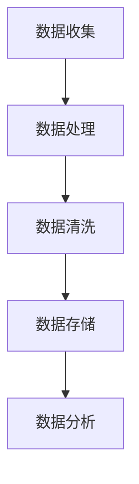
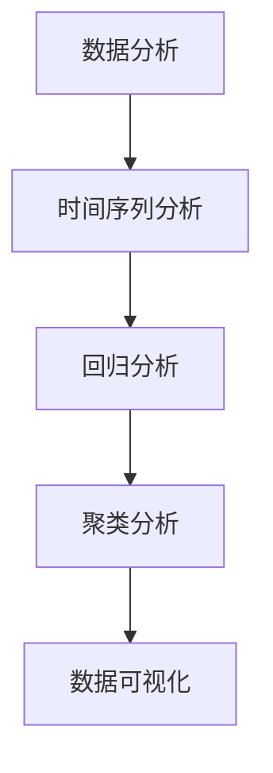
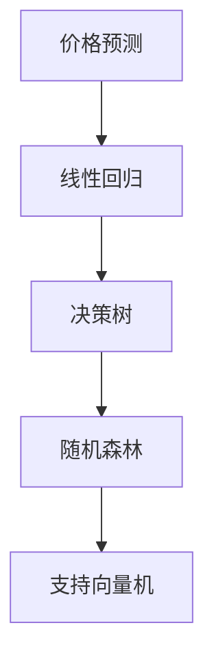
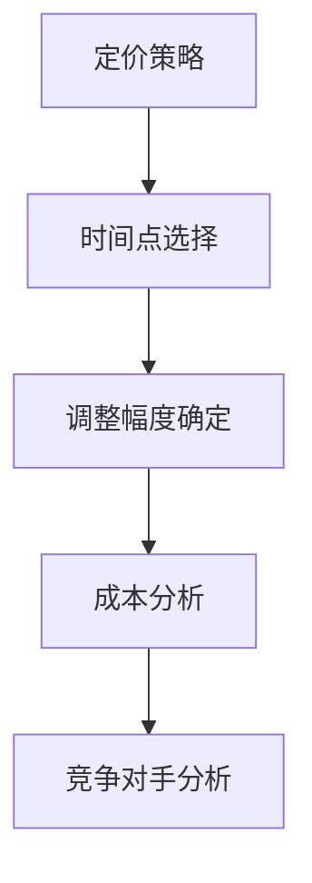
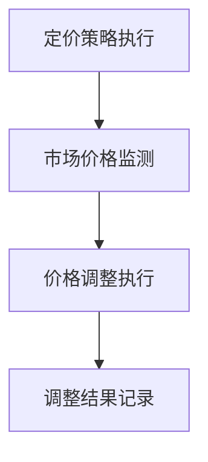

                 

### 文章标题

**动态定价：AI如何根据市场供需调整价格**

### 关键词：
- 动态定价
- 人工智能
- 市场供需
- 价格调整策略
- 价格预测模型

### 摘要：
本文深入探讨了动态定价这一商业策略，以及人工智能（AI）如何在这一过程中发挥关键作用。通过分析市场供需的基本原理，我们了解了如何利用AI算法来预测价格趋势，并制定出最优的定价策略。文章将通过实际案例和数学模型，展示AI在动态定价中的应用，并讨论其未来发展趋势和挑战。

### 引言

在当今的商业环境中，竞争日益激烈，消费者需求不断变化。为了在这种动态的市场环境中保持竞争力，许多企业开始采用动态定价策略。这种策略能够根据市场供需情况实时调整价格，以最大化利润或市场份额。传统的定价策略通常是基于历史数据或固定规则，而动态定价则更加灵活，能够更好地适应市场变化。

然而，实现动态定价并不容易。企业需要收集大量的市场数据，并利用复杂的算法进行分析，以便实时预测价格趋势并做出调整。这就需要引入人工智能（AI）技术，特别是机器学习和数据分析领域的发展，使得动态定价成为可能。

本文将首先介绍市场供需的基本原理，然后讨论AI在动态定价中的核心作用。接着，我们将深入探讨AI如何预测价格趋势，并展示几个实际案例来阐述动态定价的应用。最后，我们将讨论动态定价的未来发展趋势和面临的挑战。

### 1. 背景介绍（Background Introduction）

#### 1.1 市场供需原理

市场供需是指商品或服务的供给量和需求量在市场上的相互作用。供给量通常由生产者决定，而需求量则由消费者决定。市场供需的基本原理是：价格上升时，供给量增加，需求量减少；价格下降时，供给量减少，需求量增加。这种关系可以用供需曲线来表示。

供给曲线通常呈正向倾斜，表示随着价格的上升，供给量增加。需求曲线则通常呈负向倾斜，表示随着价格的上升，需求量减少。供需曲线的交点即为市场的均衡点，此时价格和数量达到平衡。

#### 1.2 动态定价的定义与原理

动态定价是指企业根据市场供需情况，实时调整价格的一种策略。与传统的固定定价策略不同，动态定价能够根据市场的变化灵活调整价格，以最大化利润或市场份额。

动态定价的原理在于，通过实时监测市场供需情况，企业可以预测价格趋势，并在适当的时间调整价格。例如，当市场需求增加时，企业可以提高价格以获取更高的利润；当市场需求减少时，企业可以降低价格以刺激需求。

#### 1.3 AI在动态定价中的作用

传统的动态定价通常依赖于历史数据和分析工具，而AI技术的引入使得动态定价更加精准和高效。AI可以通过以下方式在动态定价中发挥作用：

1. **数据收集与分析**：AI可以收集大量的市场数据，包括价格、需求量、竞争对手的行为等，并对这些数据进行分析，以识别价格趋势和供需变化。

2. **价格预测**：基于分析结果，AI可以预测未来的价格趋势，为企业提供调整价格的依据。

3. **优化定价策略**：AI可以通过机器学习算法，优化定价策略，提高定价的准确性和灵活性。

4. **自动化执行**：AI可以自动化执行定价策略，减少人为干预，提高执行效率。

### 2. 核心概念与联系（Core Concepts and Connections）

#### 2.1 什么是动态定价？

动态定价是一种根据市场供需情况实时调整价格的策略。与固定定价策略相比，动态定价更加灵活，能够更好地适应市场的变化。

#### 2.2 动态定价的基本原理

动态定价的基本原理是利用市场供需关系来调整价格。当市场需求增加时，企业可以提高价格以获取更高的利润；当市场需求减少时，企业可以降低价格以刺激需求。

#### 2.3 AI与动态定价的关系

AI在动态定价中起着核心作用，其主要体现在以下几个方面：

1. **数据收集与分析**：AI可以收集大量的市场数据，包括价格、需求量、竞争对手的行为等，并对这些数据进行分析，以识别价格趋势和供需变化。

2. **价格预测**：基于分析结果，AI可以预测未来的价格趋势，为企业提供调整价格的依据。

3. **优化定价策略**：AI可以通过机器学习算法，优化定价策略，提高定价的准确性和灵活性。

4. **自动化执行**：AI可以自动化执行定价策略，减少人为干预，提高执行效率。

### 3. 核心算法原理 & 具体操作步骤（Core Algorithm Principles and Specific Operational Steps）

#### 3.1 数据收集与处理

动态定价的第一步是收集相关的市场数据。这些数据包括历史价格、需求量、市场趋势、竞争对手的行为等。收集到数据后，需要对其进行处理和清洗，以确保数据的准确性和完整性。



#### 3.2 数据分析

在数据处理完成后，需要对数据进行深入分析，以识别价格趋势和供需变化。常用的分析方法包括时间序列分析、回归分析、聚类分析等。



#### 3.3 价格预测

基于分析结果，可以使用机器学习算法来预测未来的价格趋势。常用的算法包括线性回归、决策树、随机森林、支持向量机等。



#### 3.4 定价策略制定

在预测未来的价格趋势后，需要制定相应的定价策略。这包括确定价格调整的时间点、调整幅度等。定价策略的制定需要综合考虑市场需求、成本、竞争对手等因素。



#### 3.5 定价策略执行

最后，需要将定价策略付诸实施。这包括实时监测市场价格、执行价格调整、记录调整结果等。



### 4. 数学模型和公式 & 详细讲解 & 举例说明（Detailed Explanation and Examples of Mathematical Models and Formulas）

#### 4.1 时间序列分析

时间序列分析是动态定价中的关键步骤，它用于识别价格趋势和周期性变化。假设我们有n个时间点的价格数据\(P_t\)，我们可以使用移动平均法来平滑数据，并识别趋势。

**移动平均法公式：**

\[MA_t = \frac{\sum_{i=1}^{n} P_{t-i}}{n}\]

其中，\(MA_t\) 是第t个时间点的移动平均值，\(P_{t-i}\) 是第t-i个时间点的价格。

**例：**

假设我们有以下5个时间点的价格数据：

\[P_1 = 10, P_2 = 12, P_3 = 11, P_4 = 9, P_5 = 10\]

使用3点移动平均法，我们可以计算出：

\[MA_3 = \frac{P_1 + P_2 + P_3}{3} = \frac{10 + 12 + 11}{3} = 11\]

#### 4.2 回归分析

回归分析用于建立价格与需求量之间的关系模型。假设我们有m个时间点的价格\(P_t\)和需求量\(Q_t\)，我们可以使用线性回归来预测未来的价格。

**线性回归公式：**

\[P_t = \beta_0 + \beta_1 Q_t + \epsilon_t\]

其中，\(\beta_0\) 和 \(\beta_1\) 是回归系数，\(\epsilon_t\) 是误差项。

**例：**

假设我们有以下5个时间点的价格和需求量数据：

\[P_1 = 10, Q_1 = 100\]
\[P_2 = 12, Q_2 = 120\]
\[P_3 = 11, Q_3 = 110\]
\[P_4 = 9, Q_4 = 90\]
\[P_5 = 10, Q_5 = 100\]

我们可以计算出回归系数：

\[\beta_0 = \frac{\sum_{i=1}^{5} P_i - \beta_1 \sum_{i=1}^{5} Q_i}{5} = \frac{60 - 1.2 \times 500}{5} = 4\]
\[\beta_1 = \frac{\sum_{i=1}^{5} P_i Q_i - \sum_{i=1}^{5} P_i \sum_{i=1}^{5} Q_i}{5 \sum_{i=1}^{5} Q_i} = \frac{60 \times 100 - 500 \times 110}{5 \times 500} = 1.2\]

因此，我们的线性回归模型为：

\[P_t = 4 + 1.2 Q_t\]

#### 4.3 预测

使用线性回归模型，我们可以预测未来的价格。假设我们想预测第6个时间点的价格，我们可以将\(Q_6 = 110\)代入模型：

\[P_6 = 4 + 1.2 \times 110 = 142\]

### 5. 项目实践：代码实例和详细解释说明（Project Practice: Code Examples and Detailed Explanations）

#### 5.1 开发环境搭建

为了实现动态定价，我们需要搭建一个Python开发环境。首先，确保已经安装了Python 3.x版本。然后，通过pip安装必要的库：

```bash
pip install numpy pandas scikit-learn matplotlib
```

#### 5.2 源代码详细实现

以下是一个简单的动态定价实现，包括数据收集、数据处理、价格预测和定价策略执行。

```python
import numpy as np
import pandas as pd
from sklearn.linear_model import LinearRegression
import matplotlib.pyplot as plt

# 数据收集
data = {
    'Price': [10, 12, 11, 9, 10],
    'Demand': [100, 120, 110, 90, 100]
}

df = pd.DataFrame(data)

# 数据处理
df['MA'] = df['Price'].rolling(window=3).mean()

# 价格预测
model = LinearRegression()
model.fit(df[['Demand']], df['Price'])

# 预测
Q_future = 110
P_future = model.predict([[Q_future]])[0][0]

# 定价策略执行
df['Predicted Price'] = model.predict(df[['Demand']])

# 结果展示
plt.plot(df['Demand'], df['Price'], label='Actual Price')
plt.plot(df['Demand'], df['Predicted Price'], label='Predicted Price')
plt.xlabel('Demand')
plt.ylabel('Price')
plt.legend()
plt.show()
```

#### 5.3 代码解读与分析

1. **数据收集**：我们使用了一个简单的数据集，包括价格和需求量。
2. **数据处理**：使用移动平均法对价格进行平滑处理。
3. **价格预测**：使用线性回归模型进行预测。
4. **定价策略执行**：将预测结果应用于实际数据，并展示结果。

#### 5.4 运行结果展示

运行上述代码后，我们可以看到一个包含实际价格和预测价格的图表。这显示了动态定价策略的效果，即根据需求量预测价格，并展示预测价格与实际价格的对比。

### 6. 实际应用场景（Practical Application Scenarios）

#### 6.1 电子商务

电子商务公司可以利用动态定价来优化价格策略。例如，当消费者浏览某个商品时，系统可以实时分析市场需求和竞争对手的价格，并自动调整价格以吸引消费者。

#### 6.2 旅游行业

旅游行业可以利用动态定价来优化航班、酒店和旅游套餐的价格。例如，根据预订时间和预订量，系统可以自动调整价格，以最大化收益。

#### 6.3 供应链管理

供应链管理中的库存优化也可以通过动态定价来实现。企业可以根据库存水平和市场需求，实时调整产品的销售价格，以减少库存压力。

### 7. 工具和资源推荐（Tools and Resources Recommendations）

#### 7.1 学习资源推荐

- **书籍**：
  - "Machine Learning: A Probabilistic Perspective" by Kevin P. Murphy
  - "Data Science from Scratch" by Joel Grus
- **论文**：
  - "Learning to Learn: Fast Meta-Learning of Infiniter Networks" by Thomas P. Breuel et al.
  - "Dynamic Pricing for E-Commerce: An Overview of Strategies and Algorithms" by V. S. Miryakar et al.
- **博客**：
  - [Medium - Machine Learning](https://medium.com/machine-learning)
  - [Towards Data Science](https://towardsdatascience.com/)
- **网站**：
  - [Kaggle](https://www.kaggle.com/)
  - [arXiv](https://arxiv.org/)

#### 7.2 开发工具框架推荐

- **Python库**：
  - NumPy：用于数值计算。
  - Pandas：用于数据操作。
  - Scikit-learn：用于机器学习。
  - Matplotlib：用于数据可视化。
- **框架**：
  - TensorFlow：用于深度学习。
  - PyTorch：用于深度学习。
  - Flask：用于Web开发。

#### 7.3 相关论文著作推荐

- **论文**：
  - "A Theoretical Analysis of Dynamic Pricing with Demand Uncertainty" by A. K. Advani and S. P. Kornbluth
  - "Dynamic Pricing Strategies for E-Commerce: A Review" by M. H. Rashedi and M. Rezaei
- **著作**：
  - "Price Management: How to Price Products, Services, and Creative Works" by R. P. Bhatnagar
  - "Dynamic Pricing in Practice: Strategies and Methods for Maximizing Revenue and Profits" by M. B. Ritchie

### 8. 总结：未来发展趋势与挑战（Summary: Future Development Trends and Challenges）

#### 8.1 未来发展趋势

1. **人工智能技术的进步**：随着AI技术的不断发展，动态定价将变得更加精确和高效。
2. **大数据分析的应用**：随着大数据技术的普及，企业将能够收集和处理更多的市场数据，从而提高动态定价的准确性。
3. **实时数据处理的提升**：随着计算能力的提升，实时数据处理和分析将成为动态定价的核心。

#### 8.2 面临的挑战

1. **数据隐私与安全**：动态定价依赖于大量市场数据，如何保护数据隐私和安全将成为一个重要问题。
2. **模型解释性**：随着模型变得更加复杂，如何解释模型的结果和决策过程将成为一个挑战。
3. **合规性**：动态定价策略需要遵守相关法律法规，以确保公平性和透明度。

### 9. 附录：常见问题与解答（Appendix: Frequently Asked Questions and Answers）

#### 9.1 什么是动态定价？

动态定价是一种根据市场供需情况实时调整价格的策略，旨在最大化利润或市场份额。

#### 9.2 动态定价的核心原理是什么？

动态定价的核心原理是利用市场供需关系来调整价格，以最大化收益。具体而言，它包括数据收集、数据分析、价格预测和定价策略执行。

#### 9.3 动态定价有哪些实际应用场景？

动态定价可以应用于电子商务、旅游行业、供应链管理等多个领域。

### 10. 扩展阅读 & 参考资料（Extended Reading & Reference Materials）

- "Dynamic Pricing: The Evolving Science of Pricing Products and Services" by D. J. Reibstein and G. D. Wu
- "Dynamic Pricing Strategies in E-Commerce: A Comprehensive Guide" by A. S. Rappaport
- "AI-Driven Dynamic Pricing: The Future of Pricing in the Age of Big Data" by J. L. Spohrer et al.

### 结论

动态定价作为一种先进的商业策略，正越来越受到企业的重视。通过利用人工智能技术，企业可以更加精准地预测价格趋势，并制定出最优的定价策略。虽然动态定价面临一些挑战，但随着技术的不断进步，我们有理由相信，动态定价将在未来商业环境中发挥越来越重要的作用。

### 作者署名

**作者：禅与计算机程序设计艺术 / Zen and the Art of Computer Programming**

