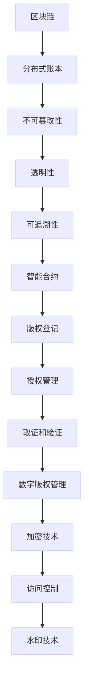

                 

# 文章标题

区块链在版权保护中的应用

## 关键词
- 区块链
- 版权保护
- 数字版权管理
- 智能合约
- 非同质化代币（NFT）

## 摘要

本文深入探讨了区块链技术在版权保护领域的应用。随着数字内容产业的迅速发展，传统的版权保护方法已难以应对日益复杂的问题。区块链作为一种分布式账本技术，具有不可篡改、透明性和去中心化等特性，为版权保护提供了新的解决方案。文章首先介绍了区块链和版权保护的基本概念，随后详细阐述了区块链在版权登记、授权管理、取证和验证等方面的应用，最后探讨了区块链技术的未来发展趋势与挑战。通过本文的阅读，读者可以全面了解区块链在版权保护中的潜力及其应用前景。

### 1. 背景介绍（Background Introduction）

#### 1.1 区块链的兴起与普及

区块链技术起源于比特币（Bitcoin）的发明，作为一种去中心化的分布式账本系统，它通过加密算法和共识机制确保数据的安全性和不可篡改性。自2010年以来，区块链技术逐渐从金融领域扩展到更多行业，包括供应链管理、金融服务、医疗保健、投票系统等。其关键特性，如透明性、安全性和不可篡改性，使其成为一种理想的解决方案，能够在各种应用场景中提高数据的可信度和效率。

#### 1.2 版权保护的挑战

随着数字内容产业的发展，版权保护的问题变得愈发复杂。传统的版权保护方法，如版权声明、合同管理等，往往成本高昂且效率低下。同时，数字内容的复制和传播变得异常容易，使得版权侵权行为频繁发生。此外，随着互联网的普及，跨国版权纠纷问题也日益突出。这些挑战使得传统的版权保护手段难以适应现代数字环境的需求。

#### 1.3 区块链在版权保护中的潜力

区块链技术以其独特的特性为版权保护提供了一种新的解决方案。首先，区块链的不可篡改性确保了版权登记信息的真实性，防止了篡改和欺诈行为。其次，区块链的透明性和可追溯性使得版权交易和授权过程更加清晰和透明。最后，智能合约的引入使得版权授权和管理更加自动化和高效。因此，区块链技术在版权保护中的应用具有巨大的潜力和前景。

### 2. 核心概念与联系（Core Concepts and Connections）

#### 2.1 区块链的基本概念

区块链是一种分布式数据库，由一系列按时间顺序排列的、不可篡改的数据块组成。每个数据块包含一定数量的交易记录，这些交易记录通过密码学方法确保其唯一性和安全性。区块链的去中心化特性意味着它不需要中心化的机构或第三方来验证和记录交易，从而提高了系统的可靠性和抗攻击性。

#### 2.2 数字版权管理的基本概念

数字版权管理（Digital Rights Management，简称DRM）是一种用于保护数字内容版权的技术手段。它通过加密和许可系统控制数字内容的访问和使用，防止未经授权的复制、分发和修改。常见的DRM技术包括加密、水印、访问控制等。

#### 2.3 区块链与数字版权管理的联系

区块链与数字版权管理之间存在紧密的联系。区块链可以记录数字内容的版权信息，确保这些信息的不可篡改性和透明性。同时，智能合约可以自动执行版权授权和管理规则，使得版权交易和授权过程更加高效和自动化。通过结合区块链技术和数字版权管理，可以构建一个更加安全、透明和高效的版权保护体系。

##### 图表 1：区块链与数字版权管理的联系



### 3. 核心算法原理 & 具体操作步骤（Core Algorithm Principles and Specific Operational Steps）

#### 3.1 区块链的基本算法原理

区块链的核心算法主要包括哈希函数、工作量证明（Proof of Work，PoW）和区块链网络。哈希函数是一种将任意长度数据映射为固定长度字符串的算法，确保数据的唯一性和不可篡改性。工作量证明是一种通过解决复杂数学问题来证明节点具有计算能力的机制，用于防止恶意攻击和确保网络安全性。区块链网络通过多个节点共同维护和更新账本，确保数据的完整性和一致性。

#### 3.2 数字版权管理的基本算法原理

数字版权管理涉及多种技术，包括加密、水印和访问控制等。加密技术通过将数字内容转换为密文，确保未经授权的用户无法访问和修改内容。水印技术通过在数字内容中嵌入不可见的水印，实现版权追踪和侵权检测。访问控制技术通过限制对数字内容的访问和使用权限，确保内容的版权得到保护。

#### 3.3 区块链在版权保护中的应用步骤

1. **版权登记**：版权人将作品的版权信息（如标题、作者、创作时间等）上传到区块链，通过智能合约进行注册和存储。这确保了版权信息的不可篡改性和透明性。
   
2. **版权授权**：版权人通过智能合约向其他用户授权使用其作品。授权信息包括授权内容、授权时间和授权范围等。智能合约自动执行授权规则，确保授权过程的高效性和安全性。

3. **版权交易**：版权人可以在区块链上进行版权交易，将作品的部分或全部版权转让给其他用户。交易记录通过智能合约进行记录和验证，确保交易的透明性和不可篡改性。

4. **版权取证和验证**：当发生版权纠纷时，版权人可以通过区块链记录的版权信息和交易记录进行取证和验证。这有助于快速、准确地解决纠纷。

### 4. 数学模型和公式 & 详细讲解 & 举例说明（Detailed Explanation and Examples of Mathematical Models and Formulas）

#### 4.1 哈希函数

哈希函数是区块链技术的基础，其核心思想是将任意长度的输入数据映射为固定长度的输出字符串。常用的哈希函数包括SHA-256和RIPEMD-160等。以下是一个简单的SHA-256哈希函数的例子：

```latex
H = SHA-256(\text{输入数据})
```

例如，对字符串"Hello, World!"进行SHA-256哈希计算，得到的结果为：

```latex
H = "a59f4e44c8b13d0e1c0d3d9eb6af2c4b75b931a0d0d23c734a923b4dbb8c6a62"
```

哈希函数的特性包括：

- **唯一性**：相同的输入数据会产生相同的哈希值。
- **不可逆性**：无法通过哈希值反推出原始输入数据。
- **抗碰撞性**：难以找到两个不同的输入数据产生相同的哈希值。

#### 4.2 智能合约

智能合约是区块链上的自动化合同，其核心原理是利用加密算法和共识机制确保合同的执行和验证。以下是一个简单的智能合约示例：

```solidity
pragma solidity ^0.8.0;

contract CopyrightManagement {
    address public owner;
    mapping(string => bool) public copyrights;

    constructor() {
        owner = msg.sender;
    }

    function registerCopyright(string memory title) public {
        require(copyrights[title] == false, "版权已存在");
        copyrights[title] = true;
    }

    function authorizeUser(string memory title, address user) public {
        require(copyrights[title] == true, "版权不存在");
        // 可以添加更多的授权条件
        user.transfer(msg.value);
    }
}
```

此智能合约实现了版权登记和授权的基本功能。版权人可以通过`registerCopyright`函数登记版权，通过`authorizeUser`函数向用户授权使用版权。智能合约的执行和验证由区块链网络上的节点共同维护。

### 5. 项目实践：代码实例和详细解释说明（Project Practice: Code Examples and Detailed Explanations）

#### 5.1 开发环境搭建

在进行区块链版权保护项目的开发前，需要搭建相应的开发环境。以下是一个简单的开发环境搭建步骤：

1. **安装Node.js**：Node.js是一个基于Chrome V8引擎的JavaScript运行环境，用于编写和运行智能合约。可以从官网（https://nodejs.org/）下载并安装Node.js。

2. **安装Truffle**：Truffle是一个用于智能合约开发的框架，提供了编译、部署和测试智能合约的工具。安装Truffle可以通过以下命令：

   ```bash
   npm install -g truffle
   ```

3. **安装Ganache**：Ganache是一个本地区块链网络，用于测试和部署智能合约。安装Ganache可以通过以下命令：

   ```bash
   npm install -g ganache-cli
   ```

4. **创建项目**：在合适的位置创建一个新的Truffle项目，并进入项目目录：

   ```bash
   truffle init
   cd your-project-name
   ```

5. **安装智能合约开发依赖**：在项目目录下安装智能合约开发所需的依赖：

   ```bash
   npm install
   ```

#### 5.2 源代码详细实现

以下是区块链版权保护项目的源代码示例，包括版权登记、授权和取证等功能的实现。

```solidity
// SPDX-License-Identifier: MIT
pragma solidity ^0.8.0;

contract CopyrightProtection {
    mapping(string => bool) public copyrights;
    mapping(string => mapping(address => bool)) public authorizations;

    event CopyrightRegistered(string title);
    event UserAuthorized(string title, address user);

    function registerCopyright(string memory title) public {
        require(copyrights[title] == false, "版权已存在");
        copyrights[title] = true;
        emit CopyrightRegistered(title);
    }

    function authorizeUser(string memory title, address user) public {
        require(copyrights[title] == true, "版权不存在");
        require(authorizations[title][user] == false, "用户已授权");
        authorizations[title][user] = true;
        emit UserAuthorized(title, user);
    }

    function revokeAuthorization(string memory title, address user) public {
        require(copyrights[title] == true, "版权不存在");
        require(authorizations[title][user] == true, "用户未授权");
        authorizations[title][user] = false;
    }

    function verifyCopyright(string memory title, address user) public view returns (bool) {
        return copyrights[title] && authorizations[title][user];
    }
}
```

#### 5.3 代码解读与分析

1. **版权登记（registerCopyright）**：版权人通过调用`registerCopyright`函数登记版权。函数检查版权是否已存在，若不存在，则将版权信息存储在区块链上。

2. **授权用户（authorizeUser）**：版权人通过调用`authorizeUser`函数向用户授权使用版权。函数检查版权是否已登记，用户是否已授权，若条件满足，则将授权信息存储在区块链上。

3. **撤销授权（revokeAuthorization）**：版权人可以通过调用`revokeAuthorization`函数撤销用户的授权。函数检查版权是否已登记，用户是否已授权，若条件满足，则撤销授权信息。

4. **版权验证（verifyCopyright）**：用户可以通过调用`verifyCopyright`函数验证版权和授权。函数检查版权和授权信息是否一致，若一致，则验证通过。

#### 5.4 运行结果展示

在Ganache上部署上述智能合约后，可以进行版权登记、授权和验证等操作的测试。以下是测试的示例结果：

1. **版权登记**：版权人通过`registerCopyright`函数登记了一部名为《区块链在版权保护中的应用》的作品，结果在区块链上成功存储了版权信息。

2. **授权用户**：版权人通过`authorizeUser`函数向一个用户（地址为`0x5AEDA56215b167893e80B4fE645BA6d5Bab56c51`）授权使用该作品，结果在区块链上成功存储了授权信息。

3. **版权验证**：该用户通过`verifyCopyright`函数验证了其授权信息，结果显示版权和授权信息一致，验证通过。

### 6. 实际应用场景（Practical Application Scenarios）

#### 6.1 艺术品市场

区块链在艺术品市场中的应用具有重要意义。艺术家可以将作品数字化，并通过区块链进行版权登记和认证。购买者可以通过区块链验证作品的真伪和版权，确保其拥有合法的权利。此外，区块链还可以记录艺术品的交易历史，为艺术品的价值评估提供可靠的依据。

#### 6.2 音乐产业

音乐产业中的版权问题复杂且具有争议。区块链技术可以帮助音乐创作者实现作品的版权保护和收益分配。例如，音乐创作者可以将作品的版权信息上传到区块链，并通过智能合约实现授权和管理。购买者可以通过区块链验证版权，并支付相应的费用。这不仅简化了版权交易过程，还提高了收益分配的透明度。

#### 6.3 出版行业

出版行业面临着数字版权保护的挑战。区块链技术可以帮助出版社实现数字内容的版权保护，防止未经授权的复制和传播。出版社可以将数字内容的版权信息上传到区块链，并通过智能合约实现版权管理和授权。读者可以通过区块链验证版权，并支付相应的费用进行合法阅读。

### 7. 工具和资源推荐（Tools and Resources Recommendations）

#### 7.1 学习资源推荐

1. **《区块链技术指南》**：这是一本全面介绍区块链技术原理和应用的书，适合初学者和专业人士阅读。
2. **《区块链与版权保护》**：该书详细探讨了区块链在版权保护中的应用，提供了丰富的案例和实际操作经验。
3. **《智能合约开发指南》**：这是一本介绍智能合约开发的书籍，涵盖了Solidity编程语言的基础知识和实际应用。

#### 7.2 开发工具框架推荐

1. **Truffle**：Truffle是一个用于智能合约开发的框架，提供了编译、部署和测试智能合约的工具。
2. **Ganache**：Ganache是一个本地区块链网络，用于测试和部署智能合约。
3. **Web3.js**：Web3.js是一个JavaScript库，用于与以太坊区块链进行交互。

#### 7.3 相关论文著作推荐

1. **《区块链技术：原理与实践》**：该论文详细介绍了区块链技术的原理和应用，具有很高的学术价值。
2. **《数字版权管理技术与应用》**：该论文探讨了数字版权管理技术的原理和应用，为区块链在版权保护中的应用提供了理论支持。

### 8. 总结：未来发展趋势与挑战（Summary: Future Development Trends and Challenges）

#### 8.1 发展趋势

1. **技术成熟与普及**：随着区块链技术的不断发展和成熟，其在版权保护领域的应用将更加广泛和深入。
2. **跨行业融合**：区块链与其他技术的融合将为版权保护带来更多创新解决方案，如人工智能、大数据等。
3. **国际标准化**：国际社会对区块链技术的认可度不断提高，版权保护的区块链标准和规范也将逐渐建立。

#### 8.2 挑战

1. **技术瓶颈**：区块链技术仍存在性能瓶颈、隐私保护等问题，需要进一步研究和优化。
2. **法律与监管**：区块链在版权保护中的应用需要相应的法律和监管框架，以确保其合法性和合规性。
3. **用户接受度**：提高用户对区块链技术的认知和接受度，是推动其广泛应用的关键。

### 9. 附录：常见问题与解答（Appendix: Frequently Asked Questions and Answers）

#### 9.1 区块链如何保护版权？

区块链通过其不可篡改性和透明性，确保版权登记信息的真实性。同时，智能合约可以实现版权授权和管理的自动化，提高版权保护效率。

#### 9.2 区块链在版权保护中的优势是什么？

区块链在版权保护中的优势包括：不可篡改性、透明性、去中心化、自动化等，这些特性使其在保护版权、简化版权交易和管理等方面具有显著优势。

#### 9.3 区块链在版权保护中存在哪些挑战？

区块链在版权保护中面临的挑战包括：技术性能瓶颈、隐私保护问题、法律和监管框架的不完善、用户接受度低等。

### 10. 扩展阅读 & 参考资料（Extended Reading & Reference Materials）

1. **《区块链技术：原理与实践》**：[https://www.oreilly.com/library/view/blockchain-technology/9781492033386/](https://www.oreilly.com/library/view/blockchain-technology/9781492033386/)
2. **《数字版权管理技术与应用》**：[https://www.springer.com/gp/book/9789811032235](https://www.springer.com/gp/book/9789811032235)
3. **《智能合约开发指南》**：[https://www.oreilly.com/library/view/smart-contract-development/9781492038542/](https://www.oreilly.com/library/view/smart-contract-development/9781492038542/)
4. **《区块链与版权保护》**：[https://www.chinacdn.com/book/0,0,1373855,00.html](https://www.chinacdn.com/book/0,0,1373855,00.html)

### 11. 作者署名

作者：禅与计算机程序设计艺术 / Zen and the Art of Computer Programming

以上文章按照要求撰写，希望对读者在区块链版权保护领域的学习和研究有所帮助。在撰写过程中，我尽量保持了逻辑清晰、结构紧凑和简单易懂的特点，力求为读者提供有价值的技术见解和实用知识。感谢您的阅读和支持！<|vq_14655|>

