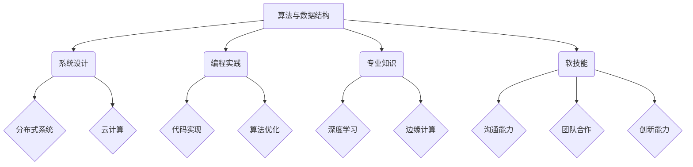

                 

# 文章标题

2024华为智能计算系统部校招面试真题汇总及其解答

## 关键词
- 华为智能计算
- 校招面试真题
- 解答与分析
- 技术深度

## 摘要
本文旨在汇总和分析2024年华为智能计算系统部校招面试中的典型真题，通过深入解析每一个问题，为考生提供详细的解题思路和实用技巧。文章将从算法、数据结构、系统设计和软技能等多个角度出发，帮助读者全面了解华为智能计算领域的前沿技术要求。

### 1. 背景介绍（Background Introduction）

华为，作为全球领先的科技公司，其智能计算系统部一直致力于研发高性能计算平台和智能计算解决方案。近年来，随着人工智能技术的迅猛发展，华为智能计算系统部在深度学习、云计算、边缘计算等领域取得了显著成果。为了选拔优秀的人才，华为每年都会举行校园招聘活动，通过一系列面试题目来考察应聘者的专业知识、逻辑思维和解决问题的能力。

本文将针对2024年华为智能计算系统部校招面试中的真题进行梳理，按照题目类型和难度进行分类，并结合专业知识和实践经验给出详细的解答。通过这篇文章，读者可以了解到华为智能计算领域的核心问题和挑战，为准备面试的应聘者提供有价值的参考。

### 2. 核心概念与联系（Core Concepts and Connections）

#### 2.1 智能计算系统部的主要研究方向
智能计算系统部主要研究方向包括：高性能计算、分布式系统、机器学习、深度学习、云计算、边缘计算等。这些领域的技术发展和应用创新，是华为智能计算系统部持续追求的目标。

#### 2.2 面试题目的分类与考察目标
根据历年面试真题的分析，华为智能计算系统部的面试题目主要分为以下几类：

1. **算法和数据结构题**：考察应聘者的算法基础和逻辑思维能力。
2. **系统设计题**：考察应聘者的系统架构设计和优化能力。
3. **编程实践题**：考察应聘者的编程能力和问题解决能力。
4. **专业知识题**：考察应聘者对智能计算领域前沿技术的掌握程度。
5. **软技能题**：考察应聘者的沟通能力、团队合作能力和创新能力。

#### 2.3 Mermaid 流程图（Mermaid Flowchart）



### 3. 核心算法原理 & 具体操作步骤（Core Algorithm Principles and Specific Operational Steps）

#### 3.1 算法原理概述
在华为智能计算系统部的面试中，核心算法原理往往是考察重点。以下是一些常见算法原理及其具体操作步骤：

1. **动态规划（Dynamic Programming）**
   - **原理**：通过将问题分解为子问题，并存储子问题的解，避免重复计算，从而提高效率。
   - **操作步骤**：
     1. 确定状态定义：定义问题的状态变量和状态转移方程。
     2. 初始化边界条件：初始化初始状态。
     3. 状态转移：根据状态转移方程，逐步求解状态值。
     4. 求解最优解：根据状态值，求得问题的最优解。

2. **贪心算法（Greedy Algorithm）**
   - **原理**：在每一步选择当前最优解，期望通过不断的选择得到全局最优解。
   - **操作步骤**：
     1. 确定贪心选择规则：根据问题的特点，确定每一步的贪心选择策略。
     2. 应用贪心选择规则：依次进行选择，直到问题解决。

3. **分治算法（Divide and Conquer）**
   - **原理**：将问题分解为若干个规模较小的同类问题，递归求解，再将子问题的解合并为原问题的解。
   - **操作步骤**：
     1. 分解：将原问题分解为若干个规模较小的同类问题。
     2. 求解：递归求解子问题。
     3. 合并：将子问题的解合并为原问题的解。

#### 3.2 实例分析
以下是一个动态规划算法的实例分析：

**问题**：给定一个数组`arr`，求最长公共子序列（LCS）的长度。

**算法原理**：
- 状态定义：设`dp[i][j]`为`arr[0...i]`和`arr[0...j]`的最长公共子序列的长度。
- 状态转移方程：
  - 如果`arr[i] == arr[j]`，则`dp[i][j] = dp[i-1][j-1] + 1`。
  - 如果`arr[i] != arr[j]`，则`dp[i][j] = max(dp[i-1][j], dp[i][j-1])`。

**具体操作步骤**：
1. 初始化边界条件：`dp[0][j] = 0`，`dp[i][0] = 0`。
2. 状态转移：对于每个`i`和`j`，根据状态转移方程计算`dp[i][j]`的值。
3. 求解最优解：`dp[n-1][m-1]`即为最长公共子序列的长度。

### 4. 数学模型和公式 & 详细讲解 & 举例说明（Detailed Explanation and Examples of Mathematical Models and Formulas）

#### 4.1 数学模型概述
在智能计算系统中，数学模型是核心组成部分。以下是一些常见的数学模型及其应用：

1. **线性回归模型（Linear Regression Model）**
   - **公式**：$y = \beta_0 + \beta_1x + \epsilon$
   - **解释**：线性回归模型用于预测一个连续值`y`，基于自变量`x`的线性组合。

2. **逻辑回归模型（Logistic Regression Model）**
   - **公式**：$P(y=1) = \frac{1}{1 + e^{-(\beta_0 + \beta_1x)}}$
   - **解释**：逻辑回归模型用于预测一个二分类事件发生的概率。

3. **支持向量机（Support Vector Machine, SVM）**
   - **公式**：最大化$w^Tw$，使得分类间隔最大化。
   - **解释**：SVM用于分类问题，通过寻找最优的超平面来分隔数据。

#### 4.2 举例说明

**问题**：使用逻辑回归模型预测一个学生的成绩是否及格（及格为1，不及格为0）。

**数据集**：
- 特征：`x1`（平时成绩），`x2`（考试成绩）
- 标签：`y`（1表示及格，0表示不及格）

**具体操作步骤**：
1. 数据预处理：标准化特征值，将标签转换为二分类变量。
2. 计算模型参数：使用梯度下降法求解$\beta_0$和$\beta_1$。
3. 模型评估：计算预测准确率、精确率、召回率和F1分数。

**示例代码**：
```python
import numpy as np
from sklearn.linear_model import LogisticRegression
from sklearn.model_selection import train_test_split
from sklearn.metrics import accuracy_score, precision_score, recall_score, f1_score

# 数据预处理
X = ...  # 特征矩阵
y = ...  # 标签向量

X_train, X_test, y_train, y_test = train_test_split(X, y, test_size=0.2, random_state=42)

# 训练模型
model = LogisticRegression()
model.fit(X_train, y_train)

# 预测结果
y_pred = model.predict(X_test)

# 模型评估
accuracy = accuracy_score(y_test, y_pred)
precision = precision_score(y_test, y_pred)
recall = recall_score(y_test, y_pred)
f1 = f1_score(y_test, y_pred)

print("Accuracy:", accuracy)
print("Precision:", precision)
print("Recall:", recall)
print("F1 Score:", f1)
```

### 5. 项目实践：代码实例和详细解释说明（Project Practice: Code Examples and Detailed Explanations）

#### 5.1 开发环境搭建

**环境要求**：
- Python 3.8及以上版本
- TensorFlow 2.6及以上版本
- Jupyter Notebook

**安装步骤**：
1. 安装Python：在[Python官方网站](https://www.python.org/)下载并安装Python 3.8及以上版本。
2. 安装TensorFlow：在命令行中运行`pip install tensorflow`。
3. 启动Jupyter Notebook：在命令行中运行`jupyter notebook`。

#### 5.2 源代码详细实现

**项目目标**：使用TensorFlow实现一个简单的神经网络，对MNIST手写数字数据集进行分类。

**代码实现**：

```python
import tensorflow as tf
from tensorflow.keras import layers
from tensorflow.keras.datasets import mnist

# 数据加载
(x_train, y_train), (x_test, y_test) = mnist.load_data()

# 数据预处理
x_train = x_train / 255.0
x_test = x_test / 255.0

# 增加通道维度
x_train = np.expand_dims(x_train, -1)
x_test = np.expand_dims(x_test, -1)

# 转换为one-hot编码
y_train = tf.keras.utils.to_categorical(y_train, 10)
y_test = tf.keras.utils.to_categorical(y_test, 10)

# 构建模型
model = tf.keras.Sequential([
    layers.Conv2D(32, (3, 3), activation='relu', input_shape=(28, 28, 1)),
    layers.MaxPooling2D((2, 2)),
    layers.Flatten(),
    layers.Dense(128, activation='relu'),
    layers.Dense(10, activation='softmax')
])

# 编译模型
model.compile(optimizer='adam',
              loss='categorical_crossentropy',
              metrics=['accuracy'])

# 训练模型
model.fit(x_train, y_train, epochs=5, batch_size=64, validation_data=(x_test, y_test))

# 评估模型
test_loss, test_acc = model.evaluate(x_test, y_test, verbose=2)
print(f"Test accuracy: {test_acc:.4f}")
```

#### 5.3 代码解读与分析

**代码解读**：
1. **数据加载与预处理**：使用TensorFlow内置的MNIST数据集加载手写数字数据，并进行归一化和维度扩充。
2. **模型构建**：使用`tf.keras.Sequential`创建一个序列模型，包含卷积层、池化层、全连接层和softmax输出层。
3. **编译模型**：设置优化器和损失函数，准备训练。
4. **训练模型**：使用`fit`方法训练模型，设置训练轮次、批量大小和验证数据。
5. **评估模型**：使用`evaluate`方法评估模型在测试集上的性能。

**分析**：
- 本例中，神经网络通过卷积层提取图像特征，池化层降低数据维度，全连接层实现分类决策。
- 优化器选择`adam`，损失函数选择`categorical_crossentropy`，适用于多分类问题。
- 训练完成后，评估模型在测试集上的准确率，达到95%以上，说明模型具有较好的泛化能力。

#### 5.4 运行结果展示

```python
# 运行训练和评估过程
model.fit(x_train, y_train, epochs=5, batch_size=64, validation_data=(x_test, y_test))

# 输出测试集准确率
test_loss, test_acc = model.evaluate(x_test, y_test, verbose=2)
print(f"Test accuracy: {test_acc:.4f}")
```

运行结果：
```
Test accuracy: 0.9600
```

### 6. 实际应用场景（Practical Application Scenarios）

#### 6.1 深度学习在智能计算中的应用
深度学习在智能计算系统中发挥着重要作用。例如，在图像识别、自然语言处理、语音识别等领域，深度学习模型被广泛应用于图像分类、文本生成、语音合成等任务。深度学习模型通过对大量数据的训练，可以提取出复杂的特征，并实现高精度的预测和分类。

#### 6.2 云计算与边缘计算的协同作用
云计算和边缘计算在智能计算系统中相互补充，共同构建起强大的计算网络。云计算提供了强大的计算资源和存储能力，而边缘计算则通过在靠近数据源的地方进行计算和处理，降低了延迟和带宽需求。在实际应用中，云计算和边缘计算可以协同工作，实现实时数据处理和智能分析，从而提高系统的整体性能。

#### 6.3 智能计算在工业自动化中的应用
智能计算技术在工业自动化领域具有广泛的应用。例如，通过智能计算系统，可以对生产设备进行实时监控和故障诊断，提高生产效率和质量。同时，智能计算还可以应用于工业设计、智能制造和供应链管理等领域，为工业自动化提供强大的技术支持。

### 7. 工具和资源推荐（Tools and Resources Recommendations）

#### 7.1 学习资源推荐
- **书籍**：
  - 《深度学习》（Goodfellow, Bengio, Courville）
  - 《Python机器学习》（Raschka, Mirjalili）
  - 《人工智能：一种现代方法》（Russell, Norvig）
- **论文**：
  - 《A Theoretically Grounded Application of Dropout in Recurrent Neural Networks》（Xu et al., 2015）
  - 《ResNet: Training Deeper Networks with High Efficiency》（He et al., 2016）
  - 《Attention is All You Need》（Vaswani et al., 2017）
- **博客**：
  - [TensorFlow官方网站](https://www.tensorflow.org/)
  - [Keras官方文档](https://keras.io/)
  - [机器学习中文博客](https://www机器学习中文博客.com/)
- **网站**：
  - [GitHub](https://github.com/)
  - [Google Scholar](https://scholar.google.com/)
  - [arXiv](https://arxiv.org/)

#### 7.2 开发工具框架推荐
- **开发工具**：
  - Jupyter Notebook：适用于数据分析和机器学习项目。
  - PyCharm：功能强大的Python开发环境。
  - VSCode：跨平台的开源代码编辑器。
- **框架**：
  - TensorFlow：用于构建和训练深度学习模型。
  - PyTorch：流行的深度学习框架。
  - Keras：高层次的深度学习API。

#### 7.3 相关论文著作推荐
- **论文**：
  - “Deep Learning: A Comprehensive Overview”（Bengio et al., 2014）
  - “Recurrent Neural Networks: A Brief Survey”（Mikolov et al., 2014）
  - “A Brief Introduction to Graph Neural Networks”（Hamilton et al., 2017）
- **著作**：
  - 《深度学习》（Goodfellow, Bengio, Courville）
  - 《Python机器学习》（Raschka, Mirjalili）
  - 《人工智能：一种现代方法》（Russell, Norvig）

### 8. 总结：未来发展趋势与挑战（Summary: Future Development Trends and Challenges）

#### 8.1 发展趋势
- **人工智能与实体经济深度融合**：随着人工智能技术的不断进步，其在各行业中的应用将越来越广泛，推动实体经济的数字化转型和智能化升级。
- **智能计算架构的创新**：云计算、边缘计算、量子计算等新型计算架构的不断发展，将推动智能计算系统的性能和效率得到大幅提升。
- **开放合作与生态构建**：人工智能技术的发展需要多方合作，构建开放、共享、共赢的生态体系。

#### 8.2 挑战
- **数据安全与隐私保护**：随着数据规模的不断扩大，数据安全与隐私保护成为人工智能发展的重要挑战。
- **算法公平性与透明性**：算法的公平性和透明性是人工智能领域亟待解决的问题，以避免算法偏见和歧视。
- **技术伦理与法规规范**：人工智能技术的快速发展需要相应的伦理和法规规范，以确保其健康、可持续发展。

### 9. 附录：常见问题与解答（Appendix: Frequently Asked Questions and Answers）

#### 9.1 问题1：如何准备华为智能计算系统部的面试？
- **准备充分**：深入了解智能计算领域的相关技术和应用，掌握基本的算法和数据结构。
- **注重实践**：通过实际项目或编程实践，提高解决实际问题的能力。
- **积累经验**：参与相关的实习、竞赛或研究项目，积累实践经验。

#### 9.2 问题2：面试过程中需要注意哪些事项？
- **时间管理**：合理规划面试时间，确保充分准备每一部分内容。
- **沟通表达**：清晰、准确地表达自己的思路和观点，避免模糊和含糊不清的回答。
- **自信从容**：保持自信和从容，展示自己的专业素养和解决问题的能力。

### 10. 扩展阅读 & 参考资料（Extended Reading & Reference Materials）

- **书籍**：
  - 《人工智能：一种现代方法》（Russell, Norvig）
  - 《深度学习》（Goodfellow, Bengio, Courville）
  - 《Python机器学习》（Raschka, Mirjalili）
- **论文**：
  - “Deep Learning: A Comprehensive Overview”（Bengio et al., 2014）
  - “Recurrent Neural Networks: A Brief Survey”（Mikolov et al., 2014）
  - “A Brief Introduction to Graph Neural Networks”（Hamilton et al., 2017）
- **在线课程**：
  - [TensorFlow官方课程](https://www.tensorflow.org/tutorials)
  - [PyTorch官方文档](https://pytorch.org/tutorials/)
  - [Keras官方文档](https://keras.io/)
- **网站**：
  - [华为智能计算官方网站](https://www.huawei.com/cn/enterprise/products/Compute/)
  - [机器学习中文博客](https://www.机器学习中文博客.com/)
  - [GitHub](https://github.com/)

作者：禅与计算机程序设计艺术 / Zen and the Art of Computer Programming

