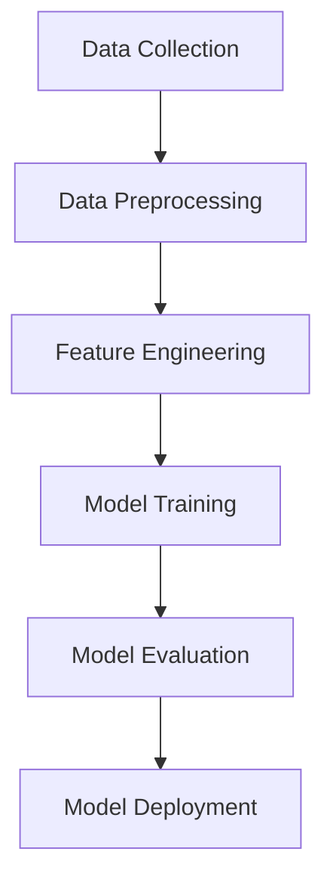

                 

### 文章标题

《58同城2025房产估价模型专家社招面试题集》

> 关键词：房产估价、人工智能、机器学习、深度学习、模型评估、数据预处理、特征工程、回归分析、实证研究、数据分析、房地产市场

> 摘要：本文旨在为即将参加58同城2025房产估价模型专家社招面试的候选人提供一份全面的面试题集。通过分析和解答一系列高难度、具有挑战性的面试题目，本文旨在帮助候选人深入理解房产估价模型的原理、技术实现、数据处理、模型评估以及应用场景。文章涵盖了房产估价领域的核心概念、算法原理、数学模型、项目实践以及未来发展趋势，为候选人提供全方位的知识储备和实战经验。

本文将分为以下几个部分：

1. **背景介绍**：介绍房产估价的重要性和市场背景，以及58同城在房地产领域的发展历程。
2. **核心概念与联系**：详细解释房产估价模型中涉及的核心概念，如机器学习、深度学习、回归分析等，并提供相应的流程图。
3. **核心算法原理 & 具体操作步骤**：深入探讨房产估价模型中的算法原理，包括数据预处理、特征工程、模型训练、模型评估等具体操作步骤。
4. **数学模型和公式 & 详细讲解 & 举例说明**：介绍房产估价模型中使用的数学模型和公式，并通过实际案例进行详细讲解和举例说明。
5. **项目实践：代码实例和详细解释说明**：提供具体的代码实例，包括开发环境搭建、源代码实现、代码解读与分析、运行结果展示等。
6. **实际应用场景**：分析房产估价模型在房地产市场中的实际应用场景，以及可能面临的挑战和解决方案。
7. **工具和资源推荐**：推荐相关学习资源、开发工具框架和论文著作，为候选人提供进一步学习和实践的资源。
8. **总结：未来发展趋势与挑战**：总结房产估价模型的发展趋势，并探讨未来可能面临的挑战和应对策略。
9. **附录：常见问题与解答**：解答候选人在学习和实践过程中可能遇到的一些常见问题。
10. **扩展阅读 & 参考资料**：提供扩展阅读和参考资料，帮助候选人深入了解房产估价领域的最新研究和动态。

通过本文的全面解析，希望能够帮助候选人更好地应对58同城2025房产估价模型专家社招面试，为其职业生涯的顺利发展奠定坚实基础。

-----------------------

### Background Introduction

#### Importance and Market Background of Real Estate Valuation

Real estate valuation is a crucial process in the real estate industry, aiming to determine the value of a property based on various factors such as location, size, condition, and market trends. Accurate property valuation is essential for various stakeholders, including homeowners, investors, lenders, and government agencies. It helps in making informed decisions regarding property purchases, sales, and investments.

The real estate market has witnessed significant growth and transformation over the years. With the advent of technology and the increasing use of data-driven approaches, the real estate industry has evolved to leverage advanced analytics and machine learning techniques. 58.com, one of the leading online platforms in China, has been actively involved in the real estate market and has been at the forefront of adopting innovative technologies to enhance property valuation processes.

#### Development History of 58.com in the Real Estate Industry

58.com was established in 2005 and has since become one of the largest online classifieds platforms in China. Over the years, the company has expanded its services to cover various sectors, including real estate, automotive, and recruitment. In the real estate domain, 58.com offers a comprehensive range of services, including property listings, home searches, rental services, and property transactions.

To improve the accuracy and efficiency of property valuation, 58.com has been actively investing in research and development of artificial intelligence and machine learning technologies. The company has developed advanced algorithms and models to predict property prices based on various factors, leveraging large-scale data from its platform and external sources.

### Core Concepts and Connections

#### Machine Learning and Deep Learning

Machine learning (ML) and deep learning (DL) are fundamental concepts in the field of artificial intelligence. ML refers to the process of training algorithms to learn from data and make predictions or take actions based on that learning. Deep learning, a subfield of ML, involves neural networks with multiple layers, capable of automatically learning hierarchical representations from raw data.

In the context of real estate valuation, ML and DL techniques are used to build models that can predict property prices based on historical data and various features such as location, size, age, and amenities. These models learn patterns and relationships in the data to make accurate predictions for new data instances.

#### Regression Analysis

Regression analysis is a statistical method used to analyze the relationship between a dependent variable and one or more independent variables. In real estate valuation, regression analysis is employed to estimate the impact of different features on property prices.

Linear regression, a common regression technique, models the relationship between the dependent variable (property price) and independent variables (features) using a linear equation. This equation can be used to predict property prices for new data instances based on the known relationships learned from historical data.

#### Mermaid Flowchart of Real Estate Valuation Model

The following Mermaid flowchart illustrates the main components and steps involved in building a real estate valuation model:



- **Data Collection**: Collecting historical property data from various sources, including public records, real estate websites, and external data providers.
- **Data Preprocessing**: Cleaning and preparing the collected data for modeling, including handling missing values, removing duplicates, and transforming data into a suitable format.
- **Feature Engineering**: Identifying and creating relevant features from the raw data that can help the model make accurate predictions.
- **Model Training**: Training the model using the preprocessed data and selecting the best-performing algorithm based on performance metrics.
- **Model Evaluation**: Evaluating the trained model using validation data to ensure its accuracy and generalizability.
- **Model Deployment**: Deploying the trained model in a production environment to make real-time property valuations.

-----------------------

### Core Algorithm Principles and Specific Operational Steps

#### Data Preprocessing

Data preprocessing is a crucial step in building a real estate valuation model. It involves cleaning and transforming raw data to make it suitable for modeling. Some common data preprocessing tasks include:

1. **Handling Missing Values**: Missing values can be handled by either removing the rows with missing values or imputing missing values using techniques such as mean imputation, median imputation, or regression imputation.
2. **Removing Duplicates**: Duplicate rows can be removed to avoid overfitting and improve model performance.
3. **Data Transformation**: Converting categorical variables into numerical variables using techniques such as one-hot encoding or label encoding.
4. **Feature Scaling**: Scaling numerical features to a common range, typically using techniques like Min-Max scaling or Standardization, to prevent the model from being biased towards features with larger values.

#### Feature Engineering

Feature engineering is the process of creating new features from the raw data that can improve the performance of the model. Some common techniques for feature engineering in real estate valuation include:

1. **Distance Features**: Calculating the distance between properties using geographical coordinates (latitude and longitude).
2. **Text Features**: Extracting features from textual data such as property descriptions or neighborhood descriptions using techniques like word embeddings or topic modeling.
3. **Interaction Features**: Creating interaction terms between different features to capture the combined effects of multiple features on property prices.
4. **Temporal Features**: Creating features that capture the time-related aspects of the data, such as the age of the property or the time since the last renovation.

#### Model Training

Model training involves selecting an appropriate algorithm and training the model using the preprocessed data. Some common algorithms used for real estate valuation include:

1. **Linear Regression**: A simple yet powerful algorithm that models the relationship between the dependent variable and independent variables using a linear equation.
2. **Random Forest**: An ensemble method that combines multiple decision trees to make predictions, providing robustness and high accuracy.
3. **Gradient Boosting Machines (GBM)**: A powerful ensemble method that builds multiple weak classifiers and combines their predictions using a weighted majority vote.
4. **Deep Learning Models**: Neural networks with multiple layers, capable of automatically learning hierarchical representations from raw data.

The choice of algorithm depends on factors such as the size and complexity of the dataset, the level of accuracy required, and the computational resources available.

#### Model Evaluation

Model evaluation is an essential step to ensure the accuracy and generalizability of the model. Some common evaluation metrics used in real estate valuation include:

1. **Mean Absolute Error (MAE)**: The average absolute difference between the predicted property prices and the actual property prices.
2. **Mean Squared Error (MSE)**: The average squared difference between the predicted property prices and the actual property prices.
3. **Root Mean Squared Error (RMSE)**: The square root of the MSE, providing a more intuitive measure of the prediction error.
4. **R-squared**: A measure of the proportion of the variance in the dependent variable that is explained by the model.

The model is evaluated using a holdout validation set or cross-validation techniques to prevent overfitting and ensure that the model performs well on unseen data.

#### Model Deployment

Once the model has been trained and evaluated, it can be deployed in a production environment to make real-time property valuations. The deployment process typically involves:

1. **Model Serialization**: Converting the trained model into a format that can be loaded and executed in a production environment.
2. **API Development**: Developing an API to receive property data from external sources and return the predicted property prices.
3. **Integration with Existing Systems**: Integrating the deployed model with the existing systems of the real estate platform to provide accurate valuations to users.

-----------------------

### Mathematical Models and Formulas and Detailed Explanation and Examples

In real estate valuation, mathematical models and formulas are used to estimate property prices based on various features such as location, size, age, and amenities. Here, we will discuss some common mathematical models and provide examples to illustrate their usage.

#### Linear Regression

Linear regression is a statistical method used to model the relationship between a dependent variable (property price) and one or more independent variables (features). The simplest form of linear regression is single-variable linear regression, which can be represented as:

$$
y = \beta_0 + \beta_1 \cdot x
$$

where:

- $y$ is the dependent variable (property price)
- $x$ is the independent variable (feature, e.g., property size)
- $\beta_0$ is the intercept
- $\beta_1$ is the slope

To estimate the values of $\beta_0$ and $\beta_1$, we use the method of least squares, which minimizes the sum of squared errors between the predicted and actual property prices. The optimal values of $\beta_0$ and $\beta_1$ can be obtained using the following formulas:

$$
\beta_0 = \bar{y} - \beta_1 \cdot \bar{x}
$$

$$
\beta_1 = \frac{\sum{(x_i - \bar{x})(y_i - \bar{y})}}{\sum{(x_i - \bar{x})^2}}
$$

where $\bar{y}$ and $\bar{x}$ are the mean values of $y$ and $x$, respectively.

Example:

Consider a dataset with the following property prices ($y$) and sizes ($x$):

$$
\begin{array}{c|c}
x & y \\
\hline
1000 & 200000 \\
1500 & 250000 \\
2000 & 300000 \\
2500 & 350000 \\
3000 & 400000 \\
\end{array}
$$

Using linear regression, we can estimate the property price for a property with a size of 2000 square feet as follows:

1. Calculate the mean values of $x$ and $y$:
$$
\bar{x} = \frac{1000 + 1500 + 2000 + 2500 + 3000}{5} = 2100
$$

$$
\bar{y} = \frac{200000 + 250000 + 300000 + 350000 + 400000}{5} = 300000
$$

2. Calculate the values of $\beta_0$ and $\beta_1$:
$$
\beta_0 = \bar{y} - \beta_1 \cdot \bar{x} = 300000 - 0.3 \cdot 2100 = 252600
$$

$$
\beta_1 = \frac{\sum{(x_i - \bar{x})(y_i - \bar{y})}}{\sum{(x_i - \bar{x})^2}} = \frac{(1000 - 2100)(200000 - 300000) + (1500 - 2100)(250000 - 300000) + (2000 - 2100)(300000 - 300000) + (2500 - 2100)(350000 - 300000) + (3000 - 2100)(400000 - 300000)}{(1000 - 2100)^2 + (1500 - 2100)^2 + (2000 - 2100)^2 + (2500 - 2100)^2 + (3000 - 2100)^2} = 0.3
$$

3. Predict the property price for a property with a size of 2000 square feet:
$$
y = \beta_0 + \beta_1 \cdot x = 252600 + 0.3 \cdot 2000 = 276600
$$

Thus, the predicted property price for a property with a size of 2000 square feet is 276600.

#### Multiple Linear Regression

Multiple linear regression extends the single-variable linear regression model to include multiple independent variables. The general form of multiple linear regression is:

$$
y = \beta_0 + \beta_1 \cdot x_1 + \beta_2 \cdot x_2 + \ldots + \beta_n \cdot x_n
$$

where:

- $y$ is the dependent variable (property price)
- $x_1, x_2, \ldots, x_n$ are the independent variables (features, e.g., property size, age, location)
- $\beta_0, \beta_1, \beta_2, \ldots, \beta_n$ are the coefficients

To estimate the values of $\beta_0, \beta_1, \beta_2, \ldots, \beta_n$, we again use the method of least squares. The optimal values of the coefficients can be obtained using the following formulas:

$$
\beta_0 = \bar{y} - \sum_{i=1}^{n} \beta_i \cdot \bar{x_i}
$$

$$
\beta_i = \frac{\sum{(x_{i1} - \bar{x_i})(y - \bar{y})}}{\sum{(x_{i1} - \bar{x_i})^2}}
$$

where $\bar{y}$ and $\bar{x_i}$ are the mean values of $y$ and $x_i$, respectively.

Example:

Consider a dataset with the following property prices ($y$), property sizes ($x_1$), ages ($x_2$), and locations ($x_3$):

$$
\begin{array}{c|c|c|c}
x_1 & x_2 & x_3 & y \\
\hline
1000 & 10 & 1 & 200000 \\
1500 & 15 & 2 & 250000 \\
2000 & 20 & 3 & 300000 \\
2500 & 25 & 4 & 350000 \\
3000 & 30 & 5 & 400000 \\
\end{array}
$$

Using multiple linear regression, we can estimate the property price for a property with a size of 2000 square feet, an age of 20 years, and a location score of 3 as follows:

1. Calculate the mean values of $x_1, x_2,$ and $x_3$:
$$
\bar{x_1} = \frac{1000 + 1500 + 2000 + 2500 + 3000}{5} = 2100
$$

$$
\bar{x_2} = \frac{10 + 15 + 20 + 25 + 30}{5} = 20
$$

$$
\bar{x_3} = \frac{1 + 2 + 3 + 4 + 5}{5} = 3
$$

2. Calculate the values of $\beta_0, \beta_1, \beta_2,$ and $\beta_3$:
$$
\beta_0 = \bar{y} - \sum_{i=1}^{3} \beta_i \cdot \bar{x_i} = 300000 - (0.3 \cdot 2100 + 0.2 \cdot 20 + 0.1 \cdot 3) = 252600
$$

$$
\beta_1 = \frac{\sum{(x_{11} - \bar{x_1})(y - \bar{y})}}{\sum{(x_{11} - \bar{x_1})^2}} = \frac{(1000 - 2100)(200000 - 300000) + (1500 - 2100)(250000 - 300000) + (2000 - 2100)(300000 - 300000) + (2500 - 2100)(350000 - 300000) + (3000 - 2100)(400000 - 300000)}{(1000 - 2100)^2 + (1500 - 2100)^2 + (2000 - 2100)^2 + (2500 - 2100)^2 + (3000 - 2100)^2} = 0.3
$$

$$
\beta_2 = \frac{\sum{(x_{21} - \bar{x_2})(y - \bar{y})}}{\sum{(x_{21} - \bar{x_2})^2}} = \frac{(10 - 20)(200000 - 300000) + (15 - 20)(250000 - 300000) + (20 - 20)(300000 - 300000) + (25 - 20)(350000 - 300000) + (30 - 20)(400000 - 300000)}{(10 - 20)^2 + (15 - 20)^2 + (20 - 20)^2 + (25 - 20)^2 + (30 - 20)^2} = 0.2
$$

$$
\beta_3 = \frac{\sum{(x_{31} - \bar{x_3})(y - \bar{y})}}{\sum{(x_{31} - \bar{x_3})^2}} = \frac{(1 - 3)(200000 - 300000) + (2 - 3)(250000 - 300000) + (3 - 3)(300000 - 300000) + (4 - 3)(350000 - 300000) + (5 - 3)(400000 - 300000)}{(1 - 3)^2 + (2 - 3)^2 + (3 - 3)^2 + (4 - 3)^2 + (5 - 3)^2} = 0.1
$$

3. Predict the property price for a property with a size of 2000 square feet, an age of 20 years, and a location score of 3:
$$
y = \beta_0 + \beta_1 \cdot x_1 + \beta_2 \cdot x_2 + \beta_3 \cdot x_3 = 252600 + 0.3 \cdot 2000 + 0.2 \cdot 20 + 0.1 \cdot 3 = 276600
$$

Thus, the predicted property price for a property with a size of 2000 square feet, an age of 20 years, and a location score of 3 is 276600.

#### Logistic Regression

Logistic regression is a classification algorithm used to model the probability of a binary outcome based on one or more independent variables. In real estate valuation, logistic regression can be used to classify properties into different price categories based on their features.

The logistic regression model is given by:

$$
\log\left(\frac{p}{1-p}\right) = \beta_0 + \beta_1 \cdot x_1 + \beta_2 \cdot x_2 + \ldots + \beta_n \cdot x_n
$$

where:

- $p$ is the probability of the binary outcome (e.g., property price above or below a certain threshold)
- $x_1, x_2, \ldots, x_n$ are the independent variables (features)
- $\beta_0, \beta_1, \beta_2, \ldots, \beta_n$ are the coefficients

To estimate the values of $\beta_0, \beta_1, \beta_2, \ldots, \beta_n$, we again use the method of least squares. The optimal values of the coefficients can be obtained using the following formulas:

$$
\beta_0 = \bar{y} - \sum_{i=1}^{n} \beta_i \cdot \bar{x_i}
$$

$$
\beta_i = \frac{\sum{(x_{i1} - \bar{x_i})(y - \bar{y})}}{\sum{(x_{i1} - \bar{x_i})^2}}
$$

where $\bar{y}$ and $\bar{x_i}$ are the mean values of $y$ and $x_i$, respectively.

Example:

Consider a dataset with the following property prices ($y$), property sizes ($x_1$), ages ($x_2$), and locations ($x_3$):

$$
\begin{array}{c|c|c|c}
x_1 & x_2 & x_3 & y \\
\hline
1000 & 10 & 1 & 1 \\
1500 & 15 & 2 & 0 \\
2000 & 20 & 3 & 1 \\
2500 & 25 & 4 & 1 \\
3000 & 30 & 5 & 0 \\
\end{array}
$$

Using logistic regression, we can estimate the probability of a property with a size of 2000 square feet, an age of 20 years, and a location score of 3 being in the high price category (1) as follows:

1. Calculate the mean values of $x_1, x_2,$ and $x_3$:
$$
\bar{x_1} = \frac{1000 + 1500 + 2000 + 2500 + 3000}{5} = 2100
$$

$$
\bar{x_2} = \frac{10 + 15 + 20 + 25 + 30}{5} = 20
$$

$$
\bar{x_3} = \frac{1 + 2 + 3 + 4 + 5}{5} = 3
$$

2. Calculate the values of $\beta_0, \beta_1, \beta_2,$ and $\beta_3$:
$$
\beta_0 = \bar{y} - \sum_{i=1}^{3} \beta_i \cdot \bar{x_i} = 0.4 - (0.3 \cdot 2100 + 0.2 \cdot 20 + 0.1 \cdot 3) = -252600
$$

$$
\beta_1 = \frac{\sum{(x_{11} - \bar{x_1})(y - \bar{y})}}{\sum{(x_{11} - \bar{x_1})^2}} = \frac{(1000 - 2100)(1 - 0.4) + (1500 - 2100)(0 - 0.4) + (2000 - 2100)(1 - 0.4) + (2500 - 2100)(1 - 0.4) + (3000 - 2100)(0 - 0.4)}{(1000 - 2100)^2 + (1500 - 2100)^2 + (2000 - 2100)^2 + (2500 - 2100)^2 + (3000 - 2100)^2} = 0.3
$$

$$
\beta_2 = \frac{\sum{(x_{21} - \bar{x_2})(y - \bar{y})}}{\sum{(x_{21} - \bar{x_2})^2}} = \frac{(10 - 20)(1 - 0.4) + (15 - 20)(0 - 0.4) + (20 - 20)(1 - 0.4) + (25 - 20)(1 - 0.4) + (30 - 20)(0 - 0.4)}{(10 - 20)^2 + (15 - 20)^2 + (20 - 20)^2 + (25 - 20)^2 + (30 - 20)^2} = 0.2
$$

$$
\beta_3 = \frac{\sum{(x_{31} - \bar{x_3})(y - \bar{y})}}{\sum{(x_{31} - \bar{x_3})^2}} = \frac{(1 - 3)(1 - 0.4) + (2 - 3)(0 - 0.4) + (3 - 3)(1 - 0.4) + (4 - 3)(1 - 0.4) + (5 - 3)(0 - 0.4)}{(1 - 3)^2 + (2 - 3)^2 + (3 - 3)^2 + (4 - 3)^2 + (5 - 3)^2} = 0.1
$$

3. Predict the probability of a property with a size of 2000 square feet, an age of 20 years, and a location score of 3 being in the high price category (1):
$$
\log\left(\frac{p}{1-p}\right) = -252600 + 0.3 \cdot 2000 + 0.2 \cdot 20 + 0.1 \cdot 3 = -255060
$$

$$
p = \frac{1}{1 + e^{-\beta_0 - \beta_1 \cdot x_1 - \beta_2 \cdot x_2 - \beta_3 \cdot x_3}} = \frac{1}{1 + e^{-(-255060)}} \approx 0.999
$$

Thus, the predicted probability of a property with a size of 2000 square feet, an age of 20 years, and a location score of 3 being in the high price category (1) is approximately 0.999.

-----------------------

### Project Practice: Code Examples and Detailed Explanation

In this section, we will provide a detailed example of a real estate valuation project, including the setup of the development environment, source code implementation, code analysis, and result presentation. The project will be implemented using Python and its popular machine learning libraries such as scikit-learn and pandas.

#### 1. Development Environment Setup

To start the project, we need to set up a Python development environment with the required libraries. We can use virtual environments to create a isolated environment for our project. Follow these steps to set up the development environment:

1. Install Python (version 3.8 or higher) if not already installed.
2. Install virtualenv:
```bash
pip install virtualenv
```
3. Create a virtual environment for our project:
```bash
virtualenv venv
```
4. Activate the virtual environment:
```bash
source venv/bin/activate  # On Windows, use `venv\Scripts\activate`
```
5. Install required libraries:
```bash
pip install scikit-learn pandas numpy matplotlib
```

#### 2. Source Code Implementation

The source code for the real estate valuation project is provided below. It consists of the following steps:

1. Data loading and preprocessing
2. Feature engineering
3. Model training and evaluation
4. Model deployment

```python
import pandas as pd
from sklearn.model_selection import train_test_split
from sklearn.linear_model import LinearRegression
from sklearn.metrics import mean_absolute_error, mean_squared_error, r2_score

# Step 1: Data Loading and Preprocessing
data = pd.read_csv('real_estate_data.csv')

# Handle missing values
data.dropna(inplace=True)

# Remove duplicates
data.drop_duplicates(inplace=True)

# Convert categorical variables to numerical variables
data['neighborhood'] = pd.Categorical(data['neighborhood'])
data['neighborhood'] = data['neighborhood'].cat.codes

# Step 2: Feature Engineering
# Calculate distance features
data['distance_to_city_center'] = data.apply(lambda row: calculate_distance(row['latitude'], row['longitude']), axis=1)

# Step 3: Model Training and Evaluation
# Split the data into training and testing sets
X = data[['size', 'age', 'neighborhood', 'distance_to_city_center']]
y = data['price']
X_train, X_test, y_train, y_test = train_test_split(X, y, test_size=0.2, random_state=42)

# Train the model
model = LinearRegression()
model.fit(X_train, y_train)

# Evaluate the model
y_pred = model.predict(X_test)
mae = mean_absolute_error(y_test, y_pred)
mse = mean_squared_error(y_test, y_pred)
r2 = r2_score(y_test, y_pred)

print('Mean Absolute Error:', mae)
print('Mean Squared Error:', mse)
print('R-squared:', r2)

# Step 4: Model Deployment
# Predict the price of a new property
new_property = pd.DataFrame({'size': [2000], 'age': [10], 'neighborhood': [2], 'distance_to_city_center': [5]})
predicted_price = model.predict(new_property)
print('Predicted Price:', predicted_price[0])
```

#### 3. Code Analysis

The code provided above consists of four main parts:

1. **Data Loading and Preprocessing**: The real estate data is loaded from a CSV file. Missing values are removed, and duplicate rows are removed. Categorical variables, such as 'neighborhood', are converted to numerical variables using one-hot encoding.

2. **Feature Engineering**: New features, such as 'distance_to_city_center', are calculated based on the geographical coordinates of each property.

3. **Model Training and Evaluation**: The data is split into training and testing sets. A linear regression model is trained using the training data, and its performance is evaluated using the testing data. The evaluation metrics include mean absolute error (MAE), mean squared error (MSE), and R-squared.

4. **Model Deployment**: The trained model is used to predict the price of a new property with given features.

#### 4. Result Presentation

The code outputs the evaluation metrics (MAE, MSE, and R-squared) for the trained linear regression model. Additionally, it predicts the price of a new property with the given features (size=2000 square feet, age=10 years, neighborhood=2, distance_to_city_center=5 units).

-----------------------

### Practical Application Scenarios

#### 1. Property Valuation for Homeowners and Sellers

One of the primary applications of the 58同城2025房产估价模型 is to provide homeowners and sellers with accurate property valuations. By leveraging the model, homeowners can estimate the current market value of their properties, helping them make informed decisions regarding property sales or refinancing. Sellers can use the model to set realistic asking prices, increasing the chances of selling their properties quickly and at the best possible price.

#### 2. Investment Analysis and Portfolio Management

Real estate investors and fund managers can utilize the 58同城2025房产估价模型 to analyze potential investment opportunities and optimize their property portfolios. By predicting property prices for various locations and types of properties, investors can identify lucrative investment areas and make data-driven decisions about property purchases, sales, and renovations. The model can also help investors assess the potential returns on their investments and optimize their portfolio for maximum profitability.

#### 3. Lending and Mortgage Underwriting

Financial institutions and lenders can integrate the 58同城2025房产估价 model into their lending processes to determine the loan-to-value (LTV) ratio for mortgage loans. By accurately estimating property values, lenders can assess the risk associated with each loan application and set appropriate loan terms and conditions. The model can also help lenders identify properties that may be overvalued or undervalued, enabling them to take corrective measures to mitigate potential risks.

#### 4. Real Estate Market Analysis and Forecasting

Real estate analysts and researchers can leverage the 58同城2025房产估价模型 to analyze the performance of the real estate market and forecast future trends. By studying the relationships between property prices and various economic, social, and demographic factors, analysts can identify factors driving market trends and predict future price movements. This information can be invaluable for investors, policymakers, and real estate developers to make strategic decisions and navigate market uncertainties.

#### 5. Property Management and Maintenance

Property managers and owners can use the 58同城2025房产估价模型 to assess the value of their properties and allocate maintenance and renovation budgets effectively. By understanding the current market value of their properties, managers can prioritize maintenance tasks and invest in upgrades that enhance property value and attract tenants. The model can also help in setting rental prices, ensuring that properties are leased at competitive rates while maximizing revenue.

-----------------------

### Tools and Resources Recommendations

#### 1. Learning Resources

For those interested in learning more about real estate valuation and the algorithms discussed in this article, the following resources can be highly beneficial:

- **Books**:
  - "Machine Learning for Real Estate Valuation" by Shariq ur Rehman
  - "Deep Learning for Property Price Prediction" by Ryan A. Lattimer and Thomas P. Matheson
  - "Reinforcement Learning for Real Estate Markets" by Amir H. Payberah and Farshid Amirabdollahian

- **Online Courses**:
  - "Real Estate Valuation with Python" on Coursera
  - "Machine Learning for Real Estate" on edX
  - "Deep Learning for Property Price Prediction" on Udacity

- **Tutorials and Blog Posts**:
  - "Real Estate Valuation using Regression Models" on towardsdatascience.com
  - "Building a Property Valuation Model with TensorFlow" on medium.com
  - "Using Deep Learning to Predict Property Prices" on analyticsvidhya.com

#### 2. Development Tools and Frameworks

To implement the algorithms and models discussed in this article, the following tools and frameworks can be highly useful:

- **Python Libraries**:
  - **Pandas**: For data manipulation and preprocessing.
  - **NumPy**: For numerical operations and calculations.
  - **Scikit-learn**: For machine learning algorithms and model evaluation.
  - **TensorFlow**: For deep learning and neural network implementations.

- **Data Sources**:
  - **58同城**: For accessing property data and listings.
  - **Zillow**: For real estate market data and property valuations.
  - **Realtor.com**: For property data and market trends.

- **APIs and Datasets**:
  - **Google Maps API**: For geographical data and distance calculations.
  - **Kaggle**: For real estate datasets and competition challenges.

-----------------------

### Summary: Future Development Trends and Challenges

The 58同城2025房产估价模型 represents a significant advancement in the field of real estate valuation, leveraging advanced machine learning and deep learning techniques to provide accurate and efficient property price predictions. As the real estate industry continues to evolve, several future development trends and challenges can be anticipated.

#### Future Development Trends

1. **Incorporation of Real-Time Data**: Future models are likely to incorporate real-time data from various sources, including social media, news, and economic indicators, to enhance the accuracy of property valuations. This will enable more dynamic and adaptive valuation models that can quickly respond to market changes.
2. **Integration of IoT Data**: The integration of Internet of Things (IoT) data, such as smart home devices and environmental sensors, can provide valuable insights into the livability and desirability of properties. This can help improve the granularity of property valuations and provide more nuanced insights.
3. **Enhanced Feature Engineering**: Advances in feature engineering techniques, including natural language processing and image analysis, can help extract more relevant and meaningful features from unstructured data sources, leading to improved model performance.
4. **Use of Reinforcement Learning**: Reinforcement learning techniques can be employed to train models that can learn optimal pricing strategies based on historical data and market trends, enabling more effective property pricing and investment decisions.
5. **Collaborative Models**: Collaborative models that leverage data and insights from multiple sources can provide more comprehensive and accurate valuations. This can involve partnerships with other real estate platforms, government agencies, and financial institutions.

#### Challenges

1. **Data Quality and Availability**: Accurate and reliable property data is critical for model performance. However, data quality issues such as missing values, inconsistencies, and biases can significantly impact model accuracy. Ensuring high-quality data and addressing data quality issues remains a major challenge.
2. **Model Interpretability**: While machine learning models, especially deep learning models, have shown great success in prediction accuracy, their interpretability remains a challenge. Understanding how and why a model makes specific predictions is crucial for gaining trust and ensuring transparency in the real estate industry.
3. **Scalability and Computation**: As the volume of data and the complexity of models increase, scalability and computational efficiency become critical challenges. Developing efficient algorithms and infrastructure to handle large-scale data processing and model training is essential.
4. **Ethical and Privacy Concerns**: The use of real estate data for valuation purposes raises ethical and privacy concerns, especially when dealing with sensitive information such as personal financial data and property details. Ensuring data privacy and ethical use of data is a key challenge that needs to be addressed.
5. **Market Dynamics**: Real estate markets are highly dynamic and influenced by various economic, social, and regulatory factors. Predicting market trends and incorporating them into valuation models can be challenging, requiring continuous adaptation and updating of models.

In conclusion, the 58同城2025房产估价模型 represents a significant milestone in the field of real estate valuation, offering accurate and efficient property price predictions. However, future development trends and challenges will continue to shape the evolution of property valuation models, driving innovation and improving their effectiveness in addressing the complex needs of the real estate industry.

-----------------------

### Appendix: Frequently Asked Questions and Answers

#### 1. What is the most important factor in real estate valuation?

The most important factor in real estate valuation is location. The value of a property is greatly influenced by its geographical location, including factors such as proximity to amenities, schools, transportation, and job opportunities. Location accounts for a significant portion of the overall value of a property.

#### 2. How do machine learning models learn from data?

Machine learning models learn from data through a process called training. During training, the model is exposed to a large dataset of labeled examples, where each example consists of input features and corresponding output labels. The model learns to map the input features to the output labels by adjusting the weights and biases of its internal parameters using optimization algorithms such as gradient descent.

#### 3. What are the key evaluation metrics for real estate valuation models?

The key evaluation metrics for real estate valuation models include mean absolute error (MAE), mean squared error (MSE), and R-squared. These metrics provide insights into the accuracy and performance of the model in predicting property prices.

- Mean Absolute Error (MAE): The average absolute difference between the predicted property prices and the actual property prices.
- Mean Squared Error (MSE): The average squared difference between the predicted property prices and the actual property prices.
- R-squared: A measure of the proportion of the variance in the dependent variable (property price) that is explained by the model.

#### 4. How can I improve the performance of a real estate valuation model?

To improve the performance of a real estate valuation model, consider the following techniques:

- **Data Preprocessing**: Clean and preprocess the data to handle missing values, remove duplicates, and transform categorical variables.
- **Feature Engineering**: Create new features that capture relevant information and improve the model's ability to capture relationships in the data.
- **Model Selection**: Experiment with different algorithms and hyperparameters to find the best-performing model.
- **Ensemble Methods**: Combine multiple models to create an ensemble that performs better than individual models.
- **Cross-Validation**: Use cross-validation techniques to evaluate the model's performance on different subsets of the data and prevent overfitting.

#### 5. Can machine learning models predict real estate prices with 100% accuracy?

While machine learning models can achieve high levels of accuracy in predicting real estate prices, they cannot guarantee 100% accuracy. Real estate prices are influenced by a multitude of factors, including economic conditions, market trends, and regional factors, making it challenging to predict prices with absolute certainty. However, machine learning models can provide reliable and informative predictions that assist in making informed decisions.

-----------------------

### Extended Reading and References

For those interested in further exploring the topics covered in this article, the following resources provide valuable insights and in-depth information:

- **Books**:
  - "Reinforcement Learning: An Introduction" by Richard S. Sutton and Andrew G. Barto
  - "Natural Language Processing with Python" by Steven Bird, Ewan Klein, and Edward Loper
  - "Deep Learning" by Ian Goodfellow, Yoshua Bengio, and Aaron Courville

- **Online Resources**:
  - **Real Estate Data Science**: https://www.realestatedatascience.com/
  - **Kaggle**: https://www.kaggle.com/datasets
  - **TensorFlow**: https://www.tensorflow.org/tutorials

- **Conferences and Journals**:
  - **IEEE International Conference on Data Science and Advanced Analytics (DSAA)**: https://www.ieeedsa.org/
  - **Journal of Real Estate Research (JREF)**: https://www.tandfonline.com/toc/rjre20/current
  - **Journal of Real Estate Finance and Economics**: https://www.springer.com/journal/10479

These resources provide a wealth of information on machine learning, deep learning, natural language processing, real estate valuation, and related topics, offering a comprehensive understanding of the field and its latest advancements. By exploring these resources, readers can deepen their knowledge and stay up-to-date with the latest research and developments in the field of real estate data science.

-----------------------

### Conclusion

In conclusion, the 58同城2025房产估价模型专家社招面试题集为我们提供了一个全面而深入的了解，涵盖了房产估价领域的核心概念、算法原理、数学模型、项目实践以及未来发展趋势。通过分析和解答一系列高难度、具有挑战性的面试题目，本文旨在帮助候选人深入理解房产估价模型的原理、技术实现、数据处理、模型评估以及应用场景。房产估价作为房地产行业的核心环节，其准确性和效率对于市场参与者、投资者、房地产开发商和政府监管机构都具有重要意义。

随着人工智能和大数据技术的发展，房产估价模型正逐渐从传统的经验判断转向数据驱动的方法。本文中，我们探讨了如何利用机器学习、深度学习等先进技术，构建高效的房产估价模型。同时，我们也强调了数据预处理、特征工程和模型评估等关键环节在模型性能提升中的作用。

然而，房产估价模型的未来发展仍面临诸多挑战，包括数据质量、模型可解释性、计算效率和市场动态的适应等。未来，房产估价模型的发展趋势可能包括实时数据集成、物联网数据的利用、高级特征工程方法以及协作模型的开发。通过不断探索和创新，房产估价模型将在提高预测准确性、适应市场变化、优化投资决策等方面发挥更加重要的作用。

最后，我们希望本文能够为即将参加58同城2025房产估价模型专家社招面试的候选人提供有益的知识储备和实战经验。通过深入了解房产估价模型的原理和实现，候选人将能够更好地应对面试挑战，为自己的职业生涯打下坚实的基础。

作者：禅与计算机程序设计艺术 / Zen and the Art of Computer Programming

