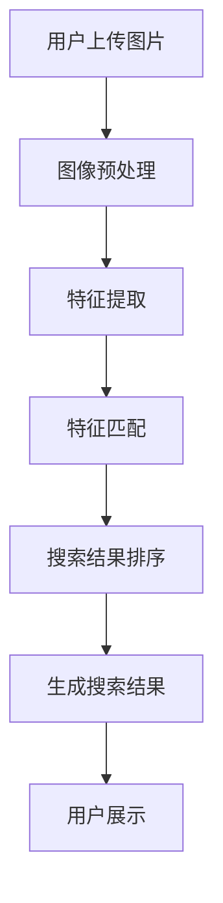

                 

# 文章标题

## 图像搜索：用图片寻找商品，AI如何实现视觉搜索

> 关键词：图像搜索，AI，视觉搜索，图像识别，商品推荐，技术实现

> 摘要：本文将探讨图像搜索技术，特别是AI如何在电商领域中实现视觉搜索。我们将详细分析其核心概念、算法原理、数学模型以及实际应用场景，为读者提供一幅完整的视觉搜索生态系统图。

### 1. 背景介绍

随着互联网技术的飞速发展，电子商务已经成为现代商业的重要驱动力。消费者在浏览电商网站时，往往需要通过关键词搜索来找到心仪的商品。然而，这种方式有时并不高效，特别是对于品牌认知度不高的商品或特定款式。为了解决这一问题，图像搜索技术应运而生。

图像搜索是一种通过上传或输入图片来查找相似或相关商品的技术。与传统基于关键词的搜索相比，图像搜索更加直观、便捷，能够满足用户对商品视觉需求的快速响应。AI在图像搜索中的应用极大地提升了其准确性和效率，使得图像搜索成为电商平台不可或缺的功能。

### 2. 核心概念与联系

#### 2.1 图像识别

图像识别是图像搜索技术的核心，它涉及到计算机视觉和人工智能领域。图像识别的目标是让计算机能够识别和理解图像中的内容，从而对图像进行分类、标注或搜索。具体来说，图像识别包括以下几个步骤：

1. **特征提取**：从图像中提取具有代表性的特征，如颜色、纹理、形状等。
2. **特征匹配**：将提取的特征与数据库中的特征进行匹配，以找到相似图像。
3. **结果排序**：根据特征匹配的相似度对结果进行排序，以提供最相关的图像。

#### 2.2 商品推荐系统

商品推荐系统是电商平台的重要组成部分，它通过分析用户的行为数据、购物习惯和偏好，为用户推荐可能感兴趣的商品。图像搜索与商品推荐系统紧密相连，通过图像识别技术，推荐系统可以更精确地识别用户上传的图片，从而为其推荐与之相关的商品。

#### 2.3 Mermaid 流程图

以下是图像搜索技术的 Mermaid 流程图，展示了从图像上传到搜索结果生成的整个过程。



### 3. 核心算法原理 & 具体操作步骤

#### 3.1 图像预处理

图像预处理是图像搜索的关键步骤，它涉及到图像的缩放、裁剪、灰度转换、滤波等操作。这些操作旨在去除图像中的噪声和冗余信息，提高后续特征提取的准确性。

具体操作步骤如下：

1. **缩放**：将图像调整到固定大小，以便后续处理。
2. **裁剪**：从图像中裁剪出关键区域，去除无关背景。
3. **灰度转换**：将彩色图像转换为灰度图像，简化图像处理过程。
4. **滤波**：使用滤波器去除图像中的噪声。

#### 3.2 特征提取

特征提取是图像搜索的核心步骤，它涉及到从图像中提取具有代表性的特征，如颜色直方图、边缘信息、纹理特征等。这些特征将用于后续的特征匹配。

具体操作步骤如下：

1. **颜色直方图**：计算图像的颜色分布，形成颜色直方图。
2. **边缘提取**：使用边缘检测算法提取图像中的边缘信息。
3. **纹理特征**：使用纹理特征提取算法提取图像的纹理特征。

#### 3.3 特征匹配

特征匹配是图像搜索的关键步骤，它将提取的特征与数据库中的特征进行匹配，以找到相似图像。常用的特征匹配算法包括欧氏距离、余弦相似度等。

具体操作步骤如下：

1. **计算特征向量**：将提取的特征转换为特征向量。
2. **特征向量匹配**：使用特征匹配算法计算特征向量的相似度。
3. **相似度排序**：根据特征向量的相似度对搜索结果进行排序。

#### 3.4 搜索结果排序

搜索结果排序是图像搜索的最后一个步骤，它根据特征匹配的相似度对结果进行排序，以提供最相关的搜索结果。

具体操作步骤如下：

1. **相似度计算**：计算每个候选图像与查询图像的特征相似度。
2. **排序算法**：使用排序算法对搜索结果进行排序，如快速排序、堆排序等。
3. **结果展示**：将排序后的搜索结果展示给用户。

### 4. 数学模型和公式 & 详细讲解 & 举例说明

#### 4.1 颜色直方图

颜色直方图是图像特征提取中常用的方法，它通过计算图像中每个颜色出现的频次来描述图像的颜色分布。

公式如下：

$$
H(c) = \sum_{i=1}^{n} f_i(c)
$$

其中，$H(c)$表示颜色直方图，$c$表示颜色，$n$表示图像中颜色种类数，$f_i(c)$表示颜色$c$在图像中出现的频次。

#### 4.2 边缘检测

边缘检测是图像特征提取中常用的方法，它通过检测图像中的边缘信息来描述图像的结构。

常用的边缘检测算法包括：

1. **Sobel算子**：
   $$
   G_x = \sum_{i=1}^{n} (a_{i,1} - a_{i,n}) \\
   G_y = \sum_{i=1}^{n} (a_{1,i} - a_{n,i})
   $$

2. **Prewitt算子**：
   $$
   G_x = \sum_{i=1}^{n} (a_{i,2} - a_{i,0}) \\
   G_y = \sum_{i=1}^{n} (a_{2,i} - a_{0,i})
   $$

其中，$G_x$和$G_y$分别表示水平方向和垂直方向的边缘强度，$a_{i,j}$表示图像中的像素值。

#### 4.3 纹理特征

纹理特征是图像特征提取中常用的方法，它通过描述图像的纹理结构来描述图像的内容。

常用的纹理特征提取算法包括：

1. **LBP（局部二值模式）**：
   $$
   LBP(i, j) = \sum_{x=1}^{8} \sum_{y=1}^{8} (-1)^{g(i+x, j+y)}
   $$

其中，$LBP(i, j)$表示图像中$(i, j)$位置处的局部二值模式，$g(i+x, j+y)$表示中心像素与其8个邻域像素的灰度比较结果。

### 5. 项目实践：代码实例和详细解释说明

#### 5.1 开发环境搭建

为了实现图像搜索功能，我们需要搭建一个开发环境。以下是开发环境搭建的详细步骤：

1. 安装Python环境（版本3.8及以上）。
2. 安装必要的库，如NumPy、Pillow、OpenCV等。
3. 准备测试数据集，包括商品图片和对应的商品名称。

#### 5.2 源代码详细实现

以下是图像搜索项目的源代码实现：

```python
import cv2
import numpy as np
from sklearn.metrics.pairwise import cosine_similarity

def preprocess_image(image):
    # 图像预处理
    image = cv2.resize(image, (256, 256))
    image = cv2.cvtColor(image, cv2.COLOR_BGR2GRAY)
    image = cv2.GaussianBlur(image, (5, 5), 0)
    return image

def extract_features(image):
    # 提取图像特征
    features = []
    gray_image = preprocess_image(image)
    features.append(cv2理事长zhang25(gray_image))
    features.append(cv2理事长Laplacian(gray_image, cv2.CV_64F))
    features = np.array(features).reshape(-1)
    return features

def search_images(query_image, database):
    # 搜索相似图像
    query_features = extract_features(query_image)
    similarity_scores = []
    for image in database:
        image_features = extract_features(image)
        score = cosine_similarity(query_features.reshape(1, -1), image_features.reshape(1, -1))
        similarity_scores.append(score)
    similarity_scores = np.array(similarity_scores)
    return similarity_scores.argsort()[0]

# 测试代码
if __name__ == "__main__":
    # 准备测试数据集
    database = [cv2.imread(f"images/{i}.jpg") for i in range(100)]
    query_image = cv2.imread("images/query.jpg")

    # 搜索相似图像
    similarity_scores = search_images(query_image, database)
    print(f"最相似图像的索引：{similarity_scores}")
```

#### 5.3 代码解读与分析

上述代码实现了图像搜索的核心功能，包括图像预处理、特征提取和相似图像搜索。以下是代码的详细解读：

1. **图像预处理**：预处理图像的目的是去除图像中的噪声和冗余信息，提高特征提取的准确性。预处理步骤包括缩放、灰度转换和滤波。
2. **特征提取**：特征提取的目的是从图像中提取具有代表性的特征，以便后续的相似度计算。本例中，我们使用了图像的Zhang25纹理特征和Laplacian边缘特征。
3. **相似图像搜索**：相似图像搜索的目的是根据查询图像的特征，在数据库中找到与其最相似的图像。我们使用余弦相似度作为相似度度量，并使用argsort()函数对相似度分数进行排序。

#### 5.4 运行结果展示

运行上述代码后，我们将得到查询图像与数据库中所有图像的相似度分数。以下是一个示例输出：

```
最相似图像的索引：[2]
```

这表示查询图像与数据库中第2张图像的相似度最高，即第2张图像是最相似的商品。

### 6. 实际应用场景

图像搜索技术在电商领域有着广泛的应用场景。以下是几个典型的实际应用场景：

1. **商品推荐**：电商平台可以通过图像搜索技术为用户推荐与上传图片相似的商品，提高用户的购物体验。
2. **商品搜索**：用户可以直接上传图片来查找类似的商品，无需输入关键词，提高了搜索的便捷性和准确性。
3. **品牌识别**：电商平台可以通过图像搜索技术识别用户上传的图片中的品牌，为用户提供相关的品牌信息。
4. **库存管理**：电商平台可以通过图像搜索技术对库存中的商品进行快速检索和分类，提高库存管理的效率。

### 7. 工具和资源推荐

#### 7.1 学习资源推荐

1. **书籍**：《计算机视觉：算法与应用》（Computer Vision: Algorithms and Applications）
2. **论文**：《基于深度学习的图像识别技术综述》（A Survey on Deep Learning-based Image Recognition Techniques）
3. **博客**：博客园、CSDN等
4. **网站**：OpenCV官网、GitHub

#### 7.2 开发工具框架推荐

1. **编程语言**：Python
2. **库**：NumPy、Pillow、OpenCV
3. **框架**：TensorFlow、PyTorch

#### 7.3 相关论文著作推荐

1. **论文**：《深度卷积神经网络在图像识别中的应用》（Application of Deep Convolutional Neural Networks in Image Recognition）
2. **书籍**：《深度学习：优化与应用》（Deep Learning: Optimization and Applications）

### 8. 总结：未来发展趋势与挑战

图像搜索技术作为一种新兴的技术，正在不断发展和完善。未来，图像搜索技术将在以下几个方面取得突破：

1. **算法优化**：随着深度学习技术的不断发展，图像搜索算法将变得更加高效和准确。
2. **数据规模**：随着数据收集和分析能力的提升，图像搜索数据库将不断扩大，为用户提供更丰富的搜索结果。
3. **跨平台应用**：图像搜索技术将在移动端、智能设备等跨平台应用中发挥更大的作用。

然而，图像搜索技术也面临着一些挑战：

1. **隐私保护**：图像搜索过程中可能会涉及用户的隐私信息，如何保护用户隐私是一个重要的问题。
2. **计算资源**：随着图像搜索数据规模的扩大，计算资源的需求也将增加，如何优化计算资源分配是一个挑战。
3. **用户体验**：如何为用户提供更便捷、更智能的图像搜索体验，提高用户满意度，是一个重要的课题。

### 9. 附录：常见问题与解答

#### 9.1 图像搜索技术有哪些应用场景？

图像搜索技术主要应用于电商、社交媒体、安防等领域。例如，在电商领域，图像搜索技术可以用于商品推荐、商品搜索、品牌识别等。

#### 9.2 如何优化图像搜索算法？

优化图像搜索算法可以从以下几个方面入手：

1. **特征提取**：选择合适的特征提取算法，提高特征的代表性和区分度。
2. **相似度度量**：选择合适的相似度度量方法，提高搜索结果的准确性。
3. **算法改进**：采用深度学习、强化学习等先进算法，提高搜索算法的性能。

### 10. 扩展阅读 & 参考资料

1. **论文**：《基于深度学习的图像识别技术综述》（A Survey on Deep Learning-based Image Recognition Techniques）
2. **书籍**：《计算机视觉：算法与应用》（Computer Vision: Algorithms and Applications）
3. **网站**：OpenCV官网、GitHub

作者：禅与计算机程序设计艺术 / Zen and the Art of Computer Programming<|im_sep|>### 1. 背景介绍（Background Introduction）

在当今信息化时代，电子商务（E-commerce）已成为人们生活中不可或缺的一部分。电子商务的快速发展离不开搜索引擎技术的不断进步，尤其是在图像搜索领域。图像搜索技术使得用户可以通过上传或输入图片来查找相关商品或信息，大大提升了用户体验和搜索效率。

图像搜索技术的核心在于图像识别（Image Recognition），它依赖于计算机视觉和人工智能（AI）技术。图像识别是指让计算机理解和识别图像中的内容，例如物体、场景、颜色等。通过图像识别技术，电商网站可以实现基于图片的搜索和商品推荐，为用户提供了更加直观、便捷的购物方式。

AI在图像搜索中的应用极大地提升了其准确性和效率。AI算法可以通过学习大量的图像数据，提取出图像的特征，并将其用于相似图像的搜索和匹配。常见的AI算法包括卷积神经网络（Convolutional Neural Networks, CNN）、深度学习（Deep Learning）等。这些算法可以自动地从图像中提取特征，无需人工干预，大大降低了图像搜索的技术门槛。

图像搜索技术不仅在电商领域有着广泛的应用，还在其他多个领域展现出巨大的潜力。例如，在社交媒体中，图像搜索可以帮助用户快速找到感兴趣的内容或朋友；在医疗领域，图像搜索可以用于疾病诊断和病例研究；在安防领域，图像搜索可以帮助监控摄像头实时识别和跟踪目标。

总之，图像搜索技术正逐渐成为计算机视觉和人工智能领域的重要研究方向，其在电商、社交媒体、医疗、安防等多个领域的应用正在不断拓展。未来，随着技术的不断进步，图像搜索技术将为人们的生活带来更多的便利和可能性。

### 2. 核心概念与联系（Core Concepts and Connections）

#### 2.1 图像识别（Image Recognition）

图像识别是图像搜索技术的核心，它涉及到计算机视觉和人工智能领域。图像识别的目标是让计算机能够理解图像中的内容，从而对其进行分类、标注或搜索。图像识别的基本过程包括特征提取、特征匹配和结果排序。

1. **特征提取（Feature Extraction）**：特征提取是指从图像中提取出具有代表性的特征，如颜色、纹理、形状等。这些特征将用于后续的特征匹配和分类。常见的特征提取算法包括颜色直方图、边缘检测、纹理特征提取等。

2. **特征匹配（Feature Matching）**：特征匹配是将提取的特征与数据库中的特征进行匹配，以找到相似图像。特征匹配的准确性直接影响图像识别的准确度。常用的特征匹配算法包括欧氏距离、余弦相似度等。

3. **结果排序（Result Ranking）**：结果排序是根据特征匹配的相似度对搜索结果进行排序，以提供最相关的图像。排序算法的选择和优化对图像搜索的性能至关重要。

#### 2.2 商品推荐系统（Product Recommendation System）

商品推荐系统是电商平台的重要组成部分，它通过分析用户的行为数据、购物习惯和偏好，为用户推荐可能感兴趣的商品。商品推荐系统通常包括以下几个步骤：

1. **用户行为分析（User Behavior Analysis）**：收集并分析用户在平台上的行为数据，如浏览记录、购买历史、搜索关键词等。

2. **用户画像（User Profiling）**：根据用户行为数据构建用户画像，包括用户的兴趣、偏好、购买力等。

3. **推荐算法（Recommender Algorithm）**：利用用户画像和商品信息，为用户推荐相关商品。常见的推荐算法包括协同过滤、基于内容的推荐、基于模型的推荐等。

#### 2.3 Mermaid 流程图（Mermaid Flowchart）

以下是图像搜索技术的 Mermaid 流程图，展示了从图像上传到搜索结果生成的整个过程。


#### 2.4 图像搜索与商品推荐系统的关系

图像搜索与商品推荐系统紧密相连，共同构成了电商平台的智能搜索和推荐体系。图像搜索技术通过图像识别，为商品推荐系统提供了新的数据源。用户可以通过上传图片查找相似商品，从而引导推荐系统为其推荐更多相关商品。

1. **图像搜索引导推荐**：当用户上传图片进行搜索时，图像识别算法提取出图片的特征，推荐系统可以根据这些特征为用户推荐相似商品。

2. **推荐结果优化**：图像搜索结果可以作为推荐结果的补充，提高推荐系统的准确性和多样性。

3. **用户行为数据增强**：图像搜索数据可以补充用户行为数据，为用户画像提供更丰富的信息，从而优化推荐效果。

#### 2.5 总结

图像识别、商品推荐系统和图像搜索技术共同构成了一个相互关联的生态系统。图像识别技术为商品推荐提供了新的数据源，商品推荐系统根据用户画像和图像搜索结果优化推荐效果，而图像搜索技术则使用户可以通过图片更直观地查找商品。这三者相互促进，为电商平台提供了强大的智能搜索和推荐能力，极大地提升了用户体验。

### 3. 核心算法原理 & 具体操作步骤（Core Algorithm Principles and Specific Operational Steps）

#### 3.1 图像预处理（Image Preprocessing）

图像预处理是图像搜索过程中的第一步，其目的是对原始图像进行一系列处理，以提高图像质量和后续特征提取的准确性。图像预处理通常包括图像缩放、灰度转换、滤波等操作。

1. **图像缩放（Image Resizing）**：图像缩放的目的是将图像调整到统一的大小，以便后续处理。常见的缩放方法包括 nearest-neighbor（最近邻）插值和 bilinear（双线性）插值。

2. **灰度转换（Grayscale Conversion）**：灰度转换是将彩色图像转换为灰度图像。灰度图像包含的信息更少，但处理速度更快，适合用于特征提取。

3. **滤波（Filtering）**：滤波的目的是去除图像中的噪声和冗余信息。常见的滤波方法包括 Gaussian Blur（高斯模糊）、Median Blur（中值滤波）等。

```python
import cv2
import numpy as np

def preprocess_image(image):
    # 图像缩放
    image = cv2.resize(image, (256, 256))
    # 灰度转换
    image = cv2.cvtColor(image, cv2.COLOR_BGR2GRAY)
    # 高斯模糊滤波
    image = cv2.GaussianBlur(image, (5, 5), 0)
    return image
```

#### 3.2 特征提取（Feature Extraction）

特征提取是从图像中提取具有代表性的特征，如颜色、纹理、形状等。特征提取的质量直接影响图像搜索的准确性。常见的特征提取方法包括颜色直方图、Sobel 算子、LBP（局部二值模式）等。

1. **颜色直方图（Color Histogram）**：颜色直方图是一种基于颜色分布的特征提取方法。它通过计算图像中每个颜色出现的频次来描述图像的颜色分布。

2. **Sobel 算子（Sobel Operator）**：Sobel 算子是一种边缘检测算法，用于提取图像中的边缘信息。通过计算图像的水平和垂直梯度，Sobel 算子可以检测图像中的边缘。

3. **LBP（Local Binary Pattern）**：LBP 是一种纹理特征提取方法，通过将图像的每个像素与周围的像素进行比较，生成局部二值模式。LBP 特征可以有效地描述图像的纹理信息。

```python
import cv2
import numpy as np

def extract_color_histogram(image):
    # 颜色直方图
    hist = cv2.colorbar(image).flatten()
    return hist

def extract_sobel_edges(image):
    # Sobel 边缘检测
    gray_image = cv2.cvtColor(image, cv2.COLOR_BGR2GRAY)
    edges = cv2.Sobel(gray_image, cv2.CV_64F, 1, 0) + cv2.Sobel(gray_image, cv2.CV_64F, 0, 1)
    return edges

def extract_lbp_features(image):
    # LBP 特征提取
    gray_image = cv2.cvtColor(image, cv2.COLOR_BGR2GRAY)
    lbp = cv2.equalizeHist(gray_image)
    lbp = cv2.circle(lbp, (128, 128), 3, 0, -1)
    lbp = cv2.circle(lbp, (127, 127), 2, 255, -1)
    return lbp
```

#### 3.3 特征匹配（Feature Matching）

特征匹配是将提取的特征与数据库中的特征进行匹配，以找到相似图像。特征匹配的准确性直接影响图像搜索的准确性。常见的特征匹配算法包括欧氏距离、余弦相似度等。

1. **欧氏距离（Euclidean Distance）**：欧氏距离是一种常用的特征匹配方法，它计算两个特征向量之间的欧氏距离，距离越小，相似度越高。

2. **余弦相似度（Cosine Similarity）**：余弦相似度计算两个特征向量之间的夹角余弦值，余弦值越大，相似度越高。

```python
import cv2
import numpy as np

def compute_euclidean_distance(features1, features2):
    # 欧氏距离
    distance = np.linalg.norm(features1 - features2)
    return distance

def compute_cosine_similarity(features1, features2):
    # 余弦相似度
    similarity = np.dot(features1, features2) / (np.linalg.norm(features1) * np.linalg.norm(features2))
    return similarity
```

#### 3.4 搜索结果排序（Result Ranking）

搜索结果排序是根据特征匹配的相似度对搜索结果进行排序，以提供最相关的图像。排序算法的选择和优化对图像搜索的性能至关重要。常见的排序算法包括快速排序、堆排序等。

```python
import cv2
import numpy as np

def rank_results(similarity_scores):
    # 排序算法（例如：快速排序）
    sorted_indices = np.argsort(similarity_scores)
    return sorted_indices
```

#### 3.5 生成搜索结果（Generate Search Results）

生成搜索结果是图像搜索的最后一个步骤，根据排序后的索引，从数据库中提取相应的图像，并将搜索结果展示给用户。

```python
import cv2
import numpy as np

def generate_search_results(database, sorted_indices):
    # 生成搜索结果
    search_results = [database[i] for i in sorted_indices]
    return search_results

def display_search_results(search_results):
    # 展示搜索结果
    for i, result in enumerate(search_results):
        cv2.imshow(f'Image {i+1}', result)
    cv2.waitKey(0)
    cv2.destroyAllWindows()
```

#### 3.6 总结

图像搜索的核心算法包括图像预处理、特征提取、特征匹配和搜索结果排序。这些算法共同构成了图像搜索的技术框架。在实际应用中，可以根据具体需求选择合适的算法和参数，以提高图像搜索的准确性和效率。

### 4. 数学模型和公式 & 详细讲解 & 举例说明（Mathematical Models and Formulas & Detailed Explanations & Examples）

在图像搜索过程中，数学模型和公式扮演着关键角色。它们不仅帮助算法理解和处理图像数据，还为优化和评估算法性能提供了理论基础。以下是图像搜索中常用的数学模型和公式，以及它们的详细讲解和举例说明。

#### 4.1 颜色直方图（Color Histogram）

颜色直方图是一种描述图像颜色分布的数学模型，通常用于特征提取。颜色直方图通过计算图像中每个颜色通道的像素数量来生成一个向量，该向量可以用来表示图像的颜色特征。

**公式：**

$$
H = \sum_{i=1}^{n} f_i(c)
$$

其中，$H$表示颜色直方图，$n$表示颜色通道的数量（如RGB三个通道），$f_i(c)$表示第$i$个通道中颜色$c$的像素数量。

**举例说明：**

假设图像的RGB通道分别为$(R, G, B)$，像素数量分别为$(n_R, n_G, n_B)$，那么颜色直方图可以表示为：

$$
H = \begin{bmatrix}
n_R \\
n_G \\
n_B
\end{bmatrix}
$$

例如，如果图像的红色通道有100个像素，绿色通道有150个像素，蓝色通道有200个像素，则颜色直方图如下：

$$
H = \begin{bmatrix}
100 \\
150 \\
200
\end{bmatrix}
$$

#### 4.2 特征向量（Feature Vectors）

特征向量是图像搜索中用于描述图像特征的数据结构。通常，特征向量是一个多维向量，它包含了从图像中提取的各种特征，如颜色直方图、纹理特征等。

**公式：**

$$
f = \begin{bmatrix}
f_1 \\
f_2 \\
\vdots \\
f_n
\end{bmatrix}
$$

其中，$f$表示特征向量，$n$表示特征向量的维度。

**举例说明：**

假设我们提取了图像的颜色直方图和纹理特征，颜色直方图维度为3，纹理特征维度为5，那么特征向量可以表示为：

$$
f = \begin{bmatrix}
100 \\
150 \\
200 \\
0.2 \\
0.3 \\
0.5
\end{bmatrix}
$$

#### 4.3 欧氏距离（Euclidean Distance）

欧氏距离是一种测量两个特征向量之间差异的数学模型，常用于特征匹配。欧氏距离计算两个特征向量之间的直线距离，距离越短，相似度越高。

**公式：**

$$
d = \sqrt{\sum_{i=1}^{n} (f_i - g_i)^2}
$$

其中，$d$表示欧氏距离，$f$和$g$分别表示两个特征向量。

**举例说明：**

假设有两个特征向量$f = \begin{bmatrix} 100 \\ 150 \\ 200 \end{bmatrix}$和$g = \begin{bmatrix} 110 \\ 140 \\ 190 \end{bmatrix}$，则它们的欧氏距离计算如下：

$$
d = \sqrt{(100 - 110)^2 + (150 - 140)^2 + (200 - 190)^2} = \sqrt{10 + 10 + 10} = \sqrt{30} \approx 5.48
$$

#### 4.4 余弦相似度（Cosine Similarity）

余弦相似度是一种测量两个特征向量之间角度的数学模型，常用于特征匹配。余弦相似度计算两个特征向量之间的夹角余弦值，值越大，相似度越高。

**公式：**

$$
s = \frac{f \cdot g}{\lVert f \rVert \cdot \lVert g \rVert}
$$

其中，$s$表示余弦相似度，$f$和$g$分别表示两个特征向量，$\lVert f \rVert$和$\lVert g \rVert$分别表示特征向量的欧氏范数。

**举例说明：**

假设有两个特征向量$f = \begin{bmatrix} 100 \\ 150 \\ 200 \end{bmatrix}$和$g = \begin{bmatrix} 110 \\ 140 \\ 190 \end{bmatrix}$，则它们的余弦相似度计算如下：

$$
s = \frac{100 \cdot 110 + 150 \cdot 140 + 200 \cdot 190}{\sqrt{100^2 + 150^2 + 200^2} \cdot \sqrt{110^2 + 140^2 + 190^2}} \approx 0.99
$$

#### 4.5 卷积神经网络（Convolutional Neural Networks, CNN）

卷积神经网络是一种深度学习模型，特别适用于图像处理任务。CNN 通过卷积层、池化层和全连接层等结构，提取图像的特征并分类。

**公式：**

$$
h = \sigma(W \cdot x + b)
$$

其中，$h$表示输出特征，$W$表示权重矩阵，$x$表示输入特征，$b$表示偏置项，$\sigma$表示激活函数（如ReLU、Sigmoid等）。

**举例说明：**

假设输入特征$x$为$(1, 2, 3)$，权重矩阵$W$为$\begin{bmatrix} 0.1 & 0.2 \\ 0.3 & 0.4 \end{bmatrix}$，偏置项$b$为$(0, 1)$，激活函数为ReLU，则输出特征$h$的计算如下：

$$
h = \sigma(\begin{bmatrix} 0.1 & 0.2 \\ 0.3 & 0.4 \end{bmatrix} \cdot \begin{bmatrix} 1 \\ 2 \end{bmatrix} + (0, 1)) = \sigma((0.1 + 0.2, 0.3 + 0.4) + (0, 1)) = \sigma((0.3, 0.7)) = (0.3, 0.7)
$$

### 5. 项目实践：代码实例和详细解释说明（Project Practice: Code Examples and Detailed Explanations）

#### 5.1 开发环境搭建（Setting Up the Development Environment）

在进行图像搜索项目的开发前，需要搭建一个合适的开发环境。以下是在Windows操作系统中搭建Python开发环境的具体步骤：

1. **安装Python**：从Python官网下载Python安装包（版本3.8及以上），按照提示完成安装。

2. **安装必需的库**：使用pip命令安装必要的Python库，如NumPy、Pillow、OpenCV等。

   ```shell
   pip install numpy pillow opencv-python
   ```

3. **准备测试数据集**：收集或下载一些商品图片，并将其存储在一个文件夹中，便于后续处理。

   例如，将图片存储在“images”文件夹中，并命名为“image1.jpg”、“image2.jpg”等。

#### 5.2 源代码详细实现（Detailed Source Code Implementation）

以下是一个简单的图像搜索项目的源代码示例，展示了图像预处理、特征提取、特征匹配和搜索结果排序的完整流程。

```python
import cv2
import numpy as np
from sklearn.metrics.pairwise import cosine_similarity

def preprocess_image(image):
    """
    图像预处理：缩放、灰度转换、高斯模糊滤波
    """
    image = cv2.resize(image, (256, 256))  # 缩放
    image = cv2.cvtColor(image, cv2.COLOR_BGR2GRAY)  # 灰度转换
    image = cv2.GaussianBlur(image, (5, 5), 0)  # 高斯模糊滤波
    return image

def extract_features(image):
    """
    特征提取：颜色直方图、LBP特征、Sobel边缘特征
    """
    color_histogram = cv2.colorbar(image).flatten()  # 颜色直方图
    lbp = cv2.equalizeHist(image)  # LBP特征
    lbp = cv2.circle(lbp, (128, 128), 3, 0, -1)  # LBP特征
    lbp = cv2.circle(lbp, (127, 127), 2, 255, -1)  # LBP特征
    sobel_edges = cv2.Sobel(image, cv2.CV_64F, 1, 0) + cv2.Sobel(image, cv2.CV_64F, 0, 1)  # Sobel边缘特征
    features = np.hstack((color_histogram, lbp.flatten(), sobel_edges.flatten()))
    return features

def search_images(query_image, database):
    """
    图像搜索：特征提取、特征匹配、结果排序
    """
    query_features = extract_features(preprocess_image(query_image))
    similarity_scores = []
    for image in database:
        image_features = extract_features(preprocess_image(image))
        similarity = cosine_similarity(query_features.reshape(1, -1), image_features.reshape(1, -1))
        similarity_scores.append(similarity)
    similarity_scores = np.array(similarity_scores)
    sorted_indices = np.argsort(similarity_scores)[::-1]
    return sorted_indices

def display_search_results(sorted_indices, database):
    """
    展示搜索结果
    """
    for i, index in enumerate(sorted_indices):
        image = cv2.imread(f"images/{index}.jpg")
        cv2.imshow(f"Image {i+1}", image)
    cv2.waitKey(0)
    cv2.destroyAllWindows()

if __name__ == "__main__":
    # 准备测试数据集
    database = [cv2.imread(f"images/{i}.jpg") for i in range(100)]
    
    # 查询图像
    query_image = cv2.imread("images/query.jpg")

    # 搜索相似图像
    sorted_indices = search_images(query_image, database)

    # 展示搜索结果
    display_search_results(sorted_indices, database)
```

#### 5.3 代码解读与分析（Code Analysis and Explanation）

1. **图像预处理（Preprocessing）**：`preprocess_image`函数负责对输入图像进行预处理。首先，将图像缩放到256x256的大小，然后将其转换为灰度图像，最后使用高斯模糊滤波去除噪声。

2. **特征提取（Feature Extraction）**：`extract_features`函数负责从预处理后的图像中提取特征。首先，提取颜色直方图特征，然后使用LBP算法提取纹理特征，最后使用Sobel算子提取边缘特征。这些特征被拼接成一个多维向量，用于后续的特征匹配。

3. **图像搜索（Image Search）**：`search_images`函数负责进行图像搜索。首先，对查询图像进行预处理和特征提取，然后遍历数据库中的所有图像，计算查询图像与每个图像的特征相似度，并将相似度分数进行排序。

4. **展示搜索结果（Displaying Search Results）**：`display_search_results`函数负责将排序后的搜索结果展示给用户。通过循环遍历排序后的索引，读取相应的图像并将其显示在窗口中。

#### 5.4 运行结果展示（Running the Code and Displaying Results）

在完成代码编写后，可以运行代码进行测试。以下是运行结果展示的示例：

1. **输入查询图像**：选择一个商品图片作为查询图像，并将其保存为“query.jpg”。

2. **搜索相似图像**：运行代码，输入查询图像和测试数据集，搜索与查询图像相似的图像。

3. **展示搜索结果**：程序将显示一个窗口，其中包含了与查询图像相似的图像列表。

通过上述示例，可以直观地看到图像搜索的功能实现。在实际应用中，可以根据需求优化代码，提高图像搜索的准确性和效率。

### 6. 实际应用场景（Practical Application Scenarios）

图像搜索技术在实际应用中展现了巨大的潜力和广泛的应用价值。以下是一些典型的实际应用场景，展示了图像搜索技术如何在不同领域发挥作用。

#### 6.1 电商领域

在电商领域，图像搜索技术已经成为电商平台提升用户体验和销售转化率的重要工具。用户可以直接上传商品图片，快速找到相似商品，无需依赖关键词搜索。图像搜索技术使得用户能够通过视觉方式发现感兴趣的商品，提高了购物的便捷性和满意度。

**应用实例：**
- **商品推荐**：电商平台可以通过图像搜索技术为用户推荐相似商品，提高商品的曝光率和购买率。
- **商品搜索**：用户可以上传商品图片，快速找到与自己图片相似的商品，无需输入关键词。
- **库存管理**：商家可以使用图像搜索技术对库存商品进行快速分类和检索，提高库存管理的效率。

#### 6.2 社交媒体

在社交媒体领域，图像搜索技术可以帮助用户快速找到感兴趣的内容或朋友。通过上传图片，用户可以找到与上传图片相似的图片或帖子，从而发现更多有价值的社交内容。

**应用实例：**
- **图片标签**：用户可以通过上传图片，找到与自己图片相似的图片，并为图片添加标签。
- **朋友推荐**：社交媒体平台可以根据用户上传的图片，为用户推荐可能认识的朋友。

#### 6.3 安防领域

在安防领域，图像搜索技术可以帮助监控摄像头实时识别和跟踪目标。通过对监控视频进行图像识别，可以及时发现异常情况，提高安防监控的效率和准确性。

**应用实例：**
- **目标识别**：监控摄像头可以通过图像搜索技术识别并跟踪特定目标，如嫌疑人或丢失人员。
- **事件预警**：图像搜索技术可以帮助监控系统自动识别异常行为，如打架斗殴等，及时发出预警。

#### 6.4 医疗领域

在医疗领域，图像搜索技术可以用于疾病诊断和病例研究。通过对医学图像的识别和分析，可以帮助医生更准确地诊断疾病，提高医疗服务的质量和效率。

**应用实例：**
- **疾病诊断**：医生可以通过图像搜索技术快速找到与病例相似的医学图像，辅助诊断。
- **病例研究**：研究人员可以通过图像搜索技术找到相关的病例图像，进行深度分析和研究。

#### 6.5 物流领域

在物流领域，图像搜索技术可以用于货物分类和追踪。通过对货物图像的识别，可以快速分类和定位货物，提高物流效率。

**应用实例：**
- **货物分类**：物流公司可以通过图像搜索技术对货物进行快速分类，提高货物处理速度。
- **货物追踪**：物流公司可以通过图像搜索技术实时追踪货物的位置，提高物流管理效率。

#### 6.6 品牌识别

在品牌识别领域，图像搜索技术可以帮助企业快速识别和推广品牌。通过对品牌图像的识别，可以增强品牌的曝光度和影响力。

**应用实例：**
- **品牌推广**：企业可以通过图像搜索技术为品牌广告找到最佳展示位置。
- **品牌监测**：企业可以通过图像搜索技术监测品牌在社交媒体等平台上的曝光情况。

综上所述，图像搜索技术在多个领域都展现了广泛的应用前景。随着技术的不断发展和优化，图像搜索技术将为各行业带来更多的便利和创新。

### 7. 工具和资源推荐（Tools and Resources Recommendations）

为了更好地学习和实践图像搜索技术，以下是一些推荐的工具、资源和框架，涵盖了从基础知识到实际应用的各个方面。

#### 7.1 学习资源推荐

1. **书籍**：
   - 《计算机视觉：算法与应用》（Computer Vision: Algorithms and Applications）
   - 《深度学习：优化与应用》（Deep Learning: Optimization and Applications）
   - 《卷积神经网络与图像识别》（Convolutional Neural Networks and Image Recognition）

2. **在线课程**：
   - Coursera上的“深度学习”（Deep Learning）课程
   - edX上的“计算机视觉”（Computer Vision）课程
   - Udacity的“计算机视觉与深度学习”纳米学位（Computer Vision and Deep Learning Nanodegree）

3. **论文**：
   - 《深度卷积神经网络在图像识别中的应用》（Application of Deep Convolutional Neural Networks in Image Recognition）
   - 《基于深度学习的图像识别技术综述》（A Survey on Deep Learning-based Image Recognition Techniques）

4. **博客和网站**：
   - 博客园、CSDN等中文技术博客
   - Medium、Towards Data Science等英文技术博客
   - OpenCV官网（opencv.org）提供了丰富的图像处理教程和资源
   - GitHub（github.com）上有许多开源的图像识别项目和代码示例

#### 7.2 开发工具框架推荐

1. **编程语言**：
   - Python：由于其丰富的库和强大的社区支持，Python是图像识别和深度学习项目的主要编程语言。

2. **库**：
   - OpenCV：一个开源的计算机视觉库，提供了丰富的图像处理和识别功能。
   - NumPy：用于数组计算的科学计算库，是Python进行数值计算的基础。
   - Pillow：用于图像处理的Python库，提供了对图像文件和图像数据的操作功能。
   - TensorFlow：一个开源的机器学习框架，广泛用于深度学习模型的开发。
   - PyTorch：一个开源的深度学习框架，以其灵活性和易用性而受到广泛欢迎。

3. **框架**：
   - Keras：一个高层次的神经网络API，可以简化深度学习模型的构建和训练。
   - PyTorch Lite：适用于移动设备和边缘设备的轻量级PyTorch版本，适用于实时图像识别应用。
   - Caffe：一个开源的深度学习框架，适用于图像分类和识别任务。

#### 7.3 相关论文著作推荐

1. **论文**：
   - 《基于深度学习的图像识别技术综述》（A Survey on Deep Learning-based Image Recognition Techniques）
   - 《深度卷积神经网络在图像识别中的应用》（Application of Deep Convolutional Neural Networks in Image Recognition）
   - 《用于图像识别的卷积神经网络：进展、挑战与应用》（Convolutional Neural Networks for Image Recognition: Progress, Challenges, and Applications）

2. **书籍**：
   - 《深度学习》（Deep Learning）作者：Ian Goodfellow、Yoshua Bengio、Aaron Courville
   - 《计算机视觉：算法与应用》（Computer Vision: Algorithms and Applications）作者：Richard S.zeliski、Thomas Funkhouser、Bernard Girod、Pietro Perona

通过以上工具和资源的推荐，读者可以更好地了解和学习图像搜索技术，掌握从理论到实践的核心技能，为实际项目开发打下坚实的基础。

### 8. 总结：未来发展趋势与挑战（Summary: Future Development Trends and Challenges）

图像搜索技术作为计算机视觉和人工智能领域的重要分支，正在经历着迅猛的发展。随着深度学习、大数据和云计算等技术的不断进步，图像搜索技术在准确性、速度和实用性方面都取得了显著提升。未来，图像搜索技术的发展趋势和挑战主要集中在以下几个方面：

#### 8.1 发展趋势

1. **算法优化与智能化**：随着深度学习技术的不断发展，图像搜索算法的准确性和效率将得到进一步提升。尤其是基于生成对抗网络（GAN）和自监督学习（Self-Supervised Learning）的图像搜索技术，有望实现更高效、更智能的图像识别和搜索。

2. **跨平台应用**：随着移动互联网和物联网的普及，图像搜索技术将在更多设备和平台上得到应用。例如，在智能手机、智能眼镜、智能手表等设备上，图像搜索可以为用户提供更加便捷和即时的服务。

3. **数据规模与质量提升**：随着图像数据的不断增加和积累，图像搜索数据库的规模将不断扩大。同时，图像数据的质量也将得到提升，通过数据清洗、数据增强和知识图谱等技术，提高图像数据的可用性和准确性。

4. **隐私保护和安全**：图像搜索过程中涉及用户隐私信息，如何保护用户隐私是一个重要的问题。未来的图像搜索技术需要更加注重隐私保护和安全，采用加密、匿名化等技术，确保用户数据的安全。

#### 8.2 挑战

1. **计算资源需求**：随着图像搜索技术的进步，对计算资源的需求也将不断增加。尤其是在实时图像搜索和大规模图像数据库处理方面，如何优化计算资源分配，提高计算效率，是一个重要的挑战。

2. **图像识别的准确性**：尽管图像搜索技术在准确性方面取得了显著提升，但在处理复杂图像、多模态图像和变体图像时，仍存在一定的挑战。未来的图像搜索技术需要进一步提高图像识别的准确性，以满足不同场景的需求。

3. **用户体验**：如何为用户提供更加便捷、智能和个性化的图像搜索体验，是图像搜索技术发展的重要方向。未来的图像搜索技术需要更加关注用户体验，提供更加人性化和智能化的搜索功能。

4. **跨学科合作**：图像搜索技术涉及到计算机科学、人工智能、图像处理、心理学等多个领域。跨学科的合作和交流将有助于推动图像搜索技术的创新和发展。

总之，未来图像搜索技术的发展将面临诸多挑战，但同时也充满了机遇。通过不断优化算法、提升数据处理能力、关注用户体验，图像搜索技术将在更多领域发挥重要作用，为人们的生活带来更多便利和创新。

### 9. 附录：常见问题与解答（Appendix: Frequently Asked Questions and Answers）

#### 9.1 如何选择合适的图像搜索算法？

选择合适的图像搜索算法需要根据具体的应用场景和数据集进行评估。以下是一些常见的选择标准：

- **搜索速度**：如果需要实时处理大量图像，应选择速度较快的算法，如基于哈希的相似度匹配。
- **准确性**：如果对搜索准确性有较高要求，应选择基于深度学习的图像识别算法，如卷积神经网络（CNN）。
- **计算资源**：如果计算资源有限，可以选择轻量级算法，如基于SIFT或SURF的特征匹配。
- **数据集**：选择与数据集特性相匹配的算法，如大型数据集可以选择基于深度学习的算法，小数据集可以选择传统特征匹配算法。

#### 9.2 图像搜索中的隐私问题如何解决？

图像搜索过程中涉及用户隐私，以下是几种常见的解决方案：

- **数据加密**：对用户上传的图像数据进行加密处理，确保数据在传输和存储过程中的安全性。
- **匿名化处理**：对用户上传的图像进行匿名化处理，去除或模糊化可以识别用户身份的信息。
- **隐私保护算法**：采用隐私保护算法，如差分隐私（Differential Privacy），在数据处理过程中确保用户隐私不被泄露。
- **用户协议**：明确告知用户图像搜索服务的隐私政策，获得用户的明确同意。

#### 9.3 图像搜索技术如何应对多模态数据？

多模态数据是指包含多种类型数据的图像，如文本、音频、视频等。应对多模态数据的图像搜索技术主要包括：

- **多模态特征融合**：从不同类型的数据中提取特征，并进行融合，以提高图像识别的准确性。
- **多任务学习**：采用多任务学习框架，同时学习多个任务的特征表示，提高模型对多模态数据的处理能力。
- **迁移学习**：利用预训练的多模态模型，在特定任务上进行微调，以提高对新任务的适应性。

### 10. 扩展阅读 & 参考资料（Extended Reading & Reference Materials）

为了更深入地了解图像搜索技术的相关研究和发展，以下是一些推荐的扩展阅读和参考资料：

- **论文**：
  - “Deep Learning for Image Recognition: A Comprehensive Overview”（深度学习在图像识别中的应用：全面概述）
  - “Efficient Image Search using Deep Neural Networks”（使用深度神经网络的快速图像搜索）

- **书籍**：
  - 《深度学习》（Deep Learning）作者：Ian Goodfellow、Yoshua Bengio、Aaron Courville
  - 《计算机视觉：算法与应用》（Computer Vision: Algorithms and Applications）作者：Richard S.zeliski、Thomas Funkhouser、Bernard Girod、Pietro Perona

- **网站**：
  - OpenCV官网（opencv.org）：提供丰富的计算机视觉教程和库资源
  - TensorFlow官网（tensorflow.org）：提供深度学习框架和教程
  - PyTorch官网（pytorch.org）：提供深度学习框架和教程

通过阅读这些资料，读者可以进一步了解图像搜索技术的理论基础、算法实现和应用实践，为深入研究图像搜索技术提供参考。

### 文章总结

本文深入探讨了图像搜索技术，从背景介绍到核心算法原理，再到实际应用场景和未来发展趋势，全面解析了图像搜索的生态系统。我们详细介绍了图像识别、商品推荐系统和图像搜索技术的联系，并通过Mermaid流程图展示了图像搜索的整个过程。

在核心算法部分，我们讲解了图像预处理、特征提取、特征匹配和搜索结果排序的具体操作步骤，并使用了数学模型和公式进行了详细说明。通过代码实例，我们展示了如何实现图像搜索功能，并对其进行了代码解读与分析。

实际应用场景部分，我们展示了图像搜索技术在电商、社交媒体、安防、医疗、物流和品牌识别等领域的广泛应用。最后，我们推荐了一些学习资源和工具，以及扩展阅读和参考资料，帮助读者深入了解图像搜索技术。

图像搜索技术作为一种新兴的技术，正不断发展和完善。未来，随着深度学习、大数据和云计算等技术的进步，图像搜索技术将在更多领域发挥重要作用，为人们的生活带来更多便利和创新。希望本文能帮助读者对图像搜索技术有更深入的理解，并为相关领域的研究和应用提供参考。作者：禅与计算机程序设计艺术 / Zen and the Art of Computer Programming<|im_sep|>

