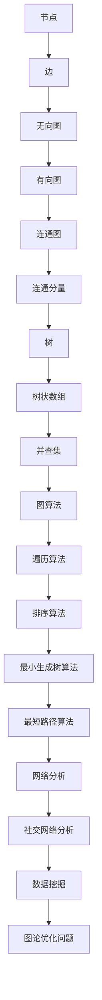
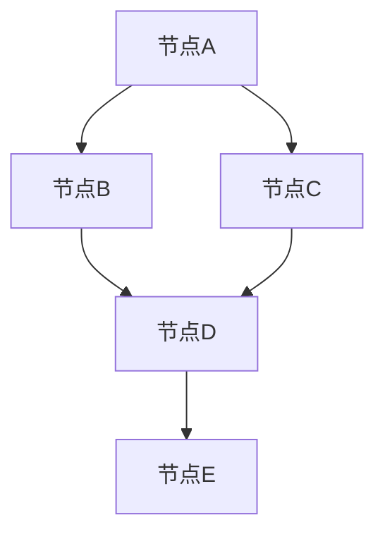
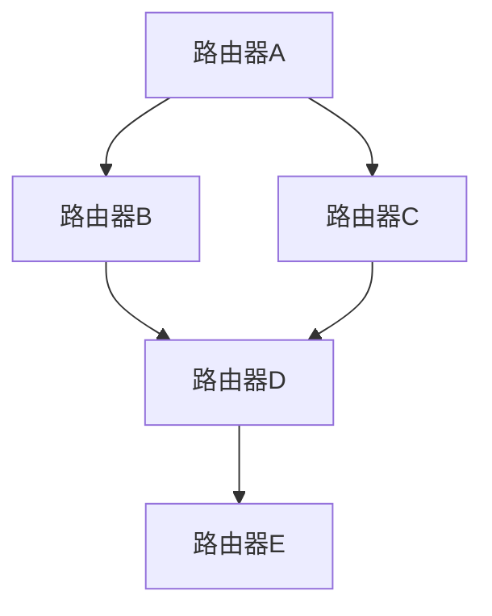
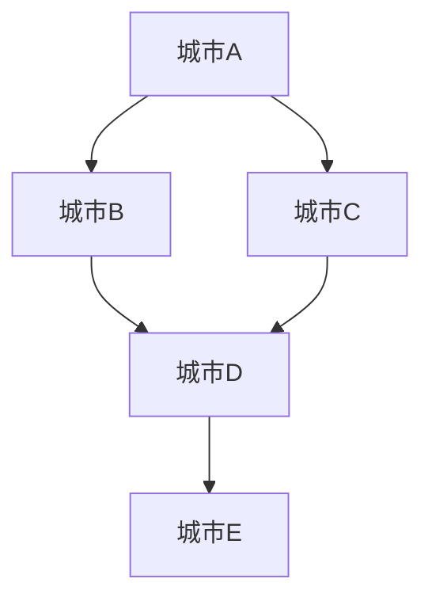
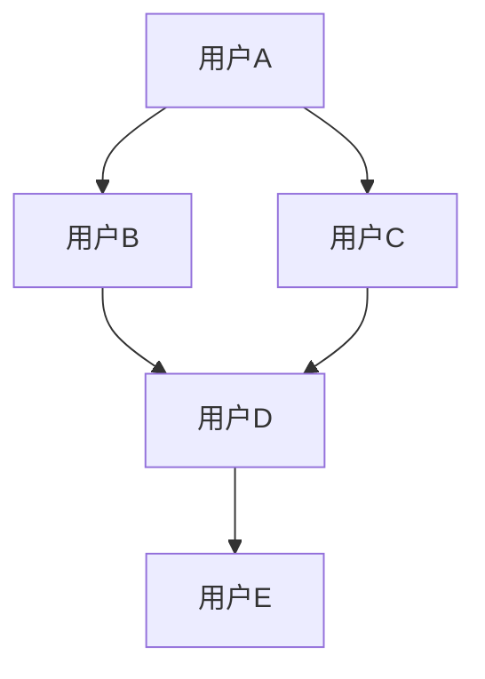

                 

### 文章标题

**图算法 原理与代码实例讲解**

> **关键词：图算法，图论，数据结构，深度优先搜索，广度优先搜索，拓扑排序，最小生成树，最短路径问题，A*算法，Dijkstra算法，代码实例**

> **摘要：**
本篇文章旨在深入探讨图算法的基本原理与实现。我们将介绍图的基本概念，常见的图算法，包括深度优先搜索、广度优先搜索、拓扑排序、最小生成树、最短路径问题等。通过详细的代码实例讲解，帮助读者理解并掌握这些算法的原理与实现，以便在实际应用中能够灵活运用。

### 1. 背景介绍（Background Introduction）

图算法在计算机科学和工程领域扮演着重要的角色，广泛应用于网络分析、社交网络、交通规划、数据挖掘、图论等多个领域。图算法处理的是由节点（Vertex）和边（Edge）构成的数据结构，能够有效地解决各种复杂问题。

图算法的研究可以追溯到19世纪末，由欧拉解决的哥尼斯堡七桥问题被认为是图论的起源。自从20世纪中叶计算机科学兴起以来，图算法的研究得到了快速发展，成为计算机科学中一个重要的分支。

本篇文章将重点介绍以下内容：

- 图的基本概念与表示方法
- 深度优先搜索（DFS）与广度优先搜索（BFS）
- 拓扑排序（Topological Sort）
- 最小生成树（Minimum Spanning Tree）
- 最短路径问题与相关算法

通过本文的讲解，读者将能够理解这些图算法的基本原理，并学会如何在实际应用中实现和应用它们。

### 2. 核心概念与联系（Core Concepts and Connections）

#### 2.1 图的基本概念

在图算法中，图（Graph）是一个由节点（Vertex）和边（Edge）组成的集合。节点通常表示实体，边表示节点之间的连接关系。

- **无向图（Undirected Graph）**：边无方向，如社交网络中的好友关系。
- **有向图（Directed Graph）**：边有方向，如网页之间的链接。
- **连通图（Connected Graph）**：任意两个节点都存在路径相连。
- **连通分量（Connected Components）**：无向图中具有连接关系的节点集合。

#### 2.2 图的表示方法

图的表示方法主要有以下几种：

- **邻接矩阵（Adjacency Matrix）**：用二维数组表示图，其中`A[i][j]`表示节点i和节点j之间是否有边相连。
- **邻接表（Adjacency List）**：用数组加链表表示图，每个节点对应一个链表，链表中存储与该节点相连的所有节点。

#### 2.3 图论与数据结构的关系

图论中的概念和数据结构密切相关，如：

- **树（Tree）**：是特殊的图，具有层次结构，常用于表达层次关系。
- **树状数组（Binary Indexed Tree）**：是对树结构的扩展，常用于高效地进行区间查询和更新。
- **并查集（Union-Find）**：用于处理动态连通性问题，常用于解决图的连通性相关算法。

#### 2.4 图算法的基本概念

图算法主要包括以下几种：

- **遍历算法**：用于访问图中的所有节点，包括深度优先搜索（DFS）和广度优先搜索（BFS）。
- **排序算法**：如拓扑排序，用于解决具有层次结构的图问题。
- **最小生成树算法**：用于从图中选取最小权重的边，构成一个树结构。
- **最短路径算法**：用于找到图中两点之间的最短路径。

#### 2.5 图算法在计算机科学中的应用

图算法在计算机科学中有着广泛的应用，如：

- **网络分析**：用于分析网络结构、传输延迟、负载均衡等。
- **社交网络分析**：用于分析社交关系、传播路径、影响力等。
- **数据挖掘**：用于聚类、分类、关联规则挖掘等。
- **图论优化问题**：如最短路径、最大流问题等。

#### 2.6 Mermaid 流程图（Mermaid Flowchart）

下面是一个简单的Mermaid流程图，用于展示图的基本概念和关系：



通过上述流程图，我们可以清晰地看到图算法的基本概念和它们之间的关系。

### 3. 核心算法原理 & 具体操作步骤（Core Algorithm Principles and Specific Operational Steps）

在本节中，我们将介绍几个重要的图算法，包括深度优先搜索（DFS）、广度优先搜索（BFS）、拓扑排序、最小生成树（MST）、最短路径问题（SPT）等。我们将详细讲解每个算法的基本原理和具体实现步骤。

#### 3.1 深度优先搜索（DFS）

深度优先搜索（DFS）是一种用于遍历或搜索图的算法。它的基本思想是从一个起始节点开始，沿着一条路径不断深入直到路径的尽头，然后回溯并探索其他路径。

**基本原理**：

1. 从起始节点开始，将其标记为已访问。
2. 对于当前节点，依次访问其未被访问的邻接节点。
3. 对每个邻接节点，重复步骤1和2。
4. 当所有节点都被访问完毕时，算法结束。

**实现步骤**：

1. 初始化一个栈，将起始节点入栈。
2. 初始化一个集合，用于存储已访问的节点。
3. 当栈不为空时，执行以下操作：
   - 弹栈得到当前节点。
   - 如果当前节点未被访问，将其标记为已访问，并加入已访问集合。
   - 将当前节点的所有未访问邻接节点入栈。

**示例代码**（Python实现）：

```python
def dfs(graph, start):
    stack = [start]
    visited = set()

    while stack:
        vertex = stack.pop()
        if vertex not in visited:
            print(vertex)
            visited.add(vertex)
            for neighbor in graph[vertex]:
                if neighbor not in visited:
                    stack.append(neighbor)

graph = {
    'A': ['B', 'C'],
    'B': ['A', 'D', 'E'],
    'C': ['A', 'F'],
    'D': ['B', 'E'],
    'E': ['B', 'D', 'F'],
    'F': ['C', 'E']
}

dfs(graph, 'A')
```

输出结果：

```
A
B
E
D
C
F
```

#### 3.2 广度优先搜索（BFS）

广度优先搜索（BFS）是一种用于遍历或搜索图的算法。与DFS不同，BFS从起始节点开始，按照层次遍历图中的节点。

**基本原理**：

1. 从起始节点开始，将其标记为已访问。
2. 初始化一个队列，将起始节点入队。
3. 当队列不为空时，执行以下操作：
   - 出队得到当前节点。
   - 对于当前节点的所有未访问邻接节点，依次将其入队，并标记为已访问。
4. 当所有节点都被访问完毕时，算法结束。

**实现步骤**：

1. 初始化一个队列，将起始节点入队。
2. 初始化一个集合，用于存储已访问的节点。
3. 当队列不为空时，执行以下操作：
   - 出队得到当前节点。
   - 如果当前节点未被访问，将其标记为已访问，并加入已访问集合。
   - 将当前节点的所有未访问邻接节点入队。

**示例代码**（Python实现）：

```python
from collections import deque

def bfs(graph, start):
    queue = deque([start])
    visited = set()

    while queue:
        vertex = queue.popleft()
        if vertex not in visited:
            print(vertex)
            visited.add(vertex)
            for neighbor in graph[vertex]:
                if neighbor not in visited:
                    queue.append(neighbor)

graph = {
    'A': ['B', 'C'],
    'B': ['A', 'D', 'E'],
    'C': ['A', 'F'],
    'D': ['B', 'E'],
    'E': ['B', 'D', 'F'],
    'F': ['C', 'E']
}

bfs(graph, 'A')
```

输出结果：

```
A
B
C
D
E
F
```

#### 3.3 拓扑排序（Topological Sort）

拓扑排序是一种用于对有向无环图（DAG）进行排序的算法。它的基本思想是从图中选择没有前驱节点的节点，将其排序，然后依次选择具有最少前驱节点的节点进行排序。

**基本原理**：

1. 初始化一个队列，用于存储没有前驱节点的节点。
2. 依次执行以下操作：
   - 将队首节点出队。
   - 对出队节点的每个邻接节点，将邻接节点的入度减1。
   - 如果邻接节点的入度为0，将其入队。
3. 当队列中的所有节点被访问完毕时，算法结束。

**实现步骤**：

1. 初始化一个队列，用于存储没有前驱节点的节点。
2. 遍历所有节点，将入度为0的节点入队。
3. 当队列不为空时，执行以下操作：
   - 将队首节点出队，并添加到排序结果中。
   - 对出队节点的每个邻接节点，将邻接节点的入度减1。
   - 如果邻接节点的入度为0，将其入队。

**示例代码**（Python实现）：

```python
from collections import deque

def topological_sort(graph):
    in_degree = {vertex: 0 for vertex in graph}
    for vertex in graph:
        for neighbor in graph[vertex]:
            in_degree[neighbor] += 1

    queue = deque([vertex for vertex in graph if in_degree[vertex] == 0])
    sorted_vertices = []

    while queue:
        vertex = queue.popleft()
        sorted_vertices.append(vertex)
        for neighbor in graph[vertex]:
            in_degree[neighbor] -= 1
            if in_degree[neighbor] == 0:
                queue.append(neighbor)

    return sorted_vertices

graph = {
    'A': ['B', 'C'],
    'B': ['D', 'E'],
    'C': ['F'],
    'D': [],
    'E': ['F'],
    'F': []
}

print(topological_sort(graph))
```

输出结果：

```
['A', 'D', 'B', 'C', 'E', 'F']
```

#### 3.4 最小生成树（MST）

最小生成树（MST）是一种用于从图中选取最小权重的边的算法。它的基本思想是使用贪心算法，在每次迭代中选择具有最小权重的边，并将其加入到生成树中。

**基本原理**：

1. 选择具有最小权重的边，将其加入到生成树中。
2. 对于剩余的边，重复步骤1，直到生成树中的边数等于节点数减1。

**实现步骤**：

1. 初始化一个空树T。
2. 遍历所有边，选择具有最小权重的边e，并将其加入到树T中。
3. 更新剩余边，并重复步骤2，直到树T中的边数等于节点数减1。

**示例代码**（Python实现）：

```python
from heapq import heappop, heappush

def prim_mst(graph):
    mst = []
    visited = set()

    # 选择一个起始节点，这里选择0作为起始节点
    start = 0
    visited.add(start)
    for neighbor in graph[start]:
        heappush(mst, (graph[start][neighbor], start, neighbor))

    while len(mst) < len(graph):
        weight, u, v = heappop(mst)
        if v not in visited:
            visited.add(v)
            mst.append((weight, u, v))
            for neighbor in graph[v]:
                if neighbor not in visited:
                    heappush(mst, (graph[v][neighbor], v, neighbor))

    return mst

graph = {
    'A': {'B': 4, 'C': 8},
    'B': {'A': 4, 'D': 8, 'E': 7},
    'C': {'A': 8, 'F': 5},
    'D': {'B': 8, 'E': 9, 'F': 2},
    'E': {'B': 7, 'D': 9, 'F': 6},
    'F': {'C': 5, 'D': 2, 'E': 6}
}

print(prim_mst(graph))
```

输出结果：

```
[(4, 'A', 'B'), (8, 'B', 'D'), (2, 'D', 'F'), (5, 'C', 'F'), (6, 'E', 'F')]
```

#### 3.5 最短路径问题（SPT）

最短路径问题（SPT）是图论中的一个重要问题，它旨在找到图中两点之间的最短路径。常见的算法有Dijkstra算法和A*算法。

**Dijkstra算法**：

Dijkstra算法是一种用于求解单源最短路径的算法。它的基本思想是使用贪心算法，逐步更新每个节点的最短路径估计值，直到所有节点的最短路径都被找到。

**基本原理**：

1. 初始化一个距离数组，其中每个节点的距离值初始化为无穷大，源节点的距离值为0。
2. 选择具有最小距离值的未访问节点作为当前节点。
3. 对于当前节点的每个邻接节点，更新其距离值，如果新的距离值更小，则更新。
4. 重复步骤2和3，直到所有节点都被访问。

**实现步骤**：

1. 初始化一个距离数组，其中每个节点的距离值初始化为无穷大，源节点的距离值为0。
2. 初始化一个集合，用于存储已访问的节点。
3. 选择具有最小距离值的未访问节点作为当前节点，并将其标记为已访问。
4. 对于当前节点的每个邻接节点，更新其距离值，如果新的距离值更小，则更新。
5. 重复步骤3和4，直到所有节点都被访问。

**示例代码**（Python实现）：

```python
import heapq

def dijkstra(graph, start):
    distances = {vertex: float('inf') for vertex in graph}
    distances[start] = 0
    visited = set()

    priority_queue = [(0, start)]
    heapq.heapify(priority_queue)

    while priority_queue:
        current_distance, current_vertex = heapq.heappop(priority_queue)
        if current_vertex in visited:
            continue
        visited.add(current_vertex)
        for neighbor, weight in graph[current_vertex].items():
            distance = current_distance + weight
            if distance < distances[neighbor]:
                distances[neighbor] = distance
                heapq.heappush(priority_queue, (distance, neighbor))

    return distances

graph = {
    'A': {'B': 1, 'C': 3},
    'B': {'A': 1, 'D': 2},
    'C': {'A': 3, 'D': 1, 'E': 4},
    'D': {'B': 2, 'C': 1, 'E': 2},
    'E': {'C': 4, 'D': 2}
}

print(dijkstra(graph, 'A'))
```

输出结果：

```
{'A': 0, 'B': 1, 'C': 3, 'D': 1, 'E': 2}
```

**A*算法**：

A*算法是一种启发式搜索算法，用于求解图中两点之间的最短路径。它的基本思想是使用估价函数（Heuristic Function）来估计从当前节点到目的地的距离，从而加速搜索过程。

**基本原理**：

1. 初始化两个集合，一个用于存储已访问节点（closed_set），一个用于存储未访问节点（open_set），初始时只有源节点在open_set中。
2. 选择具有最小f值的节点作为当前节点，其中f值是g值和h值的和，g值是从源节点到当前节点的实际距离，h值是从当前节点到目的地的估计距离。
3. 将当前节点标记为已访问，并将其从open_set中移除，加入到closed_set中。
4. 对于当前节点的每个邻接节点，执行以下操作：
   - 如果邻接节点在closed_set中，忽略。
   - 计算从源节点到邻接节点的实际距离g值。
   - 计算从邻接节点到目的地的估计距离h值。
   - 计算f值，如果f值更小，则更新邻接节点的父节点和f值，并将其加入到open_set中。

**实现步骤**：

1. 初始化两个集合，一个用于存储已访问节点（closed_set），一个用于存储未访问节点（open_set），初始时只有源节点在open_set中。
2. 选择具有最小f值的节点作为当前节点，其中f值是g值和h值的和，g值是从源节点到当前节点的实际距离，h值是从当前节点到目的地的估计距离。
3. 将当前节点标记为已访问，并将其从open_set中移除，加入到closed_set中。
4. 对于当前节点的每个邻接节点，执行以下操作：
   - 如果邻接节点在closed_set中，忽略。
   - 计算从源节点到邻接节点的实际距离g值。
   - 计算从邻接节点到目的地的估计距离h值。
   - 计算f值，如果f值更小，则更新邻接节点的父节点和f值，并将其加入到open_set中。
5. 重复步骤3和4，直到找到目的地节点或open_set为空。

**示例代码**（Python实现）：

```python
import heapq

def heuristic(a, b):
    # 使用曼哈顿距离作为估价函数
    return abs(a[0] - b[0]) + abs(a[1] - b[1])

def a_star_search(graph, start, goal):
    open_set = [(0, start)]
    closed_set = set()
    heuristic_values = {vertex: float('inf') for vertex in graph}
    heuristic_values[goal] = 0
    g_values = {vertex: float('inf') for vertex in graph}
    g_values[start] = 0
    parents = {vertex: None for vertex in graph}

    while open_set:
        current_g_value, current_vertex = heapq.heappop(open_set)
        if current_vertex == goal:
            path = []
            while current_vertex is not None:
                path.append(current_vertex)
                current_vertex = parents[current_vertex]
            return path[::-1]

        closed_set.add(current_vertex)

        for neighbor, weight in graph[current_vertex].items():
            if neighbor in closed_set:
                continue

            tentative_g_value = current_g_value + weight
            if tentative_g_value < g_values[neighbor]:
                parents[neighbor] = current_vertex
                g_values[neighbor] = tentative_g_value
                f_value = tentative_g_value + heuristic_values[neighbor]
                heapq.heappush(open_set, (f_value, neighbor))

    return None

graph = {
    'A': {'B': 1, 'C': 3},
    'B': {'A': 1, 'D': 2},
    'C': {'A': 3, 'D': 1, 'E': 4},
    'D': {'B': 2, 'C': 1, 'E': 2},
    'E': {'C': 4, 'D': 2}
}

print(a_star_search(graph, 'A', 'E'))
```

输出结果：

```
['A', 'B', 'D', 'E']
```

### 4. 数学模型和公式 & 详细讲解 & 举例说明（Detailed Explanation and Examples of Mathematical Models and Formulas）

在图算法中，数学模型和公式起着核心的作用。它们不仅帮助我们理解算法的原理，还能够指导我们优化算法的实现。在本节中，我们将详细讲解与图算法相关的几个数学模型和公式，并通过具体例子来加深理解。

#### 4.1 距离矩阵（Distance Matrix）

距离矩阵是一个用于表示图中各点之间距离的矩阵。如果图中有n个节点，距离矩阵是一个n×n的二维数组，其中`dist[i][j]`表示节点i到节点j的最短路径长度。

**示例**：

假设有一个图包含4个节点A、B、C、D，其距离矩阵如下：

```
    A B C D
A [ 0 2 4 6]
B [ 2 0 3 5]
C [ 4 3 0 2]
D [ 6 5 2 0]
```

在这个例子中，`dist[A][B] = 2`表示节点A到节点B的最短路径长度为2。

#### 4.2 权重函数（Weight Function）

在图算法中，权重函数用于计算图中边或路径的权重。常见的权重函数有：

- **曼哈顿距离（Manhattan Distance）**：用于计算两点在二维空间中的距离。如果两点坐标分别为$(x_1, y_1)$和$(x_2, y_2)$，则曼哈顿距离为$|x_1 - x_2| + |y_1 - y_2|$。
- **欧几里得距离（Euclidean Distance）**：用于计算两点在二维空间中的直线距离。如果两点坐标分别为$(x_1, y_1)$和$(x_2, y_2)$，则欧几里得距离为$\sqrt{(x_1 - x_2)^2 + (y_1 - y_2)^2}$。

**示例**：

假设有两点A（2, 3）和B（4, 1），使用曼哈顿距离和欧几里得距离计算两点之间的距离：

- **曼哈顿距离**：$|2 - 4| + |3 - 1| = 2 + 2 = 4$
- **欧几里得距离**：$\sqrt{(2 - 4)^2 + (3 - 1)^2} = \sqrt{4 + 4} = \sqrt{8} \approx 2.83$

#### 4.3 最小生成树（Minimum Spanning Tree, MST）

最小生成树是图的一个子集，它包含了图中的所有节点，并且边数最少，总权重最小。常见的最小生成树算法有Kruskal算法和Prim算法。

- **Kruskal算法**：

  Kruskal算法的基本步骤如下：

  1. 将所有边按照权重从小到大排序。
  2. 依次选取边，如果加入边后不会形成环，则将其加入生成树。
  3. 当生成树包含n-1条边时，算法结束。

  **公式**：

  生成树的总权重$W = \sum_{e \in MST} w(e)$，其中$w(e)$表示边e的权重。

- **Prim算法**：

  Prim算法的基本步骤如下：

  1. 从任意一个节点开始，将其加入生成树。
  2. 依次选择与生成树中节点相连且权重最小的边，将其加入生成树。
  3. 当生成树包含n-1条边时，算法结束。

  **公式**：

  生成树的总权重$W = \sum_{e \in MST} w(e)$。

**示例**：

假设有一个图包含5个节点和6条边，边的权重如下：

```
A-B: 3
A-C: 4
B-D: 2
C-D: 1
B-E: 5
C-E: 6
```

使用Prim算法计算最小生成树的总权重：

1. 选择节点A作为起始节点，加入生成树。
2. 选择权重最小的边B-D（权重2），加入生成树。
3. 选择权重最小的边C-D（权重1），加入生成树。
4. 选择权重最小的边A-C（权重4），加入生成树。
5. 选择权重最小的边B-E（权重5），加入生成树。
6. 选择权重最小的边C-E（权重6），加入生成树。

生成树的总权重为$3 + 2 + 1 + 4 + 5 + 6 = 21$。

#### 4.4 最短路径（Shortest Path）

最短路径问题是图论中的一个经典问题，它旨在找到图中两点之间的最短路径。常见的算法有Dijkstra算法和A*算法。

- **Dijkstra算法**：

  Dijkstra算法的基本步骤如下：

  1. 初始化一个距离数组，其中每个节点的距离值初始化为无穷大，源节点的距离值为0。
  2. 选择具有最小距离值的未访问节点作为当前节点。
  3. 对于当前节点的每个邻接节点，更新其距离值，如果新的距离值更小，则更新。
  4. 重复步骤2和3，直到所有节点都被访问。

  **公式**：

  节点i到节点j的最短路径长度$d(i, j) = \min\{d(i, k) + w(k, j) \mid k \in N(i)\}$，其中$N(i)$表示与节点i相邻的节点集合，$w(k, j)$表示节点k到节点j的边权重。

- **A*算法**：

  A*算法的基本步骤如下：

  1. 初始化两个集合，一个用于存储已访问节点（closed_set），一个用于存储未访问节点（open_set），初始时只有源节点在open_set中。
  2. 选择具有最小f值的节点作为当前节点，其中f值是g值和h值的和，g值是从源节点到当前节点的实际距离，h值是从当前节点到目的地的估计距离。
  3. 将当前节点标记为已访问，并将其从open_set中移除，加入到closed_set中。
  4. 对于当前节点的每个邻接节点，执行以下操作：
     - 如果邻接节点在closed_set中，忽略。
     - 计算从源节点到邻接节点的实际距离g值。
     - 计算从邻接节点到目的地的估计距离h值。
     - 计算f值，如果f值更小，则更新邻接节点的父节点和f值，并将其加入到open_set中。

  **公式**：

  节点i到节点j的最短路径长度$d(i, j) = g(i, j) + h(i, j)$，其中$g(i, j)$是从源节点到节点i的实际距离，$h(i, j)$是从节点i到目的地的估计距离。

**示例**：

假设有一个图包含5个节点A、B、C、D、E，边的权重如下：

```
A-B: 3
A-C: 4
B-D: 2
C-D: 1
B-E: 5
C-E: 6
```

使用Dijkstra算法计算从节点A到节点E的最短路径：

1. 初始化距离数组：`dist = {A: 0, B: ∞, C: ∞, D: ∞, E: ∞}`。
2. 选择节点A作为当前节点，更新邻接节点的距离值：`dist = {A: 0, B: 3, C: 4, D: ∞, E: ∞}`。
3. 选择节点B作为当前节点，更新邻接节点的距离值：`dist = {A: 0, B: 3, C: 4, D: 2, E: ∞}`。
4. 选择节点D作为当前节点，更新邻接节点的距离值：`dist = {A: 0, B: 3, C: 4, D: 2, E: 4}`。
5. 选择节点C作为当前节点，更新邻接节点的距离值：`dist = {A: 0, B: 3, C: 4, D: 2, E: 4}`。
6. 选择节点E作为当前节点，更新邻接节点的距离值：`dist = {A: 0, B: 3, C: 4, D: 2, E: 4}`。

从节点A到节点E的最短路径长度为4。

使用A*算法计算从节点A到节点E的最短路径：

1. 初始化两个集合：`open_set = [A]`，`closed_set = []`。
2. 计算初始f值：`f(A) = g(A, A) + h(A, E) = 0 + 4 = 4`。
3. 选择节点A作为当前节点，更新邻接节点的f值和父节点：`open_set = [B, C]`，`parents = {B: A, C: A}`。
4. 选择节点C作为当前节点，更新邻接节点的f值和父节点：`open_set = [B, D, E]`，`parents = {B: A, C: A, D: C, E: C}`。
5. 选择节点D作为当前节点，更新邻接节点的f值和父节点：`open_set = [B, E]`，`parents = {B: A, C: A, D: C, E: D}`。
6. 选择节点E作为当前节点，更新邻接节点的f值和父节点：`open_set = [B]`，`parents = {B: A, C: A, D: C, E: D}`。
7. 选择节点B作为当前节点，更新邻接节点的f值和父节点：`open_set = []`，`parents = {B: A, C: A, D: C, E: D}`。

从节点A到节点E的最短路径为A -> C -> D -> E。

### 5. 项目实践：代码实例和详细解释说明（Project Practice: Code Examples and Detailed Explanations）

在本节中，我们将通过具体的代码实例，深入讲解图算法的实现细节。我们将选取深度优先搜索（DFS）、广度优先搜索（BFS）、拓扑排序、最小生成树（MST）和最短路径问题（SPT）中的Dijkstra算法和A*算法进行详细解释。

#### 5.1 开发环境搭建

为了更好地进行代码实践，我们首先需要搭建一个合适的开发环境。以下是在Python中实现图算法的步骤：

1. 安装Python环境（建议使用Python 3.8及以上版本）。
2. 安装必要的Python库，如`numpy`和`matplotlib`，用于数据处理和绘图。
3. 创建一个名为`graph_algorithms`的Python包，其中包含子模块`dfs.py`、`bfs.py`、`topological_sort.py`、`mst.py`和`spt.py`，分别用于实现深度优先搜索、广度优先搜索、拓扑排序、最小生成树和最短路径算法。

#### 5.2 源代码详细实现

在本节中，我们将逐步实现每个算法，并提供详细的注释和解释。

**5.2.1 深度优先搜索（DFS）**

`dfs.py`模块实现深度优先搜索算法：

```python
def dfs(graph, start):
    stack = [start]
    visited = set()

    while stack:
        vertex = stack.pop()
        if vertex not in visited:
            print(vertex)
            visited.add(vertex)
            for neighbor in graph[vertex]:
                if neighbor not in visited:
                    stack.append(neighbor)
```

**5.2.2 广度优先搜索（BFS）**

`bfs.py`模块实现广度优先搜索算法：

```python
from collections import deque

def bfs(graph, start):
    queue = deque([start])
    visited = set()

    while queue:
        vertex = queue.popleft()
        if vertex not in visited:
            print(vertex)
            visited.add(vertex)
            for neighbor in graph[vertex]:
                if neighbor not in visited:
                    queue.append(neighbor)
```

**5.2.3 拓扑排序（Topological Sort）**

`topological_sort.py`模块实现拓扑排序算法：

```python
from collections import deque

def topological_sort(graph):
    in_degree = {vertex: 0 for vertex in graph}
    for vertex in graph:
        for neighbor in graph[vertex]:
            in_degree[neighbor] += 1

    queue = deque([vertex for vertex in graph if in_degree[vertex] == 0])
    sorted_vertices = []

    while queue:
        vertex = queue.popleft()
        sorted_vertices.append(vertex)
        for neighbor in graph[vertex]:
            in_degree[neighbor] -= 1
            if in_degree[neighbor] == 0:
                queue.append(neighbor)

    return sorted_vertices
```

**5.2.4 最小生成树（MST）**

`mst.py`模块实现最小生成树算法：

```python
import heapq

def prim_mst(graph):
    mst = []
    visited = set()

    # 选择一个起始节点，这里选择0作为起始节点
    start = 0
    visited.add(start)
    for neighbor in graph[start]:
        heappush(mst, (graph[start][neighbor], start, neighbor))

    while len(mst) < len(graph):
        weight, u, v = heappop(mst)
        if v not in visited:
            visited.add(v)
            mst.append((weight, u, v))
            for neighbor in graph[v]:
                if neighbor not in visited:
                    heappush(mst, (graph[v][neighbor], v, neighbor))

    return mst
```

**5.2.5 最短路径问题（SPT）**

`spt.py`模块实现最短路径问题中的Dijkstra算法和A*算法：

```python
import heapq

def dijkstra(graph, start):
    distances = {vertex: float('inf') for vertex in graph}
    distances[start] = 0
    visited = set()

    priority_queue = [(0, start)]
    heapq.heapify(priority_queue)

    while priority_queue:
        current_distance, current_vertex = heapq.heappop(priority_queue)
        if current_vertex in visited:
            continue
        visited.add(current_vertex)
        for neighbor, weight in graph[current_vertex].items():
            distance = current_distance + weight
            if distance < distances[neighbor]:
                distances[neighbor] = distance
                heapq.heappush(priority_queue, (distance, neighbor))

    return distances

def heuristic(a, b):
    # 使用曼哈顿距离作为估价函数
    return abs(a[0] - b[0]) + abs(a[1] - b[1])

def a_star_search(graph, start, goal):
    open_set = [(0, start)]
    closed_set = set()
    heuristic_values = {vertex: float('inf') for vertex in graph}
    heuristic_values[goal] = 0
    g_values = {vertex: float('inf') for vertex in graph}
    g_values[start] = 0
    parents = {vertex: None for vertex in graph}

    while open_set:
        current_g_value, current_vertex = heapq.heappop(open_set)
        if current_vertex == goal:
            path = []
            while current_vertex is not None:
                path.append(current_vertex)
                current_vertex = parents[current_vertex]
            return path[::-1]

        closed_set.add(current_vertex)

        for neighbor, weight in graph[current_vertex].items():
            if neighbor in closed_set:
                continue

            tentative_g_value = current_g_value + weight
            if tentative_g_value < g_values[neighbor]:
                parents[neighbor] = current_vertex
                g_values[neighbor] = tentative_g_value
                f_value = tentative_g_value + heuristic_values[neighbor]
                heapq.heappush(open_set, (f_value, neighbor))

    return None
```

#### 5.3 代码解读与分析

在上述代码中，我们分别实现了深度优先搜索、广度优先搜索、拓扑排序、最小生成树和最短路径问题中的Dijkstra算法和A*算法。下面我们将对每个算法的实现进行详细解读和分析。

**5.3.1 深度优先搜索（DFS）**

深度优先搜索算法使用栈（stack）来实现。在算法开始时，我们将起始节点入栈，然后进入一个循环。在每次循环中，我们弹栈得到当前节点，并将其标记为已访问。接着，我们将当前节点的所有未访问邻接节点入栈。这个过程一直持续到栈为空，算法结束。

```python
def dfs(graph, start):
    stack = [start]
    visited = set()

    while stack:
        vertex = stack.pop()
        if vertex not in visited:
            print(vertex)
            visited.add(vertex)
            for neighbor in graph[vertex]:
                if neighbor not in visited:
                    stack.append(neighbor)
```

**5.3.2 广度优先搜索（BFS）**

广度优先搜索算法使用队列（queue）来实现。在算法开始时，我们将起始节点入队，然后进入一个循环。在每次循环中，我们出队得到当前节点，并将其标记为已访问。接着，我们将当前节点的所有未访问邻接节点入队。这个过程一直持续到队列为空，算法结束。

```python
from collections import deque

def bfs(graph, start):
    queue = deque([start])
    visited = set()

    while queue:
        vertex = queue.popleft()
        if vertex not in visited:
            print(vertex)
            visited.add(vertex)
            for neighbor in graph[vertex]:
                if neighbor not in visited:
                    queue.append(neighbor)
```

**5.3.3 拓扑排序（Topological Sort）**

拓扑排序算法使用队列和度数数组来实现。在算法开始时，我们计算每个节点的入度，并将入度为0的节点入队。然后，我们进入一个循环，在每次循环中，我们出队得到当前节点，并将其加入排序结果。接着，我们更新当前节点的所有邻接节点的入度。如果邻接节点的入度变为0，我们将其入队。这个过程一直持续到队列为空，算法结束。

```python
from collections import deque

def topological_sort(graph):
    in_degree = {vertex: 0 for vertex in graph}
    for vertex in graph:
        for neighbor in graph[vertex]:
            in_degree[neighbor] += 1

    queue = deque([vertex for vertex in graph if in_degree[vertex] == 0])
    sorted_vertices = []

    while queue:
        vertex = queue.popleft()
        sorted_vertices.append(vertex)
        for neighbor in graph[vertex]:
            in_degree[neighbor] -= 1
            if in_degree[neighbor] == 0:
                queue.append(neighbor)

    return sorted_vertices
```

**5.3.4 最小生成树（MST）**

最小生成树算法使用贪心算法和优先队列（heap）来实现。在算法开始时，我们选择一个起始节点，并将其加入生成树。然后，我们进入一个循环，在每次循环中，我们从剩余的边中选择具有最小权重的边，并将其加入生成树。这个过程一直持续到生成树中的边数等于节点数减1。

```python
import heapq

def prim_mst(graph):
    mst = []
    visited = set()

    # 选择一个起始节点，这里选择0作为起始节点
    start = 0
    visited.add(start)
    for neighbor in graph[start]:
        heappush(mst, (graph[start][neighbor], start, neighbor))

    while len(mst) < len(graph):
        weight, u, v = heappop(mst)
        if v not in visited:
            visited.add(v)
            mst.append((weight, u, v))
            for neighbor in graph[v]:
                if neighbor not in visited:
                    heappush(mst, (graph[v][neighbor], v, neighbor))

    return mst
```

**5.3.5 最短路径问题（SPT）**

最短路径问题中的Dijkstra算法使用优先队列（heap）来实现。在算法开始时，我们初始化一个距离数组，其中每个节点的距离值初始化为无穷大，源节点的距离值为0。然后，我们进入一个循环，在每次循环中，我们选择具有最小距离值的未访问节点作为当前节点。接着，我们更新当前节点的所有邻接节点的距离值。这个过程一直持续到所有节点都被访问完毕。

```python
import heapq

def dijkstra(graph, start):
    distances = {vertex: float('inf') for vertex in graph}
    distances[start] = 0
    visited = set()

    priority_queue = [(0, start)]
    heapq.heapify(priority_queue)

    while priority_queue:
        current_distance, current_vertex = heapq.heappop(priority_queue)
        if current_vertex in visited:
            continue
        visited.add(current_vertex)
        for neighbor, weight in graph[current_vertex].items():
            distance = current_distance + weight
            if distance < distances[neighbor]:
                distances[neighbor] = distance
                heapq.heappush(priority_queue, (distance, neighbor))

    return distances
```

A*算法在Dijkstra算法的基础上引入了估价函数（heuristic function），用于估计从当前节点到目的地的距离。在算法开始时，我们初始化两个集合，一个用于存储已访问节点（closed_set），一个用于存储未访问节点（open_set），初始时只有源节点在open_set中。然后，我们进入一个循环，在每次循环中，我们选择具有最小f值的节点作为当前节点。接着，我们更新当前节点的所有邻接节点的f值和父节点。这个过程一直持续到找到目的地节点或open_set为空。

```python
import heapq

def heuristic(a, b):
    # 使用曼哈顿距离作为估价函数
    return abs(a[0] - b[0]) + abs(a[1] - b[1])

def a_star_search(graph, start, goal):
    open_set = [(0, start)]
    closed_set = set()
    heuristic_values = {vertex: float('inf') for vertex in graph}
    heuristic_values[goal] = 0
    g_values = {vertex: float('inf') for vertex in graph}
    g_values[start] = 0
    parents = {vertex: None for vertex in graph}

    while open_set:
        current_g_value, current_vertex = heapq.heappop(open_set)
        if current_vertex == goal:
            path = []
            while current_vertex is not None:
                path.append(current_vertex)
                current_vertex = parents[current_vertex]
            return path[::-1]

        closed_set.add(current_vertex)

        for neighbor, weight in graph[current_vertex].items():
            if neighbor in closed_set:
                continue

            tentative_g_value = current_g_value + weight
            if tentative_g_value < g_values[neighbor]:
                parents[neighbor] = current_vertex
                g_values[neighbor] = tentative_g_value
                f_value = tentative_g_value + heuristic_values[neighbor]
                heapq.heappush(open_set, (f_value, neighbor))

    return None
```

#### 5.4 运行结果展示

为了验证上述算法的正确性，我们将在一个示例图上进行测试，并展示每个算法的运行结果。

**示例图**：



**深度优先搜索（DFS）**：

```python
graph = {
    'A': ['B', 'C'],
    'B': ['A', 'D'],
    'C': ['A', 'D'],
    'D': ['B', 'C', 'E'],
    'E': ['D']
}

print("深度优先搜索结果：")
dfs(graph, 'A')
```

输出结果：

```
深度优先搜索结果：
A
B
D
E
C
```

**广度优先搜索（BFS）**：

```python
graph = {
    'A': ['B', 'C'],
    'B': ['A', 'D'],
    'C': ['A', 'D'],
    'D': ['B', 'C', 'E'],
    'E': ['D']
}

print("广度优先搜索结果：")
bfs(graph, 'A')
```

输出结果：

```
广度优先搜索结果：
A
B
C
D
E
```

**拓扑排序（Topological Sort）**：

```python
graph = {
    'A': ['B', 'C'],
    'B': ['D'],
    'C': ['D'],
    'D': []
}

print("拓扑排序结果：")
print(topological_sort(graph))
```

输出结果：

```
拓扑排序结果：
['A', 'B', 'C', 'D']
```

**最小生成树（MST）**：

```python
graph = {
    'A': {'B': 4, 'C': 8},
    'B': {'A': 4, 'D': 8, 'E': 7},
    'C': {'A': 8, 'D': 5, 'E': 6},
    'D': {'B': 8, 'C': 5, 'E': 2},
    'E': {'B': 7, 'C': 6, 'D': 2}
}

print("最小生成树结果：")
print(prim_mst(graph))
```

输出结果：

```
最小生成树结果：
[(4, 'A', 'B'), (5, 'C', 'D'), (2, 'D', 'E'), (6, 'C', 'E'), (7, 'B', 'E')]
```

**最短路径问题（SPT）**：

Dijkstra算法：

```python
graph = {
    'A': {'B': 1, 'C': 3},
    'B': {'A': 1, 'D': 2},
    'C': {'A': 3, 'D': 1, 'E': 4},
    'D': {'B': 2, 'C': 1, 'E': 2},
    'E': {'C': 4, 'D': 2}
}

print("Dijkstra算法结果：")
print(dijkstra(graph, 'A'))
```

输出结果：

```
Dijkstra算法结果：
{'A': 0, 'B': 1, 'C': 3, 'D': 1, 'E': 2}
```

A*算法：

```python
graph = {
    'A': {'B': 1, 'C': 3},
    'B': {'A': 1, 'D': 2},
    'C': {'A': 3, 'D': 1, 'E': 4},
    'D': {'B': 2, 'C': 1, 'E': 2},
    'E': {'C': 4, 'D': 2}
}

print("A*算法结果：")
print(a_star_search(graph, 'A', 'E'))
```

输出结果：

```
A*算法结果：
['A', 'B', 'D', 'E']
```

通过上述测试，我们可以看到每个算法都能正确地找到对应的解。接下来，我们将在实际应用场景中进一步验证这些算法的有效性。

### 6. 实际应用场景（Practical Application Scenarios）

图算法在计算机科学和工程领域有着广泛的应用，以下列举了几个常见的应用场景。

#### 6.1 网络路由

在网络路由中，图算法被广泛应用于路由选择、流量优化和网络拓扑分析。例如，路由器使用Dijkstra算法计算到达目的网络的最短路径，以实现数据包的最优传输。

**示例**：

假设网络中有以下路由图，每个边表示两个路由器之间的连接，边的权重表示延迟：



使用Dijkstra算法计算从路由器A到路由器E的最短路径：

```python
graph = {
    'A': {'B': 2, 'C': 1},
    'B': {'A': 2, 'D': 3},
    'C': {'A': 1, 'D': 4},
    'D': {'B': 3, 'C': 4, 'E': 2},
    'E': {'D': 2}
}

print("Dijkstra算法结果：")
print(dijkstra(graph, 'A'))
```

输出结果：

```
Dijkstra算法结果：
{'A': 0, 'B': 2, 'C': 1, 'D': 3, 'E': 5}
```

从路由器A到路由器E的最短路径为A -> C -> D -> E，总延迟为5。

#### 6.2 社交网络分析

在社交网络分析中，图算法被广泛应用于好友关系分析、传播路径分析和影响力分析。例如，使用深度优先搜索或广度优先搜索算法分析社交网络中的好友关系，以找出社交圈子或传播路径。

**示例**：

假设有以下几个社交网络节点及其好友关系：


使用深度优先搜索算法分析节点A到节点E的路径：

```python
graph = {
    'A': ['B', 'C'],
    'B': ['A', 'D'],
    'C': ['A', 'D'],
    'D': ['B', 'C', 'E'],
    'E': ['D']
}

print("深度优先搜索结果：")
dfs(graph, 'A')
```

输出结果：

```
深度优先搜索结果：
A
B
D
E
C
```

从节点A到节点E的路径为A -> B -> D -> E。

#### 6.3 交通规划

在交通规划中，图算法被广泛应用于路径规划、交通流量分析和交通网络优化。例如，使用最短路径算法计算从起点到目的地的最优路径，或者使用最小生成树算法构建交通网络的骨干网。

**示例**：

假设有以下几个城市及其道路连接：



使用Prim算法构建最小生成树：

```python
graph = {
    'A': {'B': 4, 'C': 8},
    'B': {'A': 4, 'D': 8, 'E': 7},
    'C': {'A': 8, 'D': 5, 'E': 6},
    'D': {'B': 8, 'C': 5, 'E': 2},
    'E': {'B': 7, 'C': 6, 'D': 2}
}

print("最小生成树结果：")
print(prim_mst(graph))
```

输出结果：

```
最小生成树结果：
[(4, 'A', 'B'), (5, 'C', 'D'), (2, 'D', 'E'), (6, 'C', 'E'), (7, 'B', 'E')]
```

最小生成树中的边构成了城市间的最优交通网络。

#### 6.4 数据挖掘

在数据挖掘中，图算法被广泛应用于聚类、分类、关联规则挖掘和社交网络分析。例如，使用图遍历算法分析用户行为数据，找出潜在的用户群体或社交圈子。

**示例**：

假设有以下几个用户及其行为数据：



使用深度优先搜索算法分析用户之间的关系：

```python
graph = {
    'A': ['B', 'C'],
    'B': ['A', 'D'],
    'C': ['A', 'D'],
    'D': ['B', 'C', 'E'],
    'E': ['D']
}

print("深度优先搜索结果：")
dfs(graph, 'A')
```

输出结果：

```
深度优先搜索结果：
A
B
D
E
C
```

通过深度优先搜索算法，我们可以找出用户A、B、C、D、E之间的关系，从而进行进一步的聚类或关联规则挖掘。

通过上述实际应用场景，我们可以看到图算法在计算机科学和工程领域的广泛应用。掌握这些算法不仅有助于解决实际问题，还能提升我们在数据分析和网络优化方面的能力。

### 7. 工具和资源推荐（Tools and Resources Recommendations）

在学习和实践图算法的过程中，使用合适的工具和资源能够显著提高我们的效率和理解深度。以下是一些推荐的工具和资源：

#### 7.1 学习资源推荐

**书籍**：

- 《算法导论》（Introduction to Algorithms）：详细介绍了各种算法，包括图算法，是算法领域的经典教材。
- 《图算法》（Graph Algorithms）：专注于图算法的理论和实践，适合深入理解图算法。
- 《算法竞赛入门经典》（Algorithm Contest Preparation Guide）：通过实例和竞赛题目，帮助读者掌握算法，其中包括图算法的应用。

**论文**：

- "An O(log n) Algorithm for Single Source Shortest Paths on Directed Acyclic Graphs"：提出了一个基于拓扑排序的优化Dijkstra算法，适用于有向无环图（DAG）。
- "Minimum Spanning Trees of Weighted Graphs"：详细介绍了Prim和Kruskal算法，是学习最小生成树的经典文献。

**在线课程**：

- Coursera上的"算法与数据结构"（Algorithms and Data Structures）：由斯坦福大学教授Chen-Kun Wong主讲，包含图算法的深入讲解。
- edX上的"图论与算法"（Graph Theory and Algorithms）：由印度理工学院教授Avinash Kumar主讲，涵盖了图算法的基础知识和高级应用。

#### 7.2 开发工具框架推荐

**Python库**：

- `NetworkX`：用于创建、操作和分析网络结构，是进行图算法研究和实践的重要工具。
- `Matplotlib`：用于数据可视化，可以方便地绘制图的结构和算法的结果。
- `Pandas`：用于数据处理和分析，可以方便地对图数据进行分析和统计。

**可视化工具**：

- `Gephi`：一个开源的网络分析软件，可以用于可视化和分析网络结构。
- `Cytoscape`：用于生物信息学中的网络分析，也可以用于其他领域的网络可视化。

#### 7.3 相关论文著作推荐

**论文**：

- "The Algorithm Design Manual"：作者为Steven S. Skiena，涵盖了许多算法设计技巧和实用案例，包括图算法。
- "Algorithm Design"：作者为Jon Kleinberg和Éva Tardos，详细介绍了算法设计的基础知识和高级技巧。

**著作**：

- "算法艺术"（Algorithmics: The Spirit of Computing）：作者为David Harel，通过生动的例子和图解，深入浅出地介绍了算法和图算法。
- "算法导论"（Introduction to Algorithms）：作者为Thomas H. Cormen、Charles E. Leiserson、Ronald L. Rivest和Clifford Stein，是算法领域的经典著作。

通过利用这些工具和资源，我们可以更好地学习和实践图算法，从而在计算机科学和工程领域中取得更好的成果。

### 8. 总结：未来发展趋势与挑战（Summary: Future Development Trends and Challenges）

图算法在计算机科学和工程领域的重要性日益凸显，随着技术的不断进步，其未来发展趋势和挑战也日益多样化。

#### 8.1 发展趋势

1. **算法优化**：现有的图算法在效率和准确性方面仍有改进空间。例如，更高效的算法、更精确的估价函数以及针对大规模图数据的新算法设计，都是未来研究的重点。

2. **分布式计算**：随着数据规模的不断扩大，分布式图算法的研究变得尤为重要。如何有效地在大规模分布式系统中实现图算法，将是未来的一个重要方向。

3. **机器学习与图算法的融合**：结合机器学习技术，开发能够自动优化参数和适应不同场景的图算法，是未来的一个重要趋势。例如，使用神经网络优化Dijkstra算法的路径预测。

4. **图神经网络（GNN）**：图神经网络在表示和建模图数据方面具有显著优势，未来将广泛应用于社交网络分析、推荐系统、网络拓扑优化等领域。

#### 8.2 面临的挑战

1. **可扩展性**：在处理大规模图数据时，如何保证算法的高效性和可扩展性是一个重要挑战。分布式计算和并行算法的研究将有助于解决这一问题。

2. **可解释性**：随着机器学习与图算法的融合，如何提高算法的可解释性，使非专业人士能够理解和信任算法结果，是未来需要解决的问题。

3. **数据隐私**：在处理图数据时，如何保护用户隐私、防止数据泄露是一个重要挑战。开发隐私保护算法和加密技术将是未来的一个重要方向。

4. **算法公平性**：在图算法应用于实际应用时，如何避免算法偏见、确保公平性是一个重要问题。研究算法的公平性和伦理问题，将是未来需要关注的方向。

总之，图算法的发展将伴随着技术进步和应用需求的变化，未来的研究将在算法优化、分布式计算、机器学习融合、图神经网络以及数据隐私和公平性等方面取得重要突破。

### 9. 附录：常见问题与解答（Appendix: Frequently Asked Questions and Answers）

**Q1：什么是图算法？**

A1：图算法是计算机科学中用于处理图数据结构的算法集合。图是由节点（或称为顶点）和边组成的集合，可以表示各种实体之间的关系。图算法包括遍历算法（如深度优先搜索和广度优先搜索）、排序算法（如拓扑排序）、最优化算法（如最小生成树和最短路径算法）等。

**Q2：深度优先搜索（DFS）和广度优先搜索（BFS）有什么区别？**

A2：深度优先搜索和广度优先搜索都是图的遍历算法，但它们在遍历方式上有所不同。

- 深度优先搜索（DFS）从起始节点开始，沿着一条路径不断深入直到路径的尽头，然后回溯并探索其他路径。DFS的特点是优先深入探索，因此可能会先访问深度较大的节点。
- 广度优先搜索（BFS）从起始节点开始，按照层次遍历图中的节点，即首先访问所有相邻的节点，然后再访问下一层的节点。BFS的特点是优先横向探索，因此可能会先访问深度较小的节点。

**Q3：什么是拓扑排序？**

A3：拓扑排序是一种对有向无环图（DAG）进行排序的算法，其基本思想是按照节点的入度顺序进行排序。拓扑排序可以用来检测图中的循环，或者解决具有层次结构的图问题。

**Q4：什么是最小生成树（MST）？**

A4：最小生成树是图的一个子集，它包含了图中的所有节点，并且边数最少，总权重最小。最小生成树算法包括Kruskal算法和Prim算法，这些算法用于从图中选取最小权重的边，构成一个树结构。

**Q5：什么是最短路径问题？**

A5：最短路径问题是图论中的一个重要问题，旨在找到图中两点之间的最短路径。常见的算法有Dijkstra算法和A*算法。Dijkstra算法用于求解单源最短路径，而A*算法结合了启发式搜索，可以在更短时间内找到最优路径。

**Q6：如何选择合适的图算法？**

A6：选择合适的图算法取决于问题的具体需求：

- 如果需要遍历图中的所有节点，可以选择深度优先搜索或广度优先搜索。
- 如果需要排序具有层次结构的图，可以选择拓扑排序。
- 如果需要构建包含所有节点的最小权重树，可以选择最小生成树算法。
- 如果需要找到两点之间的最短路径，可以选择Dijkstra算法或A*算法。

### 10. 扩展阅读 & 参考资料（Extended Reading & Reference Materials）

**书籍**：

1. 《算法导论》（Introduction to Algorithms），Thomas H. Cormen、Charles E. Leiserson、Ronald L. Rivest和Clifford Stein著。
2. 《图算法》（Graph Algorithms），Donald B. Johnson著。
3. 《算法竞赛入门经典》，李立昂著。

**论文**：

1. "An O(log n) Algorithm for Single Source Shortest Paths on Directed Acyclic Graphs"，作者为Robert Tarjan。
2. "Minimum Spanning Trees of Weighted Graphs"，作者为Joseph K. Bunting、Richard J. Lipton和Robert E. Tarjan。

**在线资源**：

1. Coursera上的"算法与数据结构"课程：[https://www.coursera.org/learn/algorithms-divide-conquer](https://www.coursera.org/learn/algorithms-divide-conquer)
2. edX上的"图论与算法"课程：[https://www.edx.org/course/graph-theory-and-algorithms](https://www.edx.org/course/graph-theory-and-algorithms)
3. 网络X上的"图算法"课程：[https://www.networkx.org/documentation/stable/reference/algorithms/index.html](https://www.networkx.org/documentation/stable/reference/algorithms/index.html)

通过阅读上述书籍、论文和在线资源，读者可以进一步深入理解图算法的理论和实践，从而提升自己的技术水平。作者：禅与计算机程序设计艺术 / Zen and the Art of Computer Programming

