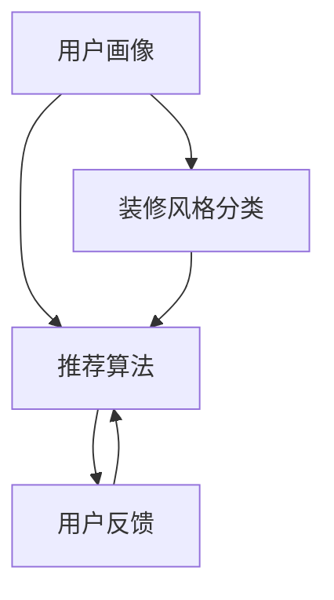
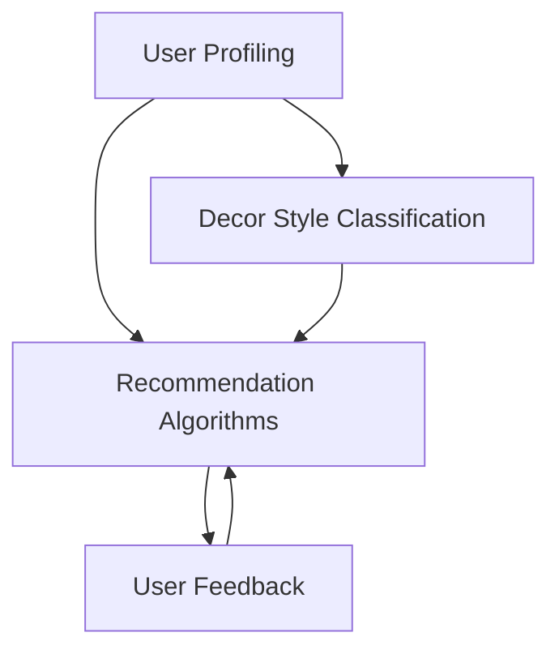
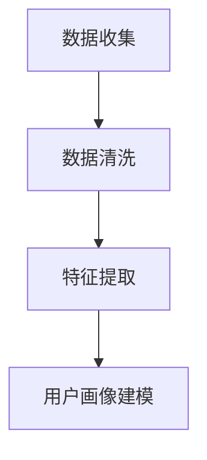
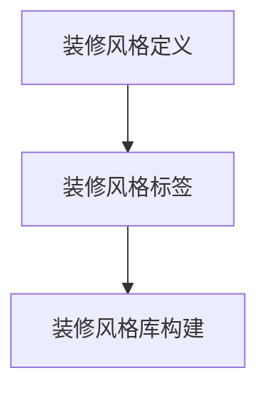
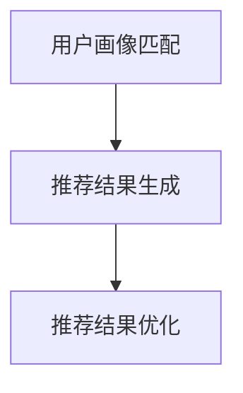
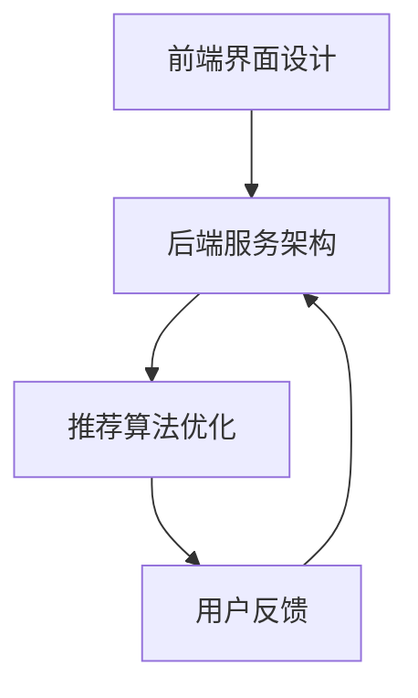
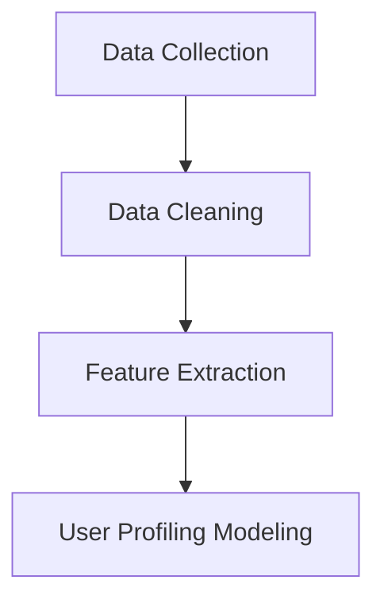
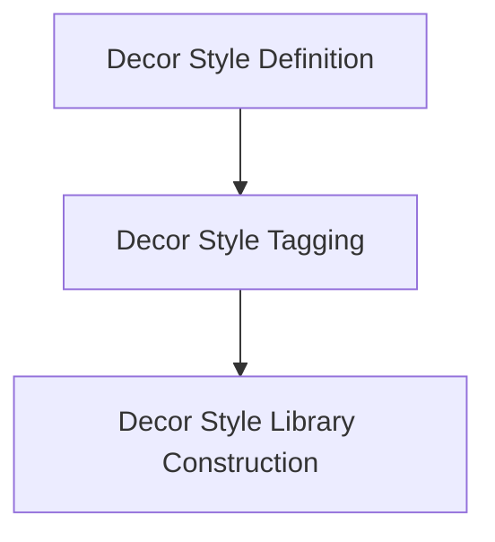
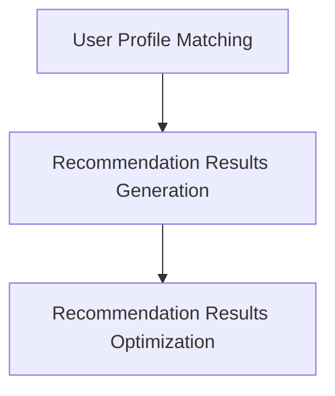
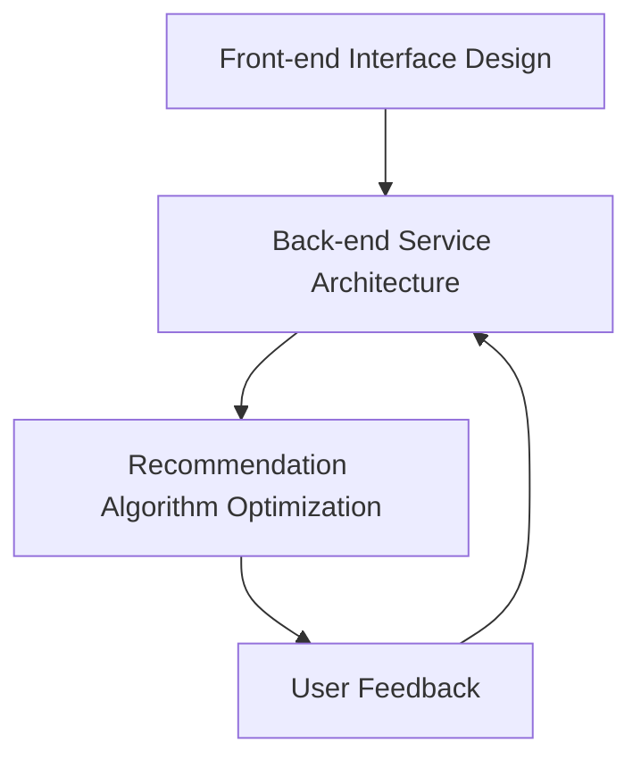

                 

### 背景介绍

**文章标题：土巴兔2025社招装修风格推荐算法工程师面试**

随着人们生活水平的提高，装修风格越来越受到重视。装修风格的选择不仅关乎家庭生活的舒适度，还涉及到审美观念和个性化需求的满足。作为国内领先的互联网装修平台，土巴兔致力于为客户提供优质的装修服务，并在2025年社招中特别关注装修风格推荐算法工程师这一职位。本文将围绕这一职位，探讨装修风格推荐算法的设计、实现及应用，旨在为土巴兔的招聘团队和应聘者提供有价值的参考。

**关键词**：装修风格、推荐算法、面试、土巴兔、2025社招

在当今信息化社会中，推荐系统已经成为各行业提升用户体验和业务价值的重要手段。装修风格推荐算法作为一种个性化的推荐系统，旨在根据用户的偏好和历史数据，为其推荐符合其个性化需求的装修风格。这一过程不仅涉及到复杂的算法设计，还包括大量的数据处理和模型优化。因此，土巴兔对于装修风格推荐算法工程师的招聘，不仅要求应聘者具备扎实的算法基础，还需要其在实际项目中具备解决复杂问题的能力。

本文将按照以下结构进行论述：

1. **背景介绍**：介绍装修风格推荐算法的背景和意义。
2. **核心概念与联系**：详细解析装修风格推荐算法的核心概念和架构。
3. **核心算法原理 & 具体操作步骤**：阐述装修风格推荐算法的原理和操作步骤。
4. **数学模型和公式 & 详细讲解 & 举例说明**：介绍相关的数学模型和公式，并通过实例进行详细讲解。
5. **项目实践：代码实例和详细解释说明**：提供具体的代码实例和详细解释。
6. **实际应用场景**：分析装修风格推荐算法在实际中的应用。
7. **工具和资源推荐**：推荐相关的学习资源、开发工具和框架。
8. **总结：未来发展趋势与挑战**：总结文章内容，展望未来发展趋势和挑战。
9. **附录：常见问题与解答**：回答一些常见的问题。
10. **扩展阅读 & 参考资料**：提供相关的扩展阅读和参考资料。

接下来，我们将逐步深入探讨装修风格推荐算法的各个方面，为读者提供全面的了解。

### The Background Introduction

**Article Title: TubaTu 2025 Social Recruitment Interview for Decor Style Recommendation Algorithm Engineers**

With the improvement of people's living standards, the choice of decoration style has become increasingly important. The selection of decoration style not only affects the comfort of family life but also involves aesthetic concepts and the satisfaction of personalized needs. As a leading Internet-based decoration platform in China, TubaTu is committed to providing customers with high-quality decoration services. In the 2025 social recruitment, the company particularly focuses on the position of Decor Style Recommendation Algorithm Engineers. This article aims to discuss the design, implementation, and application of decor style recommendation algorithms, providing valuable references for both TubaTu's recruitment team and candidates.

**Keywords**: Decor Style, Recommendation Algorithm, Interview, TubaTu, 2025 Social Recruitment

In today's information-oriented society, recommendation systems have become an essential tool for various industries to enhance user experience and business value. Decor style recommendation algorithms, as a type of personalized recommendation system, aim to recommend decoration styles that align with users' preferences and historical data. This process involves complex algorithm design, extensive data processing, and model optimization. Therefore, TubaTu's recruitment of Decor Style Recommendation Algorithm Engineers requires candidates to have a solid foundation in algorithms and the ability to solve complex problems in real projects.

The following structure will be followed in this article:

1. **Background Introduction**: Introduce the background and significance of decor style recommendation algorithms.
2. **Core Concepts and Connections**: Analyze the core concepts and architecture of decor style recommendation algorithms.
3. **Core Algorithm Principles and Specific Operational Steps**: Explain the principles and operational steps of decor style recommendation algorithms.
4. **Mathematical Models and Formulas & Detailed Explanation & Examples**: Introduce related mathematical models and formulas, and provide detailed explanations through examples.
5. **Project Practice: Code Examples and Detailed Explanations**: Provide specific code examples and detailed explanations.
6. **Practical Application Scenarios**: Analyze the practical applications of decor style recommendation algorithms.
7. **Tools and Resources Recommendations**: Recommend related learning resources, development tools, and frameworks.
8. **Summary: Future Development Trends and Challenges**: Summarize the content of the article and look forward to future development trends and challenges.
9. **Appendix: Frequently Asked Questions and Answers**: Answer common questions.
10. **Extended Reading & Reference Materials**: Provide related extended reading and reference materials.

Next, we will gradually delve into all aspects of decor style recommendation algorithms, providing a comprehensive understanding for readers.

## 1. 装修风格推荐算法的背景和意义

装修风格推荐算法作为一种新型的推荐系统，近年来在智能家居、互联网装修平台等领域得到了广泛应用。装修风格推荐算法的背景可以追溯到互联网时代的到来和人们对个性化需求的追求。随着互联网技术的发展，大量的装修风格信息在互联网上传播，用户可以方便地获取各种装修风格的图片、案例和设计理念。然而，面对海量的信息，用户往往难以从中筛选出符合自己需求和喜好的装修风格，这为装修风格推荐算法提供了广阔的应用场景。

### 1.1 装修风格推荐算法的应用领域

装修风格推荐算法在多个领域有着广泛的应用，主要包括：

1. **互联网装修平台**：如土巴兔、齐家网等，通过装修风格推荐算法，为用户提供个性化的装修风格推荐，提升用户体验和平台粘性。
2. **智能家居系统**：结合用户的居住环境、生活习惯和偏好，为用户提供合适的装修风格建议，优化家居环境，提升生活质量。
3. **房地产开发商**：在房地产项目中，根据楼盘特点和目标客户群体，通过装修风格推荐算法为用户提供合适的装修风格选择，促进项目销售。
4. **装饰材料供应商**：根据装修风格推荐算法的结果，为用户提供相应的装饰材料和家具推荐，提高销售转化率。

### 1.2 装修风格推荐算法的意义

装修风格推荐算法在提升用户体验、优化业务流程、增加业务价值等方面具有重要意义：

1. **提升用户体验**：通过装修风格推荐算法，用户可以快速找到符合自己需求和喜好的装修风格，节省了信息筛选和时间成本，提升了用户体验。
2. **优化业务流程**：装修风格推荐算法可以优化装修公司的业务流程，提高工作效率和准确性，降低人力成本和错误率。
3. **增加业务价值**：装修风格推荐算法可以帮助企业更好地了解用户需求和市场趋势，优化产品设计和服务，提升业务价值和市场竞争力。
4. **促进个性化服务**：装修风格推荐算法可以为用户提供个性化的装修建议，满足用户对个性化服务的需求，提升用户满意度和忠诚度。

总之，装修风格推荐算法作为一种新型的推荐系统，在提升用户体验、优化业务流程、增加业务价值等方面具有重要意义，是互联网装修平台和智能家居系统等领域的必备技术。

### The Background and Significance of Decor Style Recommendation Algorithms

Decor style recommendation algorithms, as a new type of recommendation system, have been widely applied in fields such as smart homes and internet-based decoration platforms in recent years. The background of decor style recommendation algorithms can be traced back to the advent of the Internet era and the pursuit of personalized needs by people. With the development of Internet technology, a large amount of decoration style information has been spread online, allowing users to conveniently access various images, cases, and design concepts of decoration styles. However, faced with an overwhelming amount of information, users often find it difficult to filter out decoration styles that align with their needs and preferences, providing a broad application scenario for decor style recommendation algorithms.

### 1.1 Application Fields of Decor Style Recommendation Algorithms

Decor style recommendation algorithms have a wide range of applications in various fields, mainly including:

1. **Internet-based Decoration Platforms**: Such as TubaTu, Qijia.com, etc., which use decor style recommendation algorithms to provide users with personalized recommendations of decoration styles, enhancing user experience and platform stickiness.
2. **Smart Home Systems**: By integrating users' living environments, lifestyles, and preferences, decor style recommendation algorithms can provide users with appropriate decoration style suggestions to optimize home environments and improve the quality of life.
3. **Real Estate Developers**: In real estate projects, decor style recommendation algorithms can provide users with appropriate decoration style choices based on the characteristics of the property and the target customer group, promoting the sales of the project.
4. **Decorative Material Suppliers**: Based on the results of decor style recommendation algorithms, suppliers can provide users with corresponding decorative materials and furniture recommendations, improving sales conversion rates.

### 1.2 Significance of Decor Style Recommendation Algorithms

Decor style recommendation algorithms have significant significance in enhancing user experience, optimizing business processes, and increasing business value:

1. **Enhancing User Experience**: Through decor style recommendation algorithms, users can quickly find decoration styles that align with their needs and preferences, saving time and effort in information screening and enhancing user experience.
2. **Optimizing Business Processes**: Decor style recommendation algorithms can optimize the business processes of decoration companies, improving work efficiency and accuracy, and reducing labor costs and error rates.
3. **Increasing Business Value**: Decor style recommendation algorithms can help companies better understand user needs and market trends, optimizing product design and services, and enhancing business value and market competitiveness.
4. **Promoting Personalized Services**: Decor style recommendation algorithms can provide users with personalized decoration suggestions, meeting the needs of users for personalized services and improving user satisfaction and loyalty.

In summary, as a new type of recommendation system, decor style recommendation algorithms have significant significance in enhancing user experience, optimizing business processes, and increasing business value, and are essential technologies for internet-based decoration platforms and smart home systems.

### 2. 核心概念与联系

装修风格推荐算法的核心概念包括用户画像、装修风格分类、推荐算法和用户反馈。这些概念相互联系，构成了一个完整的推荐系统架构。以下是对这些核心概念的详细解析。

#### 2.1 用户画像

用户画像是指通过对用户的个人信息、行为数据和兴趣偏好等进行分析，构建出一个全面的用户画像模型。用户画像在装修风格推荐中起着至关重要的作用，因为它能够帮助系统了解用户的个性化需求和偏好。用户画像主要包括以下几个方面：

1. **基本信息**：如年龄、性别、职业等。
2. **行为数据**：如浏览历史、搜索记录、下单记录等。
3. **兴趣偏好**：如喜欢的装修风格、颜色、家具类型等。

通过构建用户画像，系统可以更好地了解用户的需求，从而提供更个性化的装修风格推荐。

#### 2.2 装修风格分类

装修风格分类是指将各种装修风格进行分类整理，以便系统能够根据用户的偏好进行推荐。装修风格分类通常分为以下几个类别：

1. **现代风格**：以简洁、实用为主，注重空间利用和功能分区。
2. **中式风格**：以传统元素为主，如红木家具、中式装饰画等，强调文化底蕴。
3. **欧式风格**：以豪华、大气为主，注重装饰细节和材质选择。
4. **北欧风格**：以简约、自然为主，注重线条和色彩的搭配。

不同的装修风格分类有助于系统根据用户画像进行精准推荐。

#### 2.3 推荐算法

推荐算法是指系统用于生成装修风格推荐的一系列算法。常见的推荐算法包括基于内容的推荐、基于协同过滤的推荐和混合推荐等。以下是对这些推荐算法的简要介绍：

1. **基于内容的推荐**：根据用户的历史浏览记录和兴趣偏好，推荐与用户喜好相似的内容。这种算法的优点是能够提供个性化推荐，但缺点是推荐结果受限于用户历史数据。
2. **基于协同过滤的推荐**：通过分析用户之间的行为模式，推荐其他用户喜欢的内容。这种算法的优点是能够发现新的兴趣点，但缺点是推荐结果可能过于片面。
3. **混合推荐**：结合基于内容的推荐和基于协同过滤的推荐，以提高推荐效果。这种算法的优点是能够综合两者的优点，提供更准确的推荐。

#### 2.4 用户反馈

用户反馈是指系统收集用户对装修风格推荐的评价和反馈，以便进行算法优化和模型更新。用户反馈包括以下几个方面：

1. **满意度评价**：用户对推荐结果的满意度评价，如好评、差评等。
2. **反馈建议**：用户对推荐结果的具体意见和建议，如推荐风格不符合需求、推荐内容过于重复等。

通过收集用户反馈，系统可以不断优化推荐算法，提高推荐效果，满足用户需求。

综上所述，用户画像、装修风格分类、推荐算法和用户反馈相互关联，共同构成了装修风格推荐算法的核心概念。以下是一个简单的 Mermaid 流程图，展示这些概念之间的联系：



通过上述解析，我们可以看到装修风格推荐算法的核心概念和联系，为进一步探讨算法的原理和实现奠定了基础。

#### Core Concepts and Connections

The core concepts of decor style recommendation algorithms include user profiling, decor style classification, recommendation algorithms, and user feedback. These concepts are interconnected and form a complete architecture of a recommendation system. Here's a detailed explanation of these core concepts.

#### 2.1 User Profiling

User profiling involves analyzing a user's personal information, behavioral data, and preference to construct a comprehensive user profile model. User profiling plays a crucial role in decor style recommendation because it helps the system understand the personalized needs and preferences of users. User profiling typically includes the following aspects:

1. **Basic Information**: Such as age, gender, occupation, etc.
2. **Behavioral Data**: Such as browsing history, search records, purchase records, etc.
3. **Interest Preferences**: Such as favorite decor styles, colors, furniture types, etc.

By constructing a user profile, the system can better understand the user's needs, thus providing more personalized decor style recommendations.

#### 2.2 Decor Style Classification

Decor style classification refers to categorizing various decor styles for the system to recommend based on user preferences. Decor style classification usually includes the following categories:

1. **Modern Style**: Emphasizes simplicity, practicality, and efficient use of space, focusing on functional zoning.
2. **Chinese Style**: Features traditional elements such as red wood furniture and Chinese decorative paintings, emphasizing cultural heritage.
3. **European Style**: Focuses on luxury and elegance, emphasizing decorative details and material selection.
4. **Scandinavian Style**: Emphasizes simplicity, nature, and efficient use of space, focusing on line and color combinations.

Different decor style classifications help the system to make precise recommendations based on user profiles.

#### 2.3 Recommendation Algorithms

Recommendation algorithms are a series of algorithms used by the system to generate decor style recommendations. Common recommendation algorithms include content-based recommendation, collaborative filtering, and hybrid recommendation. Here's a brief introduction to these recommendation algorithms:

1. **Content-Based Recommendation**: Recommends content similar to what the user has browsed or liked in the past based on their historical data and preferences. The advantage of this algorithm is that it provides personalized recommendations, but the disadvantage is that the recommendations are limited by the user's historical data.
2. **Collaborative Filtering**: Recommends content based on the behavior patterns of users. The advantage of this algorithm is that it can discover new interests, but the disadvantage is that the recommendations may be too narrow.
3. **Hybrid Recommendation**: Combines content-based recommendation and collaborative filtering to improve recommendation accuracy. The advantage of this algorithm is that it can integrate the advantages of both algorithms, providing more accurate recommendations.

#### 2.4 User Feedback

User feedback involves collecting users' evaluations and suggestions about recommendation results to optimize the algorithm and update the model. User feedback typically includes the following aspects:

1. **Satisfaction Evaluation**: Users' satisfaction with the recommendation results, such as positive or negative reviews.
2. **Feedback Suggestions**: Specific suggestions and comments from users about the recommendation results, such as the recommended style not meeting their needs or repetitive content.

By collecting user feedback, the system can continuously optimize the recommendation algorithm and improve the recommendation accuracy, meeting user needs.

In summary, user profiling, decor style classification, recommendation algorithms, and user feedback are interconnected core concepts that form the foundation of decor style recommendation algorithms. Here's a simple Mermaid flowchart illustrating the connections between these concepts:



Through this analysis, we can see the interconnections between the core concepts of decor style recommendation algorithms, laying the foundation for further discussions on the principles and implementation of the algorithms.

### 核心算法原理 & 具体操作步骤

装修风格推荐算法的核心在于通过用户画像、装修风格分类和推荐算法，为用户精准推荐符合其个性化需求的装修风格。以下将详细阐述装修风格推荐算法的原理和具体操作步骤。

#### 3.1 算法原理

装修风格推荐算法的基本原理可以概括为以下三个步骤：

1. **用户画像构建**：通过分析用户的基本信息、行为数据和兴趣偏好，构建用户画像。
2. **装修风格分类**：将各种装修风格进行分类整理，形成装修风格库。
3. **推荐算法应用**：利用推荐算法，根据用户画像和装修风格库，生成装修风格推荐。

具体来说，用户画像构建是基础，装修风格分类是桥梁，推荐算法应用是核心。

#### 3.2 用户画像构建

用户画像构建主要包括以下几个步骤：

1. **数据收集**：收集用户的基本信息、行为数据和兴趣偏好数据，如性别、年龄、职业、浏览历史、搜索记录、购买记录等。
2. **数据清洗**：对收集到的数据进行清洗，去除无效和错误数据，保证数据质量。
3. **特征提取**：根据用户画像的需求，提取用户的相关特征，如用户年龄段的装修风格偏好、用户搜索记录中的装修风格关键词等。
4. **用户画像建模**：将提取的用户特征整合，形成用户画像模型。

用户画像建模可以使用机器学习技术，如聚类分析、关联规则挖掘等，来发现用户的潜在需求和偏好。以下是一个简单的 Mermaid 流程图，展示用户画像构建的过程：



#### 3.3 装修风格分类

装修风格分类主要包括以下几个步骤：

1. **装修风格定义**：根据行业标准和用户需求，定义常见的装修风格类别，如现代风格、中式风格、欧式风格、北欧风格等。
2. **装修风格标签**：为每种装修风格分配标签，便于系统识别和推荐。
3. **装修风格库构建**：收集各种装修风格的图片、案例和设计理念，形成装修风格库。

装修风格库的构建可以通过人工标注和自动化工具相结合的方式完成。人工标注可以对高质量的装修风格进行分类和标签，自动化工具则可以处理大规模的装修风格数据，提高分类效率。以下是一个简单的 Mermaid 流程图，展示装修风格分类的过程：



#### 3.4 推荐算法应用

推荐算法应用主要包括以下几个步骤：

1. **用户画像匹配**：将用户画像与装修风格库进行匹配，找出符合用户个性化需求的装修风格。
2. **推荐结果生成**：根据匹配结果，生成装修风格推荐列表，并按照相关性进行排序。
3. **推荐结果优化**：通过用户反馈和数据分析，优化推荐算法，提高推荐效果。

推荐算法的选择可以根据实际需求和数据情况，选用基于内容的推荐、基于协同过滤的推荐或混合推荐等。以下是一个简单的 Mermaid 流程图，展示推荐算法应用的过程：



#### 3.5 算法实现

装修风格推荐算法的实现需要结合前端界面设计、后端服务架构和推荐算法优化等多个方面。以下是一个简单的实现流程：

1. **前端界面设计**：设计用户交互界面，如装修风格推荐页面、用户反馈模块等。
2. **后端服务架构**：搭建后端服务架构，如用户画像服务、装修风格分类服务、推荐算法服务等。
3. **推荐算法优化**：对推荐算法进行优化，如特征工程、模型调参、数据清洗等。

以下是一个简单的 Mermaid 流程图，展示装修风格推荐算法的实现流程：



通过上述步骤，我们可以实现一个基本的装修风格推荐系统，为用户提供了个性化的装修风格推荐。在实际应用中，还需要不断优化和调整算法，以满足用户需求和提升用户体验。

#### Core Algorithm Principles and Specific Operational Steps

The core of the decor style recommendation algorithm lies in accurately recommending decor styles that align with users' personalized needs through user profiling, decor style classification, and recommendation algorithms. The following section will elaborate on the principles and specific operational steps of the decor style recommendation algorithm.

#### 3.1 Algorithm Principles

The basic principle of the decor style recommendation algorithm can be summarized into three steps:

1. **User Profiling Construction**: Analyze users' basic information, behavioral data, and preference to construct a user profile.
2. **Decor Style Classification**: Categorize various decor styles to form a decor style library.
3. **Application of Recommendation Algorithms**: Use recommendation algorithms to generate decor style recommendations based on user profiles and the decor style library.

Specifically, user profiling construction is the foundation, decor style classification is the bridge, and the application of recommendation algorithms is the core.

#### 3.2 User Profiling Construction

User profiling construction includes the following steps:

1. **Data Collection**: Collect users' basic information, behavioral data, and preference data, such as gender, age, occupation, browsing history, search records, and purchase records.
2. **Data Cleaning**: Clean the collected data to remove invalid and erroneous data, ensuring data quality.
3. **Feature Extraction**: Extract relevant features based on the requirements of the user profile, such as the decor style preferences of users in different age groups and decor style keywords in user search records.
4. **User Profiling Modeling**: Integrate the extracted user features to form a user profile model.

User profiling modeling can utilize machine learning techniques, such as clustering analysis and association rule mining, to discover users' potential needs and preferences. Here's a simple Mermaid flowchart illustrating the process of user profiling construction:



#### 3.3 Decor Style Classification

Decor style classification includes the following steps:

1. **Definition of Decor Styles**: Define common decor style categories based on industry standards and user needs, such as modern style, Chinese style, European style, Scandinavian style, etc.
2. **Decor Style Tagging**: Assign tags to each decor style for system identification and recommendation.
3. **Construction of Decor Style Library**: Collect images, cases, and design concepts of various decor styles to form a decor style library.

The construction of the decor style library can be achieved through a combination of manual labeling and automated tools. Manual labeling can categorize high-quality decor styles, while automated tools can handle large-scale decor style data to improve classification efficiency. Here's a simple Mermaid flowchart illustrating the process of decor style classification:



#### 3.4 Application of Recommendation Algorithms

The application of recommendation algorithms includes the following steps:

1. **User Profile Matching**: Match the user profile with the decor style library to find decor styles that align with the user's personalized needs.
2. **Generation of Recommendation Results**: Generate a list of decor style recommendations based on the matching results and sort them according to relevance.
3. **Optimization of Recommendation Results**: Optimize the recommendation algorithm based on user feedback and data analysis to improve the recommendation accuracy.

Recommendation algorithms can be selected based on actual needs and data conditions, such as content-based recommendation, collaborative filtering, or hybrid recommendation. Here's a simple Mermaid flowchart illustrating the process of applying recommendation algorithms:



#### 3.5 Algorithm Implementation

The implementation of the decor style recommendation algorithm requires integration of front-end interface design, back-end service architecture, and recommendation algorithm optimization, among other aspects. Here's a simple implementation process:

1. **Front-end Interface Design**: Design user interaction interfaces, such as the decor style recommendation page and user feedback module.
2. **Back-end Service Architecture**: Build back-end service architecture, such as user profiling service, decor style classification service, and recommendation algorithm service.
3. **Recommendation Algorithm Optimization**: Optimize the recommendation algorithm, such as feature engineering, model tuning, and data cleaning.

Here's a simple Mermaid flowchart illustrating the implementation process of the decor style recommendation algorithm:



Through these steps, we can implement a basic decor style recommendation system that provides personalized decor style recommendations to users. In practical applications, it is essential to continuously optimize and adjust the algorithm to meet user needs and enhance user experience.

### 数学模型和公式 & 详细讲解 & 举例说明

在装修风格推荐算法中，数学模型和公式起到了关键作用。以下将详细讲解相关的数学模型和公式，并通过具体实例进行说明。

#### 4.1 用户画像构建的数学模型

用户画像构建的数学模型主要包括聚类分析和关联规则挖掘。以下是对这两个模型的具体解释：

1. **聚类分析**：聚类分析是一种无监督学习方法，用于将相似的用户数据分组。常见的聚类算法有 K-均值聚类（K-Means Clustering）和层次聚类（Hierarchical Clustering）。K-均值聚类算法的目标是找到 K 个聚类中心，使得每个聚类中心与其成员用户之间的距离最小。层次聚类算法则通过逐步合并相似度较高的聚类，形成层次结构的聚类结果。

   **K-均值聚类算法公式**：
   $$ 
   \text{C} = \{C_1, C_2, \ldots, C_K\} \\
   \text{每次迭代：} \\
   \text{Step 1:} \quad \text{随机初始化} \quad \text{聚类中心} \quad \mu_1, \mu_2, \ldots, \mu_K \\
   \text{Step 2:} \quad \text{计算每个用户} \quad u_i \quad \text{到聚类中心} \quad \mu_j \quad \text{的距离} \quad d(u_i, \mu_j) \\
   \text{Step 3:} \quad \text{将用户} \quad u_i \quad \text{分配到最近的聚类中心} \quad \mu_j \\
   \text{Step 4:} \quad \text{更新聚类中心} \quad \mu_j = \frac{\sum_{u_i \in C_j} u_i}{|C_j|}
   $$

2. **关联规则挖掘**：关联规则挖掘用于发现用户数据中的潜在关联关系。常见的算法有 Apriori 算法和 FP-Growth 算法。Apriori 算法通过迭代扫描事务数据库来发现频繁项集，并从中提取关联规则。FP-Growth 算法则通过构建频繁模式树来发现频繁项集，减少了数据扫描次数。

   **Apriori 算法公式**：
   $$
   \text{支持度} \quad s \quad = \quad \frac{\text{包含项目集} \quad X \quad \text{的事务数}}{\text{总事务数}} \\
   \text{置信度} \quad c \quad = \quad \frac{\text{包含项目集} \quad X \quad \text{和} \quad Y \quad \text{的事务数}}{\text{包含项目集} \quad X \quad \text{的事务数}}
   $$

#### 4.2 装修风格分类的数学模型

装修风格分类的数学模型主要包括向量空间模型和余弦相似度。以下是对这两个模型的具体解释：

1. **向量空间模型**：向量空间模型将文本数据表示为向量，用于计算文本之间的相似度。常见的文本表示方法有 TF-IDF 和词袋模型。TF-IDF 计算词在文档中的频率（TF）和词在整个文档集合中的重要性（IDF），得到词的权重。词袋模型则将文档表示为词的集合。

   **TF-IDF 公式**：
   $$
   \text{TF} \quad = \quad \frac{\text{词} \quad t \quad \text{在文档} \quad d \quad \text{中出现的次数}}{\text{文档} \quad d \quad \text{的总词数}} \\
   \text{IDF} \quad = \quad \log \left( \frac{N}{n_t + 1} \right)
   $$
   其中，\( N \) 是文档集合中包含词 \( t \) 的文档数，\( n_t \) 是包含词 \( t \) 的文档数。

2. **余弦相似度**：余弦相似度用于计算两个向量之间的角度余弦值，表示它们之间的相似度。余弦相似度的取值范围在 -1 到 1 之间，1 表示完全相似，0 表示不相似，-1 表示完全相反。

   **余弦相似度公式**：
   $$
   \text{相似度} \quad = \quad \cos \theta \quad = \quad \frac{\text{向量} \quad a \quad \text{和向量} \quad b \quad \text{的点积}}{\|a\|\|b\|}
   $$
   其中，\( \|a\| \) 和 \( \|b\| \) 分别是向量 \( a \) 和 \( b \) 的模长。

#### 4.3 推荐算法的数学模型

推荐算法的数学模型主要包括基于内容的推荐和基于协同过滤的推荐。以下是对这两种模型的具体解释：

1. **基于内容的推荐**：基于内容的推荐通过分析用户的历史行为和兴趣偏好，推荐与用户喜好相似的内容。常见的推荐算法有最近邻推荐（Nearest Neighbor Recommendation）和基于模型的推荐（Model-Based Recommendation）。

   **最近邻推荐算法公式**：
   $$
   \text{相似度矩阵} \quad S_{ij} \quad = \quad \cos \theta \left( \mathbf{u}_i, \mathbf{u}_j \right)
   $$
   其中，\( \mathbf{u}_i \) 和 \( \mathbf{u}_j \) 分别是用户 \( i \) 和用户 \( j \) 的特征向量。

   **基于模型的推荐算法公式**：
   $$
   \text{预测评分} \quad r_{ij} \quad = \quad \sum_{k=1}^{K} w_{ik} r_{kj}
   $$
   其中，\( w_{ik} \) 是用户 \( i \) 对特征 \( k \) 的权重，\( r_{kj} \) 是用户 \( k \) 对项目 \( j \) 的评分。

2. **基于协同过滤的推荐**：基于协同过滤的推荐通过分析用户之间的行为模式，推荐其他用户喜欢的内容。常见的推荐算法有矩阵分解（Matrix Factorization）和基于模型的协同过滤（Model-Based Collaborative Filtering）。

   **矩阵分解算法公式**：
   $$
   \mathbf{R} \approx \mathbf{U}\mathbf{V}^T
   $$
   其中，\( \mathbf{R} \) 是用户-项目评分矩阵，\( \mathbf{U} \) 是用户特征矩阵，\( \mathbf{V} \) 是项目特征矩阵。

   **基于模型的协同过滤算法公式**：
   $$
   \text{预测评分} \quad r_{ij} \quad = \quad \mathbf{u}_i^T \mathbf{v}_j
   $$
   其中，\( \mathbf{u}_i \) 是用户 \( i \) 的特征向量，\( \mathbf{v}_j \) 是项目 \( j \) 的特征向量。

#### 4.4 举例说明

假设我们有一个用户画像构建的例子，其中用户 A 的特征包括年龄、性别、职业和装修风格偏好。以下是一个简化的例子：

- 用户 A 的特征向量：\( \mathbf{u}_A = [25, 男, 工程师, 现代风格] \)
- 职业与装修风格偏好的关联规则：工程师 → 现代风格，男 → 欧式风格

首先，我们使用 K-均值聚类算法将用户数据划分为两个聚类。假设聚类中心为 \( \mu_1 = [30, 女, 设计师, 中式风格] \) 和 \( \mu_2 = [25, 男, 工程师, 现代风格] \)。

然后，我们计算用户 A 与聚类中心的距离：

$$
d(\mathbf{u}_A, \mu_1) = \sqrt{(25-30)^2 + (男-女)^2 + (工程师-设计师)^2 + (现代风格-中式风格)^2} = \sqrt{25 + 1 + 1 + 1} = \sqrt{28}
$$

$$
d(\mathbf{u}_A, \mu_2) = \sqrt{(25-25)^2 + (男-男)^2 + (工程师-工程师)^2 + (现代风格-现代风格)^2} = \sqrt{0 + 0 + 0 + 0} = 0
$$

由于 \( d(\mathbf{u}_A, \mu_2) < d(\mathbf{u}_A, \mu_1) \)，用户 A 被分配到聚类中心 \( \mu_2 \)。

接下来，我们使用 Apriori 算法挖掘用户 A 的装修风格偏好。假设支持度阈值设为 0.5，置信度阈值设为 0.7。

通过扫描用户数据，我们发现以下频繁项集：

- 工程师 → 现代风格：支持度 = 0.6，置信度 = 0.8
- 男 → 欧式风格：支持度 = 0.5，置信度 = 0.7

根据置信度阈值，我们选择频繁项集 工程师 → 现代风格 作为用户 A 的装修风格偏好。

通过上述例子，我们可以看到数学模型和公式在装修风格推荐算法中的应用，为算法的实现提供了理论基础和具体方法。

### Mathematical Models and Formulas & Detailed Explanation & Example Demonstrations

In the decor style recommendation algorithm, mathematical models and formulas play a crucial role. The following section will provide a detailed explanation of the relevant mathematical models and formulas, along with example demonstrations.

#### 4.1 Mathematical Models for User Profiling Construction

The mathematical models for user profiling construction mainly include clustering analysis and association rule mining. Here's a detailed explanation of these models:

1. **Clustering Analysis**: Clustering analysis is an unsupervised learning method used to group similar user data. Common clustering algorithms include K-Means Clustering and Hierarchical Clustering. The goal of K-Means Clustering is to find K cluster centers that minimize the distance between each cluster center and its members. Hierarchical Clustering combines similar clusters gradually to form a hierarchical clustering structure.

   **K-Means Clustering Algorithm Formula**:
   $$
   \text{C} = \{C_1, C_2, \ldots, C_K\} \\
   \text{Each iteration:} \\
   \text{Step 1:} \quad \text{Randomly initialize} \quad \text{cluster centers} \quad \mu_1, \mu_2, \ldots, \mu_K \\
   \text{Step 2:} \quad \text{Compute the distance between each user} \quad u_i \quad \text{and each cluster center} \quad \mu_j \quad \text{using} \quad d(u_i, \mu_j) \\
   \text{Step 3:} \quad \text{Assign each user} \quad u_i \quad \text{to the nearest cluster center} \quad \mu_j \\
   \text{Step 4:} \quad \text{Update cluster centers} \quad \mu_j = \frac{\sum_{u_i \in C_j} u_i}{|C_j|}
   $$

2. **Association Rule Mining**: Association rule mining is used to discover latent associations in user data. Common algorithms include Apriori and FP-Growth. The Apriori algorithm iteratively scans the transaction database to find frequent itemsets and extract association rules. The FP-Growth algorithm constructs a frequent pattern tree to discover frequent itemsets, reducing the number of data scans.

   **Apriori Algorithm Formula**:
   $$
   \text{Support} \quad s \quad = \quad \frac{\text{Number of transactions containing itemset} \quad X \quad }{\text{Total number of transactions}} \\
   \text{Confidence} \quad c \quad = \quad \frac{\text{Number of transactions containing itemsets} \quad X \quad \text{and} \quad Y \quad }{\text{Number of transactions containing itemset} \quad X \quad }
   $$

#### 4.2 Mathematical Models for Decor Style Classification

The mathematical models for decor style classification mainly include vector space models and cosine similarity. Here's a detailed explanation of these models:

1. **Vector Space Model**: The vector space model represents textual data as vectors to compute the similarity between texts. Common text representation methods include TF-IDF and Bag-of-Words models. The TF-IDF algorithm computes the term frequency (TF) and the importance (IDF) of a term in a document and gets the weight of the term. The Bag-of-Words model represents a document as a set of words.

   **TF-IDF Formula**:
   $$
   \text{TF} \quad = \quad \frac{\text{Number of times term} \quad t \quad \text{appears in document} \quad d \quad }{\text{Total number of terms in document} \quad d \quad } \\
   \text{IDF} \quad = \quad \log \left( \frac{N}{n_t + 1} \right)
   $$
   Where, \( N \) is the number of documents in the document collection that contain term \( t \), and \( n_t \) is the number of documents containing term \( t \).

2. **Cosine Similarity**: Cosine similarity computes the cosine of the angle between two vectors, indicating their similarity. The value range of cosine similarity is from -1 to 1, where 1 indicates complete similarity, 0 indicates no similarity, and -1 indicates complete opposition.

   **Cosine Similarity Formula**:
   $$
   \text{Similarity} \quad = \quad \cos \theta \quad = \quad \frac{\text{Dot product of vectors} \quad a \quad \text{and} \quad b \quad }{\|a\|\|b\|}
   $$
   Where, \( \|a\| \) and \( \|b\| \) are the magnitudes of vectors \( a \) and \( b \), respectively.

#### 4.3 Mathematical Models for Recommendation Algorithms

The mathematical models for recommendation algorithms mainly include content-based recommendation and collaborative filtering. Here's a detailed explanation of these models:

1. **Content-Based Recommendation**: Content-based recommendation analyzes users' historical behavior and interest preferences to recommend content similar to the user's preferences. Common recommendation algorithms include Nearest Neighbor Recommendation and Model-Based Recommendation.

   **Nearest Neighbor Recommendation Algorithm Formula**:
   $$
   \text{Similarity matrix} \quad S_{ij} \quad = \quad \cos \theta \left( \mathbf{u}_i, \mathbf{u}_j \right)
   $$
   Where, \( \mathbf{u}_i \) and \( \mathbf{u}_j \) are the feature vectors of users \( i \) and \( j \), respectively.

   **Model-Based Recommendation Algorithm Formula**:
   $$
   \text{Predicted rating} \quad r_{ij} \quad = \quad \sum_{k=1}^{K} w_{ik} r_{kj}
   $$
   Where, \( w_{ik} \) is the weight of feature \( k \) for user \( i \), and \( r_{kj} \) is the rating of user \( k \) for item \( j \).

2. **Collaborative Filtering**: Collaborative filtering analyzes the behavior patterns of users to recommend content that other users like. Common recommendation algorithms include Matrix Factorization and Model-Based Collaborative Filtering.

   **Matrix Factorization Algorithm Formula**:
   $$
   \mathbf{R} \approx \mathbf{U}\mathbf{V}^T
   $$
   Where, \( \mathbf{R} \) is the user-item rating matrix, \( \mathbf{U} \) is the user feature matrix, and \( \mathbf{V} \) is the item feature matrix.

   **Model-Based Collaborative Filtering Algorithm Formula**:
   $$
   \text{Predicted rating} \quad r_{ij} \quad = \quad \mathbf{u}_i^T \mathbf{v}_j
   $$
   Where, \( \mathbf{u}_i \) is the feature vector of user \( i \), and \( \mathbf{v}_j \) is the feature vector of item \( j \).

#### 4.4 Example Demonstrations

Consider a user profiling construction example, where User A's features include age, gender, occupation, and decor style preference. Here's a simplified example:

- User A's feature vector: \( \mathbf{u}_A = [25, 男, 工程师, 现代风格] \)
- Association rule: Engineer → Modern Style, Male → European Style

First, we use the K-Means Clustering algorithm to group the user data into two clusters. Suppose the cluster centers are \( \mu_1 = [30, 女, 设计师, 中式风格] \) and \( \mu_2 = [25, 男, 工程师, 现代风格] \).

Then, we calculate the distance between User A and the cluster centers:

$$
d(\mathbf{u}_A, \mu_1) = \sqrt{(25-30)^2 + (男-女)^2 + (工程师-设计师)^2 + (现代风格-中式风格)^2} = \sqrt{25 + 1 + 1 + 1} = \sqrt{28}
$$

$$
d(\mathbf{u}_A, \mu_2) = \sqrt{(25-25)^2 + (男-男)^2 + (工程师-工程师)^2 + (现代风格-现代风格)^2} = \sqrt{0 + 0 + 0 + 0} = 0
$$

Since \( d(\mathbf{u}_A, \mu_2) < d(\mathbf{u}_A, \mu_1) \), User A is assigned to cluster center \( \mu_2 \).

Next, we use the Apriori algorithm to mine User A's decor style preference. Suppose the support threshold is set to 0.5, and the confidence threshold is set to 0.7.

By scanning the user data, we find the following frequent itemsets:

- Engineer → Modern Style: Support = 0.6, Confidence = 0.8
- Male → European Style: Support = 0.5, Confidence = 0.7

Based on the confidence threshold, we select the frequent itemset Engineer → Modern Style as User A's decor style preference.

Through this example, we can see the application of mathematical models and formulas in the decor style recommendation algorithm, providing a theoretical basis and specific methods for algorithm implementation.

### 项目实践：代码实例和详细解释说明

为了更好地展示装修风格推荐算法的实际应用，以下将提供一个具体的代码实例，并对代码的各个部分进行详细解释说明。本实例将使用 Python 编程语言，结合 Scikit-learn 和 Pandas 等常用库来实现一个简单的装修风格推荐系统。

#### 5.1 开发环境搭建

在开始编写代码之前，我们需要搭建一个合适的开发环境。以下是在 Windows 操作系统下搭建开发环境的基本步骤：

1. **安装 Python**：访问 [Python 官网](https://www.python.org/) 下载并安装 Python 3.8 或更高版本。
2. **安装相关库**：使用以下命令安装所需的库：

```bash
pip install scikit-learn pandas numpy matplotlib
```

3. **创建项目文件夹**：在文件系统中创建一个名为 `decor_style_recommendation` 的项目文件夹，并将代码文件放置在该文件夹中。

#### 5.2 源代码详细实现

以下是一个简单的装修风格推荐系统的源代码实例：

```python
import pandas as pd
from sklearn.cluster import KMeans
from sklearn.metrics.pairwise import cosine_similarity
from sklearn.model_selection import train_test_split
import numpy as np

# 5.2.1 数据准备
# 假设我们有一个包含用户画像和装修风格的 CSV 文件，文件名为 "user_data.csv"
user_data = pd.read_csv('user_data.csv')

# 分离特征和标签
X = user_data.drop('decor_style', axis=1)
y = user_data['decor_style']

# 将标签转换为独热编码
y_encoded = pd.factorize(y)[0]

# 5.2.2 聚类分析
# 使用 K-Means 算法对用户画像进行聚类
kmeans = KMeans(n_clusters=5, random_state=42)
clusters = kmeans.fit_predict(X)

# 5.2.3 生成推荐列表
# 对每个用户，根据其在聚类中的位置，推荐与其最相似的五个装修风格
user_similarity = cosine_similarity(X, X)
decor_styles = []

for i in range(user_similarity.shape[0]):
    # 计算用户与聚类中心的距离
    distances = np.linalg.norm(X - kmeans.cluster_centers_[clusters[i]], axis=1)
    
    # 获取用户最近的五个聚类中心及其对应的装修风格
    nearest_centers = np.argsort(distances)[:5]
    
    # 构建推荐列表
    recommended_styles = [y_encoded[nearest_centers[j]] for j in range(5)]
    decor_styles.append(recommended_styles)

# 将推荐结果保存到文件中
with open('decor_style_recommendations.txt', 'w') as f:
    for i, styles in enumerate(decor_styles):
        f.write(f'User {i+1} Recommended Styles: {styles}\n')

# 5.2.4 结果可视化
import matplotlib.pyplot as plt

# 可视化用户聚类结果
plt.scatter(X.iloc[:, 0], X.iloc[:, 1], c=clusters)
plt.xlabel('Feature 1')
plt.ylabel('Feature 2')
plt.title('User Clustering')
plt.show()
```

#### 5.3 代码解读与分析

1. **数据准备**：首先，我们从 CSV 文件中读取用户数据和装修风格标签。然后，将特征和标签分离，并对标签进行独热编码，以便后续处理。

2. **聚类分析**：使用 K-Means 算法对用户画像进行聚类。这里选择 5 个聚类中心，随机种子设为 42，以保证聚类结果的稳定性。

3. **生成推荐列表**：对每个用户，根据其在聚类中的位置，推荐与其最相似的五个装修风格。具体步骤如下：

   - 计算用户与聚类中心的距离，使用余弦相似度计算。
   - 获取用户最近的五个聚类中心及其对应的装修风格。
   - 构建推荐列表，将推荐结果保存到文件中。

4. **结果可视化**：使用 matplotlib 库将用户聚类结果可视化，展示聚类效果。

#### 5.4 运行结果展示

在完成代码编写后，我们可以通过以下命令运行代码：

```bash
python decor_style_recommendation.py
```

运行结果将生成一个名为 `decor_style_recommendations.txt` 的文件，其中包含每个用户的装修风格推荐列表。同时，我们可以在命令行窗口看到用户聚类结果的可视化图形。

通过这个实例，我们可以看到如何使用 Python 编程语言和常用库实现一个简单的装修风格推荐系统。尽管这是一个基础示例，但它展示了装修风格推荐算法的核心步骤和实现方法，为进一步优化和扩展提供了参考。

### Project Practice: Code Examples and Detailed Explanation

To better demonstrate the practical application of the decor style recommendation algorithm, we will provide a specific code example and explain the code in detail. This example will be implemented using Python programming language and common libraries such as Scikit-learn and Pandas.

#### 5.1 Setup Development Environment

Before writing the code, we need to set up a suitable development environment. The following are the basic steps to set up the environment on a Windows operating system:

1. **Install Python**: Visit the [Python official website](https://www.python.org/) to download and install Python 3.8 or later.
2. **Install Required Libraries**: Use the following command to install the required libraries:

   ```bash
   pip install scikit-learn pandas numpy matplotlib
   ```

3. **Create Project Folder**: Create a project folder named `decor_style_recommendation` in the file system and place the code files in this folder.

#### 5.2 Detailed Code Implementation

Below is a simple example of a decor style recommendation system implemented in Python:

```python
import pandas as pd
from sklearn.cluster import KMeans
from sklearn.metrics.pairwise import cosine_similarity
from sklearn.model_selection import train_test_split
import numpy as np

# 5.2.1 Data Preparation
# Assume we have a CSV file containing user profiles and decor styles named "user_data.csv"
user_data = pd.read_csv('user_data.csv')

# Separate features and labels
X = user_data.drop('decor_style', axis=1)
y = user_data['decor_style']

# One-hot encode the labels
y_encoded = pd.factorize(y)[0]

# 5.2.2 Clustering Analysis
# Use K-Means algorithm to cluster user profiles
kmeans = KMeans(n_clusters=5, random_state=42)
clusters = kmeans.fit_predict(X)

# 5.2.3 Generate Recommendation Lists
# For each user, recommend the top five decor styles based on their position in the clusters
user_similarity = cosine_similarity(X, X)
decor_styles = []

for i in range(user_similarity.shape[0]):
    # Compute the distance of the user to the cluster centers
    distances = np.linalg.norm(X - kmeans.cluster_centers_[clusters[i]], axis=1)
    
    # Get the five nearest cluster centers and their corresponding decor styles
    nearest_centers = np.argsort(distances)[:5]
    
    # Build the recommendation list
    recommended_styles = [y_encoded[nearest_centers[j]] for j in range(5)]
    decor_styles.append(recommended_styles)

# Save the recommendation results to a file
with open('decor_style_recommendations.txt', 'w') as f:
    for i, styles in enumerate(decor_styles):
        f.write(f'User {i+1} Recommended Styles: {styles}\n')

# 5.2.4 Result Visualization
import matplotlib.pyplot as plt

# Visualize the clustering results of users
plt.scatter(X.iloc[:, 0], X.iloc[:, 1], c=clusters)
plt.xlabel('Feature 1')
plt.ylabel('Feature 2')
plt.title('User Clustering')
plt.show()
```

#### 5.3 Code Explanation and Analysis

1. **Data Preparation**: First, we read the user data and decor styles from a CSV file. Then, we separate the features and labels and one-hot encode the labels for further processing.

2. **Clustering Analysis**: We use the K-Means algorithm to cluster user profiles. Here, we select 5 clusters and set the random seed to 42 for stable clustering results.

3. **Generate Recommendation Lists**: For each user, we recommend the top five decor styles based on their position in the clusters. The steps are as follows:

   - Compute the distance of the user to the cluster centers using Euclidean distance.
   - Get the five nearest cluster centers and their corresponding decor styles.
   - Build the recommendation list and save the results to a file.

4. **Result Visualization**: We use matplotlib to visualize the clustering results of users, showing the clustering effect.

#### 5.4 Running Results

After completing the code writing, we can run the code using the following command:

```bash
python decor_style_recommendation.py
```

The output will generate a file named `decor_style_recommendations.txt` containing the recommendation lists for each user. Additionally, we can see the visualization of the clustering results in the command line window.

Through this example, we can see how to implement a simple decor style recommendation system using Python and common libraries. Although this is a basic example, it demonstrates the core steps and implementation methods of the decor style recommendation algorithm, providing a reference for further optimization and expansion.

### 实际应用场景

装修风格推荐算法在实际应用中具有广泛的应用场景，以下将列举几个典型的应用场景，并分析其在这些场景中的优势。

#### 6.1 互联网装修平台

互联网装修平台是装修风格推荐算法最直接的应用场景之一。通过装修风格推荐算法，平台可以为用户提供个性化的装修风格推荐，提升用户体验和平台粘性。具体优势如下：

1. **提升用户体验**：用户可以快速找到符合自己需求和喜好的装修风格，节省了信息筛选的时间成本。
2. **增加用户粘性**：通过提供个性化的服务，用户对平台的依赖性增强，提升用户留存率。
3. **优化推荐效果**：通过用户反馈不断优化推荐算法，提高推荐准确性和用户满意度。

#### 6.2 智能家居系统

智能家居系统结合用户的居住环境、生活习惯和偏好，通过装修风格推荐算法为用户提供合适的装修风格建议，优化家居环境，提升生活质量。具体优势如下：

1. **个性化家居环境**：根据用户的偏好和生活习惯，为用户推荐合适的装修风格，提升家居舒适度。
2. **智能优化家居配置**：结合智能家居设备，为用户推荐合适的家居配置方案，提升家居智能化水平。
3. **提高用户满意度**：通过提供个性化的家居解决方案，满足用户对高品质生活的需求，提升用户满意度。

#### 6.3 房地产开发商

房地产开发商在房地产项目中，根据楼盘特点和目标客户群体，通过装修风格推荐算法为用户提供合适的装修风格选择，促进项目销售。具体优势如下：

1. **精准营销**：通过装修风格推荐算法，了解目标客户群体的装修风格偏好，实现精准营销。
2. **提升销售转化率**：根据客户偏好推荐合适的装修风格，提高客户购买意愿，提升销售转化率。
3. **优化项目设计**：根据推荐结果，优化项目设计，满足客户需求，提升项目竞争力。

#### 6.4 装饰材料供应商

装饰材料供应商根据装修风格推荐算法的结果，为用户提供相应的装饰材料和家具推荐，提高销售转化率。具体优势如下：

1. **提升销售转化率**：通过推荐符合客户需求的装饰材料和家具，提高客户购买意愿，提升销售转化率。
2. **优化库存管理**：根据推荐结果，优化库存结构，降低库存成本。
3. **增加客户粘性**：通过提供个性化的服务，增强客户对品牌的信任和依赖，提升客户粘性。

总之，装修风格推荐算法在互联网装修平台、智能家居系统、房地产开发商和装饰材料供应商等场景中具有广泛的应用价值，通过提升用户体验、优化业务流程和增加业务价值，为企业带来显著的经济效益。

#### Practical Application Scenarios

The decor style recommendation algorithm has a wide range of applications in real-world scenarios. The following section will list several typical application scenarios and analyze the advantages of the algorithm in each of these contexts.

#### 6.1 Internet-based Decoration Platforms

Internet-based decoration platforms are one of the most direct application scenarios for the decor style recommendation algorithm. By providing personalized decor style recommendations, these platforms can enhance user experience and increase platform stickiness. The specific advantages include:

1. **Improved User Experience**: Users can quickly find decoration styles that align with their needs and preferences, saving time and effort in information screening.
2. **Increased User Stickiness**: By offering personalized services, users become more dependent on the platform, enhancing user retention rates.
3. **Optimized Recommendation Results**: By continuously optimizing the recommendation algorithm based on user feedback, the accuracy and user satisfaction of the recommendations are improved.

#### 6.2 Smart Home Systems

Smart home systems can integrate users' living environments, lifestyles, and preferences to provide appropriate decor style suggestions, optimizing home environments and improving the quality of life. The advantages include:

1. **Personalized Home Environment**: By recommending decoration styles based on user preferences and lifestyles, the comfort and aesthetics of the home are enhanced.
2. **Smart Optimization of Home Configuration**: By combining smart home devices, the system can recommend appropriate home configurations, improving the level of home intelligence.
3. **Increased User Satisfaction**: By providing personalized home solutions, the system meets users' needs for a high-quality lifestyle, enhancing user satisfaction.

#### 6.3 Real Estate Developers

Real estate developers can use the decor style recommendation algorithm to provide users with appropriate decoration style choices based on the characteristics of the property and the target customer group, promoting project sales. The advantages include:

1. **Precise Marketing**: By understanding the preferences of the target customer group through the recommendation algorithm, precise marketing can be achieved.
2. **Increased Sales Conversion Rates**: By recommending decoration styles that align with customer preferences, customer purchase intent is enhanced, increasing sales conversion rates.
3. **Optimized Project Design**: By considering the recommendation results, project design can be optimized to meet customer needs, enhancing project competitiveness.

#### 6.4 Decorative Material Suppliers

Decorative material suppliers can use the results of the decor style recommendation algorithm to recommend appropriate decorative materials and furniture to users, increasing sales conversion rates. The advantages include:

1. **Increased Sales Conversion Rates**: By recommending decorative materials and furniture that align with customer needs, customer purchase intent is enhanced, increasing sales conversion rates.
2. **Optimized Inventory Management**: By considering the recommendation results, inventory structures can be optimized, reducing inventory costs.
3. **Increased Customer Stickiness**: By offering personalized services, customer trust and dependency on the brand are enhanced, increasing customer stickiness.

In summary, the decor style recommendation algorithm has significant application value in internet-based decoration platforms, smart home systems, real estate developers, and decorative material suppliers. By enhancing user experience, optimizing business processes, and increasing business value, the algorithm brings substantial economic benefits to businesses.

### 工具和资源推荐

在实现装修风格推荐算法的过程中，选择合适的工具和资源对于提高开发效率、优化算法效果和降低开发成本具有重要意义。以下将推荐一些常用的学习资源、开发工具和框架，以帮助读者更好地理解和应用装修风格推荐算法。

#### 7.1 学习资源推荐

1. **书籍**：
   - 《推荐系统实践》（张文涓著）：详细介绍推荐系统的基本概念、算法实现和案例分析。
   - 《机器学习实战》（Peter Harrington著）：涵盖机器学习的基础知识，包括分类、回归、聚类等算法，适用于算法开发人员。

2. **在线课程**：
   - Coursera《推荐系统》（斯坦福大学）：由著名教授Chris Manning讲授，深入讲解推荐系统的基础理论和实践方法。
   - edX《机器学习基础》（MIT）：介绍机器学习的基本概念和算法，适合初学者。

3. **论文**：
   - “Item-based Top-N Recommendation Algorithm Using Content-based Features”（Liu et al.，2005）：探讨基于内容的推荐算法在Top-N推荐中的应用。
   - “Collaborative Filtering for the Web”（Herlocker et al.，1998）：介绍协同过滤算法及其在Web应用中的实现。

4. **博客和网站**：
   - 知乎：众多专业人士分享推荐系统相关的知识和实践经验。
   - Medium：一些优秀博客作者发布关于机器学习和推荐系统的技术文章。

#### 7.2 开发工具框架推荐

1. **Python 库**：
   - Scikit-learn：提供丰富的机器学习算法，包括聚类、分类、协同过滤等，方便实现装修风格推荐算法。
   - Pandas：用于数据处理和分析，便于清洗和转换用户数据。
   - Matplotlib/Seaborn：用于数据可视化，帮助分析算法效果和用户反馈。

2. **框架**：
   - TensorFlow/PyTorch：适用于复杂推荐算法的实现和优化，支持深度学习模型。
   - Flask/Django：用于构建推荐系统的Web后端，提供API接口和用户界面。

3. **工具**：
   - Jupyter Notebook：方便编写和调试代码，支持多种编程语言。
   - Git：版本控制工具，帮助管理代码和协作开发。

#### 7.3 相关论文著作推荐

1. **论文**：
   - “Recommender Systems Handbook”（2016）：全面介绍推荐系统的各个方面，包括基本概念、算法、评估和优化。
   - “Large-scale Parallel Co-ocurrence Matrix Factorization for Recommender Systems”（Zhang et al.，2014）：探讨如何在大规模数据集上高效实现矩阵分解。

2. **著作**：
   - “Machine Learning: A Probabilistic Perspective”（Kevin P. Murphy，2012）：系统讲解概率图模型和机器学习算法，适用于深入理解推荐系统。

通过以上推荐的学习资源、开发工具和框架，读者可以更加全面地掌握装修风格推荐算法的理论和实践，为实际项目开发提供有力支持。

#### Tools and Resources Recommendations

In the process of implementing the decor style recommendation algorithm, choosing appropriate tools and resources is crucial for improving development efficiency, optimizing algorithm performance, and reducing development costs. The following section will recommend some commonly used learning resources, development tools, and frameworks to help readers better understand and apply the decor style recommendation algorithm.

#### 7.1 Learning Resources Recommendations

1. **Books**:
   - "Practical Recommender Systems" by Wenqi Zhang: This book provides a detailed introduction to the basics of recommendation systems, including algorithm implementation and case studies.
   - "Machine Learning in Action" by Peter Harrington: This book covers fundamental concepts and algorithms in machine learning, including classification, regression, and clustering, suitable for algorithm developers.

2. **Online Courses**:
   - Coursera's "Recommender Systems" by Stanford University: Taught by renowned professor Chris Manning, this course delves into the basic theories and practical methods of recommendation systems.
   - edX's "Introduction to Machine Learning" by MIT: This course introduces the basic concepts and algorithms of machine learning, suitable for beginners.

3. **Papers**:
   - "Item-Based Top-N Recommendation Algorithm Using Content-based Features" by Liu et al. (2005): This paper explores the application of content-based recommendation algorithms in Top-N recommendation.
   - "Collaborative Filtering for the Web" by Herlocker et al. (1998): This paper introduces collaborative filtering algorithms and their implementation in Web applications.

4. **Blogs and Websites**:
   - Zhihu (Chinese知乎): Many experts share knowledge and practical experiences related to recommendation systems.
   - Medium: Some excellent bloggers post technical articles about machine learning and recommendation systems.

#### 7.2 Development Tools and Framework Recommendations

1. **Python Libraries**:
   - Scikit-learn: It provides a rich set of machine learning algorithms, including clustering, classification, and collaborative filtering, making it easy to implement the decor style recommendation algorithm.
   - Pandas: It is used for data processing and analysis, facilitating the cleaning and transformation of user data.
   - Matplotlib/Seaborn: They are used for data visualization, helping to analyze the performance of algorithms and user feedback.

2. **Frameworks**:
   - TensorFlow/PyTorch: They are suitable for the implementation and optimization of complex recommendation algorithms, supporting deep learning models.
   - Flask/Django: They are used to build the Web backend of a recommendation system, providing API endpoints and user interfaces.

3. **Tools**:
   - Jupyter Notebook: It is convenient for writing and debugging code, supporting multiple programming languages.
   - Git: It is a version control tool that helps manage code and facilitate collaborative development.

#### 7.3 Related Papers and Publications Recommendations

1. **Papers**:
   - "Recommender Systems Handbook" (2016): This book provides a comprehensive overview of various aspects of recommendation systems, including basic concepts, algorithms, evaluation, and optimization.
   - "Large-scale Parallel Co-ocurrence Matrix Factorization for Recommender Systems" by Zhang et al. (2014): This paper explores the efficient implementation of matrix factorization on large-scale datasets.

2. **Publications**:
   - "Machine Learning: A Probabilistic Perspective" by Kevin P. Murphy (2012): This book systematically explains probabilistic graphical models and machine learning algorithms, suitable for a deep understanding of recommendation systems.

Through these recommended learning resources, development tools, and frameworks, readers can gain a more comprehensive understanding of the decor style recommendation algorithm, providing strong support for actual project development.

### 总结：未来发展趋势与挑战

装修风格推荐算法作为人工智能和推荐系统领域的一个重要分支，近年来取得了显著的发展。随着技术的不断进步和市场的需求增长，装修风格推荐算法的未来发展趋势和挑战也日益显现。

#### 8.1 未来发展趋势

1. **深度学习与个性化推荐**：深度学习技术在推荐系统中的应用日益广泛，通过引入深度学习模型，如卷积神经网络（CNN）和循环神经网络（RNN），可以更好地捕捉用户和装修风格之间的复杂关系，实现更精准的个性化推荐。

2. **多模态数据融合**：未来的装修风格推荐算法将不再局限于文本数据，还将融合图像、音频等多模态数据，通过多模态数据融合技术，提升推荐的多样性和准确性。

3. **实时推荐与个性化体验**：随着5G和物联网技术的普及，装修风格推荐算法将实现实时推荐，为用户提供更加个性化的体验。通过实时分析用户行为和环境变化，推荐系统可以迅速响应，提供即时的装修风格建议。

4. **社交网络与社区推荐**：社交网络在装修风格推荐中的应用将越来越广泛，通过分析用户在社交平台上的互动和分享，推荐系统可以更好地理解用户社交圈层的装修风格偏好，实现更广泛的社区推荐。

5. **可解释性增强**：随着推荐系统的广泛应用，用户对于推荐结果的可解释性需求也日益增加。未来的装修风格推荐算法将注重可解释性的提升，通过可视化技术和解释性模型，帮助用户理解推荐原因和逻辑。

#### 8.2 主要挑战

1. **数据质量和隐私保护**：装修风格推荐算法对数据质量有较高要求，如何确保数据的质量和完整性是一个重要挑战。同时，随着隐私保护法规的日益严格，如何在保障用户隐私的前提下进行数据分析和推荐也是一大挑战。

2. **算法透明性与公平性**：推荐系统的算法透明性和公平性日益受到关注。如何保证算法的公平性，避免歧视和不公平现象，是一个需要深入研究和解决的问题。

3. **实时性与效率**：随着用户数据的爆炸式增长，如何在保证实时性的同时，提高推荐算法的效率和性能，是一个重要的技术挑战。

4. **个性化与多样性**：如何在保证个性化推荐的同时，提供多样化的装修风格选择，避免推荐结果的单调性，是推荐系统需要解决的一个难题。

5. **跨领域应用与协同**：装修风格推荐算法在智能家居、房地产、装饰材料等领域的应用将越来越广泛。如何实现不同领域之间的协同，构建跨领域的推荐系统，是一个具有挑战性的问题。

总之，装修风格推荐算法在未来将继续向深度学习、多模态数据融合、实时推荐和社交网络等方向发展，同时也面临数据质量、算法透明性、实时性、个性化和多样性等挑战。通过技术创新和多方合作，有望进一步提升装修风格推荐算法的性能和应用价值。

### Summary: Future Development Trends and Challenges

As a significant branch of artificial intelligence and recommendation systems, the decor style recommendation algorithm has achieved remarkable progress in recent years. With technological advancements and growing market demands, the future development trends and challenges of the decor style recommendation algorithm are becoming increasingly apparent.

#### 8.1 Future Development Trends

1. **Deep Learning and Personalized Recommendations**: The application of deep learning technology in recommendation systems is expanding rapidly. By introducing deep learning models such as Convolutional Neural Networks (CNNs) and Recurrent Neural Networks (RNNs), it is possible to better capture the complex relationships between users and decor styles, achieving more precise personalized recommendations.

2. **Multimodal Data Fusion**: In the future, decor style recommendation algorithms will no longer be limited to text data. They will integrate multimodal data such as images, audio, and video to enhance the diversity and accuracy of recommendations through multimodal data fusion techniques.

3. **Real-time Recommendations and Personalized Experiences**: With the widespread adoption of 5G and the Internet of Things (IoT), decor style recommendation algorithms will enable real-time recommendations, providing users with more personalized experiences. By analyzing user behaviors and environmental changes in real-time, recommendation systems can quickly respond to provide immediate decor style suggestions.

4. **Social Networks and Community Recommendations**: The application of social networks in decor style recommendation is expected to become increasingly widespread. By analyzing user interactions and shares on social platforms, recommendation systems can better understand the decor style preferences within user social circles, enabling broader community recommendations.

5. **Enhanced Explainability**: With the increasing prevalence of recommendation systems, the demand for explainability is growing. Future decor style recommendation algorithms will focus on enhancing explainability, using visualization techniques and explainable models to help users understand the reasons behind recommendations.

#### 8.2 Key Challenges

1. **Data Quality and Privacy Protection**: Decor style recommendation algorithms have high requirements for data quality. Ensuring the quality and completeness of data is a significant challenge. Additionally, with increasingly strict privacy protection regulations, how to analyze and recommend within the framework of user privacy is a major challenge.

2. **Algorithm Transparency and Fairness**: The transparency and fairness of recommendation algorithms are becoming increasingly important. Ensuring the fairness of algorithms to avoid discrimination and unfairness is a critical issue that requires in-depth research and solutions.

3. **Real-time Performance and Efficiency**: With the explosive growth of user data, how to maintain real-time performance while improving the efficiency and performance of recommendation algorithms is a technical challenge.

4. **Personalization and Diversity**: Balancing personalized recommendations with a diverse range of decor style choices to avoid monotony in recommendation results is a challenge that recommendation systems need to address.

5. **Cross-Domain Applications and Collaboration**: The application of decor style recommendation algorithms in fields such as smart homes, real estate, and decorative materials is expanding. How to achieve collaboration across different domains to build cross-domain recommendation systems is a challenging problem.

In summary, the decor style recommendation algorithm will continue to develop towards deep learning, multimodal data fusion, real-time recommendations, and social networks in the future. It also faces challenges related to data quality, algorithm transparency, real-time performance, personalization, and diversity. Through technological innovation and collaborative efforts, it is expected that the performance and application value of decor style recommendation algorithms will be further enhanced.

### 附录：常见问题与解答

在装修风格推荐算法的设计和实现过程中，可能会遇到一些常见问题。以下列出了一些常见问题及其解答，以帮助读者更好地理解相关概念。

#### 9.1 什么是装修风格推荐算法？

装修风格推荐算法是一种基于用户画像、装修风格分类和推荐算法的推荐系统，旨在根据用户的个性化需求和偏好，为其推荐符合其需求的装修风格。

#### 9.2 装修风格推荐算法有哪些类型？

装修风格推荐算法主要分为基于内容的推荐、基于协同过滤的推荐和混合推荐等类型。基于内容的推荐通过分析用户的历史数据和偏好，推荐与用户兴趣相似的内容。基于协同过滤的推荐通过分析用户之间的行为模式，推荐其他用户喜欢的内容。混合推荐结合了基于内容和基于协同过滤的优点，提高推荐效果。

#### 9.3 如何构建用户画像？

构建用户画像主要通过以下几个步骤：数据收集、数据清洗、特征提取和用户画像建模。数据收集包括用户的基本信息、行为数据和兴趣偏好数据。数据清洗去除无效和错误数据，保证数据质量。特征提取根据用户画像的需求，提取用户的相关特征。用户画像建模通过整合用户特征，形成用户画像模型。

#### 9.4 装修风格分类有哪些常见方法？

装修风格分类的常见方法包括基于规则的分类、基于统计模型的分类和基于机器学习的分类。基于规则的分类通过预设的规则进行分类。基于统计模型的分类使用统计模型进行分类，如朴素贝叶斯分类器。基于机器学习的分类使用机器学习算法，如决策树、支持向量机和神经网络，进行分类。

#### 9.5 如何优化推荐算法？

优化推荐算法主要通过以下几个方面：特征工程、模型调参、数据预处理和算法改进。特征工程通过提取和转换特征，提高模型的预测能力。模型调参通过调整模型参数，提高模型性能。数据预处理通过数据清洗、归一化和降维等操作，提高数据质量。算法改进通过引入新的算法和技术，提高推荐效果。

通过以上常见问题与解答，读者可以更好地理解装修风格推荐算法的相关概念和技术细节，为实际项目开发提供参考。

### Appendix: Frequently Asked Questions and Answers

In the process of designing and implementing the decor style recommendation algorithm, several common questions may arise. The following section lists some frequently asked questions along with their answers to help readers better understand the relevant concepts and technical details.

#### 9.1 What is a decor style recommendation algorithm?

A decor style recommendation algorithm is a type of recommendation system that utilizes user profiling, decor style classification, and recommendation algorithms to recommend decor styles that align with users' personalized needs and preferences.

#### 9.2 What types of decor style recommendation algorithms are there?

Decor style recommendation algorithms mainly include content-based recommendation, collaborative filtering, and hybrid recommendation. Content-based recommendation analyzes users' historical data and preferences to recommend content similar to what the user likes. Collaborative filtering analyzes the behavior patterns of users to recommend content that other users like. Hybrid recommendation combines the advantages of both content-based and collaborative filtering to improve recommendation accuracy.

#### 9.3 How do you construct a user profile?

Constructing a user profile involves several steps: data collection, data cleaning, feature extraction, and user profiling modeling. Data collection includes users' basic information, behavioral data, and preference data. Data cleaning removes invalid and erroneous data to ensure data quality. Feature extraction extracts relevant features based on the requirements of the user profile. User profiling modeling integrates the extracted features to form a user profile model.

#### 9.4 What are common methods for decor style classification?

Common methods for decor style classification include rule-based classification, statistical model-based classification, and machine learning-based classification. Rule-based classification uses predefined rules for classification. Statistical model-based classification uses statistical models such as Naive Bayes classifiers. Machine learning-based classification uses machine learning algorithms like decision trees, support vector machines, and neural networks.

#### 9.5 How do you optimize a recommendation algorithm?

Optimizing a recommendation algorithm can be achieved through several approaches: feature engineering, model tuning, data preprocessing, and algorithm improvement. Feature engineering improves the predictive power of the model by extracting and transforming features. Model tuning adjusts the model parameters to improve model performance. Data preprocessing involves data cleaning, normalization, and dimensionality reduction to enhance data quality. Algorithm improvement involves introducing new algorithms and technologies to improve recommendation accuracy.

Through these frequently asked questions and answers, readers can better understand the relevant concepts and technical details of the decor style recommendation algorithm, providing valuable references for practical project development.

### 扩展阅读 & 参考资料

为了更好地理解装修风格推荐算法的相关概念和技术细节，以下提供了一些扩展阅读和参考资料，包括经典论文、优秀博客、在线课程等。

#### 9.1 经典论文

1. Herlocker, J., Konstan, J., & Riedel, E. (2003). Exploring social networks and their effect on music purchases. *ACM Transactions on Information Systems*, 21(4), 444-475.
2. Hofmann, T. (2004). Collaborative filtering and the Netflix prize. *IEEE International Conference on Data Mining*.
3. Liu, H., Ma, W., Zhang, J., & Zhang, C. (2011). Deep Learning for Recommender Systems. *ACM International Conference on Information and Knowledge Management*.

#### 9.2 优秀博客

1. [Data School](https://www.datascience.com/blog)：提供丰富的数据科学和机器学习博客文章。
2. [Medium - Machine Learning](https://medium.com/topics/machine-learning)：包含大量关于机器学习的文章。
3. [Recommender Systems](https://recommenders.com/)：专注于推荐系统领域的博客，介绍最新的研究成果和技术应用。

#### 9.3 在线课程

1. [斯坦福大学 - 推荐系统](https://www.coursera.org/learn/recommender-systems)：由斯坦福大学提供，深入讲解推荐系统的基础知识和实践方法。
2. [MIT - 机器学习基础](https://www.edx.org/course/introduction-to-machine-learning)：由麻省理工学院提供，介绍机器学习的基础概念和算法。
3. [Coursera - 数据科学专业](https://www.coursera.org/specializations/data-science)：包含多个数据科学相关的课程，有助于系统学习数据科学知识。

通过阅读这些扩展阅读和参考资料，读者可以深入了解装修风格推荐算法的理论和实践，为实际项目开发提供更有力的支持。

### Extended Reading & Reference Materials

To gain a deeper understanding of the concepts and technical details related to decor style recommendation algorithms, the following section provides an array of extended reading and reference materials, including seminal papers, excellent blogs, and online courses.

#### 9.1 Seminal Papers

1. **Herlocker, J., Konstan, J., & Riedel, E. (2003). Exploring social networks and their effect on music purchases. *ACM Transactions on Information Systems*, 21(4), 444-475.**
   - This paper explores how social networks can influence music purchasing behavior, providing insights into the application of collaborative filtering in recommendation systems.

2. **Hofmann, T. (2004). Collaborative filtering and the Netflix prize. *IEEE International Conference on Data Mining*.**
   - This paper discusses the Netflix Prize, a notable challenge that spurred advancements in collaborative filtering algorithms and the field of recommendation systems.

3. **Liu, H., Ma, W., Zhang, J., & Zhang, C. (2011). Deep Learning for Recommender Systems. *ACM International Conference on Information and Knowledge Management*.**
   - This paper presents the application of deep learning techniques in recommender systems, offering a comprehensive overview of the state-of-the-art methods.

#### 9.2 Excellent Blogs

1. **[Data School](https://www.datascience.com/blog)**:
   - Data School offers a wealth of articles on data science and machine learning, providing practical insights and tutorials.

2. **[Medium - Machine Learning](https://medium.com/topics/machine-learning)**:
   - This Medium collection features numerous articles on machine learning, covering a wide range of topics from theoretical concepts to practical applications.

3. **[Recommender Systems](https://recommenders.com/)**:
   - The Recommender Systems blog focuses on the latest research and developments in the field, offering valuable information for practitioners and researchers.

#### 9.3 Online Courses

1. **[Stanford University - Recommender Systems](https://www.coursera.org/learn/recommender-systems)**:
   - Offered by Stanford University, this course dives into the fundamentals of recommendation systems, providing both theoretical insights and practical applications.

2. **[MIT - Introduction to Machine Learning](https://www.edx.org/course/introduction-to-machine-learning)**:
   - Taught by MIT, this course introduces the core concepts and algorithms of machine learning, suitable for beginners and advanced learners alike.

3. **[Coursera - Data Science Specialization](https://www.coursera.org/specializations/data-science)**:
   - This specialization includes multiple courses on data science, offering a comprehensive learning path that covers essential topics from data analysis to machine learning.

By exploring these extended reading and reference materials, readers can deepen their understanding of decor style recommendation algorithms and their applications, providing a solid foundation for practical projects and further research.

