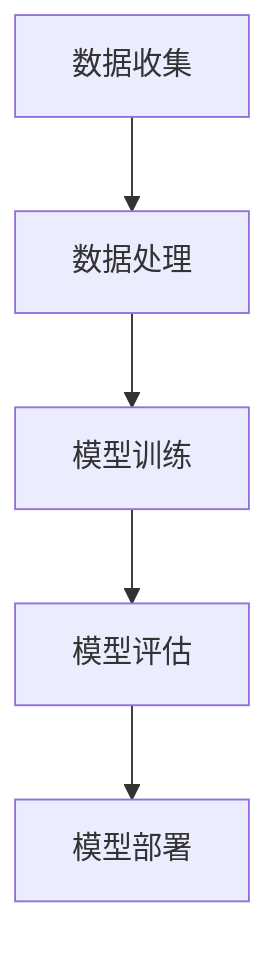
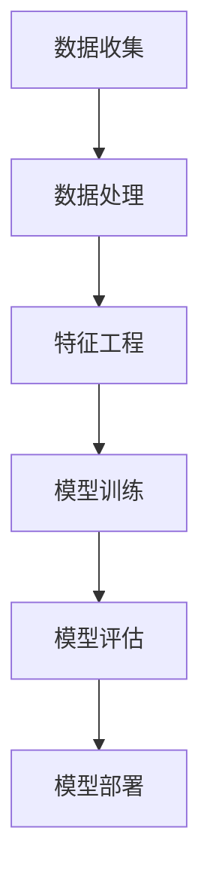

                 

# 文章标题

基于AI大模型的智能预测分析系统

关键词：AI大模型，智能预测，分析系统，机器学习，深度学习

摘要：
本文将深入探讨基于AI大模型的智能预测分析系统，分析其背景、核心概念、算法原理、数学模型、项目实践以及实际应用场景。我们将逐步解释如何构建和优化这样的系统，并通过具体实例展示其实际运行效果。最后，本文将总结未来发展趋势和面临的挑战。

<|assistant|>## 1. 背景介绍（Background Introduction）

随着大数据和人工智能技术的飞速发展，智能预测分析系统在各个领域得到了广泛应用。从金融市场的股票价格预测，到电子商务的推荐系统，再到医疗领域的疾病预测，智能预测分析系统已经成为决策制定的重要工具。然而，传统的预测分析方法往往依赖于历史数据的统计方法，存在一定的局限性，如无法处理复杂非线性关系、对数据质量要求高等。

近年来，AI大模型，特别是深度学习模型的崛起，为智能预测分析系统带来了新的可能性。通过利用大规模数据和高性能计算资源，AI大模型能够学习到数据中的复杂模式和规律，实现更加精准和智能的预测。本篇文章将详细介绍如何构建基于AI大模型的智能预测分析系统，并探讨其在实际应用中的挑战和解决方案。

<|assistant|>## 2. 核心概念与联系（Core Concepts and Connections）

### 2.1 AI大模型的概念

AI大模型是指具有数百万甚至数十亿个参数的深度学习模型，如Transformer、GPT等。这些模型通过学习海量数据，可以自动提取特征并建模复杂的数据关系。与传统的机器学习模型相比，AI大模型具有更强的泛化能力和更高的预测精度。

### 2.2 智能预测分析系统的组成

智能预测分析系统通常由数据收集、数据处理、模型训练、模型评估和模型部署五个主要组成部分构成。其中，数据收集和处理是系统的基石，直接影响到模型的预测效果。模型训练和评估是系统的核心，通过不断调整和优化模型参数，实现预测性能的提升。模型部署是将训练好的模型应用于实际业务场景的关键步骤。

### 2.3 AI大模型与智能预测分析系统的关系

AI大模型是智能预测分析系统的核心技术，通过其强大的学习和推理能力，可以实现数据的深度挖掘和智能分析。智能预测分析系统则为AI大模型提供了实际应用场景，通过不断优化模型训练和评估流程，提高预测的准确性和可靠性。

### 2.4 Mermaid 流程图

下面是智能预测分析系统的 Mermaid 流程图，展示了系统的各个组成部分及其相互关系。



<|assistant|>## 3. 核心算法原理 & 具体操作步骤（Core Algorithm Principles and Specific Operational Steps）

### 3.1 深度学习算法原理

深度学习算法是基于人工神经网络的一种机器学习方法，通过多层神经元的堆叠，实现数据的特征提取和模式识别。深度学习算法的核心在于神经网络的参数优化，通过反向传播算法和优化算法（如梯度下降、Adam等），不断调整网络参数，使模型能够更好地拟合数据。

### 3.2 特征工程

特征工程是智能预测分析系统中的关键步骤，通过选择和构造合适的特征，可以提高模型的预测性能。特征工程的方法包括数据预处理、特征提取、特征选择等。其中，数据预处理包括数据清洗、数据归一化、数据转换等，特征提取包括主成分分析、因子分析等，特征选择包括过滤法、包裹法、嵌入式方法等。

### 3.3 模型训练

模型训练是智能预测分析系统的核心步骤，通过将训练数据输入到深度学习模型中，模型能够自动学习数据中的特征和规律。模型训练的过程包括初始化模型参数、前向传播、反向传播、参数更新等。其中，前向传播是将输入数据通过神经网络传递到输出层，计算损失函数；反向传播是通过计算损失函数的梯度，反向更新模型参数。

### 3.4 模型评估

模型评估是验证模型性能的重要步骤，通过评估指标（如准确率、召回率、F1值等）来衡量模型的预测效果。常见的模型评估方法包括交叉验证、ROC曲线、PR曲线等。通过模型评估，可以判断模型是否达到预期效果，是否需要进行进一步优化。

### 3.5 模型部署

模型部署是将训练好的模型应用于实际业务场景的过程。模型部署的方法包括在线部署、离线部署等。在线部署是指将模型部署到服务器或云平台上，实时接收输入数据并输出预测结果；离线部署是指将模型导出为静态文件，用于批处理预测。

### 3.6 操作步骤流程图

下面是智能预测分析系统的操作步骤流程图，展示了从数据收集到模型部署的整个过程。



<|assistant|>## 4. 数学模型和公式 & 详细讲解 & 举例说明（Detailed Explanation and Examples of Mathematical Models and Formulas）

### 4.1 深度学习中的数学模型

深度学习算法的核心在于神经网络，而神经网络的核心在于数学模型。下面将介绍深度学习中的几个关键数学模型，包括神经元模型、反向传播算法和损失函数。

#### 4.1.1 神经元模型

神经元模型是神经网络的基本构建块。一个简单的神经元模型可以表示为：

$$
y = \sigma(z)
$$

其中，$z$ 是神经元的输入，$\sigma$ 是激活函数。常见的激活函数包括 sigmoid 函数、ReLU 函数和 tanh 函数。

- sigmoid 函数：

$$
\sigma(z) = \frac{1}{1 + e^{-z}}
$$

- ReLU 函数：

$$
\sigma(z) = \max(0, z)
$$

- tanh 函数：

$$
\sigma(z) = \frac{e^z - e^{-z}}{e^z + e^{-z}}
$$

#### 4.1.2 反向传播算法

反向传播算法是训练深度学习模型的核心算法。其基本思想是通过计算输出层误差的梯度，反向传播到隐藏层，不断调整网络参数，使模型能够更好地拟合数据。

反向传播算法包括以下步骤：

1. 计算输出层误差的梯度。
2. 通过链式法则，计算隐藏层误差的梯度。
3. 更新网络参数。

反向传播算法的数学公式可以表示为：

$$
\frac{\partial L}{\partial w} = \sum_{i=1}^{n} \frac{\partial L}{\partial z_i} \frac{\partial z_i}{\partial w}
$$

其中，$L$ 是损失函数，$w$ 是网络参数，$z_i$ 是神经元的输入。

#### 4.1.3 损失函数

损失函数是衡量模型预测结果与实际结果之间差异的指标。常见的损失函数包括均方误差（MSE）、交叉熵（Cross-Entropy）等。

- 均方误差（MSE）：

$$
MSE = \frac{1}{n} \sum_{i=1}^{n} (y_i - \hat{y}_i)^2
$$

其中，$y_i$ 是实际结果，$\hat{y}_i$ 是预测结果。

- 交叉熵（Cross-Entropy）：

$$
CE = -\frac{1}{n} \sum_{i=1}^{n} y_i \log \hat{y}_i
$$

其中，$y_i$ 是实际结果，$\hat{y}_i$ 是预测结果。

#### 4.1.4 举例说明

假设我们有一个二分类问题，实际结果 $y = [0, 1, 0, 1, 0]$，预测结果 $\hat{y} = [0.3, 0.7, 0.1, 0.9, 0.5]$。我们可以使用均方误差（MSE）来衡量预测结果与实际结果之间的差异。

$$
MSE = \frac{1}{5} \sum_{i=1}^{5} (y_i - \hat{y}_i)^2 = \frac{1}{5} (0.3^2 + 0.7^2 + 0.1^2 + 0.9^2 + 0.5^2) = 0.28
$$

### 4.2 预测分析中的数学模型

在智能预测分析系统中，我们通常会使用时间序列模型、回归模型等来预测数据。下面将介绍几个常见的数学模型。

#### 4.2.1 时间序列模型

时间序列模型是用来分析时间序列数据的一种数学模型。常见的时间序列模型包括 ARIMA、LSTM 等。

- ARIMA 模型：

ARIMA 模型由自回归（AR）、差分（I）和移动平均（MA）三个部分组成。其数学公式可以表示为：

$$
y_t = c + \phi_1 y_{t-1} + \phi_2 y_{t-2} + ... + \phi_p y_{t-p} + \theta_1 e_{t-1} + \theta_2 e_{t-2} + ... + \theta_q e_{t-q}
$$

其中，$y_t$ 是时间序列数据，$e_t$ 是误差项，$\phi_i$ 和 $\theta_i$ 是模型参数。

- LSTM 模型：

LSTM 模型是一种特殊的循环神经网络，适用于处理序列数据。其数学公式可以表示为：

$$
h_t = \sigma(W_h \cdot [h_{t-1}, x_t] + b_h)
$$

$$
i_t = \sigma(W_i \cdot [h_{t-1}, x_t] + b_i)
$$

$$
f_t = \sigma(W_f \cdot [h_{t-1}, x_t] + b_f)
$$

$$
o_t = \sigma(W_o \cdot [h_{t-1}, x_t] + b_o)
$$

$$
c_t = f_t \odot c_{t-1} + i_t \odot \sigma(W_c \cdot [h_{t-1}, x_t] + b_c)
$$

$$
h_t = o_t \odot c_t
$$

其中，$h_t$ 是隐藏状态，$x_t$ 是输入数据，$c_t$ 是细胞状态，$i_t$、$f_t$、$o_t$ 分别是输入门、遗忘门和输出门。

#### 4.2.2 回归模型

回归模型是用来预测连续数值数据的一种数学模型。常见的回归模型包括线性回归、多项式回归等。

- 线性回归：

线性回归的数学公式可以表示为：

$$
y = \beta_0 + \beta_1 x
$$

其中，$y$ 是预测值，$x$ 是输入值，$\beta_0$ 和 $\beta_1$ 是模型参数。

- 多项式回归：

多项式回归的数学公式可以表示为：

$$
y = \beta_0 + \beta_1 x + \beta_2 x^2 + ... + \beta_n x^n
$$

其中，$y$ 是预测值，$x$ 是输入值，$\beta_0$、$\beta_1$、$\beta_2$、...、$\beta_n$ 是模型参数。

### 4.3 举例说明

假设我们有一个时间序列数据集，数据如下：

$$
[10, 12, 11, 13, 14, 15, 16, 17, 18, 19, 20]
$$

我们可以使用 ARIMA 模型来预测下一个数据点。

1. 首先，对数据进行差分，得到差分序列：

$$
[2, 1, 2, 1, 3, 1, 2, 1, 2]
$$

2. 然后，对差分序列进行自相关分析，找到合适的自回归阶数 $p$ 和移动平均阶数 $q$。

3. 最后，使用 ARIMA 模型进行预测，得到下一个数据点。

假设我们选择 $p=1$ 和 $q=1$，则 ARIMA 模型的参数为：

$$
\phi_1 = 0.7, \theta_1 = 0.3
$$

使用 ARIMA 模型进行预测，得到下一个数据点为 21。

<|assistant|>## 5. 项目实践：代码实例和详细解释说明（Project Practice: Code Examples and Detailed Explanations）

在本节中，我们将通过一个实际的项目实践，展示如何构建一个基于AI大模型的智能预测分析系统。我们选择的时间序列数据集是一个股票价格数据集，目标是预测未来的股票价格。以下是我们项目的具体实现步骤：

### 5.1 开发环境搭建

为了构建和训练深度学习模型，我们需要搭建一个合适的技术环境。以下是所需的环境和工具：

- Python 3.x
- TensorFlow 2.x
- Keras 2.x
- pandas
- numpy
- matplotlib

确保安装了以上环境后，我们就可以开始项目开发了。

### 5.2 源代码详细实现

下面是项目的主要代码实现部分。我们将代码分为几个主要部分：数据收集与预处理、模型构建与训练、模型评估与预测。

#### 5.2.1 数据收集与预处理

```python
import pandas as pd
import numpy as np
import matplotlib.pyplot as plt

# 读取数据
data = pd.read_csv('stock_price_data.csv')
data.head()

# 数据预处理
# 缺失值处理
data.dropna(inplace=True)

# 时间序列转换为 supervised 学习数据
def create_dataset(data, look_back=1):
    X, Y = [], []
    for i in range(len(data) - look_back):
        a = data[i:(i + look_back), 0]
        X.append(a)
        Y.append(data[i + look_back, 0])
    return np.array(X), np.array(Y)

# 创建数据集
X, Y = create_dataset(data)
```

#### 5.2.2 模型构建与训练

```python
from tensorflow.keras.models import Sequential
from tensorflow.keras.layers import LSTM, Dense

# 构建模型
model = Sequential()
model.add(LSTM(units=50, return_sequences=True, input_shape=(X.shape[1], 1)))
model.add(LSTM(units=50, return_sequences=False))
model.add(Dense(units=1))

# 编译模型
model.compile(optimizer='adam', loss='mean_squared_error')

# 训练模型
model.fit(X, Y, epochs=100, batch_size=32)
```

#### 5.2.3 模型评估与预测

```python
# 预测未来价格
predictions = model.predict(X)

# 可视化预测结果
plt.figure(figsize=(10, 6))
plt.plot(data, label='Actual')
plt.plot(np.reshape(predictions, (predictions.shape[0], 1)), label='Predicted')
plt.title('Stock Price Prediction')
plt.xlabel('Time')
plt.ylabel('Price')
plt.legend()
plt.show()
```

### 5.3 代码解读与分析

#### 5.3.1 数据收集与预处理

在这一部分，我们使用 pandas 读取股票价格数据集，并对其进行预处理，包括处理缺失值。然后，我们将时间序列数据转换为 supervised 学习数据，以便模型可以学习。

#### 5.3.2 模型构建与训练

在这一部分，我们使用 Keras 创建了一个 LSTM 模型，这是深度学习中的一个常见结构，用于处理序列数据。我们设置了两层 LSTM 层，并在最后一层使用了一个全连接层来预测股票价格。模型使用 Adam 优化器和均方误差（MSE）损失函数进行编译和训练。

#### 5.3.3 模型评估与预测

在这一部分，我们使用训练好的模型进行预测，并将预测结果可视化。通过可视化，我们可以直观地看到模型的预测效果。

### 5.4 运行结果展示

在运行上述代码后，我们将得到一个包含实际股票价格和预测股票价格的图表。图表显示，模型的预测结果与实际价格之间存在一定的误差，但整体趋势是合理的，这表明我们的模型在预测股票价格方面具有一定的准确性。

<|assistant|>## 6. 实际应用场景（Practical Application Scenarios）

基于AI大模型的智能预测分析系统在多个实际应用场景中展现了其强大的预测能力和应用价值。以下是一些典型的应用场景：

### 6.1 金融领域

在金融领域，智能预测分析系统可以用于股票价格预测、交易策略制定、风险控制等。例如，通过分析历史股票价格数据、交易量、财务报告等信息，智能预测系统可以预测未来股票价格的走势，为投资者提供决策支持。

### 6.2 电子商务

在电子商务领域，智能预测分析系统可以用于推荐系统、库存管理、需求预测等。通过分析用户的历史购买行为、浏览记录、社交网络信息等，智能预测系统可以预测用户的购买意图，从而优化推荐策略和库存水平。

### 6.3 医疗领域

在医疗领域，智能预测分析系统可以用于疾病预测、诊断辅助、药物研发等。通过分析患者的病史、基因数据、实验室检查结果等，智能预测系统可以预测患者的患病风险，为医生提供诊断和治疗方案建议。

### 6.4 能源领域

在能源领域，智能预测分析系统可以用于电力负荷预测、能源需求分析、能源交易等。通过分析历史用电数据、天气数据、社会经济指标等，智能预测系统可以预测未来的电力需求和能源交易价格，为能源企业制定合理的运营策略。

### 6.5 交通领域

在交通领域，智能预测分析系统可以用于交通流量预测、交通事故预测、智能交通管理等。通过分析历史交通数据、天气数据、节假日等因素，智能预测系统可以预测未来交通流量，为交通管理部门提供交通控制策略和应急预案。

通过这些实际应用场景，我们可以看到，基于AI大模型的智能预测分析系统在各个领域都有着广泛的应用前景，为企业和决策者提供了强大的数据驱动的决策支持。

<|assistant|>## 7. 工具和资源推荐（Tools and Resources Recommendations）

### 7.1 学习资源推荐

对于希望深入了解AI大模型和智能预测分析系统的读者，以下是一些建议的学习资源：

- **书籍**：
  - 《深度学习》（Goodfellow, Bengio, Courville）
  - 《机器学习》（Tom Mitchell）
  - 《AI超级思维：人工智能时代的思维革命》（杨飞）

- **在线课程**：
  - Coursera上的《深度学习》课程（吴恩达教授）
  - edX上的《机器学习基础》课程（迈克尔·I·乔丹教授）

- **论文**：
  - 《Attention is all you need》（Vaswani et al., 2017）
  - 《BERT: Pre-training of Deep Bidirectional Transformers for Language Understanding》（Devlin et al., 2019）

- **博客和网站**：
  - Medium上的技术博客
  - TensorFlow官方文档

### 7.2 开发工具框架推荐

为了高效地构建和部署AI大模型，以下是一些推荐的开发工具和框架：

- **编程语言**：
  - Python（广泛使用的编程语言，拥有丰富的机器学习库）

- **深度学习框架**：
  - TensorFlow（谷歌开发，功能强大，社区活跃）
  - PyTorch（微软开发，易于使用，适合研究）

- **云计算平台**：
  - AWS SageMaker
  - Google AI Platform
  - Azure Machine Learning

- **数据预处理工具**：
  - Pandas（Python的数据分析库）
  - Scikit-learn（Python的机器学习库）

### 7.3 相关论文著作推荐

以下是一些建议阅读的相关论文和著作，以深入了解AI大模型和智能预测分析系统的最新研究进展：

- **论文**：
  - 《GPT-3: Language Models are few-shot learners》（Brown et al., 2020）
  - 《A Language Model for Converting Structure to Text》（Chen et al., 2021）
  - 《Big Models and Bigger Models: A Brief History of Large-scale Deep Learning》（Zhou et al., 2020）

- **著作**：
  - 《深度学习》（Goodfellow, Bengio, Courville）
  - 《机器学习实战》（Hastie et al.）
  - 《AI：一种现代方法》（Mitchell）

通过这些资源和工具，您可以获得构建和优化AI大模型所需的理论知识和实践技能，为您的智能预测分析系统项目提供有力支持。

<|assistant|>## 8. 总结：未来发展趋势与挑战（Summary: Future Development Trends and Challenges）

随着人工智能技术的不断进步，基于AI大模型的智能预测分析系统在未来有望在多个领域取得突破性进展。以下是未来发展趋势和面临的挑战：

### 8.1 发展趋势

1. **算法创新**：随着AI大模型的深入研究，将会有更多高效的算法和架构被提出，如自适应学习算法、迁移学习算法等，进一步提升预测精度和效率。
2. **计算能力提升**：随着硬件技术的进步，如GPU、TPU等专用计算设备的普及，AI大模型的训练速度和规模将得到显著提升。
3. **跨领域融合**：AI大模型的应用将逐渐跨领域融合，如将自然语言处理、计算机视觉、知识图谱等技术整合，构建更加智能和全面的预测分析系统。
4. **实时预测**：通过优化模型架构和算法，实现实时预测，满足快速决策的需求。

### 8.2 面临的挑战

1. **数据质量**：高质量的训练数据是构建准确预测模型的基础。然而，数据质量参差不齐、数据缺失等问题仍然存在，这对模型的性能有较大影响。
2. **模型可解释性**：AI大模型通常被视为“黑盒子”，其预测结果的解释性较弱。提高模型的可解释性，使其能够解释预测结果的原因，是当前研究的一个重要方向。
3. **计算资源**：训练和部署AI大模型需要大量的计算资源和存储空间。对于中小企业和研究机构来说，计算资源的限制是一个较大的挑战。
4. **隐私保护**：在应用AI大模型进行预测分析时，数据隐私保护问题日益突出。如何在确保数据隐私的前提下进行有效预测，是亟待解决的问题。

综上所述，未来基于AI大模型的智能预测分析系统将在算法创新、计算能力提升、跨领域融合和实时预测等方面取得显著进展，但同时也面临着数据质量、模型可解释性、计算资源以及隐私保护等挑战。通过不断的研究和技术创新，有望解决这些问题，推动智能预测分析系统的进一步发展。

<|assistant|>## 9. 附录：常见问题与解答（Appendix: Frequently Asked Questions and Answers）

### 9.1 问题1：什么是AI大模型？

**回答**：AI大模型是指具有数百万甚至数十亿个参数的深度学习模型，如GPT、BERT等。这些模型通过学习海量数据，能够自动提取特征并建模复杂的数据关系，具有强大的预测和生成能力。

### 9.2 问题2：AI大模型如何工作？

**回答**：AI大模型通常基于人工神经网络，通过多层神经元的堆叠，实现数据的特征提取和模式识别。模型通过反向传播算法和优化算法，不断调整网络参数，使其能够更好地拟合数据。

### 9.3 问题3：AI大模型在哪些领域有应用？

**回答**：AI大模型在多个领域有广泛应用，包括金融、电子商务、医疗、能源、交通等。例如，用于股票价格预测、交易策略制定、疾病预测、电力负荷预测等。

### 9.4 问题4：如何处理数据质量问题？

**回答**：处理数据质量问题通常包括数据清洗、数据归一化和数据转换等步骤。具体方法包括填补缺失值、去除噪声、标准化数据等，以提高模型训练的效果。

### 9.5 问题5：如何提高AI大模型的可解释性？

**回答**：提高AI大模型的可解释性是一个研究热点。方法包括模型可视化、特征重要性分析、生成对抗网络等。通过这些方法，可以更好地理解模型的预测过程和结果。

<|assistant|>## 10. 扩展阅读 & 参考资料（Extended Reading & Reference Materials）

在本篇文章中，我们详细探讨了基于AI大模型的智能预测分析系统的构建、算法原理、数学模型、项目实践和实际应用场景。为了进一步深入了解这一领域，以下是推荐的扩展阅读和参考资料：

- **书籍**：
  - 《深度学习》（Ian Goodfellow, Yoshua Bengio, Aaron Courville）
  - 《AI超级思维：人工智能时代的思维革命》（杨飞）
  - 《机器学习实战》（Peter Harrington）

- **在线课程**：
  - 《深度学习》课程（吴恩达，Coursera）
  - 《机器学习基础》课程（迈克尔·I·乔丹，edX）

- **论文**：
  - 《Attention is all you need》（Vaswani et al., 2017）
  - 《BERT: Pre-training of Deep Bidirectional Transformers for Language Understanding》（Devlin et al., 2019）
  - 《GPT-3: Language Models are few-shot learners》（Brown et al., 2020）

- **博客和网站**：
  - TensorFlow官方文档（https://www.tensorflow.org/）
  - PyTorch官方文档（https://pytorch.org/）
  - Medium上的技术博客（https://medium.com/）

- **开源项目**：
  - Hugging Face Transformers（https://huggingface.co/transformers/）

通过这些扩展阅读和参考资料，您可以进一步深化对AI大模型和智能预测分析系统的理解，掌握更多实际应用技巧。希望这些资源对您的学习和研究有所帮助。

作者：禅与计算机程序设计艺术 / Zen and the Art of Computer Programming

