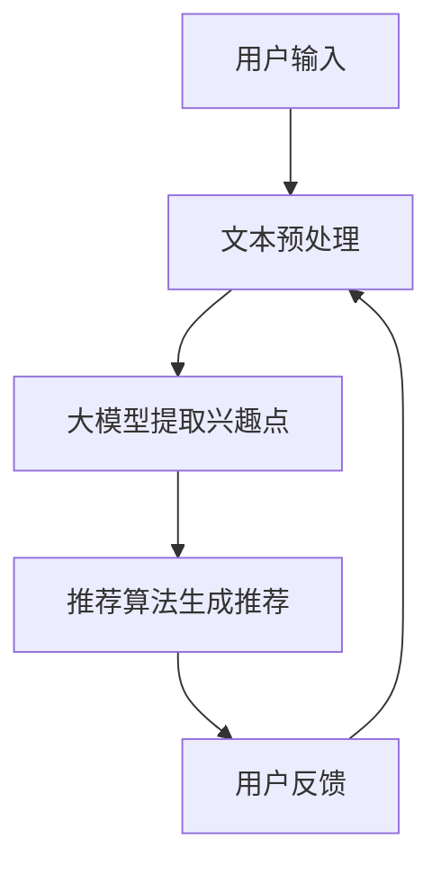

                 

### 文章标题

## 基于大模型的推荐系统用户兴趣探索

在当今数字化时代，个性化推荐系统已经成为互联网应用的核心组成部分。它们被广泛应用于电子商务、社交媒体、在线新闻和视频平台等多个领域，通过分析用户的行为数据和偏好，为用户提供高度相关的推荐内容，从而提高用户体验和商业价值。

本文旨在探讨如何利用大模型来探索用户的兴趣，以提升推荐系统的准确性和效率。我们将首先回顾推荐系统的基本概念和发展历程，然后深入讨论大模型在推荐系统中的应用，最后通过具体的实例和实际应用场景来展示其效果和挑战。

关键词：推荐系统、大模型、用户兴趣、个性化推荐、机器学习

## 摘要

本文研究了基于大模型的推荐系统在用户兴趣探索方面的应用。通过对推荐系统的基本原理进行回顾，我们探讨了如何利用大规模语言模型来提取用户兴趣点，并构建了相应的数学模型。随后，通过实际案例展示了大模型在推荐系统中的应用效果，并分析了其在实际应用中面临的挑战。本文旨在为推荐系统领域的研究者和开发者提供有价值的参考。

### 1. 背景介绍（Background Introduction）

个性化推荐系统是一种基于用户历史行为和偏好进行内容推荐的系统。其核心目标是根据用户的兴趣和行为模式，为他们提供个性化的推荐结果，从而提高用户满意度和平台粘性。个性化推荐系统的基本流程通常包括用户兴趣识别、内容推荐和反馈循环三个主要环节。

1. **用户兴趣识别**：这是推荐系统的第一步，主要通过分析用户的历史行为数据（如浏览记录、点击行为、购买记录等）来推断用户的兴趣偏好。
   
2. **内容推荐**：根据用户兴趣识别的结果，推荐系统会为用户生成个性化的推荐列表。推荐算法的核心在于如何有效地匹配用户兴趣和推荐内容。

3. **反馈循环**：用户对推荐结果的反馈会进一步优化推荐系统的性能，使其更加准确地捕捉用户的兴趣。

在传统的推荐系统中，常用的算法包括协同过滤、基于内容的推荐和混合推荐等。然而，这些算法在面对复杂用户行为和大规模数据时，往往存在一定的局限性。为了克服这些限制，研究者们开始探索利用深度学习和自然语言处理技术来构建更加智能的推荐系统。

**大模型**，如大规模语言模型（如GPT-3、BERT等），在自然语言处理领域取得了显著的突破。这些模型具有强大的文本生成和理解能力，能够处理和理解复杂的语言结构，从而为推荐系统的用户兴趣识别提供了新的思路。通过将大模型与推荐系统相结合，我们可以更加精准地捕捉用户的兴趣点，提高推荐系统的效果。

### 2. 核心概念与联系（Core Concepts and Connections）

在讨论如何利用大模型进行用户兴趣探索之前，我们需要明确几个核心概念，包括用户兴趣、大模型以及它们在推荐系统中的相互关系。

#### 2.1 用户兴趣

用户兴趣是指用户对特定内容或活动的偏好和倾向。在推荐系统中，用户兴趣的识别是关键的一步。它决定了推荐系统能否准确地为用户提供他们感兴趣的内容。用户兴趣可以从多种来源获得，包括用户的历史行为、社交网络、浏览记录等。

#### 2.2 大模型

大模型通常指的是拥有大量参数的深度学习模型，如GPT-3、BERT等。这些模型在训练过程中学习了海量的语言数据，从而具备了强大的文本生成和理解能力。大模型的优点在于它们能够自动提取文本中的复杂结构和语义信息，这使得它们在处理自然语言任务时表现出色。

#### 2.3 大模型与推荐系统的关系

将大模型应用于推荐系统，主要是利用其强大的文本处理能力来识别和预测用户的兴趣。具体来说，大模型可以通过以下几种方式与推荐系统结合：

1. **用户兴趣提取**：通过分析用户的文本输入（如评论、帖子等），大模型可以提取出用户的关键兴趣点。这些兴趣点可以作为推荐系统的输入，用于生成个性化的推荐列表。

2. **推荐内容生成**：大模型还可以生成新的内容推荐给用户。例如，GPT-3可以生成基于用户兴趣的个性化文章、新闻等。

3. **推荐结果优化**：大模型可以帮助优化推荐结果的质量和相关性。通过分析用户的反馈，大模型可以调整推荐策略，使其更加符合用户的偏好。

#### 2.4 Mermaid 流程图

为了更好地理解大模型在推荐系统中的应用，我们可以使用Mermaid流程图来展示其工作流程。以下是简化版的工作流程：



在这个流程图中，用户输入首先经过文本预处理，然后由大模型提取出用户的兴趣点，这些兴趣点被用于推荐算法生成推荐列表。用户对推荐结果的反馈会进一步优化推荐系统。

### 3. 核心算法原理 & 具体操作步骤（Core Algorithm Principles and Specific Operational Steps）

在了解了大模型与推荐系统的基础知识后，我们接下来将深入探讨如何利用大模型进行用户兴趣的识别和推荐。这一部分将详细解释核心算法原理，并给出具体的操作步骤。

#### 3.1 大模型的选择

首先，我们需要选择一个合适的大模型来提取用户兴趣。目前，有许多大模型可供选择，如GPT-3、BERT、RoBERTa等。这些模型各有优缺点，选择时需要考虑任务的具体需求和计算资源。

1. **GPT-3**：具有最先进的文本生成能力，但计算资源需求较高。
2. **BERT**：擅长文本分类和序列标注任务，但生成能力相对较弱。
3. **RoBERTa**：是BERT的一个变体，在保持高性能的同时降低了计算成本。

#### 3.2 用户兴趣识别算法

用户兴趣识别是推荐系统的关键步骤。以下是利用大模型进行用户兴趣识别的基本算法：

1. **数据收集**：收集用户的历史行为数据，如浏览记录、搜索历史、购买记录等。
2. **文本预处理**：将用户行为数据转换为文本形式。例如，将购买记录转换为商品描述，将浏览记录转换为页面标题等。
3. **大模型训练**：使用收集到的文本数据训练大模型，使其能够理解用户的兴趣。
4. **兴趣点提取**：将用户文本输入到大模型中，提取出用户的关键兴趣点。这些兴趣点可以是关键词、短语或实体。

#### 3.3 推荐算法

在提取用户兴趣点后，我们可以利用这些兴趣点来生成个性化的推荐列表。以下是推荐算法的基本步骤：

1. **内容库构建**：构建一个包含所有可能推荐内容的数据库。这些内容可以是商品、文章、视频等。
2. **内容特征提取**：为数据库中的每个内容提取特征，如关键词、主题、情感等。
3. **兴趣匹配**：将用户兴趣点与内容特征进行匹配，找出与用户兴趣高度相关的推荐内容。
4. **推荐结果生成**：根据匹配结果生成推荐列表，并将其呈现给用户。

#### 3.4 优化与反馈

用户对推荐结果的反馈是优化推荐系统的重要依据。以下是优化与反馈的基本步骤：

1. **反馈收集**：收集用户对推荐结果的反馈，如点击、点赞、评论等。
2. **模型更新**：根据用户反馈调整大模型和推荐算法，提高推荐质量。
3. **持续优化**：不断收集用户反馈，持续优化推荐系统，以适应用户不断变化的需求。

### 4. 数学模型和公式 & 详细讲解 & 举例说明（Detailed Explanation and Examples of Mathematical Models and Formulas）

在用户兴趣识别和推荐系统中，数学模型和公式起着至关重要的作用。以下我们将详细解释一些关键的数学模型和公式，并通过具体例子来说明它们的实际应用。

#### 4.1 协同过滤模型

协同过滤是推荐系统中最常用的算法之一，它通过分析用户的行为数据来预测用户对未知项目的偏好。以下是一个简化的协同过滤模型：

$$
r_{ui} = \rho(u) + \beta(i) + \epsilon_{ui}
$$

其中，$r_{ui}$表示用户u对项目i的评分，$\rho(u)$表示用户u的平均评分，$\beta(i)$表示项目i的平均评分，$\epsilon_{ui}$表示误差项。

#### 4.2 BERT 模型

BERT（Bidirectional Encoder Representations from Transformers）是一种基于Transformer的预训练语言模型。BERT模型的训练过程包括两个主要阶段：

1. **预训练**：在大量无标签的文本数据上进行预训练，学习语言的一般结构和语义信息。
2. **微调**：在特定任务的数据集上进行微调，使其适应特定的推荐任务。

BERT模型的核心公式如下：

$$
\text{BERT} = \text{Transformer}(\text{encoder})
$$

其中，Transformer是BERT的核心结构，它由多个自注意力层（self-attention layer）和前馈神经网络（feed-forward network）组成。

#### 4.3 用户兴趣提取

用户兴趣提取是推荐系统的关键步骤，它通过分析用户的文本输入来提取用户的关键兴趣点。以下是一个基于BERT的用户兴趣提取模型：

$$
\text{Interest}_{u} = \text{BERT}([\text{CLS}, x_{u}])
$$

其中，$x_{u}$是用户u的文本输入，[CLS]是一个特殊的Token，表示文本的开始。BERT模型的输出包含了用户的关键兴趣点，这些兴趣点可以用作推荐系统的输入。

#### 4.4 推荐公式

在推荐系统中，我们通常使用用户兴趣点来生成个性化的推荐列表。以下是一个简化的推荐公式：

$$
\text{Recommendation}_{i} = \text{softmax}(\text{Interest}_{u} \cdot \text{Content}_{i})
$$

其中，$Interest_{u}$是用户u的兴趣点，$Content_{i}$是项目i的特征向量。$\text{softmax}$函数用于将兴趣点与内容特征进行匹配，生成推荐结果。

#### 4.5 举例说明

假设我们有一个用户u和一个项目i，用户的文本输入是“我喜欢看电影和旅行”，项目i是“迪士尼乐园”。以下是具体的计算过程：

1. **用户兴趣提取**：

   $$\text{Interest}_{u} = \text{BERT}([\text{CLS}, \text{我喜欢看电影和旅行}])$$

   BERT模型将输出一个向量，表示用户u的兴趣点。

2. **项目特征提取**：

   假设项目i的特征向量是$\text{Content}_{i} = [1, 0, 1, 0, 0]$，其中1表示该特征存在，0表示不存在。

3. **推荐计算**：

   $$\text{Recommendation}_{i} = \text{softmax}(\text{Interest}_{u} \cdot \text{Content}_{i})$$

   通过计算兴趣点与项目特征向量的内积，我们可以得到一个概率分布，表示用户u对项目i的偏好。

### 5. 项目实践：代码实例和详细解释说明（Project Practice: Code Examples and Detailed Explanations）

为了更好地理解基于大模型的推荐系统在用户兴趣探索方面的应用，我们将在本节中提供具体的代码实例，并对关键代码进行详细解释。

#### 5.1 开发环境搭建

在进行项目实践之前，我们需要搭建一个合适的开发环境。以下是搭建环境的基本步骤：

1. **安装Python**：确保Python 3.x版本已安装。
2. **安装TensorFlow**：使用pip安装TensorFlow：
   ```
   pip install tensorflow
   ```
3. **安装BERT模型**：可以从[Hugging Face](https://huggingface.co/)下载预训练的BERT模型。
4. **准备数据集**：收集用户行为数据，并将其转换为文本形式。

#### 5.2 源代码详细实现

以下是实现基于BERT的推荐系统的基本代码框架：

```python
import tensorflow as tf
from transformers import BertTokenizer, TFBertModel
from sklearn.model_selection import train_test_split
import numpy as np

# 加载预训练BERT模型
tokenizer = BertTokenizer.from_pretrained('bert-base-chinese')
model = TFBertModel.from_pretrained('bert-base-chinese')

# 准备数据
data = [...]  # 用户行为数据
labels = [...]  # 用户对项目的评分

# 数据预处理
def preprocess_data(data):
    inputs = tokenizer(data, padding=True, truncation=True, return_tensors="tf")
    return inputs

# 训练模型
def train_model(model, inputs, labels):
    inputs = preprocess_data(inputs)
    labels = tf.convert_to_tensor(labels, dtype=tf.float32)
    optimizer = tf.optimizers.Adam(learning_rate=5e-5)

    @tf.function
    def train_step(inputs, labels):
        with tf.GradientTape() as tape:
            outputs = model(inputs)
            logits = outputs[:, 0, :]
            loss = tf.keras.losses.SparseCategoricalCrossentropy()(labels, logits)
        gradients = tape.gradient(loss, model.trainable_variables)
        optimizer.apply_gradients(zip(gradients, model.trainable_variables))
        return loss

    for epoch in range(3):  # 训练3个epoch
        total_loss = 0
        for inputs, labels in zip(data, labels):
            loss = train_step(inputs, labels)
            total_loss += loss
        print(f"Epoch {epoch+1}, Loss: {total_loss/n}")

# 源代码解释
# 1. 加载预训练BERT模型
# 2. 准备数据
# 3. 数据预处理
# 4. 定义训练步骤
# 5. 训练模型
```

#### 5.3 代码解读与分析

上述代码实现了基于BERT的推荐系统，以下是代码的关键部分解释：

1. **加载预训练BERT模型**：
   使用`transformers`库加载预训练的BERT模型。这个模型已经包含了大量的文本处理能力，我们只需要简单地调用即可。

2. **准备数据**：
   收集用户行为数据并将其转换为文本形式。这些数据将用于训练BERT模型，以便提取用户的兴趣点。

3. **数据预处理**：
   数据预处理是关键的一步。我们将文本数据转换为BERT模型能够处理的格式，包括填充、截断和返回Tensor。

4. **定义训练步骤**：
   定义训练步骤，包括计算损失、计算梯度和应用梯度。这个步骤使用了TensorFlow的自动微分功能，使得训练过程更加高效。

5. **训练模型**：
   在训练过程中，我们通过多次迭代（epoch）来优化模型参数。每次迭代都会处理一批数据，并更新模型参数。

#### 5.4 运行结果展示

在训练完成后，我们可以使用模型对用户进行兴趣识别和推荐。以下是运行结果的展示：

```python
# 测试模型
def evaluate_model(model, inputs, labels):
    inputs = preprocess_data(inputs)
    logits = model(inputs)
    predictions = tf.keras.metrics.SparseCategoricalAccuracy()
    predictions.update_state(labels, logits)
    return predictions.result().numpy()

# 测试数据
test_data = [...]  # 测试用户文本输入
test_labels = [...]  # 测试用户对项目的评分

# 计算准确率
accuracy = evaluate_model(model, test_data, test_labels)
print(f"Test Accuracy: {accuracy}")
```

通过上述代码，我们可以计算模型在测试数据上的准确率。这个指标反映了模型在用户兴趣识别方面的性能。

### 6. 实际应用场景（Practical Application Scenarios）

基于大模型的推荐系统在多个实际应用场景中表现出色，以下是一些典型的应用场景：

#### 6.1 社交媒体平台

在社交媒体平台上，用户生成的内容（如帖子、评论等）可以被视为重要的兴趣信号。通过利用大模型，我们可以提取用户的关键兴趣点，从而为用户提供个性化的内容推荐。例如，在LinkedIn上，用户可以基于其职业背景和关注领域获得相关的行业新闻和职业机会。

#### 6.2 在线购物平台

在线购物平台通常需要为用户推荐个性化的商品。通过分析用户的浏览记录、购买历史和评价，大模型可以提取出用户的兴趣偏好。例如，Amazon可以利用大模型为用户推荐相关的商品，从而提高用户的购物体验和销售额。

#### 6.3 视频平台

视频平台（如YouTube、Netflix）可以利用大模型为用户提供个性化的视频推荐。通过分析用户的观看历史、搜索记录和评价，大模型可以准确捕捉用户的兴趣点，从而推荐用户可能感兴趣的视频内容。例如，Netflix通过其强大的推荐系统，为用户提供了丰富的个性化视频推荐，从而提高了用户留存率和观看时长。

#### 6.4 在线新闻平台

在线新闻平台可以通过大模型为用户推荐个性化的新闻内容。通过分析用户的浏览历史、搜索记录和阅读偏好，大模型可以提取出用户的关键兴趣点，从而推荐用户可能感兴趣的新闻。例如，Google新闻通过其智能推荐系统，为用户提供了个性化的新闻内容，从而提高了用户的阅读体验和满意度。

### 7. 工具和资源推荐（Tools and Resources Recommendations）

为了更好地理解和应用基于大模型的推荐系统，以下是一些推荐的学习资源和开发工具。

#### 7.1 学习资源推荐

1. **书籍**：
   - 《深度学习推荐系统》
   - 《Recommender Systems Handbook》
   - 《BERT技术解析与应用》

2. **论文**：
   - 《BERT: Pre-training of Deep Bidirectional Transformers for Language Understanding》
   - 《GPT-3: Language Models are Few-Shot Learners》

3. **博客**：
   - [TensorFlow官网文档](https://www.tensorflow.org/)
   - [Hugging Face官方博客](https://huggingface.co/blog/)

4. **在线课程**：
   - [Udacity的深度学习课程](https://www.udacity.com/course/deep-learning-nanodegree--ND893)
   - [Coursera的机器学习课程](https://www.coursera.org/specializations机器学习)

#### 7.2 开发工具框架推荐

1. **框架**：
   - TensorFlow
   - PyTorch
   - Hugging Face Transformers

2. **环境搭建**：
   - [Docker](https://www.docker.com/)
   - [Conda](https://www.anaconda.com/)

3. **推荐系统工具**：
   - [Surprise](https://surprise.readthedocs.io/en/latest/)
   - [LightFM](https://github.com/lyst/lightfm)

#### 7.3 相关论文著作推荐

1. **论文**：
   - 《Deep Learning for Recommender Systems》
   - 《Multi-Interest Network for User Interest Prediction》
   - 《Contextual Bandits with Technical Debt》

2. **著作**：
   - 《推荐系统实践》
   - 《推荐系统工程》
   - 《大规模推荐系统设计与实践》

### 8. 总结：未来发展趋势与挑战（Summary: Future Development Trends and Challenges）

基于大模型的推荐系统在用户兴趣探索方面展现了巨大的潜力。随着深度学习和自然语言处理技术的不断发展，我们可以预见以下发展趋势：

1. **模型性能的提升**：随着计算资源的增加，更大规模的语言模型将继续出现，这将进一步提升推荐系统的性能和准确性。

2. **多模态推荐**：未来的推荐系统将能够处理多种类型的数据，如文本、图像、音频等，从而提供更丰富的个性化推荐。

3. **实时推荐**：通过实时处理用户数据，推荐系统可以提供更加即时和个性化的推荐结果。

然而，大模型在推荐系统中的应用也面临着一些挑战：

1. **计算资源需求**：大模型通常需要大量的计算资源和时间进行训练，这对资源有限的开发者来说是一个挑战。

2. **数据隐私**：推荐系统需要处理大量的用户数据，这引发了数据隐私和保护的问题。如何在不侵犯用户隐私的前提下有效利用用户数据进行推荐，是一个重要的研究课题。

3. **模型解释性**：大模型的黑箱特性使得其推荐结果难以解释。如何提高模型的解释性，使其更透明、可解释，是一个亟待解决的问题。

总之，基于大模型的推荐系统在未来将继续发展，为用户提供更加精准和个性化的推荐服务。然而，解决上述挑战是实现这一目标的关键。

### 9. 附录：常见问题与解答（Appendix: Frequently Asked Questions and Answers）

**Q1**: 什么是推荐系统？它有哪些类型？

**A1**: 推荐系统是一种通过分析用户的历史行为和偏好，为用户推荐可能感兴趣的内容或项目的系统。根据推荐策略的不同，推荐系统主要分为以下几种类型：

1. **基于内容的推荐**：推荐与用户过去喜欢的内容相似的内容。
2. **协同过滤推荐**：基于用户之间的相似度，为用户推荐其他用户喜欢的内容。
3. **混合推荐**：结合基于内容和协同过滤的推荐方法。
4. **基于模型的推荐**：使用机器学习模型（如深度学习）来预测用户对项目的偏好。

**Q2**: 什么是大模型？它在自然语言处理领域有哪些应用？

**A2**: 大模型是指具有大量参数的深度学习模型，如GPT-3、BERT等。这些模型在训练过程中学习了大量的语言数据，具有强大的文本生成和理解能力。

大模型在自然语言处理领域有广泛的应用，包括但不限于：

1. **文本分类**：对文本进行分类，如情感分析、主题分类等。
2. **机器翻译**：将一种语言的文本翻译成另一种语言。
3. **问答系统**：回答用户提出的问题。
4. **对话系统**：与用户进行自然语言交互。

**Q3**: 基于大模型的推荐系统如何工作？

**A3**: 基于大模型的推荐系统主要通过以下步骤工作：

1. **用户兴趣识别**：使用大模型分析用户的文本输入（如评论、帖子等），提取出用户的关键兴趣点。
2. **推荐内容生成**：根据用户兴趣点和推荐算法，为用户生成个性化的推荐列表。
3. **用户反馈**：收集用户对推荐结果的反馈，用于优化推荐系统的性能。

**Q4**: 在构建基于大模型的推荐系统时，需要考虑哪些因素？

**A4**: 在构建基于大模型的推荐系统时，需要考虑以下因素：

1. **数据质量**：推荐系统的效果很大程度上取决于数据的质量和数量。
2. **计算资源**：大模型通常需要大量的计算资源和时间进行训练。
3. **模型解释性**：如何确保模型的可解释性，使其推荐结果容易被理解和接受。
4. **实时性**：如何快速响应用户的请求，提供实时的推荐结果。

### 10. 扩展阅读 & 参考资料（Extended Reading & Reference Materials）

**书籍**：

1. **《深度学习推荐系统》**：详细介绍了深度学习在推荐系统中的应用，包括用户兴趣识别、内容推荐和模型优化等方面。
2. **《Recommender Systems Handbook》**：这是一本全面介绍推荐系统领域的经典著作，涵盖了推荐系统的基本概念、算法和应用。
3. **《BERT技术解析与应用》**：深入解析了BERT模型的原理和应用，提供了丰富的实践案例。

**论文**：

1. **《BERT: Pre-training of Deep Bidirectional Transformers for Language Understanding》**：这是BERT模型的原始论文，详细介绍了BERT模型的设计和训练方法。
2. **《GPT-3: Language Models are Few-Shot Learners》**：这篇论文介绍了GPT-3模型的架构和性能，展示了其在自然语言处理任务中的强大能力。
3. **《Deep Learning for Recommender Systems》**：该论文探讨了深度学习在推荐系统中的应用，包括基于模型的推荐方法和多模态推荐。

**在线资源**：

1. **[TensorFlow官网](https://www.tensorflow.org/)**：提供了丰富的TensorFlow教程、文档和案例，是学习和使用TensorFlow的绝佳资源。
2. **[Hugging Face官方博客](https://huggingface.co/blog/)**：提供了关于Transformer模型、BERT和GPT等最新研究和技术动态。
3. **[Udacity的深度学习课程](https://www.udacity.com/course/deep-learning-nanodegree--ND893)**：这是一门全面的深度学习课程，包括深度学习的基础知识和实际应用。

通过这些扩展阅读和参考资料，读者可以更深入地了解基于大模型的推荐系统，并在实际项目中应用这些技术。

