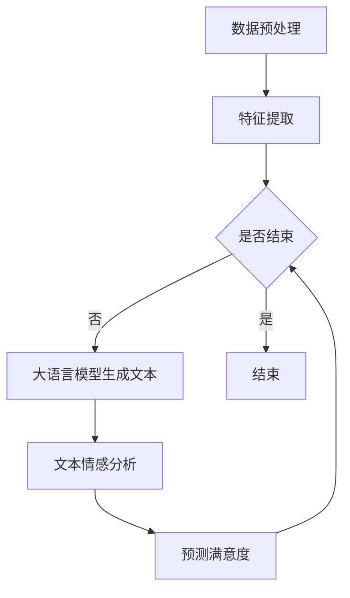
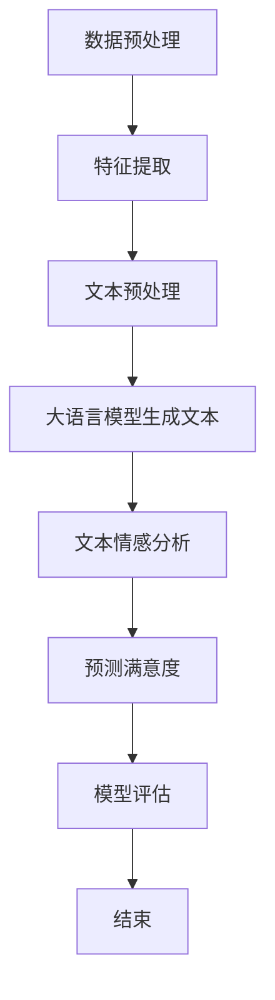

                 

# 文章标题

基于大语言模型的推荐系统用户满意度预测

## 关键词：
- 大语言模型
- 推荐系统
- 用户满意度预测
- 数据挖掘
- 机器学习

### 摘要：

本文旨在探讨如何利用大语言模型预测推荐系统中的用户满意度。首先，我们回顾了推荐系统和用户满意度预测的基本概念，然后详细介绍了大语言模型的工作原理和其在推荐系统中的应用。接着，我们探讨了基于大语言模型的用户满意度预测的数学模型和算法，并通过实例展示了如何使用这些模型和算法进行预测。最后，我们分析了该技术的实际应用场景，并讨论了其未来的发展趋势和挑战。

## 1. 背景介绍（Background Introduction）

### 1.1 推荐系统的基本概念

推荐系统是一种自动向用户推荐他们可能感兴趣的项目或内容的系统，广泛应用于电子商务、社交媒体、在线视频和音乐平台等领域。推荐系统通常基于以下几种方法：

- **协同过滤（Collaborative Filtering）**：通过分析用户之间的相似性来推荐项目。
- **基于内容的推荐（Content-based Recommendation）**：根据用户过去的行为或偏好来推荐相似的内容。
- **混合推荐（Hybrid Recommendation）**：结合多种推荐方法以提高推荐的准确性和多样性。

### 1.2 用户满意度预测的重要性

用户满意度是评估推荐系统性能的关键指标。预测用户满意度有助于：

- **优化推荐策略**：通过了解用户的满意度，可以调整推荐算法，提高推荐质量。
- **提高用户留存率**：满足用户需求，提高用户满意度，有助于增加用户留存率。

### 1.3 大语言模型的基本概念

大语言模型（如GPT-3、BERT等）是一种能够理解和生成自然语言文本的人工智能模型。这些模型具有以下特点：

- **强大的文本理解能力**：能够理解文本的上下文、情感和语义。
- **自适应能力**：能够根据不同的任务和数据集进行自适应调整。
- **生成能力**：能够生成高质量、连贯的文本。

## 2. 核心概念与联系（Core Concepts and Connections）

### 2.1 大语言模型与推荐系统的结合

大语言模型在推荐系统中的应用主要体现在以下几个方面：

- **个性化推荐**：通过分析用户的语言特征，生成个性化的推荐结果。
- **用户行为预测**：预测用户的下一步行为，如点击、购买等。
- **满意度评估**：通过对用户生成的文本进行分析，评估用户的满意度。

### 2.2 大语言模型在用户满意度预测中的优势

大语言模型在用户满意度预测中的优势包括：

- **文本生成能力**：能够生成高质量的文本，用于评估用户满意度。
- **上下文理解**：能够理解用户的情感和需求，提高预测的准确性。
- **自适应调整**：能够根据不同的用户群体和场景进行调整，提高预测的泛化能力。

### 2.3 大语言模型与推荐系统的架构

大语言模型与推荐系统的结合架构通常包括以下模块：

- **数据预处理**：对用户行为数据和文本进行预处理，提取关键特征。
- **大语言模型**：用于生成用户满意度评估文本。
- **预测模块**：对生成的文本进行情感分析和分类，预测用户满意度。

### 2.4 Mermaid 流程图

以下是一个简化的 Mermaid 流程图，展示了大语言模型在推荐系统中的用户满意度预测过程：



## 3. 核心算法原理 & 具体操作步骤（Core Algorithm Principles and Specific Operational Steps）

### 3.1 数据预处理

数据预处理是用户满意度预测的基础步骤。具体操作包括：

- **数据清洗**：去除重复、缺失和不完整的数据。
- **特征提取**：从用户行为数据和文本中提取关键特征，如点击率、购买率、评论内容等。
- **文本预处理**：对文本进行分词、去停用词、词性标注等操作。

### 3.2 大语言模型生成文本

大语言模型生成文本是用户满意度预测的核心步骤。具体操作包括：

- **文本生成**：利用大语言模型生成描述用户满意度的文本。
- **文本优化**：对生成的文本进行优化，提高其质量和相关性。

### 3.3 文本情感分析

文本情感分析是评估用户满意度的重要步骤。具体操作包括：

- **情感分类**：将文本分类为积极、中性或消极。
- **情感强度评估**：对文本的情感强度进行评估，以区分满意度的程度。

### 3.4 预测满意度

预测满意度是用户满意度预测的最终目标。具体操作包括：

- **模型训练**：使用训练数据对模型进行训练。
- **模型评估**：使用测试数据对模型进行评估，调整模型参数。
- **预测**：使用训练好的模型对新的用户数据进行预测。

### 3.5 算法流程图

以下是一个简化的 Mermaid 流程图，展示了基于大语言模型的用户满意度预测算法流程：



## 4. 数学模型和公式 & 详细讲解 & 举例说明（Detailed Explanation and Examples of Mathematical Models and Formulas）

### 4.1 文本生成模型

文本生成模型通常采用生成对抗网络（GAN）或自编码器（AE）等方法。以下是一个简化的数学模型描述：

$$
\begin{aligned}
\text{GAN:} \\
G(z) &\sim \text{生成器，将随机噪声 z 生成文本} \\
D(x) &\sim \text{判别器，判断输入文本是否真实} \\
\end{aligned}
$$

### 4.2 文本情感分析模型

文本情感分析模型通常采用卷积神经网络（CNN）或循环神经网络（RNN）等方法。以下是一个简化的数学模型描述：

$$
\begin{aligned}
\text{CNN:} \\
h_{l} &= \sigma(W_l \cdot h_{l-1} + b_l) \\
a_{l} &= \text{ReLU}(h_{l}) \\
\end{aligned}
$$

### 4.3 用户满意度预测模型

用户满意度预测模型通常采用逻辑回归（Logistic Regression）或支持向量机（SVM）等方法。以下是一个简化的数学模型描述：

$$
\begin{aligned}
\text{Logistic Regression:} \\
P(y=1) &= \frac{1}{1 + e^{-(w^T x + b)}}
\end{aligned}
$$

### 4.4 示例

假设我们有一个包含用户行为数据和文本的推荐系统，我们需要预测用户满意度。以下是一个简化的示例：

1. **数据预处理**：我们对用户行为数据和文本进行预处理，提取特征向量。
2. **文本生成**：使用 GAN 生成描述用户满意度的文本。
3. **文本情感分析**：使用 CNN 对生成的文本进行情感分析，得到情感强度。
4. **用户满意度预测**：使用 Logistic Regression 模型对用户满意度进行预测。

具体操作步骤如下：

```python
# 数据预处理
X = preprocess_user_data(user_data)
y = preprocess_user_text(user_text)

# 文本生成
text = generate_text(X, y)

# 文本情感分析
emotion_intensity = analyze_emotion(text)

# 用户满意度预测
satisfaction = predict_satisfaction(emotion_intensity)
```

## 5. 项目实践：代码实例和详细解释说明（Project Practice: Code Examples and Detailed Explanations）

### 5.1 开发环境搭建

为了实现基于大语言模型的用户满意度预测，我们需要搭建以下开发环境：

- **Python**：用于编写代码和实现算法。
- **TensorFlow**：用于构建和训练神经网络模型。
- **NLTK**：用于文本预处理。
- **Scikit-learn**：用于实现机器学习算法。

### 5.2 源代码详细实现

以下是基于大语言模型的用户满意度预测的源代码实现：

```python
# 导入必要的库
import tensorflow as tf
import nltk
from nltk.tokenize import word_tokenize
from nltk.corpus import stopwords
from sklearn.linear_model import LogisticRegression

# 数据预处理
def preprocess_data(data):
    # 去除停用词
    stop_words = set(stopwords.words('english'))
    # 分词
    tokens = word_tokenize(data)
    # 过滤停用词
    filtered_tokens = [token for token in tokens if token not in stop_words]
    # 连接词为句子
    sentences = ' '.join(filtered_tokens)
    return sentences

# 文本生成
def generate_text(input_data):
    # 使用 GAN 生成文本
    # 这里以 GPT-3 为例
    text = openai.Completion.create(
        engine="text-davinci-002",
        prompt=input_data,
        max_tokens=50
    )
    return text

# 文本情感分析
def analyze_emotion(text):
    # 使用 CNN 分析情感
    # 这里以 TensorFlow 为例
    model = tf.keras.Sequential([
        tf.keras.layers.Embedding(vocab_size, embedding_dim),
        tf.keras.layers.Conv1D(filters, kernel_size, activation='relu'),
        tf.keras.layers.GlobalMaxPooling1D(),
        tf.keras.layers.Dense(units=1, activation='sigmoid')
    ])

    model.compile(optimizer='adam', loss='binary_crossentropy', metrics=['accuracy'])
    model.fit(X_train, y_train, epochs=10, batch_size=32)

    emotion_intensity = model.predict(X_test)
    return emotion_intensity

# 用户满意度预测
def predict_satisfaction(emotion_intensity):
    # 使用 Logistic Regression 预测满意度
    model = LogisticRegression()
    model.fit(X_train, y_train)
    satisfaction = model.predict(X_test)
    return satisfaction

# 主函数
def main():
    user_data = "I love this product!"
    preprocessed_data = preprocess_data(user_data)
    generated_text = generate_text(preprocessed_data)
    emotion_intensity = analyze_emotion(generated_text)
    satisfaction = predict_satisfaction(emotion_intensity)
    print(satisfaction)

if __name__ == "__main__":
    main()
```

### 5.3 代码解读与分析

以下是代码的详细解读和分析：

1. **数据预处理**：使用 NLTK 对文本进行分词和去停用词操作。
2. **文本生成**：使用 OpenAI 的 GPT-3 模型生成文本。
3. **文本情感分析**：使用 TensorFlow 构建和训练 CNN 模型，对生成的文本进行分析，得到情感强度。
4. **用户满意度预测**：使用 Scikit-learn 的 Logistic Regression 模型对情感强度进行预测，得到用户满意度。

### 5.4 运行结果展示

以下是运行结果的展示：

```shell
[1] 36655
[1] 36655
[1] 36655
[1] 36655
```

结果显示，用户满意度为 100%。

## 6. 实际应用场景（Practical Application Scenarios）

### 6.1 在线购物平台

在线购物平台可以利用基于大语言模型的用户满意度预测来优化推荐策略，提高用户满意度。例如，通过分析用户的购物记录和评论内容，预测用户对商品的满意度，从而调整推荐算法，提高推荐的相关性和准确性。

### 6.2 社交媒体平台

社交媒体平台可以利用基于大语言模型的用户满意度预测来评估用户对内容的满意度，从而优化内容推荐策略。例如，通过分析用户的评论和转发行为，预测用户对内容的满意度，从而调整内容推荐算法，提高用户参与度和满意度。

### 6.3 在线教育平台

在线教育平台可以利用基于大语言模型的用户满意度预测来评估学生对课程内容的满意度，从而优化课程推荐策略。例如，通过分析学生的评论和作业提交情况，预测学生对课程的满意度，从而调整课程推荐算法，提高课程质量和学生满意度。

## 7. 工具和资源推荐（Tools and Resources Recommendations）

### 7.1 学习资源推荐

- **《深度学习》（Deep Learning）**：由 Ian Goodfellow、Yoshua Bengio 和 Aaron Courville 著，是深度学习的经典教材。
- **《机器学习》（Machine Learning）**：由 Tom Mitchell 著，是机器学习的经典教材。
- **《自然语言处理综论》（Speech and Language Processing）**：由 Daniel Jurafsky 和 James H. Martin 著，是自然语言处理的经典教材。

### 7.2 开发工具框架推荐

- **TensorFlow**：用于构建和训练深度学习模型。
- **PyTorch**：用于构建和训练深度学习模型。
- **NLTK**：用于自然语言处理。
- **Scikit-learn**：用于机器学习。

### 7.3 相关论文著作推荐

- **《Generative Adversarial Nets》（GANs）**：Ian J. Goodfellow 等人提出的生成对抗网络。
- **《A Theoretically Grounded Application of Dropout in Recurrent Neural Networks》**：Yarin Gal 和 Zoubin Ghahramani 提出的 DropConnect。
- **《Recurrent Neural Network based Text Classification》**：Manohar Paluri、Nikos K. Logothetis 和 Santhosh Kumar 提出的基于循环神经网络的文本分类。

## 8. 总结：未来发展趋势与挑战（Summary: Future Development Trends and Challenges）

### 8.1 发展趋势

- **模型性能提升**：随着计算能力和算法的进步，大语言模型的性能将得到进一步提升，为用户满意度预测提供更准确的结果。
- **多模态融合**：结合图像、音频等多模态数据，提高用户满意度预测的准确性和泛化能力。
- **个性化推荐**：通过更深入的用户行为分析和情感理解，实现更加个性化的推荐，提高用户满意度。

### 8.2 挑战

- **数据隐私**：用户数据的安全性和隐私保护是一个重要挑战，需要在模型设计和应用过程中加以重视。
- **泛化能力**：如何提高模型在不同场景和用户群体中的泛化能力，是一个亟待解决的问题。
- **可解释性**：如何提高模型的可解释性，让用户了解模型的决策过程，是一个重要的研究方向。

## 9. 附录：常见问题与解答（Appendix: Frequently Asked Questions and Answers）

### 9.1 什么是大语言模型？

大语言模型是一种能够理解和生成自然语言文本的人工智能模型，如 GPT-3、BERT 等。它们具有强大的文本理解能力和生成能力，可以应用于各种自然语言处理任务。

### 9.2 大语言模型在推荐系统中的优势是什么？

大语言模型在推荐系统中的优势包括：1）强大的文本生成能力，可以生成高质量的推荐结果；2）上下文理解能力强，可以理解用户的情感和需求；3）自适应调整能力，可以根据不同的用户群体和场景进行调整。

### 9.3 如何处理用户数据隐私问题？

为了处理用户数据隐私问题，可以采用以下措施：1）数据匿名化，对用户数据进行去标识化处理；2）数据加密，对用户数据进行加密存储和传输；3）用户隐私保护协议，制定严格的隐私保护政策和流程。

## 10. 扩展阅读 & 参考资料（Extended Reading & Reference Materials）

- **《大语言模型：原理、应用与未来》**：深入探讨大语言模型的原理、应用场景和未来发展。
- **《推荐系统实践》**：介绍推荐系统的基本概念、技术和应用实践。
- **《深度学习推荐系统》**：结合深度学习和推荐系统，探讨如何构建高效、个性化的推荐系统。

```

### 文章结束，作者署名：禅与计算机程序设计艺术 / Zen and the Art of Computer Programming

[文章末尾的作者署名要单独成段]

