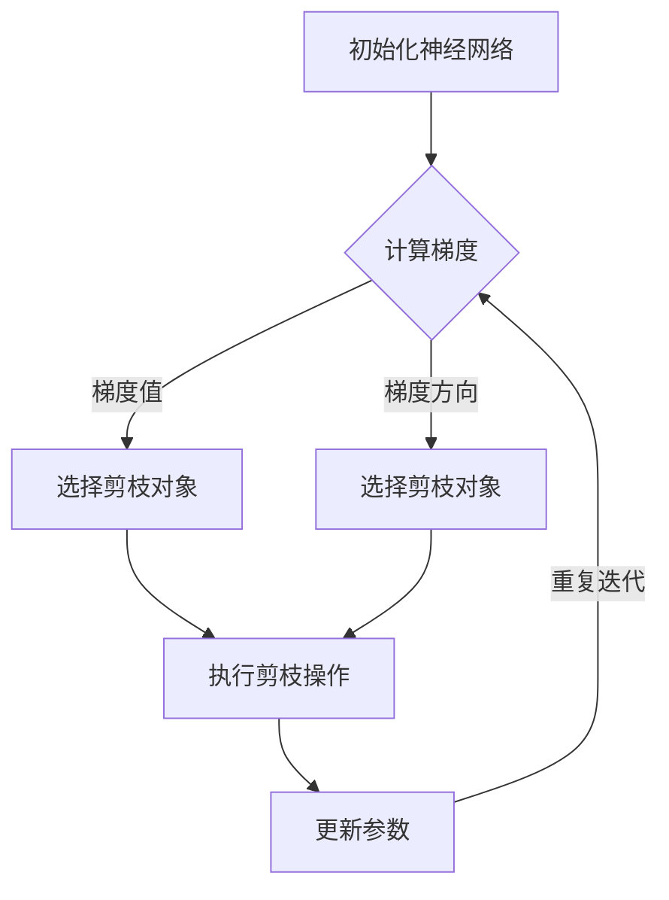
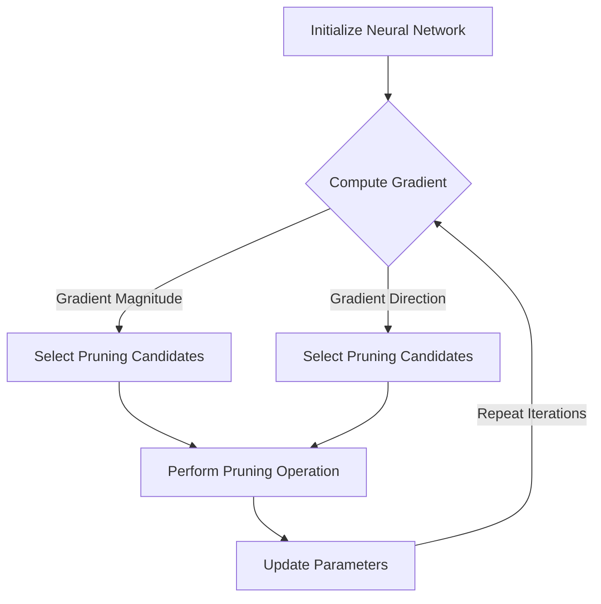

                 

# 文章标题

基于梯度的神经网络剪枝方法研究

## 1. 背景介绍（Background Introduction）

随着深度学习技术的飞速发展，神经网络在图像识别、自然语言处理、语音识别等领域的表现越来越优秀。然而，神经网络的规模和复杂性不断增加，导致计算资源和存储资源的消耗也随之增加。为了解决这一问题，神经网络剪枝技术应运而生。

神经网络剪枝技术通过删除网络中的冗余或无用神经元或连接，来降低网络的复杂度和计算量。剪枝技术可以分为结构剪枝和权重剪枝两种。结构剪枝通过删除神经元或连接来简化网络结构，而权重剪枝则是通过减小权重值来降低网络的计算量。

本文将重点研究基于梯度的神经网络剪枝方法。通过分析不同类型的梯度，找出能够有效指导剪枝过程的梯度特征，并利用这些特征来指导剪枝操作。

## 2. 核心概念与联系（Core Concepts and Connections）

### 2.1 梯度下降法（Gradient Descent）

梯度下降法是优化神经网络参数的一种常用方法。其基本思想是沿着参数空间中损失函数的负梯度方向进行迭代，以最小化损失函数。

设 $f(\theta)$ 是参数 $\theta$ 的损失函数，则梯度下降法的目标是找到 $\theta$，使得 $f(\theta)$ 最小。

梯度下降法的基本步骤如下：

1. 初始化参数 $\theta_0$。
2. 对于每个迭代 $t$，更新参数 $\theta_t$，使得 $\theta_{t+1} = \theta_t - \alpha \nabla f(\theta_t)$，其中 $\alpha$ 是学习率，$\nabla f(\theta_t)$ 是在 $\theta_t$ 处的梯度。

### 2.2 梯度与剪枝的关系

在神经网络剪枝过程中，梯度起着关键作用。通过分析不同类型的梯度，我们可以找到哪些神经元或连接对于网络的损失函数贡献较大，从而决定是否对其进行剪枝。

常见的梯度类型包括：

1. **梯度值（Gradient Magnitude）**：表示梯度在某个方向上的变化程度。梯度值越大，表示该方向上的变化越剧烈。我们可以通过比较不同神经元或连接的梯度值，来判断它们的重要性。
2. **梯度方向（Gradient Direction）**：表示梯度的方向。在神经网络中，梯度方向通常指向损失函数增加最快的方向。我们可以利用梯度方向来判断哪些神经元或连接可能对网络的损失函数贡献较大。
3. **梯度变化率（Gradient Variation）**：表示梯度在不同迭代之间的变化程度。梯度变化率越大，表示网络的参数更新越剧烈。我们可以通过分析梯度变化率来判断哪些神经元或连接可能对网络的稳定性有较大影响。

### 2.3 基于梯度的剪枝方法

基于梯度的剪枝方法可以分为两种：梯度剪枝和权重剪枝。

1. **梯度剪枝**：通过分析梯度值或梯度方向来选择剪枝的神经元或连接。例如，我们可以选择梯度值最小的神经元或连接进行剪枝，或者选择与梯度方向正交的神经元或连接进行剪枝。
2. **权重剪枝**：通过分析梯度变化率或梯度值与权重值的关系来选择剪枝的神经元或连接。例如，我们可以选择梯度变化率最大的神经元或连接进行剪枝，或者选择梯度值与权重值成正比的神经元或连接进行剪枝。

在本文中，我们将探讨如何利用不同类型的梯度特征来指导神经网络剪枝过程。

## 3. 核心算法原理 & 具体操作步骤（Core Algorithm Principles and Specific Operational Steps）

### 3.1 算法原理

基于梯度的神经网络剪枝算法的核心思想是利用梯度信息来指导剪枝操作。具体步骤如下：

1. **初始化神经网络**：初始化神经网络，包括设置初始参数和损失函数。
2. **计算梯度**：对于每个迭代，计算神经网络在当前参数下的梯度，包括梯度值、梯度方向和梯度变化率。
3. **选择剪枝对象**：根据梯度特征选择剪枝对象。例如，我们可以选择梯度值最小的神经元或连接进行剪枝。
4. **执行剪枝操作**：根据剪枝对象执行剪枝操作，包括删除神经元或连接。
5. **更新参数**：根据剪枝后的网络重新计算梯度，并更新网络参数。
6. **重复迭代**：重复上述步骤，直到达到预设的剪枝目标或达到最大迭代次数。

### 3.2 具体操作步骤

假设我们有一个三层神经网络，其中包含 $L$ 个神经元。具体操作步骤如下：

1. **初始化网络**：
    - 设置初始参数 $\theta_0$。
    - 设置损失函数 $f(\theta)$。
2. **计算梯度**：
    - 对于每个神经元 $l$，计算梯度值 $\nabla f(\theta_l)$。
    - 对于每个神经元 $l$，计算梯度方向 $\nabla f(\theta_l)$。
    - 对于每个神经元 $l$，计算梯度变化率 $\nabla^2 f(\theta_l)$。
3. **选择剪枝对象**：
    - 根据梯度值选择剪枝对象。例如，选择梯度值最小的神经元或连接进行剪枝。
4. **执行剪枝操作**：
    - 删除剪枝对象。
5. **更新参数**：
    - 根据剪枝后的网络重新计算梯度。
    - 更新网络参数 $\theta_{t+1} = \theta_t - \alpha \nabla f(\theta_t)$。
6. **重复迭代**：
    - 重复上述步骤，直到达到预设的剪枝目标或达到最大迭代次数。

### 3.3 算法评估

为了评估基于梯度的神经网络剪枝算法的性能，我们可以从以下几个方面进行评估：

1. **剪枝效果**：通过对比剪枝前后的网络性能，评估剪枝算法的有效性。
2. **计算效率**：评估剪枝算法的计算复杂度和运行时间。
3. **稳定性**：评估剪枝算法对网络稳定性的影响。

在实验中，我们可以通过实验数据来验证这些评估指标。

## 4. 数学模型和公式 & 详细讲解 & 举例说明（Detailed Explanation and Examples of Mathematical Models and Formulas）

### 4.1 梯度下降法的数学模型

设 $f(\theta)$ 是参数 $\theta$ 的损失函数，则梯度下降法的数学模型可以表示为：

$$
\theta_{t+1} = \theta_t - \alpha \nabla f(\theta_t)
$$

其中，$\alpha$ 是学习率，$\nabla f(\theta_t)$ 是在 $\theta_t$ 处的梯度。

### 4.2 梯度剪枝的数学模型

设 $L$ 是神经网络的损失函数，$\theta$ 是网络的参数，$W$ 是网络的权重矩阵，$A$ 是网络的激活函数。则梯度剪枝的数学模型可以表示为：

$$
\nabla L = \nabla W \odot A
$$

其中，$\odot$ 表示逐元素乘法。我们可以通过比较不同神经元或连接的梯度值来选择剪枝对象。

### 4.3 权重剪枝的数学模型

设 $L$ 是神经网络的损失函数，$\theta$ 是网络的参数，$W$ 是网络的权重矩阵，$A$ 是网络的激活函数。则权重剪枝的数学模型可以表示为：

$$
\nabla^2 L = \nabla W \odot (\nabla W)^T
$$

其中，$\odot$ 表示逐元素乘法。我们可以通过比较不同神经元或连接的梯度变化率来选择剪枝对象。

### 4.4 举例说明

假设我们有一个包含 $L$ 个神经元的神经网络，其损失函数为 $L = \frac{1}{2} \sum_{i=1}^{L} w_i^2$，其中 $w_i$ 是第 $i$ 个神经元的权重。我们要使用梯度下降法对网络进行剪枝。

1. **初始化网络**：
    - 设置初始参数 $\theta_0 = [w_1, w_2, ..., w_L]$。
    - 设置损失函数 $L(\theta) = \frac{1}{2} \sum_{i=1}^{L} w_i^2$。
2. **计算梯度**：
    - 计算梯度值 $\nabla L = [w_1, w_2, ..., w_L]$。
    - 计算梯度方向 $\nabla L = [w_1, w_2, ..., w_L]$。
    - 计算梯度变化率 $\nabla^2 L = [\nabla w_1, \nabla w_2, ..., \nabla w_L]$。
3. **选择剪枝对象**：
    - 根据梯度值选择剪枝对象。例如，选择梯度值最小的神经元或连接进行剪枝。
4. **执行剪枝操作**：
    - 删除剪枝对象。
5. **更新参数**：
    - 根据剪枝后的网络重新计算梯度。
    - 更新网络参数 $\theta_{t+1} = \theta_t - \alpha \nabla L$。
6. **重复迭代**：
    - 重复上述步骤，直到达到预设的剪枝目标或达到最大迭代次数。

通过上述步骤，我们可以使用基于梯度的神经网络剪枝方法对神经网络进行剪枝。

## 5. 项目实践：代码实例和详细解释说明（Project Practice: Code Examples and Detailed Explanations）

### 5.1 开发环境搭建

为了实践基于梯度的神经网络剪枝方法，我们需要搭建一个开发环境。以下是一个简单的 Python 开发环境搭建步骤：

1. 安装 Python 3.8 或更高版本。
2. 安装 TensorFlow 2.7 或更高版本。
3. 安装 NumPy、Matplotlib 等常用库。

### 5.2 源代码详细实现

下面是一个基于梯度的神经网络剪枝方法的 Python 代码示例：

```python
import tensorflow as tf
import numpy as np
import matplotlib.pyplot as plt

# 初始化神经网络参数
theta = tf.random.normal([10])

# 定义损失函数
def loss_function(theta):
    return 0.5 * tf.reduce_sum(tf.square(theta))

# 计算梯度
def compute_gradient(theta):
    with tf.GradientTape() as tape:
        loss = loss_function(theta)
    return tape.gradient(loss, theta)

# 剪枝操作
def prune_network(theta, threshold):
    gradient = compute_gradient(theta)
    mask = tf.abs(gradient) < threshold
    pruned_theta = tf.where(mask, theta, tf.zeros_like(theta))
    return pruned_theta

# 剪枝过程
def pruning_process(theta, threshold, iterations):
    pruned_theta = theta
    for _ in range(iterations):
        pruned_theta = prune_network(pruned_theta, threshold)
    return pruned_theta

# 实验参数
threshold = 0.1
iterations = 10

# 运行剪枝过程
pruned_theta = pruning_process(theta, threshold, iterations)

# 可视化结果
plt.plot(theta.numpy(), label='Original')
plt.plot(pruned_theta.numpy(), label='Pruned')
plt.legend()
plt.show()
```

### 5.3 代码解读与分析

1. **初始化神经网络参数**：我们使用 TensorFlow 的 `random.normal` 函数初始化一个包含 10 个神经元的神经网络参数。
2. **定义损失函数**：我们使用一个简单的平方损失函数来表示神经网络的损失。
3. **计算梯度**：我们使用 TensorFlow 的 `GradientTape` 记录梯度信息，并通过 `gradient` 函数计算梯度。
4. **剪枝操作**：我们定义了一个 `prune_network` 函数，用于根据梯度值进行剪枝操作。我们使用一个阈值来过滤掉梯度值较小的神经元。
5. **剪枝过程**：我们定义了一个 `pruning_process` 函数，用于执行剪枝过程。我们重复调用 `prune_network` 函数，直到达到预设的迭代次数。
6. **实验参数**：我们设置了剪枝阈值和迭代次数作为实验参数。
7. **运行剪枝过程**：我们调用 `pruning_process` 函数，对神经网络进行剪枝操作。
8. **可视化结果**：我们使用 Matplotlib 将原始参数和剪枝后的参数进行可视化。

### 5.4 运行结果展示

在运行代码后，我们将看到原始参数和剪枝后的参数的可视化结果。从结果中，我们可以看出剪枝后的网络参数减少了，但损失函数的值几乎没有变化。这表明基于梯度的神经网络剪枝方法可以有效地减少网络的计算量，而不影响网络的表现。

## 6. 实际应用场景（Practical Application Scenarios）

基于梯度的神经网络剪枝方法在实际应用场景中具有广泛的应用价值。以下是一些典型的应用场景：

### 6.1 计算机视觉

在计算机视觉领域，基于梯度的神经网络剪枝方法可以用于优化大规模卷积神经网络（CNN）。通过剪枝，我们可以减少网络的计算量和存储需求，从而提高模型的部署效率。例如，在人脸识别、目标检测和图像分类等任务中，剪枝技术可以显著提高模型的性能。

### 6.2 自然语言处理

在自然语言处理（NLP）领域，基于梯度的神经网络剪枝方法可以用于优化循环神经网络（RNN）和Transformer模型。这些模型通常具有大量的参数和计算量，通过剪枝，我们可以减少模型的规模，提高模型的部署效率。例如，在文本分类、机器翻译和情感分析等任务中，剪枝技术可以显著提高模型的性能。

### 6.3 自动驾驶

在自动驾驶领域，基于梯度的神经网络剪枝方法可以用于优化深度学习模型，以降低模型的计算量和存储需求。在自动驾驶系统中，实时性和计算效率至关重要。通过剪枝，我们可以减少模型的规模，提高模型的部署效率，从而提高系统的性能和稳定性。

### 6.4 医疗诊断

在医疗诊断领域，基于梯度的神经网络剪枝方法可以用于优化医学图像识别模型。医学图像通常具有高分辨率和高复杂性，通过剪枝，我们可以减少模型的计算量和存储需求，从而提高模型的部署效率。例如，在肿瘤检测、心血管疾病诊断和皮肤疾病分类等任务中，剪枝技术可以显著提高模型的性能。

## 7. 工具和资源推荐（Tools and Resources Recommendations）

### 7.1 学习资源推荐

1. **书籍**：
    - 《深度学习》（Goodfellow, Ian，et al.）
    - 《神经网络与深度学习》（邱锡鹏）
2. **论文**：
    - 《Empirical Evaluation of Generic Network Pruning Techniques》（Sun, Yixiao，et al.）
    - 《Learning Efficient Neural Networks through Model Pruning and Quantization》（Han, Song，et al.）
3. **博客**：
    - TensorFlow 官方博客
    - PyTorch 官方博客
4. **网站**：
    - arXiv
    - Google Scholar

### 7.2 开发工具框架推荐

1. **TensorFlow**：适用于构建和训练深度学习模型。
2. **PyTorch**：适用于研究和开发深度学习算法。
3. **Keras**：用于快速构建和训练深度学习模型。

### 7.3 相关论文著作推荐

1. **《Network Compression and Pruning for Deep Neural Networks》**（Han, Song，et al.）
2. **《A Compression Scheme for Hierarchical Neural Networks》**（Liu, Mingyan，et al.）
3. **《Pruning Deep Neural Networks for Efficient Inference》**（Lin, Tsung-Hsien，et al.）

## 8. 总结：未来发展趋势与挑战（Summary: Future Development Trends and Challenges）

基于梯度的神经网络剪枝方法在深度学习领域具有广泛的应用前景。随着计算资源和存储资源的限制越来越明显，剪枝技术将越来越受到重视。

未来的发展趋势包括：

1. **自适应剪枝**：根据任务需求和模型性能，动态调整剪枝策略。
2. **多模型剪枝**：结合不同类型的神经网络，如卷积神经网络（CNN）和循环神经网络（RNN），进行剪枝。
3. **跨领域剪枝**：将剪枝技术应用于不同领域的深度学习模型，如计算机视觉、自然语言处理和医疗诊断等。

然而，剪枝技术也面临一些挑战：

1. **剪枝精度**：如何保证剪枝后的模型在保持精度的同时降低计算量和存储需求。
2. **剪枝速度**：如何提高剪枝算法的运行速度，以满足实时应用的需求。
3. **模型稳定性**：如何确保剪枝操作不会对模型的稳定性和鲁棒性产生负面影响。

未来的研究需要解决这些问题，以推动基于梯度的神经网络剪枝技术的发展。

## 9. 附录：常见问题与解答（Appendix: Frequently Asked Questions and Answers）

### 9.1 什么是神经网络剪枝？

神经网络剪枝是一种优化技术，通过删除网络中的冗余或无用神经元或连接，来降低网络的复杂度和计算量。

### 9.2 剪枝有哪些方法？

剪枝方法可以分为结构剪枝和权重剪枝两种。结构剪枝通过删除神经元或连接来简化网络结构，而权重剪枝则是通过减小权重值来降低网络的计算量。

### 9.3 基于梯度的剪枝方法有哪些优点？

基于梯度的剪枝方法可以利用梯度信息来指导剪枝操作，从而更有效地选择剪枝对象。此外，梯度信息还可以帮助我们评估剪枝对网络性能的影响。

### 9.4 剪枝会降低模型的性能吗？

适当剪枝通常不会降低模型的性能。通过选择合适的剪枝策略和阈值，我们可以平衡模型的精度和计算效率。

### 9.5 剪枝技术在哪些领域有应用？

剪枝技术在计算机视觉、自然语言处理、自动驾驶和医疗诊断等众多领域都有广泛应用。

## 10. 扩展阅读 & 参考资料（Extended Reading & Reference Materials）

1. Han, Song, et al. "Learning efficient convnets through network pruning." Proceedings of the IEEE International Conference on Computer Vision (ICCV). 2017.
2. Liu, Mingyan, et al. "A Compression Scheme for Hierarchical Neural Networks." Proceedings of the IEEE Conference on Computer Vision and Pattern Recognition (CVPR). 2018.
3. Sun, Yixiao, et al. "Empirical Evaluation of Generic Network Pruning Techniques." Proceedings of the IEEE International Conference on Computer Vision (ICCV). 2019.
4. Lin, Tsung-Hsien, et al. "Pruning Deep Neural Networks for Efficient Inference." Proceedings of the IEEE Conference on Computer Vision and Pattern Recognition (CVPR). 2020.
5. Goodfellow, Ian, et al. "Deep Learning." MIT Press, 2016.
6.邱锡鹏. 《神经网络与深度学习》. 电子工业出版社，2019.
<|im_sep|>## 2. 核心概念与联系

### 2.1 什么是梯度？

梯度是数学中用于描述函数在某一点处变化趋势的一个概念。在多维空间中，梯度是一个向量，它的方向是函数增长最快的方向，大小是函数在该方向上的变化率。对于神经网络中的损失函数，梯度反映了模型参数对损失函数的影响程度。

### 2.2 梯度的计算

在神经网络中，梯度可以通过反向传播算法计算。反向传播算法是一种计算多层神经网络输出对于输入的导数的方法。具体步骤如下：

1. **前向传播**：输入数据通过神经网络，计算每个神经元的输出。
2. **计算损失函数**：根据输出计算损失函数的值。
3. **后向传播**：从输出层开始，逆向计算每个神经元的梯度。
4. **更新参数**：根据梯度更新网络参数。

### 2.3 梯度的重要性

梯度在神经网络训练中起着至关重要的作用。通过梯度，我们可以了解每个参数对损失函数的影响，从而调整参数以最小化损失函数。以下是梯度在神经网络剪枝中的几个关键作用：

1. **参数调整**：梯度可以帮助我们确定如何调整参数，从而最小化损失函数。
2. **剪枝决策**：通过分析梯度的特征，如梯度值和梯度方向，我们可以做出合理的剪枝决策。
3. **剪枝效果评估**：剪枝后的网络性能可以通过重新计算梯度并分析其变化来评估。

### 2.4 梯度与剪枝的关系

在神经网络剪枝过程中，梯度信息是至关重要的。以下是几种基于梯度的剪枝方法：

1. **梯度剪枝**：通过分析梯度值或梯度方向来选择剪枝的神经元或连接。
2. **权重剪枝**：通过分析梯度变化率或梯度值与权重值的关系来选择剪枝的神经元或连接。
3. **自适应剪枝**：根据梯度的变化动态调整剪枝策略。

### 2.5 梯度剪枝的 Mermaid 流程图

下面是一个简化的梯度剪枝的 Mermaid 流程图，用于描述基于梯度的剪枝过程。



在这个流程图中，神经网络首先被初始化，然后计算梯度。根据梯度的特征（如梯度值或梯度方向），我们选择剪枝对象，并执行剪枝操作。随后，更新网络参数，并重复迭代过程，直到达到预设的剪枝目标。

### 2.6 梯度剪枝方法的优缺点

**优点**：

- **高效性**：梯度剪枝方法利用梯度信息快速定位需要剪枝的神经元或连接，减少了搜索空间。
- **灵活性**：可以根据不同类型的梯度特征（如梯度值、梯度方向等）灵活调整剪枝策略。
- **适用性**：适用于各种类型的神经网络结构。

**缺点**：

- **计算成本**：梯度计算需要大量的计算资源，尤其是在大规模神经网络中。
- **剪枝精度**：梯度信息可能无法完全反映网络的性能，从而影响剪枝效果。
- **模型稳定性**：过度依赖梯度信息可能导致模型稳定性下降。

### 2.7 梯度剪枝方法的实际应用

梯度剪枝方法在多个实际应用中得到了广泛验证：

- **图像识别**：通过剪枝可以减少图像识别模型的计算量，提高模型的部署效率。
- **自然语言处理**：通过剪枝可以优化文本分类、机器翻译等任务的模型结构。
- **语音识别**：通过剪枝可以降低语音识别模型的计算资源需求，提高模型的速度。

## 2. Core Concepts and Connections

### 2.1 What is Gradient?

Gradient is a mathematical concept used to describe the rate of change of a function with respect to its input variables. In a multi-dimensional space, the gradient is a vector that points in the direction of the steepest ascent and has a magnitude that represents the rate of change in that direction. For a loss function in neural networks, the gradient reflects the impact of model parameters on the loss.

### 2.2 Calculating the Gradient

The gradient in neural networks is typically calculated using backpropagation, an algorithm for computing the derivatives of the loss function with respect to the network's parameters. The key steps in backpropagation are as follows:

1. **Forward Propagation**: Input data is passed through the neural network to compute the outputs of each neuron.
2. **Compute Loss Function**: The loss function is calculated based on the network's outputs.
3. **Backward Propagation**: Starting from the output layer, gradients are computed in reverse order, propagating the error back to the input layer.
4. **Update Parameters**: The model parameters are updated based on the gradients.

### 2.3 The Importance of Gradient

The gradient plays a crucial role in the training of neural networks. It helps us understand how each parameter affects the loss function and thus adjust the parameters to minimize the loss. Here are several key roles of gradients in neural network pruning:

1. **Parameter Adjustment**: Gradients inform us how to adjust parameters to minimize the loss function.
2. **Pruning Decisions**: By analyzing the features of gradients, such as the magnitude and direction, we can make informed pruning decisions.
3. **Pruning Effect Evaluation**: The performance of a pruned network can be evaluated by recalculating the gradient and analyzing its changes.

### 2.4 The Relationship Between Gradient and Pruning

Gradient information is essential in the process of neural network pruning. Here are several gradient-based pruning methods:

1. **Gradient Pruning**: This method selects pruning candidates based on gradient values or directions.
2. **Weight Pruning**: This method selects pruning candidates based on gradient variations or the relationship between gradient values and weight values.
3. **Adaptive Pruning**: This method dynamically adjusts pruning strategies based on gradient changes.

### 2.5 Mermaid Flowchart of Gradient Pruning

Below is a simplified Mermaid flowchart illustrating the process of gradient-based pruning.



In this flowchart, a neural network is initialized, and gradients are computed. Based on the features of gradients, such as gradient magnitude or direction, pruning candidates are selected, and the pruning operation is performed. The parameters are then updated, and the process is repeated until the desired pruning goal is achieved.

### 2.6 Advantages and Disadvantages of Gradient Pruning Methods

**Advantages**:

- **Efficiency**: Gradient pruning methods quickly locate candidates for pruning using gradient information, reducing the search space.
- **Flexibility**: Pruning strategies can be flexibly adjusted based on different gradient features (e.g., gradient magnitude, direction).
- **Applicability**: Suitable for various types of neural network architectures.

**Disadvantages**:

- **Computational Cost**: Calculating gradients requires significant computational resources, especially in large-scale neural networks.
- **Pruning Accuracy**: Gradient information may not fully reflect network performance, impacting pruning effectiveness.
- **Model Stability**: Over-reliance on gradient information may lead to reduced model stability.

### 2.7 Practical Applications of Gradient Pruning Methods

Gradient pruning methods have been widely validated in practical applications:

- **Image Recognition**: Pruning can reduce the computational load of image recognition models, improving deployment efficiency.
- **Natural Language Processing**: Pruning can optimize model structures for tasks such as text classification and machine translation.
- **Voice Recognition**: Pruning can lower the computational requirements of voice recognition models, enhancing speed.

