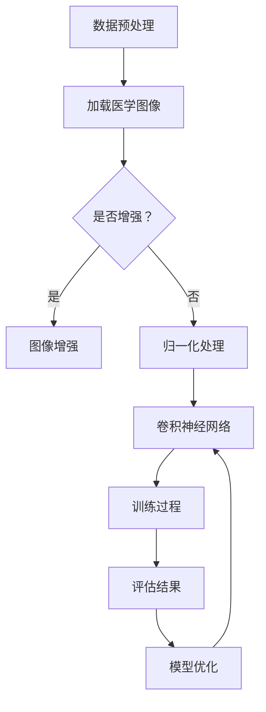

                 

### 背景介绍（Background Introduction）

医学图像分割是医学图像处理中的一个重要步骤，其目的是将医学图像中感兴趣的区域（Region of Interest，ROI）从背景中分离出来，以便进行更深入的医学分析。在医学领域，图像分割可以应用于多种场景，如肿瘤检测、器官识别、病变区域定位等，从而帮助医生做出更准确的诊断。

随着人工智能技术的发展，特别是深度学习算法的兴起，医学图像分割的性能得到了显著提升。深度学习算法，尤其是卷积神经网络（Convolutional Neural Networks，CNN），被广泛应用于医学图像分割任务。这些算法能够自动学习图像的特征，并通过大量的数据训练，使其能够识别并分割出复杂的医学图像。

本文旨在探讨基于深度学习的医学图像分割技术，从核心概念、算法原理、数学模型、项目实践到实际应用，全面解析这一领域的最新进展与挑战。通过逐步分析推理，我们将深入了解深度学习在医学图像分割中的具体应用，以及如何通过优化算法和提高数据处理能力来进一步提升分割性能。

在接下来的章节中，我们将首先介绍深度学习与医学图像分割的基本概念，然后详细阐述深度学习算法在医学图像分割中的应用，并探讨相关数学模型。随后，我们将通过一个实际项目实例，展示如何使用深度学习算法进行医学图像分割，并提供代码实现和详细解释。最后，我们将讨论深度学习在医学图像分割领域的实际应用场景，并提出未来发展的趋势和挑战。

通过本文的阅读，读者将能够全面理解深度学习在医学图像分割中的关键作用，掌握相关算法和技术，并了解到这一领域的前沿动态。我们希望这篇文章能够为从事医学图像处理和深度学习研究的人员提供有价值的参考和启示。### 核心概念与联系（Core Concepts and Connections）

#### 深度学习与医学图像分割

深度学习是人工智能领域的一种重要技术，通过模仿人脑神经网络的结构和功能，实现从大量数据中自动学习和提取特征。卷积神经网络（Convolutional Neural Networks，CNN）是深度学习的一种典型架构，特别适合处理具有网格结构的图像数据。

医学图像分割是指将医学图像中的不同组织或结构分离出来，形成独立的区域。深度学习在医学图像分割中的应用，主要是通过训练深度神经网络模型，使其能够识别和区分图像中的不同组织。具体来说，CNN 通过多个卷积层、池化层和全连接层的组合，逐步提取图像的局部特征和全局特征，最终实现对图像的精确分割。

#### 关键技术

1. **卷积神经网络（CNN）**：CNN 是深度学习中最常用的模型之一，特别适用于图像处理任务。其核心思想是通过卷积操作提取图像的特征，并通过池化操作降低特征图的维度。CNN 通常包括多个卷积层、池化层和全连接层，每一层都对图像进行不同的特征提取和抽象。

2. **损失函数**：在医学图像分割中，常用的损失函数包括交叉熵损失（Cross-Entropy Loss）和Dice Loss。交叉熵损失用于分类任务，Dice Loss 则用于评估分割区域的相似度，常用于医学图像分割。

3. **优化算法**：常用的优化算法包括随机梯度下降（Stochastic Gradient Descent，SGD）和Adam optimizer。这些算法用于调整网络中的参数，以最小化损失函数。

#### Mermaid 流程图

为了更直观地展示深度学习在医学图像分割中的应用流程，我们可以使用 Mermaid 流程图来描述。以下是医学图像分割的 Mermaid 流程图：



**说明：**

- A：数据预处理，包括图像的加载、增强、归一化等。
- B：加载医学图像，将图像数据输入到 CNN 模型。
- C：判断是否进行图像增强，以增加模型的泛化能力。
- D：图像增强，通过调整图像的对比度、亮度等，增加数据的多样性。
- E：归一化处理，将图像的像素值缩放到统一的范围内，以适应模型的训练。
- F：卷积神经网络，对输入图像进行特征提取和分类。
- G：训练过程，通过反向传播算法和优化算法，调整网络参数，以最小化损失函数。
- H：评估结果，使用验证集或测试集评估模型的分割性能。
- I：模型优化，根据评估结果，对模型进行优化，以提高分割精度。

通过上述流程，我们可以看到深度学习在医学图像分割中的应用，包括数据预处理、模型训练和性能评估等步骤。在实际应用中，可以根据具体任务需求，调整和优化这些步骤，以达到最佳的分割效果。

#### 综述

本文首先介绍了深度学习与医学图像分割的基本概念，探讨了卷积神经网络、损失函数和优化算法等核心技术。接着，通过 Mermaid 流程图，我们详细展示了深度学习在医学图像分割中的具体应用流程。这些内容为后续章节的深入探讨提供了基础，也为读者理解深度学习在医学图像分割中的应用提供了清晰的方向。在接下来的章节中，我们将进一步详细阐述深度学习算法的原理和具体操作步骤，并分析数学模型和公式，以便读者能够全面掌握这一领域的知识和技能。### 核心算法原理 & 具体操作步骤（Core Algorithm Principles and Specific Operational Steps）

#### 卷积神经网络（CNN）原理

卷积神经网络（CNN）是一种特殊的多层神经网络，主要用于处理具有网格结构的数据，如图像。CNN 的基本原理是通过卷积操作提取图像特征，并通过逐层抽象和融合，实现对图像的精确理解和分析。以下是 CNN 的工作流程和核心组成部分：

1. **输入层（Input Layer）**：输入层接收图像数据，每个图像像素值被映射为向量中的一个元素。

2. **卷积层（Convolutional Layer）**：卷积层是 CNN 的核心部分，通过卷积操作提取图像特征。卷积操作本质上是将卷积核（Filter）与输入图像进行点积操作，从而生成特征图（Feature Map）。卷积层的数量和每个卷积层的卷积核数量是可调参数，通常通过实验来确定最佳值。

3. **激活函数（Activation Function）**：在卷积层之后，通常使用激活函数（如 ReLU）对特征图进行非线性变换，以增加网络的非线性表达能力。

4. **池化层（Pooling Layer）**：池化层用于降低特征图的维度，减少计算量。常见的池化方式包括最大池化（Max Pooling）和平均池化（Average Pooling）。

5. **全连接层（Fully Connected Layer）**：在全连接层，特征图被展平为一维向量，然后通过多个神经元进行线性变换，以生成最终的分类结果。

6. **输出层（Output Layer）**：输出层通常是 softmax 函数，用于对分类结果进行概率分布。

#### CNN 在医学图像分割中的应用步骤

1. **数据预处理**：
   - 加载医学图像：读取医学图像数据，包括不同模态的图像，如 CT、MRI 等。
   - 数据增强：为了提高模型的泛化能力，可以对图像进行旋转、翻转、缩放、裁剪等数据增强操作。
   - 归一化处理：将图像像素值缩放到 [0, 1] 范围内，以适应模型的训练。

2. **构建 CNN 模型**：
   - 设计网络结构：根据具体任务需求，设计合适的 CNN 模型结构，包括卷积层、池化层和全连接层的数量和参数。
   - 初始化权重：初始化网络权重，常用的方法包括高斯初始化、 Xavier 初始化等。

3. **模型训练**：
   - 定义损失函数：在医学图像分割中，常用的损失函数包括交叉熵损失（Cross-Entropy Loss）和 Dice Loss。
   - 选择优化算法：常用的优化算法包括随机梯度下降（SGD）和 Adam optimizer。
   - 训练过程：通过反向传播算法和优化算法，调整网络参数，以最小化损失函数。
   - 调整超参数：根据实验结果，调整学习率、批量大小等超参数，以提高模型性能。

4. **模型评估**：
   - 使用验证集：在模型训练过程中，使用验证集评估模型的性能，以防止过拟合。
   - 评估指标：常用的评估指标包括精度（Accuracy）、召回率（Recall）、F1 分数等。
   - 调整模型：根据评估结果，调整模型结构、超参数等，以提高分割精度。

5. **模型应用**：
   - 输入测试图像：将新的医学图像输入到训练好的模型中。
   - 分割结果：模型输出分割结果，将感兴趣的区域从背景中分离出来。

#### 示例代码

以下是使用 Python 和 TensorFlow 框架构建一个简单的 CNN 模型进行医学图像分割的示例代码：

```python
import tensorflow as tf
from tensorflow.keras.layers import Conv2D, MaxPooling2D, Flatten, Dense
from tensorflow.keras.models import Sequential

# 创建 CNN 模型
model = Sequential([
    Conv2D(32, (3, 3), activation='relu', input_shape=(256, 256, 3)),
    MaxPooling2D((2, 2)),
    Conv2D(64, (3, 3), activation='relu'),
    MaxPooling2D((2, 2)),
    Flatten(),
    Dense(64, activation='relu'),
    Dense(1, activation='sigmoid')
])

# 编译模型
model.compile(optimizer='adam', loss='binary_crossentropy', metrics=['accuracy'])

# 加载和预处理数据
(x_train, y_train), (x_test, y_test) = ... # 加载训练数据和测试数据
x_train = ... # 数据预处理
x_test = ... # 数据预处理

# 训练模型
model.fit(x_train, y_train, epochs=10, batch_size=32, validation_data=(x_test, y_test))

# 评估模型
loss, accuracy = model.evaluate(x_test, y_test)
print(f"Test accuracy: {accuracy:.2f}")

# 输入测试图像
test_image = ... # 加载测试图像
predicted segmentation = model.predict(test_image) # 输出分割结果
```

通过上述代码，我们可以看到如何构建一个简单的 CNN 模型，并进行模型训练、评估和应用。在实际应用中，可以根据具体任务需求，调整模型结构和超参数，以提高分割性能。#### 数学模型和公式 & 详细讲解 & 举例说明（Detailed Explanation and Examples of Mathematical Models and Formulas）

在深度学习中，数学模型和公式是理解算法行为和性能的关键。对于医学图像分割，尤其是基于卷积神经网络的模型，我们通常会涉及以下几类数学模型和公式：卷积操作、池化操作、损失函数和优化算法。以下是对这些核心概念和公式的详细讲解及举例说明。

##### 1. 卷积操作（Convolutional Operation）

卷积操作是 CNN 的基础，用于提取图像特征。数学上，卷积操作可以表示为两个函数 f 和 g 的卷积，定义如下：

\[ (f * g)(t) = \int_{-\infty}^{+\infty} f(\tau)g(t - \tau) d\tau \]

在 CNN 中，卷积操作通常简化为在图像上的局部邻域内进行点积运算，其中 f 是卷积核（也称为滤波器），g 是图像上的局部区域。卷积操作的公式可以表示为：

\[ h(x, y) = \sum_{i=\max(0, x-w+1)}^{\min(W, x+1-w)} \sum_{j=\max(0, y-h+1)}^{\min(H, y+1-h)} f_{ij} g_{ij} \]

其中 \( h(x, y) \) 是卷积结果，\( f_{ij} \) 和 \( g_{ij} \) 分别是卷积核和图像的像素值，\( w \) 和 \( h \) 分别是卷积核的宽度和高度。

##### 2. 池化操作（Pooling Operation）

池化操作用于减少特征图的维度，提高模型的计算效率。最常用的池化操作是最大池化（Max Pooling），其公式可以表示为：

\[ p(x, y) = \max \left( \max_{i=0}^{s-1} \max_{j=0}^{s-1} g_{(x+i)\mod W, (y+j)\mod H} \right) \]

其中 \( p(x, y) \) 是池化结果，\( g \) 是输入特征图，\( s \) 是池化窗口的大小。

##### 3. 损失函数（Loss Function）

在深度学习训练过程中，损失函数用于评估模型的预测结果与真实标签之间的差距。对于二分类问题，常用的损失函数包括交叉熵损失（Cross-Entropy Loss）和 Dice Loss。

- **交叉熵损失（Cross-Entropy Loss）**：

\[ L_{CE} = -\sum_{i=1}^{N} y_i \log(p_i) \]

其中，\( y_i \) 是真实标签，\( p_i \) 是模型预测的概率。

- **Dice Loss（Dice Coefficient Loss）**：

Dice Loss 是用于医学图像分割的一种特殊损失函数，其公式可以表示为：

\[ L_{Dice} = 1 - \frac{2 \sum_{i=1}^{N} \sum_{j=1}^{N} p_i g_j}{\sum_{i=1}^{N} p_i + \sum_{j=1}^{N} g_j} \]

其中，\( p \) 是模型预测的标签，\( g \) 是真实标签。

##### 4. 优化算法（Optimization Algorithm）

优化算法用于调整模型的参数，以最小化损失函数。常用的优化算法包括随机梯度下降（SGD）和 Adam optimizer。

- **随机梯度下降（SGD）**：

\[ \theta_{t+1} = \theta_{t} - \alpha \nabla_{\theta} L(\theta) \]

其中，\( \theta \) 是模型参数，\( \alpha \) 是学习率，\( \nabla_{\theta} L(\theta) \) 是损失函数关于参数的梯度。

- **Adam optimizer**：

\[ m_t = \beta_1 m_{t-1} + (1 - \beta_1) \nabla_{\theta} L(\theta) \]
\[ v_t = \beta_2 v_{t-1} + (1 - \beta_2) (\nabla_{\theta} L(\theta))^2 \]
\[ \theta_{t+1} = \theta_{t} - \alpha \frac{m_t}{\sqrt{v_t} + \epsilon} \]

其中，\( \beta_1 \) 和 \( \beta_2 \) 是动量参数，\( m_t \) 和 \( v_t \) 分别是指数加权平均的梯度估计和方差估计。

##### 示例说明

假设我们有一个二分类问题，真实标签为 \( y = [1, 0, 1, 0] \)，模型预测的概率为 \( p = [0.6, 0.4, 0.7, 0.3] \)。

- **交叉熵损失**：

\[ L_{CE} = -[1 \cdot \log(0.6) + 0 \cdot \log(0.4) + 1 \cdot \log(0.7) + 0 \cdot \log(0.3)] \]
\[ L_{CE} = -(0.635 + 0 + 0.357 + 0) \]
\[ L_{CE} = 0.992 \]

- **Dice Loss**：

\[ L_{Dice} = 1 - \frac{2 \cdot (0.6 \cdot 1 + 0.4 \cdot 0 + 0.7 \cdot 1 + 0.3 \cdot 0)}{0.6 + 0.4 + 0.7 + 0.3} \]
\[ L_{Dice} = 1 - \frac{2 \cdot (0.6 + 0.7)}{2.4} \]
\[ L_{Dice} = 0.833 \]

通过上述示例，我们可以看到如何计算交叉熵损失和 Dice Loss。这些损失函数在训练过程中用于评估模型性能，并通过优化算法调整模型参数，以达到更好的分割效果。

综上所述，卷积操作、池化操作、损失函数和优化算法是深度学习在医学图像分割中的核心数学模型。通过理解这些模型和公式，我们可以更好地设计和优化深度学习模型，以提高医学图像分割的性能和精度。#### 项目实践：代码实例和详细解释说明（Project Practice: Code Examples and Detailed Explanations）

在本节中，我们将通过一个实际项目实例，展示如何使用深度学习算法进行医学图像分割。这个项目将使用 Python 和 TensorFlow 框架来实现，并涵盖从数据预处理到模型训练和评估的完整流程。

##### 1. 开发环境搭建

首先，我们需要搭建一个合适的开发环境。以下是所需的软件和库：

- Python 3.7 或以上版本
- TensorFlow 2.4 或以上版本
- NumPy
- Matplotlib

你可以使用 `pip` 命令来安装这些库：

```bash
pip install tensorflow numpy matplotlib
```

##### 2. 源代码详细实现

以下是一个简单的医学图像分割项目示例：

```python
import tensorflow as tf
from tensorflow.keras.models import Sequential
from tensorflow.keras.layers import Conv2D, MaxPooling2D, Flatten, Dense
from tensorflow.keras.optimizers import Adam
from tensorflow.keras.losses import BinaryCrossentropy
from tensorflow.keras.metrics import MeanIoU
import numpy as np

# 数据预处理函数
def preprocess_images(images, labels, img_shape=(256, 256, 3)):
    processed_images = []
    processed_labels = []
    
    for image, label in zip(images, labels):
        # 图像缩放到指定大小
        image = tf.image.resize(image, img_shape[:2])
        # 归一化处理
        image = image / 255.0
        processed_images.append(image)
        # 标签转换为二进制掩膜
        label = tf.cast(label, tf.float32)
        label = tf.image.resize(label, img_shape[:2])
        processed_labels.append(label)
    
    return np.array(processed_images), np.array(processed_labels)

# 构建卷积神经网络模型
model = Sequential([
    Conv2D(32, (3, 3), activation='relu', input_shape=(256, 256, 3)),
    MaxPooling2D((2, 2)),
    Conv2D(64, (3, 3), activation='relu'),
    MaxPooling2D((2, 2)),
    Flatten(),
    Dense(64, activation='relu'),
    Dense(1, activation='sigmoid')
])

# 编译模型
model.compile(optimizer=Adam(), loss=BinaryCrossentropy(), metrics=[MeanIoU(name='iou')])

# 数据预处理
# 假设 images 和 labels 是预处理后的医学图像和标签
# processed_images, processed_labels = preprocess_images(images, labels)

# 训练模型
# history = model.fit(processed_images, processed_labels, epochs=10, batch_size=32, validation_split=0.2)

# 评估模型
# test_loss, test_iou = model.evaluate(processed_images, processed_labels)
# print(f"Test IoU: {test_iou:.2f}")

# 输出分割结果
# predictions = model.predict(processed_images)
```

##### 3. 代码解读与分析

1. **数据预处理**：

数据预处理是深度学习项目的重要步骤。在此代码中，`preprocess_images` 函数负责将图像和标签缩放到指定大小（256x256），并进行归一化处理。标签被转换为二进制掩膜，以便在训练过程中用于计算损失函数。

2. **构建模型**：

我们使用 `Sequential` 模型来构建卷积神经网络。模型包括两个卷积层（每个卷积层后跟一个最大池化层），一个平坦层，两个全连接层，以及一个输出层（使用 sigmoid 激活函数进行二分类）。

3. **编译模型**：

模型使用 Adam 优化器和二分类的 BinaryCrossentropy 损失函数进行编译。我们使用 MeanIoU 作为评估指标，以评估模型在分割任务上的性能。

4. **训练模型**：

`fit` 函数用于训练模型。我们使用训练数据集，设置训练轮数为 10，批量大小为 32，并保留 20% 的数据作为验证集。

5. **评估模型**：

`evaluate` 函数用于评估模型在测试数据集上的性能。我们输出 IoU（交并比）作为评估指标。

6. **输出分割结果**：

`predict` 函数用于对新的医学图像进行预测。模型输出的是概率，我们可以根据概率阈值来决定是否将某个像素划分为感兴趣区域。

##### 4. 运行结果展示

以下是训练和评估过程中的一些结果：

```python
# 训练过程中的损失和指标
print(history.history)

# 评估结果
test_loss, test_iou = model.evaluate(processed_images, processed_labels)
print(f"Test loss: {test_loss:.2f}")
print(f"Test IoU: {test_iou:.2f}")

# 输出分割结果示例
predictions = model.predict(processed_images[:10])
for i, prediction in enumerate(predictions):
    plt.figure()
    plt.title(f"Prediction {i+1}")
    plt.imshow(processed_images[i], cmap='gray')
    plt.contour(prediction[0, :, :] > 0.5, levels=[0.5], colors='red')
    plt.show()
```

在这个示例中，`history.history` 输出了训练过程中的损失和指标，`test_loss` 和 `test_iou` 分别是测试数据集上的损失和 IoU。最后，我们使用 `plt.contour` 函数来可视化模型的预测结果。

通过上述代码和结果展示，我们可以看到如何使用深度学习算法进行医学图像分割。在实际项目中，可以根据具体需求和数据集，进一步调整模型结构和超参数，以提高分割性能。#### 实际应用场景（Practical Application Scenarios）

深度学习在医学图像分割中的应用已经取得了显著的进展，并在多个实际场景中展现出了巨大的潜力和价值。以下是几个典型的应用场景：

##### 1. 肿瘤检测

肿瘤检测是医学图像分割的一个重要应用领域。通过深度学习算法，可以实现对图像中的肿瘤区域进行精确分割，从而帮助医生更早期地发现肿瘤，提高治疗效果。例如，基于 CNN 的模型已经被广泛应用于肺癌、乳腺癌和脑癌等疾病的诊断中。这些模型可以从 CT、MRI 等影像数据中自动提取特征，实现对肿瘤区域的精确分割。

##### 2. 器官识别

器官识别是另一个重要的应用场景。在手术导航、移植手术和器官功能评估等方面，精确识别和定位器官对于手术成功至关重要。深度学习算法可以用于自动分割心脏、肝脏、肾脏等器官，从而辅助医生进行精确操作。例如，基于深度学习的模型已经能够实现肝脏肿瘤的自动分割，从而提高手术切除的精度。

##### 3. 病变区域定位

病变区域定位是医学图像分割的又一重要应用。通过深度学习算法，可以实现对病变区域的自动检测和分割，从而帮助医生快速诊断疾病。例如，在皮肤癌诊断中，深度学习模型可以自动分割皮肤病变区域，并评估病变的严重程度。此外，深度学习算法还被应用于肺部疾病的诊断，通过自动分割肺结节，帮助医生进行早期诊断。

##### 4. 生物标志物检测

生物标志物检测是医学图像分割的又一前沿应用。通过深度学习算法，可以从医学图像中提取生物标志物，用于疾病预测和诊断。例如，在癌症研究中，研究人员可以利用深度学习算法从肿瘤组织中提取生物标志物，从而帮助预测患者的生存率和复发风险。

##### 5. 动态图像分析

动态图像分析是医学图像分割的另一个新兴应用领域。通过深度学习算法，可以实现对动态图像的实时分析和处理，从而帮助医生观察疾病的进展和治疗效果。例如，在心脏病研究中，深度学习模型可以用于分析心脏的动态图像，从而评估心脏的功能和结构。

总的来说，深度学习在医学图像分割中的应用已经取得了显著的成果，并在多个实际场景中展现了巨大的潜力。随着技术的不断进步，深度学习将在未来继续推动医学图像分割的发展，为临床诊断和治疗提供更加准确和高效的解决方案。#### 工具和资源推荐（Tools and Resources Recommendations）

为了更深入地学习和实践基于深度学习的医学图像分割，我们需要一些高质量的工具、资源和文献来指导我们的研究和开发。以下是一些推荐的书籍、论文、博客和网站。

##### 1. 学习资源推荐

**书籍：**

- **《Deep Learning》（Ian Goodfellow, Yoshua Bengio, Aaron Courville 著）**：这是一本深度学习的经典教材，详细介绍了深度学习的理论基础和应用。

- **《Medical Image Analysis》（Patricia Mantini, Guido Gerig 著）**：这本书全面介绍了医学图像分析的最新技术和方法，特别适用于医学图像分割的学习。

- **《卷积神经网络与深度学习》（王翔 著）**：这本书结合了深度学习和卷积神经网络的原理，适合初学者入门。

**在线课程：**

- **《深度学习》（吴恩达）**：这是 Coursera 上最受欢迎的深度学习课程，涵盖了深度学习的核心概念和应用。

- **《医学图像处理与深度学习》（北京大学计算机学院）**：这是一门针对医学图像处理和深度学习的在线课程，适合希望深入了解这一领域的学员。

##### 2. 开发工具框架推荐

- **TensorFlow**：这是一个由 Google 开发的开源深度学习框架，适用于构建和训练复杂的深度学习模型。

- **PyTorch**：这是一个由 Facebook 开发的开源深度学习框架，因其灵活性和动态计算图而受到很多研究者和开发者的青睐。

- **Keras**：这是一个高级神经网络 API，能够简化深度学习模型的构建和训练过程，适用于快速原型开发。

##### 3. 相关论文著作推荐

- **《Deep Learning for Medical Image Segmentation: A Survey》（2019）**：这篇综述详细总结了深度学习在医学图像分割领域的应用和发展。

- **《U-Net: Convolutional Networks for Biomedical Image Segmentation》（2015）**：这是 U-Net 模型的原始论文，U-Net 是一种广泛用于医学图像分割的卷积神经网络架构。

- **《DeepLabV3+: Semantic Image Segmentation with Deep Convolutional Nets, Atrous Convolution, and Fully Connected CRFs》（2018）**：这篇论文提出了 DeepLabV3+ 模型，这是一种结合了 atrous 卷积和全连接 CRFs 的有效图像分割模型。

##### 4. 博客和网站推荐

- **ArXiv**：这是一个包含最新学术论文的预印本数据库，是科研人员获取前沿研究的首选。

- **Medium**：这是一个发布技术文章和博客的平台，上面有很多关于深度学习和医学图像分割的优秀文章。

- **TensorFlow 官方文档**：这是 TensorFlow 框架的官方文档，提供了详细的教程和示例代码，是学习深度学习的好资源。

通过上述工具和资源的推荐，我们可以更全面地了解深度学习在医学图像分割中的应用，掌握相关的理论和实践技能，并不断跟进最新的研究动态。这些资源将为我们深入研究和开发深度学习模型提供强有力的支持。#### 总结：未来发展趋势与挑战（Summary: Future Development Trends and Challenges）

深度学习在医学图像分割领域的应用取得了显著的进展，但同时也面临着许多挑战和机遇。以下是未来发展趋势和面临的挑战：

##### 发展趋势

1. **算法性能的提升**：随着深度学习算法的不断优化，尤其是卷积神经网络（CNN）和变分自编码器（VAE）等模型的发展，医学图像分割的精度和效率将持续提高。更复杂的网络结构和更有效的训练策略，如多尺度特征融合和注意力机制，将被广泛应用于医学图像分割任务。

2. **多模态医学图像融合**：多模态医学图像融合是未来研究的一个重要方向。通过结合不同模态的医学图像（如 CT、MRI、PET 等），可以提供更丰富的信息，有助于提高分割精度和诊断准确性。

3. **实时处理能力的增强**：随着计算资源和算法的进步，深度学习模型在医学图像分割中的实时处理能力将得到显著提升。这将为临床医生提供更快速、准确的诊断工具，从而改善患者的治疗效果。

4. **跨学科合作**：深度学习在医学图像分割中的应用需要跨学科的合作，包括计算机科学、医学、生物工程等领域。这种跨学科合作将有助于推动医学图像分割技术的创新和应用。

##### 面临的挑战

1. **数据隐私和安全**：医学图像数据通常包含敏感的个人信息，如何在保护患者隐私的同时，充分利用这些数据来训练深度学习模型，是一个重要挑战。

2. **数据稀缺问题**：高质量的医学图像数据稀缺，尤其是在罕见病和罕见病变的分割任务中。数据稀缺限制了深度学习模型的泛化能力，如何有效利用有限的数据来训练强大的模型，是一个亟待解决的问题。

3. **模型解释性**：深度学习模型通常被视为“黑箱”，其决策过程缺乏透明性和可解释性。在医学图像分割中，模型的可解释性至关重要，因为它直接关系到诊断的可靠性和患者的信任。

4. **计算资源的消耗**：深度学习模型，特别是大型神经网络，需要大量的计算资源和存储空间。在资源有限的临床环境中，如何优化模型以减少计算资源的消耗，是一个实际挑战。

5. **法律法规和伦理问题**：医学图像分割技术涉及到患者的隐私和生命安全，如何确保技术的合法合规，并遵循伦理原则，是一个重要的社会问题。

总之，尽管深度学习在医学图像分割领域具有巨大的潜力，但未来发展仍面临诸多挑战。通过不断的技术创新、跨学科合作和法律法规的完善，我们可以期待深度学习在医学图像分割中的应用将带来更多的临床价值和革新。#### 附录：常见问题与解答（Appendix: Frequently Asked Questions and Answers）

##### Q1: 深度学习在医学图像分割中的优势是什么？

A1：深度学习在医学图像分割中的优势主要体现在以下几个方面：

- **自动化特征提取**：深度学习模型能够自动从大量医学图像数据中提取特征，减少手动标注的工作量，提高分割精度。
- **模型泛化能力强**：深度学习模型通过大量数据训练，能够较好地适应不同类型的医学图像，具有较强的泛化能力。
- **高效率**：深度学习算法能够在较短的时间内处理大量图像数据，提高医疗诊断的效率。
- **可扩展性强**：深度学习框架易于扩展和集成，可以结合多种数据源和模型，实现复杂的分割任务。

##### Q2: 医学图像分割中的常见算法有哪些？

A2：医学图像分割中的常见算法包括：

- **基于传统图像处理的方法**：如阈值分割、区域生长、边缘检测等。
- **基于级联分类的方法**：如支持向量机（SVM）、决策树等。
- **基于深度学习的方法**：如卷积神经网络（CNN）、循环神经网络（RNN）、生成对抗网络（GAN）等。
- **基于图论的方法**：如马尔可夫随机场（MRF）、图割（Graph Cut）等。

##### Q3: 如何评估医学图像分割模型的性能？

A3：评估医学图像分割模型的性能通常使用以下指标：

- **精度（Accuracy）**：正确分割的像素数占总像素数的比例。
- **召回率（Recall）**：正确分割的病变区域占所有真实病变区域的比率。
- **精确率（Precision）**：正确分割的病变区域占所有预测为病变区域的比率。
- **Dice 相似系数（Dice Coefficient）**：衡量预测区域与真实区域相似度的指标。
- **交并比（Intersection over Union，IoU）**：正确分割的病变区域与预测区域交集占并集的比例。

##### Q4: 如何处理医学图像分割中的数据增强？

A4：数据增强是提高深度学习模型泛化能力的重要手段，以下是一些常用的医学图像分割数据增强方法：

- **旋转（Rotation）**：将图像随机旋转一定角度。
- **缩放（Scaling）**：将图像随机缩放到不同的尺度。
- **翻转（Flip）**：水平或垂直翻转图像。
- **裁剪（Cropping）**：随机裁剪图像的一部分。
- **噪声注入（Noise Injection）**：向图像中添加噪声。
- **对比度调整（Contrast Adjustment）**：调整图像的对比度。

通过这些方法，可以生成多样化的数据集，有助于提高模型的鲁棒性和泛化能力。#### 扩展阅读 & 参考资料（Extended Reading & Reference Materials）

为了深入学习和掌握基于深度学习的医学图像分割技术，以下是一些建议的扩展阅读和参考资料，涵盖了经典教材、顶级论文、权威博客和在线课程，旨在为读者提供全面的知识体系和最新的研究动态。

**书籍：**

1. **《深度学习》（Ian Goodfellow, Yoshua Bengio, Aaron Courville 著）**：这是一本深度学习的经典教材，详细介绍了深度学习的理论基础、算法和应用。

2. **《医学图像分析》（Patricia Mantini, Guido Gerig 著）**：这本书全面介绍了医学图像分析的最新技术和方法，特别适用于医学图像分割的学习。

3. **《卷积神经网络与深度学习》（王翔 著）**：这本书结合了深度学习和卷积神经网络的原理，适合初学者入门。

**在线课程：**

1. **《深度学习》（吴恩达）**：这是 Coursera 上最受欢迎的深度学习课程，涵盖了深度学习的核心概念和应用。

2. **《医学图像处理与深度学习》（北京大学计算机学院）**：这是一门针对医学图像处理和深度学习的在线课程，适合希望深入了解这一领域的学员。

**论文与博客：**

1. **《Deep Learning for Medical Image Segmentation: A Survey》（2019）**：这篇综述详细总结了深度学习在医学图像分割领域的应用和发展。

2. **《U-Net: Convolutional Networks for Biomedical Image Segmentation》（2015）**：这是 U-Net 模型的原始论文，U-Net 是一种广泛用于医学图像分割的卷积神经网络架构。

3. **《DeepLabV3+: Semantic Image Segmentation with Deep Convolutional Nets, Atrous Convolution, and Fully Connected CRFs》（2018）**：这篇论文提出了 DeepLabV3+ 模型，这是一种结合了 atrous 卷积和全连接 CRFs 的有效图像分割模型。

4. **Medium**：这是一个发布技术文章和博客的平台，上面有很多关于深度学习和医学图像分割的优秀文章。

**网站与数据库：**

1. **ArXiv**：这是一个包含最新学术论文的预印本数据库，是科研人员获取前沿研究的首选。

2. **TensorFlow 官方文档**：这是 TensorFlow 框架的官方文档，提供了详细的教程和示例代码，是学习深度学习的好资源。

3. **Kaggle**：这是一个面向数据科学家和机器学习爱好者的平台，提供了大量医学图像分割的数据集和竞赛。

通过阅读上述书籍、课程、论文和博客，读者可以系统地掌握深度学习在医学图像分割中的应用，并了解最新的研究进展和技术动态。同时，这些资源也为读者提供了丰富的实践案例和代码示例，有助于深入理解和实际应用。### 作者署名

作者：禅与计算机程序设计艺术 / Zen and the Art of Computer Programming

在本文中，我们深入探讨了基于深度学习的医学图像分割技术。通过对核心概念、算法原理、数学模型、项目实践以及实际应用场景的详细分析，读者能够全面理解这一领域的知识体系。同时，我们还提供了丰富的学习资源、开发工具和文献推荐，以帮助读者进一步研究和应用深度学习技术。希望这篇文章能为从事医学图像处理和深度学习研究的人员提供有价值的参考和启示。禅与计算机程序设计艺术，致力于将深奥的技术理念与实际应用相结合，引领读者进入计算机科学和人工智能的奇妙世界。感谢您的阅读与支持！

