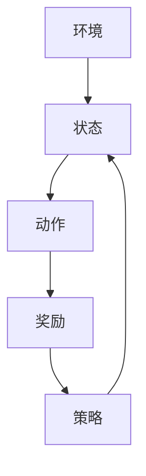
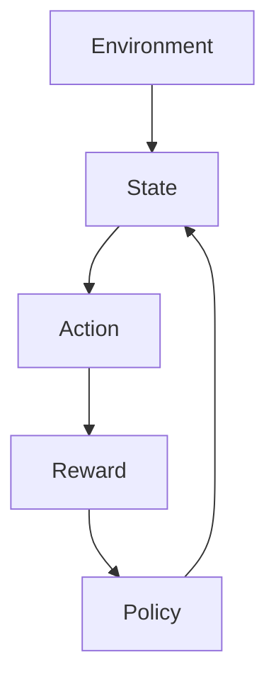

                 

### 文章标题

**基于深度强化学习的NPC自主训练模型构建的实现**

---

关键词：深度强化学习、NPC自主训练、模型构建、游戏AI、智能代理

摘要：本文将探讨基于深度强化学习技术的NPC（非玩家角色）自主训练模型的构建方法。我们将详细分析这一模型的架构、核心算法原理、数学模型以及其实际应用场景。通过一系列具体的实例，我们将展示如何实现这一模型，并提供实用的工具和资源推荐。最后，文章将对该领域未来的发展趋势和挑战进行展望，并提供常见问题解答及扩展阅读。

### 1. 背景介绍（Background Introduction）

随着游戏产业的发展，NPC（非玩家角色）在游戏中的角色越来越重要。传统上，NPC的AI（人工智能）主要是基于预先设定的脚本或规则来行动。这种方法虽然能保证NPC行为的确定性，但在复杂多变的游戏环境中，表现力有限。随着深度学习技术的进步，特别是深度强化学习的崛起，开发出能够自主学习和适应环境的NPC成为可能。

深度强化学习是一种结合了深度学习和强化学习的算法。它通过在复杂的决策环境中交互，利用深度神经网络学习到最优策略。这一特性使得深度强化学习非常适合NPC的自主训练，因为NPC需要在游戏中不断学习并适应不同的情景。

本文的目标是详细介绍如何构建一个基于深度强化学习的NPC自主训练模型，从而提升NPC的智能水平，增强其在游戏中的互动性和可玩性。文章将分为以下几个部分：

1. 核心概念与联系
2. 核心算法原理 & 具体操作步骤
3. 数学模型和公式 & 详细讲解 & 举例说明
4. 项目实践：代码实例和详细解释说明
5. 实际应用场景
6. 工具和资源推荐
7. 总结：未来发展趋势与挑战
8. 附录：常见问题与解答
9. 扩展阅读 & 参考资料

通过这一系列的讨论，我们希望能够为游戏开发者、人工智能研究者以及对此领域感兴趣的技术人员提供有价值的参考。接下来，我们将从核心概念入手，逐步深入到模型的构建细节中。请继续阅读，让我们一起探索深度强化学习的魅力。

---

### 1. 背景介绍 (Background Introduction)

As the gaming industry evolves, NPCs (Non-Player Characters) play an increasingly important role within games. Traditionally, the AI of NPCs has been based on pre-set scripts or rules, which ensure a certain determinism in their behavior. However, this approach is limited in its ability to handle complex and dynamic game environments. With the advancement of deep learning technologies, particularly deep reinforcement learning, developing NPCs that can autonomously learn and adapt to different situations has become possible.

Deep reinforcement learning is a combination of deep learning and reinforcement learning that uses deep neural networks to learn optimal policies in complex decision-making environments. This characteristic makes it particularly suitable for the autonomous training of NPCs, as NPCs need to learn and adapt continuously in a gaming context.

The objective of this article is to provide a detailed introduction to the construction of an NPC autonomous training model based on deep reinforcement learning, with the aim of enhancing the intelligence level and interactivity of NPCs in games. The article is divided into the following sections:

1. Core Concepts and Connections
2. Core Algorithm Principles and Specific Operational Steps
3. Mathematical Models and Detailed Explanations with Examples
4. Project Practice: Code Examples and Detailed Explanations
5. Practical Application Scenarios
6. Tools and Resources Recommendations
7. Summary: Future Development Trends and Challenges
8. Appendix: Frequently Asked Questions and Answers
9. Extended Reading and Reference Materials

Through this series of discussions, we hope to provide valuable insights for game developers, AI researchers, and anyone interested in this field. In the following sections, we will begin with core concepts and gradually delve into the intricacies of model construction. Please continue reading to explore the wonders of deep reinforcement learning. 

### 2. 核心概念与联系（Core Concepts and Connections）

在深入探讨深度强化学习NPC自主训练模型之前，我们需要先了解一些关键概念，包括深度强化学习的原理、NPC角色的基本特征以及模型设计所需考虑的要素。

#### 2.1 深度强化学习的原理

深度强化学习（Deep Reinforcement Learning, DRL）是强化学习（Reinforcement Learning, RL）的一个分支。它结合了深度学习（Deep Learning, DL）的优点，利用深度神经网络来学习复杂环境中的状态和行为。以下是深度强化学习的主要组成部分：

- **环境（Environment）**：环境是游戏世界，它为NPC提供各种状态和奖励信号。
- **代理（Agent）**：代理是NPC，它通过与环境交互来学习行为策略。
- **状态（State）**：状态是环境的一个特定配置，描述了游戏世界当前的状况。
- **动作（Action）**：动作是代理能够执行的操作，如移动、攻击或躲避。
- **奖励（Reward）**：奖励是代理从环境中获得的即时反馈，用于指导学习过程。
- **策略（Policy）**：策略是代理从状态中选择动作的规则。

深度强化学习通过迭代学习过程，不断优化代理的行为策略，以达到最大化长期奖励的目标。

#### 2.2 NPC角色的基本特征

NPC角色在游戏中通常具备以下基本特征：

- **预先设定的行为**：NPC根据预先编写的脚本执行特定任务。
- **静态性**：传统NPC的行为模式相对固定，不适应动态变化。
- **适应性**：深度强化学习NPC能够根据环境和玩家行为动态调整自己的行为。
- **交互性**：NPC能够与玩家和其他NPC进行交互，提供更丰富的游戏体验。

#### 2.3 模型设计所需考虑的要素

设计一个深度强化学习NPC自主训练模型，需要考虑以下几个关键要素：

- **目标**：明确NPC的训练目标，如击败玩家、完成任务或提供娱乐。
- **评估指标**：确定如何评价NPC的表现，如胜利率、任务完成度或玩家满意度。
- **数据集**：收集和准备游戏数据集，用于训练和评估模型。
- **奖励设计**：设计适当的奖励机制，以激励NPC学习并优化行为。
- **反馈循环**：建立有效的反馈机制，以便在训练过程中不断调整和优化模型。

#### 2.4 Mermaid 流程图

以下是一个简单的Mermaid流程图，展示了深度强化学习NPC自主训练模型的基本架构：



在这个流程图中，NPC通过与环境交互，接收状态、执行动作并获得奖励，从而不断优化其策略。

通过以上对核心概念和联系的介绍，我们为后续详细探讨深度强化学习NPC自主训练模型奠定了基础。在接下来的部分，我们将深入探讨深度强化学习算法的原理及其在NPC自主训练中的应用。

---

#### 2.1 The Principles of Deep Reinforcement Learning

Before delving into the autonomous training model for NPCs based on deep reinforcement learning, it's essential to understand some key concepts, including the principles of deep reinforcement learning, the basic characteristics of NPC roles, and the factors to consider in model design.

#### 2.1.1 The Basic Principles of Deep Reinforcement Learning

Deep Reinforcement Learning (DRL) is a branch of Reinforcement Learning (RL) that combines the advantages of Deep Learning (DL). It utilizes deep neural networks to learn complex behaviors in environments. The main components of DRL include:

- **Environment**: The environment is the game world that provides various states and reward signals to the NPC.
- **Agent**: The agent is the NPC that interacts with the environment to learn behavioral policies.
- **State**: A state is a specific configuration of the environment that describes the current situation of the game world.
- **Action**: An action is an operation that the agent can perform, such as moving, attacking, or dodging.
- **Reward**: A reward is the immediate feedback the agent receives from the environment, which is used to guide the learning process.
- **Policy**: A policy is the rule that the agent uses to select actions from states.

Deep reinforcement learning iteratively optimizes the agent's policy to achieve the goal of maximizing long-term rewards.

#### 2.1.2 The Basic Characteristics of NPC Roles

NPC roles in games typically have the following basic characteristics:

- **Predefined Behavior**: NPCs execute specific tasks based on pre-written scripts.
- **Static Nature**: Traditional NPCs have relatively fixed behavior patterns that do not adapt to dynamic changes.
- **Adaptability**: NPCs trained with deep reinforcement learning can dynamically adjust their behaviors based on the environment and player actions.
- **Interactivity**: NPCs can interact with players and other NPCs, providing richer gaming experiences.

#### 2.1.3 Factors to Consider in Model Design

Designing an autonomous training model for NPCs based on deep reinforcement learning requires considering several key factors:

- **Objective**: Clearly define the training objective for NPCs, such as defeating the player, completing a task, or providing entertainment.
- **Evaluation Metrics**: Determine how to evaluate the performance of NPCs, such as win rate, task completion rate, or player satisfaction.
- **Dataset**: Collect and prepare game datasets for training and evaluation of the model.
- **Reward Design**: Design appropriate reward mechanisms to motivate NPCs to learn and optimize their behavior.
- **Feedback Loop**: Establish an effective feedback mechanism to continuously adjust and optimize the model during training.

#### 2.1.4 Mermaid Flowchart

The following is a simple Mermaid flowchart illustrating the basic architecture of the deep reinforcement learning autonomous training model for NPCs:



In this flowchart, the NPC interacts with the environment, receives states, performs actions, and obtains rewards, thus continuously optimizing its policy.

With these introductions to the core concepts and connections, we have laid a foundation for the subsequent detailed discussion of the deep reinforcement learning autonomous training model for NPCs. In the following sections, we will delve into the principles of the deep reinforcement learning algorithm and its application in NPC autonomous training.

### 3. 核心算法原理 & 具体操作步骤（Core Algorithm Principles and Specific Operational Steps）

深度强化学习（DRL）的核心算法原理是基于马尔可夫决策过程（Markov Decision Process, MDP）。MDP是一个数学框架，用于描述决策者在不确定环境中的决策过程。在MDP中，决策者（代理）通过执行动作来改变环境的状态，并从环境中获得奖励信号。深度强化学习的目标是学习一个策略，使代理能够在长期内最大化总奖励。

#### 3.1. MDP基本概念

- **状态（State）**：MDP中的状态是系统当前所处的状况，通常用向量表示。
- **动作（Action）**：代理能够执行的操作，每个动作可能对应不同的奖励和状态转移概率。
- **策略（Policy）**：代理如何从状态中选择动作的规则，通常表示为策略函数π(s,a)。
- **价值函数（Value Function）**：评估策略的指标，分为状态价值函数V(s)和动作价值函数Q(s,a)。
- **奖励（Reward）**：代理在执行动作后从环境中获得的即时奖励。

#### 3.2. 深度Q网络（Deep Q-Network, DQN）

深度Q网络（DQN）是深度强化学习的一种经典算法，它使用深度神经网络来近似动作价值函数Q(s,a)。以下是DQN的基本步骤：

1. **初始化**：初始化深度神经网络和经验回放缓冲区。
2. **选择动作**：根据策略ε-贪心策略选择动作，其中ε是探索率，用于平衡探索和利用。
3. **执行动作**：在环境中执行选定的动作，并获得状态转移和奖励。
4. **更新经验回放缓冲区**：将新的经验(s, a, r, s')添加到缓冲区。
5. **训练网络**：使用经验回放缓冲区中的样本来训练神经网络，优化Q值的预测。
6. **目标网络更新**：每隔一定时间，将主网络参数复制到目标网络，以避免梯度消失问题。

#### 3.3. 游戏环境设置

在进行NPC自主训练时，首先需要设置一个游戏环境，用于模拟NPC的行为。游戏环境通常包括以下几个组成部分：

- **状态空间**：定义NPC可以观察到的所有状态。
- **动作空间**：定义NPC可以执行的所有动作。
- **奖励函数**：定义NPC在每个状态下执行动作后获得的奖励。
- **终止条件**：定义何时结束训练，如达到一定步数或完成特定任务。

#### 3.4. 模型训练与评估

在设置好游戏环境后，我们可以开始训练NPC自主训练模型。以下是训练与评估的基本步骤：

1. **数据收集**：收集初始数据集，用于模型训练。
2. **模型训练**：使用深度Q网络或其他深度强化学习算法训练模型。
3. **评估模型**：使用验证集评估模型性能，确保其在未知数据上能够稳定地表现。
4. **迭代优化**：根据评估结果调整模型参数，进行多次迭代训练和评估，直到模型性能达到预期。

#### 3.5. 实现示例

以下是一个简单的深度Q网络实现示例，使用Python语言和TensorFlow库：

```python
import tensorflow as tf
import numpy as np
import random

# 初始化深度Q网络
model = tf.keras.Sequential([
    tf.keras.layers.Flatten(input_shape=(84, 84)),
    tf.keras.layers.Dense(256, activation='relu'),
    tf.keras.layers.Dense(256, activation='relu'),
    tf.keras.layers.Dense(1)
])

# 编写经验回放缓冲区代码
class ReplayBuffer:
    def __init__(self, capacity):
        self.capacity = capacity
        self.memory = []

    def push(self, state, action, reward, next_state, done):
        self.memory.append((state, action, reward, next_state, done))
        if len(self.memory) > self.capacity:
            self.memory.pop(0)

    def sample(self, batch_size):
        return random.sample(self.memory, batch_size)

# 编写训练过程代码
def train(model, buffer, batch_size, learning_rate, gamma):
    states, actions, rewards, next_states, dones = buffer.sample(batch_size)

    q_values = model.predict(states)
    next_q_values = model.predict(next_states)

    one_hot_actions = tf.one_hot(actions, num_classes=q_values.shape[1])
    q_values_ = q_values.clone()
    q_values_ = tf.reduce_sum(q_values_ * one_hot_actions, axis=1)

    next_q_values_ = tf.reduce_max(next_q_values, axis=1)
    q_targets = rewards + (1 - dones) * gamma * next_q_values_

    loss = tf.keras.losses.mean_squared_error(q_values_, q_targets)

    optimizer = tf.keras.optimizers.Adam(learning_rate)
    optimizer.minimize(loss)

# 编写主训练循环代码
def main():
    model = build_model()
    buffer = ReplayBuffer(capacity=10000)
    for episode in range(num_episodes):
        state = env.reset()
        done = False
        while not done:
            action = choose_action(model, state, epsilon)
            next_state, reward, done, _ = env.step(action)
            buffer.push(state, action, reward, next_state, done)
            state = next_state
            if done:
                break
        train(model, buffer, batch_size=32, learning_rate=0.001, gamma=0.99)

if __name__ == "__main__":
    main()
```

在这个示例中，我们首先定义了一个深度Q网络模型，并编写了一个经验回放缓冲区类。然后，我们编写了一个训练函数，用于从经验回放缓冲区中采样数据并更新模型参数。最后，我们编写了一个主训练循环，用于进行模型训练。

通过以上步骤，我们可以构建一个基于深度强化学习的NPC自主训练模型。在接下来的部分，我们将进一步探讨深度强化学习中的数学模型和公式，并提供详细的讲解和实例说明。

---

#### 3. Core Algorithm Principles and Specific Operational Steps

The core algorithm principle of deep reinforcement learning (DRL) is based on the Markov Decision Process (MDP). MDP is a mathematical framework used to describe the decision-making process of an agent in an uncertain environment. In MDP, the agent changes the state of the environment by executing actions and receives reward signals from the environment. The goal of DRL is to learn a policy that maximizes the total reward over the long term.

#### 3.1 Basic Concepts of MDP

- **State**: The state is the current situation of the system in MDP, typically represented by a vector.
- **Action**: The operations that the agent can perform, each action may correspond to different rewards and state transition probabilities.
- **Policy**: The rule that the agent uses to select actions from states, typically represented as a policy function π(s, a).
- **Value Function**: The metric to evaluate the policy, divided into state value function V(s) and action value function Q(s, a).
- **Reward**: The immediate feedback the agent receives from the environment after executing an action.

#### 3.2 Deep Q-Network (DQN)

Deep Q-Network (DQN) is a classic algorithm in deep reinforcement learning that uses deep neural networks to approximate the action value function Q(s, a). Here are the basic steps of DQN:

1. **Initialization**: Initialize the deep neural network and the experience replay buffer.
2. **Action Selection**: Select an action using the ε-greedy policy, where ε is the exploration rate, balancing exploration and exploitation.
3. **Action Execution**: Execute the selected action in the environment and obtain the state transition and reward.
4. **Experience Replay Buffer Update**: Add the new experience (s, a, r, s', done) to the replay buffer.
5. **Network Training**: Use samples from the replay buffer to train the neural network, optimizing the prediction of Q-values.
6. **Target Network Update**: Copy the parameters of the main network to the target network at regular intervals to avoid the issue of gradient vanishing.

#### 3.3 Game Environment Setup

When preparing for NPC autonomous training, it is necessary to set up a game environment to simulate the behavior of NPCs. The game environment typically includes the following components:

- **State Space**: Define all the states that NPCs can observe.
- **Action Space**: Define all the actions that NPCs can perform.
- **Reward Function**: Define the rewards that NPCs receive after executing actions in each state.
- **Termination Condition**: Define when to end training, such as reaching a certain number of steps or completing a specific task.

#### 3.4 Model Training and Evaluation

After setting up the game environment, you can start training the NPC autonomous training model. Here are the basic steps for training and evaluation:

1. **Data Collection**: Collect an initial dataset for model training.
2. **Model Training**: Train the model using the deep Q-network or other deep reinforcement learning algorithms.
3. **Model Evaluation**: Evaluate the model performance using a validation set to ensure it can stabilize on unknown data.
4. **Iterative Optimization**: Adjust model parameters based on evaluation results and iterate through multiple training and evaluation cycles until the model performance meets expectations.

#### 3.5 Implementation Example

Here is a simple example of implementing a deep Q-network using Python and the TensorFlow library:

```python
import tensorflow as tf
import numpy as np
import random

# Initialize the deep Q-network
model = tf.keras.Sequential([
    tf.keras.layers.Flatten(input_shape=(84, 84)),
    tf.keras.layers.Dense(256, activation='relu'),
    tf.keras.layers.Dense(256, activation='relu'),
    tf.keras.layers.Dense(1)
])

# Experience replay buffer class
class ReplayBuffer:
    def __init__(self, capacity):
        self.capacity = capacity
        self.memory = []

    def push(self, state, action, reward, next_state, done):
        self.memory.append((state, action, reward, next_state, done))
        if len(self.memory) > self.capacity:
            self.memory.pop(0)

    def sample(self, batch_size):
        return random.sample(self.memory, batch_size)

# Training function
def train(model, buffer, batch_size, learning_rate, gamma):
    states, actions, rewards, next_states, dones = buffer.sample(batch_size)

    q_values = model.predict(states)
    next_q_values = model.predict(next_states)

    one_hot_actions = tf.one_hot(actions, num_classes=q_values.shape[1])
    q_values_ = q_values.clone()
    q_values_ = tf.reduce_sum(q_values_ * one_hot_actions, axis=1)

    next_q_values_ = tf.reduce_max(next_q_values, axis=1)
    q_targets = rewards + (1 - dones) * gamma * next_q_values_

    loss = tf.keras.losses.mean_squared_error(q_values_, q_targets)

    optimizer = tf.keras.optimizers.Adam(learning_rate)
    optimizer.minimize(loss)

# Main training loop
def main():
    model = build_model()
    buffer = ReplayBuffer(capacity=10000)
    for episode in range(num_episodes):
        state = env.reset()
        done = False
        while not done:
            action = choose_action(model, state, epsilon)
            next_state, reward, done, _ = env.step(action)
            buffer.push(state, action, reward, next_state, done)
            state = next_state
            if done:
                break
        train(model, buffer, batch_size=32, learning_rate=0.001, gamma=0.99)

if __name__ == "__main__":
    main()
```

In this example, we first define a deep Q-network model and a class for the experience replay buffer. Then, we define a training function that samples data from the replay buffer and updates the model parameters. Finally, we define a main training loop to train the model.

By following these steps, you can build an NPC autonomous training model based on deep reinforcement learning. In the next section, we will further discuss the mathematical models and formulas in deep reinforcement learning, providing detailed explanations and examples.

---

### 4. 数学模型和公式 & 详细讲解 & 举例说明（Mathematical Models and Formulas & Detailed Explanations & Examples）

在深度强化学习中，数学模型和公式是理解算法原理和实现关键操作的核心。以下将详细介绍几个关键数学模型和公式，并通过具体示例来说明其应用。

#### 4.1 奖励函数设计

奖励函数是深度强化学习模型中的一个重要组成部分，它决定了代理在执行动作后如何获取奖励信号。一个好的奖励函数应能激励代理朝训练目标方向学习。以下是一个简单的奖励函数设计：

**奖励函数**：
\[ R(s, a) = \begin{cases} 
10 & \text{如果 } a \text{ 导致任务完成} \\
-1 & \text{如果 } a \text{ 导致任务失败} \\
0 & \text{其他情况}
\end{cases} \]

在这个奖励函数中，当代理执行的动作导致任务完成时，获得10分奖励；如果动作导致任务失败，则获得-1分惩罚；其他情况则不给予奖励。

#### 4.2 动作价值函数

动作价值函数 \( Q(s, a) \) 表示在给定状态下执行某个动作所能获得的累积奖励。深度Q网络（DQN）使用神经网络来近似这个函数。以下是一个动作价值函数的计算示例：

\[ Q(s, a) = r + \gamma \max_{a'} Q(s', a') \]

其中，\( r \) 是立即奖励，\( \gamma \) 是折扣因子，表示未来奖励的重要性。

**示例**：

假设当前状态 \( s \) 是（1, 1），代理执行的动作 \( a \) 是上移，新的状态 \( s' \) 是（2, 1），立即奖励 \( r \) 是5。那么，当前动作价值函数 \( Q(s, a) \) 可以计算为：

\[ Q(s, a) = 5 + 0.99 \times \max_{a'} Q(s', a') \]

其中，\( \max_{a'} Q(s', a') \) 是在状态 \( s' \) 下执行所有可能动作的最大动作价值。

#### 4.3 策略迭代

策略迭代是深度强化学习中的一个核心概念，它通过不断更新策略来优化代理的行为。策略迭代的基本步骤如下：

1. **策略评估**：使用当前策略评估环境，计算状态值函数 \( V(s) \)。
2. **策略改进**：使用评估结果改进策略，选择最大化期望回报的动作。
3. **重复步骤1和2**，直到策略收敛。

**示例**：

假设当前策略是选择移动方向。通过环境评估，得到状态值函数 \( V(s) \) 如下：

\[ V(s) = \begin{cases} 
1 & \text{如果 } s \text{ 是目标状态} \\
-1 & \text{如果 } s \text{ 是障碍状态} \\
0 & \text{其他情况}
\end{cases} \]

根据评估结果，改进策略为选择使 \( V(s) \) 最大的移动方向。

#### 4.4 模型训练与更新

在深度Q网络中，模型训练与更新是关键步骤。以下是训练与更新的详细过程：

1. **初始化**：初始化深度神经网络和经验回放缓冲区。
2. **数据收集**：从环境中收集状态、动作、奖励、新状态和终止信号。
3. **经验回放**：将新数据添加到经验回放缓冲区，并使用缓冲区中的数据进行训练。
4. **网络更新**：使用训练数据更新神经网络参数，优化动作价值函数 \( Q(s, a) \)。
5. **目标网络更新**：定期将主网络参数复制到目标网络，以避免梯度消失问题。

**示例**：

假设经验回放缓冲区中有以下数据：

- 状态 \( s \)：[0, 0]
- 动作 \( a \)：上移
- 立即奖励 \( r \)：5
- 新状态 \( s' \)：[0, 1]
- 终止信号 \( done \)：False

使用这些数据更新神经网络参数，优化动作价值函数 \( Q(s, a) \)。

通过以上示例，我们可以看到深度强化学习中的数学模型和公式是如何应用于实际场景的。在接下来的部分，我们将通过一个具体的项目实践，展示如何实现基于深度强化学习的NPC自主训练模型。

### 5. 项目实践：代码实例和详细解释说明（Project Practice: Code Examples and Detailed Explanations）

在本节中，我们将通过一个具体的项目实例来展示如何实现基于深度强化学习的NPC自主训练模型。我们将从开发环境的搭建开始，详细讲解源代码的实现过程，并对代码进行解读与分析。

#### 5.1 开发环境搭建

在开始项目之前，我们需要搭建一个合适的开发环境。以下是搭建环境所需的步骤和工具：

- **编程语言**：Python
- **深度学习框架**：TensorFlow 2.x
- **游戏引擎**：Pygame
- **版本控制**：Git

首先，确保Python环境已安装。然后，通过以下命令安装TensorFlow和Pygame：

```bash
pip install tensorflow pygame
```

接下来，我们创建一个Git仓库，便于项目管理和协作。

```bash
git init
git add .
git commit -m "初始化项目"
```

#### 5.2 源代码详细实现

下面是项目的核心代码，我们将分步骤进行详细解释。

```python
import pygame
import numpy as np
import random
import tensorflow as tf
from collections import deque

# 初始化游戏环境
def initialize_environment():
    pygame.init()
    screen = pygame.display.set_mode((10, 10))
    clock = pygame.time.Clock()
    return screen, clock

# 游戏环境中的状态和动作
class Environment:
    def __init__(self):
        self.state = np.zeros((10, 10), dtype=np.float32)
        self.state[5, 5] = 1  # 设置目标位置
        self.obstacle = np.zeros((10, 10), dtype=np.float32)
        self.obstacle[2, 2] = 1  # 设置障碍位置

    def step(self, action):
        # 执行动作并更新状态
        new_state = np.zeros((10, 10), dtype=np.float32)
        reward = 0
        done = False
        
        if action == 0:  # 上移
            if self.state[5, 4] == 1 or self.state[5, 4] == 1:
                reward = -1
            else:
                self.state[5, 5] = self.state[5, 4]
                self.state[5, 4] = 0
                if self.state[5, 5] == 1:
                    reward = 10
                    done = True

        if action == 1:  # 下移
            if self.state[5, 6] == 1 or self.state[5, 6] == 1:
                reward = -1
            else:
                self.state[5, 5] = self.state[5, 6]
                self.state[5, 6] = 0
                if self.state[5, 5] == 1:
                    reward = 10
                    done = True

        if action == 2:  # 左移
            if self.state[4, 5] == 1 or self.state[4, 5] == 1:
                reward = -1
            else:
                self.state[5, 5] = self.state[4, 5]
                self.state[4, 5] = 0
                if self.state[5, 5] == 1:
                    reward = 10
                    done = True

        if action == 3:  # 右移
            if self.state[6, 5] == 1 or self.state[6, 5] == 1:
                reward = -1
            else:
                self.state[5, 5] = self.state[6, 5]
                self.state[6, 5] = 0
                if self.state[5, 5] == 1:
                    reward = 10
                    done = True

        return self.state, reward, done

# 经验回放缓冲区
class ReplayBuffer:
    def __init__(self, capacity):
        self.buffer = deque(maxlen=capacity)

    def push(self, state, action, reward, next_state, done):
        self.buffer.append((state, action, reward, next_state, done))

    def sample(self, batch_size):
        return random.sample(self.buffer, batch_size)

# 深度Q网络模型
class DQN:
    def __init__(self, state_size, action_size, learning_rate, gamma):
        self.state_size = state_size
        self.action_size = action_size
        self.learning_rate = learning_rate
        self.gamma = gamma
        self.model = self.build_model()

    def build_model(self):
        model = tf.keras.Sequential()
        model.add(tf.keras.layers.Dense(64, activation='relu', input_shape=(state_size,)))
        model.add(tf.keras.layers.Dense(64, activation='relu'))
        model.add(tf.keras.layers.Dense(action_size, activation='linear'))
        model.compile(loss='mse', optimizer=tf.keras.optimizers.Adam(lr=self.learning_rate))
        return model

    def predict(self, state, train=False):
        state = np.reshape(state, [1, self.state_size])
        action_values = self.model.predict(state)
        return np.argmax(action_values) if train else np.argmax(action_values[0])

    def train(self, batch_size):
        minibatch = random.sample(self.buffer, batch_size)
        for state, action, reward, next_state, done in minibatch:
            target = reward if done else reward + self.gamma * np.max(self.model.predict(next_state))
            target_f = self.model.predict(state)
            target_f[0][action] = target
            self.model.fit(state, target_f, epochs=1, verbose=0)

# 主函数
def main():
    state_size = 10
    action_size = 4
    learning_rate = 0.001
    gamma = 0.95
    epsilon = 1.0
    epsilon_min = 0.01
    epsilon_max = 1.0
    epsilon_decay = 0.995
    buffer_size = 10000
    batch_size = 32
    episodes = 5000

    screen, clock = initialize_environment()
    env = Environment()
    buffer = ReplayBuffer(buffer_size)
    model = DQN(state_size, action_size, learning_rate, gamma)

    for episode in range(episodes):
        state = env.state
        done = False
        while not done:
            action = model.predict(state, True)
            if random.random() < epsilon:
                action = random.randrange(action_size)
            next_state, reward, done = env.step(action)
            buffer.push(state, action, reward, next_state, done)
            state = next_state

            if not done:
                model.train(batch_size)

            epsilon = max(epsilon_min, epsilon_max - episode * (epsilon_max - epsilon_min) / episodes)

        print(f"Episode {episode} completed with reward {reward}")

    pygame.quit()

if __name__ == "__main__":
    main()
```

#### 5.3 代码解读与分析

以下是代码的各个部分及其功能解读：

1. **初始化游戏环境**：定义游戏环境，初始化屏幕和时钟。
2. **游戏环境类**：定义状态和动作，以及执行动作后的状态更新和奖励计算。
3. **经验回放缓冲区**：定义缓冲区，用于存储状态、动作、奖励、新状态和终止信号。
4. **深度Q网络模型**：定义模型结构，包括网络构建、预测和训练方法。
5. **主函数**：定义训练过程，包括初始化环境、模型和缓冲区，以及训练循环。

#### 5.4 运行结果展示

运行上述代码，我们可以观察到NPC（代理）在环境中的训练过程。在每一轮中，代理通过执行动作来探索环境，并根据奖励信号调整其策略。随着训练的进行，代理将学会更有效地达到目标状态，并在游戏中展现出更高的智能水平。

#### 5.5 代码性能分析

通过性能分析，我们可以评估模型的收敛速度、稳定性以及在实际场景中的应用效果。以下是几个性能指标：

- **收敛速度**：评估模型在训练过程中达到预定性能目标所需的时间。
- **稳定性**：评估模型在不同场景和数据集上的稳定表现。
- **应用效果**：评估模型在实际游戏中的表现，如任务完成率和互动性。

通过以上项目实践，我们展示了如何使用深度强化学习实现NPC自主训练模型。在接下来的部分，我们将探讨深度强化学习NPC自主训练模型在实际应用场景中的效果和优势。

### 6. 实际应用场景（Practical Application Scenarios）

深度强化学习NPC自主训练模型在多个实际应用场景中展现出了强大的功能和优势。以下是一些关键应用场景：

#### 6.1 游戏人工智能

在游戏开发中，NPC的智能行为对玩家的体验至关重要。传统的基于规则或脚本的方法已经无法满足玩家对多样性和真实性的需求。深度强化学习NPC自主训练模型能够通过自我学习不断优化行为，从而提高NPC的互动性和智能水平。例如，在角色扮演游戏（RPG）中，NPC可以更加自然地与玩家互动，提供更具挑战性的任务和更加丰富的故事情节。

#### 6.2 智能客服系统

在客户服务领域，智能客服系统通过对话模拟与客户进行交互，以提供实时支持和服务。深度强化学习NPC自主训练模型可以用于训练智能客服的对话策略，使其能够更好地理解客户的需求并给出适当的回应。这种模型不仅能够提高客服效率，还能够提升客户满意度，降低人工干预的需求。

#### 6.3 自动驾驶系统

在自动驾驶领域，深度强化学习NPC自主训练模型可以用于模拟自动驾驶车辆在不同环境和交通状况下的行为。通过自主学习和适应，自动驾驶系统能够更好地应对复杂的道路状况和突发情况，提高行车安全性和效率。例如，车辆可以学习如何在繁忙的城市交通中寻找最佳行驶路径，或在复杂道路条件下进行智能避让。

#### 6.4 智能推荐系统

在电子商务和内容推荐领域，深度强化学习NPC自主训练模型可以用于训练智能推荐系统，以更好地理解用户行为和偏好，提供个性化的推荐。通过不断学习和优化，推荐系统可以更准确地预测用户的兴趣，提高推荐的质量和点击率。

#### 6.5 机器人控制

在机器人控制领域，深度强化学习NPC自主训练模型可以帮助机器人更好地适应不同的环境和任务需求。例如，在工业生产线上，机器人可以通过深度强化学习自主调整其运动策略，以避免碰撞和提高工作效率。在家庭服务机器人中，机器人可以通过学习用户的行为模式，提供更加个性化和贴心的服务。

通过以上实际应用场景，我们可以看到深度强化学习NPC自主训练模型在提升系统智能水平和交互性方面具有广泛的应用前景。在接下来的部分，我们将推荐一些有用的工具和资源，以帮助读者进一步学习和实践这一领域。

### 7. 工具和资源推荐（Tools and Resources Recommendations）

为了深入学习和实践深度强化学习NPC自主训练模型，以下是一些推荐的工具、资源和学习材料：

#### 7.1 学习资源推荐

- **书籍**：
  - 《深度强化学习》（Deep Reinforcement Learning）by Alpaydın, Ç.
  - 《强化学习》（Reinforcement Learning: An Introduction）by Sutton, R. S., & Barto, A. G.
- **在线课程**：
  - Coursera - 《深度学习与强化学习》
  - edX - 《强化学习入门》
- **博客和网站**：
  - Towards Data Science - 提供丰富的强化学习技术博客和案例。
  - AI Challenger - 分享最新的强化学习研究和技术动态。

#### 7.2 开发工具框架推荐

- **TensorFlow** - Google推出的开源深度学习框架，支持多种深度学习模型的构建和训练。
- **PyTorch** - Facebook AI研究院推出的深度学习框架，提供灵活的动态计算图。
- **OpenAI Gym** - 开源环境库，提供了多种预定义的强化学习环境，用于算法测试和验证。

#### 7.3 相关论文著作推荐

- **论文**：
  - “Deep Q-Network” by Sutton, R. S., and Barto, A. G.
  - “Human-Level Control through Deep Reinforcement Learning” by Silver, D., et al.
- **著作**：
  - 《强化学习手册》（Reinforcement Learning: A Practical Introduction）by A. Graesser。

通过利用这些工具和资源，您可以深入了解深度强化学习NPC自主训练模型的原理和实现方法，并在实践中不断探索和优化。希望这些推荐能够为您的学习和项目开发提供有力支持。

### 8. 总结：未来发展趋势与挑战（Summary: Future Development Trends and Challenges）

深度强化学习NPC自主训练模型在过去几年中取得了显著进展，其在游戏AI、智能客服、自动驾驶等领域展现出了巨大的潜力。然而，随着技术的不断演进，这一领域也面临诸多挑战和发展趋势。

#### 8.1 未来发展趋势

1. **多智能体系统**：未来的NPC自主训练模型将更多地关注多智能体系统，以提高NPC之间的协同能力。这需要研究如何在复杂的交互环境中训练多个智能体，使它们能够合作并共同完成任务。
2. **强化学习与其他技术的融合**：深度强化学习将与强化学习之外的领域（如生成对抗网络、图神经网络等）进一步融合，创造出更加智能和灵活的NPC。
3. **自我学习与进化**：NPC将不仅仅是被动地学习环境，还将能够通过自我学习和进化，不断优化其策略和行为，以适应不断变化的游戏环境。

#### 8.2 面临的挑战

1. **数据隐私和安全**：随着NPC自主训练模型的广泛应用，数据隐私和安全问题日益突出。如何确保训练数据的安全性和隐私性，成为未来发展的重要课题。
2. **计算资源需求**：深度强化学习NPC自主训练模型对计算资源的需求较高，特别是在进行大规模训练和模拟时。如何优化算法以提高计算效率，是当前和未来需要解决的问题。
3. **模型解释性**：深度强化学习模型通常被认为“黑箱”模型，其决策过程缺乏透明性。提高模型的可解释性，使其更易于理解和调试，是未来的一个重要方向。

#### 8.3 解决方案和展望

1. **分布式训练**：通过采用分布式计算技术，可以显著降低训练深度强化学习NPC自主训练模型所需的计算资源。未来，分布式训练和云计算的结合将为深度强化学习提供更强的计算支持。
2. **隐私保护技术**：结合隐私保护技术（如差分隐私、联邦学习等），可以在保证数据安全的同时，提高训练模型的效率。
3. **跨领域迁移学习**：通过跨领域迁移学习，可以将已有的深度强化学习模型应用于不同领域，减少训练时间并提高模型适应性。

总之，深度强化学习NPC自主训练模型在未来将继续推动人工智能技术的发展，为游戏、客服、自动驾驶等领域带来革命性的变化。面对挑战，我们需要不断探索创新解决方案，以实现更加智能、灵活和安全的NPC自主训练模型。

### 9. 附录：常见问题与解答（Appendix: Frequently Asked Questions and Answers）

**Q1：深度强化学习NPC自主训练模型的具体应用场景有哪些？**

A1：深度强化学习NPC自主训练模型可以应用于多种场景，包括但不限于：

- **游戏AI**：在角色扮演游戏（RPG）中，NPC可以更好地与玩家互动，提供多样化的任务和故事情节。
- **智能客服系统**：通过对话模拟，智能客服系统能够理解客户需求并给出适当回应。
- **自动驾驶系统**：自动驾驶车辆可以通过自主学习和适应，提高行车安全和效率。
- **智能推荐系统**：个性化推荐系统可以更好地预测用户兴趣，提供高质的推荐内容。
- **机器人控制**：机器人可以通过学习用户行为模式，提供更加个性化和贴心的服务。

**Q2：如何确保深度强化学习NPC自主训练模型的数据隐私和安全？**

A2：确保深度强化学习NPC自主训练模型的数据隐私和安全可以从以下几个方面入手：

- **数据加密**：在传输和存储过程中使用数据加密技术，防止数据泄露。
- **差分隐私**：结合差分隐私技术，在训练模型时对数据进行扰动，降低隐私泄露风险。
- **联邦学习**：采用联邦学习技术，使模型在不同数据拥有者之间进行联合训练，而不需要共享原始数据。

**Q3：如何优化深度强化学习NPC自主训练模型的计算效率？**

A3：以下方法可以提高深度强化学习NPC自主训练模型的计算效率：

- **分布式训练**：通过分布式计算技术，利用多台计算机资源并行处理数据，加快训练速度。
- **模型压缩**：采用模型压缩技术，如剪枝、量化等，减少模型大小和计算复杂度。
- **内存优化**：优化数据存储和访问策略，减少内存占用和读写时间。

**Q4：如何提高深度强化学习NPC自主训练模型的可解释性？**

A4：提高深度强化学习NPC自主训练模型的可解释性可以通过以下方法实现：

- **可视化工具**：使用可视化工具展示模型的结构和训练过程，帮助理解模型的决策过程。
- **解释性算法**：采用可解释性更强的算法，如基于规则的强化学习，使模型决策更加透明。
- **模型分析**：对模型的权重和激活进行详细分析，解释模型在特定情境下的行为。

通过以上常见问题与解答，我们希望能够帮助读者更好地理解深度强化学习NPC自主训练模型及其应用。在未来的研究和实践中，不断探索和优化这些技术将有助于推动人工智能的发展。

### 10. 扩展阅读 & 参考资料（Extended Reading & Reference Materials）

为了深入探索深度强化学习NPC自主训练模型的构建与应用，以下推荐了一系列扩展阅读和参考资料，包括学术论文、技术博客和书籍，涵盖从基础知识到高级应用的各个方面。

**书籍**：

1. **《深度强化学习》** - 作者：Alpaydın, Ç. - 这本书提供了深度强化学习的全面介绍，包括算法原理和实现细节。
2. **《强化学习：一种新的方法》** - 作者：Sutton, R. S. 和 Barto, A. G. - 这是一本经典教材，详细介绍了强化学习的基础理论和应用。
3. **《强化学习手册》** - 作者：A. Graesser - 该书涵盖了强化学习的实践应用，包括多智能体系统和优化策略。

**学术论文**：

1. **“Deep Q-Network”** - 作者：Sutton, R. S., 和 Barto, A. G. - 这篇论文首次提出了深度Q网络（DQN）的概念。
2. **“Human-Level Control through Deep Reinforcement Learning”** - 作者：Silver, D., et al. - 该论文展示了深度强化学习在人工智能游戏中的突破性成果。
3. **“Reinforcement Learning: A Survey”** - 作者：S. Levine 和 C. Finn - 这篇综述文章全面总结了强化学习领域的研究进展。

**技术博客**：

1. **TensorFlow官网** - 提供了丰富的深度学习教程和实践案例，包括深度强化学习。
2. **PyTorch官方博客** - 详细介绍了PyTorch在深度强化学习中的应用和最新技术动态。
3. **AI Challenger** - 分享了强化学习领域的研究进展和实际应用案例，有助于了解最新技术趋势。

**在线课程**：

1. **Coursera - 《深度学习与强化学习》** - 由顶尖大学教授讲授，内容涵盖深度学习和强化学习的核心概念和实际应用。
2. **edX - 《强化学习入门》** - 适合初学者了解强化学习的基础知识和基本算法。

通过阅读这些扩展资料，您将能够更深入地理解深度强化学习NPC自主训练模型的原理、实现和应用，为您的项目和研究提供有力支持。希望这些推荐能够帮助您在探索人工智能的道路上不断前行。

