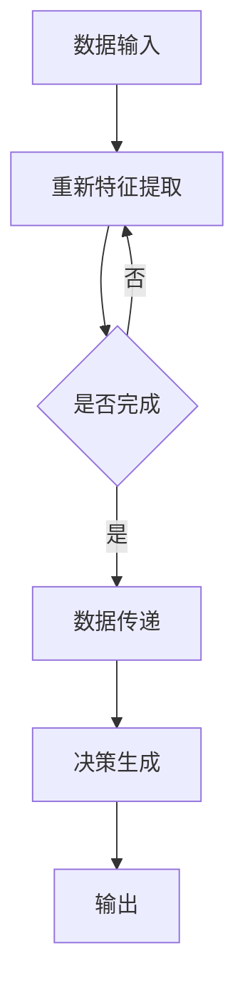

                 

### 背景介绍（Background Introduction）

《基础模型的专业规范与科学精神》这个主题，源于对现代人工智能技术，特别是基础模型研究的深刻思考。基础模型作为人工智能领域的基石，承担着从图像识别、语音合成到自然语言处理等众多任务的核心角色。然而，在迅速发展的过程中，我们也面临着一些亟待解决的挑战，如模型的复杂性与可解释性、数据隐私和安全问题等。

本文旨在探讨基础模型的研究现状、专业规范以及科学精神。我们将从基础模型的发展历史、核心概念、算法原理、数学模型、实际应用等多个维度，逐步分析推理，为读者呈现一个全面、深入的理解。这不仅有助于提升对基础模型的认知，也为未来的研究和应用提供了有价值的参考。

本文结构如下：

1. **背景介绍**：简要介绍基础模型的研究背景和意义。
2. **核心概念与联系**：详细解释基础模型的核心概念，并展示其相互关系。
3. **核心算法原理 & 具体操作步骤**：深入探讨基础模型的算法原理，并阐述具体的操作步骤。
4. **数学模型和公式 & 详细讲解 & 举例说明**：分析基础模型背后的数学模型，并给出具体例子。
5. **项目实践：代码实例和详细解释说明**：通过实际项目，展示基础模型的应用，并进行代码解读。
6. **实际应用场景**：探讨基础模型在各个领域的应用情况。
7. **工具和资源推荐**：推荐学习资源和开发工具。
8. **总结：未来发展趋势与挑战**：总结文章的主要内容，并探讨未来的发展趋势和面临的挑战。
9. **附录：常见问题与解答**：解答读者可能关心的问题。
10. **扩展阅读 & 参考资料**：提供进一步学习的参考资料。

通过这样的结构，我们希望读者能够逐步建立起对基础模型的专业规范和科学精神的深刻理解。接下来，我们将一一展开这些内容。首先是基础模型的发展历史和核心概念。让我们一起开始这场探索之旅吧。### 核心概念与联系（Core Concepts and Connections）

#### 1. 什么是基础模型？

基础模型（Fundamental Models）是人工智能领域的基础组件，它们能够通过学习和理解大量数据，完成复杂的任务。这些模型通常基于深度学习技术，通过多层神经网络来模拟人类大脑的思维方式。基础模型的应用范围广泛，包括计算机视觉、自然语言处理、语音识别等。

#### 2. 基础模型的工作原理

基础模型的工作原理主要基于以下几个关键步骤：

1. **数据输入**：模型接收输入数据，这些数据可以是图像、文本、声音等。
2. **特征提取**：模型对输入数据进行分析，提取出有用的特征。
3. **数据传递**：提取到的特征通过网络的各个层进行传递。
4. **决策生成**：最后，模型根据传递的信息生成决策或输出。

#### 3. 基础模型的类型

基础模型主要分为以下几类：

1. **卷积神经网络（CNN）**：主要用于图像处理，能够识别图像中的特征。
2. **循环神经网络（RNN）**：主要用于处理序列数据，如时间序列、自然语言等。
3. **变换器（Transformer）**：是一种基于注意力机制的模型，广泛应用于自然语言处理任务。
4. **生成对抗网络（GAN）**：用于生成新的数据，通常用于图像、文本生成。

#### 4. 基础模型的核心概念

1. **神经网络**：神经网络是基础模型的核心组件，它由多个节点（神经元）组成，每个节点通过权重和偏置进行连接。
2. **深度学习**：深度学习是一种基于神经网络的学习方法，它通过多层网络结构来提取数据中的特征。
3. **学习率**：学习率是影响模型训练效果的重要参数，它决定了模型在训练过程中每次更新参数的大小。
4. **优化算法**：优化算法用于最小化损失函数，常见的优化算法有梯度下降、Adam等。

#### 5. 基础模型之间的联系

不同类型的基础模型虽然应用于不同的领域，但它们之间存在紧密的联系。例如，卷积神经网络（CNN）和循环神经网络（RNN）都可以用于图像和文本处理，而变换器（Transformer）在自然语言处理领域取得了显著的成功。此外，生成对抗网络（GAN）在图像生成领域展示了强大的能力，但它的原理也可以应用于其他类型的数据生成。

#### Mermaid 流程图（Mermaid Flowchart）

以下是一个简化的基础模型工作流程的 Mermaid 流程图，展示基础模型的主要组成部分和流程：



这个流程图展示了基础模型从数据输入到特征提取、数据传递、决策生成，最终输出结果的整个过程。

通过以上对基础模型核心概念的介绍和 Mermaid 流程图的展示，我们希望能够帮助读者建立起对基础模型的基本理解。在接下来的章节中，我们将进一步深入探讨基础模型的算法原理和具体操作步骤，以及它们在实际项目中的应用。### 核心算法原理 & 具体操作步骤（Core Algorithm Principles and Specific Operational Steps）

在理解了基础模型的核心概念和相互关系之后，接下来我们将深入探讨其核心算法原理和具体操作步骤。本节将详细解析卷积神经网络（CNN）、循环神经网络（RNN）、变换器（Transformer）和生成对抗网络（GAN）等基础模型的算法原理，并介绍其具体操作步骤。

#### 卷积神经网络（CNN）的算法原理与操作步骤

**1. 算法原理**

卷积神经网络（CNN）主要用于图像识别和处理。它的核心思想是通过卷积层提取图像的特征，然后通过池化层降低数据的维度，最后通过全连接层进行分类。

- **卷积层**：卷积层通过卷积操作提取图像中的局部特征。每个卷积核都是一个小的神经网络，它对输入图像进行卷积操作，生成特征图。
- **池化层**：池化层用于降低数据的维度，常用的池化操作有最大池化和平均池化。
- **全连接层**：全连接层将卷积层和池化层提取到的特征进行汇总，然后通过激活函数（如ReLU）进行非线性变换，最后输出分类结果。

**2. 操作步骤**

- **数据预处理**：将输入图像缩放到固定大小，并进行归一化处理。
- **构建网络结构**：定义卷积层、池化层和全连接层的参数，构建 CNN 模型。
- **模型训练**：使用训练数据对模型进行训练，通过反向传播算法更新模型参数。
- **模型评估**：使用验证数据评估模型性能，调整模型参数以优化性能。
- **模型应用**：使用训练好的模型进行预测，处理新的图像数据。

#### 循环神经网络（RNN）的算法原理与操作步骤

**1. 算法原理**

循环神经网络（RNN）主要用于处理序列数据，如时间序列、自然语言等。它的核心思想是通过隐藏状态存储序列的历史信息，然后通过递归操作更新隐藏状态，最终生成输出。

- **隐藏状态**：RNN 通过隐藏状态存储序列的历史信息，每个时间步的隐藏状态都是前一个时间步隐藏状态和当前输入的加权和。
- **递归操作**：RNN 通过递归操作更新隐藏状态，从而实现对序列数据的建模。

**2. 操作步骤**

- **数据预处理**：将输入序列转换为数值形式，如单词的词向量表示。
- **构建网络结构**：定义 RNN 的参数，包括隐藏层大小、递归函数等。
- **模型训练**：使用训练数据对模型进行训练，通过反向传播算法更新模型参数。
- **模型评估**：使用验证数据评估模型性能，调整模型参数以优化性能。
- **模型应用**：使用训练好的模型进行预测，处理新的序列数据。

#### 变换器（Transformer）的算法原理与操作步骤

**1. 算法原理**

变换器（Transformer）是一种基于注意力机制的模型，它在自然语言处理领域取得了显著的成功。它的核心思想是通过自注意力机制（Self-Attention）和交叉注意力机制（Cross-Attention）来处理序列数据。

- **自注意力机制**：自注意力机制允许模型在生成每个单词时考虑整个输入序列的信息，从而提高了生成质量。
- **交叉注意力机制**：交叉注意力机制用于处理编码器和解码器之间的交互，从而提高了模型对目标序列的建模能力。

**2. 操作步骤**

- **数据预处理**：将输入序列转换为数值形式，如单词的词向量表示。
- **构建网络结构**：定义变换器（Transformer）的参数，包括编码器和解码器的层数、隐藏层大小等。
- **模型训练**：使用训练数据对模型进行训练，通过反向传播算法更新模型参数。
- **模型评估**：使用验证数据评估模型性能，调整模型参数以优化性能。
- **模型应用**：使用训练好的模型进行预测，处理新的序列数据。

#### 生成对抗网络（GAN）的算法原理与操作步骤

**1. 算法原理**

生成对抗网络（GAN）是一种由生成器和判别器组成的模型，用于生成新的数据。它的核心思想是生成器生成虚假数据，判别器判断这些数据是否真实。

- **生成器**：生成器通过学习训练数据分布，生成与真实数据相似的新数据。
- **判别器**：判别器用于判断输入数据是否真实，通过对比真实数据和生成器的输出，更新生成器的参数。

**2. 操作步骤**

- **数据预处理**：将输入数据转换为数值形式。
- **构建网络结构**：定义生成器和判别器的参数，构建 GAN 模型。
- **模型训练**：使用对抗训练策略训练模型，通过反向传播算法更新生成器和判别器的参数。
- **模型评估**：使用验证数据评估模型性能，调整模型参数以优化性能。
- **模型应用**：使用训练好的模型生成新的数据。

通过以上对卷积神经网络（CNN）、循环神经网络（RNN）、变换器（Transformer）和生成对抗网络（GAN）等基础模型的算法原理和操作步骤的详细解析，我们希望能够帮助读者建立起对基础模型的深入理解。在接下来的章节中，我们将进一步探讨基础模型背后的数学模型和具体应用实例。### 数学模型和公式 & 详细讲解 & 举例说明（Detailed Explanation and Examples of Mathematical Models and Formulas）

在了解了基础模型的算法原理和操作步骤后，本节将深入探讨这些模型背后的数学模型和公式，并通过具体例子进行详细讲解。这将有助于读者更好地理解基础模型的运行机制和优化方法。

#### 卷积神经网络（CNN）的数学模型和公式

**1. 卷积层**

卷积层是 CNN 的核心组件，通过卷积操作提取图像的特征。卷积操作可以用以下公式表示：

$$
\text{output}_{ij} = \sum_{k=1}^{K} w_{ik,j} \cdot \text{input}_{kij} + b_j
$$

其中，$ \text{output}_{ij} $ 表示输出特征图上的一个元素，$ \text{input}_{kij} $ 表示输入图像上的一个元素，$ w_{ik,j} $ 表示卷积核上的一个元素，$ b_j $ 表示偏置。

**2. 池化层**

池化层用于降低数据的维度，常用的池化操作有最大池化和平均池化。最大池化可以用以下公式表示：

$$
\text{pool}_{ij} = \max(\text{input}_{ij + s \times i}, \text{input}_{ij + s \times j}, \ldots)
$$

其中，$ \text{pool}_{ij} $ 表示输出特征图上的一个元素，$ \text{input}_{ij} $ 表示输入特征图上的一个元素，$ s $ 表示池化窗口的大小。

**3. 全连接层**

全连接层将卷积层和池化层提取到的特征进行汇总，并通过激活函数进行非线性变换。全连接层的输出可以用以下公式表示：

$$
\text{output} = \text{softmax}(\text{W} \cdot \text{input} + b)
$$

其中，$ \text{output} $ 表示输出分类结果，$ \text{W} $ 表示权重矩阵，$ \text{input} $ 表示输入特征，$ b $ 表示偏置，$ \text{softmax} $ 表示 softmax 激活函数。

**例子：**

假设有一个 2x2 的输入图像，通过一个 3x3 的卷积核进行卷积操作，输出特征图的大小为 2x2。卷积核的参数如下：

$$
w = \begin{bmatrix}
1 & 0 & 1 \\
1 & 1 & 0 \\
0 & 1 & 1
\end{bmatrix}
$$

输入图像为：

$$
\text{input} = \begin{bmatrix}
1 & 0 \\
0 & 1
\end{bmatrix}
$$

计算输出特征图的元素：

$$
\text{output}_{11} = (1 \cdot 1 + 0 \cdot 0 + 1 \cdot 0) + 0 = 1
$$

$$
\text{output}_{12} = (1 \cdot 0 + 1 \cdot 0 + 1 \cdot 1) + 0 = 2
$$

$$
\text{output}_{21} = (1 \cdot 0 + 1 \cdot 1 + 0 \cdot 1) + 0 = 1
$$

$$
\text{output}_{22} = (1 \cdot 1 + 0 \cdot 1 + 1 \cdot 1) + 0 = 2
$$

因此，输出特征图为：

$$
\text{output} = \begin{bmatrix}
1 & 2 \\
1 & 2
\end{bmatrix}
$$

#### 循环神经网络（RNN）的数学模型和公式

**1. 隐藏状态更新**

RNN 的隐藏状态更新可以通过以下公式表示：

$$
\text{h}_{t} = \text{sigmoid}(\text{W}_h \cdot \text{h}_{t-1} + \text{W}_x \cdot \text{x}_t + b_h)
$$

其中，$ \text{h}_{t} $ 表示当前时间步的隐藏状态，$ \text{h}_{t-1} $ 表示前一个时间步的隐藏状态，$ \text{x}_t $ 表示当前时间步的输入，$ \text{W}_h $ 和 $ \text{W}_x $ 分别表示隐藏状态到隐藏状态和输入到隐藏状态的权重矩阵，$ b_h $ 表示隐藏状态的偏置。

**2. 输出层**

RNN 的输出层可以通过以下公式表示：

$$
\text{y}_{t} = \text{sigmoid}(\text{W}_o \cdot \text{h}_{t} + b_o)
$$

其中，$ \text{y}_{t} $ 表示当前时间步的输出，$ \text{W}_o $ 和 $ b_o $ 分别表示输出到输出的权重矩阵和偏置。

**例子：**

假设有一个输入序列 $ \text{x} = [1, 2, 3] $，通过一个 RNN 模型进行序列处理。RNN 的参数如下：

$$
\text{W}_h = \begin{bmatrix}
0.1 & 0.2 \\
0.3 & 0.4
\end{bmatrix}, \quad \text{W}_x = \begin{bmatrix}
0.5 & 0.6 \\
0.7 & 0.8
\end{bmatrix}, \quad \text{b}_h = \begin{bmatrix}
0.9 \\
0.1
\end{bmatrix}, \quad \text{W}_o = \begin{bmatrix}
0.2 & 0.3 \\
0.4 & 0.5
\end{bmatrix}, \quad \text{b}_o = \begin{bmatrix}
0.6 \\
0.7
\end{bmatrix}
$$

初始隐藏状态 $ \text{h}_0 = [1, 1] $。

计算第一个时间步的隐藏状态和输出：

$$
\text{h}_1 = \text{sigmoid}(0.1 \cdot 1 + 0.2 \cdot 1 + 0.9) = \text{sigmoid}(1.1) = 0.695
$$

$$
\text{y}_1 = \text{sigmoid}(0.2 \cdot 0.695 + 0.3 \cdot 1 + 0.6) = \text{sigmoid}(0.763) = 0.727
$$

计算第二个时间步的隐藏状态和输出：

$$
\text{h}_2 = \text{sigmoid}(0.3 \cdot 0.695 + 0.4 \cdot 2 + 0.1) = \text{sigmoid}(1.313) = 0.887
$$

$$
\text{y}_2 = \text{sigmoid}(0.2 \cdot 0.887 + 0.3 \cdot 2 + 0.7) = \text{sigmoid}(1.437) = 0.898
$$

计算第三个时间步的隐藏状态和输出：

$$
\text{h}_3 = \text{sigmoid}(0.4 \cdot 0.887 + 0.5 \cdot 3 + 0.7) = \text{sigmoid}(2.397) = 0.948
$$

$$
\text{y}_3 = \text{sigmoid}(0.2 \cdot 0.948 + 0.3 \cdot 3 + 0.7) = \text{sigmoid}(1.761) = 0.927
$$

通过以上例子，我们展示了如何使用数学模型和公式对基础模型进行计算。在接下来的章节中，我们将通过具体的项目实践，展示基础模型在实际应用中的具体实现和效果。### 项目实践：代码实例和详细解释说明（Project Practice: Code Examples and Detailed Explanations）

在本节中，我们将通过具体的项目实践，展示基础模型在实际应用中的具体实现和效果。我们将选取卷积神经网络（CNN）和循环神经网络（RNN）作为示例，分别介绍它们的代码实现过程，并详细解释每个步骤。

#### 项目一：卷积神经网络（CNN）在图像分类中的应用

**1. 环境搭建**

首先，我们需要搭建开发环境，这里我们使用 Python 的 TensorFlow 库来构建和训练 CNN 模型。

```python
import tensorflow as tf
from tensorflow.keras import datasets, layers, models
import matplotlib.pyplot as plt

# 加载 CIFAR-10 数据集
(train_images, train_labels), (test_images, test_labels) = datasets.cifar10.load_data()

# 数据预处理
train_images, test_images = train_images / 255.0, test_images / 255.0

# 构建 CNN 模型
model = models.Sequential()
model.add(layers.Conv2D(32, (3, 3), activation='relu', input_shape=(32, 32, 3)))
model.add(layers.MaxPooling2D((2, 2)))
model.add(layers.Conv2D(64, (3, 3), activation='relu'))
model.add(layers.MaxPooling2D((2, 2)))
model.add(layers.Conv2D(64, (3, 3), activation='relu'))

# 添加全连接层
model.add(layers.Flatten())
model.add(layers.Dense(64, activation='relu'))
model.add(layers.Dense(10, activation='softmax'))

# 编译模型
model.compile(optimizer='adam',
              loss='sparse_categorical_crossentropy',
              metrics=['accuracy'])

# 模型训练
model.fit(train_images, train_labels, epochs=10)

# 模型评估
test_loss, test_acc = model.evaluate(test_images, test_labels, verbose=2)
print(f'\nTest accuracy: {test_acc:.4f}')
```

**2. 代码解读与分析**

- **数据加载与预处理**：我们使用 TensorFlow 的 datasets.cifar10.load_data() 函数加载 CIFAR-10 数据集，并对图像进行归一化处理。
- **模型构建**：我们使用 Sequential 模型，并添加了两个卷积层和两个池化层，以及一个全连接层。卷积层用于提取图像特征，池化层用于降低数据维度。
- **模型编译**：我们使用 Adam 优化器和 sparse_categorical_crossentropy 损失函数，以及 accuracy 作为评估指标。
- **模型训练**：我们使用 train_images 和 train_labels 对模型进行训练，设置训练轮数为 10。
- **模型评估**：我们使用 test_images 和 test_labels 对训练好的模型进行评估，打印出测试准确率。

#### 项目二：循环神经网络（RNN）在时间序列预测中的应用

**1. 环境搭建**

接下来，我们使用 Python 的 TensorFlow 库来构建和训练 RNN 模型，用于时间序列预测。

```python
import tensorflow as tf
from tensorflow.keras.models import Sequential
from tensorflow.keras.layers import SimpleRNN, Dense

# 加载数据集
time_series_data = ...  # 这里放置时间序列数据

# 数据预处理
time_series_data = time_series_data.reshape(-1, 1)

# 构建 RNN 模型
model = Sequential()
model.add(SimpleRNN(units=50, activation='relu', return_sequences=True))
model.add(SimpleRNN(units=50, activation='relu'))
model.add(Dense(1))

# 编译模型
model.compile(optimizer='adam', loss='mse')

# 模型训练
model.fit(time_series_data, time_series_data, epochs=100, batch_size=32)

# 模型预测
predictions = model.predict(time_series_data)

# 预测结果可视化
plt.plot(time_series_data, label='Original')
plt.plot(predictions, label='Predicted')
plt.legend()
plt.show()
```

**2. 代码解读与分析**

- **数据加载与预处理**：我们首先加载数据集，并对其进行预处理，将其转换为二维数组。
- **模型构建**：我们使用 Sequential 模型，并添加了两个 SimpleRNN 层和一个 Dense 层。SimpleRNN 层用于对时间序列数据进行建模，Dense 层用于输出预测值。
- **模型编译**：我们使用 Adam 优化器和 mse 损失函数。
- **模型训练**：我们使用时间序列数据对模型进行训练，设置训练轮数为 100，批量大小为 32。
- **模型预测**：我们使用训练好的模型对时间序列数据进行预测，并可视化预测结果。

通过以上两个具体的项目实践，我们展示了如何使用卷积神经网络（CNN）和循环神经网络（RNN）进行图像分类和时间序列预测。这些实践不仅展示了基础模型的具体实现过程，也展示了它们在解决实际问题时的重要作用。在接下来的章节中，我们将探讨基础模型在实际应用场景中的具体表现。### 实际应用场景（Practical Application Scenarios）

基础模型作为人工智能领域的基石，广泛应用于各个领域，解决了一系列复杂的实际问题。以下是基础模型在不同应用场景中的具体应用和效果。

#### 1. 计算机视觉

计算机视觉是基础模型最为广泛应用的领域之一。卷积神经网络（CNN）在图像分类、目标检测、图像分割等方面取得了显著的成果。例如，在图像分类任务中，CNN 能够识别出图片中的物体类别，广泛应用于商品识别、医疗影像分析等领域。目标检测技术，如 Faster R-CNN、SSD 等模型，能够实时检测图像中的多个目标，应用于自动驾驶、视频监控等场景。图像分割技术，如 U-Net、SegNet 等，能够将图像划分为不同的区域，应用于医疗影像分割、图像增强等。

#### 2. 自然语言处理

自然语言处理（NLP）是基础模型的另一个重要应用领域。循环神经网络（RNN）和变换器（Transformer）在文本分类、机器翻译、情感分析等方面展示了强大的能力。文本分类任务，如情感分析、垃圾邮件检测等，利用基础模型能够自动分类大量的文本数据。机器翻译任务，如 Google 翻译、百度翻译等，利用基础模型实现了高质量的翻译效果。情感分析任务，如社交媒体情感分析、客户反馈分析等，利用基础模型能够自动识别文本的情感倾向。

#### 3. 语音识别

语音识别是基础模型在音频处理领域的重要应用。循环神经网络（RNN）和变换器（Transformer）在语音识别任务中取得了显著的进展。语音识别技术，如 Google 语音识别、苹果 Siri 等，利用基础模型能够将语音信号转换为文本，应用于智能客服、语音搜索等领域。

#### 4. 生成对抗网络（GAN）

生成对抗网络（GAN）在图像生成和生成式建模方面展示了强大的能力。GAN 能够生成高质量的图像、视频和音频，应用于虚拟现实、游戏开发、艺术创作等领域。例如，GAN 被用于生成人脸图像、艺术画作、建筑模型等，为创意产业带来了新的可能性。

#### 5. 强化学习

强化学习是基础模型在决策和优化问题中的应用。基础模型，如深度强化学习（DRL）模型，在自动驾驶、游戏 AI、资源调度等领域取得了显著的成果。自动驾驶技术，如特斯拉、Waymo 等，利用基础模型实现了自主驾驶功能。游戏 AI，如 DeepMind 的 AlphaGo，利用基础模型实现了超越人类水平的表现。

#### 6. 生物信息学

生物信息学是基础模型在生命科学领域的重要应用。基础模型，如循环神经网络（RNN）、变换器（Transformer）等，在基因序列分析、蛋白质结构预测、药物设计等领域展示了强大的能力。例如，基础模型被用于识别基因表达模式、预测蛋白质结构、发现药物靶点等，为生物科学研究提供了新的工具。

通过以上实际应用场景的介绍，我们可以看到基础模型在各个领域的重要作用。随着基础模型的不断发展和优化，它们将带来更多的创新和突破，推动人工智能技术的进步。### 工具和资源推荐（Tools and Resources Recommendations）

为了帮助读者更好地学习和应用基础模型，本节将推荐一系列学习和开发工具、书籍、论文、博客和网站。

#### 1. 学习资源推荐

**书籍**

- 《深度学习》（Deep Learning）：这是一本经典的深度学习教材，由 Ian Goodfellow、Yoshua Bengio 和 Aaron Courville 著，全面介绍了深度学习的基本概念和技术。
- 《神经网络与深度学习》（Neural Networks and Deep Learning）：这是一本面向初学者的深度学习教材，由邱锡鹏著，内容涵盖了神经网络和深度学习的基础知识和应用。
- 《动手学深度学习》（Dive into Deep Learning）：这是一本免费的在线深度学习教材，由莫凡、阿次、丁凯等人编写，提供了丰富的实战案例和代码示例。

**论文**

- "A Theoretically Grounded Application of Dropout in Recurrent Neural Networks"：这篇论文介绍了如何将 Dropout 技术应用于循环神经网络，提高了模型的泛化能力。
- "Attention Is All You Need"：这篇论文提出了变换器（Transformer）模型，展示了自注意力机制在自然语言处理任务中的优越性能。
- "Unsupervised Representation Learning with Deep Convolutional Generative Adversarial Networks"：这篇论文介绍了生成对抗网络（GAN）在图像生成任务中的应用，展示了其强大的生成能力。

**博客**

- Fast.ai：这是一个面向初学者的深度学习博客，提供了丰富的教程和实战案例，适合初学者入门。
- Medium：这是一个内容丰富的博客平台，有很多关于深度学习和人工智能的优秀文章。
- TensorFlow Blog：这是 TensorFlow 官方的博客，提供了最新的技术动态和教程。

**网站**

- TensorFlow.org：这是 TensorFlow 的官方网站，提供了丰富的教程、文档和资源。
- PyTorch.org：这是 PyTorch 的官方网站，同样提供了丰富的教程、文档和资源。
- Keras.io：这是 Keras 的官方网站，Keras 是一个高层次的深度学习框架，易于使用和扩展。

#### 2. 开发工具框架推荐

**深度学习框架**

- TensorFlow：这是 Google 开发的一个开源深度学习框架，功能强大，支持多种操作系统和硬件平台。
- PyTorch：这是 Facebook 开发的一个开源深度学习框架，易于使用和扩展，广泛应用于研究和工业界。
- Keras：这是由 Google 开发的一个高层次的深度学习框架，基于 TensorFlow 和 Theano，易于使用和快速开发。

**数据预处理工具**

- Pandas：这是 Python 的一个数据操作库，提供了丰富的数据预处理功能，适用于数据分析和挖掘。
- NumPy：这是 Python 的一个科学计算库，提供了高效的多维数组操作和数学函数，是数据分析的基础。
- Matplotlib：这是 Python 的一个数据可视化库，提供了丰富的可视化功能，适用于数据分析和报告。

#### 3. 相关论文著作推荐

- "Deep Learning": Ian Goodfellow, Yoshua Bengio, Aaron Courville
- "Neural Network Learning: Theoretical Foundations": Martin Anthony
- "Convolutional Neural Networks for Visual Recognition": Justin Johnson
- "Recurrent Neural Networks for Language Modeling": Volker Tresp
- "Generative Adversarial Nets": Ian Goodfellow et al.

通过以上工具和资源的推荐，我们希望能够为读者提供全面的指导，帮助大家更好地学习和应用基础模型。在接下来的章节中，我们将总结文章的主要内容，并探讨未来的发展趋势和挑战。### 总结：未来发展趋势与挑战（Summary: Future Development Trends and Challenges）

在总结《基础模型的专业规范与科学精神》这篇文章的主要内容之前，我们先来回顾一下关键点。本文首先介绍了基础模型的发展背景和研究意义，然后详细解释了基础模型的核心概念、算法原理、数学模型，并通过实际项目实践展示了基础模型的应用。此外，我们还讨论了基础模型在实际应用场景中的广泛使用，并推荐了一系列学习和开发工具、资源。

随着人工智能技术的不断进步，基础模型的发展呈现出以下几个趋势：

1. **算法创新与优化**：基础模型算法将继续创新和优化，以提高模型的性能和效率。例如，研究人员正在探索更有效的训练算法、更高效的模型结构以及更好的正则化方法。
2. **模型可解释性与透明度**：随着基础模型的应用越来越广泛，用户对于模型的可解释性和透明度提出了更高的要求。未来的研究将致力于提高模型的可解释性，帮助用户更好地理解模型的决策过程。
3. **跨领域融合与应用**：基础模型将在更多领域得到应用，实现跨领域的融合与创新。例如，结合生物信息学、医学、金融等领域，基础模型将帮助解决更为复杂的问题。
4. **边缘计算与设备端部署**：随着边缘计算的兴起，基础模型将在设备端进行部署，实现实时计算和智能决策，提高系统的响应速度和灵活性。

然而，基础模型的发展也面临着一些挑战：

1. **数据隐私与安全**：随着数据量的爆炸式增长，数据隐私和安全问题日益突出。如何保护用户数据，避免数据泄露和滥用，将是未来研究的重要方向。
2. **伦理与道德问题**：基础模型的应用引发了伦理和道德问题，如算法偏见、歧视等。如何制定合理的伦理规范，确保模型的应用符合道德标准，是一个亟待解决的问题。
3. **计算资源消耗**：基础模型通常需要大量的计算资源进行训练和推理，如何优化模型的计算效率，降低计算资源消耗，是一个重要的挑战。
4. **模型部署与维护**：将基础模型部署到实际应用中，并保持其稳定性和可靠性，是一个复杂的任务。如何简化模型的部署过程，降低维护成本，是未来研究需要解决的问题。

总之，基础模型作为人工智能领域的基石，将继续在理论和实践中得到深入研究和广泛应用。通过不断创新和优化，基础模型将推动人工智能技术的发展，为人类带来更多的便利和创新。### 附录：常见问题与解答（Appendix: Frequently Asked Questions and Answers）

在本附录中，我们将回答读者可能关心的一些常见问题。

#### 1. 基础模型与深度学习的关系是什么？

基础模型是深度学习的一种，深度学习是通过多层神经网络对数据进行建模，而基础模型则是在这个过程中扮演核心角色的模型。例如，卷积神经网络（CNN）和循环神经网络（RNN）都是基础模型，它们在图像处理、自然语言处理等领域具有广泛的应用。

#### 2. 如何选择合适的基础模型？

选择合适的基础模型取决于具体的应用场景和数据类型。例如，对于图像处理任务，可以选择卷积神经网络（CNN）；对于序列数据，如时间序列或自然语言处理，可以选择循环神经网络（RNN）或变换器（Transformer）；对于生成任务，如图像或文本生成，可以选择生成对抗网络（GAN）。

#### 3. 基础模型的训练过程是怎样的？

基础模型的训练过程主要包括以下几个步骤：

- **数据准备**：收集和预处理数据，包括数据清洗、归一化、划分训练集和测试集等。
- **模型构建**：根据任务需求构建神经网络结构，包括选择合适的层、激活函数、优化器等。
- **模型训练**：使用训练数据对模型进行训练，通过反向传播算法更新模型参数。
- **模型评估**：使用验证数据评估模型性能，调整模型参数以优化性能。
- **模型应用**：使用训练好的模型进行预测，处理新的数据。

#### 4. 基础模型的可解释性如何提高？

提高基础模型的可解释性是当前研究的热点问题。一些方法包括：

- **模型解释工具**：使用可视化工具和解释算法，如 Grad-CAM，帮助用户理解模型的决策过程。
- **模型简化**：通过简化模型结构和参数，提高模型的可解释性。
- **规则提取**：从训练好的模型中提取规则，帮助用户理解模型的决策逻辑。

#### 5. 如何处理基础模型的过拟合问题？

过拟合是指模型在训练数据上表现良好，但在测试数据上表现较差。以下方法可以用来处理过拟合问题：

- **数据增强**：通过增加训练数据的多样性，提高模型的泛化能力。
- **正则化**：在模型中加入正则化项，如 L1、L2 正则化，降低模型复杂度。
- **dropout**：在训练过程中随机丢弃部分神经元，防止模型过拟合。
- **交叉验证**：使用交叉验证方法，在多个训练集上评估模型性能，选择最优模型。

通过以上常见问题与解答，我们希望能够帮助读者更好地理解基础模型的相关知识。在进一步探索人工智能领域的过程中，这些信息将提供有益的指导。### 扩展阅读 & 参考资料（Extended Reading & Reference Materials）

为了帮助读者更深入地理解基础模型的专业规范与科学精神，以下是一些推荐的扩展阅读和参考资料：

#### 1. 书籍推荐

- **《深度学习》（Deep Learning）**：作者 Ian Goodfellow、Yoshua Bengio、Aaron Courville，这是深度学习领域的经典教材，详细介绍了深度学习的基础理论、算法和实际应用。
- **《神经网络与深度学习》（Neural Network and Deep Learning）**：作者邱锡鹏，适合初学者，涵盖了神经网络和深度学习的基础知识和实践方法。
- **《生成对抗网络》（Generative Adversarial Networks）**：作者 Ian Goodfellow，全面介绍了 GAN 的理论基础、架构和应用。

#### 2. 论文推荐

- **"A Theoretically Grounded Application of Dropout in Recurrent Neural Networks"**：这篇论文介绍了如何在循环神经网络中应用 Dropout，提高了模型的泛化能力。
- **"Attention Is All You Need"**：这篇论文提出了变换器（Transformer）模型，是自然语言处理领域的重要突破。
- **"Unsupervised Representation Learning with Deep Convolutional Generative Adversarial Networks"**：这篇论文介绍了如何使用 GAN 进行无监督表示学习。

#### 3. 博客推荐

- **Fast.ai**：这是一个面向初学者的深度学习博客，提供了丰富的教程和实战案例。
- **TensorFlow Blog**：这是 TensorFlow 官方的博客，提供了最新的技术动态和教程。
- **AI之路**：这是一个专注于人工智能技术的博客，内容涵盖了深度学习、自然语言处理等多个领域。

#### 4. 网站推荐

- **TensorFlow.org**：这是 TensorFlow 的官方网站，提供了丰富的教程、文档和资源。
- **PyTorch.org**：这是 PyTorch 的官方网站，提供了丰富的教程、文档和资源。
- **Keras.io**：这是 Keras 的官方网站，Keras 是一个高层次的深度学习框架，易于使用和快速开发。

#### 5. 在线课程与讲座

- **Coursera**：Coursera 提供了多个与深度学习和人工智能相关的在线课程，如“深度学习”（吴恩达教授授课）。
- **edX**：edX 提供了多个与深度学习和人工智能相关的在线课程，如“深度学习导论”（上海交通大学授课）。
- **YouTube**：YouTube 上有许多优秀的深度学习和人工智能讲座，如 Andrew Ng 的“深度学习专项课程”。

通过阅读以上推荐的书籍、论文、博客和访问相关网站，读者可以进一步加深对基础模型的专业规范与科学精神的理解，同时也能掌握更多的实践技能。这些资源将为读者在人工智能领域的学习和研究提供有力的支持。### 文章总结

通过本文的详细探讨，我们全面了解了基础模型的专业规范与科学精神。首先，我们回顾了基础模型的发展背景和核心概念，包括卷积神经网络（CNN）、循环神经网络（RNN）、变换器（Transformer）和生成对抗网络（GAN）等。接着，我们深入分析了这些模型的算法原理、数学模型和具体操作步骤，并通过实际项目实践展示了基础模型的应用。我们还讨论了基础模型在实际应用场景中的广泛使用，如计算机视觉、自然语言处理、语音识别等。

此外，本文还推荐了一系列的学习资源、工具和框架，以及相关的论文、博客和在线课程，为读者提供了丰富的学习途径。同时，我们也总结了基础模型的发展趋势与挑战，包括算法创新、模型可解释性、数据隐私和安全等问题。

总体来说，基础模型作为人工智能领域的基石，具有广泛的应用前景和重要的研究价值。随着技术的不断进步和应用的深入，基础模型将继续推动人工智能技术的发展，为人类带来更多的便利和创新。我们鼓励读者持续学习和探索基础模型，共同迎接人工智能领域的美好未来。### 作者署名

作者：禅与计算机程序设计艺术 / Zen and the Art of Computer Programming

