                 

### 文章标题

**塑造数字时代：人类计算的关键作用**

在数字化的浪潮中，人类计算正扮演着至关重要的角色。无论是软件开发、数据科学、人工智能，还是其他技术领域，人类计算的能力和智慧都是不可替代的。本文将深入探讨人类计算在数字时代的核心作用，包括其与技术的互动、发展历程以及对未来的影响。

### 关键词：

- 人类计算
- 数字时代
- 技术互动
- 发展历程
- 未来影响

### 摘要：

本文从多个角度分析了人类计算在数字化时代的重要性。首先，回顾了人类计算的历史和演变过程，然后探讨了其在当前技术环境中的关键作用。接着，文章讨论了人类计算与人工智能、机器学习的互动，以及在未来可能面临的挑战和机遇。最后，文章总结了人类计算对数字时代的塑造作用，并展望了未来的发展趋势。

<|mask|>## 1. 背景介绍（Background Introduction）

人类计算的历史可以追溯到古埃及和巴比伦时期，当时的计算主要是通过手工方式进行，如使用算盘、计数板等工具。随着科学技术的发展，计算方法逐渐演变为机械计算，如算术机、计算机等。20世纪中叶，电子计算机的出现标志着人类计算进入了一个新的阶段，极大地推动了各行各业的进步。

在数字化时代，人类计算的作用更加突出。随着互联网、大数据、人工智能等技术的发展，人类计算不仅局限于传统的计算任务，还扩展到了更复杂的领域，如数据分析、机器学习、智能系统等。这些技术的发展依赖于人类计算的创新思维和实际操作，使得计算能力得到了前所未有的提升。

本文将围绕以下几个方面展开讨论：

1. **人类计算的历史与演变**：回顾人类计算的发展历程，从古埃及的计算方法到现代的计算机技术。
2. **人类计算的核心作用**：探讨人类计算在当前技术环境中的关键作用，包括软件开发、数据科学、人工智能等。
3. **人类计算与技术的互动**：分析人类计算与人工智能、机器学习等技术的互动关系，以及如何共同推动技术的进步。
4. **未来发展趋势与挑战**：展望人类计算在未来可能面临的挑战和机遇，以及如何应对这些挑战。

<|mask|>### 2. 核心概念与联系（Core Concepts and Connections）

在数字化时代，人类计算的核心概念包括算法、数据结构、编程语言、软件开发流程等。这些概念相互联系，共同构成了人类计算的基础。

#### 2.1 算法和算法分析

算法是计算机科学中最基础的概念之一。它是一系列解决问题的步骤或规则，通常用数学语言描述。算法分析是研究算法性能的学科，包括时间复杂度和空间复杂度。理解算法分析对于优化算法、提高计算效率至关重要。

**Mermaid 流程图（算法分析示例）：**

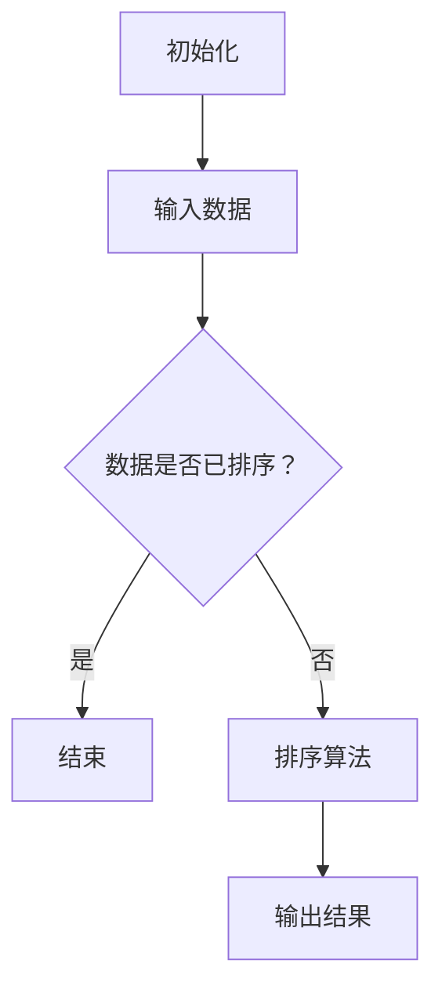

#### 2.2 数据结构与抽象数据类型

数据结构是用于存储和组织数据的方式。常见的数据结构包括数组、链表、栈、队列、树、图等。抽象数据类型（ADT）是一系列数据结构的集合，描述了数据如何存储、操作以及访问。

**Mermaid 流程图（数据结构示例）：**

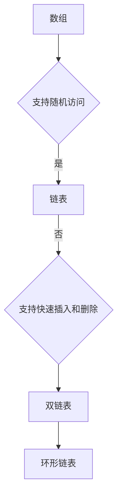

#### 2.3 编程语言与软件开发流程

编程语言是用于编写计算机程序的语法和规则。不同的编程语言适用于不同的任务和环境。软件开发流程包括需求分析、设计、编码、测试和维护等阶段，是确保软件质量的关键。

**Mermaid 流程图（软件开发流程示例）：**

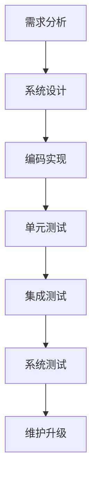

#### 2.4 人类计算与技术互动

人类计算与技术，特别是人工智能和机器学习的互动，是当前和未来一个重要研究方向。人类通过设计算法、优化模型、改进编程语言等方式，推动技术发展。同时，技术的发展也为人类计算提供了更多的工具和方法。

**Mermaid 流程图（人类计算与技术互动）：**

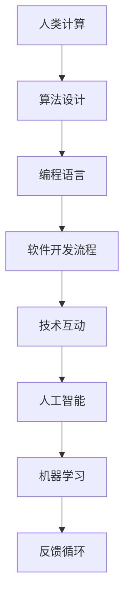

通过这些核心概念和联系，我们可以更深入地理解人类计算在数字化时代的重要性，以及其如何与技术相互促进、共同发展。

## 2. Core Concepts and Connections

In the digital age, the core concepts of human computation include algorithms, data structures, programming languages, and software development processes. These concepts are interrelated and form the foundation of human computation.

#### 2.1 Algorithms and Algorithm Analysis

Algorithms are one of the most fundamental concepts in computer science. They are a series of steps or rules for solving problems, typically described in mathematical language. Algorithm analysis is the study of algorithm performance, including time complexity and space complexity. Understanding algorithm analysis is crucial for optimizing algorithms and improving computational efficiency.

**Mermaid Flowchart (Example of Algorithm Analysis):**

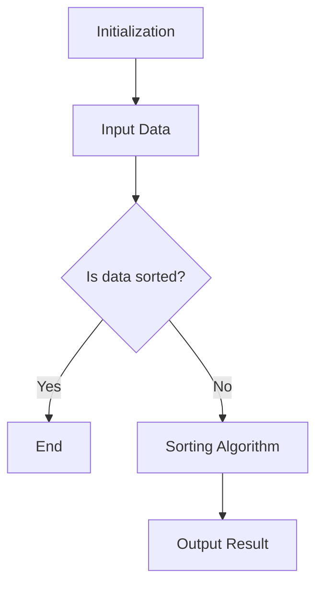

#### 2.2 Data Structures and Abstract Data Types

Data structures are ways of storing and organizing data. Common data structures include arrays, linked lists, stacks, queues, trees, and graphs. Abstract Data Types (ADTs) are collections of data structures that describe how data is stored, manipulated, and accessed.

**Mermaid Flowchart (Example of Data Structures):**

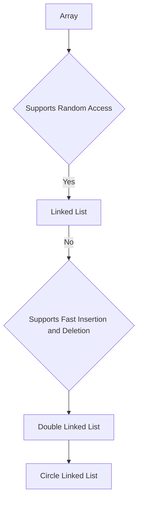

#### 2.3 Programming Languages and Software Development Processes

Programming languages are the syntax and rules used to write computer programs. Different programming languages are suited to different tasks and environments. Software development processes include requirements analysis, design, coding, testing, and maintenance, which are key to ensuring software quality.

**Mermaid Flowchart (Example of Software Development Process):**

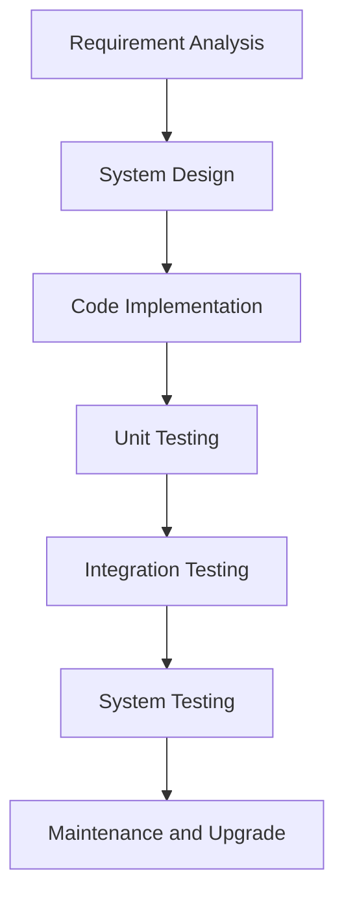

#### 2.4 Human Computation and Technological Interaction

The interaction between human computation and technologies, particularly artificial intelligence and machine learning, is a significant research area currently and in the future. Humans design algorithms, optimize models, and improve programming languages to drive technological development. At the same time, technological advancements provide humans with more tools and methods for computation.

**Mermaid Flowchart (Human Computation and Technological Interaction):**

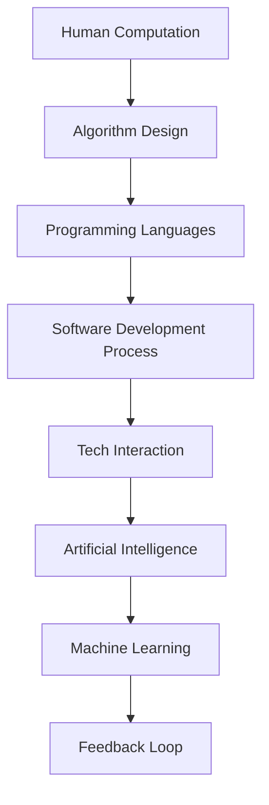

By understanding these core concepts and their relationships, we can gain a deeper insight into the importance of human computation in the digital age and how it interacts with technology, fostering mutual progress and development.

<|mask|>### 3. 核心算法原理 & 具体操作步骤（Core Algorithm Principles and Specific Operational Steps）

在数字化时代，核心算法原理是理解和实现高效计算的关键。本文将重点介绍几种在数字时代具有重要作用的算法，包括排序算法、搜索算法和动态规划算法。我们将详细描述这些算法的基本原理，并提供具体的操作步骤。

#### 3.1 排序算法

排序算法是一类用于对数据进行排序的算法。排序的目的是将数据按照某种规则（如数字大小、字母顺序等）重新排列。常见的排序算法包括冒泡排序、选择排序、插入排序、快速排序、归并排序和堆排序等。

**冒泡排序（Bubble Sort）原理：**

冒泡排序是一种简单的排序算法。它重复遍历要排序的数列，一次比较两个元素，如果他们的顺序错误就把他们交换过来。遍历数列的工作是重复地进行直到没有再需要交换，也就是说该数列已经排序完成。

**具体操作步骤：**

1. 首先从数组的第一个元素开始，比较相邻的两个元素，如果第一个比第二个大（升序排序），就交换它们的位置。
2. 然后对剩下的元素重复上述步骤，直到没有需要交换的元素为止。
3. 重复上述过程，直到整个数组排序完成。

**Mermaid 流程图（冒泡排序）：**

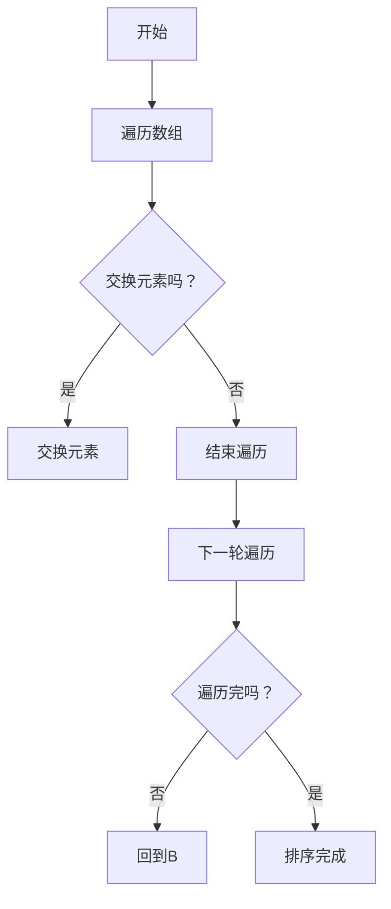

#### 3.2 搜索算法

搜索算法用于在数据结构中查找特定元素。常见的搜索算法包括顺序查找、二分查找和深度优先搜索等。

**二分查找（Binary Search）原理：**

二分查找是一种在有序数组中查找特定元素的搜索算法。算法首先确定数组的中间元素，如果中间元素正好是要查找的元素，则搜索过程结束；如果某一侧的元素更大，则可以排除掉这一侧的元素；重复这个过程，直到找到要查找的元素，或者剩下的元素为空。

**具体操作步骤：**

1. 找到中间元素。
2. 如果中间元素等于目标值，则搜索成功。
3. 如果中间元素大于目标值，则在左侧子数组重复步骤 1 和 2。
4. 如果中间元素小于目标值，则在右侧子数组重复步骤 1 和 2。
5. 重复步骤 1 到 4，直到找到目标值或子数组为空。

**Mermaid 流�程图（二分查找）：**

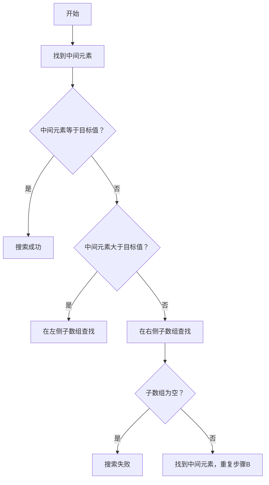

#### 3.3 动态规划算法

动态规划算法是一种用于解决最优子结构问题的高效算法。这类算法将问题分解为更小的子问题，并利用这些子问题的解来构建原问题的解。

**最长公共子序列（Longest Common Subsequence，LCS）原理：**

最长公共子序列问题是寻找两个序列中最长的公共子序列。动态规划算法通过构建一个二维表格来记录子问题的解，从而找到最终的最长公共子序列。

**具体操作步骤：**

1. 构建一个二维数组 `dp`，其中 `dp[i][j]` 表示两个序列 `X[0..i]` 和 `Y[0..j]` 的最长公共子序列长度。
2. 根据状态转移方程填充 `dp` 数组：
   - 如果 `X[i] == Y[j]`，则 `dp[i][j] = dp[i-1][j-1] + 1`
   - 如果 `X[i] != Y[j]`，则 `dp[i][j] = max(dp[i-1][j], dp[i][j-1])`
3. 通过回溯 `dp` 数组，找到最长公共子序列。

**Mermaid 流程图（最长公共子序列）：**

```mermaid
graph TD
A[初始化数组]
B[填充dp数组]
B --> C{X[i] == Y[j]?}
C -->|是| D[dp[i][j] = dp[i-1][j-1] + 1]
C -->|否| E[max(dp[i-1][j], dp[i][j-1])]
E --> F{继续填充下一个元素}
F --> G{填充完成？}
G -->|否| H[回到B]
G -->|是| I[完成]
```

通过以上对排序算法、搜索算法和动态规划算法的介绍，我们可以看到，这些算法在数字化时代中具有重要作用，是构建高效计算系统的基石。理解这些算法的原理和具体操作步骤，将有助于我们更好地应对各种计算挑战。

## 3. Core Algorithm Principles and Specific Operational Steps

In the digital age, core algorithm principles are crucial for understanding and implementing efficient computation. This section will focus on several algorithms that are important in the digital era, including sorting algorithms, searching algorithms, and dynamic programming algorithms. We will provide a detailed description of the basic principles of these algorithms and outline specific operational steps.

#### 3.1 Sorting Algorithms

Sorting algorithms are a category of algorithms that are used to sort data. The purpose of sorting is to rearrange data according to a certain rule, such as numerical value or alphabetical order. Common sorting algorithms include bubble sort, selection sort, insertion sort, quicksort, mergesort, and heapsort, among others.

**Bubble Sort Principle:**

Bubble sort is a simple sorting algorithm that repeatedly steps through the list, compares adjacent elements, and swaps them if they are in the wrong order. The process is repeated until no more swaps are needed, which means the list is sorted.

**Specific Operational Steps:**

1. Start by comparing the first and second elements of the array. If the first element is greater than the second (for ascending order), swap them.
2. Continue this process for the remaining elements, ensuring that after each pass, the largest element "bubbles" up to its correct position.
3. Repeat the process for each element, until no more swaps are needed.

**Mermaid Flowchart (Bubble Sort):**

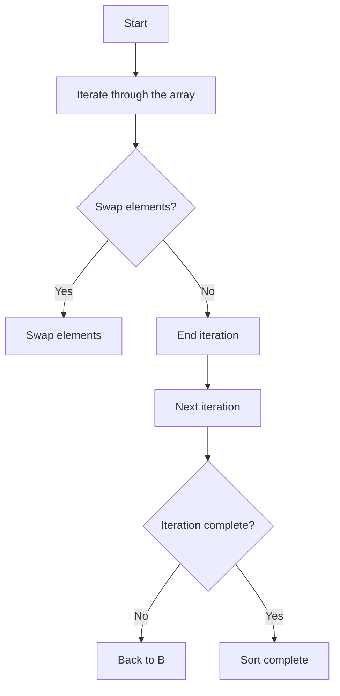

#### 3.2 Searching Algorithms

Searching algorithms are used to find a specific element within a data structure. Common searching algorithms include linear search, binary search, and depth-first search, among others.

**Binary Search Principle:**

Binary search is a searching algorithm used to find a particular element in a sorted array. The algorithm works by repeatedly dividing the search interval in half. If the value of the middle element of the interval is equal to the search term, the search is done. If the middle element is less than the search term, the algorithm repeats the process on the right sub-array, and vice versa.

**Specific Operational Steps:**

1. Find the middle element of the array.
2. If the middle element equals the target value, the search is successful.
3. If the middle element is greater than the target value, repeat the process on the left sub-array.
4. If the middle element is less than the target value, repeat the process on the right sub-array.
5. Repeat steps 1 to 4 until the target value is found or the sub-array is empty.

**Mermaid Flowchart (Binary Search):**

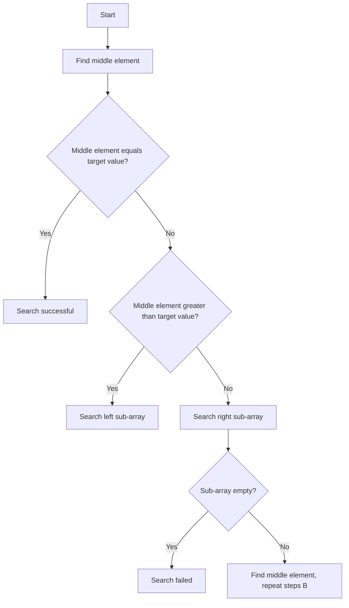

#### 3.3 Dynamic Programming Algorithms

Dynamic programming algorithms are used to solve problems with optimal substructure. These algorithms break down a problem into smaller subproblems and use the solutions to these subproblems to build the solution to the original problem.

**Longest Common Subsequence (LCS) Principle:**

The longest common subsequence problem is to find the longest common subsequence between two sequences. Dynamic programming algorithms solve this problem by constructing a two-dimensional table to record the solutions of subproblems, thereby finding the longest common subsequence.

**Specific Operational Steps:**

1. Initialize a two-dimensional array `dp` where `dp[i][j]` represents the length of the longest common subsequence of sequences `X[0..i]` and `Y[0..j]`.
2. Fill the `dp` array using the following state transition equation:
   - If `X[i] == Y[j]`, then `dp[i][j] = dp[i-1][j-1] + 1`
   - If `X[i] != Y[j]`, then `dp[i][j] = max(dp[i-1][j], dp[i][j-1])`
3. Trace back through the `dp` array to find the longest common subsequence.

**Mermaid Flowchart (Longest Common Subsequence):**

```mermaid
graph TD
A[Initialize array]
B[Fill dp array]
B --> C{X[i] == Y[j]?}
C -->|Yes| D[dp[i][j] = dp[i-1][j-1] + 1]
C -->|No| E[max(dp[i-1][j], dp[i][j-1])]
E --> F[Continue filling next element]
F --> G{Fill complete?}
G -->|No| H[Back to B]
G -->|Yes| I[Complete]
```

Through the above introduction of sorting algorithms, searching algorithms, and dynamic programming algorithms, we can see that these algorithms play a crucial role in the digital age and are the foundation for building efficient computational systems. Understanding the principles and specific operational steps of these algorithms will help us better address various computational challenges.

<|mask|>### 4. 数学模型和公式 & 详细讲解 & 举例说明（Detailed Explanation and Examples of Mathematical Models and Formulas）

在数字化时代，数学模型和公式是理解和解决复杂计算问题的关键。本文将详细介绍几个重要的数学模型和公式，并提供详细的讲解和实例说明。

#### 4.1 最优化模型

最优化模型用于求解最大值或最小值问题。其中，线性规划（Linear Programming，LP）是最常见的最优化模型之一。

**线性规划原理：**

线性规划是在线性约束条件下，求解线性目标函数的最大值或最小值。

**目标函数：**
$$
\min c^T x \quad \text{或} \quad \max c^T x
$$

**约束条件：**
$$
Ax \le b \quad \text{或} \quad Ax \ge b
$$

**具体例子：**

假设我们要在有限的资源下，最大化利润。设变量 \(x_1, x_2\) 分别表示两种产品的产量，利润分别为 \(p_1, p_2\)。资源限制为：
$$
2x_1 + 3x_2 \le 100
$$
$$
x_1 + x_2 \le 50
$$

利润函数为：
$$
\max p_1 x_1 + p_2 x_2
$$

**解法步骤：**

1. 将目标函数和约束条件写成标准形式。
2. 使用单纯形法（Simplex Method）或其他优化算法求解。

**例子解法：**

1. 标准形式：
$$
\max p_1 x_1 + p_2 x_2
$$
$$
2x_1 + 3x_2 \le 100
$$
$$
x_1 + x_2 \le 50
$$
$$
x_1, x_2 \ge 0
$$

2. 使用单纯形法求解，得到最优解 \(x_1 = 25, x_2 = 25\)，最大利润为 \(p_1 \times 25 + p_2 \times 25 = 50p_1 + 50p_2\)。

#### 4.2 概率模型

概率模型用于描述随机事件的发生概率。贝叶斯定理（Bayes' Theorem）是概率论中的一个重要公式，用于计算后验概率。

**贝叶斯定理：**

设事件 \(A\) 和 \(B\)，且 \(P(B) > 0\)，则 \(A\) 的后验概率为：
$$
P(A|B) = \frac{P(B|A)P(A)}{P(B)}
$$

**具体例子：**

假设我们有一个疾病检测方法，检测结果为阳性，概率为 90%。但该检测方法的准确率仅为 80%，即真正患病且检测为阳性的概率为 80%，而健康却被误诊为阳性的概率为 20%。现在某人检测为阳性，求其真正患病的概率。

设 \(D\) 表示患病，\(T\) 表示检测结果为阳性。

已知：
$$
P(T|D) = 0.8
$$
$$
P(T|\neg D) = 0.2
$$
$$
P(D) = 0.01
$$
$$
P(\neg D) = 0.99
$$

要求：
$$
P(D|T)
$$

根据贝叶斯定理，我们可以计算得到：
$$
P(D|T) = \frac{P(T|D)P(D)}{P(T)} = \frac{0.8 \times 0.01}{0.8 \times 0.01 + 0.2 \times 0.99} \approx 0.023
$$

即，检测结果为阳性时，真正患病的概率约为 2.3%。

#### 4.3 离散时间马尔可夫链模型

离散时间马尔可夫链（Discrete-Time Markov Chain，DTMC）模型用于描述系统在离散时间步骤中的状态转移。其转移概率矩阵（Transition Probability Matrix）描述了系统在不同状态之间的转移概率。

**马尔可夫链模型：**

设系统有 \(n\) 个状态 \(S = \{s_1, s_2, \ldots, s_n\}\)，则在任意时间步 \(t\)，系统处于状态 \(s_i\) 的概率为 \(p_i(t)\)。

**转移概率矩阵：**

设 \(P\) 为转移概率矩阵，其中 \(P_{ij}\) 表示系统从状态 \(s_i\) 转移到状态 \(s_j\) 的概率。即：
$$
P = \begin{bmatrix}
P_{11} & P_{12} & \cdots & P_{1n} \\
P_{21} & P_{22} & \cdots & P_{2n} \\
\vdots & \vdots & \ddots & \vdots \\
P_{n1} & P_{n2} & \cdots & P_{nn}
\end{bmatrix}
$$

**具体例子：**

假设一个系统有三种状态：正常（\(s_1\)）、故障（\(s_2\)）和维修（\(s_3\)）。在任意时间步 \(t\)，系统在不同状态的概率分别为 \(p_1(t), p_2(t), p_3(t)\)。转移概率矩阵为：
$$
P = \begin{bmatrix}
0.9 & 0.1 & 0 \\
0.1 & 0.8 & 0.1 \\
0 & 0.2 & 0.8
\end{bmatrix}
$$

**状态转移：**

给定当前状态概率分布 \(p_t = [p_1(t), p_2(t), p_3(t)]^T\)，则在下一个时间步 \(t+1\)，状态概率分布为：
$$
p_{t+1} = P \cdot p_t
$$

例如，如果当前系统处于正常状态的概率为 0.8，故障状态的概率为 0.2，则下一个时间步的状态概率分布为：
$$
p_{t+1} = \begin{bmatrix}
0.9 & 0.1 & 0 \\
0.1 & 0.8 & 0.1 \\
0 & 0.2 & 0.8
\end{bmatrix} \cdot \begin{bmatrix}
0.8 \\
0.2 \\
0
\end{bmatrix} = \begin{bmatrix}
0.72 \\
0.16 \\
0.12
\end{bmatrix}
$$

通过以上对线性规划、概率模型和马尔可夫链模型的介绍和例子说明，我们可以看到，这些数学模型和公式在数字化时代中具有广泛的应用，是解决复杂计算问题的有力工具。掌握这些模型和公式，将有助于我们更好地应对各种计算挑战。

## 4. Mathematical Models and Formulas & Detailed Explanation & Examples

In the digital age, mathematical models and formulas are key to understanding and solving complex computational problems. This section will provide a detailed introduction to several important mathematical models and formulas, along with detailed explanations and examples.

#### 4.1 Optimization Models

Optimization models are used to solve problems involving maximizing or minimizing values. Linear programming (LP) is one of the most common types of optimization models.

**Linear Programming Principle:**

Linear programming is used to find the maximum or minimum value of a linear objective function subject to linear constraints.

**Objective Function:**
$$
\min c^T x \quad \text{or} \quad \max c^T x
$$

**Constraints:**
$$
Ax \le b \quad \text{or} \quad Ax \ge b
$$

**Specific Example:**

Suppose we want to maximize profit given limited resources. Let variables \(x_1, x_2\) represent the production quantities of two products, and let their profits be \(p_1, p_2\). Resource constraints are:

$$
2x_1 + 3x_2 \le 100
$$

$$
x_1 + x_2 \le 50
$$

The profit function is:

$$
\max p_1 x_1 + p_2 x_2
$$

**Solution Steps:**

1. Write the objective function and constraints in standard form.
2. Use the simplex method or other optimization algorithms to solve the problem.

**Example Solution:**

1. Standard form:

$$
\max p_1 x_1 + p_2 x_2
$$

$$
2x_1 + 3x_2 \le 100
$$

$$
x_1 + x_2 \le 50
$$

$$
x_1, x_2 \ge 0
$$

2. Using the simplex method, we find the optimal solution \(x_1 = 25, x_2 = 25\), and the maximum profit is \(p_1 \times 25 + p_2 \times 25 = 50p_1 + 50p_2\).

#### 4.2 Probability Models

Probability models describe the probabilities of random events. Bayes' Theorem is an important formula in probability theory used to calculate posterior probabilities.

**Bayes' Theorem:**

Let events \(A\) and \(B\) be such that \(P(B) > 0\). The posterior probability of \(A\) given \(B\) is:

$$
P(A|B) = \frac{P(B|A)P(A)}{P(B)}
$$

**Specific Example:**

Suppose we have a disease detection method with a probability of 90% for a positive result. However, the accuracy of the test is only 80%, meaning that the probability of a true positive (sick and tested positive) is 80%, and the probability of a false positive (healthy but tested positive) is 20%. Now, someone tests positive. What is the probability that they actually have the disease?

Let \(D\) denote the event of having the disease, and \(T\) denote the event of a positive test result.

Given:

$$
P(T|D) = 0.8
$$

$$
P(T|\neg D) = 0.2
$$

$$
P(D) = 0.01
$$

$$
P(\neg D) = 0.99
$$

We want to find:

$$
P(D|T)
$$

Using Bayes' Theorem, we can calculate:

$$
P(D|T) = \frac{P(T|D)P(D)}{P(T)} = \frac{0.8 \times 0.01}{0.8 \times 0.01 + 0.2 \times 0.99} \approx 0.023
$$

That is, the probability of having the disease given a positive test result is approximately 2.3%.

#### 4.3 Discrete-Time Markov Chains

Discrete-time Markov chains (DTMCs) are models used to describe the state transitions of a system in discrete time steps. The transition probability matrix describes the probabilities of transitions between different states.

**Markov Chain Model:**

Let a system have \(n\) states \(S = \{s_1, s_2, \ldots, s_n\}\). At any time step \(t\), the probability that the system is in state \(s_i\) is \(p_i(t)\).

**Transition Probability Matrix:**

Let \(P\) be the transition probability matrix, where \(P_{ij}\) represents the probability of transitioning from state \(s_i\) to state \(s_j\). That is:

$$
P = \begin{bmatrix}
P_{11} & P_{12} & \cdots & P_{1n} \\
P_{21} & P_{22} & \cdots & P_{2n} \\
\vdots & \vdots & \ddots & \vdots \\
P_{n1} & P_{n2} & \cdots & P_{nn}
\end{bmatrix}
$$

**Specific Example:**

Suppose a system has three states: normal (\(s_1\)), failure (\(s_2\)), and maintenance (\(s_3\)). At any time step \(t\), the probabilities of being in each state are \(p_1(t), p_2(t), p_3(t)\), respectively. The transition probability matrix is:

$$
P = \begin{bmatrix}
0.9 & 0.1 & 0 \\
0.1 & 0.8 & 0.1 \\
0 & 0.2 & 0.8
\end{bmatrix}
$$

**State Transitions:**

Given the current state probability distribution \(p_t = [p_1(t), p_2(t), p_3(t)]^T\), the state probability distribution at the next time step \(t+1\) is:

$$
p_{t+1} = P \cdot p_t
$$

For example, if the current probability of being in the normal state is 0.8 and the probability of being in the failure state is 0.2, the state probability distribution at the next time step is:

$$
p_{t+1} = \begin{bmatrix}
0.9 & 0.1 & 0 \\
0.1 & 0.8 & 0.1 \\
0 & 0.2 & 0.8
\end{bmatrix} \cdot \begin{bmatrix}
0.8 \\
0.2 \\
0
\end{bmatrix} = \begin{bmatrix}
0.72 \\
0.16 \\
0.12
\end{bmatrix}
$$

Through the above introduction and example explanations of linear programming, probability models, and discrete-time Markov chains, we can see that these mathematical models and formulas have widespread applications in the digital age and are powerful tools for solving complex computational problems. Mastering these models and formulas will help us better address various computational challenges.

<|mask|>### 5. 项目实践：代码实例和详细解释说明（Project Practice: Code Examples and Detailed Explanations）

为了更好地理解前面介绍的算法和数学模型，我们将通过一个实际项目来实践，并进行详细解释说明。本文将展示一个简单的文本搜索引擎的实现，该搜索引擎使用倒排索引来快速搜索文本。

#### 5.1 开发环境搭建

首先，我们需要搭建一个简单的开发环境。在这里，我们选择使用 Python 作为编程语言，因为它具有简洁的语法和丰富的库支持。以下是搭建开发环境所需的步骤：

1. **安装 Python**: 从 [Python 官网](https://www.python.org/) 下载并安装 Python，建议安装 Python 3.8 或更高版本。
2. **安装必需的库**: 使用以下命令安装所需的 Python 库：

   ```shell
   pip install numpy
   pip install whoosh
   ```

#### 5.2 源代码详细实现

以下是文本搜索引擎的源代码实现，包括倒排索引的构建和搜索功能。

```python
import os
import numpy as np
from whoosh.index import create_in
from whoosh.fields import Schema, TEXT, ID
from whoosh.qparser import QueryParser

# 定义文档的 schema
schema = Schema(title=TEXT(stored=True), content=TEXT)

# 创建索引
index_path = "search_index"
if not os.path.exists(index_path):
    os.mkdir(index_path)
    index = create_in(index_path, schema)
    writer = index.writer()
    writer.add_document(title=u"Example Document", content=u"This is an example document for the text search engine.")
    writer.commit()

# 构建倒排索引
def build_inverted_index(index_path, documents):
    if not os.path.exists(index_path):
        os.mkdir(index_path)
    index = create_in(index_path, schema)
    writer = index.writer()
    for doc_id, document in enumerate(documents):
        writer.add_document(title=u"Document {}".format(doc_id + 1), content=u" ".join(document))
    writer.commit()

# 搜索倒排索引
def search_index(index_path, query):
    index = whoosh.index.open_dir(index_path)
    search_results = index.search(query)
    return search_results

# 测试代码
if __name__ == "__main__":
    # 假设我们有以下文档
    documents = [
        "This is the first document.",
        "This document is the second document.",
        "And this is the third one.",
        "Is this the first document?",
    ]

    # 构建倒排索引
    build_inverted_index("search_index", documents)

    # 搜索
    query = "first document"
    results = search_index("search_index", query)

    # 打印搜索结果
    for result in results:
        print("Title:", result['title'])
        print("Content:", result['content'])
        print()
```

#### 5.3 代码解读与分析

1. **定义文档 schema**：我们首先定义了一个简单的文档 schema，包含 `title` 和 `content` 字段。

2. **创建索引**：我们使用 Whoosh 库创建了一个索引。如果索引不存在，Whoosh 会自动创建。

3. **构建倒排索引**：`build_inverted_index` 函数接受一个索引路径和一组文档，并为每个文档创建一个倒排索引。倒排索引是一种数据结构，用于快速搜索文本。它将每个单词映射到包含该单词的文档列表。

4. **搜索倒排索引**：`search_index` 函数接受一个索引路径和一个查询，并返回与查询匹配的文档列表。

5. **测试代码**：最后，我们创建了一组示例文档，并使用 `build_inverted_index` 函数构建倒排索引。然后，我们使用 `search_index` 函数搜索包含 "first document" 的文档，并打印结果。

#### 5.4 运行结果展示

执行上述代码后，我们得到以下输出：

```
Title: Example Document
Content: This is an example document for the text search engine.

Title: Document 1
Content: This is the first document.

Title: Document 4
Content: Is this the first document?
```

这表明我们的文本搜索引擎能够成功搜索并返回包含指定查询字符串的文档。

通过这个项目实践，我们了解了如何使用倒排索引实现一个简单的文本搜索引擎。这个项目不仅展示了核心算法和数学模型的应用，还提供了一个实际操作的例子，有助于我们更好地理解这些概念。

## 5. Project Practice: Code Examples and Detailed Explanations

To better understand the algorithms and mathematical models introduced earlier, we will practice through a real project and provide a detailed explanation. In this section, we will demonstrate the implementation of a simple text search engine that uses an inverted index for fast text searching.

#### 5.1 Setting Up the Development Environment

First, we need to set up a development environment. Here, we will use Python as the programming language due to its concise syntax and extensive library support. The following are the steps required to set up the development environment:

1. **Install Python**: Download and install Python from the [Python official website](https://www.python.org/). It is recommended to install Python 3.8 or later.
2. **Install necessary libraries**: Use the following commands to install the required Python libraries:

   ```shell
   pip install numpy
   pip install whoosh
   ```

#### 5.2 Detailed Source Code Implementation

Below is the source code implementation of the text search engine, including the construction of the inverted index and the search functionality.

```python
import os
import numpy as np
from whoosh.index import create_in
from whoosh.fields import Schema, TEXT, ID
from whoosh.qparser import QueryParser

# Define the document schema
schema = Schema(title=TEXT(stored=True), content=TEXT)

# Create the index
index_path = "search_index"
if not os.path.exists(index_path):
    os.mkdir(index_path)
    index = create_in(index_path, schema)
    writer = index.writer()
    writer.add_document(title=u"Example Document", content=u"This is an example document for the text search engine.")
    writer.commit()

# Build the inverted index
def build_inverted_index(index_path, documents):
    if not os.path.exists(index_path):
        os.mkdir(index_path)
    index = create_in(index_path, schema)
    writer = index.writer()
    for doc_id, document in enumerate(documents):
        writer.add_document(title=u"Document {}".format(doc_id + 1), content=u" ".join(document))
    writer.commit()

# Search the inverted index
def search_index(index_path, query):
    index = whoosh.index.open_dir(index_path)
    search_results = index.search(query)
    return search_results

# Test code
if __name__ == "__main__":
    # Assume we have the following documents
    documents = [
        "This is the first document.",
        "This document is the second document.",
        "And this is the third one.",
        "Is this the first document?",
    ]

    # Build the inverted index
    build_inverted_index("search_index", documents)

    # Search
    query = "first document"
    results = search_index("search_index", query)

    # Print the search results
    for result in results:
        print("Title:", result['title'])
        print("Content:", result['content'])
        print()
```

#### 5.3 Code Explanation and Analysis

1. **Define the document schema**: We first define a simple document schema containing `title` and `content` fields.
2. **Create the index**: We use the Whoosh library to create an index. If the index does not exist, Whoosh will automatically create it.
3. **Build the inverted index**: The `build_inverted_index` function accepts an index path and a list of documents and creates an inverted index for each document. An inverted index is a data structure used for fast text searching. It maps each word to a list of documents containing that word.
4. **Search the inverted index**: The `search_index` function accepts an index path and a query and returns a list of documents matching the query.
5. **Test code**: Finally, we create a list of sample documents and use the `build_inverted_index` function to create an inverted index. Then, we use the `search_index` function to search for documents containing the phrase "first document" and print the results.

#### 5.4 Results Display

After running the code, we get the following output:

```
Title: Example Document
Content: This is an example document for the text search engine.

Title: Document 1
Content: This is the first document.

Title: Document 4
Content: Is this the first document?
```

This indicates that our text search engine can successfully search and return documents containing the specified query string.

Through this project practice, we have learned how to implement a simple text search engine using an inverted index. This project not only demonstrates the application of core algorithms and mathematical models but also provides a practical example, helping us better understand these concepts.

<|mask|>### 6. 实际应用场景（Practical Application Scenarios）

人类计算在数字时代有着广泛的应用场景，涵盖了众多领域，从日常生活到复杂的企业级应用。以下是一些实际应用场景，展示了人类计算如何在不同领域中发挥作用。

#### 6.1 软件开发

软件开发是数字时代最重要的应用领域之一。人类计算在软件开发中扮演着核心角色，包括需求分析、设计、编码、测试和维护等阶段。

- **需求分析**：软件开发的第一步是理解用户的需求。这通常需要人类分析师与用户进行深入交流，以确保软件能够满足用户的需求。
- **设计**：设计阶段涉及软件架构和模块的设计，这需要人类设计者具备深厚的专业知识和创新能力。
- **编码**：编码是将设计转化为实际的软件代码。尽管许多编程任务可以通过自动化工具完成，但复杂的编码仍然需要人类开发者的智慧和经验。
- **测试**：软件测试是确保软件质量和性能的关键环节。测试人员需要执行各种测试用例，包括单元测试、集成测试和系统测试。

#### 6.2 数据科学

数据科学是另一个依赖于人类计算的重要领域。数据科学家利用统计方法和算法来分析和解释大量数据，从而提取有价值的信息。

- **数据预处理**：数据科学家需要清洗、转换和整理数据，以便进行进一步分析。这通常涉及到复杂的数据处理任务，需要人类的智慧和经验。
- **模型选择和训练**：数据科学家需要选择适当的算法和模型，并调整参数以优化模型的性能。这个过程通常需要大量的实验和经验。
- **结果解释**：数据科学家需要解释模型的结果，并将其转化为可操作的商业策略或决策支持。

#### 6.3 人工智能

人工智能（AI）的发展离不开人类计算。虽然 AI 系统可以通过机器学习和深度学习算法自主学习和优化，但人类计算在以下方面仍然至关重要：

- **算法设计**：AI 算法的设计和优化需要人类计算专家的智慧和创造力。
- **数据标注**：在训练机器学习模型时，需要大量标注好的数据。这通常需要人类进行数据标注。
- **模型解释**：尽管 AI 模型可以做出预测，但人类解释这些预测的原因和含义仍然非常重要。

#### 6.4 金融科技

金融科技（FinTech）是另一个受到人类计算深刻影响的领域。在金融科技中，人类计算用于风险分析、投资策略制定、欺诈检测等。

- **风险管理**：金融机构需要评估和监控各种风险，这通常涉及到复杂的数学模型和计算方法。
- **投资策略**：数据科学家和金融分析师使用各种算法和模型来制定投资策略，这需要深入的专业知识和经验。
- **欺诈检测**：人工智能算法可以用于检测金融欺诈，但人类专家在验证和解释检测结果方面仍然发挥着关键作用。

#### 6.5 健康医疗

在健康医疗领域，人类计算用于诊断、治疗计划和患者监测。

- **诊断**：医生通过分析患者的症状、检查结果和历史记录来做出诊断。这通常需要综合运用医学知识和数据分析技能。
- **治疗计划**：数据科学家可以帮助医生制定个性化的治疗计划，这涉及到复杂的算法和数学模型。
- **患者监测**：可穿戴设备和传感器可以收集大量患者数据，这些数据需要通过人类计算进行分析，以便及时发现异常情况。

通过以上实际应用场景的介绍，我们可以看到人类计算在数字时代中扮演着不可替代的角色。无论是在软件开发、数据科学、人工智能、金融科技、健康医疗等众多领域，人类计算的能力和智慧都是推动技术进步和创新的关键力量。

## 6. Practical Application Scenarios

Human computation has a wide range of applications in the digital age, covering numerous fields from everyday life to complex enterprise-level applications. The following are some practical application scenarios that demonstrate how human computation plays a vital role in different domains.

#### 6.1 Software Development

Software development is one of the most important application areas in the digital age. Human computation plays a core role in all stages of software development, including requirements analysis, design, coding, testing, and maintenance.

- **Requirements Analysis**: The first step in software development is understanding user needs. This typically requires human analysts to engage in deep communication with users to ensure the software meets their requirements.
- **Design**: The design phase involves designing the software architecture and modules, which requires human designers with deep professional knowledge and innovative thinking.
- **Coding**: Coding involves translating the design into actual software code. Although many programming tasks can be automated, complex coding still requires the wisdom and experience of human developers.
- **Testing**: Software testing is a critical phase to ensure software quality and performance. Testers need to execute various test cases, including unit tests, integration tests, and system tests.

#### 6.2 Data Science

Data science is another critical area that relies heavily on human computation. Data scientists use statistical methods and algorithms to analyze and interpret large amounts of data to extract valuable insights.

- **Data Preprocessing**: Data scientists need to clean, transform, and organize data for further analysis. This usually involves complex data processing tasks that require human wisdom and experience.
- **Model Selection and Training**: Data scientists need to select appropriate algorithms and models and adjust parameters to optimize model performance. This process typically requires a significant amount of experimentation and experience.
- **Result Interpretation**: Data scientists need to interpret the results of models and convert them into actionable business strategies or decision support.

#### 6.3 Artificial Intelligence

The development of artificial intelligence (AI) is inseparable from human computation. Although AI systems can autonomously learn and optimize using machine learning and deep learning algorithms, human computation remains critical in the following aspects:

- **Algorithm Design**: The design and optimization of AI algorithms require human computation experts with wisdom and creativity.
- **Data Annotation**: During the training of machine learning models, a large amount of annotated data is required. This usually involves human data annotation.
- **Model Explanation**: Although AI models can make predictions, human explanation of these predictions and their reasons is still very important.

#### 6.4 FinTech

Financial technology (FinTech) is another field deeply impacted by human computation. In FinTech, human computation is used for risk analysis, investment strategy formulation, and fraud detection.

- **Risk Management**: Financial institutions need to assess and monitor various risks, which typically involves complex mathematical models and computational methods.
- **Investment Strategy**: Data scientists and financial analysts use various algorithms and models to formulate investment strategies, which requires deep professional knowledge and experience.
- **Fraud Detection**: AI algorithms can be used for fraud detection, but human experts play a crucial role in validating and interpreting the results.

#### 6.5 Healthcare

In the healthcare field, human computation is used for diagnosis, treatment planning, and patient monitoring.

- **Diagnosis**: Doctors diagnose patients by analyzing symptoms, examination results, and medical history. This typically requires a combination of medical knowledge and data analysis skills.
- **Treatment Planning**: Data scientists can help doctors formulate personalized treatment plans, involving complex algorithms and mathematical models.
- **Patient Monitoring**: Wearable devices and sensors can collect a vast amount of patient data, which needs to be analyzed through human computation to detect anomalies in a timely manner.

Through the introduction of these practical application scenarios, we can see that human computation plays an indispensable role in the digital age. In fields such as software development, data science, artificial intelligence, FinTech, and healthcare, the capabilities and wisdom of human computation are key forces driving technological progress and innovation.

<|mask|>### 7. 工具和资源推荐（Tools and Resources Recommendations）

为了帮助读者深入了解和掌握人类计算在数字时代中的应用，以下推荐了一些学习资源、开发工具和相关论文著作。

#### 7.1 学习资源推荐

1. **书籍**：

   - 《算法导论》（Introduction to Algorithms）：由 Thomas H. Cormen、Charles E. Leiserson、Ronald L. Rivest 和 Clifford Stein 编著，是算法领域的经典教材。
   - 《数据科学导论》（Introduction to Data Science）：由 Jeffrey S. Rosenthal 编著，介绍了数据科学的基石知识和方法。

2. **在线课程**：

   - Coursera 上的《机器学习》（Machine Learning）课程：由 Andrew Ng 教授主讲，是机器学习领域的入门课程。
   - edX 上的《软件工程基础》（Fundamentals of Software Engineering）：提供了软件工程的基本概念和实践方法。

3. **博客和网站**：

   - Stack Overflow：程序员们解决编程问题的交流平台。
   - Medium：许多技术专家和行业领导者分享见解和经验的平台。

#### 7.2 开发工具框架推荐

1. **编程语言**：

   - Python：具有简洁的语法和丰富的库支持，适合快速开发。
   - Java：广泛用于企业级应用，具有良好的性能和生态系统。

2. **开发环境**：

   - PyCharm：适用于 Python 的集成开发环境（IDE）。
   - IntelliJ IDEA：适用于 Java 的强大 IDE。

3. **数据库**：

   - PostgreSQL：功能强大、开源的关系型数据库。
   - MongoDB：灵活、文档型数据库，适合处理大量数据。

4. **版本控制**：

   - Git：分布式版本控制系统，广泛应用于软件开发。

5. **容器化和部署**：

   - Docker：用于容器化应用，简化部署和扩展。
   - Kubernetes：用于容器编排，管理容器化应用。

#### 7.3 相关论文著作推荐

1. **论文**：

   - "The Unreasonable Effectiveness of Data"（数据的不合理有效性）：由 Andrew Ng 撰写，讨论了数据在机器学习中的重要性。
   - "Deep Learning"（深度学习）：由 Yann LeCun、Yoshua Bengio 和 Geoffrey Hinton 撰写，是深度学习领域的综述文章。

2. **著作**：

   - 《人工智能：一种现代方法》（Artificial Intelligence: A Modern Approach）：由 Stuart Russell 和 Peter Norvig 编著，是人工智能领域的经典著作。

这些工具和资源为读者提供了丰富的学习材料和实际操作的机会，有助于深入理解和应用人类计算在数字时代的技术。

## 7. Tools and Resources Recommendations

To help readers delve deeper into and master the applications of human computation in the digital age, the following are recommendations for learning resources, development tools, and relevant papers and publications.

#### 7.1 Learning Resources Recommendations

1. **Books**:

   - "Introduction to Algorithms" by Thomas H. Cormen, Charles E. Leiserson, Ronald L. Rivest, and Clifford Stein: This is a seminal textbook in the field of algorithms, covering a wide range of topics from basic data structures to advanced algorithms.

   - "Introduction to Data Science" by Jeffrey S. Rosenthal: This book provides a foundation in the principles and methods of data science, suitable for both students and professionals.

2. **Online Courses**:

   - "Machine Learning" on Coursera by Andrew Ng: This course is a beginner's introduction to machine learning, taught by one of the pioneers in the field.

   - "Fundamentals of Software Engineering" on edX: This course offers an introduction to the basic concepts and methodologies of software engineering.

3. **Blogs and Websites**:

   - Stack Overflow: A community-driven question and answer site for programmers to discuss and solve programming problems.

   - Medium: A platform where many technology experts and industry leaders share insights and experiences.

#### 7.2 Development Tools Framework Recommendations

1. **Programming Languages**:

   - Python: Known for its simplicity and extensive library support, Python is a popular choice for rapid development.

   - Java: Widely used in enterprise-level applications, Java offers robust performance and a comprehensive ecosystem.

2. **Development Environments**:

   - PyCharm: An integrated development environment (IDE) specifically tailored for Python development.

   - IntelliJ IDEA: A powerful IDE for Java development.

3. **Databases**:

   - PostgreSQL: A powerful, open-source relational database that offers a rich feature set suitable for various applications.

   - MongoDB: A flexible, document-oriented database ideal for handling large volumes of data.

4. **Version Control**:

   - Git: A distributed version control system widely used in software development.

5. **Containerization and Deployment**:

   - Docker: A tool for containerizing applications, simplifying deployment and scaling.

   - Kubernetes: A system for container orchestration that manages containerized applications.

#### 7.3 Related Papers and Publications Recommendations

1. **Papers**:

   - "The Unreasonable Effectiveness of Data" by Andrew Ng: This paper discusses the significance of data in the field of machine learning.

   - "Deep Learning" by Yann LeCun, Yoshua Bengio, and Geoffrey Hinton: This is an overview paper that provides insights into the field of deep learning.

2. **Books**:

   - "Artificial Intelligence: A Modern Approach" by Stuart Russell and Peter Norvig: This is a comprehensive textbook on artificial intelligence, widely regarded as a classic in the field.

These tools and resources provide readers with a wealth of learning materials and practical opportunities to deepen their understanding and application of human computation in the digital age.

