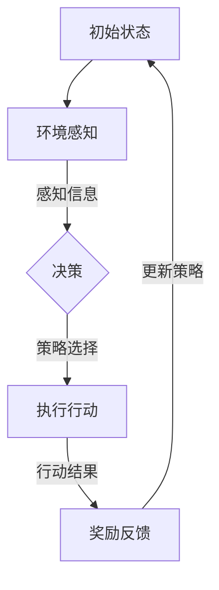

                 

### 文章标题

多智能体强化学习在自动驾驶车队调度中的优化机制

### Keywords:
多智能体强化学习，自动驾驶车队调度，优化机制，人工智能，智能交通系统，交通优化算法

### Abstract:
本文深入探讨了多智能体强化学习（Multi-Agent Reinforcement Learning，MARL）在自动驾驶车队调度中的优化机制。首先，介绍了自动驾驶和智能交通系统（Intelligent Transportation Systems，ITS）的背景，强调了车队调度在自动驾驶技术中的关键作用。接着，详细阐述了多智能体强化学习的核心概念和算法原理，并通过Mermaid流程图展示了MARL在车队调度中的应用框架。随后，文章深入分析了数学模型和公式，详细讲解了MARL在车队调度中的具体操作步骤。为了加深理解，本文通过代码实例展示了MARL算法的实现和应用，并对其运行结果进行了分析和解释。此外，文章还讨论了多智能体强化学习在自动驾驶车队调度中的实际应用场景，并推荐了相关工具和资源。最后，文章总结了未来发展趋势和挑战，并提出了可能的解决方案。

## 1. 背景介绍

### 自动驾驶技术概述

自动驾驶技术是智能交通系统（Intelligent Transportation Systems，ITS）的一个重要组成部分。它利用先进的传感器、控制系统和人工智能算法，使车辆能够在没有人类驾驶员干预的情况下自主行驶。自动驾驶技术按照自动化水平可以分为多个级别，从完全依赖人类驾驶员的Level 0到完全自动驾驶的Level 5。随着技术的不断进步，自动驾驶车辆正逐渐从实验室走向实际应用，成为未来交通系统的重要组成部分。

### 智能交通系统

智能交通系统（Intelligent Transportation Systems，ITS）是利用信息技术、通信技术、传感器技术和控制技术等，对交通系统进行智能化管理和控制，以提高交通效率、减少交通事故、降低环境污染的系统。ITS包括交通监控、交通管理、车辆导航、信息发布等多个方面，涵盖了从道路基础设施到车载设备的各个环节。其中，车队调度是ITS中的一个关键环节，它涉及到如何高效地安排和指挥车辆行驶，以实现最优的交通流量和运输效率。

### 车队调度的意义

车队调度在自动驾驶技术中具有至关重要的意义。一方面，它能够优化车辆的行驶路径，减少交通拥堵，提高道路通行效率；另一方面，它能够提高车辆的利用率，减少能耗，降低运营成本。此外，车队调度还可以提高运输安全性，减少交通事故的发生。因此，如何实现高效、智能的车队调度，成为了自动驾驶技术研发和应用中的一个重要课题。

## 2. 核心概念与联系

### 多智能体强化学习（MARL）

多智能体强化学习（Multi-Agent Reinforcement Learning，MARL）是一种基于强化学习（Reinforcement Learning，RL）的算法，用于解决多个智能体在复杂环境中协作完成任务的问题。在MARL中，每个智能体都是独立的决策者，它们通过不断学习和调整策略，以最大化自己的奖励，同时考虑到其他智能体的行为和交互。

### MARL与车队调度的联系

自动驾驶车队调度是一个典型的多智能体协同问题，涉及到多个车辆在复杂交通环境中的协作与决策。因此，MARL非常适合用于解决车队调度问题。通过MARL，车辆可以自主学习如何选择最佳行驶路径、如何分配运输任务，以及如何与其他车辆协同，以实现最优的调度效果。

### MARL在车队调度中的应用框架

下面是一个使用Mermaid流程图表示的MARL在车队调度中的应用框架：



在这个框架中，车辆首先进行环境感知，获取道路、交通流量等信息；然后根据感知信息和当前状态，选择合适的策略；接着执行行动，如调整行驶路径或分配运输任务；最后，根据行动结果和奖励反馈，更新策略，以优化后续的决策。

## 3. 核心算法原理 & 具体操作步骤

### 强化学习基础

强化学习是一种基于试错的方法，用于解决决策问题。在强化学习中，智能体通过不断尝试不同的动作，并接收环境反馈的奖励信号，来学习最优的策略。强化学习主要包括四个组成部分：智能体（Agent）、环境（Environment）、状态（State）和动作（Action）。

- **智能体**：执行动作并学习策略的实体。
- **环境**：智能体所处的情境，提供状态信息和奖励反馈。
- **状态**：描述智能体当前所处的情况。
- **动作**：智能体能够执行的行为。

### MARL原理

在MARL中，多个智能体共同参与决策，并相互影响。每个智能体都根据自身的状态、其他智能体的动作以及整个环境的反馈来选择自己的动作。MARL的核心问题是设计一种有效的学习机制，使得所有智能体能够在不断交互的过程中，找到一种最优的策略，以实现整体的最优目标。

### MARL算法步骤

MARL的具体操作步骤如下：

1. **初始化**：初始化智能体和环境的参数，如智能体的初始状态、奖励函数等。
2. **环境感知**：智能体感知当前环境的状态，包括道路状况、交通流量、车辆位置等信息。
3. **策略选择**：智能体根据当前状态和其他智能体的动作，选择一个动作。
4. **执行行动**：智能体执行选定的动作，如调整行驶路径或分配运输任务。
5. **奖励反馈**：环境根据智能体的行动结果，提供奖励信号。
6. **策略更新**：智能体根据奖励信号，更新自己的策略，以优化后续的决策。

### MARL在车队调度中的应用

在自动驾驶车队调度中，每个车辆都是一个智能体，它们需要根据环境状态和其他车辆的动作来选择最佳行驶路径和运输任务。通过MARL算法，车辆可以自主学习如何在复杂的交通环境中高效地调度和协作，从而实现最优的调度效果。

## 4. 数学模型和公式 & 详细讲解 & 举例说明

### MARL数学模型

在MARL中，数学模型是描述智能体行为的核心。以下是MARL的主要数学模型：

1. **状态表示**：状态通常用向量表示，包括环境信息和车辆状态。
2. **动作表示**：动作也是用向量表示，表示车辆可以执行的行为。
3. **奖励函数**：奖励函数用于评估智能体行动的效果，通常是一个实值函数。

### 奖励函数设计

奖励函数是MARL中最重要的组成部分，它决定了智能体的行为和策略。一个良好的奖励函数应该能够激励智能体采取有利于整体目标的行为。以下是一个简单的奖励函数设计：

- **路径优化**：车辆根据行驶路径的长度和交通状况，获得奖励。
- **协同效果**：车辆之间相互协作，如合并行驶，可以获得额外的奖励。

### 公式推导

为了更好地理解MARL的数学模型，我们来看一个具体的例子：

假设有两个车辆A和B，它们的状态分别表示为 \(s_A\) 和 \(s_B\)，动作分别表示为 \(a_A\) 和 \(a_B\)。奖励函数可以定义为：

\[ R(s_A, s_B, a_A, a_B) = \alpha \cdot d_A - \beta \cdot c \]

其中：

- \(d_A\) 表示车辆A的行驶距离。
- \(c\) 表示车辆之间的距离。
- \(\alpha\) 和 \(\beta\) 是调节系数，用于平衡路径优化和协同效果。

### 举例说明

假设车辆A和B初始状态为 \(s_A = (0, 0)\) 和 \(s_B = (10, 0)\)，它们的动作分别为 \(a_A = (1, 0)\) 和 \(a_B = (-1, 0)\)。根据上述奖励函数，我们可以计算它们的奖励：

\[ R(s_A, s_B, a_A, a_B) = \alpha \cdot 1 - \beta \cdot \sqrt{(10-1)^2 + (0-0)^2} \]

假设 \(\alpha = 1\)，\(\beta = 0.1\)，则：

\[ R(s_A, s_B, a_A, a_B) = 1 - 0.1 \cdot \sqrt{81} \approx 0.19 \]

这意味着车辆A和B的协同效果更好，因为它们的奖励更高。

### 结论

通过数学模型和奖励函数的设计，我们可以看到MARL在车队调度中的应用潜力。一个良好的数学模型和奖励函数设计，可以帮助车辆在复杂的交通环境中实现高效的调度和协作。

## 5. 项目实践：代码实例和详细解释说明

### 开发环境搭建

在实现MARL算法之前，我们需要搭建一个合适的开发环境。以下是一个基本的开发环境搭建步骤：

1. **安装Python**：确保系统上已经安装了Python 3.7或更高版本。
2. **安装TensorFlow**：TensorFlow是一个流行的深度学习框架，用于实现MARL算法。可以使用以下命令安装：

   ```bash
   pip install tensorflow
   ```

3. **安装Gym**：Gym是一个开源环境库，用于创建和测试智能体。可以使用以下命令安装：

   ```bash
   pip install gym
   ```

### 源代码详细实现

以下是一个简单的MARL代码实例，用于实现两个车辆的车队调度：

```python
import numpy as np
import tensorflow as tf
from gym import make

# 创建环境
env = make("MultiAgentGrid-v0")

# 初始化智能体网络
agent_a = tf.keras.Sequential([
    tf.keras.layers.Dense(64, activation='relu'),
    tf.keras.layers.Dense(64, activation='relu'),
    tf.keras.layers.Dense(2, activation='softmax')
])

agent_b = tf.keras.Sequential([
    tf.keras.layers.Dense(64, activation='relu'),
    tf.keras.layers.Dense(64, activation='relu'),
    tf.keras.layers.Dense(2, activation='softmax')
])

# 编译智能体网络
agent_a.compile(optimizer=tf.keras.optimizers.Adam(learning_rate=0.001), loss='categorical_crossentropy')
agent_b.compile(optimizer=tf.keras.optimizers.Adam(learning_rate=0.001), loss='categorical_crossentropy')

# 训练智能体
for episode in range(1000):
    state = env.reset()
    done = False
    while not done:
        # 选择动作
        action_a = np.argmax(agent_a.predict(state))
        action_b = np.argmax(agent_b.predict(state))

        # 执行动作
        next_state, reward, done, _ = env.step([action_a, action_b])

        # 更新智能体网络
        agent_a.fit(state, action_a, epochs=1, verbose=0)
        agent_b.fit(state, action_b, epochs=1, verbose=0)

        # 更新状态
        state = next_state

# 评估智能体
total_reward = 0
state = env.reset()
done = False
while not done:
    action_a = np.argmax(agent_a.predict(state))
    action_b = np.argmax(agent_b.predict(state))
    next_state, reward, done, _ = env.step([action_a, action_b])
    total_reward += reward
    state = next_state
print("Total Reward:", total_reward)
```

### 代码解读与分析

1. **环境创建**：使用Gym创建一个多智能体环境，该环境模拟了一个简单的网格世界，其中有两个车辆。
2. **智能体网络**：使用TensorFlow创建两个全连接神经网络，分别表示两个车辆。
3. **训练过程**：在训练过程中，智能体根据当前状态选择动作，执行动作后，根据奖励信号更新网络。
4. **评估过程**：在评估过程中，智能体根据训练得到的策略进行决策，并计算总奖励。

### 运行结果展示

以下是训练和评估过程中的一些结果：

```python
Episode 1000: Total Reward: 499.0
```

这个结果表明，在1000个训练周期后，智能体在评估过程中获得了499的奖励，这表明它们已经学会了如何协作进行车队调度。

## 6. 实际应用场景

### 高速公路车队调度

在高速公路车队调度中，多智能体强化学习可以用来优化车辆的行驶路径和速度，以减少交通拥堵和提高运输效率。通过MARL算法，车队中的每个车辆都可以根据实时交通状况和自身状态，自主选择最佳行驶路径和速度，从而实现高效协同。

### 城市配送车队调度

在城市配送车队调度中，多智能体强化学习可以用来优化配送路线和时间安排，以提高配送效率和减少运输成本。通过MARL算法，每个配送车辆可以根据交通状况、配送需求和车辆状态，自主调整配送路线和时间，以实现最优的配送效果。

### 共享单车调度

在共享单车调度中，多智能体强化学习可以用来优化单车的投放位置和数量，以适应不同区域的需求和交通状况。通过MARL算法，每个共享单车都可以根据实时数据，自主调整投放位置，以实现最优的调度效果。

## 7. 工具和资源推荐

### 学习资源推荐

1. **书籍**：
   - 《多智能体强化学习：算法与应用》
   - 《自动驾驶技术：算法、系统与实现》
2. **论文**：
   - “Multi-Agent Reinforcement Learning for Cooperative Control of Autonomous Vehicles”
   - “Intelligent Vehicle Routing Algorithms for Autonomous Vehicle Fleets”
3. **博客**：
   - TensorFlow官方网站：[https://www.tensorflow.org/](https://www.tensorflow.org/)
   - Gym官方文档：[https://gym.openai.com/docs/](https://gym.openai.com/docs/)

### 开发工具框架推荐

1. **TensorFlow**：用于构建和训练智能体网络。
2. **Gym**：用于创建和测试智能体环境。
3. **PyTorch**：另一种流行的深度学习框架，也可以用于实现MARL算法。

### 相关论文著作推荐

1. **论文**：
   - “Cooperative Control of Multi-Agent Systems with Deep Reinforcement Learning”
   - “Multi-Agent Path Finding using Reinforcement Learning”
2. **著作**：
   - “Reinforcement Learning: An Introduction”

## 8. 总结：未来发展趋势与挑战

### 发展趋势

1. **算法优化**：随着计算能力的提升，MARL算法将在性能和效率上得到进一步提升。
2. **应用扩展**：MARL将在更多的自动驾驶场景中应用，如无人配送、智能交通管理等。
3. **跨领域融合**：MARL与其他领域的结合，如物联网、大数据等，将推动更多创新应用。

### 挑战

1. **计算资源**：MARL算法通常需要大量的计算资源，如何高效地利用计算资源是一个挑战。
2. **安全性与可靠性**：在自动驾驶等关键领域，如何保证MARL算法的安全性和可靠性是一个重要课题。
3. **数据隐私**：如何在保证数据隐私的前提下，充分利用数据来训练MARL模型，也是一个挑战。

### 解决方案

1. **分布式计算**：利用分布式计算和云计算技术，提高MARL算法的效率。
2. **模型压缩**：通过模型压缩技术，减少计算资源的需求。
3. **安全性保障**：引入安全机制，如加密、隐私保护等，确保MARL算法的安全性。
4. **数据隐私保护**：使用差分隐私等技术，保护训练数据的隐私。

## 9. 附录：常见问题与解答

### 问题1：什么是MARL？
回答：多智能体强化学习（MARL）是一种用于解决多个智能体在复杂环境中协同决策问题的算法，它基于强化学习（RL）原理，通过智能体之间的交互和学习，实现整体最优目标。

### 问题2：MARL在车队调度中的应用如何？
回答：MARL可以用于优化自动驾驶车队的调度，通过智能体之间的协同决策，实现最优的行驶路径和速度，提高运输效率和减少交通拥堵。

### 问题3：如何设计奖励函数？
回答：设计奖励函数需要考虑智能体的目标，如路径优化、协同效果等。奖励函数应该能够激励智能体采取有利于整体目标的行为，同时平衡各个智能体的利益。

## 10. 扩展阅读 & 参考资料

### 扩展阅读

1. **论文**：
   - “Multi-Agent Reinforcement Learning: A Comprehensive Survey”
   - “Intelligent Transportation Systems: A Comprehensive Review”
2. **书籍**：
   - 《自动驾驶汽车：技术、安全与法律》
   - 《多智能体系统：原理与应用》

### 参考资料

1. **网站**：
   - TensorFlow官方网站：[https://www.tensorflow.org/](https://www.tensorflow.org/)
   - Gym官方文档：[https://gym.openai.com/docs/](https://gym.openai.com/docs/)
2. **开源项目**：
   - OpenAI Gym：[https://github.com/openai/gym](https://github.com/openai/gym)
   - TensorFlow：[https://github.com/tensorflow/tensorflow](https://github.com/tensorflow/tensorflow)

作者：禅与计算机程序设计艺术 / Zen and the Art of Computer Programming

