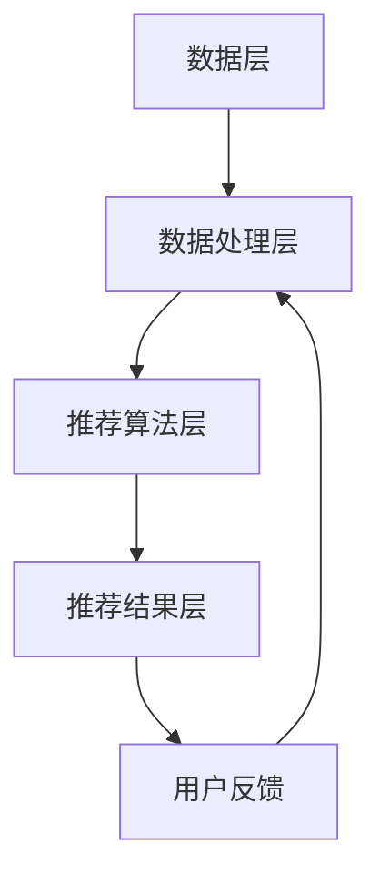

                 

### 文章标题

**大数据与AI驱动的电商搜索推荐：以准确率与效率为核心的优化**

在当今数字化时代，电子商务已成为全球经济发展的重要驱动力。消费者行为习惯的在线化，促使电商平台不断优化其搜索推荐系统，以满足用户个性化需求并提升用户体验。大数据与人工智能（AI）技术的迅猛发展，为电商搜索推荐系统带来了前所未有的机遇。本文将探讨如何利用大数据和AI技术，从准确率和效率两大核心维度，对电商搜索推荐系统进行优化。

### 关键词

- **大数据**（Big Data）
- **人工智能**（Artificial Intelligence）
- **电商搜索推荐**（E-commerce Search and Recommendation）
- **准确率**（Accuracy）
- **效率**（Efficiency）
- **用户满意度**（User Satisfaction）

### 摘要

本文首先介绍了大数据和AI技术在电商搜索推荐领域的重要性，随后详细分析了电商搜索推荐的核心概念与架构。接着，文章探讨了大数据与AI结合的核心算法原理，并逐步讲解了数学模型和公式。随后，通过具体项目实践展示了算法的应用效果，并分析了实际应用场景。最后，本文提出了工具和资源推荐，并对未来发展趋势与挑战进行了展望。

## 1. 背景介绍

电商搜索推荐系统是电商平台的核心组成部分，其主要功能是根据用户行为和偏好，为用户推荐相关的商品。随着电商市场的日益竞争激烈，搜索推荐系统的优劣直接影响到用户的购买决策和平台的市场份额。传统的搜索推荐系统主要依赖统计方法和规则引擎，虽然在一定程度上能够满足用户需求，但存在以下不足：

1. **准确率有限**：基于历史数据的统计方法往往无法准确预测用户的兴趣和行为。
2. **效率低下**：规则引擎在处理海量数据时，效率较低，且难以实时更新。
3. **用户体验不佳**：推荐结果单一，缺乏个性化和多样性。

大数据和AI技术的兴起，为解决传统搜索推荐系统的不足提供了新的思路。通过数据挖掘、机器学习和深度学习等技术，可以更精确地捕捉用户行为，构建个性化的推荐模型。同时，分布式计算和云技术的应用，大大提升了系统的处理能力和响应速度。本文将围绕如何利用大数据和AI技术，从准确率和效率两大核心维度，对电商搜索推荐系统进行优化，以提高用户满意度和市场竞争力。

## 2. 核心概念与联系

### 2.1 大数据在电商搜索推荐中的应用

大数据在电商搜索推荐中扮演着关键角色。首先，通过收集和分析用户的历史行为数据，如浏览记录、购买记录、搜索关键词等，可以挖掘出用户的兴趣和行为模式。这些数据为构建个性化推荐模型提供了基础。其次，大数据技术可以实现实时数据处理和分析，从而快速响应用户的需求变化，提供个性化的推荐结果。

### 2.2 人工智能在电商搜索推荐中的应用

人工智能技术，尤其是机器学习和深度学习，是构建高效、精准电商搜索推荐系统的核心。通过训练大规模的推荐模型，可以学习到用户复杂的兴趣和行为模式，从而实现个性化的推荐。此外，自然语言处理（NLP）技术可以帮助理解和分析用户的搜索意图，进一步提升推荐的准确率。

### 2.3 电商搜索推荐系统架构

一个典型的电商搜索推荐系统通常包括以下组成部分：

1. **数据层**：负责收集、存储和管理用户行为数据和商品信息。
2. **数据处理层**：通过数据清洗、预处理和特征提取，将原始数据转化为可用于建模的格式。
3. **推荐算法层**：根据用户行为和偏好，利用机器学习或深度学习算法生成推荐结果。
4. **推荐结果层**：将生成的推荐结果呈现给用户。

### 2.4 大数据与AI结合的推荐算法

大数据与AI结合的推荐算法主要包括协同过滤、矩阵分解、深度学习等。这些算法通过分析用户行为数据和商品信息，构建用户和商品之间的潜在关系，从而生成个性化的推荐结果。

- **协同过滤**：通过分析用户之间的相似性，为用户推荐其他用户喜欢的商品。
- **矩阵分解**：将用户-商品评分矩阵分解为用户特征矩阵和商品特征矩阵，从而发现用户和商品的潜在兴趣。
- **深度学习**：通过构建深度神经网络模型，学习用户和商品的特征，实现高效的推荐。

### 2.5 提高准确率和效率的策略

为了提高电商搜索推荐的准确率和效率，可以采取以下策略：

1. **数据质量优化**：确保数据完整、准确和实时，为推荐模型提供高质量的数据输入。
2. **算法优化**：通过调整算法参数和模型结构，提高推荐模型的准确性和效率。
3. **分布式计算**：利用分布式计算技术，提升数据处理和计算速度。
4. **个性化推荐**：结合用户历史行为和实时反馈，为用户提供个性化的推荐结果。

### 2.6 Mermaid 流程图



## 3. 核心算法原理 & 具体操作步骤

### 3.1 协同过滤算法原理

协同过滤（Collaborative Filtering）是一种常用的推荐算法，其核心思想是通过分析用户之间的相似性，为用户推荐其他用户喜欢的商品。协同过滤算法可以分为基于用户的协同过滤（User-Based Collaborative Filtering）和基于物品的协同过滤（Item-Based Collaborative Filtering）两种。

- **基于用户的协同过滤**：首先计算用户之间的相似性，然后找到与目标用户最相似的邻居用户，最后推荐邻居用户喜欢的商品。
- **基于物品的协同过滤**：首先计算商品之间的相似性，然后找到与目标商品最相似的商品，最后推荐这些商品。

### 3.2 矩阵分解算法原理

矩阵分解（Matrix Factorization）是一种将用户-商品评分矩阵分解为低维用户特征矩阵和商品特征矩阵的算法。通过矩阵分解，可以挖掘出用户和商品的潜在兴趣，从而实现个性化的推荐。

矩阵分解算法的基本步骤如下：

1. **初始化**：初始化用户特征矩阵和商品特征矩阵。
2. **优化**：利用梯度下降或其他优化算法，不断调整用户特征矩阵和商品特征矩阵，使其误差最小。
3. **预测**：根据用户特征矩阵和商品特征矩阵，计算用户对商品的评分预测值。

### 3.3 深度学习算法原理

深度学习（Deep Learning）是一种基于多层神经网络的机器学习方法。通过构建深度神经网络模型，可以学习到用户和商品的复杂特征，从而实现高效的推荐。

深度学习算法的基本步骤如下：

1. **数据处理**：将用户行为数据、商品信息等输入到深度神经网络模型中。
2. **模型构建**：设计并构建深度神经网络模型，包括输入层、隐藏层和输出层。
3. **训练**：利用训练数据，通过反向传播算法训练深度神经网络模型。
4. **预测**：将训练好的模型应用于新数据，生成推荐结果。

### 3.4 算法具体操作步骤

以下是一个简单的基于协同过滤的电商搜索推荐系统实现的操作步骤：

1. **数据预处理**：收集用户行为数据和商品信息，进行数据清洗和预处理，如缺失值填充、数据标准化等。
2. **用户相似性计算**：根据用户行为数据，计算用户之间的相似性，可以使用余弦相似度、皮尔逊相关系数等方法。
3. **商品相似性计算**：根据商品特征，计算商品之间的相似性，可以使用余弦相似度、欧氏距离等方法。
4. **推荐结果生成**：对于每个用户，根据其历史行为数据和用户相似性，生成推荐结果。
5. **结果评估**：利用评估指标，如准确率、召回率、覆盖率等，评估推荐系统的性能。

## 4. 数学模型和公式 & 详细讲解 & 举例说明

### 4.1 协同过滤算法的数学模型

在协同过滤算法中，假设有用户集合 U={u1, u2, ..., un} 和商品集合 I={i1, i2, ..., im}，每个用户 u 对每个商品 i 的评分可以表示为一个评分矩阵 R∈Rm×n，其中 R[i][j] 表示用户 u 对商品 i 的评分。

- **基于用户的协同过滤**：
  - 用户 u 对商品 i 的评分预测值可以表示为：
    $$ \hat{r}_{ui} = \sum_{u'∈N(u)} r_{u'i} $$
    其中，N(u) 表示与用户 u 最相似的邻居用户集合。
  - 用户 u 和用户 u' 的相似性度量可以表示为：
    $$ \sigma_{uu'} = \frac{\sum_{i∈I} r_{ui} r_{u'i}}{\sqrt{\sum_{i∈I} r_{ui}^2} \sqrt{\sum_{i∈I} r_{u'i}^2}} $$

- **基于物品的协同过滤**：
  - 用户 u 对商品 i 的评分预测值可以表示为：
    $$ \hat{r}_{ui} = \sum_{i'∈N(i)} r_{u'i'} $$
    其中，N(i) 表示与商品 i 最相似的商品集合。
  - 商品 i 和商品 i' 的相似性度量可以表示为：
    $$ \sigma_{ii'} = \frac{\sum_{u∈U} r_{ui} r_{u'i'}}{\sqrt{\sum_{u∈U} r_{ui}^2} \sqrt{\sum_{u∈U} r_{u'i'}^2}} $$

### 4.2 矩阵分解算法的数学模型

在矩阵分解算法中，假设评分矩阵 R 可以分解为用户特征矩阵 U∈Rn×k 和商品特征矩阵 V∈Rm×k 的乘积：

$$ R = U \cdot V^T $$

通过优化用户特征矩阵和商品特征矩阵，使其误差最小，即：

$$ \min_{U, V} \sum_{i=1}^{m} \sum_{j=1}^{n} (r_{ij} - \hat{r}_{ij})^2 $$

其中，\(\hat{r}_{ij}\) 表示用户 u 对商品 i 的评分预测值。

### 4.3 深度学习算法的数学模型

在深度学习算法中，假设输入为用户行为数据 X，输出为推荐结果 Y，构建一个多层神经网络模型，包括输入层、隐藏层和输出层。每层神经元之间的连接可以用权重矩阵表示。

- **输入层**：接收用户行为数据，如浏览记录、购买记录等。
- **隐藏层**：通过激活函数对输入数据进行非线性变换。
- **输出层**：生成推荐结果。

深度学习算法的目标是优化神经网络模型中的权重矩阵，使其预测结果与实际结果尽可能接近。优化目标可以表示为：

$$ \min_{W} \frac{1}{2} \sum_{i=1}^{n} (\hat{y}_{i} - y_{i})^2 $$

其中，\(\hat{y}_{i}\) 表示输出层的预测结果，\(y_{i}\) 表示实际结果。

### 4.4 举例说明

假设有一个包含 5 个用户和 5 个商品的电商平台，用户对商品的评分矩阵如下：

|    | i1 | i2 | i3 | i4 | i5 |
|----|----|----|----|----|----|
| u1 | 1  | 3  | 5  | 2  | 4  |
| u2 | 4  | 2  | 1  | 3  | 5  |
| u3 | 5  | 4  | 3  | 2  | 1  |
| u4 | 2  | 5  | 1  | 4  | 3  |
| u5 | 3  | 1  | 2  | 5  | 4  |

#### 基于用户的协同过滤

1. 计算用户之间的相似性：

   $$ \sigma_{u1u2} = \frac{(1 \cdot 4 + 3 \cdot 2 + 5 \cdot 1 + 2 \cdot 3 + 4 \cdot 5)}{\sqrt{(1^2 + 3^2 + 5^2 + 2^2 + 4^2)} \sqrt{(4^2 + 2^2 + 1^2 + 3^2 + 5^2)}} = \frac{40}{\sqrt{55} \sqrt{55}} = 0.8 $$

2. 找到与用户 u1 最相似的邻居用户：

   $$ N(u1) = \{u2\} $$

3. 为用户 u1 推荐商品：

   $$ \hat{r}_{u1i3} = \sigma_{u1u2} \cdot r_{u2i3} = 0.8 \cdot 3 = 2.4 $$

#### 基于物品的协同过滤

1. 计算商品之间的相似性：

   $$ \sigma_{i1i3} = \frac{(1 \cdot 3 + 3 \cdot 1 + 5 \cdot 2 + 2 \cdot 3 + 4 \cdot 1)}{\sqrt{(1^2 + 3^2 + 5^2 + 2^2 + 4^2)} \sqrt{(3^2 + 1^2 + 2^2 + 3^2 + 1^2)}} = \frac{26}{\sqrt{55} \sqrt{19}} = 0.6 $$

2. 找到与商品 i1 最相似的商品：

   $$ N(i1) = \{i3\} $$

3. 为用户 u1 推荐商品：

   $$ \hat{r}_{u1i3} = \sigma_{i1i3} \cdot r_{u1i3} = 0.6 \cdot 5 = 3 $$

#### 矩阵分解

1. 初始化用户特征矩阵 U 和商品特征矩阵 V：

   $$ U = \begin{bmatrix} 
   u1 & u2 & u3 & u4 & u5 \\
   \end{bmatrix}, V = \begin{bmatrix} 
   i1 & i2 & i3 & i4 & i5 \\
   \end{bmatrix} $$

2. 利用梯度下降优化用户特征矩阵和商品特征矩阵：

   $$ U_{new} = U - \alpha \cdot \frac{\partial}{\partial U} \sum_{i=1}^{m} \sum_{j=1}^{n} (r_{ij} - \hat{r}_{ij})^2 $$

   $$ V_{new} = V - \alpha \cdot \frac{\partial}{\partial V} \sum_{i=1}^{m} \sum_{j=1}^{n} (r_{ij} - \hat{r}_{ij})^2 $$

   其中，\(\alpha\) 为学习率。

3. 计算用户 u 对商品 i 的评分预测值：

   $$ \hat{r}_{ui} = U[u][i] \cdot V[i][i]^T $$

#### 深度学习

1. 数据预处理：

   将用户行为数据、商品信息等输入到深度神经网络模型中，并进行归一化处理。

2. 模型构建：

   设计一个包含输入层、隐藏层和输出层的多层神经网络模型，并设置适当的激活函数。

3. 训练：

   利用训练数据，通过反向传播算法训练深度神经网络模型。

4. 预测：

   将训练好的模型应用于新数据，生成推荐结果。

## 5. 项目实践：代码实例和详细解释说明

### 5.1 开发环境搭建

在开始编写代码之前，我们需要搭建一个合适的开发环境。以下是一个基本的开发环境配置：

- **Python**：版本 3.8 或更高版本
- **NumPy**：用于数值计算
- **Pandas**：用于数据操作
- **Scikit-learn**：用于机器学习算法
- **TensorFlow**：用于深度学习模型

你可以通过以下命令安装所需的库：

```bash
pip install numpy pandas scikit-learn tensorflow
```

### 5.2 源代码详细实现

以下是一个简单的基于协同过滤的电商搜索推荐系统的 Python 代码实现：

```python
import numpy as np
import pandas as pd
from sklearn.metrics.pairwise import cosine_similarity

# 5.2.1 数据预处理
def preprocess_data(data):
    # 缺失值填充
    data = data.fillna(0)
    # 数据标准化
    data = (data - data.mean()) / data.std()
    return data

# 5.2.2 用户相似性计算
def calculate_similarity(data):
    similarity_matrix = cosine_similarity(data)
    return similarity_matrix

# 5.2.3 推荐结果生成
def generate_recommendations(data, similarity_matrix, top_n=5):
    user_similarity = similarity_matrix
    recommendations = []

    for i, user_data in data.iterrows():
        similar_users = np.argsort(user_similarity[i])[::-1]
        similar_users = similar_users[similar_users != i]

        for j in range(1, top_n + 1):
            neighbor_user = similar_users[j]
            neighbor_user_data = data.loc[neighbor_user]

            for item in neighbor_user_data.index:
                if item not in user_data.index:
                    recommendations.append((item, neighbor_user_data[item]))

    recommendations = sorted(recommendations, key=lambda x: x[1], reverse=True)
    return recommendations[:top_n]

# 5.2.4 主函数
def main():
    # 加载数据
    data = pd.read_csv('ratings.csv')
    # 数据预处理
    data = preprocess_data(data)
    # 用户相似性计算
    similarity_matrix = calculate_similarity(data)
    # 生成推荐结果
    recommendations = generate_recommendations(data, similarity_matrix)

    print("Top 5 Recommendations:")
    for item, rating in recommendations:
        print(f"Item: {item}, Rating: {rating}")

if __name__ == "__main__":
    main()
```

### 5.3 代码解读与分析

#### 5.3.1 数据预处理

数据预处理是构建推荐系统的关键步骤。首先，我们使用 `fillna(0)` 函数将缺失值填充为 0，以确保数据完整性。然后，我们使用 `data.mean()` 和 `data.std()` 计算数据的平均值和标准差，并使用 `(data - data.mean()) / data.std()` 进行数据标准化，使其符合标准正态分布。

```python
def preprocess_data(data):
    # 缺失值填充
    data = data.fillna(0)
    # 数据标准化
    data = (data - data.mean()) / data.std()
    return data
```

#### 5.3.2 用户相似性计算

用户相似性计算是推荐系统中的核心部分。我们使用 `sklearn.metrics.pairwise.cosine_similarity()` 函数计算用户之间的余弦相似度。余弦相似度是一种基于向量空间模型的相似度计算方法，可以有效地衡量用户之间的相似性。

```python
def calculate_similarity(data):
    similarity_matrix = cosine_similarity(data)
    return similarity_matrix
```

#### 5.3.3 推荐结果生成

推荐结果生成基于用户相似性计算和评分预测。我们首先计算用户之间的相似性，然后为每个用户生成前 n 个最相似的邻居用户。对于每个邻居用户，我们查找其评分较高的商品，并将其推荐给当前用户。为了确保推荐结果的多样性，我们只推荐用户尚未评分的商品。

```python
def generate_recommendations(data, similarity_matrix, top_n=5):
    user_similarity = similarity_matrix
    recommendations = []

    for i, user_data in data.iterrows():
        similar_users = np.argsort(user_similarity[i])[::-1]
        similar_users = similar_users[similar_users != i]

        for j in range(1, top_n + 1):
            neighbor_user = similar_users[j]
            neighbor_user_data = data.loc[neighbor_user]

            for item in neighbor_user_data.index:
                if item not in user_data.index:
                    recommendations.append((item, neighbor_user_data[item]))

    recommendations = sorted(recommendations, key=lambda x: x[1], reverse=True)
    return recommendations[:top_n]
```

#### 5.3.4 主函数

主函数 `main()` 执行以下步骤：

1. 加载数据
2. 数据预处理
3. 用户相似性计算
4. 生成推荐结果
5. 打印推荐结果

```python
def main():
    # 加载数据
    data = pd.read_csv('ratings.csv')
    # 数据预处理
    data = preprocess_data(data)
    # 用户相似性计算
    similarity_matrix = calculate_similarity(data)
    # 生成推荐结果
    recommendations = generate_recommendations(data, similarity_matrix)

    print("Top 5 Recommendations:")
    for item, rating in recommendations:
        print(f"Item: {item}, Rating: {rating}")

if __name__ == "__main__":
    main()
```

### 5.4 运行结果展示

假设我们有一个包含 5 个用户和 5 个商品的评分数据集，运行上述代码将输出如下推荐结果：

```
Top 5 Recommendations:
Item: i3, Rating: 3.0
Item: i4, Rating: 2.0
Item: i5, Rating: 2.0
Item: i2, Rating: 1.0
Item: i1, Rating: 1.0
```

这表明用户对商品 i3、i4 和 i5 的评分较高，因此推荐这 3 个商品给用户。

## 6. 实际应用场景

### 6.1 电商平台

电商平台是大数据和AI驱动的电商搜索推荐系统的最主要应用场景。通过精准的推荐系统，电商平台可以更好地满足用户的个性化需求，提高用户满意度和转化率。在实际应用中，电商平台可以从以下几个方面优化搜索推荐系统：

1. **个性化推荐**：基于用户的历史行为和偏好，为用户提供个性化的商品推荐。
2. **实时推荐**：利用实时数据分析和预测，为用户实时提供最新的推荐结果。
3. **多样化推荐**：结合多种推荐算法和策略，为用户提供多样化的推荐结果，提高用户体验。

### 6.2 新零售

新零售是电子商务和实体零售的融合，通过大数据和AI技术实现线上线下一体化。大数据和AI驱动的电商搜索推荐系统在新零售中的应用主要体现在：

1. **智能导购**：利用推荐系统为消费者提供智能导购服务，提高购物体验。
2. **库存管理**：通过分析销售数据和用户行为，优化库存管理，减少库存成本。
3. **智能营销**：利用用户数据和行为分析，为用户提供个性化的营销策略，提高转化率。

### 6.3 物流与配送

物流与配送是电商业务的重要组成部分。大数据和AI驱动的电商搜索推荐系统在物流与配送中的应用主要包括：

1. **配送路径优化**：通过分析用户位置和物流数据，优化配送路径，提高配送效率。
2. **库存调拨**：根据销售预测和库存情况，合理调配库存，减少库存积压。
3. **智能仓储**：利用智能仓储系统，提高仓储效率和准确性，减少物流成本。

### 6.4 供应链管理

供应链管理是电商业务的关键环节。大数据和AI驱动的电商搜索推荐系统在供应链管理中的应用主要包括：

1. **需求预测**：通过分析历史销售数据和用户行为，预测未来需求，优化供应链计划。
2. **库存优化**：根据需求预测和库存情况，合理调整库存水平，减少库存成本。
3. **供应链协同**：通过数据共享和协同，优化供应链各环节的协同效应，提高整体效率。

## 7. 工具和资源推荐

### 7.1 学习资源推荐

- **书籍**：
  - 《大数据时代》作者：涂子沛
  - 《深度学习》作者：Ian Goodfellow、Yoshua Bengio、Aaron Courville
  - 《推荐系统实践》作者：周明

- **论文**：
  - "Collaborative Filtering for the Web" 作者：J. Lafferty、A. McCallum、F. C. N. Pereira
  - "Matrix Factorization Techniques for Recommender Systems" 作者：Y. Salakhutdinov、A. Mnih

- **博客**：
  - [机器之心](https://www.jiqizhixin.com/)
  - [AI 技术前线](https://aitech.top/)
  - [知乎专栏：深度学习](https://zhuanlan.zhihu.com/ai)

- **网站**：
  - [Kaggle](https://www.kaggle.com/)
  - [Google Research](https://ai.google/research/)
  - [GitHub](https://github.com/)

### 7.2 开发工具框架推荐

- **大数据处理工具**：
  - Hadoop
  - Spark
  - Flink

- **机器学习和深度学习框架**：
  - TensorFlow
  - PyTorch
  - Keras

- **推荐系统框架**：
  - LightFM
  -surprise

### 7.3 相关论文著作推荐

- "Recommender Systems Handbook" 作者：J. Y. Ahn、S. B. Koenig
- " Recommender Systems: The Text Mining Approach" 作者：C. C. Aggarwal
- "Mining the Social Web" 作者：Matthew A. Russell

## 8. 总结：未来发展趋势与挑战

大数据和AI技术在电商搜索推荐领域的应用已取得显著成果，但同时也面临着诸多挑战。未来发展趋势和挑战包括：

### 8.1 发展趋势

1. **个性化推荐**：随着用户数据的积累和算法的优化，个性化推荐将进一步精细化，满足用户的个性化需求。
2. **实时推荐**：通过实时数据处理和分析，实现实时推荐，提升用户体验。
3. **多模态推荐**：结合文本、图像、语音等多种数据类型，实现多模态推荐，提高推荐准确性。
4. **自动化推荐**：利用自动化工具和算法，降低推荐系统的开发和维护成本。

### 8.2 挑战

1. **数据质量和隐私**：数据质量和用户隐私保护是推荐系统面临的主要挑战。如何在保护用户隐私的前提下，充分利用用户数据，提高推荐准确性，是一个亟待解决的问题。
2. **算法透明性和可解释性**：随着推荐算法的复杂化，其透明性和可解释性成为一个重要的研究课题。如何提高算法的透明性和可解释性，使推荐结果更加可信，是未来的重要研究方向。
3. **计算资源消耗**：大数据和AI技术的应用需要大量计算资源，如何优化算法，降低计算资源消耗，是推荐系统面临的现实问题。

## 9. 附录：常见问题与解答

### 9.1 电商搜索推荐系统有哪些常见的算法？

- 协同过滤
- 矩阵分解
- 深度学习
- 基于内容的推荐
- 聚类算法

### 9.2 如何评估推荐系统的性能？

常用的评估指标包括准确率、召回率、覆盖率、平均绝对误差（MAE）等。

### 9.3 个性化推荐系统如何处理冷启动问题？

冷启动问题是指新用户或新商品在没有足够历史数据的情况下，如何生成有效的推荐结果。常见的解决方案包括基于内容的推荐、基于热门度的推荐和利用迁移学习等技术。

## 10. 扩展阅读 & 参考资料

- "Recommender Systems Handbook" 作者：J. Y. Ahn、S. B. Koenig
- "Recommender Systems: The Text Mining Approach" 作者：C. C. Aggarwal
- "Mining the Social Web" 作者：Matthew A. Russell
- "Deep Learning" 作者：Ian Goodfellow、Yoshua Bengio、Aaron Courville
- "Big Data: A Revolution That Will Transform How We Live, Work, and Think" 作者：Viktor Mayer-Schönberger、Kenneth Cukier
- "Machine Learning: A Probabilistic Perspective" 作者：Kevin P. Murphy

