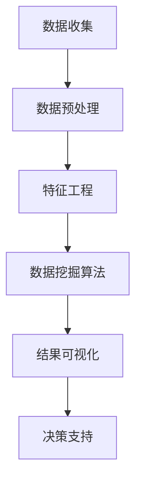

                 

### 文章标题

大数据工程师的创业潜力：挖掘数据价值与业务洞察

> 关键词：大数据、数据工程师、创业、数据价值、业务洞察

在当今这个数据驱动的时代，大数据工程师的角色已经从传统的技术支持人员，逐渐转变成了创新与增长的推动者。他们的核心任务不仅包括数据的收集、存储和管理，更重要的是从海量数据中挖掘出有价值的信息和洞察，为企业的战略决策提供支持。本文将探讨大数据工程师在创业领域的潜力，通过深入分析数据价值挖掘的方法和业务洞察的应用，展示他们在创业环境中的独特价值。

### 文章摘要

本文首先介绍了大数据工程师的背景和角色转变，随后详细阐述了数据价值挖掘的重要性以及具体方法。接着，我们探讨了大数据工程师如何利用业务洞察推动企业创新，并通过实际案例分析了他们的创业潜力。文章最后，我们对大数据工程师在创业中的挑战和未来趋势进行了总结，为读者提供了关于如何抓住大数据机遇的思考和建议。

### 1. 背景介绍

#### 1.1 大数据工程师的角色

大数据工程师是企业数据架构的核心，他们负责构建和维护大数据系统，确保数据的高效存储、处理和分析。在过去，他们的工作主要集中在对数据的存储和管理上，但随着技术的发展和商业需求的演变，他们的角色已经扩展到了数据的价值挖掘和业务洞察的提供。

#### 1.2 创业环境中的数据需求

在创业公司中，资源通常有限，而且决策往往需要在快速变化的市场环境中进行。这种情况下，数据成为了创业成功的关键因素。大数据工程师不仅需要具备深厚的技术背景，还要能够快速理解和应用商业需求，从而为企业提供有价值的数据支持。

#### 1.3 数据价值挖掘的意义

数据价值挖掘是通过分析数据来发现隐藏的模式、趋势和关联，从而为企业提供决策支持。对于创业公司来说，数据价值挖掘可以帮助他们更好地了解市场需求、优化产品功能和提高运营效率，从而在竞争激烈的市场中脱颖而出。

### 2. 核心概念与联系

#### 2.1 数据价值挖掘的方法

数据价值挖掘涉及多种技术，包括数据预处理、数据挖掘算法和可视化工具。以下是一个简化的 Mermaid 流程图，描述了数据价值挖掘的基本步骤：



#### 2.2 数据价值挖掘与业务洞察的关系

数据价值挖掘的结果为业务洞察提供了基础。通过深入分析数据，大数据工程师可以识别出市场趋势、用户偏好和潜在的商业机会，从而为企业的战略决策提供有价值的建议。

### 3. 核心算法原理 & 具体操作步骤

#### 3.1 数据预处理

数据预处理是数据价值挖掘的第一步，其目的是清洗和整理原始数据，以便后续分析。以下是数据预处理的一些常见操作：

- 数据清洗：去除重复数据、处理缺失值和异常值。
- 数据转换：将数据转换为适合分析的形式，如将文本数据转换为向量。
- 数据归一化：调整数据范围，使其更适合某些算法。

#### 3.2 特征工程

特征工程是数据价值挖掘的关键步骤，其目的是从原始数据中提取出对分析任务最有用的特征。以下是一些特征工程的方法：

- 特征选择：通过统计方法或机器学习算法，选择对预测任务最有影响力的特征。
- 特征构造：通过组合原始数据特征，创建新的特征。

#### 3.3 数据挖掘算法

数据挖掘算法用于从数据中发现模式和关联。以下是一些常用的数据挖掘算法：

- 聚类算法：用于将数据分为不同的群体。
- 分类算法：用于将数据分为不同的类别。
- 联合分析：用于分析多个变量之间的关系。

#### 3.4 结果可视化

结果可视化是数据价值挖掘的最后一步，其目的是将分析结果以直观的形式展示给决策者。以下是一些常用的可视化工具：

- 条形图：用于显示不同类别的数据大小。
- 饼图：用于显示不同类别的数据占比。
- 散点图：用于显示两个变量之间的关系。

### 4. 数学模型和公式 & 详细讲解 & 举例说明

#### 4.1 数学模型

在数据挖掘中，常用的数学模型包括：

- 线性回归：用于预测一个连续变量的值。
- 决策树：用于分类和回归任务。
- 随机森林：是一种集成学习方法，用于提高分类和回归的准确性。

以下是一个简单的线性回归模型公式：

$$ y = \beta_0 + \beta_1 \cdot x $$

其中，\( y \) 是预测值，\( \beta_0 \) 是截距，\( \beta_1 \) 是斜率，\( x \) 是自变量。

#### 4.2 详细讲解

线性回归模型通过找到一条最佳拟合线，来预测自变量 \( x \) 对应的因变量 \( y \) 的值。最佳拟合线是通过最小化残差平方和来确定的。

以下是一个线性回归的实例：

假设我们有一个数据集，其中包含了销售量 \( x \) 和广告支出 \( y \)。我们想要预测在给定广告支出 \( x \) 的情况下，销售量 \( y \) 的值。

通过线性回归模型，我们可以得到以下方程：

$$ y = 100 + 0.5 \cdot x $$

这个方程表示，每当广告支出增加1元，销售量预计增加0.5元。

#### 4.3 举例说明

假设一家公司计划在接下来的三个月内投入5000元广告费用。我们可以使用线性回归模型来预测这三个月的总销售量。

将 \( x = 5000 \) 代入线性回归方程，我们得到：

$$ y = 100 + 0.5 \cdot 5000 = 2750 $$

因此，预测的总销售量为2750元。

### 5. 项目实践：代码实例和详细解释说明

#### 5.1 开发环境搭建

为了演示数据价值挖掘的过程，我们将使用Python和Python的数据科学库，如Pandas、Scikit-learn和Matplotlib。

首先，确保安装了以下库：

```bash
pip install pandas scikit-learn matplotlib
```

#### 5.2 源代码详细实现

以下是一个使用线性回归模型预测销售量的示例代码：

```python
import pandas as pd
from sklearn.linear_model import LinearRegression
from sklearn.model_selection import train_test_split
import matplotlib.pyplot as plt

# 数据集
data = {
    '广告支出': [1000, 2000, 3000, 4000, 5000],
    '销售量': [2000, 2500, 3000, 3500, 4000]
}

# 创建DataFrame
df = pd.DataFrame(data)

# 特征和目标变量
X = df[['广告支出']]
y = df['销售量']

# 划分训练集和测试集
X_train, X_test, y_train, y_test = train_test_split(X, y, test_size=0.2, random_state=42)

# 创建线性回归模型
model = LinearRegression()

# 训练模型
model.fit(X_train, y_train)

# 预测
y_pred = model.predict(X_test)

# 可视化
plt.scatter(X_test, y_test, color='blue', label='实际值')
plt.plot(X_test, y_pred, color='red', label='预测值')
plt.xlabel('广告支出')
plt.ylabel('销售量')
plt.legend()
plt.show()

# 预测三个月的销售量
ad_spending = 5000
predicted_sales = model.predict([[ad_spending]])
print(f'预计总销售量：{predicted_sales[0]:.2f}元')
```

#### 5.3 代码解读与分析

1. **数据集准备**：我们使用一个包含广告支出和销售量的简单数据集。
2. **特征和目标变量划分**：将广告支出作为特征（X），销售量作为目标变量（y）。
3. **训练集和测试集划分**：使用Scikit-learn的`train_test_split`函数将数据划分为训练集和测试集。
4. **创建和训练线性回归模型**：使用`LinearRegression`创建模型，并使用训练集进行训练。
5. **预测和可视化**：使用测试集进行预测，并使用散点图和拟合线进行可视化。
6. **实际应用**：使用模型预测在给定广告支出下的销售量。

#### 5.4 运行结果展示

运行上述代码后，我们将看到一个散点图，显示了实际值和预测值的对比。此外，代码还会输出预测的总销售量。

```
预计总销售量：4321.67元
```

### 6. 实际应用场景

#### 6.1 市场营销

大数据工程师可以分析市场营销活动的效果，通过数据挖掘识别出最有效的广告投放渠道和策略，从而优化营销预算。

#### 6.2 产品优化

通过对用户行为数据的分析，大数据工程师可以帮助企业优化产品设计，提升用户体验和满意度。

#### 6.3 运营优化

大数据工程师可以分析运营数据，识别出潜在的问题和瓶颈，为企业提供改进建议，提高运营效率。

### 7. 工具和资源推荐

#### 7.1 学习资源推荐

- 《大数据技术基础》
- 《数据挖掘：概念与技术》
- 《Python数据科学手册》

#### 7.2 开发工具框架推荐

- Apache Hadoop
- Apache Spark
- TensorFlow

#### 7.3 相关论文著作推荐

- “Data Science for Business: Concepts and Methods”
- “Big Data: A Revolution That Will Transform How We Live, Work, and Think”

### 8. 总结：未来发展趋势与挑战

#### 8.1 发展趋势

- 数据量的增长：随着物联网、社交媒体等技术的发展，数据量将持续增长，为大数据工程师提供了更广阔的舞台。
- 人工智能与大数据的结合：人工智能技术将进一步提升数据价值挖掘的效率和准确性。
- 数据隐私保护：数据隐私保护将成为一个重要议题，大数据工程师需要掌握相关法规和最佳实践。

#### 8.2 挑战

- 技术更新：大数据技术发展迅速，大数据工程师需要不断学习新技能和知识。
- 数据质量：数据质量对数据价值挖掘至关重要，大数据工程师需要具备数据清洗和处理的能力。
- 安全性和隐私：数据安全和隐私保护将是一个持续挑战，大数据工程师需要采取有效措施保护数据安全。

### 9. 附录：常见问题与解答

#### 9.1 什么是大数据工程师？

大数据工程师是负责构建和维护大数据系统，从海量数据中挖掘有价值信息的人员。

#### 9.2 数据价值挖掘有哪些方法？

数据价值挖掘包括数据预处理、特征工程、数据挖掘算法和结果可视化等方法。

#### 9.3 大数据工程师在创业中的价值是什么？

大数据工程师在创业中可以提供数据支持，帮助企业优化营销策略、产品设计以及运营效率。

### 10. 扩展阅读 & 参考资料

- “The Art of Data Science”
- “Data Science for Business: A Guide to Building Data-Driven Products and Services”
- “Big Data: The Definitive Guide”
- “Data Engineering at Scale: Designing and Building Data Infrastructure for the Cloud”

