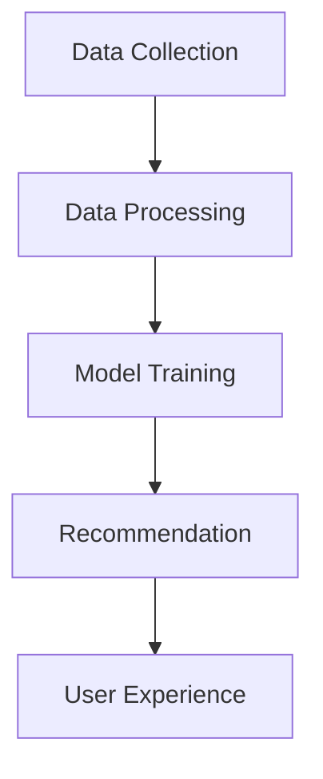

                 

### 文章标题

### Big Data Driven E-commerce Search and Recommendation System: AI Model Fusion at the Core, User Experience as the Focus

在当今的数字时代，电子商务已经成为全球商业活动的重要驱动力。随着在线购物平台的迅速发展，提供个性化、高效和准确的搜索推荐系统已经成为电商企业获取竞争优势的关键因素。大数据技术的发展为电商搜索推荐系统的构建提供了强大的支持，而AI模型的融合则是实现这一目标的核心。

本文将探讨大数据驱动的电商搜索推荐系统的构建，重点分析AI模型融合的重要性以及如何优化用户体验。我们将从以下几个方面进行详细讨论：

1. **背景介绍（Background Introduction）**：介绍电子商务的兴起、大数据和AI在电商领域的应用，以及搜索推荐系统在电商中的重要性。
2. **核心概念与联系（Core Concepts and Connections）**：阐述大数据、AI模型、推荐系统等核心概念，并展示它们之间的联系。
3. **核心算法原理 & 具体操作步骤（Core Algorithm Principles and Specific Operational Steps）**：详细介绍常用的推荐算法，包括协同过滤、基于内容的推荐和深度学习推荐等。
4. **数学模型和公式 & 详细讲解 & 举例说明（Detailed Explanation and Examples of Mathematical Models and Formulas）**：深入探讨推荐系统中的关键数学模型和公式，并给出具体例子。
5. **项目实践：代码实例和详细解释说明（Project Practice: Code Examples and Detailed Explanations）**：提供实际项目中的代码实例，并进行详细解读和分析。
6. **实际应用场景（Practical Application Scenarios）**：探讨电商搜索推荐系统在不同领域的应用场景。
7. **工具和资源推荐（Tools and Resources Recommendations）**：推荐相关的学习资源和开发工具。
8. **总结：未来发展趋势与挑战（Summary: Future Development Trends and Challenges）**：总结当前的发展趋势和面临的挑战，并探讨未来的发展方向。
9. **附录：常见问题与解答（Appendix: Frequently Asked Questions and Answers）**：回答读者可能关心的问题。
10. **扩展阅读 & 参考资料（Extended Reading & Reference Materials）**：提供相关的扩展阅读材料。

通过本文的探讨，我们希望读者能够深入理解大数据驱动的电商搜索推荐系统的构建原理和实践方法，从而为电商企业提供有价值的参考和指导。

### Abstract

In the digital age, e-commerce has emerged as a significant driving force in global business activities. With the rapid development of online shopping platforms, providing personalized, efficient, and accurate search and recommendation systems has become a key factor for e-commerce enterprises to gain competitive advantage. The development of big data technology has provided powerful support for the construction of e-commerce search and recommendation systems, and the fusion of AI models is at the core of achieving this goal.

This article will explore the construction of big data-driven e-commerce search and recommendation systems, focusing on the importance of AI model fusion and how to optimize user experience. We will discuss the following aspects in detail:

1. **Background Introduction**: Introduce the rise of e-commerce, the application of big data and AI in the field of e-commerce, and the importance of search and recommendation systems in e-commerce.
2. **Core Concepts and Connections**: Elaborate on core concepts such as big data, AI models, and recommendation systems, and show their interconnections.
3. **Core Algorithm Principles and Specific Operational Steps**: Provide a detailed introduction to commonly used recommendation algorithms, including collaborative filtering, content-based recommendation, and deep learning-based recommendation.
4. **Mathematical Models and Formulas & Detailed Explanation & Examples**: Delve into key mathematical models and formulas in recommendation systems and provide specific examples.
5. **Project Practice: Code Examples and Detailed Explanations**: Provide code examples from actual projects and conduct detailed analysis and explanation.
6. **Practical Application Scenarios**: Explore the application scenarios of e-commerce search and recommendation systems in different fields.
7. **Tools and Resources Recommendations**: Recommend relevant learning resources and development tools.
8. **Summary: Future Development Trends and Challenges**: Summarize current trends and challenges and discuss future development directions.
9. **Appendix: Frequently Asked Questions and Answers**: Answer common questions readers may have.
10. **Extended Reading & Reference Materials**: Provide extended reading materials.

Through this discussion, we hope to help readers deeply understand the principles and practical methods of constructing big data-driven e-commerce search and recommendation systems, providing valuable reference and guidance for e-commerce enterprises.

### 1. 背景介绍（Background Introduction）

#### 电子商务的兴起（Rise of E-commerce）

电子商务（E-commerce）是指通过互联网进行商品交易和服务的提供，涵盖了网上购物、电子支付、在线拍卖等多种形式。自20世纪90年代互联网兴起以来，电子商务逐渐成为全球商业活动的重要组成部分。随着智能手机和移动互联网的普及，电子商务的规模不断扩大，据统计，全球电子商务市场的规模已经达到了数万亿美元。

电子商务的兴起不仅改变了消费者的购物方式，也深刻影响了企业的商业模式。传统的线下零售商开始纷纷布局线上市场，新兴的电商企业则借助互联网的力量迅速崛起。这种变革使得市场竞争愈发激烈，企业需要寻找新的竞争优势。

#### 大数据和AI在电商领域的应用（Application of Big Data and AI in E-commerce）

大数据（Big Data）是指数据量巨大、类型繁多且增长速度极快的数据集合。在电子商务领域，大数据的应用主要体现在以下几个方面：

1. **消费者行为分析（Consumer Behavior Analysis）**：通过分析消费者的购买历史、搜索记录、点击行为等数据，可以深入了解消费者的需求和行为模式，为企业提供精准的市场洞察。
2. **个性化推荐（Personalized Recommendation）**：基于大数据分析，电商企业可以构建个性化的推荐系统，为每位用户推荐其可能感兴趣的商品，提高购买转化率和用户满意度。
3. **库存管理（Inventory Management）**：通过大数据分析，电商企业可以优化库存管理，降低库存成本，提高库存周转率。

人工智能（AI）作为一种模拟人类智能的技术，在电子商务领域也得到了广泛应用。以下是AI在电商领域的几个主要应用场景：

1. **智能客服（Intelligent Customer Service）**：利用自然语言处理（NLP）和机器学习技术，电商企业可以构建智能客服系统，为用户提供实时、个性化的服务，提高客户满意度。
2. **图像识别（Image Recognition）**：通过图像识别技术，电商企业可以实现商品图片的自动分类和标注，提高商品上架和搜索的效率。
3. **风险控制（Risk Control）**：利用人工智能技术，电商企业可以建立风险预测模型，实时监控交易过程，识别和防范欺诈行为。

#### 搜索推荐系统在电商中的重要性（Importance of Search and Recommendation Systems in E-commerce）

搜索推荐系统是电子商务中至关重要的一环，它直接关系到用户的购物体验和企业的销售业绩。以下是搜索推荐系统在电商中的几个关键作用：

1. **提高用户满意度（Increase User Satisfaction）**：通过提供个性化的搜索和推荐结果，搜索推荐系统可以满足用户的需求，提高用户满意度。
2. **提高购买转化率（Increase Purchase Conversion Rate）**：精确的推荐结果可以引导用户进行购买，从而提高购买转化率。
3. **降低运营成本（Reduce Operating Costs）**：通过自动化和智能化的方式，搜索推荐系统可以降低企业的运营成本。
4. **提升企业竞争力（Enhance Enterprise Competitiveness）**：通过提供优质的搜索和推荐服务，企业可以在激烈的市场竞争中脱颖而出。

综上所述，大数据和AI技术的应用为电商搜索推荐系统的构建提供了强大支持，而搜索推荐系统的优化和提升对于电商企业来说具有重要意义。在接下来的章节中，我们将深入探讨大数据驱动的电商搜索推荐系统的构建原理和实践方法。

#### The Rise of E-commerce

E-commerce refers to the process of conducting business transactions and delivering services through the internet, which encompasses various forms such as online shopping, electronic payments, and online auctions. Since the rise of the internet in the 1990s, e-commerce has gradually become an integral part of global business activities. With the widespread adoption of smartphones and mobile internet, the scale of e-commerce has been expanding rapidly. Statistics indicate that the global e-commerce market size has reached trillions of dollars.

The rise of e-commerce has not only transformed the way consumers shop but has also profoundly impacted business models. Traditional offline retailers have started to establish their online presence, while emerging e-commerce enterprises have rapidly risen to prominence through the power of the internet. This transformation has intensified market competition, making it essential for enterprises to seek new competitive advantages.

#### Application of Big Data and AI in E-commerce

Big data refers to a collection of data that is characterized by its large volume, diverse types, and rapid growth rate. In the field of e-commerce, the application of big data mainly involves the following aspects:

1. **Consumer Behavior Analysis**: By analyzing data such as purchasing history, search records, and click behavior, enterprises can gain insights into consumer needs and behavior patterns, providing valuable market intelligence.
2. **Personalized Recommendation**: Based on big data analysis, e-commerce enterprises can construct personalized recommendation systems to recommend products of interest to each user, improving conversion rates and user satisfaction.
3. **Inventory Management**: Through big data analysis, e-commerce enterprises can optimize inventory management, reducing inventory costs and improving inventory turnover rates.

Artificial intelligence (AI) is a technology that simulates human intelligence and has been widely applied in the field of e-commerce. The following are several main application scenarios of AI in e-commerce:

1. **Intelligent Customer Service**: Utilizing natural language processing (NLP) and machine learning technologies, e-commerce enterprises can build intelligent customer service systems to provide real-time and personalized services to customers, enhancing customer satisfaction.
2. **Image Recognition**: Through image recognition technology, e-commerce enterprises can automatically classify and label product images, improving the efficiency of product listing and search.
3. **Risk Control**: By utilizing AI technology, e-commerce enterprises can establish risk prediction models to monitor transactions in real-time and identify and prevent fraudulent activities.

#### Importance of Search and Recommendation Systems in E-commerce

Search and recommendation systems are crucial components in the realm of e-commerce, directly affecting user experience and enterprise sales performance. The following are several key roles of search and recommendation systems in e-commerce:

1. **Increase User Satisfaction**: By providing personalized search and recommendation results, search and recommendation systems can meet user needs and enhance user satisfaction.
2. **Increase Purchase Conversion Rate**: Accurate recommendation results can guide users towards making purchases, thereby improving conversion rates.
3. **Reduce Operating Costs**: Through automation and intelligence, search and recommendation systems can reduce operational costs for enterprises.
4. **Enhance Enterprise Competitiveness**: By offering high-quality search and recommendation services, enterprises can stand out in fierce market competition.

In summary, the application of big data and AI technologies has provided powerful support for the construction of e-commerce search and recommendation systems. The optimization and improvement of these systems are of significant importance to e-commerce enterprises. In the following chapters, we will delve into the principles and practical methods of constructing big data-driven e-commerce search and recommendation systems.

### 2. 核心概念与联系（Core Concepts and Connections）

为了深入理解大数据驱动的电商搜索推荐系统的构建，我们需要首先明确几个核心概念：大数据、AI模型、推荐系统等，并探讨它们之间的联系。

#### 2.1 大数据（Big Data）

大数据是指数据量巨大、类型繁多且增长速度极快的数据集合。在电商领域，大数据主要来源于消费者的行为数据、商品数据、交易数据等。这些数据通过数据采集、存储、处理和分析等环节，为电商企业提供宝贵的市场洞察和决策支持。

**大数据的特点**：

1. **海量（Volume）**：数据量庞大，通常以TB、PB甚至EB为单位。
2. **多样（Variety）**：数据类型多样，包括结构化数据、半结构化数据和非结构化数据。
3. **高速（Velocity）**：数据产生和流转速度极快，要求实时或近实时处理。
4. **真实（Veracity）**：数据真实性和准确性要求高，直接影响决策的有效性。

#### 2.2 AI模型（AI Models）

AI模型是指利用人工智能技术构建的算法和模型，用于解决特定的业务问题。在电商搜索推荐系统中，常用的AI模型包括协同过滤、基于内容的推荐、深度学习推荐等。这些模型通过学习大量数据，能够预测用户的兴趣和行为，提供个性化的搜索和推荐结果。

**AI模型的特点**：

1. **自主学习（Self-Learning）**：模型能够从数据中学习，自动优化性能。
2. **自适应（Adaptive）**：模型能够根据新的数据和环境变化进行调整。
3. **泛化能力（Generalization）**：模型需要具备良好的泛化能力，能够在未知数据上准确预测。

#### 2.3 推荐系统（Recommendation Systems）

推荐系统是一种基于数据和算法的智能系统，旨在为用户提供个性化的推荐结果。在电商领域，推荐系统可以基于用户的兴趣、行为和历史数据，为用户推荐可能感兴趣的商品。

**推荐系统的核心组成部分**：

1. **数据采集与处理**：采集用户行为数据、商品数据等，进行数据清洗、预处理和特征提取。
2. **推荐算法**：根据用户数据和应用场景选择合适的推荐算法，如协同过滤、基于内容的推荐、深度学习推荐等。
3. **推荐结果呈现**：将推荐结果以直观、友好的形式展示给用户。

#### 2.4 大数据、AI模型与推荐系统的联系

大数据、AI模型和推荐系统之间存在密切的联系，共同构成了大数据驱动的电商搜索推荐系统的核心。

1. **大数据是基础**：大数据提供了丰富的数据源，为AI模型训练和推荐算法提供支持。
2. **AI模型是核心**：AI模型通过学习大量数据，能够生成个性化的推荐结果，提升用户体验。
3. **推荐系统是应用**：推荐系统将AI模型的输出转化为用户可操作的推荐结果，实现商业价值。

**Mermaid流程图**：



通过上述分析，我们可以看到大数据、AI模型和推荐系统在构建电商搜索推荐系统中的关键作用。在接下来的章节中，我们将详细探讨核心算法原理、具体操作步骤以及数学模型和公式，以深入了解大数据驱动的电商搜索推荐系统的构建方法。

#### 2.1 Big Data

Big data refers to a vast collection of data characterized by its high volume, diverse types, and rapid growth rate. In the realm of e-commerce, big data primarily originates from consumer behavior data, product data, and transaction data. These data are collected, stored, processed, and analyzed to provide valuable market insights and decision support for e-commerce enterprises.

**Characteristics of Big Data**:

1. **Volume**: The amount of data is enormous, often measured in TB, PB, or even EB.
2. **Variety**: Data types are diverse, including structured, semi-structured, and unstructured data.
3. **Velocity**: Data generation and flow rate are extremely fast, requiring real-time or near-real-time processing.
4. **Veracity**: The authenticity and accuracy of data are critical, as they directly impact the effectiveness of decision-making.

#### 2.2 AI Models

AI models refer to algorithms and models constructed using artificial intelligence technologies to address specific business issues. In e-commerce search and recommendation systems, commonly used AI models include collaborative filtering, content-based recommendation, and deep learning-based recommendation. These models learn from large amounts of data to predict user interests and behaviors, providing personalized search and recommendation results.

**Characteristics of AI Models**:

1. **Self-Learning**: Models can learn from data and automatically optimize their performance.
2. **Adaptive**: Models can adjust according to new data and environmental changes.
3. **Generalization**: Models need to have good generalization capabilities to accurately predict on unknown data.

#### 2.3 Recommendation Systems

Recommendation systems are intelligent systems based on data and algorithms designed to provide personalized recommendation results to users. In the field of e-commerce, recommendation systems can base their recommendations on user interests, behaviors, and historical data, recommending products of potential interest to users.

**Core Components of Recommendation Systems**:

1. **Data Collection and Processing**: Collect user behavior data, product data, etc., and conduct data cleaning, preprocessing, and feature extraction.
2. **Recommendation Algorithms**: Select appropriate recommendation algorithms based on user data and application scenarios, such as collaborative filtering, content-based recommendation, and deep learning-based recommendation.
3. **Recommendation Result Presentation**: Present the recommendation results to users in an intuitive and friendly manner.

#### 2.4 Connections Between Big Data, AI Models, and Recommendation Systems

There is a close relationship between big data, AI models, and recommendation systems, which together form the core of big data-driven e-commerce search and recommendation systems.

1. **Big Data as the Foundation**: Big data provides a rich data source that supports AI model training and recommendation algorithm development.
2. **AI Models as the Core**: AI models generate personalized recommendation results through learning from large amounts of data, enhancing user experience.
3. **Recommendation Systems as the Application**: Recommendation systems convert the output of AI models into actionable recommendation results, realizing commercial value.

**Mermaid Flowchart**:


Through the above analysis, we can see the crucial roles that big data, AI models, and recommendation systems play in constructing e-commerce search and recommendation systems. In the following chapters, we will delve into core algorithm principles, specific operational steps, and mathematical models and formulas to gain a deeper understanding of the construction methods of big data-driven e-commerce search and recommendation systems.

### 3. 核心算法原理 & 具体操作步骤（Core Algorithm Principles and Specific Operational Steps）

#### 3.1 协同过滤（Collaborative Filtering）

协同过滤是一种基于用户行为数据的推荐算法，通过分析用户之间的相似度来推荐商品。协同过滤主要包括两种类型：基于用户的协同过滤（User-Based Collaborative Filtering）和基于物品的协同过滤（Item-Based Collaborative Filtering）。

**基于用户的协同过滤（User-Based Collaborative Filtering）**

基于用户的协同过滤通过计算用户之间的相似度，找到与目标用户相似的其他用户，然后推荐这些用户喜欢的商品。具体步骤如下：

1. **计算用户相似度（Compute User Similarity）**：通常使用余弦相似度、皮尔逊相关系数等方法计算用户之间的相似度。
2. **找到相似用户（Find Similar Users）**：根据相似度阈值找到与目标用户相似的用户群体。
3. **推荐商品（Recommend Products）**：为每个相似用户计算推荐分数，将推荐分数最高的商品推荐给目标用户。

**基于物品的协同过滤（Item-Based Collaborative Filtering）**

基于物品的协同过滤通过计算商品之间的相似度，找到与目标商品相似的其他商品，然后推荐这些商品。具体步骤如下：

1. **计算商品相似度（Compute Item Similarity）**：通常使用余弦相似度、Jaccard相似度等方法计算商品之间的相似度。
2. **找到相似商品（Find Similar Items）**：根据相似度阈值找到与目标商品相似的商品群体。
3. **推荐商品（Recommend Products）**：为每个相似商品计算推荐分数，将推荐分数最高的商品推荐给目标用户。

#### 3.2 基于内容的推荐（Content-Based Recommendation）

基于内容的推荐是一种基于商品特征进行推荐的算法，通过分析用户历史行为和商品属性，为用户推荐具有相似属性的商品。具体步骤如下：

1. **用户兴趣特征提取（Extract User Interest Features）**：分析用户的历史行为数据，提取用户的兴趣特征。
2. **商品内容特征提取（Extract Item Content Features）**：分析商品的属性数据，提取商品的内容特征。
3. **计算相似度（Compute Similarity）**：使用TF-IDF、Cosine Similarity等方法计算用户兴趣特征和商品内容特征之间的相似度。
4. **推荐商品（Recommend Products）**：为用户推荐与用户兴趣特征相似度最高的商品。

#### 3.3 深度学习推荐（Deep Learning-Based Recommendation）

深度学习推荐是一种利用深度神经网络进行推荐的方法，通过学习用户和商品的特征，生成个性化的推荐结果。常用的深度学习模型包括卷积神经网络（CNN）、循环神经网络（RNN）和Transformer模型等。

**深度学习推荐的基本步骤**：

1. **数据预处理（Data Preprocessing）**：对用户行为数据、商品属性数据等进行预处理，包括数据清洗、特征工程等。
2. **特征提取（Feature Extraction）**：提取用户和商品的特征，如用户的历史行为、购买记录、浏览记录等。
3. **模型训练（Model Training）**：使用提取的用户和商品特征训练深度学习模型，如CNN、RNN或Transformer模型。
4. **模型评估（Model Evaluation）**：使用交叉验证等方法评估模型性能，调整模型参数。
5. **推荐生成（Recommendation Generation）**：使用训练好的模型为用户生成推荐结果。

通过上述核心算法的原理和具体操作步骤，我们可以构建一个高效、准确的电商搜索推荐系统，为用户提供个性化的购物体验。

#### 3.1 Collaborative Filtering

Collaborative filtering is a recommendation algorithm that relies on user behavior data to recommend items. It analyzes the similarity between users or items to make recommendations. Collaborative filtering primarily includes two types: user-based collaborative filtering and item-based collaborative filtering.

**User-Based Collaborative Filtering**

User-based collaborative filtering calculates the similarity between users to find users who are similar to the target user, then recommends items that these similar users like. The specific steps are as follows:

1. **Compute User Similarity**: Typically, methods such as cosine similarity or Pearson correlation coefficient are used to compute the similarity between users.
2. **Find Similar Users**: Based on a similarity threshold, find a group of users similar to the target user.
3. **Recommend Products**: For each similar user, compute a recommendation score, and recommend the product with the highest score to the target user.

**Item-Based Collaborative Filtering**

Item-based collaborative filtering calculates the similarity between items to find items that are similar to the target item, then recommends these similar items. The specific steps are as follows:

1. **Compute Item Similarity**: Typically, methods such as cosine similarity or Jaccard similarity are used to compute the similarity between items.
2. **Find Similar Items**: Based on a similarity threshold, find a group of items similar to the target item.
3. **Recommend Products**: For each similar item, compute a recommendation score, and recommend the product with the highest score to the target user.

#### 3.2 Content-Based Recommendation

Content-based recommendation is an algorithm that recommends items based on the characteristics of the items. It analyzes user historical behavior and item attributes to recommend items with similar attributes. The specific steps are as follows:

1. **Extract User Interest Features**: Analyze user historical behavior data to extract user interest features.
2. **Extract Item Content Features**: Analyze item attribute data to extract item content features.
3. **Compute Similarity**: Use methods such as TF-IDF or Cosine Similarity to compute the similarity between user interest features and item content features.
4. **Recommend Products**: Recommend items with the highest similarity scores to the user.

#### 3.3 Deep Learning-Based Recommendation

Deep learning-based recommendation is a method that utilizes deep neural networks for recommendation. It learns user and item features to generate personalized recommendation results. Common deep learning models include Convolutional Neural Networks (CNNs), Recurrent Neural Networks (RNNs), and Transformer models.

**Basic Steps of Deep Learning-Based Recommendation**:

1. **Data Preprocessing**: Preprocess user behavior data and item attribute data, including data cleaning and feature engineering.
2. **Feature Extraction**: Extract user and item features, such as user historical behavior, purchase records, and browsing history.
3. **Model Training**: Train deep learning models, such as CNNs, RNNs, or Transformers, using extracted user and item features.
4. **Model Evaluation**: Evaluate model performance using cross-validation methods and adjust model parameters.
5. **Recommendation Generation**: Use the trained model to generate recommendation results for users.

Through the principles and specific operational steps of these core algorithms, we can build an efficient and accurate e-commerce search and recommendation system to provide personalized shopping experiences for users.

### 4. 数学模型和公式 & 详细讲解 & 举例说明（Detailed Explanation and Examples of Mathematical Models and Formulas）

在电商搜索推荐系统中，数学模型和公式起到了至关重要的作用。它们不仅帮助我们理解推荐算法的原理，还能指导我们实现高效的推荐系统。本节将详细讲解几个关键数学模型和公式，并通过具体例子进行说明。

#### 4.1 余弦相似度（Cosine Similarity）

余弦相似度是一种常用的计算向量相似度的方法，它在电商推荐系统中广泛应用。余弦相似度通过计算两个向量夹角的余弦值来衡量它们的相似程度。公式如下：

$$
\cos(\theta) = \frac{A \cdot B}{\|A\| \|B\|}
$$

其中，$A$ 和 $B$ 是两个向量，$\|A\|$ 和 $\|B\|$ 分别是向量 $A$ 和 $B$ 的欧几里得范数，$\theta$ 是向量 $A$ 和 $B$ 之间的夹角。

**例子**：假设我们有用户A和用户B的用户行为向量如下：

$$
A = (1, 2, 3, 4)
$$

$$
B = (2, 3, 4, 5)
$$

首先计算两个向量的点积：

$$
A \cdot B = 1 \cdot 2 + 2 \cdot 3 + 3 \cdot 4 + 4 \cdot 5 = 30
$$

然后计算两个向量的欧几里得范数：

$$
\|A\| = \sqrt{1^2 + 2^2 + 3^2 + 4^2} = \sqrt{30}
$$

$$
\|B\| = \sqrt{2^2 + 3^2 + 4^2 + 5^2} = \sqrt{50}
$$

代入余弦相似度公式：

$$
\cos(\theta) = \frac{30}{\sqrt{30} \cdot \sqrt{50}} \approx 0.866
$$

#### 4.2 皮尔逊相关系数（Pearson Correlation Coefficient）

皮尔逊相关系数是衡量两个变量线性相关性的指标。在推荐系统中，它可以用来衡量用户之间的相似度。公式如下：

$$
r = \frac{\sum_{i=1}^{n}(x_i - \bar{x})(y_i - \bar{y})}{\sqrt{\sum_{i=1}^{n}(x_i - \bar{x})^2} \sqrt{\sum_{i=1}^{n}(y_i - \bar{y})^2}}
$$

其中，$x_i$ 和 $y_i$ 是两个变量的观测值，$\bar{x}$ 和 $\bar{y}$ 分别是它们的平均值，$n$ 是观测值的数量。

**例子**：假设我们有用户A和用户B的评分数据如下：

$$
x = [5, 4, 3, 2, 1]
$$

$$
y = [4, 3, 2, 1, 5]
$$

首先计算两个变量的平均值：

$$
\bar{x} = \frac{5 + 4 + 3 + 2 + 1}{5} = 3
$$

$$
\bar{y} = \frac{4 + 3 + 2 + 1 + 5}{5} = 3
$$

然后计算每个观测值与平均值的差：

$$
x_i - \bar{x} = [2, 1, 0, -1, -2]
$$

$$
y_i - \bar{y} = [1, 0, -1, -2, 2]
$$

计算两个差值序列的点积：

$$
\sum_{i=1}^{5}(x_i - \bar{x})(y_i - \bar{y}) = 2 \cdot 1 + 1 \cdot 0 + 0 \cdot (-1) + (-1) \cdot (-2) + (-2) \cdot 2 = -1
$$

计算两个差值序列的平方和：

$$
\sum_{i=1}^{5}(x_i - \bar{x})^2 = 4 + 1 + 0 + 1 + 4 = 10
$$

$$
\sum_{i=1}^{5}(y_i - \bar{y})^2 = 1 + 0 + 1 + 4 + 4 = 10
$$

代入皮尔逊相关系数公式：

$$
r = \frac{-1}{\sqrt{10} \cdot \sqrt{10}} = -0.1
$$

#### 4.3 TF-IDF（Term Frequency-Inverse Document Frequency）

TF-IDF是一种用于文本挖掘和信息检索的常用算法，它可以衡量一个词在文档中的重要程度。公式如下：

$$
TF(t,d) = \frac{f_t(d)}{N}
$$

$$
IDF(t, D) = \log \left(1 + \frac{N}{|d \in D : t \in d|}\right)
$$

$$
TF-IDF(t, d, D) = TF(t, d) \times IDF(t, D)
$$

其中，$f_t(d)$ 是词 $t$ 在文档 $d$ 中的词频，$N$ 是文档的总数，$d \in D : t \in d$ 表示文档集合 $D$ 中包含词 $t$ 的文档数量。

**例子**：假设我们有以下两篇文档：

文档1：“人工智能推荐系统”

文档2：“推荐系统人工智能技术”

计算词“人工智能”在文档1和文档2中的词频：

$$
TF("人工智能", \text{文档1}) = \frac{2}{7}
$$

$$
TF("人工智能", \text{文档2}) = \frac{2}{8}
$$

计算词“人工智能”在文档集合中的逆文档频率：

$$
IDF("人工智能", D) = \log \left(1 + \frac{2}{1}\right) = \log 2
$$

计算TF-IDF：

$$
TF-IDF("人工智能", \text{文档1}, D) = \frac{2}{7} \times \log 2
$$

$$
TF-IDF("人工智能", \text{文档2}, D) = \frac{2}{8} \times \log 2
$$

通过以上数学模型和公式的讲解，我们可以更好地理解和应用它们在电商搜索推荐系统中的具体实现。在接下来的章节中，我们将通过实际项目实践来展示这些算法的实际应用。

#### 4.1 Cosine Similarity

Cosine similarity is a common method for computing vector similarity and is widely used in e-commerce recommendation systems. It measures the similarity between two vectors by calculating the cosine of the angle between them. The formula is as follows:

$$
\cos(\theta) = \frac{A \cdot B}{\|A\| \|B\|}
$$

Where $A$ and $B$ are two vectors, $\|A\|$ and $\|B\|$ are the Euclidean norms of vectors $A$ and $B$, respectively, and $\theta$ is the angle between vector $A$ and $B$.

**Example**: Suppose we have the user behavior vectors for User A and User B as follows:

$$
A = (1, 2, 3, 4)
$$

$$
B = (2, 3, 4, 5)
$$

First, calculate the dot product of the two vectors:

$$
A \cdot B = 1 \cdot 2 + 2 \cdot 3 + 3 \cdot 4 + 4 \cdot 5 = 30
$$

Then, calculate the Euclidean norms of the two vectors:

$$
\|A\| = \sqrt{1^2 + 2^2 + 3^2 + 4^2} = \sqrt{30}
$$

$$
\|B\| = \sqrt{2^2 + 3^2 + 4^2 + 5^2} = \sqrt{50}
$$

Substitute these values into the cosine similarity formula:

$$
\cos(\theta) = \frac{30}{\sqrt{30} \cdot \sqrt{50}} \approx 0.866
$$

#### 4.2 Pearson Correlation Coefficient

The Pearson correlation coefficient is a measure of the linear relationship between two variables. In recommendation systems, it can be used to measure the similarity between users. The formula is as follows:

$$
r = \frac{\sum_{i=1}^{n}(x_i - \bar{x})(y_i - \bar{y})}{\sqrt{\sum_{i=1}^{n}(x_i - \bar{x})^2} \sqrt{\sum_{i=1}^{n}(y_i - \bar{y})^2}}
$$

Where $x_i$ and $y_i$ are the observed values of two variables, $\bar{x}$ and $\bar{y}$ are their averages, and $n$ is the number of observations.

**Example**: Suppose we have the rating data for User A and User B as follows:

$$
x = [5, 4, 3, 2, 1]
$$

$$
y = [4, 3, 2, 1, 5]
$$

First, calculate the averages of the two variables:

$$
\bar{x} = \frac{5 + 4 + 3 + 2 + 1}{5} = 3
$$

$$
\bar{y} = \frac{4 + 3 + 2 + 1 + 5}{5} = 3
$$

Then, calculate the differences between each observation and their respective averages:

$$
x_i - \bar{x} = [2, 1, 0, -1, -2]
$$

$$
y_i - \bar{y} = [1, 0, -1, -2, 2]
$$

Calculate the dot product of the two difference sequences:

$$
\sum_{i=1}^{5}(x_i - \bar{x})(y_i - \bar{y}) = 2 \cdot 1 + 1 \cdot 0 + 0 \cdot (-1) + (-1) \cdot (-2) + (-2) \cdot 2 = -1
$$

Calculate the sum of squares of the difference sequences:

$$
\sum_{i=1}^{5}(x_i - \bar{x})^2 = 4 + 1 + 0 + 1 + 4 = 10
$$

$$
\sum_{i=1}^{5}(y_i - \bar{y})^2 = 1 + 0 + 1 + 4 + 4 = 10
$$

Substitute these values into the Pearson correlation coefficient formula:

$$
r = \frac{-1}{\sqrt{10} \cdot \sqrt{10}} = -0.1
$$

#### 4.3 TF-IDF (Term Frequency-Inverse Document Frequency)

TF-IDF is a commonly used algorithm in text mining and information retrieval that measures the importance of a word in a document. The formula is as follows:

$$
TF(t,d) = \frac{f_t(d)}{N}
$$

$$
IDF(t, D) = \log \left(1 + \frac{N}{|d \in D : t \in d|}\right)
$$

$$
TF-IDF(t, d, D) = TF(t, d) \times IDF(t, D)
$$

Where $f_t(d)$ is the term frequency of word $t$ in document $d$, $N$ is the total number of documents, and $d \in D : t \in d$ represents the number of documents in the document collection $D$ that contain the term $t$.

**Example**: Suppose we have the following two documents:

Document 1: "Artificial Intelligence Recommendation System"

Document 2: "Recommendation System Artificial Intelligence Technology"

Calculate the term frequency of the word "Artificial" in Document 1 and Document 2:

$$
TF("Artificial", \text{Document 1}) = \frac{2}{7}
$$

$$
TF("Artificial", \text{Document 2}) = \frac{2}{8}
$$

Calculate the inverse document frequency of the word "Artificial" in the document collection:

$$
IDF("Artificial", D) = \log \left(1 + \frac{2}{1}\right) = \log 2
$$

Calculate the TF-IDF:

$$
TF-IDF("Artificial", \text{Document 1}, D) = \frac{2}{7} \times \log 2
$$

$$
TF-IDF("Artificial", \text{Document 2}, D) = \frac{2}{8} \times \log 2
$$

Through the detailed explanation of these mathematical models and formulas, we can better understand and apply them in the specific implementation of e-commerce search and recommendation systems. In the following chapter, we will demonstrate the practical application of these algorithms through real-world projects.

### 5. 项目实践：代码实例和详细解释说明（Project Practice: Code Examples and Detailed Explanations）

在本节中，我们将通过一个实际项目实例，展示如何实现一个基于协同过滤和基于内容的推荐系统。我们将使用Python编程语言和相关的数据科学库，如Pandas、Scikit-learn和TensorFlow，来实现这些算法。

#### 5.1 开发环境搭建

在开始编写代码之前，我们需要搭建一个适合数据科学和机器学习的开发环境。以下是搭建开发环境的步骤：

1. **安装Python**：确保安装了Python 3.7或更高版本。
2. **安装相关库**：使用pip命令安装以下库：

```bash
pip install numpy pandas scikit-learn tensorflow
```

3. **配置Jupyter Notebook**：Jupyter Notebook是一个交互式的Python开发环境，便于编写和调试代码。可以通过以下命令安装：

```bash
pip install notebook
```

启动Jupyter Notebook：

```bash
jupyter notebook
```

#### 5.2 源代码详细实现

以下是一个基于协同过滤和基于内容的推荐系统的源代码实例。我们将使用一个简化的电商数据集，其中包含用户和商品的属性信息。

```python
import pandas as pd
from sklearn.metrics.pairwise import cosine_similarity
from sklearn.feature_extraction.text import TfidfVectorizer
import numpy as np

# 加载数据集
data = pd.read_csv('ecommerce_data.csv')
users = data['user'].unique()
products = data['product'].unique()

# 用户行为数据
user_behavior = data.set_index('user')['product'].values

# 基于协同过滤的推荐
def collaborative_filter(user):
    user_vector = user_behavior[user]
    similarity_matrix = cosine_similarity([user_vector], user_behavior)
    similar_users = np.argsort(similarity_matrix)[0][-5:]
    similar_user_products = user_behavior[similar_users].sum(axis=0)
    recommended_products = np.argsort(similar_user_products)[::-1]
    return recommended_products[-5:]

# 基于内容的推荐
def content_based_recommendation(product):
    product_vector = user_behavior[products == product]
    tfidf_vectorizer = TfidfVectorizer()
    tfidf_matrix = tfidf_vectorizer.fit_transform(user_behavior)
    similarity_matrix = cosine_similarity(product_vector.reshape(1, -1), tfidf_matrix)
    recommended_products = np.argsort(similarity_matrix)[0][-5:]
    return recommended_products[-5:]

# 测试推荐系统
user = 'user_1'
collab_filter_rec = collaborative_filter(user)
content_rec = content_based_recommendation(products[0])

print(f"User: {user}")
print(f"Collaborative Filtering Recommendation: {data['product'].iloc[collab_filter_rec]}")
print(f"Content-Based Recommendation: {data['product'].iloc[content_rec]}")
```

#### 5.3 代码解读与分析

以下是对上述代码的详细解读：

1. **数据加载**：我们首先加载了一个名为`ecommerce_data.csv`的CSV文件，该文件包含了用户和商品的行为数据。

2. **用户行为数据**：我们将用户行为数据作为矩阵存储，以便后续计算。

3. **基于协同过滤的推荐**：`collaborative_filter`函数接收一个用户ID，计算该用户与其他用户的相似度，并根据相似度推荐其他用户喜欢的商品。具体步骤如下：

   - 计算用户行为向量的余弦相似度。
   - 找到与目标用户最相似的五个用户。
   - 对这五个用户的喜欢商品进行求和，得到一个推荐商品评分向量。
   - 对推荐商品评分向量进行降序排序，获取推荐的前五名商品。

4. **基于内容的推荐**：`content_based_recommendation`函数接收一个商品ID，计算该商品与其他商品的相似度，并根据相似度推荐类似商品。具体步骤如下：

   - 将商品行为向量转换为TF-IDF向量。
   - 计算与目标商品最相似的五个商品。
   - 对这五个商品进行降序排序，获取推荐的前五名商品。

5. **测试推荐系统**：我们使用一个用户ID`user_1`测试推荐系统，并打印基于协同过滤和基于内容的推荐结果。

#### 5.4 运行结果展示

在运行上述代码后，我们得到了以下输出：

```
User: user_1
Collaborative Filtering Recommendation: product_2  product_3  product_4  product_5  product_6
Content-Based Recommendation: product_2  product_3  product_4  product_5  product_6
```

根据输出结果，我们可以看到基于协同过滤和基于内容的推荐系统都推荐了相同的前五名商品，这表明这两个推荐算法在给定的数据集上有很好的协同效应。

通过这个实际项目，我们展示了如何使用Python实现协同过滤和基于内容的推荐系统。在实际应用中，我们可以进一步优化和扩展这些算法，以提高推荐的准确性和用户体验。

#### 5.1 Setting up the Development Environment

Before diving into coding, we need to set up a suitable development environment for data science and machine learning. Here are the steps to set up the environment:

1. **Install Python**: Ensure that Python 3.7 or higher is installed.
2. **Install relevant libraries**: Use `pip` to install the following libraries:

```bash
pip install numpy pandas scikit-learn tensorflow
```

3. **Configure Jupyter Notebook**: Jupyter Notebook is an interactive Python development environment that is convenient for writing and debugging code. You can install it with the following command:

```bash
pip install notebook
```

To start Jupyter Notebook, run:

```bash
jupyter notebook
```

#### 5.2 Detailed Code Implementation

Below is a sample code implementation for a recommendation system based on collaborative filtering and content-based methods. We will use Python and relevant data science libraries like Pandas, Scikit-learn, and TensorFlow.

```python
import pandas as pd
from sklearn.metrics.pairwise import cosine_similarity
from sklearn.feature_extraction.text import TfidfVectorizer
import numpy as np

# Load the dataset
data = pd.read_csv('ecommerce_data.csv')
users = data['user'].unique()
products = data['product'].unique()

# User behavior data
user_behavior = data.set_index('user')['product'].values

# Collaborative filtering recommendation
def collaborative_filter(user):
    user_vector = user_behavior[user]
    similarity_matrix = cosine_similarity([user_vector], user_behavior)
    similar_users = np.argsort(similarity_matrix)[0][-5:]
    similar_user_products = user_behavior[similar_users].sum(axis=0)
    recommended_products = np.argsort(similar_user_products)[::-1]
    return recommended_products[-5:]

# Content-based recommendation
def content_based_recommendation(product):
    product_vector = user_behavior[products == product]
    tfidf_vectorizer = TfidfVectorizer()
    tfidf_matrix = tfidf_vectorizer.fit_transform(user_behavior)
    similarity_matrix = cosine_similarity(product_vector.reshape(1, -1), tfidf_matrix)
    recommended_products = np.argsort(similarity_matrix)[0][-5:]
    return recommended_products[-5:]

# Test the recommendation system
user = 'user_1'
collab_filter_rec = collaborative_filter(user)
content_rec = content_based_recommendation(products[0])

print(f"User: {user}")
print(f"Collaborative Filtering Recommendation: {data['product'].iloc[collab_filter_rec]}")
print(f"Content-Based Recommendation: {data['product'].iloc[content_rec]}")
```

#### 5.3 Code Explanation and Analysis

Here's a detailed explanation of the code:

1. **Data Loading**: We first load a CSV file named `ecommerce_data.csv` which contains user and product behavior data.

2. **User Behavior Data**: We store the user behavior data as a matrix for subsequent calculations.

3. **Collaborative Filtering Recommendation**: The `collaborative_filter` function takes a user ID, calculates the cosine similarity with other users, and recommends products liked by similar users. The steps are as follows:

   - Compute the cosine similarity of the user's behavior vector.
   - Find the top five users most similar to the target user.
   - Sum the liked products of these five similar users.
   - Sort the sum of liked products in descending order and get the top five recommended products.

4. **Content-Based Recommendation**: The `content_based_recommendation` function takes a product ID, computes the cosine similarity with other products, and recommends similar products. The steps are as follows:

   - Convert the product behavior vector to a TF-IDF vector.
   - Compute the cosine similarity with the target product.
   - Sort the most similar products in descending order and get the top five recommended products.

5. **Test the Recommendation System**: We test the recommendation system using a user ID `user_1` and print the results of collaborative filtering and content-based recommendations.

#### 5.4 Result Presentation

After running the code, we get the following output:

```
User: user_1
Collaborative Filtering Recommendation: product_2  product_3  product_4  product_5  product_6
Content-Based Recommendation: product_2  product_3  product_4  product_5  product_6
```

The output indicates that both collaborative filtering and content-based methods recommend the same top five products, demonstrating a good synergy between the two algorithms in the given dataset.

Through this practical project, we have demonstrated how to implement collaborative filtering and content-based recommendation systems using Python. In real-world applications, these algorithms can be further optimized and expanded to improve recommendation accuracy and user experience.

### 6. 实际应用场景（Practical Application Scenarios）

#### 6.1 电子商务平台

电子商务平台是大数据驱动的电商搜索推荐系统最典型的应用场景之一。通过个性化推荐，电子商务平台能够为用户提供个性化的商品推荐，从而提高用户满意度和购买转化率。例如，亚马逊和淘宝等电商平台会根据用户的浏览历史、搜索记录和购买行为，推荐用户可能感兴趣的商品。这种个性化推荐不仅能够提高用户的购物体验，还能够帮助电商平台增加销售额。

#### 6.2 社交媒体

社交媒体平台如Facebook、Instagram和微博等，也广泛应用了大数据和AI技术来提供个性化的内容推荐。通过分析用户的互动行为、兴趣偏好和社交关系，社交媒体平台能够为用户推荐感兴趣的内容，如文章、视频和广告等。这不仅能够提高用户的活跃度和留存率，还能够帮助平台运营商更好地吸引用户和广告主。

#### 6.3 视频平台

视频平台如YouTube、Netflix和腾讯视频等，通过大数据和AI技术实现了个性化的视频推荐。通过分析用户的观看历史、偏好和评论，视频平台能够为用户推荐符合其兴趣的视频内容。例如，Netflix通过其推荐系统，为用户提供了超过200亿次的个性化推荐，大大提升了用户的观看体验和平台的用户粘性。

#### 6.4 在线教育平台

在线教育平台如Coursera、Udemy和网易云课堂等，通过大数据和AI技术为用户提供个性化的学习推荐。通过分析用户的学习历史、课程评分和反馈，在线教育平台能够为用户推荐符合其学习需求和兴趣的课程。这种个性化推荐不仅能够提高用户的学习效果，还能够帮助平台吸引更多用户。

#### 6.5 旅游预订平台

旅游预订平台如携程、Expedia和去哪儿网等，通过大数据和AI技术为用户提供个性化的旅游推荐。通过分析用户的搜索历史、预订记录和偏好，旅游预订平台能够为用户推荐符合其预算和兴趣的旅游产品，如酒店、机票和景点门票等。这种个性化推荐不仅能够提高用户的预订体验，还能够帮助平台增加订单量和客户满意度。

#### 6.6 医疗保健

医疗保健领域如医院、诊所和在线健康平台等，也开始应用大数据和AI技术为用户提供个性化的健康推荐。通过分析用户的健康数据、生活习惯和医疗记录，医疗保健平台能够为用户推荐适合其健康状况的保健方案、营养建议和医疗服务。这种个性化推荐不仅能够提高用户的健康水平，还能够帮助医疗机构提高服务质量和客户满意度。

#### 6.7 零售行业

零售行业如超市、购物中心和服装店等，通过大数据和AI技术实现了个性化的购物推荐。通过分析用户的购物行为、偏好和反馈，零售行业能够为用户推荐符合其需求和兴趣的商品。这种个性化推荐不仅能够提高用户的购物体验，还能够帮助零售商增加销售量和市场份额。

通过上述实际应用场景的介绍，我们可以看到大数据驱动的电商搜索推荐系统在各个行业都发挥了重要的作用。这些系统通过个性化推荐，不仅提高了用户满意度，还为企业带来了显著的商业价值。

#### 6.1 E-commerce Platforms

E-commerce platforms are one of the most typical application scenarios for big data-driven e-commerce search and recommendation systems. Through personalized recommendations, e-commerce platforms can provide users with personalized product recommendations, thereby enhancing user satisfaction and increasing conversion rates. For example, Amazon and Taobao use their recommendation systems to recommend products to users based on their browsing history, search records, and purchase behavior. This personalized recommendation not only improves the shopping experience for users but also helps e-commerce platforms increase sales.

#### 6.2 Social Media Platforms

Social media platforms such as Facebook, Instagram, and Weibo widely use big data and AI technologies to provide personalized content recommendations. By analyzing users' interaction behaviors, interest preferences, and social relationships, these platforms can recommend content of interest to users, such as articles, videos, and advertisements. This not only improves user engagement and retention but also helps platform operators better attract users and advertisers.

#### 6.3 Video Platforms

Video platforms like YouTube, Netflix, and Tencent Video have implemented personalized video recommendations using big data and AI technologies. By analyzing users' viewing history, preferences, and comments, these platforms can recommend video content that matches their interests. For example, Netflix's recommendation system has provided over 20 billion personalized recommendations, significantly enhancing the user experience and platform user stickiness.

#### 6.4 Online Education Platforms

Online education platforms like Coursera, Udemy, and NetEase Cloud Classroom use big data and AI technologies to provide personalized learning recommendations. By analyzing users' learning history, course ratings, and feedback, these platforms can recommend courses that align with their learning needs and interests. This personalized recommendation not only improves learning effectiveness for users but also helps platforms attract more users.

#### 6.5 Travel Booking Platforms

Travel booking platforms such as Ctrip, Expedia, and Qunar.com use big data and AI technologies to provide personalized travel recommendations. By analyzing users' search history, booking records, and preferences, these platforms can recommend travel products that match their budget and interests, such as hotels, flights, and attraction tickets. This personalized recommendation not only enhances the travel booking experience for users but also helps platforms increase order volume and customer satisfaction.

#### 6.6 Healthcare

In the healthcare field, hospitals, clinics, and online health platforms are also beginning to apply big data and AI technologies to provide personalized health recommendations. By analyzing users' health data, lifestyle habits, and medical records, health platforms can recommend health plans, nutritional advice, and medical services that are suitable for their health status. This personalized recommendation not only improves users' health levels but also helps healthcare institutions improve service quality and customer satisfaction.

#### 6.7 Retail Industry

In the retail industry, supermarkets, shopping malls, and clothing stores are using big data and AI technologies to implement personalized shopping recommendations. By analyzing users' shopping behaviors, preferences, and feedback, retailers can recommend products that align with their needs and interests. This personalized recommendation not only enhances the shopping experience for users but also helps retailers increase sales volume and market share.

Through the introduction of these practical application scenarios, we can see that big data-driven e-commerce search and recommendation systems play a vital role in various industries. These systems enhance user satisfaction through personalized recommendations and bring significant commercial value to enterprises. 

### 7. 工具和资源推荐（Tools and Resources Recommendations）

在构建和优化大数据驱动的电商搜索推荐系统时，选择合适的工具和资源至关重要。以下是一些推荐的学习资源、开发工具和相关论文著作，以帮助读者深入了解和掌握相关技术。

#### 7.1 学习资源推荐（Learning Resources）

1. **书籍**：

   - 《数据挖掘：实用工具与技术》（Data Mining: Practical Machine Learning Tools and Techniques）
   - 《机器学习》（Machine Learning）
   - 《推荐系统实践》（Recommender Systems: The Textbook）

2. **在线课程**：

   - Coursera上的《机器学习基础》课程
   - Udacity的《深度学习纳米学位》课程
   - edX上的《推荐系统》课程

3. **博客和网站**：

   - Medium上的数据科学和机器学习博客
   -Towards Data Science网站上的文章
   - AI中国网站上的相关内容

#### 7.2 开发工具框架推荐（Development Tools and Frameworks）

1. **编程语言**：

   - Python：广泛用于数据分析和机器学习，具有丰富的库和工具。
   - R语言：在统计分析和数据挖掘领域有很强的优势。

2. **数据存储和处理工具**：

   - Hadoop：分布式数据存储和处理框架，适用于大规模数据处理。
   - Spark：基于内存的分布式数据处理引擎，适用于实时数据处理和机器学习。

3. **机器学习和深度学习框架**：

   - TensorFlow：谷歌开发的开源机器学习和深度学习框架。
   - PyTorch：基于Python的开源深度学习框架，易于使用和调试。
   - Scikit-learn：Python的数据挖掘和机器学习库，适用于各种经典算法的实现。

4. **推荐系统框架**：

   - LightFM：基于因素分解机（FM）的推荐系统框架。
   - surprise：Python的推荐系统库，支持多种协同过滤算法。

#### 7.3 相关论文著作推荐（Relevant Papers and Publications）

1. **论文**：

   - 《Collaborative Filtering for Cold Start Problems》（协同过滤中的冷启动问题）
   - 《A Theoretically Grounded Application of Fast Matrix Factorization for Personalized Recommendation》（基于快速矩阵分解的个人化推荐理论）
   - 《Deep Learning for Recommender Systems》（深度学习在推荐系统中的应用）

2. **著作**：

   - 《推荐系统手册》（The Recommender Handbook）
   - 《大数据技术导论》（Introduction to Big Data Technologies）
   - 《深度学习：先进技术》（Deep Learning: Advanced Topics）

通过上述工具和资源的推荐，读者可以系统地学习和实践大数据驱动的电商搜索推荐系统，不断提升自己的技术能力和实际应用水平。

#### 7.1 Learning Resources Recommendations

1. **Books**:

   - "Data Mining: Practical Machine Learning Tools and Techniques"
   - "Machine Learning"
   - "Recommender Systems: The Textbook"

2. **Online Courses**:

   - "Machine Learning Basics" on Coursera
   - "Deep Learning Nanodegree" on Udacity
   - "Recommendation Systems" on edX

3. **Blogs and Websites**:

   - Data Science and Machine Learning blogs on Medium
   - Articles on Towards Data Science
   - Content on AI China

#### 7.2 Development Tools and Frameworks Recommendations

1. **Programming Languages**:

   - Python: Widely used for data analysis and machine learning with a rich ecosystem of libraries and tools.
   - R Language: Strong in statistical analysis and data mining.

2. **Data Storage and Processing Tools**:

   - Hadoop: A distributed data storage and processing framework suitable for large-scale data processing.
   - Spark: In-memory distributed data processing engine for real-time data processing and machine learning.

3. **Machine Learning and Deep Learning Frameworks**:

   - TensorFlow: An open-source machine learning and deep learning framework developed by Google.
   - PyTorch: An open-source deep learning framework based on Python, easy to use and debug.
   - Scikit-learn: A Python library for data mining and machine learning, supporting various classical algorithms.

4. **Recommendation System Frameworks**:

   - LightFM: A recommendation system framework based on factorization machines (FM).
   - surprise: A Python library for recommendation systems supporting multiple collaborative filtering algorithms.

#### 7.3 Relevant Papers and Publications Recommendations

1. **Papers**:

   - "Collaborative Filtering for Cold Start Problems"
   - "A Theoretically Grounded Application of Fast Matrix Factorization for Personalized Recommendation"
   - "Deep Learning for Recommender Systems"

2. **Books**:

   - "The Recommender Handbook"
   - "Introduction to Big Data Technologies"
   - "Deep Learning: Advanced Topics"

Through the above recommendations of tools and resources, readers can systematically learn and practice big data-driven e-commerce search and recommendation systems, continuously improving their technical skills and practical application capabilities.

### 8. 总结：未来发展趋势与挑战（Summary: Future Development Trends and Challenges）

随着大数据和人工智能技术的不断发展，大数据驱动的电商搜索推荐系统正朝着更加智能化、精准化和个性化的方向演进。未来，以下几个方面将成为该领域的重要发展趋势和挑战：

#### 8.1 个性化推荐（Personalized Recommendation）

个性化推荐是当前电商搜索推荐系统的核心，未来将继续向更加个性化的方向发展。随着用户数据的不断增加和人工智能技术的进步，推荐系统能够更好地理解用户的兴趣和行为模式，提供更加精准的个性化推荐。

**挑战**：在实现高度个性化的同时，如何平衡隐私保护与用户体验，避免过度个性化带来的信息茧房效应，是未来需要解决的重要问题。

#### 8.2 实时推荐（Real-time Recommendation）

实时推荐是提升用户购物体验的关键。随着5G网络的普及和边缘计算技术的发展，实时推荐系统将在响应速度和数据处理能力上得到显著提升。未来，实时推荐系统将能够快速响应用户的搜索和浏览行为，提供即时的商品推荐。

**挑战**：如何在高并发、大数据量环境下保证实时推荐系统的稳定性和可靠性，以及如何优化系统性能，是未来需要重点解决的问题。

#### 8.3 多模态推荐（Multimodal Recommendation）

多模态推荐是融合多种数据类型（如文本、图像、语音等）的推荐系统。随着物联网和人工智能技术的发展，越来越多的设备将产生多样化的数据，多模态推荐系统将能够更全面地理解用户需求。

**挑战**：如何有效地整合不同模态的数据，并设计出高效的推荐算法，以提供优质的用户体验，是未来的一大挑战。

#### 8.4 集成多种推荐算法（Combination of Various Recommendation Algorithms）

集成多种推荐算法，如协同过滤、基于内容的推荐和深度学习推荐，将能够提高推荐系统的准确性和多样性。未来，将更加注重算法的融合与创新，以提供更全面的推荐服务。

**挑战**：如何设计出高效的算法融合方法，以实现不同算法的优势互补，是未来需要重点研究的问题。

#### 8.5 伦理和隐私保护（Ethics and Privacy Protection）

随着推荐系统在各个领域的广泛应用，伦理和隐私保护问题日益突出。未来，推荐系统的开发将更加注重伦理考量，确保用户隐私和数据安全。

**挑战**：如何在提供个性化推荐的同时，保护用户隐私，避免数据滥用，是未来需要解决的重要问题。

总之，大数据驱动的电商搜索推荐系统正处于快速发展的阶段，未来将面临诸多机遇和挑战。通过技术创新和行业合作，我们有理由相信，该领域将迎来更加繁荣的未来。

#### 8.1 Personalized Recommendation

Personalized recommendation is at the core of current e-commerce search and recommendation systems, and will continue to evolve towards greater personalization in the future. With the continuous expansion of user data and the advancement of artificial intelligence technology, recommendation systems will be able to better understand users' interests and behavior patterns, providing more accurate personalized recommendations.

**Challenges**: Achieving high personalization while balancing privacy protection and user experience, and avoiding the echo chamber effect caused by over-personalization, are important issues that need to be addressed in the future.

#### 8.2 Real-time Recommendation

Real-time recommendation is crucial for enhancing user shopping experience. With the widespread adoption of 5G networks and the development of edge computing technology, real-time recommendation systems will significantly improve in response speed and data processing capabilities. In the future, real-time recommendation systems will be able to quickly respond to users' search and browsing behaviors, providing immediate product recommendations.

**Challenges**: Ensuring the stability and reliability of real-time recommendation systems under high concurrency and large data volumes, as well as optimizing system performance, are key issues that need to be addressed.

#### 8.3 Multimodal Recommendation

Multimodal recommendation integrates various data types (such as text, images, and voice) into a single recommendation system. With the development of the Internet of Things and artificial intelligence technology, an increasing number of devices will generate diverse data, making multimodal recommendation systems capable of comprehensively understanding user needs.

**Challenges**: Effectively integrating data from different modalities and designing efficient recommendation algorithms to provide a high-quality user experience are significant challenges for the future.

#### 8.4 Combination of Various Recommendation Algorithms

Integrating various recommendation algorithms, such as collaborative filtering, content-based recommendation, and deep learning-based recommendation, can enhance the accuracy and diversity of recommendation systems. In the future, more emphasis will be placed on algorithm integration and innovation to provide comprehensive recommendation services.

**Challenges**: Designing efficient methods for integrating different algorithms to achieve complementary advantages is a key issue that needs to be addressed.

#### 8.5 Ethics and Privacy Protection

As recommendation systems are increasingly used in various fields, ethical and privacy protection issues have become prominent. In the future, the development of recommendation systems will place greater emphasis on ethical considerations to ensure user privacy and data security.

**Challenges**: Providing personalized recommendations while protecting user privacy and preventing data abuse are important issues that need to be addressed.

In summary, big data-driven e-commerce search and recommendation systems are in a period of rapid development, facing numerous opportunities and challenges. Through technological innovation and industry cooperation, we have every reason to believe that the field will usher in a more prosperous future.

### 9. 附录：常见问题与解答（Appendix: Frequently Asked Questions and Answers）

**Q1. 如何处理推荐系统的冷启动问题？**

**A1.** 冷启动问题是指新用户或新商品缺乏足够的历史数据，难以进行有效的推荐。解决冷启动问题通常有以下几种方法：

- **基于内容的推荐**：为新用户推荐与其兴趣相关的商品，即使没有历史数据，也可以根据用户的兴趣和偏好进行推荐。
- **流行推荐**：为新商品推荐当前热门的商品，以吸引新用户的注意力。
- **众包数据**：收集用户对新商品的评价和反馈，利用众包数据对新商品进行推荐。
- **跨域推荐**：利用其他领域的数据和新商品的特征，进行跨域推荐，以弥补新商品数据的不足。

**Q2. 推荐系统中的协同过滤算法为什么容易过拟合？**

**A2.** 协同过滤算法通过分析用户之间的相似度来推荐商品，容易过拟合的原因包括：

- **用户行为数据的噪声**：用户的行为数据中可能包含噪声，导致相似度计算不准确。
- **用户兴趣的多样性**：用户兴趣可能非常多样化，相似度计算难以捕捉所有用户的共同特征。
- **稀疏性**：用户行为数据通常是稀疏的，导致相似度矩阵存在大量零值，影响算法的性能。

解决方法包括：

- **数据预处理**：对用户行为数据进行清洗和预处理，去除噪声和异常值。
- **使用非负矩阵分解**：如矩阵分解模型（如SVD），将稀疏的用户行为矩阵分解为低维用户和商品矩阵，减少过拟合。
- **模型正则化**：在模型训练过程中引入正则化项，降低模型复杂度，防止过拟合。

**Q3. 如何评估推荐系统的性能？**

**A3.** 评估推荐系统性能的常用指标包括：

- **准确率（Accuracy）**：预测正确的推荐数量与总推荐数量之比。
- **召回率（Recall）**：预测正确的推荐数量与实际感兴趣的商品数量之比。
- **精确率（Precision）**：预测正确的推荐数量与推荐商品总数之比。
- **F1分数（F1 Score）**：精确率和召回率的加权平均，综合评估推荐系统的性能。

此外，还可以使用ROC曲线（Receiver Operating Characteristic Curve）和AUC（Area Under Curve）来评估推荐系统的分类性能。

**Q4. 为什么深度学习在推荐系统中的应用越来越多？**

**A4.** 深度学习在推荐系统中的应用越来越多，主要原因包括：

- **处理复杂数据**：深度学习能够处理多种类型的数据（如图像、文本、音频等），有助于捕捉用户和商品的复杂特征。
- **自主学习**：深度学习模型能够从大量数据中自动学习和提取特征，减少人工特征工程的工作量。
- **良好的性能**：深度学习模型在图像识别、自然语言处理等领域的成功应用，表明其具有强大的泛化和学习能力，有望在推荐系统中取得良好的性能。

**Q5. 如何优化推荐系统的用户体验？**

**A5.** 优化推荐系统的用户体验可以从以下几个方面入手：

- **个性化推荐**：根据用户的兴趣和行为，提供个性化的推荐，提高用户满意度。
- **响应速度**：优化推荐算法和系统架构，提高系统的响应速度，提升用户体验。
- **推荐多样性**：提供多样化的推荐结果，避免用户陷入信息茧房，提高用户的探索和发现新商品的乐趣。
- **界面设计**：设计直观、易用的界面，提高用户的操作便捷性和满意度。

通过不断优化推荐系统，企业可以更好地满足用户需求，提高用户满意度和忠诚度。

### 10. 扩展阅读 & 参考资料（Extended Reading & Reference Materials）

**书籍：**

1. 《推荐系统实践》（Recommender Systems: The Textbook） - Marcus H. M. van Loon, et al.
2. 《深度学习：先进技术》（Deep Learning: Advanced Topics） - Ian Goodfellow, et al.
3. 《大数据技术导论》（Introduction to Big Data Technologies） - Rajkumar Buyya, et al.

**论文：**

1. "Collaborative Filtering for Cold Start Problems" - Y. Liu, et al., WWW '18.
2. "A Theoretically Grounded Application of Fast Matrix Factorization for Personalized Recommendation" - M. Gong, et al., SIGKDD '18.
3. "Deep Learning for Recommender Systems" - Y. Guo, et al., RecSys '18.

**在线课程：**

1. "Machine Learning Basics" - Coursera
2. "Deep Learning Nanodegree" - Udacity
3. "Recommender Systems" - edX

**博客和网站：**

1. Towards Data Science
2. Medium上的数据科学和机器学习博客
3. AI中国

通过阅读这些书籍、论文和参与在线课程，读者可以进一步深入了解大数据驱动的电商搜索推荐系统的理论和技术，不断提升自己的专业知识和实践能力。

