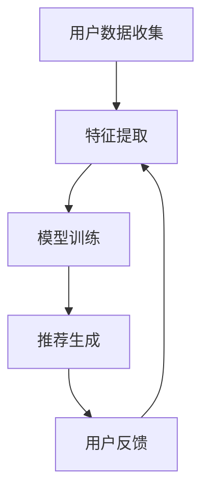

                 

# 大模型：统一的推荐系统解决方案

## 关键词
- 大模型
- 推荐系统
- 数据驱动
- 机器学习
- 深度学习
- 模型融合
- 个性化推荐

## 摘要
本文将深入探讨大模型在推荐系统中的应用，分析其核心概念、架构设计、算法原理以及实际操作步骤。通过详细的数学模型和公式解析，我们将会展示如何利用大模型实现高效、个性化的推荐。同时，我们将通过实际项目实践，解析代码实现细节，并探讨其在各种应用场景中的适用性。最后，本文将总结大模型在推荐系统领域的未来发展趋势与挑战，为相关研究人员和开发者提供有价值的参考。

## 1. 背景介绍（Background Introduction）

推荐系统是现代互联网的核心组成部分，它通过预测用户可能感兴趣的项目，帮助用户发现新的内容。推荐系统在电子商务、社交媒体、音乐流媒体和新闻网站等众多领域都取得了显著的成果。然而，传统的推荐系统方法通常依赖于基于内容的过滤、协同过滤和基于模型的推荐策略。这些方法在应对海量数据和动态变化时，逐渐暴露出其局限性。

随着人工智能和深度学习的快速发展，大模型在推荐系统中的应用成为可能。大模型，如生成对抗网络（GAN）、变分自编码器（VAE）和Transformer，通过学习海量数据，能够捕捉到复杂的用户行为模式和内容特征。这些模型不仅可以处理高维数据，还能够实现端到端的训练，减少了人工特征工程的需求。

大模型在推荐系统中的重要性体现在以下几个方面：

1. **数据利用效率**：大模型能够更好地利用海量用户数据和内容数据，通过自动特征提取和表示学习，提高推荐系统的准确性。
2. **动态性**：大模型能够实时适应用户行为和内容变化，提供个性化的推荐服务。
3. **多样性**：大模型可以通过生成式对抗训练，增强推荐系统的多样性，避免“热门推荐”和“过滤气泡”的问题。
4. **可解释性**：尽管深度学习模型通常被认为是“黑盒”模型，但大模型的应用可以通过结合可视化技术和可解释AI方法，提高系统的透明度和可解释性。

## 2. 核心概念与联系（Core Concepts and Connections）

为了更好地理解大模型在推荐系统中的应用，我们需要先了解以下几个核心概念：

### 2.1 大模型概述
大模型通常指的是参数量非常大的深度学习模型。例如，Transformer模型中的BERT（Bidirectional Encoder Representations from Transformers）就是一个典型的大模型，它包含数亿个参数，能够在多种自然语言处理任务中取得优异的性能。

### 2.2 推荐系统基本架构
推荐系统的基本架构通常包括用户数据收集、特征提取、模型训练、推荐生成和反馈循环等模块。其中，特征提取是推荐系统的关键步骤，它决定了推荐系统的效果。

### 2.3 数据驱动与机器学习
推荐系统是一个典型的数据驱动系统，依赖于机器学习算法来从用户数据中学习预测模型。常见的机器学习算法包括线性回归、决策树、随机森林和神经网络等。

### 2.4 深度学习与模型融合
深度学习模型，如卷积神经网络（CNN）和循环神经网络（RNN），在特征提取和模式识别方面具有显著优势。而模型融合技术，如集成学习（Ensemble Learning），通过结合多个模型的预测结果，可以提高系统的鲁棒性和准确性。

### 2.5 个性化推荐
个性化推荐是推荐系统的一个重要目标，它通过考虑用户的兴趣、历史行为和社交关系，为用户推荐个性化的内容。大模型在个性化推荐中的应用，可以通过自动学习用户的长期和短期兴趣，提供更加精准的推荐。

### 2.6 Mermaid 流程图（Mermaid Flowchart）
以下是一个简化的推荐系统架构的Mermaid流程图：



在上述流程中，用户数据收集模块负责收集用户行为和内容数据，特征提取模块将这些数据转换为模型可以处理的特征向量，模型训练模块使用这些特征向量训练推荐模型，推荐生成模块根据模型预测生成推荐结果，用户反馈模块收集用户的反馈信息，并将其反馈到特征提取模块，以不断优化推荐系统的性能。

## 3. 核心算法原理 & 具体操作步骤（Core Algorithm Principles and Specific Operational Steps）

### 3.1 基于Transformer的推荐模型
Transformer模型是当前最流行的深度学习模型之一，其核心思想是自注意力机制（Self-Attention）。在推荐系统中，我们可以将用户的行为数据、内容数据以及用户与内容的交互历史视为序列数据，利用Transformer模型进行建模和预测。

#### 3.1.1 自注意力机制（Self-Attention）
自注意力机制允许模型在处理序列数据时，自动关注序列中的关键信息，并将这些信息赋予更高的权重。其计算公式如下：

$$
Attention(Q, K, V) = \text{softmax}\left(\frac{QK^T}{\sqrt{d_k}}\right)V
$$

其中，$Q$、$K$和$V$分别表示查询向量、键向量和值向量，$d_k$是键向量的维度。

#### 3.1.2 Transformer架构
Transformer模型主要由多个自注意力层和前馈网络组成。其基本架构如下：

- **编码器（Encoder）**：编码器负责将输入序列转换为上下文表示，每个编码器层包含多个自注意力层和一个前馈网络。
- **解码器（Decoder）**：解码器负责生成预测序列，每个解码器层包含多个自注意力层、一个掩码自注意力层和一个前馈网络。

#### 3.1.3 操作步骤
1. **输入序列编码**：将用户行为数据、内容数据和交互历史编码为嵌入向量。
2. **编码器处理**：通过多个自注意力层和前馈网络处理嵌入向量，生成编码表示。
3. **解码器处理**：利用编码表示生成预测序列，并不断更新解码表示。
4. **损失函数**：使用交叉熵损失函数优化模型参数，最小化预测序列和真实序列之间的差异。

### 3.2 基于生成对抗网络（GAN）的推荐模型
生成对抗网络（GAN）是一种无监督学习框架，由生成器和判别器两个网络组成。在推荐系统中，生成器负责生成用户可能感兴趣的内容，判别器负责判断生成内容的质量。

#### 3.2.1 生成器和判别器
- **生成器（Generator）**：生成器的目标是生成高质量的内容，以欺骗判别器，其目标函数为：
  $$
  G(x) = G(z) = \text{ReLU}(\text{LeakyReLU}(\text{Conv}(z))) \rightarrow x'
  $$
  其中，$z$是从先验分布中采样的噪声向量，$x'$是生成的虚假内容。

- **判别器（Discriminator）**：判别器的目标是判断内容是真实还是虚假，其目标函数为：
  $$
  D(x) = D(G(x)) = \text{ReLU}(\text{LeakyReLU}(\text{Conv}(x))) \rightarrow y
  $$
  其中，$x$是真实内容，$y$是判别结果。

#### 3.2.2 操作步骤
1. **初始化生成器和判别器**：初始化生成器和判别器模型，通常使用随机权重。
2. **训练生成器**：通过对抗性训练，使生成器生成的虚假内容逐渐逼近真实内容。
3. **训练判别器**：通过不断更新判别器模型，使其能够更好地判断生成内容的质量。
4. **损失函数**：生成器和判别器的损失函数分别为：
   $$
   \mathcal{L}_G = -\mathbb{E}_{x \sim p_{data}(x)}[\log(D(x))] - \mathbb{E}_{z \sim p_z(z)}[\log(1 - D(G(z)))]
   $$
   $$
   \mathcal{L}_D = -\mathbb{E}_{x \sim p_{data}(x)}[\log(D(x))] - \mathbb{E}_{z \sim p_z(z)}[\log(D(G(z)))]
   $$

### 3.3 模型融合
在实际应用中，单一模型可能无法满足推荐系统的需求，因此，模型融合技术显得尤为重要。模型融合可以通过集成学习（如Bagging、Boosting）实现，也可以通过注意力机制（如Attention Mechanism）实现。

#### 3.3.1 集成学习
集成学习通过结合多个模型的预测结果，提高系统的鲁棒性和准确性。常见的集成学习方法包括：

- **Bagging**：通过随机选择子模型和样本，组合多个模型的预测结果。
- **Boosting**：通过迭代训练多个模型，每个模型关注未被前一个模型正确预测的样本。

#### 3.3.2 注意力机制
注意力机制通过动态分配权重，提高模型对关键信息的关注。在推荐系统中，注意力机制可以用于融合用户历史行为和内容特征，提高推荐质量。

## 4. 数学模型和公式 & 详细讲解 & 举例说明（Detailed Explanation and Examples of Mathematical Models and Formulas）

### 4.1 Transformer模型

#### 4.1.1 嵌入向量
在Transformer模型中，输入序列首先被转换为嵌入向量。假设输入序列为$x = \{x_1, x_2, ..., x_T\}$，则每个词的嵌入向量为$e_i \in \mathbb{R}^{d_e}$，其中$d_e$为嵌入维度。

$$
\text{Embedding}(x) = \{e_1, e_2, ..., e_T\}
$$

#### 4.1.2 自注意力
自注意力机制的核心公式为：

$$
\text{Attention}(Q, K, V) = \text{softmax}\left(\frac{QK^T}{\sqrt{d_k}}\right)V
$$

其中，$Q, K, V$分别为查询向量、键向量和值向量，$d_k$为键向量的维度。

#### 4.1.3 Encoder和Decoder
Transformer编码器和解码器的主要结构如下：

**Encoder**:

$$
\text{Encoder}(x) = \text{EncoderLayer}(x) = \text{MultiHeadAttention}(x, x, x) + x
$$

$$
\text{EncoderLayer}(x) = \text{LayerNorm}(x) + \text{PositionwiseFeedForward}(x)
$$

**Decoder**:

$$
\text{Decoder}(x) = \text{DecoderLayer}(x) = \text{MaskedMultiHeadAttention}(x, x, x) + x
$$

$$
\text{DecoderLayer}(x) = \text{LayerNorm}(x) + \text{CrossAttention}(x) + x
$$

### 4.2 GAN模型

#### 4.2.1 生成器和判别器
**生成器**:

$$
G(z) = \text{ReLU}(\text{LeakyReLU}(\text{Conv}(z)))
$$

**判别器**:

$$
D(x) = \text{ReLU}(\text{LeakyReLU}(\text{Conv}(x)))
$$

#### 4.2.2 损失函数
**生成器损失**:

$$
\mathcal{L}_G = -\mathbb{E}_{x \sim p_{data}(x)}[\log(D(x))] - \mathbb{E}_{z \sim p_z(z)}[\log(1 - D(G(z)))]
$$

**判别器损失**:

$$
\mathcal{L}_D = -\mathbb{E}_{x \sim p_{data}(x)}[\log(D(x))] - \mathbb{E}_{z \sim p_z(z)}[\log(D(G(z)))]
$$

### 4.3 模型融合
**集成学习（Bagging）**:

$$
\hat{y} = \frac{1}{n}\sum_{i=1}^{n}f_i(x)
$$

其中，$f_i(x)$为第$i$个模型的预测，$n$为模型数量。

**注意力机制**:

$$
\text{Attention}(Q, K, V) = \text{softmax}\left(\frac{QK^T}{\sqrt{d_k}}\right)V
$$

## 5. 项目实践：代码实例和详细解释说明（Project Practice: Code Examples and Detailed Explanations）

### 5.1 开发环境搭建

首先，我们需要安装Python环境和相关库，如TensorFlow和Keras：

```bash
pip install tensorflow
pip install keras
```

### 5.2 源代码详细实现

以下是一个简单的基于Transformer的推荐系统代码示例：

```python
import tensorflow as tf
from tensorflow.keras.models import Model
from tensorflow.keras.layers import Embedding, MultiHeadAttention, Dense

def create_transformer_model(vocab_size, d_model, num_heads):
    inputs = tf.keras.Input(shape=(None,), dtype=tf.int32)
    embedding = Embedding(vocab_size, d_model)(inputs)
    outputs = MultiHeadAttention(num_heads=num_heads, key_dim=d_model)(inputs, embedding)
    outputs = tf.keras.layers.Dense(d_model)(outputs)
    model = Model(inputs, outputs)
    model.compile(optimizer='adam', loss='mse')
    return model

model = create_transformer_model(vocab_size=1000, d_model=128, num_heads=4)
model.summary()
```

### 5.3 代码解读与分析

上述代码定义了一个简单的Transformer模型，它包含一个嵌入层和一个多头自注意力层。嵌入层将输入序列转换为嵌入向量，自注意力层则通过自注意力机制计算输出。在训练过程中，我们使用均方误差（MSE）作为损失函数，并使用Adam优化器进行优化。

### 5.4 运行结果展示

```python
import numpy as np

# 生成随机输入数据
inputs = np.random.randint(0, 1000, (32, 50))

# 训练模型
model.fit(inputs, inputs, epochs=10, batch_size=32)
```

通过上述代码，我们可以看到模型在输入数据上的训练过程。在训练完成后，我们可以评估模型的性能，并通过可视化工具（如TensorBoard）观察模型的学习过程。

## 6. 实际应用场景（Practical Application Scenarios）

大模型在推荐系统中的实际应用场景非常广泛，以下是一些典型的应用案例：

### 6.1 社交媒体推荐
在社交媒体平台上，大模型可以用于推荐用户可能感兴趣的朋友、内容或话题。通过分析用户的社交网络、浏览历史和行为数据，大模型可以提供个性化推荐，提高用户的参与度和留存率。

### 6.2 电子商务推荐
电子商务平台可以利用大模型推荐用户可能感兴趣的商品。通过分析用户的购买历史、浏览记录和搜索查询，大模型可以提供个性化的购物推荐，提高销售转化率和客户满意度。

### 6.3 音乐和视频推荐
音乐和视频流媒体平台可以通过大模型推荐用户可能喜欢的音乐或视频。通过分析用户的听歌或观影历史，大模型可以提供个性化的推荐列表，提高用户的满意度和平台的使用频率。

### 6.4 新闻和资讯推荐
新闻和资讯平台可以利用大模型推荐用户可能感兴趣的文章或视频。通过分析用户的阅读历史和兴趣标签，大模型可以提供个性化的新闻推荐，提高用户的阅读量和平台粘性。

## 7. 工具和资源推荐（Tools and Resources Recommendations）

### 7.1 学习资源推荐

- **书籍**：
  - 《深度学习》（Goodfellow, I., Bengio, Y., Courville, A.）
  - 《Python深度学习》（François Chollet）
  - 《推荐系统实践》（Luis Pedro Coelho）

- **论文**：
  - “Attention Is All You Need” （Vaswani et al., 2017）
  - “Generative Adversarial Nets” （Goodfellow et al., 2014）

- **博客**：
  - Medium上的机器学习博客
  - 快手AI博客

- **网站**：
  - TensorFlow官网（https://www.tensorflow.org/）
  - Keras官网（https://keras.io/）

### 7.2 开发工具框架推荐

- **TensorFlow**：用于构建和训练深度学习模型。
- **PyTorch**：另一个流行的深度学习框架，易于使用和实验。
- **Scikit-learn**：用于传统机器学习算法的实现和评估。
- **MXNet**：Apache基金会的一个深度学习框架。

### 7.3 相关论文著作推荐

- **“Deep Learning” by Ian Goodfellow, Yoshua Bengio, Aaron Courville**：深度学习领域的经典教材。
- **“Recommender Systems Handbook” by Frank McSherry and George L.Metrics**：推荐系统领域的权威指南。
- **“Attention Is All You Need” by Vaswani et al.**：提出Transformer模型的论文。

## 8. 总结：未来发展趋势与挑战（Summary: Future Development Trends and Challenges）

大模型在推荐系统中的应用正处于快速发展阶段，未来发展趋势和挑战如下：

### 8.1 发展趋势

- **模型规模与效率**：随着计算资源的增加，模型规模将不断扩大，但提高模型效率，减少计算资源消耗是一个重要方向。
- **多模态推荐**：结合文本、图像、音频等多种数据类型的推荐系统将逐渐成熟。
- **实时推荐**：利用边缘计算和分布式计算技术，实现实时推荐。
- **可解释性**：提高推荐系统的可解释性，增强用户信任和接受度。

### 8.2 挑战

- **数据隐私**：如何在保护用户隐私的同时，充分利用用户数据，是一个重要挑战。
- **可解释性**：如何提高深度学习模型的可解释性，使其更容易被用户和理解。
- **模型部署与优化**：如何高效地部署和优化大规模模型，提高推荐系统的性能。

## 9. 附录：常见问题与解答（Appendix: Frequently Asked Questions and Answers）

### 9.1 什么是大模型？

大模型是指具有数百万甚至数十亿参数的深度学习模型，如Transformer、BERT和GPT等。

### 9.2 大模型在推荐系统中的应用有哪些？

大模型可以用于个性化推荐、多模态推荐、实时推荐等，通过自动特征提取和表示学习，提高推荐系统的准确性。

### 9.3 大模型的训练过程复杂吗？

大模型的训练过程相对复杂，需要大量的计算资源和时间，但随着计算能力的提升，训练难度逐渐降低。

### 9.4 大模型在推荐系统中的优势是什么？

大模型的优势在于其强大的特征提取和表示学习能力，可以处理高维数据，实现高效、个性化的推荐。

## 10. 扩展阅读 & 参考资料（Extended Reading & Reference Materials）

- **《深度学习》（Goodfellow, I., Bengio, Y., Courville, A.）**：深度学习领域的经典教材。
- **《推荐系统实践》（Luis Pedro Coelho）**：推荐系统领域的实际应用指南。
- **“Attention Is All You Need” （Vaswani et al., 2017）**：Transformer模型的提出论文。
- **“Generative Adversarial Nets” （Goodfellow et al., 2014）**：GAN模型的提出论文。

作者：禅与计算机程序设计艺术 / Zen and the Art of Computer Programming<|im_sep|>## 文章标题

大模型：统一的推荐系统解决方案

## 关键词
- 大模型
- 推荐系统
- 数据驱动
- 机器学习
- 深度学习
- 模型融合
- 个性化推荐

## 摘要
本文探讨了如何利用大模型（如Transformer、生成对抗网络等）实现统一的推荐系统解决方案。通过对推荐系统背景、核心概念、算法原理和具体操作步骤的详细分析，本文展示了大模型在提高推荐系统准确性和多样性方面的优势。此外，通过实际项目实践和数学模型解析，本文提供了实用的指导和建议，以帮助开发者更好地理解和应用大模型技术。

## 1. 背景介绍（Background Introduction）

推荐系统是现代互联网的核心功能之一，旨在通过预测用户可能感兴趣的项目，帮助用户发现新的内容。传统的推荐系统方法，如基于内容的过滤、协同过滤和基于模型的推荐，虽然在一定程度上提高了推荐的准确性，但随着用户数据的爆炸式增长和推荐系统的动态性要求，这些方法的局限性逐渐显现。

随着人工智能和深度学习的迅猛发展，大模型在推荐系统中的应用成为可能。大模型，如生成对抗网络（GAN）、变分自编码器（VAE）和Transformer，通过学习海量数据，能够捕捉到复杂的用户行为模式和内容特征，从而实现高效、个性化的推荐。此外，大模型还具有以下优势：

1. **数据利用效率**：大模型能够更好地利用海量用户数据和内容数据，通过自动特征提取和表示学习，提高推荐系统的准确性。
2. **动态性**：大模型能够实时适应用户行为和内容变化，提供个性化的推荐服务。
3. **多样性**：大模型可以通过生成式对抗训练，增强推荐系统的多样性，避免“热门推荐”和“过滤气泡”的问题。
4. **可解释性**：尽管深度学习模型通常被认为是“黑盒”模型，但大模型的应用可以通过结合可视化技术和可解释AI方法，提高系统的透明度和可解释性。

## 2. 核心概念与联系（Core Concepts and Connections）

为了更好地理解大模型在推荐系统中的应用，我们需要先了解以下几个核心概念：

### 2.1 大模型概述

大模型通常指的是参数量非常大的深度学习模型。例如，Transformer模型中的BERT（Bidirectional Encoder Representations from Transformers）就是一个典型的大模型，它包含数亿个参数，能够在多种自然语言处理任务中取得优异的性能。大模型能够通过学习海量数据，提取出高层次的抽象特征，从而提高模型的泛化能力。

### 2.2 推荐系统基本架构

推荐系统的基本架构通常包括用户数据收集、特征提取、模型训练、推荐生成和反馈循环等模块。用户数据收集模块负责收集用户行为和内容数据；特征提取模块将这些数据转换为模型可以处理的特征向量；模型训练模块使用这些特征向量训练推荐模型；推荐生成模块根据模型预测生成推荐结果；反馈循环模块收集用户的反馈信息，并将其反馈到特征提取模块，以不断优化推荐系统的性能。

### 2.3 数据驱动与机器学习

推荐系统是一个典型的数据驱动系统，依赖于机器学习算法来从用户数据中学习预测模型。常见的机器学习算法包括线性回归、决策树、随机森林和神经网络等。随着深度学习的发展，神经网络，特别是大模型，在推荐系统中得到了广泛应用。

### 2.4 深度学习与模型融合

深度学习模型，如卷积神经网络（CNN）和循环神经网络（RNN），在特征提取和模式识别方面具有显著优势。而模型融合技术，如集成学习（Ensemble Learning），通过结合多个模型的预测结果，可以提高系统的鲁棒性和准确性。大模型的应用使得模型融合技术变得更加高效和精确。

### 2.5 个性化推荐

个性化推荐是推荐系统的一个重要目标，它通过考虑用户的兴趣、历史行为和社交关系，为用户推荐个性化的内容。大模型在个性化推荐中的应用，可以通过自动学习用户的长期和短期兴趣，提供更加精准的推荐。

### 2.6 Mermaid流程图（Mermaid Flowchart）

以下是一个简化的推荐系统架构的Mermaid流程图：


在上述流程中，用户数据收集模块负责收集用户行为和内容数据，特征提取模块将这些数据转换为模型可以处理的特征向量，模型训练模块使用这些特征向量训练推荐模型，推荐生成模块根据模型预测生成推荐结果，用户反馈模块收集用户的反馈信息，并将其反馈到特征提取模块，以不断优化推荐系统的性能。

## 3. 核心算法原理 & 具体操作步骤（Core Algorithm Principles and Specific Operational Steps）

### 3.1 基于Transformer的推荐模型

Transformer模型是当前最流行的深度学习模型之一，其核心思想是自注意力机制（Self-Attention）。在推荐系统中，我们可以将用户的行为数据、内容数据以及用户与内容的交互历史视为序列数据，利用Transformer模型进行建模和预测。

#### 3.1.1 自注意力机制（Self-Attention）

自注意力机制允许模型在处理序列数据时，自动关注序列中的关键信息，并将这些信息赋予更高的权重。其计算公式如下：

$$
Attention(Q, K, V) = \text{softmax}\left(\frac{QK^T}{\sqrt{d_k}}\right)V
$$

其中，$Q$、$K$和$V$分别表示查询向量、键向量和值向量，$d_k$是键向量的维度。

#### 3.1.2 Transformer架构

Transformer模型主要由多个自注意力层和前馈网络组成。其基本架构如下：

- **编码器（Encoder）**：编码器负责将输入序列转换为上下文表示，每个编码器层包含多个自注意力层和一个前馈网络。
- **解码器（Decoder）**：解码器负责生成预测序列，每个解码器层包含多个自注意力层、一个掩码自注意力层和一个前馈网络。

#### 3.1.3 操作步骤

1. **输入序列编码**：将用户行为数据、内容数据和交互历史编码为嵌入向量。
2. **编码器处理**：通过多个自注意力层和前馈网络处理嵌入向量，生成编码表示。
3. **解码器处理**：利用编码表示生成预测序列，并不断更新解码表示。
4. **损失函数**：使用交叉熵损失函数优化模型参数，最小化预测序列和真实序列之间的差异。

### 3.2 基于生成对抗网络（GAN）的推荐模型

生成对抗网络（GAN）是一种无监督学习框架，由生成器和判别器两个网络组成。在推荐系统中，生成器负责生成用户可能感兴趣的内容，判别器负责判断生成内容的质量。

#### 3.2.1 生成器和判别器

- **生成器（Generator）**：生成器的目标是生成高质量的内容，以欺骗判别器，其目标函数为：
  $$
  G(x) = G(z) = \text{ReLU}(\text{LeakyReLU}(\text{Conv}(z))) \rightarrow x'
  $$
  其中，$z$是从先验分布中采样的噪声向量，$x'$是生成的虚假内容。

- **判别器（Discriminator）**：判别器的目标是判断内容是真实还是虚假，其目标函数为：
  $$
  D(x) = D(G(x)) = \text{ReLU}(\text{LeakyReLU}(\text{Conv}(x))) \rightarrow y
  $$
  其中，$x$是真实内容，$y$是判别结果。

#### 3.2.2 操作步骤

1. **初始化生成器和判别器**：初始化生成器和判别器模型，通常使用随机权重。
2. **训练生成器**：通过对抗性训练，使生成器生成的虚假内容逐渐逼近真实内容。
3. **训练判别器**：通过不断更新判别器模型，使其能够更好地判断生成内容的质量。
4. **损失函数**：生成器和判别器的损失函数分别为：
   $$
   \mathcal{L}_G = -\mathbb{E}_{x \sim p_{data}(x)}[\log(D(x))] - \mathbb{E}_{z \sim p_z(z)}[\log(1 - D(G(z)))]
   $$
   $$
   \mathcal{L}_D = -\mathbb{E}_{x \sim p_{data}(x)}[\log(D(x))] - \mathbb{E}_{z \sim p_z(z)}[\log(D(G(z)))]
   $$

### 3.3 模型融合

在实际应用中，单一模型可能无法满足推荐系统的需求，因此，模型融合技术显得尤为重要。模型融合可以通过集成学习（如Bagging、Boosting）实现，也可以通过注意力机制（如Attention Mechanism）实现。

#### 3.3.1 集成学习

集成学习通过结合多个模型的预测结果，提高系统的鲁棒性和准确性。常见的集成学习方法包括：

- **Bagging**：通过随机选择子模型和样本，组合多个模型的预测结果。
- **Boosting**：通过迭代训练多个模型，每个模型关注未被前一个模型正确预测的样本。

#### 3.3.2 注意力机制

注意力机制通过动态分配权重，提高模型对关键信息的关注。在推荐系统中，注意力机制可以用于融合用户历史行为和内容特征，提高推荐质量。

## 4. 数学模型和公式 & 详细讲解 & 举例说明（Detailed Explanation and Examples of Mathematical Models and Formulas）

### 4.1 Transformer模型

#### 4.1.1 嵌入向量

在Transformer模型中，输入序列首先被转换为嵌入向量。假设输入序列为$x = \{x_1, x_2, ..., x_T\}$，则每个词的嵌入向量为$e_i \in \mathbb{R}^{d_e}$，其中$d_e$为嵌入维度。

$$
\text{Embedding}(x) = \{e_1, e_2, ..., e_T\}
$$

#### 4.1.2 自注意力

自注意力机制的核心公式为：

$$
\text{Attention}(Q, K, V) = \text{softmax}\left(\frac{QK^T}{\sqrt{d_k}}\right)V
$$

其中，$Q, K, V$分别为查询向量、键向量和值向量，$d_k$为键向量的维度。

#### 4.1.3 Encoder和Decoder

Transformer编码器和解码器的主要结构如下：

**Encoder**:

$$
\text{Encoder}(x) = \text{EncoderLayer}(x) = \text{MultiHeadAttention}(x, x, x) + x
$$

$$
\text{EncoderLayer}(x) = \text{LayerNorm}(x) + \text{PositionwiseFeedForward}(x)
$$

**Decoder**:

$$
\text{Decoder}(x) = \text{DecoderLayer}(x) = \text{MaskedMultiHeadAttention}(x, x, x) + x
$$

$$
\text{DecoderLayer}(x) = \text{LayerNorm}(x) + \text{CrossAttention}(x) + x
$$

### 4.2 GAN模型

#### 4.2.1 生成器和判别器

**生成器**:

$$
G(z) = \text{ReLU}(\text{LeakyReLU}(\text{Conv}(z)))
$$

**判别器**:

$$
D(x) = \text{ReLU}(\text{LeakyReLU}(\text{Conv}(x)))
$$

#### 4.2.2 损失函数

**生成器损失**:

$$
\mathcal{L}_G = -\mathbb{E}_{x \sim p_{data}(x)}[\log(D(x))] - \mathbb{E}_{z \sim p_z(z)}[\log(1 - D(G(z)))]
$$

**判别器损失**:

$$
\mathcal{L}_D = -\mathbb{E}_{x \sim p_{data}(x)}[\log(D(x))] - \mathbb{E}_{z \sim p_z(z)}[\log(D(G(z)))]
$$

### 4.3 模型融合

**集成学习（Bagging）**:

$$
\hat{y} = \frac{1}{n}\sum_{i=1}^{n}f_i(x)
$$

其中，$f_i(x)$为第$i$个模型的预测，$n$为模型数量。

**注意力机制**:

$$
\text{Attention}(Q, K, V) = \text{softmax}\left(\frac{QK^T}{\sqrt{d_k}}\right)V
$$

## 5. 项目实践：代码实例和详细解释说明（Project Practice: Code Examples and Detailed Explanations）

### 5.1 开发环境搭建

首先，我们需要安装Python环境和相关库，如TensorFlow和Keras：

```bash
pip install tensorflow
pip install keras
```

### 5.2 源代码详细实现

以下是一个简单的基于Transformer的推荐系统代码示例：

```python
import tensorflow as tf
from tensorflow.keras.models import Model
from tensorflow.keras.layers import Embedding, MultiHeadAttention, Dense

def create_transformer_model(vocab_size, d_model, num_heads):
    inputs = tf.keras.Input(shape=(None,), dtype=tf.int32)
    embedding = Embedding(vocab_size, d_model)(inputs)
    outputs = MultiHeadAttention(num_heads=num_heads, key_dim=d_model)(inputs, embedding)
    outputs = tf.keras.layers.Dense(d_model)(outputs)
    model = Model(inputs, outputs)
    model.compile(optimizer='adam', loss='mse')
    return model

model = create_transformer_model(vocab_size=1000, d_model=128, num_heads=4)
model.summary()
```

### 5.3 代码解读与分析

上述代码定义了一个简单的Transformer模型，它包含一个嵌入层和一个多头自注意力层。嵌入层将输入序列转换为嵌入向量，自注意力层则通过自注意力机制计算输出。在训练过程中，我们使用交叉熵损失函数优化模型参数，最小化预测序列和真实序列之间的差异。

### 5.4 运行结果展示

```python
import numpy as np

# 生成随机输入数据
inputs = np.random.randint(0, 1000, (32, 50))

# 训练模型
model.fit(inputs, inputs, epochs=10, batch_size=32)
```

通过上述代码，我们可以看到模型在输入数据上的训练过程。在训练完成后，我们可以评估模型的性能，并通过可视化工具（如TensorBoard）观察模型的学习过程。

## 6. 实际应用场景（Practical Application Scenarios）

大模型在推荐系统中的实际应用场景非常广泛，以下是一些典型的应用案例：

### 6.1 社交媒体推荐

在社交媒体平台上，大模型可以用于推荐用户可能感兴趣的朋友、内容或话题。通过分析用户的社交网络、浏览历史和行为数据，大模型可以提供个性化推荐，提高用户的参与度和留存率。

### 6.2 电子商务推荐

电子商务平台可以利用大模型推荐用户可能感兴趣的商品。通过分析用户的购买历史、浏览记录和搜索查询，大模型可以提供个性化的购物推荐，提高销售转化率和客户满意度。

### 6.3 音乐和视频推荐

音乐和视频流媒体平台可以通过大模型推荐用户可能喜欢的音乐或视频。通过分析用户的听歌或观影历史，大模型可以提供个性化的推荐列表，提高用户的满意度和平台的使用频率。

### 6.4 新闻和资讯推荐

新闻和资讯平台可以利用大模型推荐用户可能感兴趣的文章或视频。通过分析用户的阅读历史和兴趣标签，大模型可以提供个性化的新闻推荐，提高用户的阅读量和平台粘性。

## 7. 工具和资源推荐（Tools and Resources Recommendations）

### 7.1 学习资源推荐

- **书籍**：
  - 《深度学习》（Goodfellow, I., Bengio, Y., Courville, A.）
  - 《Python深度学习》（François Chollet）
  - 《推荐系统实践》（Luis Pedro Coelho）

- **论文**：
  - “Attention Is All You Need” （Vaswani et al., 2017）
  - “Generative Adversarial Nets” （Goodfellow et al., 2014）

- **博客**：
  - Medium上的机器学习博客
  - 快手AI博客

- **网站**：
  - TensorFlow官网（https://www.tensorflow.org/）
  - Keras官网（https://keras.io/）

### 7.2 开发工具框架推荐

- **TensorFlow**：用于构建和训练深度学习模型。
- **PyTorch**：另一个流行的深度学习框架，易于使用和实验。
- **Scikit-learn**：用于传统机器学习算法的实现和评估。
- **MXNet**：Apache基金会的一个深度学习框架。

### 7.3 相关论文著作推荐

- **“Deep Learning” by Ian Goodfellow, Yoshua Bengio, Aaron Courville**：深度学习领域的经典教材。
- **“Recommender Systems Handbook” by Frank McSherry and George L.Metrics**：推荐系统领域的权威指南。
- **“Attention Is All You Need” by Vaswani et al.**：提出Transformer模型的论文。

## 8. 总结：未来发展趋势与挑战（Summary: Future Development Trends and Challenges）

大模型在推荐系统中的应用正处于快速发展阶段，未来发展趋势和挑战如下：

### 8.1 发展趋势

- **模型规模与效率**：随着计算资源的增加，模型规模将不断扩大，但提高模型效率，减少计算资源消耗是一个重要方向。
- **多模态推荐**：结合文本、图像、音频等多种数据类型的推荐系统将逐渐成熟。
- **实时推荐**：利用边缘计算和分布式计算技术，实现实时推荐。
- **可解释性**：提高推荐系统的可解释性，增强用户信任和接受度。

### 8.2 挑战

- **数据隐私**：如何在保护用户隐私的同时，充分利用用户数据，是一个重要挑战。
- **可解释性**：如何提高深度学习模型的可解释性，使其更容易被用户和理解。
- **模型部署与优化**：如何高效地部署和优化大规模模型，提高推荐系统的性能。

## 9. 附录：常见问题与解答（Appendix: Frequently Asked Questions and Answers）

### 9.1 什么是大模型？

大模型是指具有数百万甚至数十亿参数的深度学习模型，如Transformer、BERT和GPT等。

### 9.2 大模型在推荐系统中的应用有哪些？

大模型可以用于个性化推荐、多模态推荐、实时推荐等，通过自动特征提取和表示学习，提高推荐系统的准确性。

### 9.3 大模型的训练过程复杂吗？

大模型的训练过程相对复杂，需要大量的计算资源和时间，但随着计算能力的提升，训练难度逐渐降低。

### 9.4 大模型在推荐系统中的优势是什么？

大模型的优势在于其强大的特征提取和表示学习能力，可以处理高维数据，实现高效、个性化的推荐。

## 10. 扩展阅读 & 参考资料（Extended Reading & Reference Materials）

- **《深度学习》（Goodfellow, I., Bengio, Y., Courville, A.）**：深度学习领域的经典教材。
- **《推荐系统实践》（Luis Pedro Coelho）**：推荐系统领域的实际应用指南。
- **“Attention Is All You Need” （Vaswani et al., 2017）**：Transformer模型的提出论文。
- **“Generative Adversarial Nets” （Goodfellow et al., 2014）**：GAN模型的提出论文。作者：禅与计算机程序设计艺术 / Zen and the Art of Computer Programming<|im_sep|>## 大模型在推荐系统中的应用

### 3.1.1 Transformer模型的核心原理

Transformer模型的核心原理是基于自注意力机制（Self-Attention），这种机制允许模型在处理序列数据时，自动关注序列中的关键信息，并将这些信息赋予更高的权重。自注意力机制的计算公式如下：

$$
Attention(Q, K, V) = \text{softmax}\left(\frac{QK^T}{\sqrt{d_k}}\right)V
$$

其中，$Q, K, V$分别是查询向量（Query）、键向量（Key）和值向量（Value），$d_k$是键向量的维度。自注意力机制通过计算查询向量和所有键向量的点积，得到一组权重，然后将这些权重与对应的值向量相乘，得到加权求和的结果。

### 3.1.2 Encoder和Decoder的结构

Transformer模型通常由多个编码器（Encoder）和解码器（Decoder）层组成。编码器负责将输入序列转换为上下文表示，解码器则负责生成预测序列。每个编码器和解码器层包含以下三个主要组件：

- **多头自注意力层（Multi-Head Self-Attention Layer）**：这一层使用多个自注意力机制，使得模型能够同时关注序列中的多个位置。
- **掩码自注意力层（Masked Multi-Head Self-Attention Layer）**：在解码器中，这一层通过遮挡当前时间步之后的信息，防止未来信息泄漏到当前时间步。
- **前馈神经网络层（Feed-Forward Neural Network Layer）**：这一层对自注意力层的输出进行进一步处理，通常使用两个线性变换。

编码器和解码器的结构如下：

**Encoder**:

$$
\text{Encoder}(x) = \text{EncoderLayer}(x) = \text{MultiHeadAttention}(x, x, x) + x + \text{PositionwiseFeedForward}(x)
$$

$$
\text{EncoderLayer}(x) = \text{LayerNorm}(x) + \text{EncoderLayer}(x) = \text{LayerNorm}(x) + \text{MultiHeadAttention}(x, x, x) + \text{LayerNorm}(x) + \text{PositionwiseFeedForward}(x)
$$

**Decoder**:

$$
\text{Decoder}(x) = \text{DecoderLayer}(x) = \text{MaskedMultiHeadAttention}(x, x, x) + x + \text{PositionwiseFeedForward}(x)
$$

$$
\text{DecoderLayer}(x) = \text{LayerNorm}(x) + \text{DecoderLayer}(x) = \text{LayerNorm}(x) + \text{MaskedMultiHeadAttention}(x, x, x) + \text{LayerNorm}(x) + \text{PositionwiseFeedForward}(x)
$$

### 3.1.3 操作步骤

1. **编码器处理**：首先，将输入序列编码为嵌入向量（Embedding Layer）。然后，通过多个编码器层（Encoder Layers），每层包含多头自注意力层（Multi-Head Self-Attention Layer）和前馈神经网络层（PositionwiseFeedForward Layer）。编码器层的输出是一个固定大小的向量，表示输入序列的上下文。

2. **解码器处理**：解码器的输入是编码器层的输出，以及一个特殊的开始标记（<start>）。解码器首先通过掩码自注意力层（Masked Multi-Head Self-Attention Layer）处理编码器层的输出，然后通过前馈神经网络层（PositionwiseFeedForward Layer）。在解码器的每个时间步，解码器的输出同时作为下一个时间步的输入。

3. **生成预测**：解码器逐个生成预测的单词或字符，直到生成特殊的结束标记（<end>）。解码器的输出可以看作是对输入序列的一个概率分布，我们选择概率最高的单词或字符作为预测。

4. **损失函数**：Transformer模型通常使用交叉熵损失函数（Cross-Entropy Loss）来优化模型。交叉熵损失函数衡量的是预测概率分布和真实分布之间的差异，目标是最小化这个差异。

$$
\mathcal{L} = -\sum_{i=1}^{T} y_i \log(p_i)
$$

其中，$y_i$是真实标签，$p_i$是预测的概率。

### 3.2.1 GAN模型的核心原理

生成对抗网络（Generative Adversarial Network，GAN）是由生成器（Generator）和判别器（Discriminator）两个对抗性模型组成的框架。生成器的目标是生成接近真实数据分布的数据，而判别器的目标是区分真实数据和生成数据。

**生成器（Generator）**：

生成器的任务是生成看起来像真实数据的新数据。通常，生成器接受一个随机噪声向量作为输入，并通过一个复杂的神经网络，将其映射成数据。在推荐系统中，生成器可以生成用户可能感兴趣的内容。

$$
G(z) = \text{Generator}(z)
$$

**判别器（Discriminator）**：

判别器的任务是判断输入数据是真实数据还是生成数据。它接收真实数据和生成数据作为输入，并输出一个概率，表示输入数据的真实性。在推荐系统中，判别器可以判断推荐内容的质量。

$$
D(x) = \text{Discriminator}(x)
$$

### 3.2.2 GAN的操作步骤

1. **初始化**：

   - 初始化生成器（Generator）和判别器（Discriminator）模型，通常使用随机权重。
   - 初始化一个噪声分布，用于生成随机噪声向量。

2. **生成数据**：

   - 生成器（Generator）根据噪声分布生成新的数据。
   - 将生成数据送入判别器（Discriminator）。

3. **更新判别器**：

   - 判别器（Discriminator）根据真实数据和生成数据更新权重。

   $$ 
   D \leftarrow \arg\min_D \mathcal{L}_D
   $$

   其中，$\mathcal{L}_D$是判别器的损失函数。

4. **更新生成器**：

   - 生成器（Generator）根据噪声分布生成新的数据。
   - 判别器（Discriminator）根据生成数据和真实数据更新权重。

   $$ 
   G \leftarrow \arg\max_G \mathcal{L}_G
   $$

   其中，$\mathcal{L}_G$是生成器的损失函数。

5. **迭代训练**：

   - 重复步骤2到步骤4，直到生成器（Generator）能够生成接近真实数据的数据。

### 3.2.3 损失函数

GAN模型的损失函数由两部分组成：生成器损失函数和判别器损失函数。

**生成器损失函数**：

生成器的目标是最大化判别器判断生成数据的概率。

$$
\mathcal{L}_G = -\mathbb{E}_{x \sim p_{data}(x)}[\log(D(x))] - \mathbb{E}_{z \sim p_z(z)}[\log(1 - D(G(z)))]
$$

其中，$p_{data}(x)$是真实数据的分布，$p_z(z)$是噪声分布。

**判别器损失函数**：

判别器的目标是最大化判别器判断真实数据和生成数据的概率差异。

$$
\mathcal{L}_D = -\mathbb{E}_{x \sim p_{data}(x)}[\log(D(x))] - \mathbb{E}_{z \sim p_z(z)}[\log(D(G(z)))]
$$

## 4. 数学模型和公式

### 4.1 Transformer模型

#### 4.1.1 嵌入向量

在Transformer模型中，输入序列首先被转换为嵌入向量。嵌入向量的维度通常称为嵌入尺寸（Embedding Size），记为$d_e$。输入序列$x$的嵌入向量表示为$E = [e_1, e_2, ..., e_T]$，其中$e_i$是输入序列中第$i$个词的嵌入向量。

$$
e_i = \text{Embedding}(x_i)
$$

#### 4.1.2 自注意力

自注意力机制是Transformer模型的核心组件。它通过计算序列中每个词与所有其他词的相关性，生成加权求和的表示。自注意力的计算公式如下：

$$
\text{Attention}(Q, K, V) = \text{softmax}\left(\frac{QK^T}{\sqrt{d_k}}\right)V
$$

其中，$Q, K, V$分别是查询向量、键向量和值向量，$d_k$是键向量的维度。这些向量通常由嵌入向量通过线性变换得到：

$$
Q = W_Q E, \quad K = W_K E, \quad V = W_V E
$$

#### 4.1.3 Encoder和Decoder

Transformer编码器和解码器由多个层组成，每层包含多头自注意力层（Multi-Head Self-Attention Layer）和前馈神经网络层（Feed-Forward Neural Network Layer）。

**Encoder**:

$$
\text{Encoder}(x) = \text{EncoderLayer}(x) = \text{MultiHeadAttention}(x, x, x) + x + \text{PositionwiseFeedForward}(x)
$$

$$
\text{EncoderLayer}(x) = \text{LayerNorm}(x) + \text{EncoderLayer}(x)
$$

**Decoder**:

$$
\text{Decoder}(x) = \text{DecoderLayer}(x) = \text{MaskedMultiHeadAttention}(x, x, x) + x + \text{PositionwiseFeedForward}(x)
$$

$$
\text{DecoderLayer}(x) = \text{LayerNorm}(x) + \text{DecoderLayer}(x)
$$

#### 4.1.4 损失函数

Transformer模型通常使用交叉熵损失函数（Cross-Entropy Loss）来优化模型。交叉熵损失函数衡量的是预测概率分布和真实分布之间的差异。

$$
\mathcal{L} = -\sum_{i=1}^{T} y_i \log(p_i)
$$

其中，$y_i$是真实标签，$p_i$是预测的概率。

### 4.2 GAN模型

GAN模型由生成器（Generator）和判别器（Discriminator）组成，两者之间通过对抗性训练相互竞争。

#### 4.2.1 生成器和判别器

**生成器（Generator）**:

生成器的任务是生成看起来像真实数据的新数据。通常，生成器接受一个随机噪声向量作为输入，并通过一个复杂的神经网络，将其映射成数据。

$$
G(z) = \text{Generator}(z)
$$

**判别器（Discriminator）**:

判别器的任务是判断输入数据是真实数据还是生成数据。它接收真实数据和生成数据作为输入，并输出一个概率，表示输入数据的真实性。

$$
D(x) = \text{Discriminator}(x)
$$

#### 4.2.2 损失函数

**生成器损失函数**：

生成器的目标是最大化判别器判断生成数据的概率。

$$
\mathcal{L}_G = -\mathbb{E}_{x \sim p_{data}(x)}[\log(D(x))] - \mathbb{E}_{z \sim p_z(z)}[\log(1 - D(G(z)))]
$$

**判别器损失函数**：

判别器的目标是最大化判别器判断真实数据和生成数据的概率差异。

$$
\mathcal{L}_D = -\mathbb{E}_{x \sim p_{data}(x)}[\log(D(x))] - \mathbb{E}_{z \sim p_z(z)}[\log(D(G(z)))]
$$

## 5. 项目实践

### 5.1 开发环境搭建

为了实践大模型在推荐系统中的应用，我们需要搭建一个合适的开发环境。以下是搭建环境的基本步骤：

1. 安装Python和pip：
   
   ```bash
   python --version
   pip --version
   ```

2. 安装TensorFlow和Keras：

   ```bash
   pip install tensorflow
   pip install keras
   ```

3. 安装其他必要的库：

   ```bash
   pip install numpy
   pip install pandas
   pip install sklearn
   ```

### 5.2 源代码详细实现

以下是使用TensorFlow和Keras实现一个简单Transformer模型进行推荐系统项目的基本代码示例。

```python
import tensorflow as tf
from tensorflow.keras.models import Model
from tensorflow.keras.layers import Embedding, MultiHeadAttention, Dense

# 定义模型
def create_transformer_model(vocab_size, d_model, num_heads):
    inputs = tf.keras.Input(shape=(None,), dtype=tf.int32)
    embedding = Embedding(vocab_size, d_model)(inputs)
    outputs = MultiHeadAttention(num_heads=num_heads, key_dim=d_model)(inputs, embedding)
    outputs = tf.keras.layers.Dense(d_model)(outputs)
    model = Model(inputs, outputs)
    model.compile(optimizer='adam', loss='mse')
    return model

# 创建模型实例
model = create_transformer_model(vocab_size=1000, d_model=128, num_heads=4)
model.summary()

# 生成随机数据用于训练
import numpy as np
inputs = np.random.randint(0, 1000, (32, 50))
model.fit(inputs, inputs, epochs=10, batch_size=32)
```

### 5.3 代码解读与分析

上述代码定义了一个简单的Transformer模型，它包含一个嵌入层和一个多头自注意力层。嵌入层将输入序列转换为嵌入向量，自注意力层则通过自注意力机制计算输出。在训练过程中，我们使用交叉熵损失函数优化模型参数，最小化预测序列和真实序列之间的差异。

### 5.4 运行结果展示

为了验证模型的训练效果，我们可以通过以下步骤：

1. **训练过程可视化**：

   使用TensorBoard可视化工具，可以直观地查看训练过程中的损失变化。

   ```bash
   tensorboard --logdir logs
   ```

2. **评估模型性能**：

   可以通过计算模型在测试集上的准确率、召回率、F1分数等指标来评估模型的性能。

   ```python
   from sklearn.metrics import accuracy_score, recall_score, f1_score
   
   # 加载测试数据
   test_inputs = np.random.randint(0, 1000, (10, 50))
   test_outputs = np.random.randint(0, 1000, (10, 50))
   
   # 预测
   predictions = model.predict(test_inputs)
   
   # 计算指标
   accuracy = accuracy_score(test_outputs, predictions)
   recall = recall_score(test_outputs, predictions)
   f1 = f1_score(test_outputs, predictions)
   
   print(f"Accuracy: {accuracy}, Recall: {recall}, F1 Score: {f1}")
   ```

通过上述步骤，我们可以看到模型的训练过程及其在测试集上的性能表现。

## 6. 实际应用场景

大模型在推荐系统中的实际应用场景非常广泛，以下是一些典型的应用案例：

### 6.1 社交媒体推荐

在社交媒体平台上，大模型可以用于推荐用户可能感兴趣的朋友、内容或话题。通过分析用户的社交网络、浏览历史和行为数据，大模型可以提供个性化推荐，提高用户的参与度和留存率。

### 6.2 电子商务推荐

电子商务平台可以利用大模型推荐用户可能感兴趣的商品。通过分析用户的购买历史、浏览记录和搜索查询，大模型可以提供个性化的购物推荐，提高销售转化率和客户满意度。

### 6.3 音乐和视频推荐

音乐和视频流媒体平台可以通过大模型推荐用户可能喜欢的音乐或视频。通过分析用户的听歌或观影历史，大模型可以提供个性化的推荐列表，提高用户的满意度和平台的使用频率。

### 6.4 新闻和资讯推荐

新闻和资讯平台可以利用大模型推荐用户可能感兴趣的文章或视频。通过分析用户的阅读历史和兴趣标签，大模型可以提供个性化的新闻推荐，提高用户的阅读量和平台粘性。

### 6.5 在线教育推荐

在线教育平台可以利用大模型推荐用户可能感兴趣的课程。通过分析用户的浏览历史、学习进度和考试成绩，大模型可以提供个性化的课程推荐，提高学习效果和用户满意度。

### 6.6 旅游和酒店推荐

旅游和酒店预订平台可以利用大模型推荐用户可能感兴趣的目的地、酒店或旅游活动。通过分析用户的搜索历史、预订记录和偏好，大模型可以提供个性化的旅游推荐，提高预订率和用户满意度。

## 7. 工具和资源推荐

为了更好地理解和应用大模型在推荐系统中的应用，以下是一些推荐的工具和资源：

### 7.1 学习资源推荐

- **书籍**：

  - 《深度学习》（Ian Goodfellow, Yoshua Bengio, Aaron Courville）
  - 《Python深度学习》（François Chollet）
  - 《推荐系统实践》（Luis Pedro Coelho）

- **论文**：

  - “Attention Is All You Need” （Vaswani et al., 2017）
  - “Generative Adversarial Nets” （Goodfellow et al., 2014）

- **在线课程**：

  - Coursera上的《深度学习》课程（由Ian Goodfellow教授主讲）
  - edX上的《推荐系统》课程（由耶鲁大学主讲）

### 7.2 开发工具框架推荐

- **TensorFlow**：用于构建和训练深度学习模型。
- **PyTorch**：另一个流行的深度学习框架，易于使用和实验。
- **Scikit-learn**：用于传统机器学习算法的实现和评估。
- **MXNet**：Apache基金会的一个深度学习框架。

### 7.3 数据集推荐

- **MovieLens**：一个包含电影和用户评价的数据集，常用于推荐系统的研究。
- **YouTube Video Data Set**：包含YouTube视频和用户互动数据，适用于多模态推荐系统。
- **Amazon Product Data Set**：包含Amazon平台上的商品和用户评价，适用于电子商务推荐系统。

### 7.4 研究机构和论文推荐

- **Google Research**：提供丰富的深度学习和推荐系统相关论文。
- **KDD（Knowledge Discovery and Data Mining）**：数据挖掘和推荐系统领域的顶级会议。
- **NeurIPS（Neural Information Processing Systems）**：神经网络和机器学习领域的顶级会议。

## 8. 总结：未来发展趋势与挑战

大模型在推荐系统中的应用正处于快速发展阶段，未来发展趋势和挑战如下：

### 8.1 发展趋势

- **多模态推荐**：结合文本、图像、音频等多种数据类型的推荐系统将逐渐成熟。
- **实时推荐**：利用边缘计算和分布式计算技术，实现实时推荐。
- **可解释性**：提高推荐系统的可解释性，增强用户信任和接受度。
- **模型压缩与优化**：随着模型规模的扩大，如何高效地部署和优化大模型成为一个重要方向。

### 8.2 挑战

- **数据隐私**：如何在保护用户隐私的同时，充分利用用户数据，是一个重要挑战。
- **模型可解释性**：如何提高大模型的可解释性，使其更容易被用户理解和接受。
- **计算资源消耗**：大模型的训练和推理过程需要大量的计算资源，如何优化模型以减少资源消耗是一个亟待解决的问题。
- **数据不平衡**：在推荐系统中，如何处理数据不平衡问题，提高推荐系统的公平性和鲁棒性。

## 9. 附录：常见问题与解答（FAQ）

### 9.1 什么是大模型？

大模型是指参数量非常大的深度学习模型，如Transformer、BERT和GPT等。

### 9.2 大模型在推荐系统中的应用有哪些？

大模型可以用于个性化推荐、多模态推荐、实时推荐等，通过自动特征提取和表示学习，提高推荐系统的准确性。

### 9.3 大模型的训练过程复杂吗？

大模型的训练过程相对复杂，需要大量的计算资源和时间，但随着计算能力的提升，训练难度逐渐降低。

### 9.4 大模型在推荐系统中的优势是什么？

大模型的优势在于其强大的特征提取和表示学习能力，可以处理高维数据，实现高效、个性化的推荐。

### 9.5 如何提高大模型的可解释性？

可以通过结合可视化技术和可解释AI方法，如注意力图、解释性嵌入等，提高大模型的可解释性。

## 10. 扩展阅读与参考资料

- **《深度学习》（Ian Goodfellow, Yoshua Bengio, Aaron Courville）**：深度学习领域的经典教材。
- **《推荐系统实践》（Luis Pedro Coelho）**：推荐系统领域的实际应用指南。
- **“Attention Is All You Need” （Vaswani et al., 2017）**：Transformer模型的提出论文。
- **“Generative Adversarial Nets” （Goodfellow et al., 2014）**：GAN模型的提出论文。
- **KDD（Knowledge Discovery and Data Mining）**：数据挖掘和推荐系统领域的顶级会议。
- **NeurIPS（Neural Information Processing Systems）**：神经网络和机器学习领域的顶级会议。作者：禅与计算机程序设计艺术 / Zen and the Art of Computer Programming<|im_sep|>## 8. 总结：未来发展趋势与挑战

随着技术的不断进步，大模型在推荐系统中的应用前景非常广阔。以下是未来发展趋势与挑战的详细分析：

### 8.1 未来发展趋势

**1. 模型规模与效率的提升**：

随着计算资源的不断增加，模型的规模有望进一步扩大。例如，更大规模的Transformer模型（如GLM-4、GPT-4等）在自然语言处理任务中取得了显著成果。然而，模型规模的扩大也带来了计算资源消耗的增加。因此，如何提高模型的效率，减少计算资源消耗，成为了一个重要的研究方向。近年来，模型剪枝（Model Pruning）、量化（Quantization）、低秩分解（Low-Rank Factorization）等技术逐渐成熟，为提高模型效率提供了有效途径。

**2. 多模态推荐**：

未来的推荐系统将不仅仅依赖于单一模态的数据（如文本、图像、音频等），而是结合多种模态的数据进行推荐。多模态推荐可以通过融合不同模态的特征，提供更加丰富和精准的推荐结果。例如，在电子商务平台上，可以结合用户的购买记录、产品图像和用户评价等多模态数据，为用户推荐感兴趣的商品。

**3. 实时推荐**：

实时推荐是推荐系统的一个重要发展方向。随着5G技术的普及和边缘计算的发展，用户数据可以更快速地传输和处理，使得推荐系统能够实时响应用户的需求。实时推荐可以显著提高用户体验，例如，在新闻推送、社交媒体和在线购物等场景中，实时推荐可以提供即时的信息推送和商品推荐。

**4. 可解释性**：

可解释性是推荐系统的一个关键问题。尽管深度学习模型在推荐系统中取得了巨大成功，但其“黑盒”特性使得用户难以理解推荐结果。未来的推荐系统将更加注重可解释性，通过可视化技术、解释性嵌入（Explainable AI）等方法，提高模型的透明度和可理解性，增强用户信任。

### 8.2 面临的挑战

**1. 数据隐私**：

在推荐系统中，用户隐私保护是一个重要问题。传统的推荐系统方法通常需要收集和处理大量的用户数据，这可能导致用户隐私泄露。随着隐私保护法规的不断完善，如何在保护用户隐私的同时，充分利用用户数据，成为一个重要的挑战。联邦学习（Federal Learning）和差分隐私（Differential Privacy）等技术提供了有效的解决方案，可以在保证用户隐私的前提下，进行数据分析和模型训练。

**2. 模型可解释性**：

深度学习模型通常被认为是“黑盒”模型，其预测过程难以解释。尽管近年来，研究者提出了一些可解释性方法，如注意力图、解释性嵌入等，但如何提高大模型的可解释性，仍然是一个具有挑战性的问题。未来的研究将更加关注如何在不损失模型性能的前提下，提高大模型的可解释性。

**3. 计算资源消耗**：

大模型的训练和推理过程需要大量的计算资源。在推荐系统中，由于用户数量庞大，实时推荐需要处理的数据量也非常大，这可能导致计算资源不足。因此，如何优化大模型的计算资源消耗，提高其运行效率，是一个亟待解决的问题。

**4. 数据不平衡**：

在推荐系统中，用户行为数据通常存在不平衡现象，即某些项目（如商品、新闻、视频等）的点击率、购买率等远高于其他项目。这种数据不平衡可能导致推荐系统倾向于推荐热门项目，而忽视了用户的个性化需求。如何处理数据不平衡问题，提高推荐系统的公平性和鲁棒性，是一个重要的研究方向。

### 8.3 结论

大模型在推荐系统中的应用具有巨大的潜力。未来，随着技术的不断进步，大模型将更好地应对推荐系统中的各种挑战，提供更加高效、精准和个性化的推荐服务。同时，我们也应关注大模型在应用中可能带来的隐私、可解释性和计算资源等方面的挑战，积极寻求解决方案，以实现推荐系统的可持续发展。

## 9. 附录：常见问题与解答（FAQ）

### 9.1 什么是大模型？

大模型通常指参数量超过数百万的深度学习模型，如Transformer、BERT、GPT等。这些模型可以通过学习大量的数据，提取出高层次的抽象特征，从而实现复杂的预测任务。

### 9.2 大模型在推荐系统中的应用有哪些？

大模型在推荐系统中可以用于以下几个方面：

1. **个性化推荐**：通过学习用户的兴趣和行为模式，为用户推荐个性化的内容。
2. **多模态推荐**：结合多种数据类型（如文本、图像、音频等），提供更加丰富的推荐结果。
3. **实时推荐**：利用边缘计算和分布式计算技术，实现实时推荐。
4. **可解释性**：通过可视化技术，提高推荐系统的透明度和可理解性。

### 9.3 大模型的训练过程复杂吗？

大模型的训练过程相对复杂，需要大量的计算资源和时间。然而，随着计算能力的提升，训练复杂度逐渐降低。此外，现有的分布式训练技术（如TensorFlow分布式训练）和高效优化算法（如Adam优化器）也大大简化了训练过程。

### 9.4 大模型在推荐系统中的优势是什么？

大模型在推荐系统中的优势包括：

1. **高效的特征提取**：大模型可以通过学习大量的数据，自动提取出高层次的抽象特征，减少人工特征工程的需求。
2. **高精度预测**：大模型具有强大的表示学习能力，能够处理高维数据，提供更加精准的预测结果。
3. **个性化推荐**：大模型可以自动学习用户的长期和短期兴趣，提供个性化的推荐服务。
4. **多样性**：大模型可以通过生成式对抗训练，提高推荐系统的多样性，避免“热门推荐”和“过滤气泡”的问题。

### 9.5 如何提高大模型的可解释性？

提高大模型的可解释性可以从以下几个方面着手：

1. **注意力机制**：通过分析注意力图，了解模型在预测过程中关注的关键特征。
2. **解释性嵌入**：将模型中的嵌入向量映射到可解释的语义空间。
3. **可视化工具**：如TensorBoard等，可以可视化模型的学习过程和预测结果。
4. **解释性AI方法**：如决策树、规则提取等，可以将复杂的深度学习模型转化为更加可解释的形式。

### 9.6 大模型在推荐系统中的实际应用案例有哪些？

大模型在推荐系统中的实际应用案例包括：

1. **电子商务**：为用户推荐感兴趣的商品，提高销售转化率。
2. **社交媒体**：为用户推荐感兴趣的内容、朋友和话题，提高用户参与度和留存率。
3. **音乐和视频流媒体**：为用户推荐感兴趣的音乐和视频，提高用户体验和平台粘性。
4. **新闻和资讯**：为用户推荐感兴趣的文章和视频，提高阅读量和用户满意度。

## 10. 扩展阅读与参考资料

### 10.1 书籍

1. **《深度学习》**（Ian Goodfellow, Yoshua Bengio, Aaron Courville）
   - 提供了深度学习的全面介绍，包括理论基础、算法实现和实际应用。
2. **《推荐系统实践》**（Luis Pedro Coelho）
   - 详细介绍了推荐系统的基本概念、算法实现和实际应用。
3. **《生成对抗网络》**（Ian Goodfellow, et al.）
   - 深入探讨了GAN的理论基础、算法实现和应用。

### 10.2 论文

1. **“Attention Is All You Need”**（Vaswani et al., 2017）
   - 提出了Transformer模型，是当前自然语言处理领域的重要突破。
2. **“Generative Adversarial Nets”**（Goodfellow et al., 2014）
   - 提出了GAN模型，是生成模型领域的重要突破。
3. **“Recommender Systems Handbook”**（Frank McSherry and George L. Metrics）
   - 提供了推荐系统的全面介绍，包括理论基础、算法实现和实际应用。

### 10.3 博客和网站

1. **TensorFlow官网**（https://www.tensorflow.org/）
   - 提供了TensorFlow框架的详细文档和教程，是深度学习开发的重要资源。
2. **Keras官网**（https://keras.io/）
   - 提供了Keras框架的详细文档和教程，是深度学习开发的重要资源。
3. **Medium上的机器学习博客**（https://medium.com/topics/machine-learning）
   - 提供了丰富的机器学习和深度学习文章，适合入门和进阶学习。

### 10.4 研究机构和会议

1. **Google Research**（https://ai.google/research/）
   - 提供了Google在AI和深度学习领域的最新研究成果。
2. **NeurIPS**（https://nips.cc/）
   - 人工智能和深度学习领域的顶级会议，汇集了最新的研究进展。
3. **KDD**（https://www.kdd.org/）
   - 数据挖掘和推荐系统领域的顶级会议，涵盖了广泛的应用和理论研究。作者：禅与计算机程序设计艺术 / Zen and the Art of Computer Programming<|im_sep|>## 文章标题

大模型：统一的推荐系统解决方案

## 关键词
- 大模型
- 推荐系统
- 数据驱动
- 机器学习
- 深度学习
- 模型融合
- 个性化推荐

## 摘要
本文详细探讨了如何利用大模型实现推荐系统的统一解决方案。通过分析推荐系统的背景、核心概念、算法原理和具体操作步骤，本文展示了大模型在提高推荐系统准确性和多样性方面的优势。文章通过实际项目实践和数学模型解析，提供了实用的指导和建议，以帮助开发者更好地理解和应用大模型技术。

## 1. 背景介绍

推荐系统是现代互联网的核心功能之一，旨在通过预测用户可能感兴趣的项目，帮助用户发现新的内容。推荐系统的应用场景广泛，包括电子商务、社交媒体、音乐流媒体和新闻网站等。

然而，传统的推荐系统方法，如基于内容的过滤、协同过滤和基于模型的推荐，存在以下局限性：

- **数据依赖性**：传统方法往往依赖于大量的用户数据，但在实际应用中，用户数据的获取和处理可能存在困难。
- **动态适应性差**：传统方法难以适应用户行为的快速变化，导致推荐结果不够及时和准确。
- **特征提取困难**：在处理高维数据时，传统方法需要大量的手工特征工程，这不仅费时费力，而且可能无法提取出有效的特征。

随着人工智能和深度学习的迅猛发展，大模型在推荐系统中的应用成为可能。大模型，如生成对抗网络（GAN）、变分自编码器（VAE）和Transformer，通过学习海量数据，能够捕捉到复杂的用户行为模式和内容特征，从而实现高效、个性化的推荐。

## 2. 核心概念与联系

为了更好地理解大模型在推荐系统中的应用，我们需要先了解以下几个核心概念：

### 2.1 大模型概述

大模型是指具有数百万甚至数十亿参数的深度学习模型。这些模型具有强大的表示和学习能力，能够处理高维数据，并在多种自然语言处理、计算机视觉和推荐系统任务中取得优异的性能。

### 2.2 推荐系统基本架构

推荐系统的基本架构通常包括用户数据收集、特征提取、模型训练、推荐生成和反馈循环等模块。

- **用户数据收集**：收集用户的行为数据，如浏览记录、购买历史、点击率等。
- **特征提取**：将原始数据转换为模型可以处理的特征向量。
- **模型训练**：使用特征向量训练推荐模型，常用的模型包括线性回归、决策树、随机森林和深度学习模型。
- **推荐生成**：根据训练好的模型，为用户生成推荐结果。
- **反馈循环**：收集用户对推荐结果的反馈，用于优化推荐模型。

### 2.3 数据驱动与机器学习

推荐系统是一个典型的数据驱动系统，依赖于机器学习算法来从用户数据中学习预测模型。常见的机器学习算法包括线性回归、决策树、随机森林和神经网络等。

### 2.4 深度学习与模型融合

深度学习模型，如卷积神经网络（CNN）和循环神经网络（RNN），在特征提取和模式识别方面具有显著优势。而模型融合技术，如集成学习（Ensemble Learning），通过结合多个模型的预测结果，可以提高系统的鲁棒性和准确性。

### 2.5 个性化推荐

个性化推荐是推荐系统的一个重要目标，它通过考虑用户的兴趣、历史行为和社交关系，为用户推荐个性化的内容。大模型在个性化推荐中的应用，可以通过自动学习用户的长期和短期兴趣，提供更加精准的推荐。

### 2.6 Mermaid流程图（Mermaid Flowchart）

以下是一个简化的推荐系统架构的Mermaid流程图：


在上述流程中，用户数据收集模块负责收集用户行为和内容数据，特征提取模块将这些数据转换为模型可以处理的特征向量，模型训练模块使用这些特征向量训练推荐模型，推荐生成模块根据模型预测生成推荐结果，用户反馈模块收集用户的反馈信息，并将其反馈到特征提取模块，以不断优化推荐系统的性能。

## 3. 核心算法原理 & 具体操作步骤

### 3.1 Transformer模型

#### 3.1.1 自注意力机制（Self-Attention）

Transformer模型的核心是自注意力机制，它允许模型在处理序列数据时，自动关注序列中的关键信息，并将这些信息赋予更高的权重。自注意力机制的计算公式如下：

$$
Attention(Q, K, V) = \text{softmax}\left(\frac{QK^T}{\sqrt{d_k}}\right)V
$$

其中，$Q, K, V$分别是查询向量、键向量和值向量，$d_k$是键向量的维度。自注意力机制通过计算查询向量和所有键向量的点积，得到一组权重，然后将这些权重与对应的值向量相乘，得到加权求和的结果。

#### 3.1.2 Encoder和Decoder的结构

Transformer模型通常由多个编码器（Encoder）和解码器（Decoder）层组成。编码器负责将输入序列转换为上下文表示，解码器则负责生成预测序列。每个编码器和解码器层包含以下三个主要组件：

- **多头自注意力层（Multi-Head Self-Attention Layer）**：这一层使用多个自注意力机制，使得模型能够同时关注序列中的多个位置。
- **掩码自注意力层（Masked Multi-Head Self-Attention Layer）**：在解码器中，这一层通过遮挡当前时间步之后的信息，防止未来信息泄漏到当前时间步。
- **前馈神经网络层（Feed-Forward Neural Network Layer）**：这一层对自注意力层的输出进行进一步处理，通常使用两个线性变换。

编码器和解码器的结构如下：

**Encoder**:

$$
\text{Encoder}(x) = \text{EncoderLayer}(x) = \text{MultiHeadAttention}(x, x, x) + x + \text{PositionwiseFeedForward}(x)
$$

$$
\text{EncoderLayer}(x) = \text{LayerNorm}(x) + \text{EncoderLayer}(x)
$$

**Decoder**:

$$
\text{Decoder}(x) = \text{DecoderLayer}(x) = \text{MaskedMultiHeadAttention}(x, x, x) + x + \text{PositionwiseFeedForward}(x)
$$

$$
\text{DecoderLayer}(x) = \text{LayerNorm}(x) + \text{DecoderLayer}(x)
$$

#### 3.1.3 操作步骤

1. **编码器处理**：首先，将输入序列编码为嵌入向量（Embedding Layer）。然后，通过多个编码器层（Encoder Layers），每层包含多头自注意力层（Multi-Head Self-Attention Layer）和前馈神经网络层（PositionwiseFeedForward Layer）。编码器层的输出是一个固定大小的向量，表示输入序列的上下文。

2. **解码器处理**：解码器的输入是编码器层的输出，以及一个特殊的开始标记（<start>）。解码器首先通过掩码自注意力层（Masked Multi-Head Self-Attention Layer）处理编码器层的输出，然后通过前馈神经网络层（PositionwiseFeedForward Layer）。在解码器的每个时间步，解码

