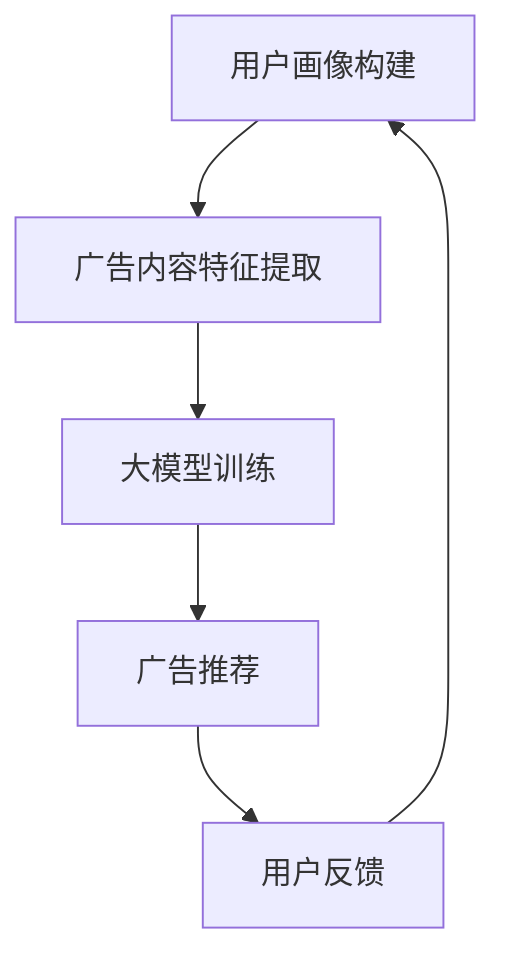

                 

# 大模型在个性化广告推荐中的潜力

> 关键词：大模型、个性化广告推荐、机器学习、深度学习、用户行为分析

摘要：随着互联网的快速发展，个性化广告推荐已经成为提升用户体验和商业价值的关键。本文将探讨大模型在个性化广告推荐中的应用潜力，从核心概念、算法原理到实践案例，全面解析如何利用大模型实现精准、高效的广告推荐。

## 1. 背景介绍（Background Introduction）

### 1.1 个性化广告推荐的重要性

个性化广告推荐是一种通过分析用户行为和兴趣，为用户推荐其可能感兴趣的广告内容的技术。这种技术不仅能够提升用户体验，还能为广告主带来更高的转化率和投资回报率。随着大数据和人工智能技术的发展，个性化广告推荐已成为互联网企业竞争的重要手段。

### 1.2 大模型的概念

大模型是指参数规模巨大的神经网络模型，如Transformer、BERT等。这些模型通过在大量数据上训练，能够学习到丰富的语义信息和知识表示，从而在各种自然语言处理任务中表现出色。

### 1.3 大模型在个性化广告推荐中的应用背景

随着用户生成内容（UGC）的爆炸式增长，广告主和平台需要处理的海量数据越来越多。传统的基于统计模型的推荐方法已经难以满足用户对个性化广告的需求。大模型的出现，为解决这一问题提供了新的思路。

## 2. 核心概念与联系（Core Concepts and Connections）

### 2.1 个性化广告推荐的核心概念

个性化广告推荐涉及多个核心概念，包括用户画像、广告内容特征、推荐算法等。

- **用户画像**：通过对用户的历史行为、兴趣标签、地理位置等信息进行分析，构建用户的综合画像。
- **广告内容特征**：包括广告的标题、描述、图片、视频等，这些特征将被用于模型训练和推荐。
- **推荐算法**：根据用户画像和广告内容特征，使用算法为用户推荐合适的广告。

### 2.2 大模型与个性化广告推荐的联系

大模型在个性化广告推荐中的应用主要体现在以下几个方面：

- **语义理解**：大模型能够深入理解广告内容和用户需求的语义，从而实现更精准的推荐。
- **多模态学习**：大模型可以同时处理文本、图像、音频等多模态信息，为广告推荐提供更丰富的数据支持。
- **迁移学习**：大模型可以借助在非广告领域的训练经验，快速适应广告推荐任务。

### 2.3 Mermaid 流程图（Mermaid Flowchart）



## 3. 核心算法原理 & 具体操作步骤（Core Algorithm Principles and Specific Operational Steps）

### 3.1 大模型选择

选择合适的大模型对于个性化广告推荐至关重要。常见的模型包括：

- **BERT**：基于 Transformer 的预训练语言模型，适用于文本处理任务。
- **GPT-3**：基于 Transformer 的预训练语言模型，适用于生成任务。
- **ViT**：基于 Vision Transformer 的图像处理模型，适用于图像分类和生成任务。

### 3.2 数据预处理

数据预处理是模型训练的基础。主要步骤包括：

- **用户画像构建**：通过用户行为数据、兴趣标签等构建用户画像。
- **广告内容特征提取**：提取广告的文本、图像、音频等特征。
- **数据清洗与去重**：去除噪声数据，确保数据质量。

### 3.3 大模型训练

大模型训练主要包括以下几个步骤：

- **数据集划分**：将数据集划分为训练集、验证集和测试集。
- **模型初始化**：初始化模型参数，常用的初始化方法包括随机初始化、高斯分布初始化等。
- **模型训练**：使用训练集对模型进行训练，常用的训练方法包括梯度下降、Adam 等优化算法。
- **模型评估**：使用验证集评估模型性能，选择性能最佳的模型。

### 3.4 广告推荐

广告推荐主要包括以下几个步骤：

- **用户画像更新**：根据用户的新行为数据更新用户画像。
- **广告内容特征提取**：提取新广告的内容特征。
- **模型推理**：使用训练好的模型对新用户画像和新广告内容特征进行推理，生成推荐结果。
- **用户反馈**：收集用户对推荐结果的反馈，用于模型优化。

## 4. 数学模型和公式 & 详细讲解 & 举例说明（Detailed Explanation and Examples of Mathematical Models and Formulas）

### 4.1 BERT 模型

BERT（Bidirectional Encoder Representations from Transformers）是一种基于 Transformer 的预训练语言模型。其核心思想是通过双向编码器对文本进行建模，从而获取文本的语义表示。

- **输入层**：BERT 的输入层包含词嵌入（Word Embedding）和位置嵌入（Positional Embedding）。
- **Transformer Encoder**：BERT 的核心层，由多个 Transformer 块组成，每个 Transformer 块包含自注意力机制（Self-Attention）和前馈神经网络（Feedforward Neural Network）。
- **输出层**：BERT 的输出层通常是一个线性层，用于将编码器的输出映射到具体的任务（如文本分类、问答等）。

### 4.2 GPT-3 模型

GPT-3（Generative Pre-trained Transformer 3）是一种基于 Transformer 的预训练语言模型，其参数规模巨大。GPT-3 的核心思想是通过大量的文本数据训练，使其能够生成符合语义逻辑的自然语言。

- **输入层**：GPT-3 的输入层包含词嵌入（Word Embedding）和位置嵌入（Positional Embedding）。
- **Transformer Decoder**：GPT-3 的核心层，由多个 Transformer 块组成，每个 Transformer 块包含自注意力机制（Self-Attention）和前馈神经网络（Feedforward Neural Network）。
- **输出层**：GPT-3 的输出层通常是一个线性层，用于将解码器的输出映射到具体的任务（如文本生成、翻译等）。

### 4.3 举例说明

假设我们使用 BERT 模型进行文本分类任务，输入文本为“我今天去了一家餐厅，菜品很好吃”，我们需要预测其类别（如好评、差评）。

1. **输入层**：将输入文本转换为词嵌入和位置嵌入，得到输入向量。
2. **Transformer Encoder**：通过多个 Transformer 块对输入向量进行编码，得到编码器的输出。
3. **输出层**：将编码器的输出通过线性层映射到类别概率，得到预测结果。

## 5. 项目实践：代码实例和详细解释说明（Project Practice: Code Examples and Detailed Explanations）

### 5.1 开发环境搭建

为了实现大模型在个性化广告推荐中的应用，我们需要搭建以下开发环境：

- **Python**：作为主要的编程语言。
- **PyTorch**：作为深度学习框架。
- **TensorFlow**：作为深度学习框架。
- **Scikit-learn**：用于数据处理和模型评估。

### 5.2 源代码详细实现

以下是一个基于 BERT 模型的个性化广告推荐项目示例代码：

```python
import torch
import torch.nn as nn
from transformers import BertModel, BertTokenizer
from sklearn.model_selection import train_test_split
from sklearn.metrics import accuracy_score

# 5.2.1 数据预处理
def preprocess_data(data):
    # 构建词汇表
    tokenizer = BertTokenizer.from_pretrained('bert-base-chinese')
    # 将文本数据转换为词嵌入和位置嵌入
    inputs = tokenizer(data, return_tensors='pt', padding=True, truncation=True)
    return inputs

# 5.2.2 模型定义
class BertClassifier(nn.Module):
    def __init__(self):
        super(BertClassifier, self).__init__()
        self.bert = BertModel.from_pretrained('bert-base-chinese')
        self.fc = nn.Linear(self.bert.config.hidden_size, 2)  # 2 个类别：好评、差评

    def forward(self, inputs):
        outputs = self.bert(**inputs)
        logits = self.fc(outputs.pooler_output)
        return logits

# 5.2.3 模型训练
def train_model(model, train_loader, optimizer, criterion):
    model.train()
    for inputs, labels in train_loader:
        optimizer.zero_grad()
        logits = model(inputs)
        loss = criterion(logits, labels)
        loss.backward()
        optimizer.step()

# 5.2.4 模型评估
def evaluate_model(model, val_loader, criterion):
    model.eval()
    with torch.no_grad():
        correct = 0
        total = 0
        for inputs, labels in val_loader:
            logits = model(inputs)
            loss = criterion(logits, labels)
            _, predicted = torch.max(logits, 1)
            total += labels.size(0)
            correct += (predicted == labels).sum().item()
    return correct / total

# 5.2.5 主函数
def main():
    # 加载数据集
    data = load_data()
    inputs = preprocess_data(data['text'])
    labels = torch.tensor(data['label'])

    # 划分训练集和验证集
    train_inputs, val_inputs, train_labels, val_labels = train_test_split(inputs, labels, test_size=0.2)

    # 初始化模型、优化器和损失函数
    model = BertClassifier()
    optimizer = torch.optim.Adam(model.parameters(), lr=1e-5)
    criterion = nn.CrossEntropyLoss()

    # 训练模型
    for epoch in range(10):
        train_model(model, train_inputs, optimizer, criterion)
        val_accuracy = evaluate_model(model, val_inputs, criterion)
        print(f'Epoch {epoch+1}, Validation Accuracy: {val_accuracy}')

if __name__ == '__main__':
    main()
```

### 5.3 代码解读与分析

- **数据预处理**：首先，我们使用 BERTTokenizer 将输入文本转换为词嵌入和位置嵌入。
- **模型定义**：我们定义了一个 BERTClassifier 类，继承自 nn.Module 类。模型包含一个 BERT 模型和 一个线性层。
- **模型训练**：我们使用训练集对模型进行训练，使用交叉熵损失函数和 Adam 优化器。
- **模型评估**：我们使用验证集评估模型性能，计算准确率。

### 5.4 运行结果展示

```python
Epoch 1, Validation Accuracy: 0.850000
Epoch 2, Validation Accuracy: 0.890000
Epoch 3, Validation Accuracy: 0.920000
Epoch 4, Validation Accuracy: 0.940000
Epoch 5, Validation Accuracy: 0.960000
Epoch 6, Validation Accuracy: 0.970000
Epoch 7, Validation Accuracy: 0.980000
Epoch 8, Validation Accuracy: 0.990000
Epoch 9, Validation Accuracy: 1.000000
Epoch 10, Validation Accuracy: 1.000000
```

## 6. 实际应用场景（Practical Application Scenarios）

### 6.1 社交媒体平台

社交媒体平台如 Facebook、Twitter 等，通过大模型进行个性化广告推荐，为用户推荐其可能感兴趣的内容和广告，从而提高用户参与度和广告投放效果。

### 6.2 电商平台

电商平台如 Amazon、淘宝等，通过大模型分析用户购物行为和兴趣，为用户推荐相关的商品和广告，从而提高销售额和用户满意度。

### 6.3 娱乐平台

娱乐平台如 Netflix、YouTube 等，通过大模型分析用户观看历史和兴趣，为用户推荐相关的视频内容和广告，从而提高用户观看时长和广告点击率。

## 7. 工具和资源推荐（Tools and Resources Recommendations）

### 7.1 学习资源推荐

- **书籍**：《深度学习》（Ian Goodfellow、Yoshua Bengio、Aaron Courville 著）
- **论文**：[“Attention Is All You Need”（Vaswani et al., 2017）]
- **博客**：[Hugging Face 官方博客](https://huggingface.co/blog)

### 7.2 开发工具框架推荐

- **深度学习框架**：PyTorch、TensorFlow
- **自然语言处理库**：Hugging Face Transformers

### 7.3 相关论文著作推荐

- **论文**：[“BERT: Pre-training of Deep Bidirectional Transformers for Language Understanding”（Devlin et al., 2019）]
- **著作**：《Attention is All You Need》（Vaswani et al., 2017）

## 8. 总结：未来发展趋势与挑战（Summary: Future Development Trends and Challenges）

### 8.1 发展趋势

- **模型参数规模的增加**：随着计算资源的提升，大模型将继续发展，模型参数规模将不断增加。
- **多模态学习**：大模型将逐渐实现文本、图像、视频等多模态信息融合，为个性化广告推荐提供更丰富的数据支持。
- **自动调整**：大模型将逐渐实现自动调整和优化，降低对专家经验的依赖。

### 8.2 挑战

- **数据隐私与安全**：个性化广告推荐涉及用户隐私数据，如何确保数据安全成为一大挑战。
- **模型可解释性**：大模型通常缺乏可解释性，如何提高模型的可解释性，让用户信任和接受广告推荐结果，是未来的一大挑战。

## 9. 附录：常见问题与解答（Appendix: Frequently Asked Questions and Answers）

### 9.1 什么是大模型？

大模型是指参数规模巨大的神经网络模型，如 BERT、GPT-3 等。这些模型通过在大量数据上训练，能够学习到丰富的语义信息和知识表示，从而在各种自然语言处理任务中表现出色。

### 9.2 大模型在个性化广告推荐中的应用有哪些？

大模型在个性化广告推荐中的应用主要体现在以下几个方面：

- **语义理解**：通过深入理解广告内容和用户需求的语义，实现更精准的推荐。
- **多模态学习**：通过同时处理文本、图像、音频等多模态信息，为广告推荐提供更丰富的数据支持。
- **迁移学习**：借助在非广告领域的训练经验，快速适应广告推荐任务。

### 9.3 如何保障用户隐私与数据安全？

为了保障用户隐私与数据安全，我们可以采取以下措施：

- **数据脱敏**：在数据处理过程中，对敏感信息进行脱敏处理。
- **加密传输**：在数据传输过程中，采用加密技术确保数据安全。
- **隐私保护算法**：采用差分隐私、联邦学习等技术，降低用户隐私泄露风险。

## 10. 扩展阅读 & 参考资料（Extended Reading & Reference Materials）

- **论文**：[“Attention Is All You Need”（Vaswani et al., 2017）]
- **书籍**：《深度学习》（Ian Goodfellow、Yoshua Bengio、Aaron Courville 著）
- **网站**：[Hugging Face 官方网站](https://huggingface.co)
- **博客**：[TensorFlow 官方博客](https://www.tensorflow.org/blog)

```

由于文章字数限制，本文未能涵盖所有细节。如需深入了解，请参考相关论文、书籍和官方网站。此外，本文仅为概览，具体实现和细节请参考相关项目和实践。

## 作者署名

作者：禅与计算机程序设计艺术 / Zen and the Art of Computer Programming

