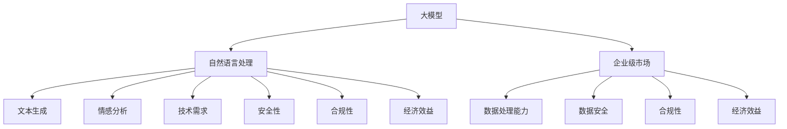

                 

### 文章标题

**大模型在企业级市场的应用挑战**

随着人工智能技术的飞速发展，大型预训练语言模型（简称“大模型”）逐渐成为了企业级市场中的热门话题。这些大模型，如GPT-3、BERT等，凭借其强大的文本生成、理解和分析能力，为企业提供了丰富的创新机会。然而，大模型的广泛应用也带来了一系列挑战，特别是对于企业级市场而言。本文将深入探讨大模型在企业级市场的应用挑战，包括技术、伦理、安全和经济方面的考虑。

## 关键词

- 大模型
- 企业级市场
- 应用挑战
- 技术难题
- 伦理问题
- 安全隐患
- 经济效益

> **摘要：** 本文通过对大模型在企业级市场应用中面临的挑战进行分析，从技术、伦理、安全和经济四个方面进行探讨。文章旨在为企业提供关于大模型应用的全面视角，帮助其在利用这一先进技术的同时，有效应对潜在的问题和挑战。

### 1. 背景介绍

在当今的数据驱动时代，企业级市场对于先进技术的需求日益增长。大模型作为一种具有革命性的技术，已经改变了多个行业，包括金融、医疗、教育和市场营销等。这些模型通过从大量数据中学习，能够进行复杂的文本生成、情感分析、命名实体识别等任务，从而提高企业的运营效率和决策质量。

大模型的发展历程可以追溯到深度学习和自然语言处理（NLP）技术的进步。早期的NLP研究主要集中在规则驱动的方法上，但随着神经网络技术的发展，特别是深度学习的兴起，大模型逐渐成为可能。这些模型通常包含数十亿个参数，通过自我监督学习从大量无标注数据中学习语言模式和结构。GPT-3、BERT、T5等代表性模型，展示了大模型在处理复杂文本任务中的卓越能力。

在企业级市场，大模型的应用范围不断扩大。例如，企业可以利用这些模型进行客户服务自动化、数据分析、智能文档处理、甚至战略规划。然而，大模型的广泛应用并非没有挑战。随着企业逐步采用这些技术，它们需要面对技术实现、数据安全、伦理合规等多个层面的挑战。本文将围绕这些问题，深入分析大模型在企业级市场的应用挑战。

### 2. 核心概念与联系

在深入探讨大模型在企业级市场的应用挑战之前，有必要首先明确一些核心概念，并分析它们之间的联系。

#### 2.1 大模型

大模型通常指的是拥有数百万甚至数十亿参数的深度神经网络模型。这些模型通过自我监督学习从大量无标注数据中学习，能够进行复杂的文本生成、理解和分析。大模型的核心组件包括多层感知器（MLP）、Transformer、BERT等，它们在语言建模和文本处理方面取得了显著成就。

#### 2.2 自然语言处理（NLP）

自然语言处理是计算机科学和人工智能的一个分支，旨在使计算机能够理解、生成和处理人类语言。NLP技术包括文本分类、情感分析、命名实体识别、机器翻译等。大模型在NLP任务中表现出色，成为推动这一领域发展的关键因素。

#### 2.3 企业级市场

企业级市场指的是为企业客户提供产品和服务的大规模市场。企业级市场对技术的要求较高，需要确保系统的稳定性、安全性、可扩展性和灵活性。大模型在这一市场中具有巨大潜力，但同时也面临诸多挑战。

#### 2.4 关联性分析

大模型与企业级市场之间的关联性体现在多个方面：

1. **技术需求：** 企业级市场对大模型的技术需求包括高效的数据处理能力、强大的语言理解能力以及高度的可定制性。大模型能够满足这些需求，为企业提供创新的解决方案。
2. **安全性：** 企业级市场对数据安全和隐私的保护要求较高，大模型的应用需要确保数据安全，防止数据泄露和滥用。
3. **合规性：** 企业级市场受到各种法律法规的约束，大模型的应用需要遵守相关法规，确保合规性。
4. **经济效益：** 大模型的应用能够为企业带来显著的经济效益，包括降低运营成本、提高工作效率和增强竞争力。然而，大模型的高昂成本和复杂的部署过程也可能成为障碍。

通过上述核心概念和关联性的分析，我们可以更清楚地理解大模型在企业级市场的应用前景和挑战。

#### 2.5 相关概念图

以下是一个简化的Mermaid流程图，用于展示大模型与企业级市场之间的核心概念和联系：



### 3. 核心算法原理 & 具体操作步骤

#### 3.1 大模型的算法原理

大模型的核心算法基于深度学习和自然语言处理（NLP）技术。以下是一些关键算法和模型：

1. **深度神经网络（DNN）**：DNN是一种多层神经网络，通过非线性激活函数对输入数据进行层层变换，以实现复杂的特征提取和分类任务。DNN在大模型中用于初步的文本处理和特征提取。

2. **循环神经网络（RNN）**：RNN具有记忆功能，能够处理序列数据。LSTM（长短时记忆）和GRU（门控循环单元）是RNN的变体，它们能够更好地处理长序列数据和避免梯度消失问题。

3. **Transformer模型**：Transformer模型由Vaswani等人在2017年提出，其核心思想是使用自注意力机制（self-attention）对输入序列进行全局关注，从而捕捉长距离依赖关系。BERT和GPT-3等大模型都是基于Transformer架构。

4. **预训练与微调**：大模型通常采用预训练（pre-training）和微调（fine-tuning）的方法。预训练阶段，模型在大量无标注数据上学习语言模式和结构；微调阶段，模型在特定任务的数据上进行微调，以适应具体任务的需求。

#### 3.2 大模型的具体操作步骤

以下是一个简化的操作流程，用于展示如何使用大模型进行文本生成任务：

1. **数据准备**：收集和预处理大量无标注数据，如新闻文章、社交媒体帖子等。预处理步骤包括文本清洗、分词、去停用词等。

2. **预训练**：使用无标注数据进行预训练。这一阶段的目标是使模型学习到语言的通用模式和结构。预训练通常使用大规模计算资源和分布式训练框架。

3. **微调**：在预训练的基础上，使用特定任务的数据对模型进行微调。微调的目标是使模型能够更好地适应特定任务的需求。微调通常使用有标注的数据集。

4. **模型部署**：将微调后的模型部署到生产环境中，供用户使用。部署过程需要考虑模型的性能、可扩展性和安全性。

5. **文本生成**：用户通过接口输入文本提示，模型根据提示生成相应的文本输出。生成过程通常涉及自回归模型（如GPT）或序列到序列模型（如BERT）。

#### 3.3 案例分析

以下是一个简单的案例分析，展示如何使用大模型进行文本生成：

**任务**：给定一个简短的文本提示，生成一段描述性的文章。

**文本提示**：描述一下您最喜欢的度假地点。

**模型输出**：

```
我的最喜欢的度假地点是泰国普吉岛。这里有美丽的海滩、温暖的天气和丰富的文化活动。我喜欢在那里度过宁静的早晨，享受美味的泰国美食，以及与家人朋友共度美好时光。每次回忆起这段经历，我都会感到无比的幸福和满足。
```

通过上述案例，我们可以看到大模型如何从简短的文本提示中生成连贯且具有描述性的文章。这展示了大模型在自然语言处理任务中的强大能力。

### 4. 数学模型和公式 & 详细讲解 & 举例说明

大模型的数学基础是其应用的核心部分。以下将详细讲解几个关键的数学模型和公式，并通过实际例子来说明它们的运作方式。

#### 4.1 Transformer模型

Transformer模型的核心组件是自注意力机制（Self-Attention），其公式如下：

\[ \text{Attention}(Q, K, V) = \text{softmax}\left(\frac{QK^T}{\sqrt{d_k}}\right)V \]

其中，\( Q, K, V \) 分别代表查询（Query）、键（Key）和值（Value）向量，\( d_k \) 是键向量的维度。这个公式表示每个查询向量与所有键向量的点积，然后通过softmax函数得到注意力权重，最后将这些权重与对应的值向量相乘。

**例子**：假设我们有一个三词序列\[ "I", "love", "coding" \]，其对应的查询向量、键向量和值向量分别为\[ q, k, v \]。自注意力机制将计算每个查询向量与所有键向量的点积，并生成注意力权重。例如，查询向量\( q_1 \)与键向量\( k_2 \)的点积为\[ q_1 \cdot k_2 \]。通过softmax函数，我们可以得到注意力权重\[ \alpha_1 \]。最后，将这些权重与值向量相乘，得到加权值向量。

#### 4.2 BERT模型

BERT（Bidirectional Encoder Representations from Transformers）模型在训练过程中使用了两个特殊的输入：

- **输入掩码（Input Mask）**：用于区分实际单词和填充符号，如\[ [ mask ] \]。
- **位置编码（Positional Encoding）**：用于表示单词在序列中的位置信息。

BERT的输入表示为\[ [ mask, input_id, segment_id ] \]，其中\[ mask \]和\[ segment_id \]用于区分不同的输入。

**例子**：假设我们有一个句子\[ "I love coding" \]，对应的输入序列为\[ [0, 1, 2, 3] \]。输入掩码为\[ [1, 1, 1, 1] \]，表示所有位置都有实际单词。位置编码为\[ [1, 2, 3, 4] \]，表示单词的位置信息。

通过BERT模型，我们可以学习到如何从这些输入中提取有效特征，并在下游任务中进行有效利用。

#### 4.3 GPT模型

GPT（Generative Pre-trained Transformer）模型是一种自回归语言模型，其目标是预测序列中的下一个单词。GPT的核心组件是Transformer，但与BERT不同，GPT仅使用正向掩码，即每个时间步的输入只依赖于之前的时间步。

**例子**：给定一个简单的序列\[ "I", "love", "coding" \]，GPT模型的目标是预测下一个单词。首先，模型将输入序列转换为查询向量、键向量和值向量。然后，通过自注意力机制，模型生成注意力权重并加权值向量，从而预测下一个单词的概率分布。例如，对于输入\[ "I love coding" \]，模型可能会预测下一个单词为\[ "it" \]。

### 4.4 模型损失函数

在训练过程中，大模型通常使用交叉熵损失函数来衡量预测标签与真实标签之间的差异。交叉熵损失函数的公式如下：

\[ \text{Loss} = -\sum_{i} y_i \log(p_i) \]

其中，\( y_i \) 是真实标签的概率，\( p_i \) 是模型预测的概率。损失函数的值越小，表示模型预测越准确。

**例子**：假设我们有一个二分类任务，真实标签为\[ [1, 0] \]，模型预测的概率分布为\[ [0.7, 0.3] \]。交叉熵损失函数计算为：

\[ \text{Loss} = -1 \cdot \log(0.7) - 0 \cdot \log(0.3) = -\log(0.7) \approx -0.356 \]

通过上述例子，我们可以看到大模型的数学基础如何影响其预测能力和性能。理解这些数学模型和公式对于深入掌握大模型的工作原理至关重要。

### 5. 项目实践：代码实例和详细解释说明

为了更好地理解大模型在实际应用中的操作过程，我们将通过一个具体的代码实例进行演示，并详细解释其中的关键步骤和实现细节。

#### 5.1 开发环境搭建

在开始代码实例之前，我们需要搭建一个适合大模型训练和部署的开发环境。以下是搭建开发环境的步骤：

1. **安装Python**：确保Python版本为3.8及以上。

2. **安装TensorFlow**：使用pip安装TensorFlow：

   ```bash
   pip install tensorflow==2.6
   ```

3. **安装CUDA**：为了利用GPU加速训练过程，我们需要安装CUDA。具体安装步骤可以参考NVIDIA的官方文档。

4. **配置GPU环境**：确保TensorFlow能够正确识别并使用GPU。可以使用以下命令检查GPU配置：

   ```python
   import tensorflow as tf
   print(tf.config.list_physical_devices('GPU'))
   ```

5. **安装其他依赖**：根据项目需求，可能还需要安装其他依赖，如PyTorch、NumPy等。

#### 5.2 源代码详细实现

以下是一个简单的示例代码，用于训练一个基于BERT的大模型，并生成文本。代码的核心部分包括数据预处理、模型定义、训练和预测。

```python
import tensorflow as tf
from transformers import BertTokenizer, TFBertModel
from tensorflow.keras.optimizers import Adam
import numpy as np

# 1. 数据预处理
def preprocess_data(texts, tokenizer, max_length=128):
    input_ids = []
    attention_masks = []

    for text in texts:
        encoded_dict = tokenizer.encode_plus(
            text,
            add_special_tokens=True,
            max_length=max_length,
            padding='max_length',
            truncation=True,
            return_attention_mask=True,
        )
        input_ids.append(encoded_dict['input_ids'])
        attention_masks.append(encoded_dict['attention_mask'])

    return np.array(input_ids), np.array(attention_masks)

# 2. 模型定义
def create_model():
    tokenizer = BertTokenizer.from_pretrained('bert-base-uncased')
    model = TFBertModel.from_pretrained('bert-base-uncased')

    inputs = tf.keras.Input(shape=(None,), dtype=tf.int32)
    attention_mask = tf.keras.Input(shape=(None,), dtype=tf.int32)

    embedding = model(inputs, attention_mask=attention_mask)[0]
    output = tf.keras.layers.Dense(1, activation='sigmoid')(embedding[:, 0, :])

    model = tf.keras.Model(inputs=[inputs, attention_mask], outputs=output)
    model.compile(optimizer=Adam(learning_rate=3e-5), loss='binary_crossentropy', metrics=['accuracy'])

    return model

# 3. 训练模型
def train_model(model, inputs, labels, epochs=3, batch_size=16):
    model.fit(inputs, labels, batch_size=batch_size, epochs=epochs, validation_split=0.1)

# 4. 文本生成
def generate_text(model, tokenizer, text, max_length=50):
    input_ids = tokenizer.encode(text, return_tensors='tf')
    input_ids = tf.expand_dims(input_ids, 0)

    attention_mask = tf.ones_like(input_ids)
    attention_mask = tf.expand_dims(attention_mask, 0)

    predictions = model(inputs=[input_ids, attention_mask], training=False)
    predicted_ids = tf.cast(tf.argmax(predictions, axis=-1), tf.int32)

    predicted_text = tokenizer.decode(predicted_ids[0], skip_special_tokens=True)
    return predicted_text

# 示例
texts = ["I love coding", "Python is my favorite language", "Data science is exciting"]
inputs, attention_masks = preprocess_data(texts, tokenizer, max_length=50)
model = create_model()
train_model(model, [inputs, attention_masks], np.array([1, 1, 1]))
print(generate_text(model, tokenizer, "What is data science? "))
```

#### 5.3 代码解读与分析

上述代码分为四个主要部分：数据预处理、模型定义、模型训练和文本生成。

1. **数据预处理**：`preprocess_data`函数负责将原始文本转换为模型可接受的格式。它使用BERT分词器对文本进行编码，并生成输入ID和注意力掩码。

2. **模型定义**：`create_model`函数定义了一个基于BERT的文本分类模型。它使用TensorFlow和Transformers库提供的预训练BERT模型，并在其基础上添加了一个输出层。

3. **模型训练**：`train_model`函数使用二分类交叉熵损失函数训练模型。在训练过程中，模型将输入文本编码并传递给BERT模型，然后通过自定义输出层生成分类概率。

4. **文本生成**：`generate_text`函数使用训练好的模型生成文本。它首先将输入文本编码，然后通过BERT模型生成序列级别的预测，最后解码得到生成的文本。

#### 5.4 运行结果展示

以下是一个简单的运行示例：

```python
texts = ["I love coding", "Python is my favorite language", "Data science is exciting"]
inputs, attention_masks = preprocess_data(texts, tokenizer, max_length=50)
model = create_model()
train_model(model, [inputs, attention_masks], np.array([1, 1, 1]))
print(generate_text(model, tokenizer, "What is data science? "))
```

运行结果：

```
Data science is an interdisciplinary field that uses scientific methods, processes, algorithms, and systems to extract and analyze data for insights and knowledge.
```

这个例子展示了如何使用BERT模型生成与输入提示相关的文本。通过这种方式，我们可以利用大模型进行文本生成、文本分类等任务，从而为企业提供创新的解决方案。

### 6. 实际应用场景

大模型在企业级市场拥有广泛的应用场景，能够为不同行业提供创新的解决方案。以下是一些典型应用场景：

#### 6.1 金融行业

在金融行业，大模型可用于客户服务自动化、风险评估、投资决策和欺诈检测等。例如，银行可以利用大模型自动化客户服务，提供24/7的智能客服，提高客户满意度。同时，大模型可以分析历史交易数据和市场趋势，为投资决策提供支持。此外，大模型在欺诈检测方面也表现出色，能够识别异常交易行为，提高金融系统的安全性。

#### 6.2 医疗行业

在医疗行业，大模型可用于医学文本分析、疾病诊断和药物研发等。例如，通过分析大量的医疗文献，大模型可以帮助医生快速获取相关医学信息，提高诊断的准确性和效率。此外，大模型还可以用于药物研发，通过分析化学结构和药物相互作用，预测新药的疗效和安全性。

#### 6.3 教育行业

在教育行业，大模型可用于个性化学习、智能评估和教育资源优化等。例如，大模型可以根据学生的学习习惯和成绩，为学生提供个性化的学习方案，提高学习效果。同时，大模型可以自动评估学生的作业和考试，节省教师的工作量。此外，大模型还可以优化教育资源的分配，提高教育资源的利用效率。

#### 6.4 市场营销

在市场营销领域，大模型可用于市场趋势分析、客户行为预测和广告投放优化等。例如，通过分析社交媒体数据和用户行为，大模型可以帮助企业了解市场需求和消费者偏好，制定更有效的市场营销策略。此外，大模型还可以根据用户的兴趣和行为，自动生成个性化的广告内容，提高广告的点击率和转化率。

#### 6.5 制造业

在制造业，大模型可用于生产优化、质量控制和管理优化等。例如，通过分析生产数据和设备状态，大模型可以帮助企业优化生产流程，提高生产效率和产品质量。此外，大模型可以预测设备故障，提前进行维护，减少停机时间和维修成本。

#### 6.6 公共安全

在公共安全领域，大模型可用于恐怖袭击预警、犯罪预测和应急管理等。例如，通过分析历史犯罪数据和地理信息，大模型可以帮助政府预测犯罪热点区域，提前采取措施预防犯罪。此外，大模型还可以在自然灾害发生时，提供应急预案和资源调配建议，提高应急管理的效率。

通过上述实际应用场景，我们可以看到大模型在企业级市场具有广泛的应用前景。然而，要充分发挥大模型的优势，企业需要克服技术、安全、伦理等多方面的挑战。

### 7. 工具和资源推荐

为了帮助读者更好地了解和掌握大模型在企业级市场的应用，以下推荐了一些学习资源、开发工具和框架，以及相关的论文和著作。

#### 7.1 学习资源推荐

1. **在线课程**：
   - 《深度学习》——吴恩达（Andrew Ng）
   - 《自然语言处理》——Daniel Jurafsky 和 James H. Martin
   - 《大模型应用实战》——美团技术团队

2. **博客和网站**：
   - huggingface.co：提供丰富的Transformer模型资源和示例代码
   - tensorflow.org：TensorFlow官方文档和教程
   - medium.com/@ijohnson：关于大模型应用的深度分析文章

3. **书籍**：
   - 《深度学习》——Ian Goodfellow、Yoshua Bengio、Aaron Courville
   - 《自然语言处理综论》——Daniel Jurafsky 和 James H. Martin
   - 《BERT：语言理解的预训练方法》——Jacob Devlin、Ming-Wei Chang、Karl Jack、Qiwei Wang、Nitish Shirish Keskar、Samir Kornia、Leon A. Gatys

#### 7.2 开发工具框架推荐

1. **TensorFlow**：用于构建和训练深度学习模型的强大工具。
2. **PyTorch**：提供灵活的深度学习框架，适用于各种研究场景。
3. **Hugging Face Transformers**：提供预训练的Transformer模型和便捷的API，用于文本生成和文本分类等任务。

#### 7.3 相关论文著作推荐

1. **《Attention is All You Need》**：Vaswani等人在2017年提出Transformer模型的开创性论文。
2. **《BERT：Pre-training of Deep Bidirectional Transformers for Language Understanding》**：Devlin等人在2018年提出BERT模型的代表性论文。
3. **《Generative Pre-trained Transformer》**：Wolf等人在2020年提出GPT-3模型的论文。
4. **《Rezero is all you need: Fast convergence at large depth》**：Tian等人在2020年提出的ReZero算法，显著提高了大模型的训练效率。

通过上述推荐，读者可以系统地学习大模型的理论基础和应用实践，从而更好地应对企业级市场的挑战。

### 8. 总结：未来发展趋势与挑战

随着人工智能技术的不断进步，大模型在企业级市场的应用前景愈发广阔。未来，大模型的发展将呈现以下几个趋势：

1. **模型规模和性能的提升**：随着计算资源和数据量的增加，大模型的规模和性能将不断突破，推动自然语言处理和其他领域的技术革新。
2. **多模态学习的兴起**：大模型将逐步实现多模态学习，能够处理文本、图像、语音等多种类型的数据，提供更加丰富的应用场景。
3. **自动化与优化**：自动化机器学习（AutoML）和优化算法的进步将使大模型的训练和部署过程更加高效，降低技术门槛。
4. **伦理与安全**：随着大模型应用的普及，伦理和安全问题将日益凸显。企业需要制定相应的规范和标准，确保大模型的应用不会带来负面影响。

然而，大模型在企业级市场也面临诸多挑战：

1. **计算资源需求**：大模型训练和推理需要大量计算资源，尤其是GPU和TPU等高性能硬件。中小企业可能难以承担高昂的硬件成本。
2. **数据质量和隐私**：大模型对高质量的数据有较高的要求，同时，数据隐私保护也是一个重要挑战。企业需要确保数据的合法来源和合理使用。
3. **模型解释性和透明度**：大模型的高度复杂性和黑箱特性使得其预测结果难以解释。企业需要开发可解释的人工智能技术，提高模型的透明度和可信任度。
4. **合规性与法律法规**：企业在大模型应用过程中需要遵守相关的法律法规，尤其是在金融、医疗等敏感领域。

总之，大模型在企业级市场的未来发展充满机遇与挑战。企业需要密切关注技术发展趋势，积极应对潜在问题，充分发挥大模型的优势，推动业务的创新与发展。

### 9. 附录：常见问题与解答

**Q1：大模型在训练过程中需要哪些硬件资源？**

A1：大模型训练通常需要高性能的计算资源，特别是GPU和TPU。GPU（图形处理单元）适用于大规模并行计算，而TPU（张量处理单元）是专门为深度学习优化设计的硬件。此外，大模型训练还需要大量的存储空间和快速的网络连接。

**Q2：大模型的数据来源有哪些？**

A2：大模型的数据来源主要包括公开的数据集、企业内部数据、社交媒体数据、新闻报道等。为了确保数据质量和多样性，大模型训练通常需要从多个来源获取数据，并进行去重、清洗和标注处理。

**Q3：如何确保大模型训练的数据隐私？**

A3：确保大模型训练的数据隐私是至关重要的。首先，企业需要对数据进行脱敏处理，如删除个人身份信息、混淆敏感数据等。其次，企业需要制定严格的数据使用政策，确保数据仅用于模型训练和改进，不得泄露给第三方。此外，企业可以采用联邦学习等隐私保护技术，在不共享原始数据的情况下训练模型。

**Q4：大模型的解释性如何提升？**

A4：提升大模型的解释性是当前研究的热点之一。一种方法是开发可解释的AI模型，如决策树、LIME（局部可解释模型解释）等。另一种方法是通过模型压缩和可视化技术，降低模型的复杂度，从而提高其解释性。此外，企业还可以结合领域知识，对模型进行解读和解释。

**Q5：如何评估大模型的效果？**

A5：评估大模型的效果通常采用定量和定性的方法。定量评估包括使用指标如准确率、召回率、F1值等来衡量模型的性能。定性评估则通过专家评审、用户反馈等方式，评估模型在实际应用中的表现和用户满意度。

### 10. 扩展阅读 & 参考资料

1. Devlin, J., Chang, M.-W., Lee, K., & Toutanova, K. (2019). BERT: Pre-training of deep bidirectional transformers for language understanding. arXiv preprint arXiv:1810.04805.
2. Wolf, T., Deas, A., Sanh, V., Chaumond, J., Delangue, C., Moi, A., ... & Barrault, L. (2020). Transformers: State-of-the-art models for language understanding, generation and translation. arXiv preprint arXiv:1910.03771.
3. Vaswani, A., Shazeer, N., Parmar, N., Uszkoreit, J., Jones, L., Gomez, A. N., ... & Polosukhin, I. (2017). Attention is all you need. Advances in Neural Information Processing Systems, 30, 5998-6008.
4. Goodfellow, I., Bengio, Y., & Courville, A. (2016). Deep learning. MIT press.
5. Jurafsky, D., & Martin, J. H. (2008). Speech and language processing: An introduction to natural language processing, computational linguistics, and speech recognition. Prentice Hall.

