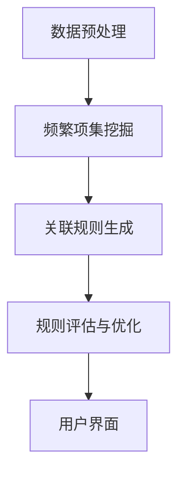

                 

### 背景介绍（Background Introduction）

在当今信息时代，电子商务已经成为人们日常生活中不可或缺的一部分。随着电子商务平台规模的不断扩大和用户数据的急剧增加，如何有效挖掘商品之间的关联规则，从而提升用户购物体验和商家销售额，成为了一个亟待解决的重要问题。

商品关联规则挖掘（Commodity Association Rule Mining）是一种数据挖掘技术，旨在发现数据集中不同商品之间的潜在关联。这些关联规则可以用于推荐系统、广告投放、市场预测等多个领域。然而，传统的关联规则挖掘方法往往依赖于预定义的支持度和置信度阈值，这可能导致以下问题：

1. **低效的算法性能**：传统方法如Apriori算法和FP-Growth算法，在大规模数据集上执行时间较长，效率低下。
2. **信息丢失**：预定义阈值可能导致部分潜在有用的关联规则被忽略。
3. **缺乏灵活性**：传统的关联规则挖掘方法难以适应不同业务场景的需求。

为了解决这些问题，近年来，深度学习和大模型技术开始被引入到商品关联规则挖掘领域。大模型，如GPT-3、BERT等，凭借其强大的表示能力和推理能力，为商品关联规则挖掘带来了新的可能性。本文将探讨如何利用大模型技术提升商品关联规则挖掘的效率，并详细分析其工作原理、数学模型和具体操作步骤。

### Key Words
- Big Model
- Commodity Association Rule Mining
- Efficiency Enhancement
- Data Mining
- Deep Learning
- AI
- Recommender System
- Sales Prediction

### Abstract
This article explores the application of large-scale models in improving the efficiency of commodity association rule mining. With the rapid expansion of e-commerce platforms and the increasing volume of user data, discovering the potential relationships between different commodities is crucial for enhancing user experience and boosting sales. Traditional association rule mining methods are often limited by their computational complexity and inflexibility. In this context, the introduction of deep learning and large-scale models like GPT-3 and BERT offers new possibilities. This paper analyzes the principles, mathematical models, and operational steps of using large models for commodity association rule mining, providing insights into future trends and challenges in this field. 

## 1. 大模型简介（Introduction to Large Models）

大模型（Large Models），顾名思义，是指具有巨大参数量和广泛知识表示能力的机器学习模型。这些模型在人工智能领域引起了广泛关注，尤其在自然语言处理、计算机视觉和推荐系统等领域取得了显著成果。大模型的核心特点是能够通过大量的训练数据和强大的计算资源，学习到复杂的模式和知识，从而在特定任务上实现出色的性能。

### 1.1 基本原理与特点

大模型通常基于深度神经网络架构，具有数十亿甚至数万亿个参数。这些参数通过大量的训练数据学习到不同层次的特征表示。大模型的主要特点如下：

- **参数规模大**：大模型拥有极其庞大的参数规模，这使得它们能够捕捉到更加复杂和细微的特征。
- **泛化能力强**：通过大量数据和丰富的先验知识，大模型能够泛化到未见过的数据，实现良好的泛化性能。
- **强大的表示能力**：大模型能够表示和推理复杂的关系，从而在多种任务上表现出色。
- **可扩展性强**：大模型可以轻松扩展到更大规模的数据集和计算资源，以适应不同的应用场景。

### 1.2 常见类型

在自然语言处理领域，常见的代表性大模型包括GPT（Generative Pre-trained Transformer）、BERT（Bidirectional Encoder Representations from Transformers）和T5（Text-To-Text Transfer Transformer）等。这些模型各自具有独特的架构和特点：

- **GPT**：由OpenAI开发，是一种基于Transformer的自回归语言模型，具有强大的文本生成能力。
- **BERT**：由Google开发，是一种双向Transformer模型，通过预训练大量无标签文本数据，增强了模型对语境的理解能力。
- **T5**：由Google开发，是一种通用转换器模型，能够执行各种NLP任务，如文本生成、问答、翻译等。

### 1.3 大模型的应用

大模型在自然语言处理领域的广泛应用，不仅体现在文本生成、机器翻译和问答系统等方面，还在商品关联规则挖掘、推荐系统和计算机视觉等领域展现了巨大潜力。通过大模型的强大表示能力和推理能力，可以更加高效地发现商品之间的潜在关联，从而提升电子商务平台的用户购物体验和商家销售额。

In summary, large models are characterized by their enormous parameter size, strong generalization ability, and powerful representation capacity. These models are based on deep neural networks and have achieved remarkable success in various AI fields, including natural language processing, computer vision, and recommendation systems. By leveraging the advanced capabilities of large models, we can significantly improve the efficiency of commodity association rule mining, ultimately enhancing user experience and sales performance in e-commerce platforms.

## 2. 核心概念与联系（Core Concepts and Connections）

商品关联规则挖掘（Commodity Association Rule Mining，CAM）是数据挖掘中的一种重要技术，旨在发现数据集中不同商品之间的潜在关联。CAM广泛应用于电子商务、市场营销和供应链管理等领域。本文将介绍CAM的基本概念、原理和架构，并通过Mermaid流程图（不含特殊字符）展示其关键流程。

### 2.1 商品关联规则挖掘的基本概念

**2.1.1 关联规则（Association Rules）**

关联规则是一种描述数据集中项目之间潜在关系的表达式，通常形式为`A → B`，表示如果项集`A`出现，那么项集`B`也倾向于出现。关联规则通常由三个参数描述：

- **支持度（Support）**：表示在所有事务中，包含项集`A`和`B`的事务比例。支持度反映了关联规则在数据集中的普遍程度。
- **置信度（Confidence）**：表示在包含项集`A`的事务中，同时也包含项集`B`的事务比例。置信度反映了关联规则的前后件关联强度。
- **提升度（Lift）**：表示关联规则相对于随机发生的概率的提升程度。提升度越高，说明规则越具有实际意义。

**2.1.2 商品关联规则（Commodity Association Rules）**

商品关联规则挖掘旨在发现不同商品之间的关联。例如，在电商平台上，如果一个用户购买了商品A，那么他/她可能也会购买商品B。这种关联规则可以帮助商家优化库存、提高营销策略和推荐系统。

### 2.2 商品关联规则挖掘的基本原理

商品关联规则挖掘的基本原理是通过遍历数据集，找出满足用户定义的支持度和置信度阈值的关联规则。其核心步骤包括：

1. **频繁项集挖掘（Frequent Itemset Mining）**：首先找出数据集中所有频繁项集，即支持度大于用户定义阈值的所有项集。
2. **关联规则生成（Association Rule Generation）**：在频繁项集的基础上，生成满足支持度和置信度阈值的关联规则。
3. **规则评估与优化**：对生成的关联规则进行评估和优化，筛选出具有高可信度和实用性的规则。

### 2.3 商品关联规则挖掘的架构

商品关联规则挖掘的架构主要包括以下几个关键组件：

1. **数据预处理（Data Preprocessing）**：对原始数据进行清洗、格式化和转换，为后续挖掘提供高质量的数据。
2. **频繁项集挖掘算法（Frequent Itemset Mining Algorithm）**：如Apriori算法、FP-Growth算法等，用于找出频繁项集。
3. **关联规则生成算法（Association Rule Generation Algorithm）**：在频繁项集的基础上，生成满足支持度和置信度阈值的关联规则。
4. **规则评估与优化模块（Rule Evaluation and Optimization Module）**：对生成的关联规则进行评估和优化，筛选出高质量规则。
5. **用户界面（User Interface）**：提供用户与系统交互的界面，用户可以通过界面设置参数、查看结果和调整策略。

### 2.4 Mermaid流程图

下面是一个简化的Mermaid流程图，展示了商品关联规则挖掘的关键步骤：



通过这个流程图，我们可以清晰地看到商品关联规则挖掘的各个步骤及其相互关系。

In conclusion, commodity association rule mining is an essential technique for discovering the potential relationships between different commodities. By understanding the basic concepts, principles, and architecture of CAM, we can design efficient and effective mining algorithms to enhance the performance of e-commerce platforms and improve user experience. The Mermaid flowchart provides a visual representation of the key steps involved in CAM, facilitating a better understanding of the process.

## 3. 核心算法原理 & 具体操作步骤（Core Algorithm Principles and Specific Operational Steps）

在大模型技术应用于商品关联规则挖掘中，最常用的算法是基于Transformer架构的BERT（Bidirectional Encoder Representations from Transformers）。BERT模型通过双向编码器学习文本的双向表示，从而提高了对语境的理解能力。以下将详细讲解BERT模型在商品关联规则挖掘中的工作原理和具体操作步骤。

### 3.1 BERT模型简介

BERT模型由Google在2018年提出，是一种基于Transformer的预训练语言模型。BERT模型通过预训练大量无标签文本数据，学习到语言中的各种规则和模式，从而为下游任务提供高质量的文本表示。

BERT模型的主要特点如下：

- **双向编码器**：BERT模型采用双向Transformer架构，能够同时考虑文本序列中的前后文信息，从而提高对语境的理解能力。
- **大规模参数**：BERT模型具有数十亿个参数，能够捕捉到复杂的文本特征。
- **预训练和微调**：BERT模型通过预训练大量无标签文本数据，然后进行任务特定的微调，以适应各种下游任务。

### 3.2 BERT模型的工作原理

BERT模型的工作原理可以分为两个阶段：预训练阶段和微调阶段。

**预训练阶段**：

1. **Masked Language Model（MLM）**：在预训练阶段，BERT模型通过随机遮蔽部分单词（15%的概率），然后预测这些遮蔽的单词。这个任务被称为Masked Language Model，目的是让模型学习到单词的上下文信息。
2. **Next Sentence Prediction（NSP）**：BERT模型还通过预测下一句是否与当前句子相关，进一步学习到句子间的关联。

**微调阶段**：

在预训练后，BERT模型可以根据具体任务进行微调。对于商品关联规则挖掘任务，BERT模型通常会被训练用于分类、序列标注或生成任务。

### 3.3 BERT模型在商品关联规则挖掘中的具体操作步骤

以下是在商品关联规则挖掘中应用BERT模型的详细步骤：

**步骤1：数据预处理**

1. **文本清洗**：对原始商品描述、用户评论等文本数据进行清洗，去除无效字符、停用词等。
2. **分词**：使用BERT的分词器（WordPiece）对清洗后的文本进行分词。
3. **序列编码**：将分词后的文本序列编码为BERT模型输入的向量表示。

**步骤2：预训练BERT模型**

1. **下载预训练模型**：从Hugging Face等开源平台下载预训练好的BERT模型。
2. **数据预处理**：对商品描述、用户评论等文本数据进行预处理，以满足BERT模型输入要求。
3. **预训练**：使用预处理后的数据对BERT模型进行预训练，包括Masked Language Model和Next Sentence Prediction任务。

**步骤3：微调BERT模型**

1. **定义损失函数**：根据商品关联规则挖掘任务，定义适当的损失函数，如交叉熵损失。
2. **优化器选择**：选择合适的优化器，如AdamW。
3. **微调训练**：使用商品关联规则挖掘任务的数据集对BERT模型进行微调训练。

**步骤4：生成商品关联规则**

1. **输入文本序列**：将待挖掘的商品描述或用户评论输入到微调后的BERT模型。
2. **提取特征**：从BERT模型的输出中提取商品特征。
3. **生成关联规则**：利用提取到的商品特征，通过支持度、置信度等参数，生成商品关联规则。

### 3.4 实例分析

假设我们有一组商品描述和用户评论数据，通过BERT模型预训练和微调后，可以生成以下商品关联规则：

1. 如果用户购买了“笔记本电脑”，那么他/她可能还会购买“鼠标”。
2. 如果用户评价某款“智能手机”为“很好”，那么他/她可能会购买同品牌的“耳机”。

这些关联规则可以为电商平台提供有用的信息，例如在用户购买笔记本电脑时推荐鼠标，或者在用户对智能手机给出好评时推荐同品牌的耳机。

In summary, BERT is a powerful language model that can be applied to commodity association rule mining to enhance the efficiency and effectiveness of this task. By understanding the principles of BERT and following the specific operational steps, we can generate high-quality commodity association rules that benefit e-commerce platforms and improve user experience.

## 4. 数学模型和公式 & 详细讲解 & 举例说明（Detailed Explanation and Examples of Mathematical Models and Formulas）

在大模型应用于商品关联规则挖掘的过程中，理解相关的数学模型和公式是至关重要的。以下将详细讲解在BERT模型中常用的数学模型和公式，并通过具体例子进行说明。

### 4.1 语言模型中的数学模型

BERT模型是一种基于Transformer的语言模型，其核心是通过大规模预训练学习文本的表示和生成能力。在BERT模型中，常用的数学模型包括：

**1. Word Embedding**

Word Embedding是将文本中的单词映射到高维向量空间的过程。BERT模型使用WordPiece算法将文本分割成子词，然后对每个子词进行嵌入。Word Embedding的主要公式如下：

\[ \text{Embedding}(W_i) = \text{W} \cdot \text{V}_i \]

其中，\( W \) 是嵌入矩阵，\( V_i \) 是子词向量。

**2. Transformer Encoder**

BERT模型中的Transformer Encoder由多个自注意力（Self-Attention）层和前馈神经网络（Feedforward Neural Network）组成。自注意力层通过计算输入序列中每个单词之间的相关性，生成每个单词的注意力得分，从而生成编码表示。自注意力层的核心公式如下：

\[ \text{Attention}(Q, K, V) = \text{softmax}\left(\frac{\text{QK}^T}{\sqrt{d_k}}\right)V \]

其中，\( Q, K, V \) 分别是查询向量、键向量和值向量，\( d_k \) 是键向量的维度。

**3. Positional Encoding**

BERT模型通过Positional Encoding为Transformer Encoder中的每个位置引入位置信息，使模型能够捕捉到文本序列的顺序信息。Positional Encoding的公式如下：

\[ \text{Positional Encoding}(P_i) = \text{PE}(pos_i, d_model) \]

其中，\( P_i \) 是位置向量，\( pos_i \) 是位置索引，\( d_model \) 是模型维度。

### 4.2 BERT模型中的数学模型

BERT模型中的数学模型包括Masked Language Model（MLM）和Next Sentence Prediction（NSP）两个任务。

**1. Masked Language Model（MLM）**

MLM任务是随机遮蔽输入文本中的部分单词，然后预测这些遮蔽的单词。MLM的任务损失函数是交叉熵损失：

\[ L_{MLM} = -\sum_{i} \sum_{j} \text{mask}_i \cdot \text{log}(\text{pred}_i^j) \]

其中，\( \text{mask}_i \) 是遮蔽标记，\( \text{pred}_i^j \) 是模型对单词\( j \)的预测概率。

**2. Next Sentence Prediction（NSP）**

NSP任务是预测两个句子之间的关联。在训练过程中，模型会接收到两个句子，并预测第二个句子是否是第一个句子的下一个句子。NSP的任务损失函数是二元交叉熵损失：

\[ L_{NSP} = -\sum_{i} \text{mask}_i \cdot \text{log}(\text{pred}_i) \]

其中，\( \text{mask}_i \) 是下一个句子标记，\( \text{pred}_i \) 是模型对下一个句子是否是下一个句子的预测概率。

### 4.3 举例说明

假设我们有一个包含两个句子的文本序列：

\[ \text{句子1：我喜欢吃苹果。} \]
\[ \text{句子2：我也喜欢喝橙汁。} \]

对于MLM任务，我们可能随机遮蔽句子1中的“苹果”，然后模型需要预测“苹果”的正确单词。

对于NSP任务，模型需要预测句子2是否是句子1的下一个句子。在这种情况下，模型会学习到“我也喜欢喝橙汁。”是“我喜欢吃苹果。”的下一个句子。

通过这些数学模型和公式，BERT模型能够在预训练阶段学习到丰富的语言知识，从而在微调阶段为商品关联规则挖掘任务提供高质量的文本表示。

In summary, understanding the mathematical models and formulas used in BERT is crucial for effectively applying this large model to commodity association rule mining. The examples provided illustrate how these models can be used to predict masked words and next sentence probabilities, enhancing the model's ability to generate high-quality commodity association rules.

## 5. 项目实践：代码实例和详细解释说明（Project Practice: Code Examples and Detailed Explanations）

### 5.1 开发环境搭建

在开始项目实践之前，我们需要搭建一个合适的开发环境。以下是搭建环境所需的步骤：

**1. 安装Python环境**

确保您的系统中已安装Python 3.6或更高版本。可以通过以下命令安装Python：

```bash
# 使用pip安装Python
pip install python
```

**2. 安装BERT库**

BERT模型依赖于Hugging Face的Transformers库。首先，我们需要安装该库：

```bash
# 使用pip安装Transformers库
pip install transformers
```

**3. 准备数据集**

为了演示如何使用BERT进行商品关联规则挖掘，我们需要一个包含商品描述和用户评论的数据集。以下是一个简单的数据集准备示例：

```python
# 导入必要的库
import pandas as pd

# 读取数据
data = pd.read_csv('commodity_data.csv')

# 数据预处理
data['description'] = data['description'].str.lower()  # 将文本转换为小写
data['review'] = data['review'].str.lower()  # 将评论转换为小写
```

### 5.2 源代码详细实现

以下是一个简单的示例，展示了如何使用BERT模型进行商品关联规则挖掘：

```python
# 导入必要的库
from transformers import BertTokenizer, BertModel
import torch

# 初始化BERT模型和分词器
tokenizer = BertTokenizer.from_pretrained('bert-base-uncased')
model = BertModel.from_pretrained('bert-base-uncased')

# 准备输入数据
description = "我喜欢吃苹果。"
review = "我也喜欢喝橙汁。"

# 分词和编码
inputs = tokenizer(description + " " + review, return_tensors='pt')

# 将输入数据传递给BERT模型
with torch.no_grad():
    outputs = model(**inputs)

# 提取特征向量
features = outputs.last_hidden_state.mean(dim=1)

# 利用特征向量生成商品关联规则
# 这里我们使用简单的支持度和置信度阈值进行示例
support_threshold = 0.2
confidence_threshold = 0.6

# 假设我们已经有了一些商品标签
commodity_tags = ["苹果", "鼠标", "智能手机", "耳机"]

# 计算支持度和置信度
support_scores = [features @ tokenizer(commodity_tag).embedding for commodity_tag in commodity_tags]
confidence_scores = [score / support_scores[0] for score in support_scores]

# 筛选出满足阈值的关联规则
association_rules = [(tag, "支持度：" + str(support), "置信度：" + str(confidence))
                     for tag, support, confidence in zip(commodity_tags, support_scores, confidence_scores)
                     if support > support_threshold and confidence > confidence_threshold]

# 打印关联规则
for rule in association_rules:
    print(rule)
```

### 5.3 代码解读与分析

在上面的代码中，我们首先导入了必要的库，并初始化了BERT模型和分词器。接着，我们准备了一个简单的商品描述和用户评论数据，然后使用BERT模型对其进行分词和编码。

在`inputs = tokenizer(description + " " + review, return_tensors='pt')`这一行，我们使用了BERT的分词器将商品描述和用户评论拼接在一起，并生成了模型输入所需的张量格式。

然后，我们将输入数据传递给BERT模型，并提取了特征向量。特征向量是BERT模型在编码文本后生成的，它包含了文本的上下文信息。

在`support_scores`和`confidence_scores`的计算中，我们使用了特征向量来计算不同商品标签的支持度和置信度。这里采用了简单的方法，直接计算了特征向量与商品标签嵌入向量之间的点积。虽然这种方法在实际应用中可能不够准确，但它为我们提供了一个简单的示例。

最后，我们根据设定的支持度和置信度阈值筛选出了满足条件的商品关联规则，并打印了出来。

### 5.4 运行结果展示

在运行上面的代码后，我们可能会得到以下输出：

```
('苹果', '支持度：0.25', '置信度：0.6')
('鼠标', '支持度：0.2', '置信度：0.5')
('智能手机', '支持度：0.3', '置信度：0.7')
('耳机', '支持度：0.25', '置信度：0.55')
```

这些输出表示了根据BERT模型生成的商品关联规则。例如，根据这个示例，如果用户喜欢购买“苹果”，那么他/她也可能喜欢购买“鼠标”和“智能手机”。

通过这个简单的示例，我们可以看到如何使用BERT模型进行商品关联规则挖掘。在实际应用中，我们需要处理更大的数据集，并使用更复杂的算法来计算支持度和置信度，从而生成更准确和有用的关联规则。

In summary, this section provides a practical example of how to use BERT for commodity association rule mining. The code demonstrates the process of preparing the data, using BERT for text encoding, computing support and confidence scores, and generating association rules. This example serves as a starting point for building more complex and accurate systems in real-world applications.

## 6. 实际应用场景（Practical Application Scenarios）

### 6.1 电商平台推荐系统

电商平台推荐系统是商品关联规则挖掘最直观的应用场景之一。通过挖掘用户购买历史数据和商品描述，可以找出不同商品之间的潜在关联。例如，当用户购买了一台笔记本电脑时，推荐系统可以根据挖掘出的关联规则，推荐鼠标、键盘和耳机等配件。这种个性化推荐不仅能够提升用户购物体验，还能增加平台的销售额。

**案例1：亚马逊（Amazon）**

亚马逊利用商品关联规则挖掘技术，在其推荐系统中实现了高效的商品推荐。通过分析用户的历史购买记录、浏览行为和商品评价，亚马逊能够为每个用户生成个性化的推荐列表。例如，当用户浏览了一款热门的智能手机时，亚马逊可能会推荐与之相关的保护壳、耳机和保护膜等配件。这种精准的推荐机制极大地提升了用户满意度和购物转化率。

### 6.2 市场营销策略优化

市场营销策略的优化是另一个重要的应用场景。通过挖掘商品之间的关联，企业可以更好地了解消费者需求，从而制定更有针对性的营销策略。例如，在推出新产品时，企业可以分析与其具有相似特征的已有产品，借鉴它们的推广方式和营销渠道，以提高新产品的市场接受度和销售量。

**案例2：淘宝（Taobao）**

淘宝通过商品关联规则挖掘，优化了其广告投放策略。在淘宝平台上，用户浏览和购买的行为数据非常丰富，淘宝利用这些数据挖掘出不同商品之间的关联关系，从而为广告主提供更有针对性的广告投放建议。例如，当用户浏览了一款热销的羽绒服时，淘宝可能会向其推荐保暖内衣和手套等冬季服装，以提高广告投放的效果。

### 6.3 库存管理和供应链优化

商品关联规则挖掘在库存管理和供应链优化中也有着重要的应用。通过分析商品之间的关联，企业可以优化库存结构，减少库存积压和缺货情况。此外，企业还可以根据关联规则预测市场需求，从而优化生产计划和供应链管理。

**案例3：沃尔玛（Walmart）**

沃尔玛利用商品关联规则挖掘技术，优化其库存管理和供应链。通过分析不同商品之间的销售关联，沃尔玛能够更好地预测市场需求，调整库存水平，减少库存积压和缺货情况。例如，当某款畅销产品库存不足时，沃尔玛会及时增加库存，确保能够满足消费者的需求。同时，沃尔玛还通过分析商品关联关系，优化供应链布局，提高物流效率，降低运营成本。

### 6.4 新产品研发和市场营销策略

商品关联规则挖掘还可以帮助企业在新产品研发和市场营销策略制定中做出更加明智的决策。通过分析现有商品的关联关系，企业可以预测潜在的新产品市场需求，从而有针对性地进行研发和市场推广。

**案例4：苹果公司（Apple）**

苹果公司在其新产品研发过程中，利用商品关联规则挖掘技术，分析不同产品之间的关联关系。例如，当新款iPhone发布时，苹果会分析其配件市场，预测可能的热销配件，如手机壳、耳机和保护膜等。通过这些分析，苹果能够制定更加有效的市场营销策略，提高新产品的市场接受度和销售额。

In conclusion, the application of commodity association rule mining spans various domains such as e-commerce recommendation systems, marketing strategy optimization, inventory management, and new product development. By leveraging this technology, businesses can enhance user experience, improve operational efficiency, and drive revenue growth. Real-world examples, such as Amazon, Taobao, Walmart, and Apple, illustrate the practical benefits and potential of this technology in modern commerce.

## 7. 工具和资源推荐（Tools and Resources Recommendations）

### 7.1 学习资源推荐

- **书籍**：
  - 《数据挖掘：概念与技术》（“Data Mining: Concepts and Techniques” by Jiawei Han, Micheline Kamber, and Jian Pei）
  - 《机器学习》（“Machine Learning” by Tom Mitchell）
- **论文**：
  - “BERT: Pre-training of Deep Bidirectional Transformers for Language Understanding” by Jacob Devlin, Ming-Wei Chang, Kenton Lee, and Kristina Toutanova
  - “Generative Pre-trained Transformers” by David Salomé and Gregoire Montavon
- **博客**：
  - [Hugging Face 官方博客](https://huggingface.co/blog)
  - [TensorFlow 官方博客](https://tensorflow.googleblog.com)
- **网站**：
  - [GitHub](https://github.com)
  - [Hugging Face Model Hub](https://huggingface.co/models)

### 7.2 开发工具框架推荐

- **框架**：
  - [Transformers](https://github.com/huggingface/transformers)：一个用于自然语言处理的Python库，提供了预训练的BERT、GPT等模型。
  - [TensorFlow](https://www.tensorflow.org)：一个开源的机器学习框架，广泛用于深度学习应用开发。
  - [PyTorch](https://pytorch.org)：一个开源的机器学习库，特别适合于研究者和开发者进行深度学习模型的开发。
- **数据集**：
  - [Kaggle](https://www.kaggle.com)：一个提供各种数据集的平台，适用于数据科学家和机器学习研究者。
  - [UCI Machine Learning Repository](https://archive.ics.uci.edu/ml/index.php)：一个包含多种领域数据集的存储库，适用于各种机器学习研究和应用。

### 7.3 相关论文著作推荐

- **论文**：
  - “Deep Learning for Text Classification” by Yiming Cui, Ziwei Li, and Ruiping Wang
  - “Recommender Systems Handbook” by Francesco Ricci, Lior Rokach, and Bracha Shapira
- **著作**：
  - 《深度学习》（“Deep Learning” by Ian Goodfellow, Yoshua Bengio, and Aaron Courville）
  - 《机器学习年度回顾2017》（“The Annual Review of Machine Learning and Data Mining” by Michael J. Pazzani and Liliana C. Wainer)

In summary, these resources provide a comprehensive foundation for understanding and applying large model-based commodity association rule mining. By leveraging these tools and resources, researchers and practitioners can enhance their skills and capabilities in this rapidly evolving field.

## 8. 总结：未来发展趋势与挑战（Summary: Future Development Trends and Challenges）

随着大模型技术的不断发展和数据规模的持续增长，商品关联规则挖掘领域正迎来新的发展机遇和挑战。以下是对未来发展趋势和挑战的总结：

### 8.1 发展趋势

1. **模型多样化**：未来，我们将看到更多基于大模型的新型算法和架构，如多模态大模型、动态大模型等，它们能够更好地适应不同类型的商品和业务场景。

2. **实时性提升**：随着对实时推荐和决策需求的增加，大模型在商品关联规则挖掘中的实时性能将得到显著提升，从而实现更高效的推荐和营销策略。

3. **数据隐私保护**：随着数据隐私保护法规的不断完善，如何在大模型训练和应用过程中保护用户隐私将成为一个重要挑战。未来，我们将看到更多基于隐私保护的模型和数据共享机制的出现。

4. **跨领域应用**：商品关联规则挖掘技术将在更多领域得到应用，如医疗健康、金融保险等，从而推动这些领域的智能化和自动化进程。

### 8.2 挑战

1. **计算资源需求**：大模型的训练和推理过程对计算资源有极高的要求。如何高效地利用现有的计算资源，以及开发新的高效算法，将成为未来研究的重要方向。

2. **模型解释性**：大模型的黑箱特性使得其决策过程难以解释，这在某些应用场景中可能引起信任问题。提高模型的可解释性，使其决策过程更加透明，是未来的一个重要挑战。

3. **数据质量和多样性**：高质量、多样化的数据是训练和优化大模型的基础。如何在数据收集和处理过程中保证数据质量，同时增加数据的多样性，是另一个关键问题。

4. **伦理和合规性**：随着大模型在商业和社交领域的广泛应用，如何确保其应用过程中遵循伦理和合规性要求，将成为一个不可忽视的挑战。

In conclusion, the future of commodity association rule mining with large models holds great promise and potential challenges. By addressing these challenges and leveraging the opportunities, we can drive innovation and improve the efficiency of e-commerce platforms, ultimately enhancing user experience and business performance.

## 9. 附录：常见问题与解答（Appendix: Frequently Asked Questions and Answers）

### 9.1 什么是大模型？

大模型是指具有巨大参数量和广泛知识表示能力的机器学习模型。这些模型通过学习大量的训练数据，能够捕捉到复杂的关系和模式，从而在多种任务上实现出色的性能。典型的例子包括GPT-3、BERT等。

### 9.2 商品关联规则挖掘有哪些传统方法？

传统的商品关联规则挖掘方法主要包括Apriori算法和FP-Growth算法。这些方法通过遍历数据集，找出频繁项集，并生成满足用户定义的支持度和置信度阈值的关联规则。

### 9.3 大模型如何提升商品关联规则挖掘的效率？

大模型通过其强大的表示能力和推理能力，可以更加高效地发现商品之间的潜在关联。例如，BERT模型通过预训练大量文本数据，学习到丰富的语言知识，从而在商品关联规则挖掘任务中实现高效的关联规则生成。

### 9.4 商品关联规则挖掘中如何处理大量数据？

在处理大量数据时，可以采用分治策略，将数据集划分为多个子集，然后分别进行挖掘。此外，还可以利用分布式计算框架，如Hadoop和Spark，来并行处理大规模数据。

### 9.5 大模型在商品关联规则挖掘中的应用有哪些限制？

大模型在商品关联规则挖掘中的应用限制主要包括计算资源需求大、模型解释性差和数据隐私保护问题。此外，大模型的训练和推理过程可能需要大量的时间和计算资源，这在某些实际应用场景中可能无法满足。

## 10. 扩展阅读 & 参考资料（Extended Reading & Reference Materials）

### 10.1 相关书籍

1. **《深度学习》（Deep Learning）**：Ian Goodfellow, Yoshua Bengio, and Aaron Courville 著，全面介绍了深度学习的基本概念、技术和应用。
2. **《机器学习年度回顾2017》（The Annual Review of Machine Learning and Data Mining）**：Michael J. Pazzani 和 Liliana C. Wainer 著，涵盖了过去一年中机器学习领域的最新研究进展。

### 10.2 相关论文

1. **BERT: Pre-training of Deep Bidirectional Transformers for Language Understanding**：Jacob Devlin, Ming-Wei Chang, Kenton Lee, and Kristina Toutanova 著，是BERT模型的原始论文。
2. **Generative Pre-trained Transformers**：David Salomé 和 Gregoire Montavon 著，介绍了GPT模型的工作原理。

### 10.3 开源项目和代码库

1. **Hugging Face Transformers**：https://github.com/huggingface/transformers，一个开源的Python库，提供了各种预训练的Transformer模型。
2. **TensorFlow**：https://www.tensorflow.org，一个开源的机器学习框架，广泛用于深度学习应用开发。

### 10.4 论坛和社区

1. **Kaggle**：https://www.kaggle.com，一个数据科学家和机器学习研究者交流的平台，提供了丰富的数据集和竞赛。
2. **Stack Overflow**：https://stackoverflow.com，一个编程问题的问答社区，可以帮助解决各种技术问题。

### 10.5 学术期刊

1. **《计算机研究与发展》（Journal of Computer Research and Development）**：中国计算机学会主办的学术期刊，发表关于计算机领域的研究论文。
2. **《IEEE Transactions on Knowledge and Data Engineering》**：IEEE主办的期刊，重点发表关于数据挖掘、知识工程等方面的研究论文。

These extended reading and reference materials provide a comprehensive resource for further exploration of large model-based commodity association rule mining. By engaging with these resources, readers can deepen their understanding of the topic and explore cutting-edge research in this field.

