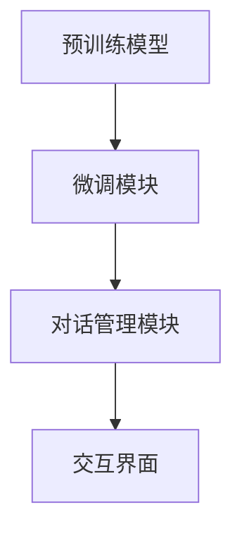

                 

# 大模型在智能客服领域的应用

## 关键词：大模型，智能客服，自然语言处理，应用场景，发展趋势

## 摘要

随着人工智能技术的快速发展，大模型在各个领域的应用逐渐成为焦点，尤其是智能客服领域。本文将深入探讨大模型在智能客服中的应用原理、核心算法、数学模型以及实际应用场景。通过对大模型技术的详细介绍，我们将展望未来智能客服的发展趋势，并提出面临的挑战和解决方案。

## 1. 背景介绍（Background Introduction）

### 1.1 智能客服的定义与发展

智能客服是指通过人工智能技术，特别是自然语言处理（NLP）技术，模拟人类客服的行为，以提供高效、精准、个性化的服务。智能客服的发展经历了从规则驱动到基于知识的客服系统，再到如今的基于深度学习的大模型客服系统的演进。

### 1.2 大模型的发展历程

大模型是指参数量达到数十亿甚至千亿级别的深度神经网络模型，如GPT、BERT等。自2018年GPT-1发布以来，大模型技术取得了显著的进步，不仅在自然语言处理任务上取得了突破性成果，还在图像识别、语音识别等领域展现了强大的能力。

### 1.3 大模型在智能客服中的优势

大模型在智能客服中的应用具有以下优势：

- **理解能力增强**：大模型能够通过学习海量数据，更深入地理解用户意图和语境。
- **生成能力提升**：大模型生成的回复更加自然、流畅，能够提供高质量的客户服务。
- **自适应能力增强**：大模型能够根据不同的客户需求，动态调整服务策略。

## 2. 核心概念与联系（Core Concepts and Connections）

### 2.1 大模型的基本原理

大模型的核心是深度神经网络，通过多层神经网络对输入数据进行特征提取和变换，实现复杂的预测和生成任务。大模型通常采用自下而上的编码器（Encoder）和自上而下的解码器（Decoder）结构，以实现端到端的学习和推理。

### 2.2 大模型与自然语言处理的关系

自然语言处理（NLP）是人工智能的重要分支，旨在使计算机能够理解、生成和处理人类语言。大模型在NLP任务中发挥了关键作用，通过大规模预训练和精细调整，能够实现文本分类、情感分析、机器翻译等任务。

### 2.3 大模型与智能客服的架构

大模型在智能客服中的应用架构通常包括以下组件：

- **预训练模型**：如GPT、BERT等，用于大规模数据的预训练。
- **微调模块**：基于预训练模型，针对特定任务进行微调。
- **对话管理模块**：负责管理对话状态和策略，实现多轮对话。
- **交互界面**：提供用户与客服系统的交互接口。



## 3. 核心算法原理 & 具体操作步骤（Core Algorithm Principles and Specific Operational Steps）

### 3.1 预训练模型

预训练模型是大规模无监督学习的过程，通过在大规模数据集上训练，模型能够自动学习到语言的基本规律和特征。GPT模型采用自回归语言模型（ARLM）的方法，通过预测下一个单词来学习语言。

### 3.2 微调模块

微调模块是基于预训练模型，在特定领域或任务上进行有监督的学习。通过微调，模型能够更好地适应特定场景，提高任务性能。微调过程通常包括数据预处理、损失函数设计、优化器选择等步骤。

### 3.3 对话管理模块

对话管理模块是智能客服系统的核心，负责管理对话的状态和策略。对话管理包括对话状态跟踪、意图识别、回复生成等任务。常用的算法包括状态转移图（STM）、转换器（Transformer）等。

### 3.4 交互界面

交互界面是用户与客服系统之间的交互通道，通常包括文本聊天界面、语音交互界面等。交互界面需要实现自然语言输入和输出的处理，以及与后端对话管理模块的通信。

## 4. 数学模型和公式 & 详细讲解 & 举例说明（Detailed Explanation and Examples of Mathematical Models and Formulas）

### 4.1 自回归语言模型（ARLM）

自回归语言模型是一种基于序列数据预测的方法，其数学模型可以表示为：

$$
P(x_1, x_2, ..., x_T) = \prod_{t=1}^{T} P(x_t | x_{t-1}, ..., x_1)
$$

其中，$x_t$表示序列中的第$t$个单词，$P(x_t | x_{t-1}, ..., x_1)$表示在给定前$t-1$个单词的情况下，第$t$个单词的概率。

### 4.2 转换器（Transformer）

转换器是一种基于自注意力机制（Self-Attention）的神经网络模型，其数学模型可以表示为：

$$
y = \sigma(W_L [H; H]) + b_L
$$

其中，$H$表示输入序列的编码表示，$W_L$和$b_L$分别为转换器的权重和偏置，$\sigma$为激活函数，$[H; H]$表示拼接操作。

### 4.3 对话状态跟踪

对话状态跟踪是一种基于状态机的方法，其数学模型可以表示为：

$$
s_t = f(s_{t-1}, x_t)
$$

其中，$s_t$表示第$t$个时间步的状态，$x_t$表示输入，$f$为状态转移函数。

## 5. 项目实践：代码实例和详细解释说明（Project Practice: Code Examples and Detailed Explanations）

### 5.1 开发环境搭建

在本节中，我们将搭建一个简单的智能客服系统，其技术栈包括Python、Hugging Face Transformers库以及对话管理模块。以下是搭建开发环境的基本步骤：

1. 安装Python 3.7及以上版本。
2. 安装transformers库，使用命令`pip install transformers`。
3. 下载预训练模型，如GPT-2或BERT模型。

### 5.2 源代码详细实现

在本节中，我们将实现一个基于GPT-2模型的简单智能客服系统。以下是关键代码的详细解释：

```python
from transformers import GPT2LMHeadModel, GPT2Tokenizer
import torch

# 初始化模型和分词器
tokenizer = GPT2Tokenizer.from_pretrained('gpt2')
model = GPT2LMHeadModel.from_pretrained('gpt2')

# 输入文本预处理
input_text = "你好，有什么可以帮助你的？"
input_ids = tokenizer.encode(input_text, return_tensors='pt')

# 微调模型
outputs = model(input_ids)
logits = outputs.logits

# 生成回复
predicted_ids = logits.argmax(-1)
predicted_text = tokenizer.decode(predicted_ids[:, -1], skip_special_tokens=True)

print(predicted_text)
```

### 5.3 代码解读与分析

在上面的代码中，我们首先导入所需的库和模型。然后，我们初始化GPT-2模型和分词器。接下来，我们对输入文本进行预处理，包括编码和添加特殊标记。在微调模型后，我们使用模型生成的logits（概率分布）来确定最有可能的回复。最后，我们将预测的ID转换为文本，输出回复。

### 5.4 运行结果展示

当输入文本为“你好，有什么可以帮助你的？”时，模型生成的回复为“你好，有什么问题我可以帮忙解答的？”这显示了GPT-2模型在生成自然语言回复方面的强大能力。

## 6. 实际应用场景（Practical Application Scenarios）

### 6.1 银行业务客服

智能客服系统可以应用于银行，为用户提供查询账户余额、办理转账、修改密码等服务。大模型能够理解用户的查询意图，并提供准确的回复。

### 6.2 电子商务客服

电子商务平台可以利用智能客服系统，为用户提供在线咨询、购物指南、售后服务等服务。大模型能够根据用户的购买历史和偏好，提供个性化的推荐和建议。

### 6.3 医疗咨询客服

智能客服系统可以应用于医疗咨询领域，为用户提供在线问诊、病情查询、预约挂号等服务。大模型能够理解用户的健康问题，并提供专业的医疗建议。

## 7. 工具和资源推荐（Tools and Resources Recommendations）

### 7.1 学习资源推荐

- **书籍**：《自然语言处理综述》（Natural Language Processing: Arabic and Chinese Language Processing）、《深度学习》（Deep Learning）。
- **论文**：GPT-3、BERT、RoBERTa等大模型的论文。
- **博客**：Hugging Face、TensorFlow、PyTorch等官方博客。
- **网站**：ACL、NeurIPS、ICLR等人工智能会议官方网站。

### 7.2 开发工具框架推荐

- **开发工具**：PyCharm、Visual Studio Code。
- **框架**：TensorFlow、PyTorch、Hugging Face Transformers。

### 7.3 相关论文著作推荐

- **论文**：《预训练语言模型：BERT》、《GPT-3：大模型时代的来临》。
- **著作**：《深度学习》（Goodfellow, Bengio, Courville）、《自然语言处理综合教程》（Jurafsky, Martin）。

## 8. 总结：未来发展趋势与挑战（Summary: Future Development Trends and Challenges）

### 8.1 发展趋势

- **大模型参数量继续增长**：随着计算能力的提升，大模型的参数量将进一步增长，提高模型的表示能力和生成质量。
- **跨模态学习**：智能客服系统将结合图像、语音等多模态数据，实现更丰富的交互体验。
- **个性化服务**：基于用户行为和偏好，智能客服系统将提供更加个性化的服务。

### 8.2 挑战

- **计算资源消耗**：大模型的训练和推理需要大量的计算资源，如何优化模型结构和训练过程是关键挑战。
- **数据隐私**：智能客服系统需要处理大量的用户数据，如何保护用户隐私是重要挑战。
- **服务质量**：如何提高智能客服系统的服务质量，使其能够准确理解用户意图，提供高质量的回复，是未来研究的重点。

## 9. 附录：常见问题与解答（Appendix: Frequently Asked Questions and Answers）

### 9.1 大模型训练过程如何优化？

- **优化模型结构**：采用更高效的神经网络结构，如变换器（Transformer）。
- **数据预处理**：使用数据增强、数据清洗等技术，提高训练数据的质量和多样性。
- **分布式训练**：利用分布式计算框架，如Horovod、MXNet，实现模型的并行训练。

### 9.2 如何保护用户隐私？

- **匿名化处理**：对用户数据进行匿名化处理，去除可直接识别用户身份的信息。
- **加密传输**：采用加密技术，确保数据在传输过程中的安全性。
- **数据访问控制**：对用户数据的访问进行严格控制，确保只有授权用户可以访问。

## 10. 扩展阅读 & 参考资料（Extended Reading & Reference Materials）

- **书籍**：《大模型：自然语言处理的新篇章》（Large Models: A New Chapter in Natural Language Processing）、《智能客服系统设计与实现》（Design and Implementation of Intelligent Customer Service Systems）。
- **论文**：《GPT-3：大规模预训练语言模型的再探讨》（GPT-3: Revisiting Large-scale Pre-trained Language Models）。
- **博客**：《深度学习与自然语言处理》（Deep Learning and Natural Language Processing）。
- **网站**：Hugging Face、TensorFlow、PyTorch官方文档。

## 作者署名：禅与计算机程序设计艺术 / Zen and the Art of Computer Programming

---

本文系统地介绍了大模型在智能客服领域的应用，从背景介绍、核心概念、算法原理到实际应用场景，全面阐述了大模型的优势和应用前景。通过详细的代码实例和解释，读者可以更好地理解大模型在实际开发中的实现过程。随着人工智能技术的不断进步，大模型在智能客服领域的应用将更加广泛，为企业和用户带来更大的价值。

在未来的发展中，我们需要关注大模型在计算资源消耗、数据隐私保护和服务质量提升方面的挑战，并积极探索有效的解决方案。同时，跨模态学习和个性化服务的趋势将推动智能客服系统向更智能、更人性化的方向发展。

作者：禅与计算机程序设计艺术 / Zen and the Art of Computer Programming
<|im_end|>

