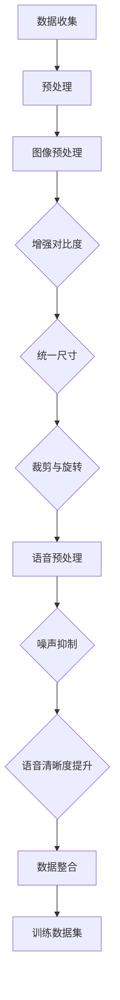
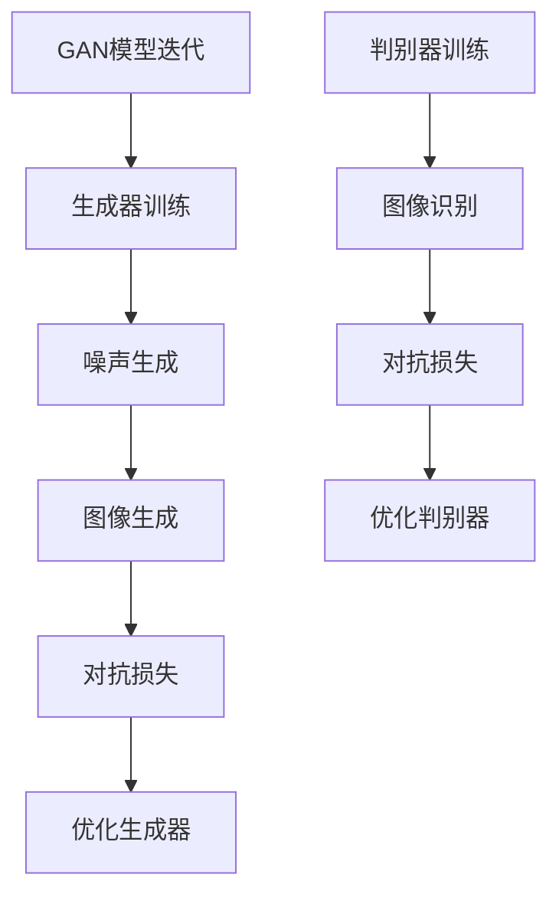
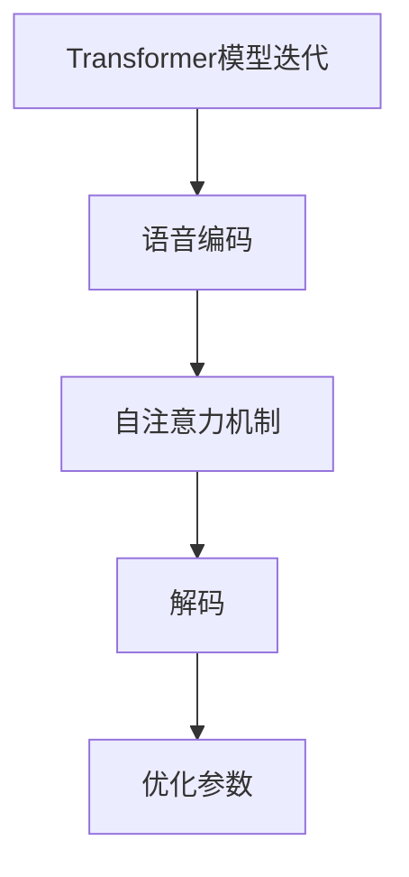

                 

### 文章标题

**大模型复活过世亲人的视频**：一场技术革命还是伦理灾难？

> **关键词**：大模型、视频复活、人工智能、伦理、技术革命

> **摘要**：本文将探讨大模型复活过世亲人视频这一前沿技术的可行性、技术原理及其伦理影响。通过深入分析，我们将评估这项技术是否有可能成为一场技术革命，还是一场潜在的伦理灾难。

在人工智能（AI）迅猛发展的今天，复活过世亲人视频的技术似乎已经不再是科幻电影的专属。这项技术的核心是通过大模型（如GAN、生成对抗网络）重建过世亲人的面貌和声音，使其在视频中出现。尽管这项技术令人震惊，但也引发了广泛的伦理和社会讨论。本文旨在探讨这一技术的现状、技术原理及其潜在影响。

本文将分为以下几个部分：

1. **背景介绍**：回顾相关技术的起源和过去的研究成果。
2. **核心概念与联系**：介绍大模型复活过世亲人视频的关键技术概念，如生成对抗网络（GAN）和变换器模型（Transformer）。
3. **核心算法原理 & 具体操作步骤**：详细解释如何使用大模型复活过世亲人视频。
4. **数学模型和公式 & 详细讲解 & 举例说明**：阐述大模型复活过世亲人视频背后的数学原理和算法。
5. **项目实践：代码实例和详细解释说明**：提供实际的项目实现和代码解释。
6. **实际应用场景**：探讨这项技术的潜在应用场景。
7. **工具和资源推荐**：推荐相关学习资源和开发工具。
8. **总结：未来发展趋势与挑战**：总结技术发展趋势和面临的挑战。
9. **附录：常见问题与解答**：回答读者可能关心的问题。
10. **扩展阅读 & 参考资料**：提供进一步阅读的资源。

通过本文的深入探讨，我们将对大模型复活过世亲人视频技术有一个全面的理解，并思考其伦理和社会影响。接下来，我们将从背景介绍开始，逐步深入探讨这一技术。

---

### 1. 背景介绍（Background Introduction）

大模型复活过世亲人视频的技术并非凭空出现，而是基于一系列相关领域的研究和技术的积累。最早的相关工作可以追溯到计算机视觉和语音识别领域，这些领域的进展为复活过世亲人视频奠定了基础。

#### 1.1 计算机视觉的发展

计算机视觉作为人工智能的一个重要分支，旨在让计算机理解和解释图像和视频中的内容。近年来，深度学习，尤其是卷积神经网络（CNN）的兴起，极大地推动了计算机视觉的发展。通过学习大量图像数据，CNN可以识别图像中的对象、场景和动作。这些技术为复活过世亲人视频提供了图像重建的基础。

#### 1.2 语音识别的进步

语音识别技术的发展同样为复活过世亲人视频提供了关键技术支持。早期的语音识别主要依赖于规则和统计模型，而现代语音识别则主要依赖于基于深度学习的神经网络模型。通过训练大量语音数据，这些模型可以准确地识别和合成语音。这对于实现过世亲人的语音合成至关重要。

#### 1.3 大模型的应用

大模型的引入，特别是生成对抗网络（GAN）和变换器模型（Transformer），为复活过世亲人视频提供了新的可能性。GAN是一种通过对抗训练生成数据的强大工具，可以生成逼真的图像和视频。变换器模型则在自然语言处理领域取得了巨大成功，通过自注意力机制，它可以捕捉文本中的长距离依赖关系。这些模型的应用使得复活过世亲人视频技术从理论走向实践。

#### 1.4 过去的研究成果

过去几年中，研究人员在复活过世亲人视频领域取得了一系列重要成果。例如，一些研究利用GAN将过世亲人的照片转换为视频，另一些研究则结合语音识别技术，实现过世亲人的语音合成。尽管这些研究在某些方面取得了突破，但还存在许多挑战，如图像和语音质量、人脸和语音的自然度等。

总的来说，复活过世亲人视频技术的发展是计算机视觉、语音识别和深度学习等多个领域研究积累的结果。随着技术的不断进步，这项技术正逐步从理论走向实际应用，但仍需克服许多技术和社会伦理上的挑战。接下来，我们将详细探讨这一技术的核心概念和联系。

---

### 2. 核心概念与联系（Core Concepts and Connections）

#### 2.1 生成对抗网络（GAN）

生成对抗网络（GAN）是由Ian Goodfellow等人在2014年提出的一种深度学习模型，它由两个神经网络——生成器（Generator）和判别器（Discriminator）组成。生成器的目标是生成逼真的图像，而判别器的目标是区分生成器生成的图像和真实图像。

GAN的训练过程可以视为一个零和游戏。生成器试图欺骗判别器，使其无法区分生成的图像和真实图像。而判别器则试图识别出生成图像和真实图像的差异。通过这种对抗训练，生成器不断优化其生成能力，最终能够生成高质量、逼真的图像。

#### 2.2 变换器模型（Transformer）

变换器模型是另一种深度学习模型，最初在自然语言处理领域取得了巨大成功。变换器模型的核心思想是自注意力机制（Self-Attention），它可以捕捉文本中的长距离依赖关系。

在变换器模型中，每个词都与所有其他词进行加权连接，从而捕捉词与词之间的依赖关系。这种自注意力机制使得变换器模型在处理长文本时表现出色。随着自注意力机制的引入，变换器模型逐渐成为自然语言处理领域的主流模型。

#### 2.3 GAN与Transformer的结合

为了实现复活过世亲人视频，研究人员将生成对抗网络（GAN）和变换器模型（Transformer）相结合。GAN负责生成逼真的视频图像，而变换器模型则负责生成与视频同步的语音。

首先，GAN被用来生成过世亲人的面部图像。通过训练大量过世亲人的照片，生成器可以学习到过世亲人的面部特征，并生成高质量、逼真的面部图像。

接下来，变换器模型被用来生成与视频同步的语音。通过输入过世亲人的语音数据，变换器模型可以生成与面部图像同步的语音。这种方法不仅确保了语音的自然度，还保证了语音与面部表情的一致性。

通过这种结合，生成器生成的面部图像和变换器模型生成的语音被同步到视频中，实现了复活过世亲人视频的目标。

#### 2.4 技术挑战与解决方案

尽管GAN和Transformer的结合为复活过世亲人视频提供了可能性，但这一技术仍面临许多挑战。首先，生成器需要大量高质量的过世亲人的照片和语音数据进行训练，这需要大量的计算资源和时间。其次，GAN的训练过程是高度对抗性的，需要精心调整训练参数，以确保生成器生成的图像和语音质量。

为了克服这些挑战，研究人员提出了一系列解决方案。例如，采用更高效的训练方法，如混合专家模型（Mixup）和自适应学习率调整，以提高GAN的训练效率和图像质量。此外，还研究了基于注意力机制的变换器模型，以更好地捕捉语音与面部表情的同步性。

总的来说，GAN和Transformer的结合为复活过世亲人视频提供了理论基础和实现方法。尽管面临许多技术挑战，但随着研究的深入，这些挑战有望得到逐步解决。接下来，我们将详细探讨如何使用这些核心概念和联系来复活过世亲人视频。

---

### 3. 核心算法原理 & 具体操作步骤（Core Algorithm Principles and Specific Operational Steps）

#### 3.1 数据收集与预处理

要复活过世亲人的视频，首先需要收集过世亲人的照片和语音数据。这些数据可以来自社交媒体、个人档案或公开的数据库。收集到的照片应包括不同表情、角度和光线条件，以便生成器能够学习到丰富的面部特征。同样，语音数据也应涵盖各种情境和语调，以提高语音合成的自然度。

在数据收集完成后，需要进行预处理。对于图像数据，可以通过缩放、裁剪和旋转等操作，使图像尺寸统一，并增强图像的对比度和清晰度。对于语音数据，可以采用语音增强技术，如噪声抑制和语音清晰度提升，以提高语音质量。

#### 3.2 GAN模型训练

生成对抗网络（GAN）的训练过程分为两个阶段：生成器和判别器的训练。

**生成器的训练：**

生成器的目标是从随机噪声中生成逼真的过世亲人图像。在训练过程中，生成器会尝试优化其生成能力，使其生成的图像逐渐逼近真实图像。

1. **随机噪声生成：** 在训练过程中，生成器首先从噪声空间中生成一组随机噪声向量。
2. **图像生成：** 生成器将这些噪声向量转换为过世亲人的图像。
3. **对抗损失：** 计算生成器生成的图像与真实图像之间的差异，以指导生成器的优化。

**判别器的训练：**

判别器的目标是最小化其对生成图像和真实图像的区分误差。

1. **图像识别：** 判别器接收真实图像和生成图像，并输出它们是真实图像的概率。
2. **对抗损失：** 计算判别器对生成图像和真实图像的区分误差，以指导判别器的优化。

通过不断迭代训练，生成器和判别器之间的对抗关系使生成器逐渐提高其生成能力，最终生成高质量的过世亲人图像。

#### 3.3 Transformer模型训练

变换器模型（Transformer）主要用于生成与面部图像同步的语音。其训练过程主要包括以下步骤：

1. **语音编码：** 将语音数据转换为序列编码表示。
2. **自注意力机制：** Transformer通过自注意力机制捕捉语音序列中的长距离依赖关系。
3. **解码：** 从编码序列中解码出语音信号。

在训练过程中，Transformer模型会尝试优化其自注意力机制和解码过程，以生成高质量、自然的语音。

#### 3.4 视频生成

在生成器训练完成后，可以通过以下步骤生成过世亲人的视频：

1. **生成面部图像：** 使用训练好的生成器，从噪声空间生成一系列过世亲人的面部图像。
2. **语音合成：** 使用训练好的变换器模型，生成与面部图像同步的语音信号。
3. **视频合成：** 将生成的面部图像和语音信号合成为一帧帧的视频。

通过这些步骤，我们可以实现复活过世亲人视频的目标。接下来，我们将深入探讨大模型复活过世亲人视频背后的数学模型和公式。

---

### 4. 数学模型和公式 & 详细讲解 & 举例说明（Detailed Explanation and Examples of Mathematical Models and Formulas）

#### 4.1 GAN模型

生成对抗网络（GAN）的核心在于其对抗性训练过程，下面我们详细探讨GAN的数学模型和公式。

**生成器（Generator）的损失函数：**

生成器试图从随机噪声\( z \)生成逼真的图像\( G(z) \)，其损失函数为：

\[ L_G = -\log(D(G(z))) \]

其中，\( D \)是判别器，\( G(z) \)是生成器生成的图像。\( L_G \)表示生成器生成的图像越逼真，判别器对它们的判别误差越小。

**判别器（Discriminator）的损失函数：**

判别器试图区分真实图像\( x \)和生成图像\( G(z) \)，其损失函数为：

\[ L_D = -[\log(D(x)) + \log(1 - D(G(z)))] \]

其中，\( x \)是真实图像，\( G(z) \)是生成器生成的图像。\( L_D \)表示判别器对真实图像和生成图像的区分误差。

**优化过程：**

为了优化生成器和判别器，我们通常采用梯度下降法。在每一步训练中，我们分别对生成器和判别器进行优化：

1. **生成器的优化：** 使用生成器的损失函数更新生成器的参数。
\[ \theta_G \leftarrow \theta_G - \alpha_G \cdot \nabla_{\theta_G} L_G \]

2. **判别器的优化：** 使用判别器的损失函数更新判别器的参数。
\[ \theta_D \leftarrow \theta_D - \alpha_D \cdot \nabla_{\theta_D} L_D \]

其中，\( \theta_G \)和\( \theta_D \)分别是生成器和判别器的参数，\( \alpha_G \)和\( \alpha_D \)分别是生成器和判别器的学习率。

#### 4.2 Transformer模型

变换器模型（Transformer）在自然语言处理领域取得了巨大成功，其核心在于其自注意力机制。下面我们详细探讨Transformer的数学模型和公式。

**自注意力机制：**

自注意力机制是一种用于捕捉文本序列中长距离依赖关系的方法。对于输入序列\( x_1, x_2, ..., x_n \)，自注意力机制计算每个词的权重，并生成新的嵌入表示：

\[ \text{Attention}(Q, K, V) = \text{softmax}\left(\frac{QK^T}{\sqrt{d_k}}\right) V \]

其中，\( Q, K, V \)分别是查询（Query）、键（Key）和值（Value）向量，\( d_k \)是键的维度。通过自注意力机制，每个词都可以与序列中的其他词进行加权连接，从而捕捉词与词之间的依赖关系。

**编码器和解码器：**

变换器模型通常由编码器（Encoder）和解码器（Decoder）组成。编码器将输入序列编码为嵌

