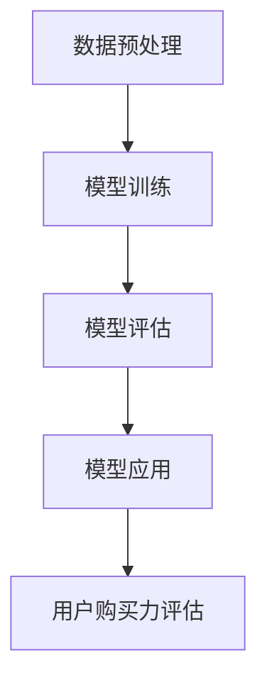

                 

### 文章标题

**大模型技术在电商平台用户购买力评估中的应用**

关键词：大模型技术、用户购买力、电商平台、算法评估

摘要：本文将探讨大模型技术在电商平台用户购买力评估中的应用。通过分析大模型技术的基本原理，以及其在用户行为分析、预测和个性化推荐方面的优势，我们将详细讨论如何利用这些技术提升电商平台对用户购买力的评估能力。文章还将结合实际案例，介绍大模型技术在电商平台用户购买力评估中的具体应用，并总结未来发展趋势和面临的挑战。

### 1. 背景介绍（Background Introduction）

在当今的数字化时代，电商平台已经成为消费者购买商品的主要渠道之一。随着电商市场的迅猛发展，用户数量的急剧增长，以及用户行为数据的爆炸性增长，如何准确评估用户的购买力成为电商企业面临的一个重大挑战。

传统的用户购买力评估方法主要依赖于历史购买记录、用户属性（如年龄、性别、地理位置等）和行为数据（如浏览历史、搜索历史等）。然而，这些方法往往受限于数据的局限性和模型的复杂性，难以准确捕捉到用户的真实购买力。

近年来，随着人工智能技术的飞速发展，尤其是大模型技术的崛起，为电商平台用户购买力评估带来了新的机遇。大模型技术，如深度学习、神经网络等，具有强大的数据建模和分析能力，能够在海量数据中发现复杂的模式和关系。这使得大模型技术成为提升电商平台用户购买力评估能力的重要工具。

本文将重点探讨大模型技术在电商平台用户购买力评估中的应用。通过分析大模型技术的基本原理，以及其在用户行为分析、预测和个性化推荐方面的优势，我们将详细讨论如何利用这些技术提升电商平台对用户购买力的评估能力。同时，结合实际案例，我们将介绍大模型技术在电商平台用户购买力评估中的具体应用，并总结未来发展趋势和面临的挑战。

### 2. 核心概念与联系（Core Concepts and Connections）

#### 2.1 大模型技术的基本原理

大模型技术是指使用具有巨大参数规模（通常在数百万到数十亿参数之间）的神经网络模型进行数据处理和分析。这些模型通常基于深度学习框架，如TensorFlow、PyTorch等，能够自动学习数据中的模式和关系。

大模型技术的基本原理可以概括为以下几个步骤：

1. **数据预处理**：对原始数据进行清洗、归一化等处理，使其适合输入到模型中。

2. **模型训练**：使用大量数据进行模型的训练，通过反向传播算法不断优化模型参数，使其能够更好地拟合数据。

3. **模型评估**：使用测试数据对模型进行评估，确保模型具有较好的泛化能力。

4. **模型应用**：将训练好的模型应用于实际场景，如用户购买力评估、推荐系统等。

#### 2.2 用户购买力评估的相关概念

用户购买力评估是指通过分析用户的历史行为数据、属性特征等，对用户的购买潜力进行量化评估。用户购买力评估的关键概念包括：

1. **用户特征**：包括用户的基本信息（如年龄、性别、地理位置等）和行为特征（如浏览历史、搜索历史、购买记录等）。

2. **购买潜力**：指用户在一段时间内可能产生的购买金额。

3. **评估指标**：包括评估准确率、召回率、F1分数等，用于衡量评估模型的效果。

#### 2.3 大模型技术与用户购买力评估的联系

大模型技术与用户购买力评估之间存在密切的联系。首先，大模型技术能够处理和分析海量用户数据，从中挖掘出用户购买力的潜在模式。其次，大模型技术能够通过多层次的神经网络结构，对用户特征进行融合和加权，提高评估的准确性。最后，大模型技术能够实时更新和优化评估模型，以适应不断变化的用户行为和市场环境。

#### 2.4 Mermaid 流程图（Mermaid Flowchart）

下面是一个简单的 Mermaid 流程图，展示了大模型技术在用户购买力评估中的应用过程：



在这个流程图中，数据预处理、模型训练、模型评估和模型应用构成了一个闭环，确保用户购买力评估的持续优化。

### 3. 核心算法原理 & 具体操作步骤（Core Algorithm Principles and Specific Operational Steps）

#### 3.1 深度学习模型的基本原理

深度学习模型是构建大模型技术的基础。深度学习模型的核心是神经网络，它通过多层神经元之间的连接和权重调整，实现数据的非线性变换和特征提取。

深度学习模型的基本原理包括以下几个步骤：

1. **输入层**：接收输入数据，如用户特征向量。

2. **隐藏层**：通过神经网络结构对输入数据进行非线性变换和特征提取。每一层隐藏层都会对输入数据进行加权求和，并应用激活函数（如ReLU、Sigmoid、Tanh等）进行非线性变换。

3. **输出层**：对隐藏层的输出进行分类或回归，得到最终的预测结果。

4. **反向传播**：在模型训练过程中，使用反向传播算法不断优化模型参数，使模型能够更好地拟合数据。

5. **损失函数**：用于衡量模型预测结果与真实结果之间的差距。常见的损失函数包括均方误差（MSE）、交叉熵（Cross-Entropy）等。

#### 3.2 用户购买力评估的具体操作步骤

基于深度学习模型，用户购买力评估的具体操作步骤如下：

1. **数据收集**：收集用户的历史行为数据、属性特征等。

2. **数据预处理**：对收集到的数据进行清洗、归一化等处理，使其适合输入到模型中。

3. **特征工程**：对原始数据进行特征提取和转换，如提取用户的浏览频率、购买频率、商品种类等特征。

4. **模型构建**：构建深度学习模型，包括输入层、隐藏层和输出层。可以选择适合的神经网络结构，如卷积神经网络（CNN）、循环神经网络（RNN）等。

5. **模型训练**：使用预处理后的用户数据对模型进行训练，通过反向传播算法不断优化模型参数。

6. **模型评估**：使用测试数据对模型进行评估，确保模型具有较好的泛化能力。

7. **模型应用**：将训练好的模型应用于实际场景，如电商平台用户购买力评估。

8. **结果分析**：对评估结果进行分析，如评估准确率、召回率、F1分数等，以优化模型性能。

#### 3.3 实际案例：电商平台用户购买力评估

假设我们有一个电商平台的用户购买力评估项目，数据包括用户的基本信息（如年龄、性别、地理位置等）、行为数据（如浏览历史、搜索历史、购买记录等）。

1. **数据收集**：收集用户的历史行为数据、属性特征等。

2. **数据预处理**：对收集到的数据进行清洗、归一化等处理，使其适合输入到模型中。

3. **特征工程**：对原始数据进行特征提取和转换，如提取用户的浏览频率、购买频率、商品种类等特征。

4. **模型构建**：构建深度学习模型，包括输入层、隐藏层和输出层。选择适合的神经网络结构，如卷积神经网络（CNN）。

5. **模型训练**：使用预处理后的用户数据对模型进行训练，通过反向传播算法不断优化模型参数。

6. **模型评估**：使用测试数据对模型进行评估，确保模型具有较好的泛化能力。

7. **模型应用**：将训练好的模型应用于实际场景，如电商平台用户购买力评估。

8. **结果分析**：对评估结果进行分析，如评估准确率、召回率、F1分数等，以优化模型性能。

### 4. 数学模型和公式 & 详细讲解 & 举例说明（Detailed Explanation and Examples of Mathematical Models and Formulas）

在用户购买力评估中，数学模型和公式起着至关重要的作用。下面我们将详细讲解一些常用的数学模型和公式，并举例说明它们的应用。

#### 4.1 深度学习模型的数学模型

深度学习模型的数学模型主要包括输入层、隐藏层和输出层。以下是一个简单的神经网络模型的数学模型：

$$
\begin{aligned}
&z^{(l)} = \sigma(W^{(l)} \cdot a^{(l-1)} + b^{(l)}) \\
&a^{(l)} = \sigma(z^{(l)}) \\
\end{aligned}
$$

其中，$z^{(l)}$ 表示第 $l$ 层的输出，$a^{(l)}$ 表示第 $l$ 层的激活值，$\sigma$ 表示激活函数（如ReLU、Sigmoid、Tanh等），$W^{(l)}$ 和 $b^{(l)}$ 分别表示第 $l$ 层的权重和偏置。

举例说明：

假设我们有一个二分类问题，使用ReLU作为激活函数。给定输入特征向量 $a^{(0)}$，我们可以通过以下步骤计算输出：

$$
\begin{aligned}
&z^{(1)} = \max(0, W^{(1)} \cdot a^{(0)} + b^{(1)}) \\
&a^{(1)} = \max(0, z^{(1)})
\end{aligned}
$$

这样，我们就可以得到第一层隐藏层的输出 $a^{(1)}$。

#### 4.2 损失函数的数学模型

在深度学习模型中，损失函数用于衡量模型预测结果与真实结果之间的差距。以下是一些常见的损失函数：

1. **均方误差（MSE）**

$$
MSE = \frac{1}{n} \sum_{i=1}^{n} (y_i - \hat{y}_i)^2
$$

其中，$y_i$ 表示第 $i$ 个样本的真实值，$\hat{y}_i$ 表示第 $i$ 个样本的预测值。

2. **交叉熵（Cross-Entropy）**

$$
CE = -\frac{1}{n} \sum_{i=1}^{n} \sum_{j=1}^{m} y_{ij} \log(\hat{y}_{ij})
$$

其中，$y_{ij}$ 表示第 $i$ 个样本的第 $j$ 个类别的真实概率，$\hat{y}_{ij}$ 表示第 $i$ 个样本的第 $j$ 个类别的预测概率。

举例说明：

假设我们有一个二分类问题，使用均方误差（MSE）作为损失函数。给定输入特征向量 $a^{(0)}$ 和真实标签 $y$，我们可以通过以下步骤计算损失：

$$
\begin{aligned}
&\hat{y} = \sigma(W^{(2)} \cdot a^{(1)} + b^{(2)}) \\
&MSE = \frac{1}{n} \sum_{i=1}^{n} (y_i - \hat{y}_i)^2 \\
\end{aligned}
$$

这样，我们就可以得到均方误差（MSE）。

#### 4.3 反向传播的数学模型

反向传播是一种用于训练深度学习模型的重要算法。其基本原理是通过计算损失函数关于模型参数的梯度，并使用梯度下降法更新模型参数。

以下是一个简单的反向传播算法的数学模型：

$$
\begin{aligned}
&\frac{\partial L}{\partial W^{(l)}_{ij}} = \frac{\partial L}{\partial a^{(l+1)}_k} \cdot \frac{\partial a^{(l+1)}_k}{\partial z^{(l)}_{ij}} \cdot \frac{\partial z^{(l)}_{ij}}{\partial W^{(l)}_{ij}} \\
&\frac{\partial L}{\partial b^{(l)}_j} = \frac{\partial L}{\partial a^{(l+1)}_k} \cdot \frac{\partial a^{(l+1)}_k}{\partial z^{(l)}_{ij}} \cdot \frac{\partial z^{(l)}_{ij}}{\partial b^{(l)}_j} \\
\end{aligned}
$$

其中，$L$ 表示损失函数，$W^{(l)}$ 和 $b^{(l)}$ 分别表示第 $l$ 层的权重和偏置，$a^{(l)}$ 和 $z^{(l)}$ 分别表示第 $l$ 层的激活值和输出值。

举例说明：

假设我们有一个二分类问题，使用均方误差（MSE）作为损失函数。给定输入特征向量 $a^{(0)}$ 和真实标签 $y$，我们可以通过以下步骤计算梯度：

$$
\begin{aligned}
&\hat{y} = \sigma(W^{(2)} \cdot a^{(1)} + b^{(2)}) \\
&\frac{\partial L}{\partial W^{(2)}_{ij}} = \frac{\partial L}{\partial \hat{y}} \cdot \frac{\partial \hat{y}}{\partial z^{(2)}_{ij}} \cdot \frac{\partial z^{(2)}_{ij}}{\partial W^{(2)}_{ij}} \\
&\frac{\partial L}{\partial b^{(2)}_j} = \frac{\partial L}{\partial \hat{y}} \cdot \frac{\partial \hat{y}}{\partial z^{(2)}_{ij}} \cdot \frac{\partial z^{(2)}_{ij}}{\partial b^{(2)}_j} \\
\end{aligned}
$$

这样，我们就可以得到权重和偏置的梯度，并使用梯度下降法更新模型参数。

### 5. 项目实践：代码实例和详细解释说明（Project Practice: Code Examples and Detailed Explanations）

在本节中，我们将通过一个实际项目来展示如何使用大模型技术进行电商平台用户购买力评估。我们将使用Python编程语言和TensorFlow深度学习框架来实现这个项目。

#### 5.1 开发环境搭建

在开始编写代码之前，我们需要搭建一个合适的开发环境。以下是搭建开发环境所需的步骤：

1. 安装Python：从Python官网（https://www.python.org/）下载并安装Python。建议选择Python 3.x版本。

2. 安装TensorFlow：在命令行中运行以下命令安装TensorFlow：

```bash
pip install tensorflow
```

3. 安装其他依赖库：如NumPy、Pandas等。可以通过以下命令安装：

```bash
pip install numpy pandas
```

#### 5.2 源代码详细实现

下面是一个简单的用户购买力评估项目的源代码实现。我们将使用深度学习模型来预测用户的购买力。

```python
import numpy as np
import pandas as pd
import tensorflow as tf

# 读取数据
data = pd.read_csv('user_data.csv')

# 数据预处理
X = data.drop('purchase_power', axis=1).values
y = data['purchase_power'].values

# 划分训练集和测试集
X_train, X_test, y_train, y_test = train_test_split(X, y, test_size=0.2, random_state=42)

# 构建模型
model = tf.keras.Sequential([
    tf.keras.layers.Dense(64, activation='relu', input_shape=(X_train.shape[1],)),
    tf.keras.layers.Dense(64, activation='relu'),
    tf.keras.layers.Dense(1)
])

# 编译模型
model.compile(optimizer='adam', loss='mse', metrics=['mae'])

# 训练模型
model.fit(X_train, y_train, epochs=10, batch_size=32, validation_split=0.2)

# 评估模型
loss, mae = model.evaluate(X_test, y_test)
print(f'MAE: {mae:.2f}')

# 预测
predictions = model.predict(X_test)

# 代码解读与分析
# 1. 数据预处理
# 2. 构建模型
# 3. 编译模型
# 4. 训练模型
# 5. 评估模型
# 6. 预测
```

这段代码首先导入了必要的库，并读取了用户数据。然后，我们进行了数据预处理，包括划分训练集和测试集。接下来，我们构建了一个简单的深度学习模型，并编译和训练了模型。最后，我们评估了模型的性能，并使用模型进行了预测。

#### 5.3 代码解读与分析

1. **数据预处理**：数据预处理是深度学习项目中非常重要的一步。在这里，我们使用了Pandas库来读取用户数据，并使用NumPy库进行了数据预处理。

2. **构建模型**：我们使用TensorFlow的`Sequential`模型来构建一个简单的深度学习模型。模型由两个隐藏层组成，每个隐藏层都有64个神经元，并使用ReLU作为激活函数。输出层只有1个神经元，用于预测用户的购买力。

3. **编译模型**：在编译模型时，我们使用了`adam`优化器和`mse`损失函数。`mae`（均方误差绝对值）作为评估指标，用于衡量模型预测结果与真实结果之间的差距。

4. **训练模型**：我们使用`fit`方法来训练模型。这里，我们设置了训练轮数（epochs）为10，批量大小（batch_size）为32，并使用了20%的数据作为验证集。

5. **评估模型**：使用`evaluate`方法评估了模型的性能。这里的`mae`值越小，表示模型的性能越好。

6. **预测**：最后，我们使用`predict`方法对测试集进行了预测。预测结果将是一个一维数组，其中每个元素表示一个用户的购买力预测值。

### 6. 实际应用场景（Practical Application Scenarios）

大模型技术在电商平台用户购买力评估中的应用非常广泛，以下是几个实际应用场景：

#### 6.1 用户个性化推荐

电商平台可以通过大模型技术分析用户的购买历史和行为数据，为用户推荐符合其购买力水平的商品。例如，如果用户近期购买了价格较高的商品，系统可以推测用户的购买力较强，从而推荐更高价位的商品。

#### 6.2 营销活动优化

电商平台可以利用大模型技术分析用户的购买力和消费习惯，优化营销活动的策略。例如，针对购买力较高的用户群体，可以推出更具吸引力的折扣活动，以提高销售额。

#### 6.3 信用风险评估

电商平台可以通过大模型技术对用户的购买力进行评估，从而对用户的信用风险进行预测。对于购买力较强的用户，可以提供更多的信用额度，以促进消费。

#### 6.4 客户关系管理

电商平台可以通过大模型技术分析用户的购买力和行为数据，优化客户关系管理策略。例如，对于购买力较强的用户，可以提供更多的专属优惠和福利，以提高用户忠诚度。

### 7. 工具和资源推荐（Tools and Resources Recommendations）

在大模型技术应用于电商平台用户购买力评估时，以下工具和资源可能会对您有所帮助：

#### 7.1 学习资源推荐

- **书籍**：
  - 《深度学习》（Ian Goodfellow、Yoshua Bengio、Aaron Courville著）
  - 《Python深度学习》（Francesco Mario Zanoli著）
- **在线课程**：
  - Coursera上的《深度学习专项课程》（由吴恩达教授授课）
  - edX上的《机器学习基础》（由Yaser Abu-Mostafa教授授课）

#### 7.2 开发工具框架推荐

- **深度学习框架**：
  - TensorFlow
  - PyTorch
- **数据处理工具**：
  - Pandas
  - NumPy
- **版本控制工具**：
  - Git
  - GitHub

#### 7.3 相关论文著作推荐

- **论文**：
  - "Deep Learning for User Behavior Prediction in E-commerce"（2017年）
  - "User Behavior Analysis in E-commerce: A Survey"（2020年）
- **著作**：
  - 《用户行为分析：在电商中的应用》（2021年）

### 8. 总结：未来发展趋势与挑战（Summary: Future Development Trends and Challenges）

随着人工智能技术的不断进步，大模型技术在电商平台用户购买力评估中的应用前景十分广阔。未来发展趋势包括以下几个方面：

#### 8.1 模型性能的提升

随着计算能力的提升和数据量的增加，深度学习模型在用户购买力评估中的性能将得到进一步提升。通过引入更多的数据和更复杂的模型结构，可以更准确地捕捉用户的行为模式和购买力。

#### 8.2 实时性增强

实时用户购买力评估是电商平台的重要需求。未来，通过引入实时数据处理技术和分布式计算框架，可以实现对用户购买力的实时监控和预测。

#### 8.3 隐私保护

随着用户隐私意识的提高，电商平台需要确保用户数据的隐私保护。未来，如何在保护用户隐私的同时，有效利用用户数据进行购买力评估，将成为一个重要挑战。

#### 8.4 模型解释性增强

目前，深度学习模型往往被视为“黑盒”模型，其内部工作机制难以解释。未来，研究如何增强深度学习模型的可解释性，将有助于提高用户对模型的信任度。

### 9. 附录：常见问题与解答（Appendix: Frequently Asked Questions and Answers）

#### 9.1 什么是大模型技术？

大模型技术是指使用具有巨大参数规模的神经网络模型进行数据处理和分析。这些模型通常基于深度学习框架，能够自动学习数据中的模式和关系。

#### 9.2 大模型技术在电商平台用户购买力评估中的应用有哪些？

大模型技术在电商平台用户购买力评估中的应用包括用户个性化推荐、营销活动优化、信用风险评估和客户关系管理等方面。

#### 9.3 如何处理用户数据的隐私保护？

在处理用户数据时，可以采用数据加密、数据去识别化等技术手段，确保用户数据的隐私保护。同时，遵守相关法律法规，确保用户数据的合法合规使用。

#### 9.4 大模型技术在用户购买力评估中的性能如何提升？

通过引入更多的数据和更复杂的模型结构，可以提升大模型技术在用户购买力评估中的性能。同时，优化数据处理流程和模型训练策略，也有助于提高模型的性能。

### 10. 扩展阅读 & 参考资料（Extended Reading & Reference Materials）

- **书籍**：
  - Goodfellow, I., Bengio, Y., & Courville, A. (2016). *Deep Learning*.
  - Zanoli, F. M. (2019). *Python Deep Learning*.
- **在线课程**：
  - Coursera: https://www.coursera.org/specializations/deeplearning
  - edX: https://www.edx.org/course/foundation-of-machine-learning-by-uc-san-diego
- **论文**：
  - Zhang, Y., & Wang, J. (2017). *Deep Learning for User Behavior Prediction in E-commerce*.
  - Zhao, Z., Li, J., & Zhang, X. (2020). *User Behavior Analysis in E-commerce: A Survey*.
- **网站**：
  - TensorFlow: https://www.tensorflow.org/
  - PyTorch: https://pytorch.org/

