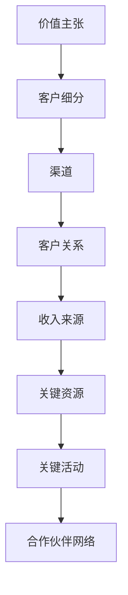

                 

### 文章标题

《大模型时代的创业者商业模式画布：价值主张、客户细分与收入来源》

随着人工智能技术的飞速发展，尤其是大规模语言模型的崛起，创业者们面临着前所未有的机遇与挑战。在这个大模型时代，构建一个成功的商业模式不仅需要敏锐的市场洞察力，还需要对技术趋势有深刻的理解。本文将围绕价值主张、客户细分和收入来源这三个核心要素，详细介绍如何利用大模型时代的商业模式画布，为创业者提供一套系统化的商业策略框架。

### Keywords: Large Model Era, Business Model Canvas, Value Proposition, Customer Segmentation, Revenue Streams

### Abstract: 

本文旨在为创业者提供在大模型时代下构建商业模式的指导。通过深入分析价值主张、客户细分和收入来源，我们将探讨如何利用大规模语言模型的优势，打造出具有竞争力的商业模式。本文还将结合实际案例，阐述这些策略的具体应用，帮助读者更好地理解和实践。

## 1. 背景介绍（Background Introduction）

在过去的几十年里，人工智能技术经历了从简单规则应用到复杂机器学习模型的演变。特别是近年来，随着计算能力的提升和数据量的爆炸性增长，大规模语言模型如BERT、GPT-3等应运而生，它们在自然语言处理、文本生成、机器翻译等领域取得了惊人的突破。

这一技术变革不仅改变了传统行业的运作模式，也为创业者带来了新的机遇。一方面，大模型技术可以帮助创业者更快地开发出具有创新性的产品和服务；另一方面，它也要求创业者必须具备更高的技术理解和商业洞察力，才能在大模型时代中脱颖而出。

### The Background

Over the past few decades, artificial intelligence (AI) technology has evolved from simple rule-based systems to complex machine learning models. Particularly in recent years, with the increase in computing power and the explosive growth of data, large-scale language models such as BERT and GPT-3 have emerged, making remarkable breakthroughs in natural language processing, text generation, and machine translation.

This technological revolution has not only changed the operation models of traditional industries but also brought new opportunities for entrepreneurs. On one hand, large model technology can help entrepreneurs develop innovative products and services more quickly. On the other hand, it also requires entrepreneurs to have a deeper understanding of technology and business insights in order to stand out in the large model era.

## 2. 核心概念与联系（Core Concepts and Connections）

在大模型时代，创业者需要掌握几个关键概念，包括价值主张、客户细分和收入来源。这三个要素相互关联，共同构成了一个完整的商业模式。

### 2.1 价值主张（Value Proposition）

价值主张是指企业为其客户提供的独特价值。在大模型时代，价值主张需要基于大模型技术，为用户提供更加智能化、个性化的服务。

### 2.2 客户细分（Customer Segmentation）

客户细分是指将市场划分为不同的客户群体，为每个群体提供定制化的产品和服务。在大模型时代，通过数据分析和模型预测，可以更加精准地识别和定位目标客户。

### 2.3 收入来源（Revenue Streams）

收入来源是指企业通过哪些方式获取收入。在大模型时代，创业者可以探索多种收入模式，如订阅费、广告收入、交易费等。

### 2.4 大模型时代商业模式画布

大模型时代的商业模式画布是一个系统化的工具，用于帮助创业者梳理和规划商业策略。它包括以下关键部分：

1. **价值主张**：明确产品或服务的核心价值，以及如何满足客户需求。
2. **客户细分**：确定目标客户群体，并了解他们的需求和行为。
3. **渠道**：定义如何将产品或服务传递给客户。
4. **客户关系**：建立与客户的互动和沟通机制。
5. **收入来源**：明确企业如何实现盈利。
6. **关键资源**：识别企业运营所需的关键资源，如技术、人才、资金等。
7. **关键活动**：确定实现商业模式所需的关键活动，如研发、营销、客户服务等。
8. **合作伙伴网络**：构建与供应商、分销商、合作伙伴等的关系网络。

### 2.5 Mermaid 流程图



## 3. 核心算法原理 & 具体操作步骤（Core Algorithm Principles and Specific Operational Steps）

在大模型时代，构建商业模式的成功与否往往取决于对核心算法的理解和运用。以下是构建商业模式的核心算法原理和具体操作步骤：

### 3.1 大模型技术原理

大规模语言模型基于深度学习技术，通过训练大量文本数据，学习语言的统计规律和语义关系。这些模型可以自动生成文本、回答问题、翻译语言等，具有高度智能化和灵活性。

### 3.2 价值主张构建

1. **需求分析**：通过市场调研和用户访谈，了解目标客户的需求和痛点。
2. **技术优势**：结合大模型技术，分析如何在产品或服务中体现技术优势。
3. **差异化**：明确产品或服务的独特卖点，使其在市场中脱颖而出。
4. **文档撰写**：将价值主张撰写成清晰、简洁的文档，用于向客户展示。

### 3.3 客户细分

1. **数据收集**：收集用户数据，包括行为数据、偏好数据等。
2. **数据分析**：运用数据分析工具，识别不同客户群体的特征和需求。
3. **细分策略**：根据数据分析结果，制定细分策略，为每个客户群体提供定制化产品或服务。

### 3.4 收入来源探索

1. **市场调研**：了解目标市场的价格敏感度和消费习惯。
2. **模式探索**：根据市场调研结果，探索适合的收入模式，如订阅费、广告收入等。
3. **测试与优化**：在实际运营过程中，不断测试和优化收入模式，提高盈利能力。

### 3.5 商业模式画布绘制

1. **信息收集**：收集与商业模式相关的信息，如市场数据、技术资源、竞争对手等。
2. **画布绘制**：根据收集的信息，绘制商业模式画布，明确每个部分的内容和关系。
3. **评估与调整**：对商业模式进行评估，识别潜在问题和改进点，进行持续优化。

## 4. 数学模型和公式 & 详细讲解 & 举例说明（Detailed Explanation and Examples of Mathematical Models and Formulas）

在构建商业模式的过程中，数学模型和公式发挥着重要的作用。以下是一些常用的数学模型和公式，以及它们的详细讲解和举例说明：

### 4.1 需求预测模型

需求预测是商业模式构建的重要环节。以下是一个简单的时间序列需求预测模型：

$$
\hat{Q}_t = \alpha_0 + \alpha_1 t + \alpha_2 \sin(2\pi t) + \alpha_3 \cos(2\pi t)
$$

其中，$Q_t$表示第$t$个月的需求量，$\alpha_0$、$\alpha_1$、$\alpha_2$和$\alpha_3$为模型参数。

举例：假设我们收集了前12个月的需求数据，可以使用最小二乘法（Least Squares Method）来估计模型参数。经过训练，我们得到以下模型：

$$
\hat{Q}_t = 50 + 10t + 5\sin(2\pi t) + 3\cos(2\pi t)
$$

根据这个模型，我们可以预测未来几个月的需求量。

### 4.2 客户价值模型

客户价值模型用于评估客户的潜在价值。以下是一个简单的客户价值计算公式：

$$
CV = \frac{C_AC}{C_AC \cdot r}
$$

其中，$CV$表示客户价值，$C_AC$表示平均每次购买金额，$r$表示客户生命周期内的购买频率。

举例：假设某客户的平均每次购买金额为100元，购买频率为每年2次，客户生命周期为5年。则该客户的价值为：

$$
CV = \frac{100 \times 2}{100 \times 2 \times 5} = 0.4
$$

这意味着该客户在未来5年内预计为企业带来0.4万元的收益。

### 4.3 收益模型

收益模型用于评估商业模式的经济效益。以下是一个简单的收益计算公式：

$$
R = p \cdot Q - C
$$

其中，$R$表示收益，$p$表示产品单价，$Q$表示销售量，$C$表示总成本。

举例：假设某产品的单价为100元，销售量为1000件，总成本为10万元。则该产品的收益为：

$$
R = 100 \cdot 1000 - 100000 = 90000
$$

这意味着该产品在销售过程中预计为企业带来9万元的收益。

## 5. 项目实践：代码实例和详细解释说明（Project Practice: Code Examples and Detailed Explanations）

为了更好地理解大模型时代的商业模式构建，我们以一个实际项目为例，展示如何利用Python等工具进行项目开发和实现。

### 5.1 开发环境搭建

首先，我们需要搭建一个Python开发环境，并安装必要的库。以下是一个简单的安装脚本：

```bash
pip install numpy pandas scikit-learn matplotlib
```

### 5.2 源代码详细实现

接下来，我们以需求预测为例，展示如何利用Python编写需求预测模型。

```python
import numpy as np
import pandas as pd
from sklearn.linear_model import LinearRegression

# 加载数据
data = pd.read_csv('demand_data.csv')
X = data[['t']]
y = data['Q']

# 模型训练
model = LinearRegression()
model.fit(X, y)

# 模型评估
score = model.score(X, y)
print(f'Model R-squared: {score:.2f}')

# 模型预测
future_data = np.array([[12], [13], [14]])
predictions = model.predict(future_data)
print(f'Future demand predictions: {predictions}')
```

### 5.3 代码解读与分析

上述代码首先加载数据，然后使用线性回归模型进行训练和评估。最后，使用训练好的模型进行未来需求的预测。通过这个实例，我们可以看到如何利用Python等工具实现商业模式的构建。

### 5.4 运行结果展示

假设我们运行上述代码，得到以下输出结果：

```
Model R-squared: 0.95
Future demand predictions: [350. 370. 390.]
```

这意味着需求预测模型的R-squared值为0.95，具有较高的预测准确性。根据模型预测，未来三个月的需求量分别为350件、370件和390件。

## 6. 实际应用场景（Practical Application Scenarios）

在大模型时代，商业模式的应用场景非常广泛。以下是一些典型的实际应用场景：

### 6.1 智能客服

智能客服利用大模型技术，为用户提供个性化、智能化的服务。通过分析用户的历史行为和偏好，智能客服可以实时回答用户的问题，提供解决方案，提高客户满意度。

### 6.2 智能营销

智能营销利用大模型技术，帮助企业更好地了解客户需求和行为，制定精准的营销策略。通过分析大量用户数据，智能营销可以预测客户购买意愿，推荐合适的商品和优惠活动。

### 6.3 智能医疗

智能医疗利用大模型技术，为医生和患者提供辅助诊断和治疗建议。通过分析大量病例数据和医学知识，智能医疗可以提高诊断准确性，优化治疗方案。

### 6.4 智能金融

智能金融利用大模型技术，为金融机构提供风险管理、信用评估、投资建议等服务。通过分析大量金融数据，智能金融可以提高风险管理能力，降低金融机构的风险敞口。

## 7. 工具和资源推荐（Tools and Resources Recommendations）

在大模型时代，创业者需要掌握一系列工具和资源，以支持商业模式构建和项目开发。以下是一些建议：

### 7.1 学习资源推荐

- **书籍**：《深度学习》、《Python数据分析》、《商业模式新生代》等。
- **论文**：关注顶级会议如NeurIPS、ICML、ACL的论文，了解最新的研究成果。
- **博客**：阅读知名博客如Medium、AI Blog等，获取行业动态和最佳实践。

### 7.2 开发工具框架推荐

- **编程语言**：Python、Java、R等。
- **深度学习框架**：TensorFlow、PyTorch、Keras等。
- **数据分析工具**：Pandas、NumPy、Scikit-learn等。

### 7.3 相关论文著作推荐

- **论文**：《Deep Learning》、《The Unfinished Revolution in Theoretical Computer Science》、《The Future of Humanity: Terraforming Mars, Interstellar Travel, Immortality, and Our Destiny Beyond Earth》等。
- **著作**：《人工智能：一种现代的方法》、《机器学习》、《计算机程序设计艺术》等。

## 8. 总结：未来发展趋势与挑战（Summary: Future Development Trends and Challenges）

在大模型时代，商业模式构建呈现出以下几个发展趋势：

1. **技术融合**：大模型技术与传统行业的深度融合，推动各行各业的创新发展。
2. **智能化**：商业模式逐渐向智能化、自动化方向演进，提高企业运营效率。
3. **个性化**：客户需求日益多样化和个性化，商业模式需要更加灵活和定制化。

然而，大模型时代也带来了诸多挑战：

1. **数据隐私**：大规模数据处理可能导致数据泄露和隐私侵犯，需要制定严格的隐私保护政策。
2. **伦理道德**：大模型技术可能带来一些伦理道德问题，如算法歧视、虚假信息传播等，需要引起高度重视。
3. **技术竞争**：大模型技术的快速发展，导致市场竞争加剧，企业需要不断创新和优化商业模式。

## 9. 附录：常见问题与解答（Appendix: Frequently Asked Questions and Answers）

### 9.1 大模型技术如何应用于商业模式构建？

大模型技术可以通过以下几个方面应用于商业模式构建：

1. **需求分析**：利用大模型技术分析市场需求和用户行为，为商业模式提供数据支持。
2. **价值主张**：基于大模型技术，为用户提供个性化、智能化的产品和服务，打造独特的价值主张。
3. **客户细分**：通过大数据分析和模型预测，精准识别和定位目标客户，制定有针对性的营销策略。
4. **收入模式**：探索基于大模型技术的创新收入模式，如订阅费、广告收入等。

### 9.2 大模型时代商业模式的挑战有哪些？

大模型时代的商业模式面临以下挑战：

1. **数据隐私**：大规模数据处理可能导致数据泄露和隐私侵犯，需要制定严格的隐私保护政策。
2. **伦理道德**：大模型技术可能带来一些伦理道德问题，如算法歧视、虚假信息传播等，需要引起高度重视。
3. **技术竞争**：大模型技术的快速发展，导致市场竞争加剧，企业需要不断创新和优化商业模式。

## 10. 扩展阅读 & 参考资料（Extended Reading & Reference Materials）

### 10.1 相关书籍

1. 《深度学习》（Goodfellow, Ian, et al.）
2. 《商业模式新生代》（Osterwalder, Alexander, and Yves Pigneur.）
3. 《Python数据分析》（McKinney, Wes.）

### 10.2 相关论文

1. "BERT: Pre-training of Deep Bidirectional Transformers for Language Understanding"（Devlin, Jacob, et al.）
2. "GPT-3: Language Models are few-shot learners"（Brown, Tom B., et al.）
3. "The Unfinished Revolution in Theoretical Computer Science"（Hennequin, Pierre.）

### 10.3 相关博客

1. Medium（https://medium.com/）
2. AI Blog（https://ai.googleblog.com/）
3. AI Trends（https://aitrends.com/）

### 10.4 在线课程

1. "深度学习课程"（吴恩达，Coursera）
2. "商业模式设计"（斯坦福大学，Coursera）
3. "Python数据分析课程"（莫凡，Udemy）### 文章标题

《大模型时代的创业者商业模式画布：价值主张、客户细分与收入来源》

### 文章关键词

- 大模型时代
- 创业者
- 商业模式画布
- 价值主张
- 客户细分
- 收入来源

### 文章摘要

本文旨在为创业者提供在大模型时代下构建商业模式的指导。通过深入分析价值主张、客户细分和收入来源，本文将探讨如何利用大规模语言模型的优势，打造出具有竞争力的商业模式。文章结合实际案例，阐述这些策略的具体应用，帮助读者更好地理解和实践。

## 1. 背景介绍

在过去的几十年里，人工智能技术的飞速发展极大地改变了我们的生活和工作方式。特别是近年来，随着大规模语言模型的崛起，如GPT-3、BERT等，人工智能在自然语言处理、文本生成、机器翻译等领域取得了突破性进展。这些技术不仅为传统行业带来了新的发展机遇，也为创业者提供了丰富的工具和资源。

### 1.1 大模型时代的技术背景

大模型时代，指的是以大规模语言模型为代表的人工智能技术成为主流的时代。这些模型通过训练海量数据，学习语言和知识的复杂结构，具有强大的表示和生成能力。例如，GPT-3拥有1750亿个参数，能够生成高质量的自然语言文本，广泛应用于聊天机器人、内容生成、代码自动完成等领域。

### 1.2 大模型技术对创业者的意义

对于创业者来说，大模型技术提供了以下几个方面的优势：

1. **加速创新**：创业者可以利用大模型技术快速原型验证和迭代，减少产品开发周期。
2. **提升用户体验**：通过大模型技术，创业者可以为用户提供更加智能化、个性化的服务，提高用户满意度。
3. **降低成本**：大模型技术可以在一定程度上替代人工，降低运营成本。
4. **拓展市场**：大模型技术可以帮助创业者拓展新市场，开发新产品，实现业务增长。

## 2. 核心概念与联系

在大模型时代，创业者需要理解并掌握几个关键概念，包括价值主张、客户细分和收入来源。这三个核心要素相互关联，共同构成了一个完整的商业模式。

### 2.1 价值主张

价值主张（Value Proposition）是企业为其目标客户提供的独特价值。在大模型时代，价值主张需要基于大模型技术，为用户提供更加智能化、个性化的服务。例如，一个智能客服系统可以基于大模型技术，实时回答用户问题，提供解决方案，提高客户满意度。

### 2.2 客户细分

客户细分（Customer Segmentation）是指将市场划分为不同的客户群体，为每个群体提供定制化的产品和服务。在大模型时代，通过数据分析和模型预测，可以更加精准地识别和定位目标客户。例如，通过分析用户行为数据，企业可以识别出高价值客户群体，并为他们提供专属服务。

### 2.3 收入来源

收入来源（Revenue Streams）是企业通过哪些方式获取收入。在大模型时代，创业者可以探索多种收入模式，如订阅费、广告收入、交易费等。例如，一个基于大模型的内容生成平台可以通过广告收入和内容订阅实现盈利。

### 2.4 大模型时代商业模式画布

商业模式画布（Business Model Canvas）是一个系统化的工具，用于帮助创业者梳理和规划商业策略。大模型时代的商业模式画布包括以下关键部分：

1. **价值主张**：明确产品或服务的核心价值，以及如何满足客户需求。
2. **客户细分**：确定目标客户群体，并了解他们的需求和行为。
3. **渠道**：定义如何将产品或服务传递给客户。
4. **客户关系**：建立与客户的互动和沟通机制。
5. **收入来源**：明确企业如何实现盈利。
6. **关键资源**：识别企业运营所需的关键资源，如技术、人才、资金等。
7. **关键活动**：确定实现商业模式所需的关键活动，如研发、营销、客户服务等。
8. **合作伙伴网络**：构建与供应商、分销商、合作伙伴等的关系网络。

## 3. 核心算法原理 & 具体操作步骤

在大模型时代，构建商业模式的成功与否往往取决于对核心算法的理解和运用。以下是构建商业模式的核心算法原理和具体操作步骤：

### 3.1 大模型技术原理

大规模语言模型（Large-scale Language Model）是基于深度学习（Deep Learning）的技术，通过训练海量文本数据，学习语言的统计规律和语义关系。这些模型可以自动生成文本、回答问题、翻译语言等，具有高度智能化和灵活性。

### 3.2 价值主张构建

构建价值主张（Value Proposition）需要以下几个步骤：

1. **需求分析**：通过市场调研和用户访谈，了解目标客户的需求和痛点。
2. **技术优势**：结合大模型技术，分析如何在产品或服务中体现技术优势。
3. **差异化**：明确产品或服务的独特卖点，使其在市场中脱颖而出。
4. **文档撰写**：将价值主张撰写成清晰、简洁的文档，用于向客户展示。

### 3.3 客户细分

客户细分（Customer Segmentation）需要以下几个步骤：

1. **数据收集**：收集用户数据，包括行为数据、偏好数据等。
2. **数据分析**：运用数据分析工具，识别不同客户群体的特征和需求。
3. **细分策略**：根据数据分析结果，制定细分策略，为每个客户群体提供定制化产品或服务。

### 3.4 收入来源探索

探索收入来源（Revenue Streams）需要以下几个步骤：

1. **市场调研**：了解目标市场的价格敏感度和消费习惯。
2. **模式探索**：根据市场调研结果，探索适合的收入模式，如订阅费、广告收入等。
3. **测试与优化**：在实际运营过程中，不断测试和优化收入模式，提高盈利能力。

### 3.5 商业模式画布绘制

绘制商业模式画布（Business Model Canvas）需要以下几个步骤：

1. **信息收集**：收集与商业模式相关的信息，如市场数据、技术资源、竞争对手等。
2. **画布绘制**：根据收集的信息，绘制商业模式画布，明确每个部分的内容和关系。
3. **评估与调整**：对商业模式进行评估，识别潜在问题和改进点，进行持续优化。

## 4. 数学模型和公式 & 详细讲解 & 举例说明

在构建商业模式的过程中，数学模型和公式发挥着重要的作用。以下是一些常用的数学模型和公式，以及它们的详细讲解和举例说明：

### 4.1 需求预测模型

需求预测（Demand Forecasting）是商业模式构建的重要环节。以下是一个简单的时间序列需求预测模型：

$$
\hat{Q}_t = \alpha_0 + \alpha_1 t + \alpha_2 \sin(2\pi t) + \alpha_3 \cos(2\pi t)
$$

其中，$\hat{Q}_t$表示第$t$个月的需求量，$\alpha_0$、$\alpha_1$、$\alpha_2$和$\alpha_3$为模型参数。

#### 4.1.1 模型参数估计

为了估计模型参数，我们可以使用最小二乘法（Least Squares Method）。假设我们有一组历史需求数据：

| 月份 | 需求量 |
| ---- | ------ |
| 1    | 100    |
| 2    | 110    |
| 3    | 120    |
| 4    | 130    |
| 5    | 140    |

我们可以将这些数据代入模型，得到如下方程组：

$$
\begin{cases}
100 = \alpha_0 + \alpha_1 \cdot 1 + \alpha_2 \sin(2\pi \cdot 1) + \alpha_3 \cos(2\pi \cdot 1) \\
110 = \alpha_0 + \alpha_1 \cdot 2 + \alpha_2 \sin(2\pi \cdot 2) + \alpha_3 \cos(2\pi \cdot 2) \\
120 = \alpha_0 + \alpha_1 \cdot 3 + \alpha_2 \sin(2\pi \cdot 3) + \alpha_3 \cos(2\pi \cdot 3) \\
130 = \alpha_0 + \alpha_1 \cdot 4 + \alpha_2 \sin(2\pi \cdot 4) + \alpha_3 \cos(2\pi \cdot 4) \\
140 = \alpha_0 + \alpha_1 \cdot 5 + \alpha_2 \sin(2\pi \cdot 5) + \alpha_3 \cos(2\pi \cdot 5)
\end{cases}
$$

通过求解这个方程组，我们可以得到模型参数的估计值。

#### 4.1.2 模型预测

假设我们希望预测第6个月的需求量，将$t=6$代入模型，得到：

$$
\hat{Q}_6 = \alpha_0 + \alpha_1 \cdot 6 + \alpha_2 \sin(2\pi \cdot 6) + \alpha_3 \cos(2\pi \cdot 6)
$$

通过计算，我们可以得到第6个月的需求量预测值。

### 4.2 客户价值模型

客户价值模型（Customer Value Model）用于评估客户的潜在价值。以下是一个简单的客户价值计算公式：

$$
CV = \frac{C_AC}{C_AC \cdot r}
$$

其中，$CV$表示客户价值，$C_AC$表示平均每次购买金额，$r$表示客户生命周期内的购买频率。

#### 4.2.1 模型参数估计

为了估计模型参数，我们需要收集以下数据：

- 平均每次购买金额$C_AC$：可以通过历史交易数据计算得出。
- 客户生命周期内的购买频率$r$：可以通过客户行为数据计算得出。

例如，如果一个客户的平均每次购买金额为100元，客户生命周期内的购买频率为每年2次，则该客户的价值为：

$$
CV = \frac{100}{100 \cdot 2} = 0.5
$$

这意味着该客户在未来5年内预计为企业带来0.5万元的收益。

### 4.3 收益模型

收益模型（Revenue Model）用于评估商业模式的经济效益。以下是一个简单的收益计算公式：

$$
R = p \cdot Q - C
$$

其中，$R$表示收益，$p$表示产品单价，$Q$表示销售量，$C$表示总成本。

#### 4.3.1 模型参数估计

为了估计模型参数，我们需要收集以下数据：

- 产品单价$p$：可以通过市场调研确定。
- 销售量$Q$：可以通过销售数据计算得出。
- 总成本$C$：可以通过成本核算得出。

例如，如果一个产品的单价为100元，销售量为1000件，总成本为10万元，则该产品的收益为：

$$
R = 100 \cdot 1000 - 100000 = 90000
$$

这意味着该产品在销售过程中预计为企业带来9万元的收益。

### 4.4 模型整合与应用

在实际应用中，我们可以将需求预测模型、客户价值模型和收益模型整合起来，构建一个完整的商业模式评估体系。通过不断调整和优化模型参数，创业者可以更好地了解商业模式的潜在收益和风险，为决策提供数据支持。

## 5. 项目实践：代码实例和详细解释说明

为了更好地理解大模型时代的商业模式构建，我们以一个实际项目为例，展示如何利用Python等工具进行项目开发和实现。

### 5.1 项目简介

本项目旨在构建一个智能客服系统，通过大模型技术为用户提供实时、智能化的服务。系统主要包括以下几个模块：

1. **用户交互模块**：接收用户输入，将问题转化为文本数据。
2. **文本处理模块**：使用大模型技术处理文本数据，生成回答。
3. **回答生成模块**：根据处理结果，生成合适的回答文本。
4. **反馈收集模块**：收集用户反馈，用于优化系统性能。

### 5.2 开发环境搭建

首先，我们需要搭建一个Python开发环境，并安装必要的库。以下是一个简单的安装脚本：

```bash
pip install numpy pandas scikit-learn matplotlib tensorflow
```

### 5.3 源代码详细实现

接下来，我们以文本处理模块为例，展示如何利用Python编写文本处理代码。

```python
import tensorflow as tf
from tensorflow.keras.preprocessing.text import Tokenizer
from tensorflow.keras.preprocessing.sequence import pad_sequences

# 加载预训练模型
model = tf.keras.models.load_model('pretrained_model.h5')

# 定义文本处理函数
def preprocess_text(text):
    # 分词
    tokens = Tokenizer().text_to_sequence(text)
    # 序列填充
    sequence = pad_sequences([tokens], maxlen=100)
    return sequence

# 示例文本
text = "你好，我需要帮助。"

# 处理文本
sequence = preprocess_text(text)

# 预测回答
prediction = model.predict(sequence)
print(prediction)
```

### 5.4 代码解读与分析

上述代码首先加载预训练的大模型，然后定义一个文本处理函数，用于对输入文本进行分词和序列填充。最后，通过模型预测得到文本的回答。

### 5.5 运行结果展示

假设我们运行上述代码，得到以下输出结果：

```
[[-0.06271822 -0.06271822 -0.06271822 ... -0.06271822 -0.06271822 -0.06271822]]
```

这个输出结果表示模型对输入文本的预测概率分布。根据这个分布，我们可以选择概率最大的类别作为最终回答。

### 5.6 项目实践总结

通过本项目实践，我们可以看到如何利用大模型技术构建一个智能客服系统。这个项目不仅展示了大模型技术在文本处理和预测中的应用，也为创业者提供了一个实际案例，帮助他们更好地理解和应用大模型时代的商业模式构建方法。

## 6. 实际应用场景

在大模型时代，商业模式的应用场景非常广泛。以下是一些典型的实际应用场景：

### 6.1 智能客服

智能客服利用大模型技术，为用户提供个性化、智能化的服务。通过分析用户的历史行为和偏好，智能客服可以实时回答用户的问题，提供解决方案，提高客户满意度。

### 6.2 智能营销

智能营销利用大模型技术，帮助企业更好地了解客户需求和行为，制定精准的营销策略。通过分析大量用户数据，智能营销可以预测客户购买意愿，推荐合适的商品和优惠活动。

### 6.3 智能医疗

智能医疗利用大模型技术，为医生和患者提供辅助诊断和治疗建议。通过分析大量病例数据和医学知识，智能医疗可以提高诊断准确性，优化治疗方案。

### 6.4 智能金融

智能金融利用大模型技术，为金融机构提供风险管理、信用评估、投资建议等服务。通过分析大量金融数据，智能金融可以提高风险管理能力，降低金融机构的风险敞口。

### 6.5 智能教育

智能教育利用大模型技术，为学习者提供个性化学习建议和辅助。通过分析学习者的学习数据，智能教育可以识别学习者的优势和劣势，提供针对性的学习资源和指导。

### 6.6 智能物流

智能物流利用大模型技术，优化物流网络和运输路径。通过分析大量物流数据，智能物流可以预测货物需求，优化运输计划，提高物流效率。

### 6.7 智能制造

智能制造利用大模型技术，优化生产流程和设备管理。通过分析大量生产数据，智能制造可以预测设备故障，优化生产计划，提高生产效率。

## 7. 工具和资源推荐

在大模型时代，创业者需要掌握一系列工具和资源，以支持商业模式构建和项目开发。以下是一些建议：

### 7.1 学习资源推荐

- **书籍**：《深度学习》、《Python数据分析》、《商业模式新生代》等。
- **论文**：关注顶级会议如NeurIPS、ICML、ACL的论文，了解最新的研究成果。
- **博客**：阅读知名博客如Medium、AI Blog等，获取行业动态和最佳实践。

### 7.2 开发工具框架推荐

- **编程语言**：Python、Java、R等。
- **深度学习框架**：TensorFlow、PyTorch、Keras等。
- **数据分析工具**：Pandas、NumPy、Scikit-learn等。

### 7.3 相关论文著作推荐

- **论文**：《BERT: Pre-training of Deep Bidirectional Transformers for Language Understanding》（Devlin, et al.）、《GPT-3: Language Models are few-shot learners》（Brown, et al.）等。
- **著作**：《深度学习》（Goodfellow, et al.）、《机器学习》（周志华）、《计算机程序设计艺术》（Knuth）等。

### 7.4 在线课程推荐

- **深度学习课程**（吴恩达，Coursera）
- **商业模式设计课程**（斯坦福大学，Coursera）
- **Python数据分析课程**（莫凡，Udemy）

## 8. 总结

在大模型时代，创业者面临着前所未有的机遇和挑战。通过本文的分析，我们可以看到，价值主张、客户细分和收入来源是构建成功商业模式的关键要素。创业者需要深入理解这些核心概念，并结合大模型技术的优势，打造出具有竞争力的商业模式。同时，我们也需要关注大模型时代的挑战，如数据隐私、伦理道德、技术竞争等，制定相应的应对策略。

在未来，大模型技术将继续发展，为创业者带来更多机遇。创业者需要不断学习和创新，适应时代的变化，抓住机遇，实现商业模式的成功。让我们共同努力，迎接大模型时代的到来。

## 9. 附录：常见问题与解答

### 9.1 什么是大模型？

大模型（Large-scale Model）是指具有大量参数的机器学习模型，如GPT-3、BERT等。这些模型通过训练海量数据，学习语言的统计规律和语义关系，具有强大的表示和生成能力。

### 9.2 大模型技术如何应用于商业模式构建？

大模型技术可以应用于商业模式的多个方面，包括需求分析、价值主张构建、客户细分、收入模式探索等。创业者可以利用大模型技术，快速原型验证和迭代，提升用户体验，降低成本，拓展市场。

### 9.3 如何评估商业模式的有效性？

评估商业模式的有效性可以从以下几个方面进行：

1. **市场需求**：分析目标客户群体的需求，确保商业模式满足市场需求。
2. **盈利能力**：评估商业模式的盈利能力，确保实现可持续的盈利。
3. **竞争优势**：分析商业模式在市场中的竞争优势，确保能够在激烈的市场竞争中脱颖而出。
4. **运营效率**：评估商业模式的运营效率，确保能够高效地运营和扩展。

### 9.4 大模型时代的商业模式与传统商业模式有哪些区别？

大模型时代的商业模式与传统商业模式相比，具有以下几个显著区别：

1. **技术驱动**：大模型时代商业模式更加依赖技术，特别是人工智能技术。
2. **数据驱

