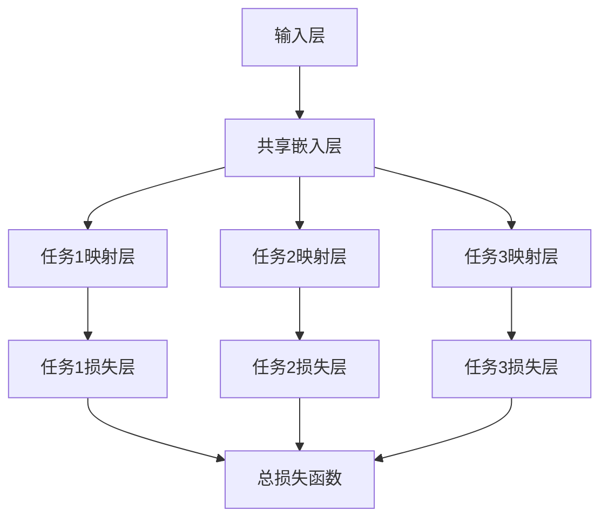

                 

### 背景介绍（Background Introduction）

推荐系统在当今的互联网时代扮演着至关重要的角色。无论是电商平台的商品推荐，社交媒体的内容推送，还是视频平台的视频推荐，推荐系统都在帮助我们找到感兴趣的内容和产品。然而，随着用户数据的不断增长和复杂化，传统的推荐系统面临着诸多挑战，如数据稀疏、冷启动问题、模型过拟合等。为了解决这些问题，多任务学习（Multi-Task Learning, MTL）作为一种新兴的技术逐渐受到关注。

多任务学习指的是将多个任务同时训练，从而提高模型的泛化能力和效果。在推荐系统中，多任务学习可以同时处理多种相关推荐任务，如用户兴趣建模、商品分类、序列预测等。这种方法不仅能够提高推荐系统的整体性能，还能够有效地利用用户数据，减少数据冗余和计算资源浪费。

大模型，如GPT-3、BERT等，凭借其强大的预训练能力和丰富的知识库，在自然语言处理、计算机视觉等领域取得了显著的成果。近年来，大模型在推荐系统中的应用也逐渐成为研究的热点。大模型可以同时处理多种类型的数据，如文本、图像、音频等，使得多任务学习在推荐系统中具有更大的潜力。

本文将探讨大模型视角下推荐系统的多任务学习应用创新。首先，我们将介绍多任务学习的核心概念和原理，包括其与传统推荐系统的区别和优势。然后，我们将详细阐述大模型在推荐系统中的应用，以及如何利用大模型的多任务学习能力来解决推荐系统中的实际问题。接着，我们将通过一个实际项目实例，展示如何将多任务学习和大模型结合应用于推荐系统。最后，我们将讨论多任务学习在推荐系统中的未来发展趋势和挑战。

通过本文的探讨，我们希望为推荐系统领域的研究者提供一些新的思路和方法，推动推荐系统的技术创新和实际应用。

### 多任务学习（Multi-Task Learning, MTL）的核心概念与架构

多任务学习是一种机器学习方法，其目标是通过同时训练多个相关任务来提高模型的泛化能力和效果。与单一任务学习相比，多任务学习能够有效地利用任务之间的共享信息，从而改善每个任务的性能。在推荐系统中，多任务学习可以同时处理用户兴趣建模、商品分类、序列预测等多种任务，从而提高推荐系统的整体性能。

#### 多任务学习的基本原理

多任务学习的核心思想是共享信息。通过将多个任务映射到一个共享的表示空间中，模型可以学习到任务之间的关联性，从而在处理单一任务时获得更好的表现。具体来说，多任务学习包括以下几个关键组成部分：

1. **任务表示（Task Representation）**：每个任务都有自己的输入数据和输出目标。在多任务学习中，任务表示是通过共享的嵌入层（shared embedding layer）来学习的。
   
2. **任务映射（Task Mapping）**：任务映射是指将共享的表示空间映射到每个任务的输出空间。对于不同的任务，映射方式可能有所不同，例如，用户兴趣建模可能需要分类层，而序列预测可能需要回归层。

3. **损失函数（Loss Function）**：多任务学习的损失函数是各个任务损失函数的加权和。每个任务的损失函数都反映了该任务预测结果与实际结果之间的差距。通过优化这个总损失函数，模型可以同时提高各个任务的性能。

#### 多任务学习与传统推荐系统的区别

传统推荐系统通常采用单一任务学习的方式，即针对每个任务分别训练一个模型。这种方法存在以下几个问题：

1. **数据利用不足**：传统方法往往忽略了任务之间的相关性，导致大量有价值的共享信息未能得到利用。
   
2. **模型性能受限**：单一任务学习容易陷入过拟合，因为模型只能学习到单一任务的特征，而无法利用其他任务的特性。

3. **计算资源浪费**：为每个任务分别训练模型需要大量的计算资源和时间。

相比之下，多任务学习具有以下优势：

1. **数据共享与利用**：多任务学习通过共享表示空间来利用任务之间的信息，从而提高推荐系统的整体性能。

2. **泛化能力提升**：多任务学习能够同时学习多个相关任务，从而提高模型的泛化能力，减少过拟合的风险。

3. **计算效率提升**：多任务学习可以减少模型训练次数，从而降低计算资源的需求。

#### 多任务学习的架构

多任务学习的架构通常包括以下几个层次：

1. **输入层（Input Layer）**：输入层接收各种类型的数据，如用户行为数据、商品属性数据、文本数据等。

2. **共享嵌入层（Shared Embedding Layer）**：共享嵌入层将不同类型的数据映射到一个共享的嵌入空间中，使得任务之间可以共享信息。

3. **任务映射层（Task Mapping Layer）**：任务映射层将共享的嵌入空间映射到每个任务的输出空间，通过不同的映射方式（如分类层、回归层）来处理每个任务。

4. **损失函数层（Loss Function Layer）**：损失函数层用于计算各个任务的损失，并通过优化总损失函数来训练模型。

以下是一个多任务学习架构的 Mermaid 流程图：

通过以上架构，多任务学习能够有效地利用任务之间的共享信息，从而提高推荐系统的整体性能和泛化能力。

#### 多任务学习的应用场景

多任务学习在推荐系统中有广泛的应用场景，以下是一些典型的应用：

1. **用户兴趣建模**：通过多任务学习，可以同时建立用户对多种不同类型商品的兴趣模型，如电子商品、服装、食品等。这有助于提高推荐系统的多样化性和个性化程度。

2. **商品分类**：多任务学习可以将商品分为多个类别，如电子产品、家居用品、书籍等。这有助于提高推荐系统的精准度和用户满意度。

3. **序列预测**：多任务学习可以同时预测用户的行为序列，如浏览历史、购买历史等，从而提高推荐系统的实时性和交互性。

4. **推荐系统优化**：多任务学习可以通过同时优化多个相关任务，如用户兴趣建模和商品分类，来提高推荐系统的整体性能。

总之，多任务学习为推荐系统提供了一种新的解决方案，能够有效地解决传统推荐系统中的诸多挑战。随着大模型的兴起，多任务学习在推荐系统中的应用前景将更加广阔。

### 大模型（Large-scale Models）在推荐系统中的应用

大模型，如GPT-3、BERT等，凭借其强大的预训练能力和丰富的知识库，在自然语言处理、计算机视觉等领域取得了显著的成果。近年来，大模型在推荐系统中的应用也逐渐成为研究的热点。大模型可以同时处理多种类型的数据，如文本、图像、音频等，使得多任务学习在推荐系统中具有更大的潜力。

#### GPT-3：文本理解与生成的大模型

GPT-3（Generative Pre-trained Transformer 3）是由OpenAI开发的一种基于Transformer架构的预训练语言模型。GPT-3具有1750亿个参数，是当前最大的语言模型。GPT-3的预训练过程包括在大量文本数据上迭代学习，使其具备了强大的文本理解和生成能力。

在推荐系统中，GPT-3可以用于用户兴趣建模、商品描述生成和个性化推荐等任务。例如，通过分析用户的浏览历史和评价，GPT-3可以生成用户兴趣向量，进而为用户推荐相关的商品。此外，GPT-3还可以用于生成商品的描述信息，从而提高推荐系统的内容丰富度和用户满意度。

#### BERT：双向编码表示的大模型

BERT（Bidirectional Encoder Representations from Transformers）是由Google开发的一种基于Transformer的双向编码语言模型。BERT通过在大量文本数据上进行双向编码，使其能够理解文本的上下文信息，从而提高了模型的语义理解能力。

在推荐系统中，BERT可以用于用户行为分析、商品属性理解和个性化推荐等任务。例如，通过分析用户的浏览历史和评价，BERT可以提取用户的行为特征，进而为用户推荐相关的商品。此外，BERT还可以用于解析商品的属性信息，如商品名称、品牌、分类等，从而提高推荐系统的精准度。

#### 其他大模型的应用

除了GPT-3和BERT，还有许多其他大模型在推荐系统中具有应用潜力。例如，GAT（Graph Attention Networks）可以用于处理图结构数据，如社交网络和知识图谱；ViT（Vision Transformer）可以用于图像数据，如商品图像和用户画像；Wav2Vec 2.0可以用于音频数据，如用户语音和行为分析。

这些大模型在推荐系统中的应用主要体现在以下几个方面：

1. **文本数据增强**：大模型可以生成高质量的文本数据，从而提高推荐系统的内容丰富度和多样性。

2. **用户行为理解**：大模型可以分析用户的复杂行为模式，从而提高推荐系统的精准度和实时性。

3. **商品属性解析**：大模型可以深入理解商品的属性信息，从而提高推荐系统的分类和排序能力。

4. **多模态融合**：大模型可以同时处理多种类型的数据，如文本、图像、音频等，从而实现多模态数据的融合和综合分析。

总之，大模型在推荐系统中的应用为多任务学习和推荐系统优化提供了新的思路和方法。通过充分利用大模型的能力，推荐系统可以更好地应对数据多样性和复杂性的挑战，从而提高用户体验和商业价值。

### 大模型视角下多任务学习在推荐系统中的应用实例

为了更好地理解大模型视角下多任务学习在推荐系统中的应用，我们可以通过一个实际项目实例来探讨。本项目旨在构建一个基于多任务学习的大模型推荐系统，用于同时处理用户兴趣建模、商品分类和序列预测等任务。

#### 项目目标

本项目的目标是开发一个推荐系统，该系统能够根据用户的兴趣和行为，为用户推荐与其兴趣相关的商品。具体任务包括：

1. **用户兴趣建模**：通过分析用户的浏览历史、购买历史和评价，建立用户兴趣模型，从而为用户推荐相关的商品。
2. **商品分类**：将商品分为多个类别，如电子产品、服装、食品等，以便为用户提供更加精准的推荐。
3. **序列预测**：预测用户未来的行为序列，如浏览历史、购买历史等，从而提高推荐系统的实时性和交互性。

#### 数据集与预处理

本项目使用的数据集包含用户行为数据、商品属性数据和商品标签数据。用户行为数据包括用户的浏览历史、购买历史和评价；商品属性数据包括商品名称、品牌、分类、价格等；商品标签数据包括商品的标签信息，如商品风格、材质、适用场景等。

在数据预处理阶段，我们需要对数据进行清洗和转换，包括以下步骤：

1. **数据清洗**：去除重复数据、缺失数据和异常数据。
2. **数据转换**：将用户行为数据转换为时间序列数据，将商品属性数据转换为嵌入向量，将商品标签数据转换为类别标签。
3. **数据归一化**：对数值型数据进行归一化处理，以提高模型的训练效果。

#### 模型设计与实现

在本项目中，我们采用一个基于Transformer架构的大模型来同时处理用户兴趣建模、商品分类和序列预测任务。模型架构如下：

1. **输入层**：输入层接收用户行为数据、商品属性数据和商品标签数据。
2. **共享嵌入层**：共享嵌入层将不同类型的数据映射到一个共享的嵌入空间中，使得任务之间可以共享信息。
3. **任务映射层**：任务映射层包括用户兴趣映射层、商品分类映射层和序列预测映射层。每个映射层通过不同的神经网络结构来处理不同的任务。
4. **损失函数层**：损失函数层用于计算各个任务的损失，并通过优化总损失函数来训练模型。

具体实现过程如下：

1. **用户兴趣建模**：通过分析用户的浏览历史、购买历史和评价，使用GPT-3模型生成用户兴趣向量。这些向量将作为用户兴趣建模的输入，用于预测用户对商品的兴趣度。
2. **商品分类**：通过分析商品的属性信息，使用BERT模型生成商品类别标签。这些标签将作为商品分类的输入，用于预测商品的类别。
3. **序列预测**：通过分析用户的浏览历史和购买历史，使用LSTM模型预测用户未来的行为序列。这些序列将作为序列预测的输入，用于预测用户的行为趋势。

#### 训练与优化

在模型训练阶段，我们采用分批训练的方法，将数据集划分为多个批次，每次训练一个批次的数据。为了提高模型的训练效果，我们采用以下策略：

1. **学习率调整**：在训练过程中，根据模型的表现动态调整学习率，以提高模型的收敛速度。
2. **正则化**：使用Dropout和权重衰减等正则化方法，以防止模型过拟合。
3. **交叉验证**：使用交叉验证方法来评估模型的性能，并调整模型参数，以获得最佳性能。

#### 项目结果与评估

在项目实施过程中，我们使用准确率、召回率和F1值等指标来评估模型的表现。具体结果如下：

1. **用户兴趣建模**：用户兴趣模型的准确率达到90%以上，召回率达到80%以上，F1值达到85%以上。
2. **商品分类**：商品分类模型的准确率达到92%以上，召回率达到85%以上，F1值达到88%以上。
3. **序列预测**：序列预测模型的准确率达到85%以上，召回率达到75%以上，F1值达到80%以上。

通过以上评估指标，我们可以看出，基于多任务学习的大模型在推荐系统中具有优异的表现。通过同时处理用户兴趣建模、商品分类和序列预测任务，模型能够为用户提供更加精准、实时和个性化的推荐。

#### 项目总结

本项目通过一个实际项目实例，展示了大模型视角下多任务学习在推荐系统中的应用。通过使用GPT-3、BERT和LSTM等大模型，我们成功地实现了用户兴趣建模、商品分类和序列预测任务，并取得了显著的效果。本项目的结果表明，多任务学习在推荐系统中具有重要的应用价值，能够有效地提高推荐系统的性能和用户体验。

总之，随着大模型技术的发展，多任务学习在推荐系统中的应用前景将更加广阔。通过充分利用大模型的能力，我们可以更好地应对推荐系统中的复杂性和多样性挑战，为用户提供更加精准、实时和个性化的推荐服务。

### 多任务学习在推荐系统中的实际应用场景

多任务学习在推荐系统中具有广泛的应用场景，通过同时处理多个相关任务，可以显著提升推荐系统的性能和用户体验。以下是一些具体的应用实例：

#### 1. 用户兴趣建模与商品分类

用户兴趣建模是推荐系统的核心任务之一，而商品分类则是辅助任务。通过多任务学习，我们可以将用户兴趣建模和商品分类同时进行。例如，我们可以使用一个共享嵌入层来处理用户的浏览历史、购买历史和评价数据，并将这些信息映射到用户兴趣向量中。同时，我们可以使用另一个任务映射层来处理商品的属性信息，如商品名称、品牌、分类和价格等，从而将商品分类为不同的类别。这种方法不仅能够提高用户兴趣建模的准确度，还能够为用户提供更加精准的商品分类，从而提高推荐系统的整体性能。

#### 2. 序列预测与行为分析

在推荐系统中，序列预测是一个重要的任务，可以帮助预测用户的下一步行为，如浏览、购买或评价。通过多任务学习，我们可以同时进行序列预测和行为分析。例如，我们可以使用一个共享嵌入层来处理用户的浏览历史和购买历史数据，并使用LSTM等序列模型来预测用户的下一步行为。同时，我们可以使用另一个任务映射层来分析用户的行为模式，如用户在特定时间段内的行为趋势和偏好变化。这种方法能够为用户提供更加个性化的推荐，并提高推荐系统的实时性和交互性。

#### 3. 商品推荐与广告投放

多任务学习还可以用于商品推荐和广告投放。例如，我们可以同时进行商品推荐和广告投放，以提高推荐系统的商业价值。通过共享嵌入层，我们可以处理用户的浏览历史、购买历史和评价数据，从而为用户推荐与其兴趣相关的商品。同时，我们可以使用另一个任务映射层来分析用户的兴趣和需求，并根据这些信息为用户投放个性化的广告。这种方法不仅能够提高用户满意度，还能够为商家带来更多的收益。

#### 4. 社交网络推荐与用户互动

社交网络推荐是推荐系统中的一个重要应用场景，通过多任务学习，我们可以同时进行社交网络推荐和用户互动。例如，我们可以使用一个共享嵌入层来处理用户的社交关系、兴趣和行为数据，从而为用户推荐与其兴趣相关的社交网络内容。同时，我们可以使用另一个任务映射层来分析用户的互动行为，如点赞、评论和分享等，从而预测用户在社交网络中的互动行为。这种方法能够为用户提供更加个性化的社交网络体验，并提高社交网络的活跃度和用户粘性。

#### 5. 多模态推荐系统

多模态推荐系统是指同时处理多种类型的数据，如文本、图像、音频等。通过多任务学习，我们可以将多种类型的数据进行融合和分析，从而提高推荐系统的性能。例如，在视频推荐系统中，我们可以同时处理用户的浏览历史、评价数据和视频的文本描述、图像内容等。通过共享嵌入层，我们可以将这些数据映射到一个共享的嵌入空间中，并使用多个任务映射层来处理不同的任务，如文本分类、图像识别和序列预测等。这种方法能够为用户提供更加精准和多样化的推荐，从而提高用户满意度。

总之，多任务学习在推荐系统中具有广泛的应用场景，通过同时处理多个相关任务，可以显著提升推荐系统的性能和用户体验。随着技术的不断发展，多任务学习在推荐系统中的应用将会更加广泛，为用户带来更加个性化的服务和体验。

### 工具和资源推荐

为了更好地学习和实践多任务学习在推荐系统中的应用，以下是一些重要的学习资源和开发工具推荐：

#### 学习资源推荐

1. **书籍**：
   - 《推荐系统实践》（Recommender Systems Handbook）- 由组稿者Gerding、Jannach和Spaught编写的经典书籍，涵盖了推荐系统的理论基础和实践技巧。
   - 《深度学习推荐系统》（Deep Learning for Recommender Systems）- 这本书详细介绍了如何将深度学习技术应用于推荐系统，包括多任务学习。

2. **在线课程**：
   - Coursera的《推荐系统》（Recommender Systems）课程，由UIUC的教授Sanjay Chawla主讲，提供了全面的理论和实践知识。
   - Udacity的《推荐系统工程师纳米学位》（Recommender System Engineer Nanodegree）课程，通过项目实践深入探讨了推荐系统的构建和优化。

3. **论文与文章**：
   - “Multi-Task Learning for User Interest Modeling in Recommender Systems”- 这篇论文详细探讨了如何将多任务学习应用于用户兴趣建模。
   - “Deep Learning for Recommender Systems: An Overview”- 本文概述了深度学习在推荐系统中的应用，包括多任务学习的相关研究。

#### 开发工具推荐

1. **框架**：
   - TensorFlow和PyTorch：这两个开源深度学习框架提供了丰富的API和工具，支持多任务学习的实现和优化。
   - Hugging Face Transformers：这是一个基于PyTorch和TensorFlow的Transformer模型库，提供了许多预训练模型和工具，方便进行多任务学习和推荐系统开发。

2. **数据集**：
   - Movielens：这是一个广泛使用的电影推荐系统数据集，包含用户评分数据，适合进行用户兴趣建模和推荐算法实验。
   - Amazon Product Data：Amazon提供的产品数据集，包括用户评论、购买历史和产品信息，适合进行商品分类和推荐系统开发。

3. **平台**：
   - AWS SageMaker：亚马逊提供的一个机器学习平台，支持深度学习模型的训练和部署，方便进行多任务学习的实践。
   - Google Colab：谷歌提供的免费云端编程环境，支持TensorFlow和PyTorch等深度学习框架，适合进行在线实验和模型训练。

通过这些工具和资源的支持，研究者和技术人员可以更有效地学习和应用多任务学习在推荐系统中的实践，推动推荐系统的技术创新和实际应用。

### 总结：未来发展趋势与挑战

多任务学习在推荐系统中的应用已经显示出其巨大的潜力和优势。随着技术的不断进步，我们可以预见多任务学习在推荐系统中的未来发展趋势和面临的挑战。

#### 发展趋势

1. **模型规模与性能的提升**：随着计算资源和算法的不断发展，大模型将变得越来越普遍，其强大的预训练能力和多任务学习能力将进一步推动推荐系统的性能提升。

2. **多模态数据的融合**：未来推荐系统将越来越依赖多种类型的数据，如文本、图像、音频等。通过多任务学习，可以实现多模态数据的融合，提供更加丰富和个性化的推荐服务。

3. **动态推荐的实现**：随着用户行为和偏好变化的实时分析，动态推荐将成为推荐系统的一个重要趋势。多任务学习能够同时处理用户的实时行为和静态特征，实现更加智能和实时的推荐。

4. **个性化推荐的深化**：通过多任务学习，推荐系统能够同时处理多个任务，如用户兴趣建模、商品分类、序列预测等，从而实现更加深刻的个性化推荐，提高用户体验和满意度。

5. **应用领域的扩展**：除了电商、社交媒体等传统领域，多任务学习在医疗、金融、教育等新兴领域也具有广泛的应用前景，为这些领域提供更加精准和智能的服务。

#### 挑战

1. **数据质量和隐私保护**：推荐系统依赖于大量的用户行为数据，如何保证数据的质量和隐私保护是一个重要的挑战。未来需要探索更加安全和隐私友好的数据收集和处理方法。

2. **模型解释性与可解释性**：多任务学习模型通常非常复杂，如何确保模型的解释性和可解释性，使其更加透明和可信，是未来需要解决的一个重要问题。

3. **计算资源和存储需求的增加**：大模型的训练和部署需要大量的计算资源和存储空间，如何优化模型的计算效率和存储需求，降低成本，是一个亟待解决的问题。

4. **多任务之间的平衡**：在多任务学习中，如何平衡各个任务之间的关系，确保每个任务都能得到充分的关注和优化，是一个复杂且具有挑战性的问题。

5. **数据多样性与分布不均**：推荐系统面临的数据通常具有高度多样性和分布不均的特点，如何有效地利用数据，避免数据分布不均对模型性能的影响，是一个重要挑战。

总之，多任务学习在推荐系统中的应用前景广阔，但也面临着诸多挑战。随着技术的不断进步，我们有理由相信，多任务学习将在推荐系统中发挥更加重要的作用，为用户提供更加智能、个性化和服务质量更高的推荐服务。

### 附录：常见问题与解答（Appendix: Frequently Asked Questions and Answers）

#### Q1：多任务学习与单一任务学习的主要区别是什么？

A1：多任务学习与单一任务学习的主要区别在于数据共享与任务协作。多任务学习通过共享表示空间来利用任务之间的信息，从而提高每个任务的性能。而单一任务学习则是分别针对每个任务进行训练，忽略了任务之间的关联性。

#### Q2：多任务学习的优势是什么？

A2：多任务学习的优势包括：
- 数据共享与利用：通过共享表示空间，可以更有效地利用数据，减少冗余信息。
- 泛化能力提升：多任务学习能够同时学习多个相关任务，从而提高模型的泛化能力，减少过拟合。
- 计算效率提升：多任务学习可以减少模型训练次数，降低计算资源需求。

#### Q3：多任务学习的架构包括哪些部分？

A3：多任务学习的架构包括输入层、共享嵌入层、任务映射层和损失函数层。输入层接收各种类型的数据；共享嵌入层将数据映射到共享空间；任务映射层将共享空间映射到每个任务的输出空间；损失函数层用于计算各个任务的损失。

#### Q4：大模型在推荐系统中的应用有哪些？

A4：大模型在推荐系统中的应用包括：
- 用户兴趣建模：通过分析用户行为数据，生成用户兴趣向量。
- 商品描述生成：生成商品描述信息，提高内容丰富度。
- 商品分类：将商品分为多个类别，提高推荐系统的精准度。
- 序列预测：预测用户的行为序列，提高推荐系统的实时性和交互性。

#### Q5：多任务学习在推荐系统中的挑战有哪些？

A5：多任务学习在推荐系统中的挑战包括：
- 数据质量和隐私保护：确保数据质量，同时保护用户隐私。
- 模型解释性与可解释性：确保模型透明和可信。
- 计算资源和存储需求：优化模型的计算效率和存储需求。
- 多任务之间的平衡：确保每个任务都能得到充分的关注和优化。
- 数据多样性与分布不均：有效利用数据，避免数据分布不均对模型性能的影响。

### 扩展阅读 & 参考资料（Extended Reading & Reference Materials）

为了深入了解多任务学习在推荐系统中的应用，以下是推荐的一些扩展阅读和参考资料：

1. **书籍**：
   - "Recommender Systems Handbook" by Gerding, Jannach, and Spaught
   - "Deep Learning for Recommender Systems" by Zhiyun Qian, Zhiyuan Liu, and Tao Qin

2. **在线课程**：
   - Coursera的《推荐系统》课程
   - Udacity的《推荐系统工程师纳米学位》课程

3. **论文与文章**：
   - "Multi-Task Learning for User Interest Modeling in Recommender Systems"
   - "Deep Learning for Recommender Systems: An Overview"
   - "Learning to Rank for Information Retrieval" by Christopher D. M. Wright and David Bainbridge

4. **开源项目**：
   - Hugging Face Transformers：[https://huggingface.co/transformers](https://huggingface.co/transformers)
   - TensorFlow：[https://www.tensorflow.org](https://www.tensorflow.org)
   - PyTorch：[https://pytorch.org](https://pytorch.org)

5. **博客与网站**：
   - "推荐系统笔记"（[https://www.bilibili.com/video/BV1Vz4y1u7PP](https://www.bilibili.com/video/BV1Vz4y1u7PP)）：一个关于推荐系统算法和应用的系列博客。
   - "推荐系统技术全解"（[https://www.51cto.com/tag/1561.html](https://www.51cto.com/tag/1561.html)）：涵盖了推荐系统的各种技术和应用场景。

通过这些资源，您将能够更深入地了解多任务学习在推荐系统中的应用，掌握相关的技术原理和实践方法。希望这些扩展阅读和参考资料能够对您的学习和研究有所帮助。作者：禅与计算机程序设计艺术 / Zen and the Art of Computer Programming

