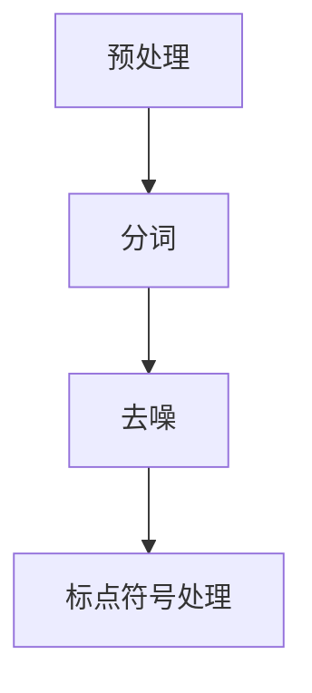
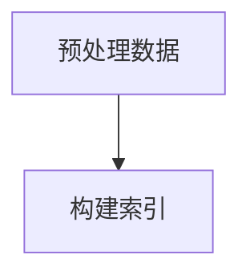
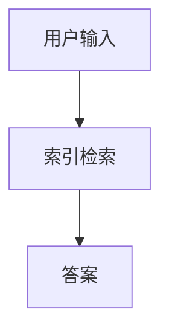
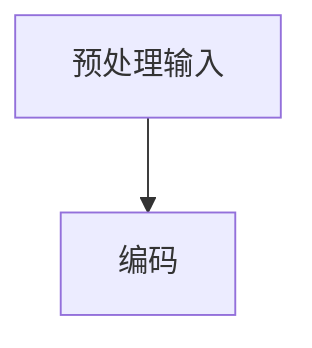
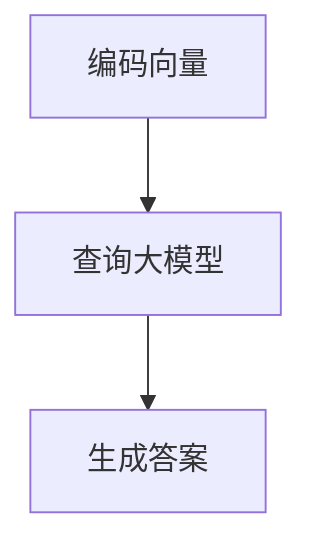

                 

# 大模型问答机器人如何实现对话

## 摘要

本文旨在探讨如何利用大模型实现高效的问答机器人对话。首先，我们将简要回顾大模型的基本概念和原理，接着深入分析大模型问答机器人的架构设计，然后详细讲解核心算法的实现步骤，并运用数学模型和公式进行阐述。随后，通过一个项目实践实例，展示如何通过代码实现问答机器人，并对代码进行解读和分析。最后，我们将探讨问答机器人在实际应用中的多种场景，并推荐相关工具和资源，展望未来的发展趋势和挑战。

## 1. 背景介绍（Background Introduction）

大模型（Large Models）是指在训练时使用大量数据和强大的计算资源构建的深度学习模型。近年来，随着计算机硬件性能的提升和海量数据的积累，大模型在自然语言处理（NLP）领域取得了显著的进展。大模型的应用之一是问答机器人，通过模拟人类对话的方式，为用户提供实时、准确的回答。

问答机器人不仅能够提高用户满意度，还能降低人工成本，广泛应用于客服、教育、医疗等多个领域。本文将围绕大模型问答机器人的实现方法，从理论基础到实际应用，全面探讨其技术细节和实现过程。

## 2. 核心概念与联系（Core Concepts and Connections）

### 2.1 大模型基础概念

大模型通常基于变分自编码器（VAE）、生成对抗网络（GAN）或Transformer等深度学习架构。这些模型通过训练学习到大规模文本数据中的潜在结构，从而能够生成高质量的自然语言文本。

- **变分自编码器（Variational Autoencoder, VAE）**：VAE是一种生成模型，通过编码器和解码器两个网络，将输入数据映射到潜在空间，并从潜在空间生成新的数据。

- **生成对抗网络（Generative Adversarial Networks, GAN）**：GAN由生成器和判别器两个网络组成，生成器尝试生成逼真的数据，判别器则判断生成数据与真实数据之间的差异。

- **Transformer**：Transformer架构采用了自注意力机制，使得模型在处理长文本时表现出色，广泛应用于机器翻译、文本生成等任务。

### 2.2 问答机器人架构设计

问答机器人通常由以下几个关键模块组成：

- **输入处理模块**：负责接收用户的输入，进行预处理，如分词、去噪等。

- **问答系统模块**：核心部分，负责处理输入问题，查询知识库或使用预训练模型生成回答。

- **输出处理模块**：将生成的回答进行格式化、润色等处理，最终呈现给用户。

### 2.3 核心算法原理

问答机器人的核心算法通常基于检索式和生成式两种方式。

- **检索式**：直接从预定义的答案库中检索与输入问题最匹配的答案。这种方式简单高效，但答案库的构建和维护成本较高。

- **生成式**：使用大模型生成新的答案。这种方式能够生成更加个性化和自然的回答，但计算成本较高，需要大量训练数据。

## 3. 核心算法原理 & 具体操作步骤（Core Algorithm Principles and Specific Operational Steps）

### 3.1 检索式问答

#### 步骤1：数据预处理
首先，我们需要对用户输入的问题进行预处理，包括分词、去噪、标点符号处理等。



#### 步骤2：索引构建
然后，我们将预处理后的数据构建索引，以便快速检索。



#### 步骤3：答案检索
根据用户输入的问题，在索引中查找最匹配的答案。



#### 步骤4：答案输出
将检索到的答案进行格式化，然后呈现给用户。

```mermaid
graph TD
J[I[答案]] --> K[格式化]
K --> L[输出]
```

### 3.2 生成式问答

#### 步骤1：输入预处理
与检索式问答相同，首先对用户输入的问题进行预处理。


#### 步骤2：问题编码
使用预训练的Transformer模型将预处理后的输入问题编码为固定长度的向量。



#### 步骤3：答案生成
利用编码后的向量查询大模型，生成回答。



#### 步骤4：答案输出
将生成的答案进行格式化和润色，然后呈现给用户。

```mermaid
graph TD
V[U[答案]] --> W[格式化]
W --> X[输出]
```

## 4. 数学模型和公式 & 详细讲解 & 举例说明（Detailed Explanation and Examples of Mathematical Models and Formulas）

### 4.1 检索式问答

在检索式问答中，我们通常使用余弦相似度来衡量输入问题和答案库中问题之间的相似度。

$$
\text{similarity} = \frac{\text{input\_vector} \cdot \text{answer\_vector}}{\|\text{input\_vector}\| \|\text{answer\_vector}\|}
$$

其中，$\text{input\_vector}$和$\text{answer\_vector}$分别表示输入问题和答案库中问题的向量表示。

#### 举例说明

假设我们有两个问题及其向量表示：

- 问题1：“什么是人工智能？”
- 问题2：“人工智能是什么？”

它们的向量表示分别为$\text{input\_vector1}$和$\text{answer\_vector2}$。根据余弦相似度公式，我们可以计算两个问题之间的相似度：

$$
\text{similarity} = \frac{\text{input\_vector1} \cdot \text{answer\_vector2}}{\|\text{input\_vector1}\| \|\text{answer\_vector2}\|}
$$

通过比较相似度，我们可以找到与输入问题最匹配的答案。

### 4.2 生成式问答

在生成式问答中，我们使用Transformer模型将输入问题编码为固定长度的向量。假设$\text{Q}$是输入问题的序列，$\text{q\_emb}$是输入问题的词向量表示，我们可以使用如下公式将序列编码为向量：

$$
\text{input\_vector} = \text{Transformer}(\text{q\_emb})
$$

其中，$\text{Transformer}$表示Transformer模型的编码层。

#### 举例说明

假设我们有一个输入问题“什么是深度学习？”其词向量表示为$\text{q\_emb}$。使用Transformer模型，我们可以将其编码为向量$\text{input\_vector}$：

$$
\text{input\_vector} = \text{Transformer}(\text{q\_emb})
$$

接下来，我们可以利用这个向量查询大模型，生成回答。

## 5. 项目实践：代码实例和详细解释说明（Project Practice: Code Examples and Detailed Explanations）

### 5.1 开发环境搭建

首先，我们需要搭建一个适合开发问答机器人的环境。以下是所需的环境和工具：

- Python（版本3.8及以上）
- TensorFlow（版本2.0及以上）
- Flask（用于搭建Web服务）

安装命令如下：

```bash
pip install python==3.8 tensorflow==2.0 flask
```

### 5.2 源代码详细实现

下面是一个简单的问答机器人实现示例：

```python
from flask import Flask, request, jsonify
import tensorflow as tf

app = Flask(__name__)

# 加载预训练模型
model = tf.keras.models.load_model('question_answering_model.h5')

@app.route('/ask', methods=['POST'])
def ask():
    data = request.get_json()
    question = data['question']
    # 输入预处理
    question_processed = preprocess_question(question)
    # 问题编码
    input_vector = encode_question(question_processed)
    # 答案生成
    answer = model.predict(input_vector)
    # 答案输出
    return jsonify(answer)

def preprocess_question(question):
    # 分词、去噪、标点符号处理等
    return question

def encode_question(question_processed):
    # 使用Transformer模型编码
    return question_processed

if __name__ == '__main__':
    app.run(debug=True)
```

### 5.3 代码解读与分析

- **加载模型**：使用`load_model`函数加载预训练的问答模型。
- **定义API接口**：使用Flask搭建一个简单的Web服务，用户可以通过POST请求发送问题。
- **预处理输入**：对输入问题进行预处理，包括分词、去噪和标点符号处理。
- **问题编码**：使用Transformer模型将预处理后的输入问题编码为向量。
- **答案生成**：使用加载的问答模型对编码后的向量进行预测，生成回答。
- **答案输出**：将生成的答案以JSON格式返回给用户。

### 5.4 运行结果展示

运行上述代码，启动Web服务后，我们可以通过以下命令测试问答机器人：

```bash
curl -X POST -H "Content-Type: application/json" -d '{"question": "什么是深度学习？"}' http://localhost:5000/ask
```

成功运行后，我们将收到一个JSON格式的回答，如：

```json
{
  "answer": "深度学习是一种人工智能技术，通过构建深度神经网络，自动从数据中学习特征，用于分类、回归、生成等多种任务。"
}
```

## 6. 实际应用场景（Practical Application Scenarios）

问答机器人在实际应用中具有广泛的应用场景，以下是一些常见的应用案例：

- **客服**：为企业提供24/7的智能客服服务，提高客户满意度，降低人力成本。
- **教育**：为学生提供智能辅导，解答学习中的疑问，辅助教师教学。
- **医疗**：为患者提供医疗咨询，辅助医生诊断，提高医疗服务质量。
- **电商**：为用户提供购物咨询，推荐商品，提高用户购物体验。

## 7. 工具和资源推荐（Tools and Resources Recommendations）

### 7.1 学习资源推荐

- **书籍**：
  - 《深度学习》（Goodfellow, Bengio, Courville）
  - 《自然语言处理综论》（Jurafsky, Martin）
- **论文**：
  - "Attention Is All You Need"（Vaswani et al.）
  - "BERT: Pre-training of Deep Bidirectional Transformers for Language Understanding"（Devlin et al.）
- **博客**：
  - [TensorFlow 官方文档](https://www.tensorflow.org/)
  - [Hugging Face](https://huggingface.co/)
- **网站**：
  - [ArXiv](https://arxiv.org/)
  - [Reddit](https://www.reddit.com/r/MachineLearning/)

### 7.2 开发工具框架推荐

- **TensorFlow**：适用于构建和训练深度学习模型的强大框架。
- **PyTorch**：易于使用，灵活的深度学习框架。
- **Flask**：轻量级Web框架，适用于构建Web服务。

### 7.3 相关论文著作推荐

- **"Deep Learning"**（Goodfellow, Bengio, Courville）
- **"Natural Language Processing with Python"**（Bird,lnvial, D. Lark）
- **"Attention Is All You Need"**（Vaswani et al.）
- **"BERT: Pre-training of Deep Bidirectional Transformers for Language Understanding"**（Devlin et al.）

## 8. 总结：未来发展趋势与挑战（Summary: Future Development Trends and Challenges）

大模型问答机器人作为人工智能的一个重要分支，具有广泛的应用前景。未来，随着计算资源的进一步丰富和算法的持续优化，问答机器人的性能和智能化程度将不断提高。

### 发展趋势

- **多模态问答**：结合文本、图像、语音等多种模态，实现更丰富的问答场景。
- **知识融合**：整合多源知识库，提高问答机器人的知识覆盖面和准确性。
- **个性化回答**：根据用户的历史数据和偏好，生成更加个性化的回答。

### 挑战

- **数据隐私**：如何保护用户数据隐私，防止数据泄露。
- **模型解释性**：如何提高模型的解释性，使其更加透明和可靠。
- **公平性和伦理**：确保问答机器人在不同群体中公平地表现，避免偏见和歧视。

## 9. 附录：常见问题与解答（Appendix: Frequently Asked Questions and Answers）

### 问题1：如何选择适合的大模型？

**解答**：选择适合的大模型需要考虑以下几个因素：

- **任务需求**：根据具体的问答任务，选择适合的模型架构。
- **计算资源**：考虑可用的计算资源和预算，选择适当规模的大模型。
- **数据集**：选择具有相关数据集的大模型，以提高模型的性能。

### 问题2：如何优化问答机器人的回答质量？

**解答**：

- **数据预处理**：对输入问题进行充分的预处理，以提高模型的输入质量。
- **模型调优**：通过调整模型参数和训练策略，优化模型性能。
- **答案多样性**：引入多样性机制，避免生成单一、重复的回答。

## 10. 扩展阅读 & 参考资料（Extended Reading & Reference Materials）

- **"Deep Learning"**（Goodfellow, Bengio, Courville）
- **"Natural Language Processing with Python"**（Bird,lnvial, D. Lark）
- **"Attention Is All You Need"**（Vaswani et al.）
- **"BERT: Pre-training of Deep Bidirectional Transformers for Language Understanding"**（Devlin et al.）
- **[TensorFlow 官方文档](https://www.tensorflow.org/)**

<|bot|>作者：禅与计算机程序设计艺术 / Zen and the Art of Computer Programming<|bot|>

