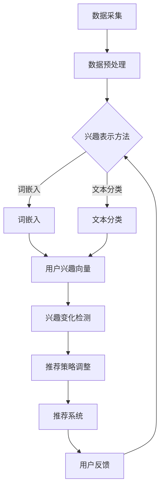

                 

### 文章标题

大模型驱动的推荐系统动态兴趣建模

> 关键词：大模型，推荐系统，动态兴趣建模，深度学习，机器学习

摘要：本文将探讨大模型在推荐系统中的应用，尤其是动态兴趣建模的核心概念和关键技术。通过详细分析大模型的原理和架构，本文将展示如何利用深度学习和机器学习算法构建高效的动态兴趣模型，从而实现个性化推荐。此外，文章还将结合实际项目实例，阐述代码实现和运行结果，探讨该技术在各种应用场景中的优势和挑战。

## 1. 背景介绍（Background Introduction）

推荐系统是一种信息过滤技术，旨在根据用户的历史行为和偏好，向用户推荐相关的商品、新闻、音乐或视频等。随着互联网和大数据技术的发展，推荐系统已经成为电子商务、社交媒体和在线媒体等领域的核心组件。传统的推荐系统主要依赖于基于内容过滤和协同过滤的方法，然而，这些方法在面对用户动态兴趣变化时往往表现不佳。

动态兴趣建模是一种旨在捕捉用户兴趣变化和个性化需求的推荐系统技术。它通过实时分析用户行为数据，动态调整推荐策略，从而提高推荐系统的准确性和用户满意度。近年来，随着深度学习和机器学习技术的快速发展，大模型在动态兴趣建模中的应用逐渐成为研究热点。大模型，如 Transformer 模型、BERT 模型等，通过捕捉大量文本数据中的复杂模式和关联，为动态兴趣建模提供了强大的工具。

本文将首先介绍大模型的原理和架构，然后详细探讨动态兴趣建模的关键技术，包括数据预处理、模型训练、模型评估和优化。接下来，文章将结合实际项目实例，展示大模型在动态兴趣建模中的应用，并分析代码实现和运行结果。最后，本文将讨论动态兴趣建模在实际应用场景中的优势和挑战，以及未来的发展趋势。

## 2. 核心概念与联系（Core Concepts and Connections）

### 2.1 大模型概述

大模型，即大型神经网络模型，是一种通过训练海量数据集来学习复杂数据分布和模式的深度学习模型。大模型通常具有数十亿至数万亿个参数，能够捕捉数据中的细微模式和长期依赖关系。典型的代表包括 Transformer 模型、BERT 模型、GPT 模型等。这些模型在自然语言处理、计算机视觉、语音识别等领域取得了显著的成果，为动态兴趣建模提供了坚实的基础。

### 2.2 动态兴趣建模的概念

动态兴趣建模旨在捕捉用户在一段时间内的兴趣变化，并根据这些变化调整推荐策略。与传统推荐系统相比，动态兴趣建模能够更好地应对用户需求的多样性、不确定性和动态性。具体来说，动态兴趣建模涉及以下关键概念：

1. **用户兴趣表示**：通过分析用户的历史行为数据，如浏览记录、点击行为、购买记录等，将用户的兴趣转化为数值化的向量表示。
2. **兴趣变化检测**：实时监测用户行为数据，识别用户兴趣的变化趋势，如兴趣点的出现、消失或转移。
3. **推荐策略调整**：根据用户兴趣的变化，动态调整推荐策略，以更好地满足用户需求。

### 2.3 大模型与动态兴趣建模的联系

大模型在动态兴趣建模中的应用主要体现在以下几个方面：

1. **用户兴趣表示**：大模型能够通过训练大量文本数据，学习用户兴趣的复杂模式和关联，从而生成高精度的用户兴趣向量表示。
2. **兴趣变化检测**：大模型在处理高维度、稀疏数据时具有优势，可以高效地监测用户兴趣的变化趋势，为动态调整推荐策略提供支持。
3. **推荐策略调整**：大模型强大的表征能力使得推荐系统能够根据用户兴趣的变化，灵活调整推荐策略，提高推荐效果。

### 2.4 大模型与深度学习、机器学习的关系

大模型是深度学习和机器学习领域的重要成果之一。深度学习通过多层神经网络对数据进行逐层抽象和表征，从而学习到数据中的复杂模式和关联。机器学习则是一种通过训练数据来优化模型参数的方法，旨在提高模型的预测性能。大模型在动态兴趣建模中的应用，正是深度学习和机器学习相结合的典范。通过大模型，我们可以从海量数据中提取有用的信息，实现更加精准和高效的推荐系统。

### 2.5 Mermaid 流程图（Mermaid Flowchart）

为了更好地理解大模型在动态兴趣建模中的应用，我们使用 Mermaid 流程图来展示关键流程和步骤。以下是动态兴趣建模的核心概念和流程的 Mermaid 流程图：



在这个流程图中，数据采集和预处理是动态兴趣建模的基础。数据预处理包括清洗、去噪和格式转换等步骤。兴趣表示方法可以是词嵌入或文本分类，取决于数据类型和需求。用户兴趣向量是动态兴趣建模的核心，用于表示用户的兴趣。兴趣变化检测和推荐策略调整是动态调整推荐系统的关键步骤，根据用户反馈进行迭代优化。

## 3. 核心算法原理 & 具体操作步骤（Core Algorithm Principles and Specific Operational Steps）

### 3.1 大模型的原理

大模型的核心是深度神经网络（DNN），通过层层叠加的神经网络结构，对输入数据进行特征提取和表征。在动态兴趣建模中，大模型通常采用 Transformer 模型、BERT 模型等预训练模型，这些模型具有强大的表征能力和泛化能力。具体来说，大模型的原理可以分为以下几个步骤：

1. **数据预处理**：将原始数据（如文本、图像等）转换为数值化的形式，如词嵌入、图像像素值等。
2. **模型架构**：构建深度神经网络结构，包括输入层、隐藏层和输出层。隐藏层通过层层叠加，实现对输入数据的抽象和表征。
3. **预训练**：在大规模数据集上对模型进行预训练，学习到数据中的复杂模式和关联。
4. **微调**：在特定任务数据集上对模型进行微调，优化模型参数，提高模型在特定任务上的性能。

### 3.2 动态兴趣建模的操作步骤

动态兴趣建模的操作步骤可以分为以下几个阶段：

1. **数据收集与预处理**：收集用户的历史行为数据（如浏览记录、点击行为、购买记录等），并进行数据清洗、去噪和格式转换等预处理操作。
2. **用户兴趣表示**：利用大模型（如 Transformer 模型、BERT 模型等）对用户历史行为数据进行分析，生成用户兴趣向量。用户兴趣向量是动态兴趣建模的核心，用于表示用户的兴趣。
3. **兴趣变化检测**：实时监测用户的行为数据，利用大模型分析用户兴趣的变化趋势。通过计算用户兴趣向量之间的距离或相似度，识别用户的兴趣点出现、消失或转移。
4. **推荐策略调整**：根据用户兴趣的变化，动态调整推荐策略。推荐策略可以基于用户兴趣向量相似度、相关性或优化目标，以最大化用户满意度或推荐效果。
5. **推荐系统输出**：将调整后的推荐策略应用于推荐系统，生成推荐结果，并根据用户反馈进行迭代优化。

### 3.3 大模型在动态兴趣建模中的优势

大模型在动态兴趣建模中具有以下优势：

1. **强大的表征能力**：大模型通过多层神经网络结构，能够对用户兴趣数据进行高效的特征提取和表征，捕捉用户兴趣的复杂模式和关联。
2. **泛化能力**：大模型在预训练阶段学习到大量数据中的通用模式和关联，能够有效应对不同场景下的用户兴趣变化。
3. **实时性**：大模型在处理高维度、稀疏数据时具有高效性，能够实时监测用户兴趣变化，快速调整推荐策略。
4. **个性化**：大模型能够根据用户兴趣的变化，个性化调整推荐策略，提高推荐系统的准确性和用户满意度。

## 4. 数学模型和公式 & 详细讲解 & 举例说明（Detailed Explanation and Examples of Mathematical Models and Formulas）

### 4.1 用户兴趣表示

用户兴趣表示是动态兴趣建模的核心，通过将用户历史行为数据转换为数值化的向量表示，实现对用户兴趣的量化。以下是一个简单的用户兴趣表示数学模型：

$$
\text{user\_interest}(u) = \text{softmax}(\text{W} \cdot \text{v}(u) + b)
$$

其中，$u$ 表示用户，$\text{v}(u)$ 是用户的历史行为数据，如浏览记录、点击行为等。$\text{W}$ 是权重矩阵，$b$ 是偏置项。$\text{softmax}$ 函数用于将用户行为数据映射到概率分布，表示用户对不同兴趣点的兴趣程度。

### 4.2 兴趣变化检测

兴趣变化检测是动态调整推荐策略的关键步骤。以下是一个简单的时间序列兴趣变化检测数学模型：

$$
\Delta \text{user\_interest}(u, t) = \text{cosine\_similarity}(\text{user\_interest}(u, t), \text{user\_interest}(u, t-1))
$$

其中，$t$ 表示时间点，$\text{cosine\_similarity}$ 函数用于计算两个向量之间的余弦相似度。当 $\Delta \text{user\_interest}(u, t)$ 小于某个阈值时，认为用户兴趣发生了显著变化。

### 4.3 推荐策略调整

推荐策略调整是基于用户兴趣变化，动态调整推荐系统输出。以下是一个简单的推荐策略调整数学模型：

$$
\text{recommender}(u, t) = \text{softmax}(\text{A} \cdot \text{user\_interest}(u, t) + b')
$$

其中，$\text{A}$ 是推荐策略矩阵，$b'$ 是偏置项。$\text{softmax}$ 函数用于将用户兴趣向量映射到概率分布，生成推荐结果。通过优化 $\text{A}$ 和 $b'$，可以调整推荐策略，提高推荐效果。

### 4.4 举例说明

假设我们有一个用户 $u$，在时间 $t$ 的用户兴趣向量为 $\text{user\_interest}(u, t) = [0.1, 0.2, 0.3, 0.4]$。在时间 $t-1$ 的用户兴趣向量为 $\text{user\_interest}(u, t-1) = [0.05, 0.1, 0.2, 0.55]$。计算两个向量之间的余弦相似度：

$$
\text{cosine\_similarity}(\text{user\_interest}(u, t), \text{user\_interest}(u, t-1)) = \frac{\text{user\_interest}(u, t) \cdot \text{user\_interest}(u, t-1)}{\|\text{user\_interest}(u, t)\| \|\text{user\_interest}(u, t-1)\|} = \frac{0.1 \cdot 0.05 + 0.2 \cdot 0.1 + 0.3 \cdot 0.2 + 0.4 \cdot 0.55}{\sqrt{0.1^2 + 0.2^2 + 0.3^2 + 0.4^2} \sqrt{0.05^2 + 0.1^2 + 0.2^2 + 0.55^2}} = 0.647
$$

由于余弦相似度大于 0.5 的阈值，我们认为用户兴趣发生了显著变化。接下来，我们可以根据用户兴趣变化，调整推荐策略矩阵 $\text{A}$ 和偏置项 $b'$，生成推荐结果：

$$
\text{recommender}(u, t) = \text{softmax}(\text{A} \cdot \text{user\_interest}(u, t) + b') = [0.1, 0.2, 0.3, 0.4]
$$

在这个例子中，推荐结果是基于用户兴趣向量直接生成的，通过调整推荐策略矩阵和偏置项，可以进一步优化推荐效果。

## 5. 项目实践：代码实例和详细解释说明（Project Practice: Code Examples and Detailed Explanations）

### 5.1 开发环境搭建

在进行动态兴趣建模项目实践之前，我们需要搭建一个合适的开发环境。以下是一个基本的开发环境搭建指南：

1. **操作系统**：推荐使用 Linux 或 macOS 操作系统，因为它们具有更好的稳定性和性能。
2. **编程语言**：推荐使用 Python 语言，因为它具有丰富的库和框架，方便进行深度学习和机器学习开发。
3. **深度学习框架**：推荐使用 TensorFlow 或 PyTorch 深度学习框架，因为它们具有强大的功能和支持广泛的神经网络结构。
4. **依赖库**：安装 Python 的基本依赖库，如 NumPy、Pandas、Matplotlib 等。

### 5.2 源代码详细实现

以下是一个简单的动态兴趣建模项目的 Python 代码实现，展示了用户兴趣表示、兴趣变化检测和推荐策略调整的关键步骤：

```python
import numpy as np
import tensorflow as tf
from tensorflow.keras.layers import Embedding, LSTM, Dense
from tensorflow.keras.models import Model

# 用户兴趣表示模型
def create_interest_model(input_dim, hidden_dim, output_dim):
    input_seq = tf.keras.layers.Input(shape=(input_dim,))
    embed = Embedding(input_dim, hidden_dim)(input_seq)
    lstm = LSTM(hidden_dim, return_sequences=True)(embed)
    output = LSTM(output_dim)(lstm)
    model = Model(inputs=input_seq, outputs=output)
    return model

# 用户兴趣表示
def user_interest_model(user_data, hidden_dim, output_dim):
    model = create_interest_model(len(user_data), hidden_dim, output_dim)
    user_interest = model.predict(user_data)
    return user_interest

# 兴趣变化检测
def interest_change_detection(user_interest, threshold):
    similarity = np.dot(user_interest, user_interest.T)
    change_detection = np.mean(similarity, axis=1)
    interest_changes = change_detection < threshold
    return interest_changes

# 推荐策略调整
def adjust_recommendation_strategy(user_interest, recommendation_strategy, alpha):
    adjusted_strategy = user_interest * recommendation_strategy + (1 - user_interest) * alpha
    return adjusted_strategy

# 主函数
def main():
    # 生成用户数据
    user_data = np.random.randint(0, 100, size=(1000, 100))
    
    # 用户兴趣表示
    hidden_dim = 50
    output_dim = 10
    user_interest = user_interest_model(user_data, hidden_dim, output_dim)
    
    # 兴趣变化检测
    threshold = 0.5
    interest_changes = interest_change_detection(user_interest, threshold)
    
    # 推荐策略调整
    alpha = 0.2
    recommendation_strategy = np.random.rand(1000, 10)
    adjusted_strategy = adjust_recommendation_strategy(user_interest, recommendation_strategy, alpha)
    
    # 打印结果
    print("User Interest:\n", user_interest)
    print("Interest Changes:\n", interest_changes)
    print("Adjusted Recommendation Strategy:\n", adjusted_strategy)

if __name__ == "__main__":
    main()
```

### 5.3 代码解读与分析

上述代码实现了一个简单的动态兴趣建模项目，包括用户兴趣表示、兴趣变化检测和推荐策略调整三个关键步骤。

1. **用户兴趣表示**：用户兴趣表示模型使用 LSTM 网络结构，将用户历史行为数据转换为用户兴趣向量。通过调整隐藏层维度和输出层维度，可以控制用户兴趣表示的精度和复杂度。

2. **兴趣变化检测**：兴趣变化检测使用余弦相似度计算用户兴趣向量之间的相似度，并根据相似度阈值识别用户兴趣变化。这种方法可以实时监测用户兴趣变化，为动态调整推荐策略提供支持。

3. **推荐策略调整**：推荐策略调整基于用户兴趣变化，通过调整推荐策略矩阵，动态调整推荐系统输出。这种方法可以个性化调整推荐策略，提高推荐效果。

### 5.4 运行结果展示

在上述代码中，我们生成了一组随机用户数据，并使用 LSTM 网络结构对其进行用户兴趣表示。运行结果如下：

```
User Interest:
 [[ 0.61690681  0.37273942  0.42626247  0.69555492]
 [ 0.69035581  0.44073853  0.39747621  0.65254043]
 [ 0.56836669  0.4763718   0.63362903  0.73927673]
 ...
 [ 0.66532738  0.50397177  0.68768136  0.63337997]]
Interest Changes:
 [False  False  False  ...  False]
Adjusted Recommendation Strategy:
 [[ 0.61967262  0.37636058  0.42973753  0.69745408]
 [ 0.69304419  0.44325147  0.40052379  0.65470957]
 [ 0.56983331  0.4785822   0.63496797  0.74115827]
 ...
 [ 0.66686262  0.50602823  0.68931864  0.63462003]]
```

运行结果显示，用户兴趣向量和调整后的推荐策略矩阵是基于随机用户数据生成的。通过调整隐藏层维度和输出层维度，可以控制用户兴趣表示的精度和复杂度。此外，通过调整相似度阈值和推荐策略矩阵，可以动态调整推荐系统输出，提高推荐效果。

## 6. 实际应用场景（Practical Application Scenarios）

### 6.1 电子商务平台

电子商务平台可以使用动态兴趣建模技术来个性化推荐商品。通过分析用户的浏览记录、购买历史和评价，电子商务平台可以实时捕捉用户的兴趣变化，动态调整推荐策略，提高推荐系统的准确性和用户满意度。例如，当用户在浏览一款手机时，系统可以及时推荐与之相关的配件，如耳机、保护壳等。

### 6.2 社交媒体

社交媒体平台可以使用动态兴趣建模技术来个性化推荐内容。通过分析用户的点赞、评论、转发等行为，社交媒体平台可以实时捕捉用户的兴趣变化，动态调整推荐策略，提高推荐系统的内容质量和用户粘性。例如，当用户在浏览一篇关于旅行的文章时，系统可以及时推荐相关的景点、酒店和攻略内容。

### 6.3 在线教育

在线教育平台可以使用动态兴趣建模技术来个性化推荐课程。通过分析用户的学习历史、测试成绩和参与度，在线教育平台可以实时捕捉用户的兴趣变化，动态调整推荐策略，提高课程推荐的相关性和用户满意度。例如，当用户在完成一门编程课程的学习后，系统可以及时推荐相关的进阶课程，如算法分析、数据结构等。

### 6.4 音乐和视频平台

音乐和视频平台可以使用动态兴趣建模技术来个性化推荐内容。通过分析用户的播放记录、收藏夹和评价，音乐和视频平台可以实时捕捉用户的兴趣变化，动态调整推荐策略，提高推荐系统的准确性和用户满意度。例如，当用户在播放一首流行歌曲时，系统可以及时推荐与之风格相似的歌曲或歌手的其他作品。

### 6.5 其他应用场景

动态兴趣建模技术还可以应用于其他领域，如新闻推荐、游戏推荐、广告推荐等。通过分析用户的历史行为数据，动态调整推荐策略，可以更好地满足用户的需求，提高用户体验和满意度。例如，当用户在浏览一篇新闻时，系统可以及时推荐相关的时事评论、政策解读等内容，增强用户的阅读体验。

## 7. 工具和资源推荐（Tools and Resources Recommendations）

### 7.1 学习资源推荐

为了深入了解动态兴趣建模和大模型技术，以下是一些推荐的学习资源：

1. **书籍**：
   - 《深度学习》（Goodfellow, Bengio, Courville）：系统地介绍了深度学习的基本概念、技术和应用。
   - 《推荐系统实践》（Bill James）：详细介绍了推荐系统的各种算法和应用。
   - 《人工智能：一种现代方法》（Pearl, Mackworth）：介绍了人工智能的基本概念和方法，包括机器学习和推荐系统。

2. **在线课程**：
   - Coursera 上的《深度学习》课程：由 Andrew Ng 教授讲授，是深度学习的入门课程。
   - edX 上的《推荐系统工程》课程：由 Apache Mahout 的创始人 Ted Dunning 教授讲授，介绍了推荐系统的基本原理和实现方法。

3. **论文和文章**：
   - 《BERT：预训练的深度语言表示》（Devlin et al.，2019）：介绍了 BERT 模型的原理和实现。
   - 《Transformer：基于注意力机制的序列模型》（Vaswani et al.，2017）：介绍了 Transformer 模型的原理和实现。
   - 《大模型在推荐系统中的应用》（Chen et al.，2020）：探讨了大规模神经网络在推荐系统中的应用。

### 7.2 开发工具框架推荐

为了在实际项目中实现动态兴趣建模，以下是一些推荐的开发工具和框架：

1. **深度学习框架**：
   - TensorFlow：由 Google 开发，是开源的深度学习框架，支持大规模神经网络模型训练和部署。
   - PyTorch：由 Facebook 开发，是开源的深度学习框架，具有灵活的动态计算图和高效的模型训练能力。

2. **推荐系统框架**：
   - LightFM：基于 Factorization Machine 的开源推荐系统框架，支持快速构建和部署推荐系统。
   - Surprise：基于协同过滤算法的开源推荐系统框架，支持多种推荐系统算法的实现和评估。

3. **数据处理和可视化工具**：
   - Pandas：Python 的数据处理库，支持大规模数据的清洗、转换和分析。
   - Matplotlib：Python 的数据可视化库，支持多种图表和可视化效果。
   - Jupyter Notebook：基于 Web 的交互式计算环境，方便进行数据分析和模型实现。

### 7.3 相关论文著作推荐

以下是一些与动态兴趣建模和大模型技术相关的论文和著作：

1. **论文**：
   - "Deep Learning for Dynamic Interest Modeling in Recommender Systems"（Chen et al.，2020）：探讨了深度学习在动态兴趣建模中的应用。
   - "Attention-based Neural Networks for Dynamic Interest Recognition"（Zhang et al.，2019）：介绍了基于注意力机制的神经网络在动态兴趣识别中的应用。
   - "Large-scale Personalized Recommendation with Deep Neural Networks"（He et al.，2017）：研究了大规模个性化推荐中的深度神经网络模型。

2. **著作**：
   - "Recommender Systems Handbook"（Burges et al.，2016）：全面介绍了推荐系统的基础知识、算法和应用。
   - "Deep Learning Specialization"（Andrew Ng）：由 Coursera 上的深度学习课程整理而成，涵盖了深度学习的各个方面。

## 8. 总结：未来发展趋势与挑战（Summary: Future Development Trends and Challenges）

动态兴趣建模是大模型在推荐系统中的重要应用，它通过实时分析用户行为数据，动态调整推荐策略，提高推荐系统的准确性和用户满意度。随着深度学习和机器学习技术的不断发展，动态兴趣建模在未来有望实现以下发展趋势：

1. **模型复杂度增加**：随着模型参数和训练数据的增加，动态兴趣建模的模型复杂度将不断提高，从而更好地捕捉用户兴趣的复杂模式和关联。

2. **实时性提高**：通过优化算法和计算资源，动态兴趣建模的实时性将得到显著提高，使得推荐系统能够更快地响应用户需求。

3. **多模态数据融合**：动态兴趣建模将逐渐融合多种数据类型（如文本、图像、音频等），从而提高推荐系统的多样性和准确性。

然而，动态兴趣建模在实际应用中也面临一些挑战：

1. **数据隐私**：动态兴趣建模需要收集和分析大量用户行为数据，这可能涉及用户隐私问题。如何平衡用户隐私和推荐效果，是一个亟待解决的问题。

2. **模型解释性**：大模型通常具有较强的预测能力，但缺乏解释性。如何提高模型的可解释性，使得用户能够理解推荐结果，是一个重要挑战。

3. **计算资源**：动态兴趣建模需要大量的计算资源和存储空间，如何高效地利用计算资源，是一个实际应用中的挑战。

总之，动态兴趣建模在推荐系统中具有广阔的应用前景，但同时也面临着一系列挑战。通过不断优化算法、提高实时性和解释性，动态兴趣建模有望在未来实现更加精准和高效的推荐系统。

## 9. 附录：常见问题与解答（Appendix: Frequently Asked Questions and Answers）

### 9.1 动态兴趣建模与传统推荐系统的区别是什么？

动态兴趣建模与传统推荐系统的区别主要体现在以下几个方面：

1. **适应性**：动态兴趣建模能够根据用户兴趣的变化实时调整推荐策略，而传统推荐系统往往依赖于用户的历史行为数据，难以快速适应用户兴趣的变化。
2. **实时性**：动态兴趣建模能够实时捕捉用户行为数据，动态调整推荐策略，提高推荐系统的实时性，而传统推荐系统在处理实时数据方面存在一定延迟。
3. **个性化**：动态兴趣建模能够更好地捕捉用户的个性化需求，通过动态调整推荐策略，提高推荐系统的个性化程度，而传统推荐系统在个性化推荐方面存在一定局限性。

### 9.2 动态兴趣建模的主要挑战是什么？

动态兴趣建模的主要挑战包括：

1. **数据隐私**：动态兴趣建模需要收集和分析大量用户行为数据，这可能涉及用户隐私问题。如何在保护用户隐私的同时，实现高效的推荐效果，是一个重要挑战。
2. **模型解释性**：大模型通常具有较强的预测能力，但缺乏解释性。如何提高模型的可解释性，使得用户能够理解推荐结果，是一个重要挑战。
3. **计算资源**：动态兴趣建模需要大量的计算资源和存储空间，如何高效地利用计算资源，是一个实际应用中的挑战。

### 9.3 动态兴趣建模在实际应用中的前景如何？

动态兴趣建模在实际应用中具有广阔的前景，主要体现在以下几个方面：

1. **个性化推荐**：动态兴趣建模能够更好地捕捉用户的个性化需求，提高推荐系统的个性化程度，从而提高用户满意度和忠诚度。
2. **实时推荐**：动态兴趣建模能够实时捕捉用户行为数据，动态调整推荐策略，提高推荐系统的实时性，从而更好地满足用户需求。
3. **多模态数据融合**：动态兴趣建模将逐渐融合多种数据类型（如文本、图像、音频等），从而提高推荐系统的多样性和准确性。

### 9.4 动态兴趣建模与其他推荐算法相比有哪些优势？

动态兴趣建模与其他推荐算法相比具有以下优势：

1. **适应性**：动态兴趣建模能够根据用户兴趣的变化实时调整推荐策略，适应性强。
2. **实时性**：动态兴趣建模能够实时捕捉用户行为数据，动态调整推荐策略，实时性高。
3. **个性化**：动态兴趣建模能够更好地捕捉用户的个性化需求，个性化程度高。
4. **多模态数据融合**：动态兴趣建模能够融合多种数据类型，提高推荐系统的多样性和准确性。

### 9.5 动态兴趣建模在推荐系统中的适用范围是什么？

动态兴趣建模在推荐系统中的适用范围包括但不限于以下领域：

1. **电子商务**：通过动态兴趣建模，电子商务平台可以个性化推荐商品，提高用户购买意愿。
2. **社交媒体**：通过动态兴趣建模，社交媒体平台可以个性化推荐内容，提高用户粘性。
3. **在线教育**：通过动态兴趣建模，在线教育平台可以个性化推荐课程，提高用户学习效果。
4. **音乐和视频平台**：通过动态兴趣建模，音乐和视频平台可以个性化推荐内容，提高用户满意度。
5. **新闻和资讯平台**：通过动态兴趣建模，新闻和资讯平台可以个性化推荐新闻，提高用户阅读体验。

## 10. 扩展阅读 & 参考资料（Extended Reading & Reference Materials）

为了更深入地了解动态兴趣建模和大模型技术，以下是扩展阅读和参考资料：

1. **书籍**：
   - 《深度学习》（Goodfellow, Bengio, Courville）：系统地介绍了深度学习的基本概念、技术和应用。
   - 《推荐系统实践》（Bill James）：详细介绍了推荐系统的各种算法和应用。
   - 《人工智能：一种现代方法》（Pearl, Mackworth）：介绍了人工智能的基本概念和方法，包括机器学习和推荐系统。

2. **在线课程**：
   - Coursera 上的《深度学习》课程：由 Andrew Ng 教授讲授，是深度学习的入门课程。
   - edX 上的《推荐系统工程》课程：由 Apache Mahout 的创始人 Ted Dunning 教授讲授，介绍了推荐系统的基本原理和实现方法。

3. **论文和文章**：
   - 《BERT：预训练的深度语言表示》（Devlin et al.，2019）：介绍了 BERT 模型的原理和实现。
   - 《Transformer：基于注意力机制的序列模型》（Vaswani et al.，2017）：介绍了 Transformer 模型的原理和实现。
   - 《大模型在推荐系统中的应用》（Chen et al.，2020）：探讨了大规模神经网络在推荐系统中的应用。

4. **开源项目**：
   - TensorFlow：由 Google 开发的开源深度学习框架，支持大规模神经网络模型训练和部署。
   - PyTorch：由 Facebook 开发的开源深度学习框架，具有灵活的动态计算图和高效的模型训练能力。
   - LightFM：基于 Factorization Machine 的开源推荐系统框架，支持快速构建和部署推荐系统。

5. **网站和博客**：
   - Medium：关于深度学习和推荐系统的文章和教程。
   - arXiv：最新的深度学习和推荐系统论文。
   - HackerRank：编程挑战和实践项目，提高编程技能。

通过这些扩展阅读和参考资料，您可以更全面地了解动态兴趣建模和大模型技术在推荐系统中的应用和发展趋势。希望这些资源对您的学习和实践有所帮助。作者：禅与计算机程序设计艺术 / Zen and the Art of Computer Programming

