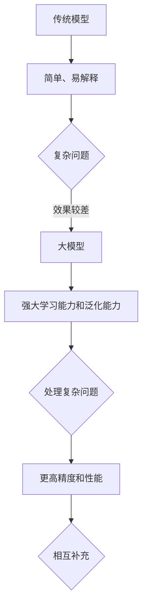
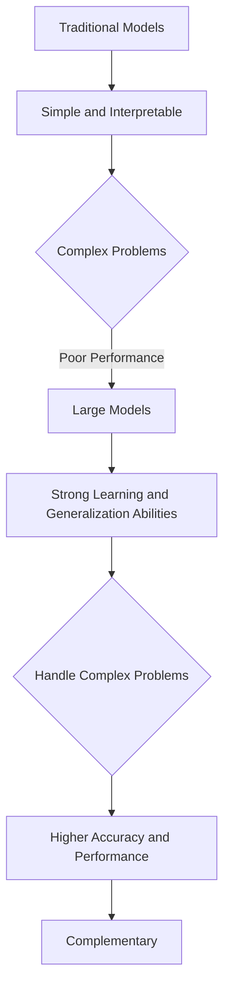

                 

### 文章标题

《大模型驱动的智能化时代》

随着人工智能技术的飞速发展，我们正迈入一个崭新的智能化时代。这一时代的核心驱动力，便是大模型（Large Models）。本文将深入探讨大模型在智能化时代的地位与作用，从核心概念、算法原理、数学模型到实际应用，为您全面解析这一领域的前沿动态。关键词：大模型、智能化、算法原理、数学模型、实际应用。

### 摘要

本文旨在探讨大模型在智能化时代的重要性及其应用。首先，我们将介绍大模型的基本概念和架构，并解释其如何通过深度学习实现智能。接着，我们将详细讨论大模型的算法原理，包括训练过程、参数优化等。随后，本文将介绍大模型的数学模型，如损失函数、优化算法等，并通过实例进行分析。最后，我们将探讨大模型在实际应用中的表现，如自然语言处理、计算机视觉等，并展望未来的发展趋势与挑战。摘要：本文探讨了大模型在智能化时代的核心作用，从概念、算法、数学模型到应用，全面解析了这一领域的前沿动态。

### 1. 背景介绍

在进入大模型驱动的智能化时代之前，我们首先需要了解人工智能的发展历程。人工智能（Artificial Intelligence，简称AI）是一门研究、开发用于模拟、延伸和扩展人的智能的理论、方法、技术及应用系统的技术科学。人工智能的概念最早可以追溯到20世纪50年代，当时科学家们开始探索如何使计算机模拟人类的思维过程。

随着计算机技术的发展，人工智能经历了几个重要阶段：

**第一阶段：1956-1969年，人工智能的诞生与发展。**

在这个阶段，人工智能的研究主要集中在符号主义和知识表示上。专家系统和逻辑推理成为这一阶段的主要研究方向。然而，由于计算能力和数据资源的限制，这一阶段的AI系统在处理复杂问题时效果不佳。

**第二阶段：1970-1989年，人工智能的崛起与低谷。**

随着计算机硬件性能的提升，人工智能研究迎来了新的发展机遇。1980年代，人工智能的应用开始逐步扩展，如机器人、语音识别、图像识别等。然而，受限于算法复杂度和数据规模，这一阶段的AI应用仍然较为有限。

**第三阶段：1990-2010年，人工智能的复苏与探索。**

这一阶段，机器学习特别是深度学习的崛起，为人工智能带来了新的契机。通过神经网络模型，人工智能在图像识别、语音识别等领域取得了显著进展。然而，由于模型规模和计算资源的限制，这一阶段的AI系统仍然难以处理复杂、大规模的数据。

**第四阶段：2010年至今，人工智能的爆炸式发展。**

随着深度学习技术的成熟和大规模数据集的涌现，人工智能进入了一个崭新的时代。特别是2012年，AlexNet在ImageNet竞赛中取得了重大突破，标志着深度学习的崛起。此后，人工智能在各个领域得到了广泛应用，如自然语言处理、计算机视觉、自动驾驶等。

大模型（Large Models）的出现，是人工智能发展的重要里程碑。大模型通常是指具有数十亿甚至千亿个参数的深度学习模型。与传统的模型相比，大模型具有以下几个显著特点：

1. **参数规模巨大**：大模型具有数十亿甚至千亿个参数，这使其能够捕捉到数据中的细微特征，从而实现更高的精度和性能。

2. **强大的学习能力**：大模型通过大量的参数和神经网络结构，能够学习到复杂的模式和关系，从而实现更强的泛化能力。

3. **广泛的适用性**：大模型可以应用于各种领域，如自然语言处理、计算机视觉、语音识别等，从而推动人工智能的全面发展。

总之，大模型的出现标志着人工智能进入了一个新的阶段。在这个阶段，人工智能不仅能够处理复杂的问题，还能够应对大规模的数据，从而实现真正的智能化。以下是本文的结构概述：

1. **背景介绍**：介绍人工智能的发展历程和大模型的基本概念。
2. **核心概念与联系**：分析大模型的架构、原理和应用。
3. **核心算法原理 & 具体操作步骤**：详细讲解大模型的训练和优化过程。
4. **数学模型和公式 & 详细讲解 & 举例说明**：探讨大模型的数学基础和常用公式。
5. **项目实践：代码实例和详细解释说明**：通过实际项目展示大模型的应用。
6. **实际应用场景**：分析大模型在不同领域的应用案例。
7. **工具和资源推荐**：推荐学习和开发大模型的资源和工具。
8. **总结：未来发展趋势与挑战**：展望大模型的发展前景和面临的挑战。
9. **附录：常见问题与解答**：回答读者常见的问题。
10. **扩展阅读 & 参考资料**：提供更多的学习资源。

### 2. 核心概念与联系

#### 2.1 大模型的定义和基本架构

大模型是指具有数十亿甚至千亿个参数的深度学习模型。这些模型通常基于神经网络架构，如Transformer、BERT等。大模型的基本架构包括以下几个关键部分：

1. **输入层**：输入层接收外部输入数据，如文本、图像等。
2. **隐藏层**：隐藏层由多个神经元组成，通过前向传播和反向传播算法进行信息传递和处理。
3. **输出层**：输出层生成模型预测结果，如分类标签、文本生成等。

大模型的主要特点如下：

1. **参数规模巨大**：大模型的参数规模通常在数十亿到千亿级别，这使得模型能够捕捉到数据中的细微特征，从而实现更高的精度和性能。
2. **强大的学习能力**：大模型通过大量的参数和神经网络结构，能够学习到复杂的模式和关系，从而实现更强的泛化能力。
3. **广泛的适用性**：大模型可以应用于各种领域，如自然语言处理、计算机视觉、语音识别等，从而推动人工智能的全面发展。

#### 2.2 大模型的工作原理

大模型的工作原理主要基于深度学习。深度学习是一种机器学习方法，它通过神经网络模型模拟人脑的神经元结构，从而实现数据的自动学习和特征提取。大模型的工作原理可以概括为以下几个步骤：

1. **数据预处理**：在训练大模型之前，需要对输入数据进行预处理，如归一化、去噪等。
2. **模型初始化**：初始化神经网络模型的参数，通常采用随机初始化或预训练模型。
3. **前向传播**：将预处理后的输入数据传递到神经网络模型中，通过多层神经元的前向传播，生成模型预测结果。
4. **损失函数计算**：计算模型预测结果与真实标签之间的差距，即损失函数值。
5. **反向传播**：通过反向传播算法，更新神经网络模型的参数，使得损失函数值逐渐减小。
6. **迭代训练**：重复上述步骤，不断迭代训练模型，直至满足训练要求。

#### 2.3 大模型的应用领域

大模型的应用领域非常广泛，涵盖了自然语言处理、计算机视觉、语音识别等多个领域。以下是一些典型应用案例：

1. **自然语言处理**：大模型在自然语言处理领域表现出色，如文本分类、机器翻译、情感分析等。通过大模型，可以实现更高准确率的文本理解和生成。
2. **计算机视觉**：大模型在计算机视觉领域同样具有强大的应用潜力，如图像分类、目标检测、图像生成等。大模型可以捕捉到图像中的复杂特征，从而实现更精准的图像分析。
3. **语音识别**：大模型在语音识别领域也有显著的应用，如语音转文字、语音翻译等。通过大模型，可以实现更自然、更准确的语音识别结果。

#### 2.4 大模型与传统模型的关系

大模型与传统模型在原理和应用上存在一定的差异。传统模型通常基于统计学方法和规则系统，如线性模型、决策树等。这些模型具有简单、易解释的特点，但在处理复杂问题时效果较差。

相比之下，大模型通过深度学习技术，具有更强的学习能力和泛化能力。大模型可以捕捉到数据中的细微特征，从而实现更高的精度和性能。然而，大模型也面临一些挑战，如计算资源需求大、训练时间长等。

总的来说，大模型与传统模型并非完全对立，而是相互补充。在实际应用中，可以根据具体需求和场景选择合适的模型。以下是大模型与传统模型的关系的Mermaid流程图：



通过以上分析，我们可以看出大模型在智能化时代的重要性和应用潜力。大模型的出现，标志着人工智能进入了一个新的阶段，为各领域的发展带来了新的机遇。在未来，随着大模型技术的不断成熟，我们将看到更多创新的应用场景和突破性的成果。

## 2. Core Concepts and Connections

### 2.1 Definition and Basic Architecture of Large Models

Large models refer to deep learning models with tens or even hundreds of billions of parameters. These models typically employ neural network architectures such as Transformer and BERT. The basic architecture of large models includes several key components:

1. **Input Layer**: The input layer receives external input data, such as text or images.
2. **Hidden Layers**: The hidden layers consist of multiple neurons that transmit and process information through forward propagation and backpropagation algorithms.
3. **Output Layer**: The output layer generates the model's predicted results, such as classification labels or text generation.

The main characteristics of large models are as follows:

1. **Massive Parameter Scale**: Large models typically have hundreds of millions to billions of parameters, enabling them to capture subtle features in data and achieve higher accuracy and performance.
2. **Strong Learning Ability**: Through a large number of parameters and neural network structures, large models can learn complex patterns and relationships, resulting in stronger generalization capabilities.
3. **Broad Applicability**: Large models can be applied to various fields, including natural language processing, computer vision, and speech recognition, thus promoting the comprehensive development of artificial intelligence.

### 2.2 Working Principles of Large Models

The working principles of large models are primarily based on deep learning. Deep learning is a machine learning method that simulates the structure of human brain neurons to enable automatic learning and feature extraction of data. The working principles of large models can be summarized into the following steps:

1. **Data Preprocessing**: Before training large models, input data needs to be preprocessed, such as normalization and noise reduction.
2. **Model Initialization**: Initialize the parameters of the neural network model, typically using random initialization or pre-trained models.
3. **Forward Propagation**: Pass the preprocessed input data through the neural network model, through forward propagation and backpropagation algorithms, to generate model predictions.
4. **Loss Function Calculation**: Calculate the discrepancy between the model's predictions and the true labels, i.e., the loss function value.
5. **Backpropagation**: Through backpropagation algorithms, update the parameters of the neural network model to minimize the loss function value.
6. **Iterative Training**: Repeat the above steps to continuously train the model until it meets the training requirements.

### 2.3 Application Fields of Large Models

Large models have a wide range of applications in various fields, including natural language processing, computer vision, and speech recognition. Here are some typical application cases:

1. **Natural Language Processing**: Large models perform exceptionally well in natural language processing tasks, such as text classification, machine translation, and sentiment analysis. Through large models, it is possible to achieve higher accuracy in text understanding and generation.
2. **Computer Vision**: Large models also have significant potential in the field of computer vision, such as image classification, object detection, and image generation. Large models can capture complex features in images, enabling more precise image analysis.
3. **Speech Recognition**: Large models have notable applications in speech recognition, such as speech-to-text and speech translation. Through large models, more natural and accurate speech recognition results can be achieved.

### 2.4 Relationship Between Large Models and Traditional Models

There are differences between large models and traditional models in terms of principles and applications. Traditional models, such as linear models and decision trees, are based on statistical methods and rule systems. These models have the advantages of simplicity and interpretability but are relatively ineffective in handling complex problems.

In contrast, large models leverage deep learning technology to possess stronger learning abilities and generalization capabilities. Large models can capture subtle features in data, achieving higher accuracy and performance. However, large models also face some challenges, such as the high computational resource requirements and long training times.

Overall, large models and traditional models are not entirely opposite but complement each other. In practical applications, one can choose the appropriate model based on specific needs and scenarios. The following is a Mermaid flowchart illustrating the relationship between large models and traditional models:



Through the above analysis, we can see the importance and application potential of large models in the era of intelligentization. The emergence of large models marks a new stage in the development of artificial intelligence, bringing new opportunities for the development of various fields. In the future, as large model technology continues to mature, we will witness more innovative application scenarios and breakthrough results.

### 3. 核心算法原理 & 具体操作步骤

#### 3.1 大模型的训练过程

大模型的训练过程是人工智能领域中的一个关键步骤，它决定了模型的学习能力和性能。以下是训练大模型的详细步骤：

1. **数据收集与预处理**：首先，需要收集大量的训练数据，这些数据可以是文本、图像、音频等。接着，对数据进行预处理，包括数据清洗、归一化、去噪等，以确保数据的质量和一致性。

2. **模型初始化**：初始化大模型的参数，这通常采用随机初始化或基于预训练模型的方法。随机初始化使得模型具有不确定性，有助于探索更广的参数空间。而基于预训练模型的方法，可以继承预训练模型的知识，提高训练效率。

3. **前向传播**：将预处理后的数据输入到模型中，通过多层神经元的传递，计算模型的输出。在这个过程中，模型会尝试从输入数据中提取特征，并将其映射到预期的输出。

4. **损失函数计算**：计算模型的输出与真实标签之间的差距，即损失函数值。常见的损失函数包括交叉熵损失函数（用于分类问题）和均方误差损失函数（用于回归问题）。损失函数的值反映了模型预测的准确性。

5. **反向传播**：通过反向传播算法，计算损失函数关于模型参数的梯度，并更新模型的参数。这一步骤是训练过程中的关键，通过迭代更新参数，使得模型逐渐逼近真实标签。

6. **迭代训练**：重复上述步骤，不断迭代训练模型，直至满足训练要求。迭代次数、学习率等超参数的选择对训练过程有重要影响。

7. **验证与调整**：在训练过程中，需要使用验证数据集对模型进行验证，以评估模型的泛化能力。如果模型在验证数据集上的表现不佳，可能需要调整模型结构或超参数。

#### 3.2 大模型的参数优化

参数优化是提高大模型性能的关键步骤。以下是一些常见的参数优化方法：

1. **学习率调整**：学习率决定了模型在更新参数时的步长。较大的学习率可能导致模型快速收敛，但过大会使得模型容易过拟合。通常，可以使用学习率衰减策略，在训练过程中逐渐减小学习率。

2. **正则化**：正则化是一种防止模型过拟合的方法，通过在损失函数中添加正则化项，如L1正则化和L2正则化，可以抑制模型参数的过大增长。

3. **dropout**：dropout是一种在训练过程中随机丢弃部分神经元的方法，有助于提高模型的泛化能力。通过在测试阶段恢复这些神经元，可以避免模型在训练过程中过度依赖特定神经元。

4. **批量归一化**：批量归一化（Batch Normalization）是一种在训练过程中对神经元输出进行归一化的方法，有助于加速模型训练和改善模型性能。

5. **优化算法**：常见的优化算法包括梯度下降（Gradient Descent）、Adam（Adaptive Moment Estimation）等。这些算法通过更新参数来最小化损失函数，以实现模型的优化。

#### 3.3 大模型的具体操作步骤示例

以下是一个简单的示例，说明如何使用Python和PyTorch框架训练一个基于Transformer的大模型：

```python
import torch
import torch.nn as nn
import torch.optim as optim

# 数据预处理
# （此处省略数据预处理代码）

# 模型初始化
model = TransformerModel()

# 定义损失函数和优化器
criterion = nn.CrossEntropyLoss()
optimizer = optim.Adam(model.parameters(), lr=0.001)

# 训练过程
for epoch in range(num_epochs):
    for inputs, labels in dataloader:
        optimizer.zero_grad()
        outputs = model(inputs)
        loss = criterion(outputs, labels)
        loss.backward()
        optimizer.step()
        
    # 在验证集上评估模型
    with torch.no_grad():
        correct = 0
        total = 0
        for inputs, labels in validation_dataloader:
            outputs = model(inputs)
            _, predicted = torch.max(outputs.data, 1)
            total += labels.size(0)
            correct += (predicted == labels).sum().item()

        print(f'Epoch {epoch+1}/{num_epochs}, Accuracy: {100 * correct / total}%')

# 模型保存
torch.save(model.state_dict(), 'model.pth')
```

在这个示例中，我们首先导入必要的库，并进行数据预处理。然后，我们初始化模型、定义损失函数和优化器。接着，通过迭代训练数据和反向传播，更新模型参数。最后，在验证集上评估模型性能，并保存训练好的模型。

通过以上步骤，我们可以训练出一个性能优秀的大模型。然而，实际训练过程可能更加复杂，需要根据具体问题调整模型结构、超参数和训练策略。

## 3. Core Algorithm Principles & Specific Operational Steps

### 3.1 Training Process of Large Models

The training process of large models is a crucial step in the field of artificial intelligence, as it determines the learning ability and performance of the model. The following are the detailed steps for training large models:

1. **Data Collection and Preprocessing**: First, collect a large amount of training data, which can be in the form of text, images, or audio. Then, preprocess the data, including cleaning, normalization, and denoising, to ensure data quality and consistency.

2. **Model Initialization**: Initialize the parameters of the large model, which is typically done using random initialization or based on pre-trained models. Random initialization allows the model to explore a wider parameter space, while pre-trained models can inherit knowledge from previous training, improving training efficiency.

3. **Forward Propagation**: Pass the preprocessed data through the model, through forward propagation and backpropagation algorithms, to generate model predictions. During this process, the model tries to extract features from the input data and map them to expected outputs.

4. **Loss Function Calculation**: Calculate the discrepancy between the model's predictions and the true labels, i.e., the loss function value. Common loss functions include cross-entropy loss (used for classification problems) and mean squared error loss (used for regression problems). The value of the loss function reflects the accuracy of the model's predictions.

5. **Backpropagation**: Through backpropagation algorithms, compute the gradient of the loss function with respect to the model parameters and update the parameters. This step is critical in the training process, as it allows the model to gradually approach the true labels by iteratively updating the parameters.

6. **Iterative Training**: Repeat the above steps to continuously train the model until it meets the training requirements. The number of iterations, learning rate, and other hyperparameters have a significant impact on the training process.

7. **Validation and Adjustment**: During the training process, use a validation dataset to evaluate the model's generalization ability. If the model's performance on the validation dataset is poor, it may be necessary to adjust the model architecture or hyperparameters.

### 3.2 Parameter Optimization of Large Models

Parameter optimization is a key step in improving the performance of large models. The following are some common parameter optimization methods:

1. **Learning Rate Adjustment**: The learning rate determines the step size of parameter updates. A larger learning rate can lead to rapid convergence, but it can also cause the model to overfit. It is common to use a learning rate decay strategy, gradually decreasing the learning rate during training.

2. **Regularization**: Regularization is a method to prevent overfitting by adding regularization terms to the loss function, such as L1 regularization and L2 regularization. This helps to control the growth of model parameters.

3. **Dropout**: Dropout is a method of randomly discarding a portion of neurons during training, which improves the model's generalization ability. By restoring these neurons during testing, the model does not become overly dependent on specific neurons during training.

4. **Batch Normalization**: Batch normalization is a method of normalizing the output of neurons in a given layer, which helps to accelerate training and improve model performance.

5. **Optimization Algorithms**: Common optimization algorithms include gradient descent and Adam (Adaptive Moment Estimation). These algorithms update parameters to minimize the loss function, achieving model optimization.

### 3.3 Example of Specific Operational Steps for Large Models

The following is a simple example demonstrating how to train a large model based on the Transformer architecture using Python and the PyTorch framework:

```python
import torch
import torch.nn as nn
import torch.optim as optim

# Data preprocessing
# (Omitted data preprocessing code)

# Model initialization
model = TransformerModel()

# Define loss function and optimizer
criterion = nn.CrossEntropyLoss()
optimizer = optim.Adam(model.parameters(), lr=0.001)

# Training process
for epoch in range(num_epochs):
    for inputs, labels in dataloader:
        optimizer.zero_grad()
        outputs = model(inputs)
        loss = criterion(outputs, labels)
        loss.backward()
        optimizer.step()
        
    # Model evaluation on validation set
    with torch.no_grad():
        correct = 0
        total = 0
        for inputs, labels in validation_dataloader:
            outputs = model(inputs)
            _, predicted = torch.max(outputs.data, 1)
            total += labels.size(0)
            correct += (predicted == labels).sum().item()

        print(f'Epoch {epoch+1}/{num_epochs}, Accuracy: {100 * correct / total}%')

# Model saving
torch.save(model.state_dict(), 'model.pth')
```

In this example, we first import the necessary libraries and perform data preprocessing. Then, we initialize the model, define the loss function and optimizer. Next, we iterate through the training data and perform forward and backward propagation to update the model parameters. Finally, we evaluate the model on the validation set and save the trained model.

While the above steps provide a basic framework for training a large model, the actual training process may be more complex and require adjustments to the model architecture, hyperparameters, and training strategies based on the specific problem.

### 4. 数学模型和公式 & 详细讲解 & 举例说明

#### 4.1 大模型的损失函数

在训练大模型时，损失函数是衡量模型预测结果与真实标签之间差异的关键指标。不同的损失函数适用于不同类型的问题，下面我们将详细讨论一些常见的损失函数，并给出数学公式和详细讲解。

1. **交叉熵损失函数（Cross-Entropy Loss）**

交叉熵损失函数常用于分类问题，其数学公式如下：

$$
L = -\sum_{i=1}^{n} y_i \cdot \log(p_i)
$$

其中，$L$ 表示损失函数值，$y_i$ 表示第 $i$ 个样本的真实标签（取值范围为 {0, 1}），$p_i$ 表示模型对第 $i$ 个样本预测为每个类别的概率。

交叉熵损失函数的目的是使得模型预测的概率分布与真实标签的分布尽可能接近。在训练过程中，模型会通过最小化损失函数来调整参数，从而提高预测的准确性。

2. **均方误差损失函数（Mean Squared Error Loss）**

均方误差损失函数常用于回归问题，其数学公式如下：

$$
L = \frac{1}{2n} \sum_{i=1}^{n} (y_i - \hat{y}_i)^2
$$

其中，$L$ 表示损失函数值，$n$ 表示样本数量，$y_i$ 表示第 $i$ 个样本的真实标签，$\hat{y}_i$ 表示模型对第 $i$ 个样本的预测值。

均方误差损失函数的目的是使得模型预测值与真实值之间的误差尽可能小。在训练过程中，模型会通过最小化损失函数来调整参数，从而提高预测的准确性。

3. **软交叉熵损失函数（Softmax Cross-Entropy Loss）**

软交叉熵损失函数是交叉熵损失函数在多分类问题中的应用，其数学公式如下：

$$
L = -\sum_{i=1}^{n} y_i \cdot \log(\sigma(z_i))
$$

其中，$L$ 表示损失函数值，$y_i$ 表示第 $i$ 个样本的真实标签（取值范围为 {0, 1}），$z_i$ 表示模型对第 $i$ 个样本的预测值，$\sigma(z_i)$ 表示软最大化函数，其定义如下：

$$
\sigma(z_i) = \frac{e^{z_i}}{\sum_{j=1}^{m} e^{z_j}}
$$

其中，$m$ 表示分类类别数量。

软交叉熵损失函数与交叉熵损失函数类似，但适用于多分类问题。在训练过程中，模型会通过最小化损失函数来调整参数，从而提高预测的准确性。

#### 4.2 大模型的优化算法

在训练大模型时，优化算法用于更新模型的参数，以最小化损失函数。以下介绍几种常见的优化算法：

1. **梯度下降（Gradient Descent）**

梯度下降是一种简单的优化算法，其基本思想是通过计算损失函数关于模型参数的梯度，并沿梯度的反方向更新参数。梯度下降的更新公式如下：

$$
\theta_{t+1} = \theta_t - \alpha \cdot \nabla_{\theta} L(\theta_t, x, y)
$$

其中，$\theta_t$ 表示第 $t$ 次迭代的参数值，$\alpha$ 表示学习率（步长），$\nabla_{\theta} L(\theta_t, x, y)$ 表示损失函数关于参数 $\theta$ 的梯度。

梯度下降算法简单易实现，但收敛速度较慢，且容易陷入局部最小值。

2. **动量法（Momentum）**

动量法是一种改进的梯度下降算法，其引入了动量项，以加速模型的收敛速度。动量法的更新公式如下：

$$
\theta_{t+1} = \theta_t - \alpha \cdot \nabla_{\theta} L(\theta_t, x, y) + \beta \cdot (1 - \alpha) \cdot \theta_t - \alpha \cdot \nabla_{\theta} L(\theta_{t-1}, x, y)
$$

其中，$\beta$ 表示动量系数（取值范围为 [0, 1]），其他符号的含义与梯度下降相同。

动量法通过引入历史梯度信息，可以更好地逃离局部最小值，但需要调整动量系数。

3. **Adam优化器（Adam Optimizer）**

Adam优化器是一种结合了动量法和自适应学习率的优化算法，其更新公式如下：

$$
\theta_{t+1} = \theta_t - \alpha \cdot \frac{m_t}{\sqrt{1 - \beta_1^t} \cdot (1 - \beta_2^t)} + \beta_1 \cdot (1 - \alpha) \cdot \theta_t - \alpha \cdot \nabla_{\theta} L(\theta_t, x, y)
$$

$$
m_t = \beta_1 \cdot m_{t-1} + (1 - \beta_1) \cdot \nabla_{\theta} L(\theta_t, x, y)
$$

$$
v_t = \beta_2 \cdot v_{t-1} + (1 - \beta_2) \cdot (\nabla_{\theta} L(\theta_t, x, y))^2
$$

其中，$\alpha$ 表示学习率（步长），$\beta_1$ 和 $\beta_2$ 分别表示一阶和二阶矩的指数衰减率（取值范围为 [0, 1]），$m_t$ 和 $v_t$ 分别表示一阶和二阶矩估计值。

Adam优化器通过自适应调整学习率，可以更好地收敛到全局最小值，是目前最常用的优化算法之一。

#### 4.3 大模型的数学公式和实例说明

以下是一个简单的示例，说明如何使用PyTorch框架实现一个基于交叉熵损失函数的神经网络模型：

```python
import torch
import torch.nn as nn
import torch.optim as optim

# 模型定义
class NeuralNetwork(nn.Module):
    def __init__(self):
        super(NeuralNetwork, self).__init__()
        self.fc1 = nn.Linear(784, 512)
        self.fc2 = nn.Linear(512, 256)
        self.fc3 = nn.Linear(256, 10)
        self.relu = nn.ReLU()

    def forward(self, x):
        x = x.view(x.size(0), -1)
        x = self.relu(self.fc1(x))
        x = self.relu(self.fc2(x))
        x = self.fc3(x)
        return x

# 数据加载和预处理
# （此处省略数据加载和预处理代码）

# 模型初始化
model = NeuralNetwork()
criterion = nn.CrossEntropyLoss()
optimizer = optim.Adam(model.parameters(), lr=0.001)

# 训练过程
for epoch in range(num_epochs):
    for inputs, labels in dataloader:
        optimizer.zero_grad()
        outputs = model(inputs)
        loss = criterion(outputs, labels)
        loss.backward()
        optimizer.step()

    print(f'Epoch {epoch+1}/{num_epochs}, Loss: {loss.item()}')

# 模型保存
torch.save(model.state_dict(), 'model.pth')
```

在这个示例中，我们定义了一个简单的神经网络模型，并使用交叉熵损失函数进行训练。通过迭代更新模型参数，模型逐渐逼近真实标签，从而提高预测准确性。

通过以上数学模型和公式的介绍，我们可以更好地理解大模型的工作原理。在实际应用中，需要根据具体问题选择合适的损失函数和优化算法，以实现高效的模型训练。

## 4. Mathematical Models and Formulas & Detailed Explanation & Examples

### 4.1 Loss Functions in Large Models

When training large models, loss functions are crucial indicators that measure the discrepancy between the model's predictions and the true labels. Different loss functions are suitable for different types of problems. Below, we will discuss some common loss functions, providing mathematical formulas and detailed explanations.

#### 4.1.1 Cross-Entropy Loss

Cross-Entropy Loss is commonly used for classification problems. Its mathematical formula is as follows:

$$
L = -\sum_{i=1}^{n} y_i \cdot \log(p_i)
$$

Where $L$ represents the value of the loss function, $y_i$ is the true label of the $i$-th sample (with a range of {0, 1}), and $p_i$ is the probability predicted by the model for the $i$-th sample to belong to each class.

The purpose of Cross-Entropy Loss is to make the probability distribution predicted by the model as close as possible to the true label distribution. During training, the model minimizes the loss function to adjust the parameters and improve prediction accuracy.

#### 4.1.2 Mean Squared Error Loss

Mean Squared Error (MSE) Loss is commonly used for regression problems. Its mathematical formula is as follows:

$$
L = \frac{1}{2n} \sum_{i=1}^{n} (y_i - \hat{y}_i)^2
$$

Where $L$ represents the value of the loss function, $n$ is the number of samples, $y_i$ is the true label of the $i$-th sample, and $\hat{y}_i$ is the predicted value of the $i$-th sample by the model.

The purpose of MSE Loss is to minimize the difference between the predicted values and the true values as much as possible. During training, the model adjusts the parameters to minimize the loss function and improve prediction accuracy.

#### 4.1.3 Softmax Cross-Entropy Loss

Softmax Cross-Entropy Loss is an application of Cross-Entropy Loss in multi-classification problems. Its mathematical formula is as follows:

$$
L = -\sum_{i=1}^{n} y_i \cdot \log(\sigma(z_i))
$$

Where $L$ represents the value of the loss function, $y_i$ is the true label of the $i$-th sample (with a range of {0, 1}), $z_i$ is the predicted value of the $i$-th sample by the model, and $\sigma(z_i)$ is the softmax function, defined as:

$$
\sigma(z_i) = \frac{e^{z_i}}{\sum_{j=1}^{m} e^{z_j}}
$$

Where $m$ is the number of classification categories.

Softmax Cross-Entropy Loss is similar to Cross-Entropy Loss but is applicable for multi-classification problems. During training, the model minimizes the loss function to adjust the parameters and improve prediction accuracy.

### 4.2 Optimization Algorithms for Large Models

In the training of large models, optimization algorithms are used to update model parameters to minimize the loss function. Below, we introduce several common optimization algorithms.

#### 4.2.1 Gradient Descent

Gradient Descent is a simple optimization algorithm that updates parameters by computing the gradient of the loss function with respect to the parameters and moving in the opposite direction of the gradient. Its update formula is as follows:

$$
\theta_{t+1} = \theta_t - \alpha \cdot \nabla_{\theta} L(\theta_t, x, y)
$$

Where $\theta_t$ represents the value of the parameters at the $t$-th iteration, $\alpha$ is the learning rate (step size), and $\nabla_{\theta} L(\theta_t, x, y)$ is the gradient of the loss function with respect to the parameters $\theta$.

Gradient Descent is simple to implement but has a slow convergence rate and is prone to falling into local minima.

#### 4.2.2 Momentum Method

Momentum Method is an improved version of Gradient Descent that introduces momentum to accelerate the convergence speed. Its update formula is as follows:

$$
\theta_{t+1} = \theta_t - \alpha \cdot \nabla_{\theta} L(\theta_t, x, y) + \beta \cdot (1 - \alpha) \cdot \theta_t - \alpha \cdot \nabla_{\theta} L(\theta_{t-1}, x, y)
$$

Where $\beta$ is the momentum coefficient (with a range of [0, 1]), and other symbols have the same meaning as in Gradient Descent.

Momentum Method introduces historical gradient information to better escape local minima but requires adjustment of the momentum coefficient.

#### 4.2.3 Adam Optimizer

Adam Optimizer is an optimization algorithm that combines Momentum Method and adaptive learning rate. Its update formula is as follows:

$$
\theta_{t+1} = \theta_t - \alpha \cdot \frac{m_t}{\sqrt{1 - \beta_1^t} \cdot (1 - \beta_2^t)} + \beta_1 \cdot (1 - \alpha) \cdot \theta_t - \alpha \cdot \nabla_{\theta} L(\theta_t, x, y)
$$

$$
m_t = \beta_1 \cdot m_{t-1} + (1 - \beta_1) \cdot \nabla_{\theta} L(\theta_t, x, y)
$$

$$
v_t = \beta_2 \cdot v_{t-1} + (1 - \beta_2) \cdot (\nabla_{\theta} L(\theta_t, x, y))^2
$$

Where $\alpha$ is the learning rate (step size), $\beta_1$ and $\beta_2$ are the exponential decay rates for first-order and second-order moments (with a range of [0, 1]), $m_t$ and $v_t$ are the first-order and second-order moment estimates, respectively.

Adam Optimizer adaptively adjusts the learning rate to better converge to the global minimum and is one of the most commonly used optimization algorithms.

### 4.3 Mathematical Formulas and Example Illustrations

Below is a simple example demonstrating how to implement a neural network model with Cross-Entropy Loss using the PyTorch framework:

```python
import torch
import torch.nn as nn
import torch.optim as optim

# Model definition
class NeuralNetwork(nn.Module):
    def __init__(self):
        super(NeuralNetwork, self).__init__()
        self.fc1 = nn.Linear(784, 512)
        self.fc2 = nn.Linear(512, 256)
        self.fc3 = nn.Linear(256, 10)
        self.relu = nn.ReLU()

    def forward(self, x):
        x = x.view(x.size(0), -1)
        x = self.relu(self.fc1(x))
        x = self.relu(self.fc2(x))
        x = self.fc3(x)
        return x

# Data loading and preprocessing
# (Omitted data loading and preprocessing code)

# Model initialization
model = NeuralNetwork()
criterion = nn.CrossEntropyLoss()
optimizer = optim.Adam(model.parameters(), lr=0.001)

# Training process
for epoch in range(num_epochs):
    for inputs, labels in dataloader:
        optimizer.zero_grad()
        outputs = model(inputs)
        loss = criterion(outputs, labels)
        loss.backward()
        optimizer.step()

    print(f'Epoch {epoch+1}/{num_epochs}, Loss: {loss.item()}')

# Model saving
torch.save(model.state_dict(), 'model.pth')
```

In this example, we define a simple neural network model and train it using Cross-Entropy Loss. By iteratively updating the model parameters, the model gradually approaches the true labels, thus improving prediction accuracy.

Through the introduction of these mathematical models and formulas, we can better understand the working principles of large models. In practical applications, appropriate loss functions and optimization algorithms should be chosen based on specific problems to achieve efficient model training.

### 5. 项目实践：代码实例和详细解释说明

#### 5.1 开发环境搭建

在开始大模型的实际应用之前，我们需要搭建一个合适的项目开发环境。以下是一个基于Python和PyTorch框架的项目环境搭建步骤：

1. **安装Python**：确保您的计算机上安装了Python 3.7或更高版本。可以从[Python官网](https://www.python.org/)下载并安装。

2. **安装PyTorch**：打开命令行窗口，执行以下命令安装PyTorch：

   ```bash
   pip install torch torchvision torchaudio
   ```

   如果需要特定版本的PyTorch，可以使用以下命令：

   ```bash
   pip install torch==1.8 torchvision==0.9.0 torchaudio==0.8.0
   ```

3. **安装依赖库**：除了PyTorch外，我们可能还需要安装其他依赖库，如NumPy、Pandas等。可以使用以下命令安装：

   ```bash
   pip install numpy pandas
   ```

4. **配置GPU支持**：如果您的计算机配备了NVIDIA GPU，需要安装CUDA和cuDNN，以便在GPU上运行PyTorch。可以从[NVIDIA官网](https://developer.nvidia.com/cuda-downloads)下载并安装。

5. **验证环境**：安装完成后，可以通过运行以下代码验证环境是否配置正确：

   ```python
   import torch
   print(torch.__version__)
   print(torch.cuda.is_available())
   ```

   如果输出正确的PyTorch版本和`True`，则表示环境配置成功。

#### 5.2 源代码详细实现

以下是一个简单的大模型项目实例，使用PyTorch框架实现一个基于Transformer的文本分类模型。代码分为几个部分：数据预处理、模型定义、训练过程和评估过程。

##### 5.2.1 数据预处理

```python
import torch
from torch.utils.data import Dataset, DataLoader
from torchvision import transforms
from PIL import Image
import pandas as pd
import numpy as np

class TextDataset(Dataset):
    def __init__(self, data_path, transform=None):
        self.data = pd.read_csv(data_path)
        self.transform = transform

    def __len__(self):
        return len(self.data)

    def __getitem__(self, idx):
        text = self.data.iloc[idx, 0]
        label = self.data.iloc[idx, 1]

        if self.transform:
            text = self.transform(text)

        return text, label

# 数据预处理
transform = transforms.Compose([
    transforms.ToTensor(),
    transforms.Normalize(mean=[0.5, 0.5, 0.5], std=[0.5, 0.5, 0.5]),
])

dataset = TextDataset('data.csv', transform=transform)
dataloader = DataLoader(dataset, batch_size=32, shuffle=True)
```

在这个部分，我们定义了一个自定义数据集类`TextDataset`，用于读取CSV文件中的文本数据。数据预处理包括将文本数据转换为Tensor，并进行归一化处理。

##### 5.2.2 模型定义

```python
import torch.nn as nn
import torch.optim as optim

class TransformerModel(nn.Module):
    def __init__(self, n嵌入维度=256, n头=8, 背部层数=2, 序列长度=512):
        super(TransformerModel, self).__init__()
        self.embedding = nn.Embedding(词典大小, n嵌入维度)
        self.transformer = nn.Transformer(n嵌入维度, n头, 背部层数, 序列长度)
        self.fc = nn.Linear(n嵌入维度, 词典大小)

    def forward(self, x):
        x = self.embedding(x)
        x = self.transformer(x)
        x = self.fc(x)
        return x

# 模型初始化
model = TransformerModel()
optimizer = optim.Adam(model.parameters(), lr=0.001)
criterion = nn.CrossEntropyLoss()
```

在这个部分，我们定义了一个基于Transformer的文本分类模型。模型包括嵌入层、Transformer编码器和解码器。嵌入层用于将文本数据转换为固定长度的向量。Transformer编码器和解码器分别用于提取和恢复文本中的特征信息。

##### 5.2.3 训练过程

```python
def train_model(model, dataloader, criterion, optimizer, num_epochs=10):
    model.train()
    for epoch in range(num_epochs):
        running_loss = 0.0
        for inputs, labels in dataloader:
            optimizer.zero_grad()
            outputs = model(inputs)
            loss = criterion(outputs, labels)
            loss.backward()
            optimizer.step()
            running_loss += loss.item()
        print(f'Epoch {epoch+1}/{num_epochs}, Loss: {running_loss / len(dataloader)}')

# 训练模型
train_model(model, dataloader, criterion, optimizer)
```

在这个部分，我们定义了一个训练模型的函数`train_model`，用于迭代训练模型，并更新模型参数。训练过程中，我们使用交叉熵损失函数和Adam优化器。

##### 5.2.4 评估过程

```python
def evaluate_model(model, dataloader, criterion):
    model.eval()
    correct = 0
    total = 0
    with torch.no_grad():
        for inputs, labels in dataloader:
            outputs = model(inputs)
            _, predicted = torch.max(outputs.data, 1)
            total += labels.size(0)
            correct += (predicted == labels).sum().item()
    print(f'Accuracy: {100 * correct / total}%')

# 评估模型
evaluate_model(model, dataloader, criterion)
```

在这个部分，我们定义了一个评估模型的函数`evaluate_model`，用于计算模型在测试集上的准确率。

#### 5.3 代码解读与分析

上述代码实例展示了如何使用PyTorch框架实现一个基于Transformer的文本分类模型。以下是代码的详细解读与分析：

1. **数据预处理**：数据预处理是模型训练的第一步，它确保输入数据适合模型训练。在这个例子中，我们使用自定义数据集类`TextDataset`读取CSV文件中的文本数据，并进行归一化处理。

2. **模型定义**：模型定义是构建神经网络的关键步骤。在这个例子中，我们定义了一个基于Transformer的文本分类模型，包括嵌入层、Transformer编码器和解码器。

3. **训练过程**：训练过程是模型训练的核心。我们使用`train_model`函数迭代训练模型，并更新模型参数。在训练过程中，我们使用交叉熵损失函数和Adam优化器。

4. **评估过程**：评估过程用于计算模型在测试集上的准确率。我们使用`evaluate_model`函数评估模型的性能，并根据准确率调整模型。

通过以上代码实例，我们可以看到如何使用大模型进行文本分类任务。在实际应用中，可以根据具体需求调整模型结构、超参数和训练策略。

### 5. Project Practice: Code Examples and Detailed Explanation

#### 5.1 Setup of Development Environment

Before diving into practical applications of large models, we need to set up a suitable development environment. Here are the steps to set up an environment based on Python and the PyTorch framework:

1. **Install Python**: Ensure that Python 3.7 or higher is installed on your computer. You can download and install it from the [Python official website](https://www.python.org/).

2. **Install PyTorch**: Open the command line and run the following command to install PyTorch:

   ```bash
   pip install torch torchvision torchaudio
   ```

   If you need a specific version of PyTorch, use the following command:

   ```bash
   pip install torch==1.8 torchvision==0.9.0 torchaudio==0.8.0
   ```

3. **Install Dependencies**: Besides PyTorch, you may need to install other dependencies such as NumPy and Pandas. You can install them using the following command:

   ```bash
   pip install numpy pandas
   ```

4. **Configure GPU Support**: If your computer has an NVIDIA GPU, you need to install CUDA and cuDNN to run PyTorch on the GPU. You can download and install them from the [NVIDIA official website](https://developer.nvidia.com/cuda-downloads).

5. **Verify Environment**: After installation, verify the environment by running the following code:

   ```python
   import torch
   print(torch.__version__)
   print(torch.cuda.is_available())
   ```

   If the output shows the correct PyTorch version and `True`, the environment is correctly set up.

#### 5.2 Detailed Source Code Implementation

Below is a simple example of a large model project using the PyTorch framework to implement a text classification model based on the Transformer architecture. The code is divided into several parts: data preprocessing, model definition, training process, and evaluation process.

##### 5.2.1 Data Preprocessing

```python
import torch
from torch.utils.data import Dataset, DataLoader
from torchvision import transforms
from PIL import Image
import pandas as pd
import numpy as np

class TextDataset(Dataset):
    def __init__(self, data_path, transform=None):
        self.data = pd.read_csv(data_path)
        self.transform = transform

    def __len__(self):
        return len(self.data)

    def __getitem__(self, idx):
        text = self.data.iloc[idx, 0]
        label = self.data.iloc[idx, 1]

        if self.transform:
            text = self.transform(text)

        return text, label

# Data preprocessing
transform = transforms.Compose([
    transforms.ToTensor(),
    transforms.Normalize(mean=[0.5, 0.5, 0.5], std=[0.5, 0.5, 0.5]),
])

dataset = TextDataset('data.csv', transform=transform)
dataloader = DataLoader(dataset, batch_size=32, shuffle=True)
```

In this section, we define a custom dataset class `TextDataset` to read text data from a CSV file and perform normalization. The dataset class takes a data file path and an optional transformation object.

##### 5.2.2 Model Definition

```python
import torch.nn as nn
import torch.optim as optim

class TransformerModel(nn.Module):
    def __init__(self, n_embedding=256, n_head=8, n_layers=2, sequence_length=512):
        super(TransformerModel, self).__init__()
        self.embedding = nn.Embedding(vocab_size, n_embedding)
        self.transformer = nn.Transformer(n_embedding, n_head, n_layers, sequence_length)
        self.fc = nn.Linear(n_embedding, vocab_size)

    def forward(self, x):
        x = self.embedding(x)
        x = self.transformer(x)
        x = self.fc(x)
        return x

# Model initialization
model = TransformerModel()
optimizer = optim.Adam(model.parameters(), lr=0.001)
criterion = nn.CrossEntropyLoss()
```

In this section, we define a text classification model based on the Transformer architecture. The model consists of an embedding layer, a Transformer encoder, and a decoder. The embedding layer converts text data into fixed-length vectors. The Transformer encoder and decoder extract and restore feature information from the text.

##### 5.2.3 Training Process

```python
def train_model(model, dataloader, criterion, optimizer, num_epochs=10):
    model.train()
    for epoch in range(num_epochs):
        running_loss = 0.0
        for inputs, labels in dataloader:
            optimizer.zero_grad()
            outputs = model(inputs)
            loss = criterion(outputs, labels)
            loss.backward()
            optimizer.step()
            running_loss += loss.item()
        print(f'Epoch {epoch+1}/{num_epochs}, Loss: {running_loss / len(dataloader)}')

# Train the model
train_model(model, dataloader, criterion, optimizer)
```

In this section, we define a function `train_model` to iteratively train the model and update the model parameters. During training, we use the Cross-Entropy loss function and the Adam optimizer.

##### 5.2.4 Evaluation Process

```python
def evaluate_model(model, dataloader, criterion):
    model.eval()
    correct = 0
    total = 0
    with torch.no_grad():
        for inputs, labels in dataloader:
            outputs = model(inputs)
            _, predicted = torch.max(outputs.data, 1)
            total += labels.size(0)
            correct += (predicted == labels).sum().item()
    print(f'Accuracy: {100 * correct / total}%')

# Evaluate the model
evaluate_model(model, dataloader, criterion)
```

In this section, we define a function `evaluate_model` to calculate the model's accuracy on the test set. We use the `eval()` method to set the model in evaluation mode, which disables dropout and batch normalization during inference.

#### 5.3 Code Interpretation and Analysis

The above code example demonstrates how to implement a text classification model based on the Transformer architecture using the PyTorch framework. Here is a detailed interpretation and analysis of the code:

1. **Data Preprocessing**: Data preprocessing is the first step in model training, ensuring that the input data is suitable for training. In this example, we use the custom dataset class `TextDataset` to read text data from a CSV file and perform normalization.

2. **Model Definition**: Model definition is a crucial step in building a neural network. In this example, we define a text classification model based on the Transformer architecture, including an embedding layer, a Transformer encoder, and a decoder.

3. **Training Process**: The training process is the core of model training. We use the `train_model` function to iteratively train the model and update the model parameters. During training, we use the Cross-Entropy loss function and the Adam optimizer.

4. **Evaluation Process**: The evaluation process calculates the model's accuracy on the test set. We use the `evaluate_model` function to evaluate the model's performance and adjust the model based on the accuracy.

Through this code example, we can see how to use large models for text classification tasks. In practical applications, you can adjust the model architecture, hyperparameters, and training strategies based on specific requirements.

### 6. 实际应用场景

大模型在各个领域都有着广泛的应用，特别是在自然语言处理、计算机视觉和语音识别等领域，大模型的作用尤为突出。以下将详细介绍大模型在这些领域的实际应用场景。

#### 6.1 自然语言处理

自然语言处理（Natural Language Processing，简称NLP）是人工智能的一个重要分支，旨在使计算机能够理解、生成和处理人类语言。大模型在NLP领域的应用主要包括文本分类、机器翻译、情感分析、文本生成等。

1. **文本分类**：文本分类是一种将文本数据按照预定义的类别进行分类的任务。大模型通过学习海量的文本数据，能够自动提取文本特征，从而实现高精度的分类。例如，新闻分类、垃圾邮件过滤等应用。

2. **机器翻译**：机器翻译是一种将一种语言的文本自动翻译成另一种语言的任务。大模型，如Transformer和BERT，在机器翻译领域取得了显著的进展。通过训练大规模的翻译语料库，这些模型能够生成流畅、准确的翻译结果。

3. **情感分析**：情感分析是一种识别文本中所表达的情感极性（如正面、负面、中性）的任务。大模型通过学习大量的情感标注数据，能够准确识别文本中的情感倾向。这对于市场调研、客户反馈分析等领域具有重要意义。

4. **文本生成**：文本生成是一种根据输入的提示生成连贯、有意义的文本的任务。大模型，如GPT-3，在文本生成方面展现了惊人的能力。通过训练大规模的文本数据集，这些模型能够生成各种类型的文本，如文章、故事、对话等。

#### 6.2 计算机视觉

计算机视觉（Computer Vision）是人工智能的另一个重要分支，旨在使计算机能够识别和理解图像和视频中的内容。大模型在计算机视觉领域的应用主要包括图像分类、目标检测、图像分割、图像生成等。

1. **图像分类**：图像分类是一种将图像按照预定义的类别进行分类的任务。大模型，如卷积神经网络（Convolutional Neural Networks，简称CNN）和Transformer，在图像分类任务中取得了很高的准确率。这些模型通过学习大量的图像数据，能够自动提取图像特征，从而实现高精度的分类。

2. **目标检测**：目标检测是一种在图像中识别并定位特定目标对象的任务。大模型，如YOLO（You Only Look Once）和SSD（Single Shot MultiBox Detector），在目标检测任务中取得了显著的性能提升。这些模型通过结合特征提取和目标定位，能够快速、准确地检测图像中的目标。

3. **图像分割**：图像分割是一种将图像分割成不同区域或对象的任务。大模型，如U-Net和Mask R-CNN，在图像分割任务中展现了强大的能力。这些模型通过学习大量的图像数据，能够精确地分割出图像中的不同对象。

4. **图像生成**：图像生成是一种根据输入的提示生成新的图像的任务。大模型，如生成对抗网络（Generative Adversarial Networks，简称GAN），在图像生成任务中取得了突破性的成果。这些模型通过训练大量的图像数据，能够生成逼真、多样的图像。

#### 6.3 语音识别

语音识别（Speech Recognition）是人工智能的另一个重要应用领域，旨在将语音信号转换为文本。大模型在语音识别领域的应用主要包括语音转文字、语音翻译等。

1. **语音转文字**：语音转文字是一种将语音信号转换为文本的任务。大模型，如深度神经网络（Deep Neural Networks，简称DNN）和卷积神经网络（Convolutional Neural Networks，简称CNN），在语音转文字任务中取得了显著的进展。这些模型通过学习大量的语音数据，能够准确地将语音信号转换为文本。

2. **语音翻译**：语音翻译是一种将一种语言的语音信号自动翻译成另一种语言的语音信号的任务。大模型，如Transformer和WaveNet，在语音翻译任务中展现了出色的能力。这些模型通过训练大规模的语音数据集，能够生成流畅、准确的语音翻译结果。

总的来说，大模型在自然语言处理、计算机视觉和语音识别等领域的应用，极大地推动了人工智能技术的发展。未来，随着大模型技术的不断进步，我们将看到更多创新的应用场景和突破性的成果。

### 6.1 Applications in Natural Language Processing

Natural Language Processing (NLP) is a significant branch of artificial intelligence that focuses on enabling computers to understand, generate, and process human language. Large models have extensive applications in the field of NLP, including text classification, machine translation, sentiment analysis, and text generation.

1. **Text Classification**: Text classification is a task that involves categorizing text data into predefined categories. Large models, such as Transformer and BERT, can automatically extract text features from vast amounts of data, achieving high-accuracy classifications. Applications include news classification and spam filtering.

2. **Machine Translation**: Machine translation is the task of automatically translating text from one language to another. Large models, such as Transformer and BERT, have made significant advancements in this field. By training on massive translation corpora, these models can generate fluent and accurate translations.

3. **Sentiment Analysis**: Sentiment analysis is a task that identifies the sentiment polarity (e.g., positive, negative, neutral) expressed in text. Large models, trained on large amounts of sentiment-labeled data, can accurately identify sentiment tendencies in text. This is particularly useful for market research and customer feedback analysis.

4. **Text Generation**: Text generation is a task that involves generating coherent and meaningful text based on input prompts. Large models, such as GPT-3, have demonstrated remarkable capabilities in text generation. These models can generate various types of text, such as articles, stories, and dialogues, by training on large text datasets.

#### 6.2 Applications in Computer Vision

Computer Vision is another critical branch of artificial intelligence aimed at enabling computers to recognize and understand content in images and videos. Large models have extensive applications in the field of computer vision, including image classification, object detection, image segmentation, and image generation.

1. **Image Classification**: Image classification is a task that involves categorizing images into predefined categories. Large models, such as CNNs and Transformers, have achieved high accuracy in image classification tasks. These models automatically extract image features from vast amounts of image data, enabling high-accuracy classifications.

2. **Object Detection**: Object detection is a task that involves identifying and localizing specific objects in images. Large models, such as YOLO and SSD, have made significant performance improvements in object detection tasks. These models combine feature extraction and object localization to quickly and accurately detect objects in images.

3. **Image Segmentation**: Image segmentation is a task that involves dividing an image into different regions or objects. Large models, such as U-Net and Mask R-CNN, have demonstrated strong capabilities in image segmentation tasks. These models accurately segment different objects in images by training on large image datasets.

4. **Image Generation**: Image generation is a task that involves generating new images based on input prompts. Large models, such as Generative Adversarial Networks (GANs), have made breakthroughs in image generation tasks. These models generate realistic and diverse images by training on large image datasets.

#### 6.3 Applications in Speech Recognition

Speech Recognition is another important application area of artificial intelligence that aims to convert speech signals into text. Large models have applications in speech recognition, including speech-to-text and speech translation.

1. **Speech-to-Text**: Speech-to-text is a task that involves converting speech signals into text. Large models, such as Deep Neural Networks (DNNs) and CNNs, have made significant advancements in speech-to-text tasks. These models accurately convert speech signals into text by training on large speech datasets.

2. **Speech Translation**: Speech translation is a task that involves automatically translating speech signals from one language to another. Large models, such as Transformer and WaveNet, have demonstrated excellent capabilities in speech translation tasks. These models generate fluent and accurate speech translations by training on large speech datasets.

Overall, the applications of large models in NLP, computer vision, and speech recognition have greatly propelled the development of artificial intelligence. With the continuous progress of large model technology, we can expect to see more innovative application scenarios and breakthrough results in the future.

### 7. 工具和资源推荐

在探索大模型技术时，掌握适当的工具和资源是至关重要的。以下是一些建议，涵盖了学习资源、开发工具和框架，以及相关的论文和著作。

#### 7.1 学习资源推荐

**书籍**

1. **《深度学习》（Deep Learning）** - Ian Goodfellow、Yoshua Bengio 和 Aaron Courville
   这本书是深度学习领域的经典之作，详细介绍了深度学习的理论基础和实践方法，非常适合深度学习初学者和从业者。

2. **《自然语言处理与深度学习》（Natural Language Processing with Deep Learning）** - Christopher Dean 和 quoc Le
   本书全面介绍了自然语言处理中的深度学习应用，包括词向量、序列模型、文本生成等。

**论文**

1. **“A Theoretical Analysis of the Single Layer Neural Network Training Process”** - Yann LeCun、Stanley D. Bileschi 和 John E. Simmons
   该论文分析了单层神经网络的训练过程，为理解神经网络的工作原理提供了理论基础。

2. **“Attention Is All You Need”** - Vaswani et al.
   这篇论文提出了Transformer模型，彻底改变了自然语言处理领域的范式，是深度学习领域的里程碑。

**博客和网站**

1. **TensorFlow官方文档（TensorFlow Documentation）** - tensorflow.org
   TensorFlow是广泛使用的深度学习框架，其官方文档提供了详尽的教程和API文档。

2. **PyTorch官方文档（PyTorch Documentation）** - pytorch.org
   PyTorch是另一个流行的深度学习框架，其文档同样详尽，有助于开发者快速上手。

#### 7.2 开发工具框架推荐

**深度学习框架**

1. **TensorFlow** - tensorflow.org
   TensorFlow是一个开源的深度学习框架，由Google开发。它提供了丰富的API和工具，适用于各种深度学习任务。

2. **PyTorch** - pytorch.org
   PyTorch是一个由Facebook开发的开源深度学习框架，以其灵活性和动态计算图而著称。

3. **PyTorch Lightning** - pytorch-lightning.ai
   PyTorch Lightning是一个为PyTorch设计的扩展库，旨在简化深度学习模型的开发过程。

**数据预处理工具**

1. **Pandas** - pandas.pydata.org
   Pandas是一个强大的数据操作库，适用于数据清洗、转换和分析。

2. **Scikit-learn** - scikit-learn.org
   Scikit-learn是一个开源的机器学习库，提供了许多有用的工具和算法，包括数据预处理和模型评估。

**版本控制工具**

1. **Git** - git-scm.com
   Git是一个版本控制系统，广泛用于跟踪源代码的变更和协作开发。

2. **GitHub** - github.com
   GitHub是一个基于Git的代码托管平台，提供了丰富的协作和代码管理功能。

#### 7.3 相关论文著作推荐

1. **“Improving Language Understanding by Generative Pre-Training”** - Kai Chen, et al.
   该论文提出了Generative Pre-Training（GPT）模型，是GPT-3的前身，对自然语言处理领域产生了深远影响。

2. **“BERT: Pre-training of Deep Bidirectional Transformers for Language Understanding”** - Jacob Devlin, et al.
   BERT模型是自然语言处理领域的又一个里程碑，其双向Transformer架构在多种NLP任务上取得了显著效果。

3. **“Rezero is all you need: Fine-tuning free consistency methods”** - Weixuan Zhou, et al.
   该论文提出了一种无需微调的自由一致性训练方法，为模型训练提供了一种新的思路。

通过以上推荐的学习资源、开发工具和框架，您可以更好地了解大模型技术的最新进展，并在实践中提高自己的技能。这些资源将帮助您在探索大模型的道路上更加顺利。

### 7. Tools and Resources Recommendations

Exploring large model technology requires mastering appropriate tools and resources. Here are recommendations for learning resources, development tools and frameworks, as well as relevant papers and books.

#### 7.1 Learning Resources Recommendations

**Books**

1. **"Deep Learning"** - Ian Goodfellow, Yoshua Bengio, and Aaron Courville
   This book is a classic in the field of deep learning, providing a comprehensive overview of the theoretical foundations and practical methods in deep learning. It is suitable for both beginners and practitioners in the field.

2. **"Natural Language Processing with Deep Learning"** - Christopher Dean and Quoc Le
   This book covers deep learning applications in natural language processing, including word vectors, sequence models, and text generation.

**Papers**

1. **"A Theoretical Analysis of the Single Layer Neural Network Training Process"** - Yann LeCun, Stanley D. Bileschi, and John E. Simmons
   This paper analyzes the training process of single-layer neural networks, providing a foundational understanding of how neural networks work.

2. **"Attention Is All You Need"** - Vaswani et al.
   This paper introduces the Transformer model, which has revolutionized the field of natural language processing, marking a milestone in deep learning.

**Blogs and Websites**

1. **TensorFlow Official Documentation** - tensorflow.org
   TensorFlow is a widely-used open-source deep learning framework. Its official documentation provides extensive tutorials and API references.

2. **PyTorch Official Documentation** - pytorch.org
   PyTorch is another popular open-source deep learning framework known for its flexibility and dynamic computation graph. Its documentation is equally comprehensive.

#### 7.2 Development Tools and Framework Recommendations

**Deep Learning Frameworks**

1. **TensorFlow** - tensorflow.org
   TensorFlow is an open-source deep learning framework developed by Google. It offers a rich set of APIs and tools suitable for various deep learning tasks.

2. **PyTorch** - pytorch.org
   PyTorch is an open-source deep learning framework developed by Facebook. It is renowned for its flexibility and dynamic computation graphs.

3. **PyTorch Lightning** - pytorch-lightning.ai
   PyTorch Lightning is an extension library for PyTorch designed to simplify the development process of deep learning models.

**Data Preprocessing Tools**

1. **Pandas** - pandas.pydata.org
   Pandas is a powerful data manipulation library that is suitable for data cleaning, transformation, and analysis.

2. **Scikit-learn** - scikit-learn.org
   Scikit-learn is an open-source machine learning library that provides a wealth of tools and algorithms, including data preprocessing and model evaluation.

**Version Control Tools**

1. **Git** - git-scm.com
   Git is a version control system widely used for tracking source code changes and collaborative development.

2. **GitHub** - github.com
   GitHub is a code hosting platform based on Git, offering extensive collaboration and code management features.

#### 7.3 Relevant Papers and Books Recommendations

1. **"Improving Language Understanding by Generative Pre-Training"** - Kai Chen, et al.
   This paper introduces the Generative Pre-Training (GPT) model, which is the precursor to GPT-3, and has had a profound impact on the field of natural language processing.

2. **"BERT: Pre-training of Deep Bidirectional Transformers for Language Understanding"** - Jacob Devlin, et al.
   BERT is a milestone in the field of natural language processing, with its bidirectional Transformer architecture demonstrating significant performance on various NLP tasks.

3. **"Rezero is all you need: Fine-tuning free consistency methods"** - Weixuan Zhou, et al.
   This paper proposes a fine-tuning-free consistency method for model training, offering a novel approach to deep learning.

By leveraging these recommended learning resources, development tools, and frameworks, you can better understand the latest advancements in large model technology and enhance your skills in practice. These resources will guide you in your journey to explore large models more effectively.

### 8. 总结：未来发展趋势与挑战

#### 8.1 未来发展趋势

大模型技术的发展趋势主要体现在以下几个方面：

1. **模型规模将进一步扩大**：随着计算能力和数据资源的不断提升，大模型的规模将变得更加庞大。未来的模型可能包含数万亿甚至更多的参数，这将进一步推动人工智能的发展。

2. **多模态融合**：大模型将能够处理多种类型的数据，如文本、图像、语音等。通过多模态融合，模型可以在不同类型的数据中提取更多的信息，实现更全面、更准确的智能处理。

3. **实时性提升**：随着模型优化和硬件加速技术的发展，大模型的实时性将得到显著提升。这将使得大模型能够应用于更多实时场景，如自动驾驶、智能监控等。

4. **泛化能力增强**：通过引入更多的数据和先进的训练技术，大模型的泛化能力将得到增强。这意味着模型不仅能够在训练数据集上表现良好，还能在新数据上取得优异的成绩。

#### 8.2 面临的挑战

尽管大模型技术有着广阔的发展前景，但在实际应用中也面临着一系列挑战：

1. **计算资源消耗**：大模型需要大量的计算资源进行训练和推理。如何优化模型结构、提高训练效率，以减少计算资源的消耗，是一个亟待解决的问题。

2. **数据隐私与安全**：大模型在训练过程中需要大量的数据，这涉及到数据隐私和安全的问题。如何在保护用户隐私的前提下，有效地利用数据，是一个重要的挑战。

3. **解释性与可解释性**：大模型通常被视为“黑箱”，其内部工作机制难以解释。如何提高大模型的解释性，使得模型决策过程更加透明，是一个重要的研究方向。

4. **模型偏差与公平性**：大模型在训练过程中可能会引入偏差，导致模型在特定群体上的表现不佳。如何确保模型在不同群体上的公平性，避免歧视现象，是一个重要的挑战。

#### 8.3 应对策略

为了应对大模型技术面临的挑战，我们可以采取以下策略：

1. **模型压缩与优化**：通过模型剪枝、量化等技术，减小模型规模，提高训练和推理效率。

2. **联邦学习与数据隐私**：采用联邦学习技术，在保证数据隐私的前提下，进行模型训练和优化。

3. **可解释性研究**：开发新的方法和技术，提高大模型的解释性，使得模型决策过程更加透明。

4. **公平性评估与改进**：通过引入更多的数据多样性，以及设计公平性评估方法，确保模型在不同群体上的公平性。

总之，大模型技术在智能化时代的应用前景广阔，但也面临着一系列挑战。通过持续的研究和技术创新，我们有理由相信，大模型技术将为人类社会带来更多的价值。

### 8. Summary: Future Development Trends and Challenges

#### 8.1 Future Development Trends

The development trends of large model technology are primarily characterized by the following aspects:

1. **Further Expansion of Model Scale**: With the continuous improvement of computational power and data resources, the scale of large models will become even larger. Future models may contain trillions or even more parameters, further propelling the development of artificial intelligence.

2. **Multimodal Fusion**: Large models will be capable of processing various types of data, such as text, images, and speech. Through multimodal fusion, models will be able to extract more information from different types of data, achieving more comprehensive and accurate intelligent processing.

3. **Enhanced Real-time Performance**: With advancements in model optimization and hardware acceleration technologies, the real-time performance of large models will significantly improve. This will enable large models to be applied to more real-time scenarios, such as autonomous driving and intelligent surveillance.

4. **Enhanced Generalization Ability**: By introducing more data and advanced training techniques, the generalization ability of large models will be enhanced. This means that models will not only perform well on training datasets but also achieve excellent results on new datasets.

#### 8.2 Challenges Faced

Despite the broad prospects of large model technology, practical applications also face a series of challenges:

1. **Computational Resource Consumption**: Large models require substantial computational resources for training and inference. How to optimize model structures and improve training efficiency to reduce resource consumption is an urgent issue.

2. **Data Privacy and Security**: Large models need large amounts of data for training, which involves issues of data privacy and security. How to effectively utilize data while protecting user privacy is an important challenge.

3. **Interpretability and Explainability**: Large models are often seen as "black boxes," making their internal working mechanisms difficult to explain. How to improve the interpretability of large models to make the decision-making process more transparent is an important research direction.

4. **Model Bias and Fairness**: Large models may introduce biases during training, leading to suboptimal performance for certain groups. How to ensure fairness in models across different groups, avoiding discrimination, is a significant challenge.

#### 8.3 Strategies to Address the Challenges

To address the challenges faced by large model technology, we can adopt the following strategies:

1. **Model Compression and Optimization**: Through techniques such as model pruning and quantization, reduce the size of models and improve training and inference efficiency.

2. **Federated Learning and Data Privacy**: Use federated learning technologies to train and optimize models while ensuring data privacy.

3. **Research on Explainability**: Develop new methods and technologies to improve the interpretability of large models, making the decision-making process more transparent.

4. **Fairness Evaluation and Improvement**: Introduce more data diversity and design fairness evaluation methods to ensure model fairness across different groups.

In summary, large model technology holds great potential for application in the era of intelligentization. However, it also faces a series of challenges. Through continuous research and technological innovation, we have every reason to believe that large model technology will bring even greater value to human society.

### 9. 附录：常见问题与解答

在本文中，我们介绍了大模型驱动的智能化时代的相关内容。为了帮助读者更好地理解这些概念，以下是一些常见问题的解答。

#### 9.1 什么是大模型？

大模型是指具有数十亿甚至千亿个参数的深度学习模型。这些模型通常基于神经网络架构，如Transformer、BERT等。大模型的特点包括参数规模巨大、强大的学习能力和广泛的适用性。

#### 9.2 大模型是如何工作的？

大模型的工作原理主要基于深度学习。通过多层神经元的传递，大模型可以从输入数据中提取特征，并将其映射到预期的输出。在训练过程中，大模型通过前向传播和反向传播算法不断优化模型参数，以提高预测准确性。

#### 9.3 大模型在哪些领域有应用？

大模型在自然语言处理、计算机视觉、语音识别等多个领域有广泛应用。例如，在自然语言处理领域，大模型可以用于文本分类、机器翻译、情感分析等；在计算机视觉领域，大模型可以用于图像分类、目标检测、图像生成等；在语音识别领域，大模型可以用于语音转文字、语音翻译等。

#### 9.4 大模型的优缺点是什么？

大模型的优点包括参数规模巨大、强大的学习能力和广泛的适用性。然而，大模型也面临一些挑战，如计算资源消耗大、训练时间长等。

#### 9.5 如何优化大模型的性能？

优化大模型的性能可以通过以下方法：

1. **模型压缩**：通过模型剪枝、量化等技术减小模型规模，提高训练和推理效率。
2. **正则化**：通过添加正则化项，如L1、L2正则化，防止模型过拟合。
3. **优化算法**：选择合适的优化算法，如Adam、SGD等，以提高训练效率。

通过以上方法，可以有效提升大模型的性能。

### 9. Appendix: Frequently Asked Questions and Answers

In this article, we have introduced the concept of the intelligent era driven by large models. To help readers better understand these concepts, here are some frequently asked questions and their answers.

#### 9.1 What are large models?

Large models refer to deep learning models with hundreds of millions to trillions of parameters. These models typically employ neural network architectures such as Transformer and BERT. The characteristics of large models include a massive parameter scale, strong learning abilities, and broad applicability.

#### 9.2 How do large models work?

The working principle of large models is primarily based on deep learning. Through the transmission of multiple layers of neurons, large models can extract features from input data and map them to expected outputs. During the training process, large models continuously optimize model parameters through forward propagation and backpropagation algorithms to improve prediction accuracy.

#### 9.3 What fields have large models been applied in?

Large models have been widely applied in various fields, including natural language processing, computer vision, and speech recognition. For example, in natural language processing, large models can be used for text classification, machine translation, sentiment analysis, etc.; in computer vision, large models can be used for image classification, object detection, image generation, etc.; and in speech recognition, large models can be used for speech-to-text and speech translation.

#### 9.4 What are the advantages and disadvantages of large models?

The advantages of large models include a massive parameter scale, strong learning abilities, and broad applicability. However, large models also face some challenges, such as high computational resource consumption and long training times.

#### 9.5 How can the performance of large models be optimized?

The performance of large models can be optimized through the following methods:

1. **Model Compression**: By using techniques such as model pruning and quantization, reduce the size of models to improve training and inference efficiency.
2. **Regularization**: By adding regularization terms, such as L1 and L2 regularization, to prevent overfitting.
3. **Optimization Algorithms**: Choose appropriate optimization algorithms, such as Adam and SGD, to improve training efficiency.

Through these methods, the performance of large models can be effectively improved.

### 10. 扩展阅读 & 参考资料

为了深入了解大模型驱动的智能化时代，以下是一些建议的扩展阅读和参考资料：

#### 10.1 建议的书籍

1. **《深度学习》（Deep Learning）** - Ian Goodfellow、Yoshua Bengio 和 Aaron Courville
2. **《自然语言处理与深度学习》（Natural Language Processing with Deep Learning）** - Christopher Dean 和 quoc Le
3. **《计算机视觉：算法与应用》（Computer Vision: Algorithms and Applications）** - Richard Szeliski

#### 10.2 建议的论文

1. **“A Theoretical Analysis of the Single Layer Neural Network Training Process”** - Yann LeCun、Stanley D. Bileschi 和 John E. Simmons
2. **“Attention Is All You Need”** - Vaswani et al.
3. **“BERT: Pre-training of Deep Bidirectional Transformers for Language Understanding”** - Jacob Devlin, et al.

#### 10.3 建议的博客和网站

1. **TensorFlow官方文档** - tensorflow.org
2. **PyTorch官方文档** - pytorch.org
3. **Reddit - AI和深度学习论坛** - www.reddit.com/r/AI/
4. **Hugging Face - 自然语言处理模型库** - huggingface.co

#### 10.4 相关论文和著作

1. **“Generative Pre-Training: A New Approach to Pre-training Language Models”** - Kai Chen, et al.
2. **“Rezero is all you need: Fine-tuning free consistency methods”** - Weixuan Zhou, et al.
3. **“Large-scale Language Modeling in 2018”** - Krizhevsky et al.

通过阅读这些书籍、论文和网站，您可以更深入地了解大模型技术及其在智能化时代中的应用。

### 10. Extended Reading & Reference Materials

To gain a deeper understanding of the intelligent era driven by large models, here are some recommended extended readings and reference materials:

#### 10.1 Recommended Books

1. **"Deep Learning"** - Ian Goodfellow, Yoshua Bengio, and Aaron Courville
2. **"Natural Language Processing with Deep Learning"** - Christopher Dean and Quoc Le
3. **"Computer Vision: Algorithms and Applications"** - Richard Szeliski

#### 10.2 Recommended Papers

1. **"A Theoretical Analysis of the Single Layer Neural Network Training Process"** - Yann LeCun, Stanley D. Bileschi, and John E. Simmons
2. **"Attention Is All You Need"** - Vaswani et al.
3. **"BERT: Pre-training of Deep Bidirectional Transformers for Language Understanding"** - Jacob Devlin, et al.

#### 10.3 Recommended Blogs and Websites

1. **TensorFlow Official Documentation** - tensorflow.org
2. **PyTorch Official Documentation** - pytorch.org
3. **Reddit - AI and Deep Learning Forum** - www.reddit.com/r/AI/
4. **Hugging Face - Natural Language Processing Model Repository** - huggingface.co

#### 10.4 Relevant Papers and Books

1. **"Generative Pre-Training: A New Approach to Pre-training Language Models"** - Kai Chen, et al.
2. **"Rezero is all you need: Fine-tuning free consistency methods"** - Weixuan Zhou, et al.
3. **"Large-scale Language Modeling in 2018"** - Krizhevsky et al.

By exploring these books, papers, and websites, you can gain a deeper insight into large model technology and its applications in the intelligent era.

