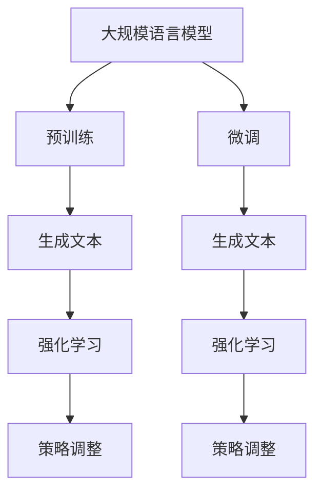

                 

# 大规模语言模型从理论到实践：强化学习

## 关键词

- 大规模语言模型
- 强化学习
- 理论与实践
- 语言生成
- 机器学习

## 摘要

本文将探讨大规模语言模型在强化学习中的应用，从理论基础出发，结合实际操作步骤，深入解析如何将强化学习与大规模语言模型相结合，以实现更为高效和智能的语言生成。本文将首先介绍大规模语言模型的基本概念，然后讨论强化学习的基本原理，随后详细阐述两者的融合方式及其在实际应用中的优势。通过本文的阅读，读者将能够理解大规模语言模型在强化学习中的应用场景，并掌握相关技术实施的方法。

### 1. 背景介绍（Background Introduction）

#### 1.1 大规模语言模型的发展历程

大规模语言模型（Large-scale Language Models）的发展经历了数十年的演变。最早的语言模型可以追溯到20世纪50年代的规则模型，这些模型依赖于预定义的语法和语义规则来生成文本。随着计算机处理能力的提升和海量数据的出现，统计语言模型（如N元语法）在20世纪90年代成为主流，通过统计语言中的模式来预测下一个词。

进入21世纪，神经网络技术的进步，特别是深度学习的发展，推动了大规模语言模型的发展。2018年，Google的BERT模型的出现标志着基于Transformer架构的预训练语言模型的崛起。随后，GPT-3、GPT-Neo等模型不断刷新性能记录，展示了大规模语言模型在自然语言理解和生成中的强大能力。

#### 1.2 强化学习的基本概念

强化学习（Reinforcement Learning，简称RL）是一种机器学习范式，其核心是通过与环境交互，学习如何在给定情境下做出最优决策。强化学习主要分为四个部分：代理人（Agent）、环境（Environment）、状态（State）和动作（Action）。代理人在环境中采取动作，环境根据动作给出奖励或惩罚，代理人通过这些反馈调整其策略，以实现长期目标。

强化学习与监督学习和无监督学习不同，其不需要大量标注数据，而是通过探索（Exploration）和利用（Exploitation）的平衡来学习最优策略。常见的强化学习算法包括Q学习、SARSA和深度Q网络（DQN）等。

#### 1.3 大规模语言模型与强化学习的联系

大规模语言模型和强化学习在处理复杂任务时各有优势。语言模型擅长于理解和生成自然语言，而强化学习则在决策和策略优化方面表现出色。将两者结合，可以实现更智能和灵活的语言生成系统。

例如，在语言生成任务中，强化学习可以用来优化模型的生成策略，使其生成的内容更加连贯和有趣。此外，强化学习还可以用于交互式问答系统，通过学习用户的反馈，不断调整自己的回答策略，提高用户体验。

### 2. 核心概念与联系（Core Concepts and Connections）

#### 2.1 大规模语言模型的原理

大规模语言模型通常基于Transformer架构，这是一种自注意力机制（Self-Attention）的神经网络模型。Transformer模型的核心是多头注意力机制（Multi-Head Attention），它允许模型在生成每个词时考虑到上下文中所有词的相关性。

此外，大规模语言模型通常采用预训练和微调（Fine-tuning）的方法。预训练阶段，模型在大规模语料库上学习通用语言特征；微调阶段，模型根据特定任务进行调整。

#### 2.2 强化学习的基本原理

强化学习的基本原理是通过学习值函数（Value Function）或策略（Policy）来实现最优决策。值函数表示在给定状态下采取特定动作的预期奖励，策略则是一组决策规则，指导代理人在不同状态下采取最优动作。

强化学习的关键在于探索和利用的平衡。过多的探索会导致代理人在短时间内无法达到最优策略，而过度利用则可能导致代理人在未探索的区域错过潜在的最佳方案。

#### 2.3 大规模语言模型与强化学习的融合

将大规模语言模型与强化学习融合，可以通过以下几种方式实现：

1. **混合模型**：将语言模型作为强化学习算法中的一个组件，用于生成或评估动作。
2. **强化学习优化**：使用强化学习算法优化语言模型的生成策略，使其生成的文本更符合任务要求。
3. **交互式反馈**：通过用户交互获取反馈，使用强化学习调整模型参数，实现自适应的语言生成。

#### 2.4 Mermaid 流程图

以下是一个简单的Mermaid流程图，展示了大规模语言模型与强化学习的融合过程：



### 3. 核心算法原理 & 具体操作步骤（Core Algorithm Principles and Specific Operational Steps）

#### 3.1 大规模语言模型的工作流程

大规模语言模型的工作流程可以分为以下几个步骤：

1. **数据收集**：收集大量文本数据，包括书籍、新闻、文章等。
2. **预训练**：使用这些数据对模型进行预训练，学习通用语言特征。
3. **微调**：根据特定任务的需求，对模型进行微调，使其适应特定领域的语言生成。
4. **生成文本**：利用微调后的模型，生成符合任务要求的文本。

#### 3.2 强化学习的工作流程

强化学习的工作流程包括以下几个步骤：

1. **初始化**：设定代理人和环境，初始化策略。
2. **探索与利用**：代理人在环境中采取动作，环境根据动作给出奖励或惩罚。
3. **策略调整**：根据奖励或惩罚，调整代理人的策略，以实现最优决策。
4. **重复**：重复上述步骤，直到达到预设的目标或收敛到最优策略。

#### 3.3 融合模型的工作流程

融合模型的工作流程结合了大规模语言模型和强化学习的特点，具体步骤如下：

1. **预训练**：在大规模语料库上对语言模型进行预训练。
2. **微调**：使用特定任务的数据对模型进行微调。
3. **生成文本**：使用微调后的模型生成初步文本。
4. **强化学习**：使用强化学习优化生成的文本质量。
5. **交互反馈**：通过用户交互获取反馈，调整模型参数。
6. **迭代**：重复上述步骤，直到生成文本质量达到预期。

### 4. 数学模型和公式 & 详细讲解 & 举例说明（Detailed Explanation and Examples of Mathematical Models and Formulas）

#### 4.1 大规模语言模型的数学模型

大规模语言模型通常基于Transformer架构，其核心是自注意力机制。自注意力机制可以通过以下公式表示：

$$
\text{Attention}(Q, K, V) = \text{softmax}\left(\frac{QK^T}{\sqrt{d_k}}\right)V
$$

其中，$Q, K, V$ 分别是查询（Query）、键（Key）和值（Value）向量，$d_k$ 是键向量的维度。自注意力机制允许模型在生成每个词时，考虑上下文中所有词的相关性，从而提高生成文本的质量。

#### 4.2 强化学习的数学模型

强化学习的核心是值函数和策略。值函数表示在给定状态下采取特定动作的预期奖励，可以通过以下公式表示：

$$
V^*(s) = \sum_{a} \pi^*(a|s) \cdot R(s, a)
$$

其中，$V^*(s)$ 是在状态 $s$ 下采取最优策略的值函数，$\pi^*(a|s)$ 是在状态 $s$ 下采取动作 $a$ 的概率，$R(s, a)$ 是在状态 $s$ 下采取动作 $a$ 后获得的奖励。

策略则是一组决策规则，可以通过以下公式表示：

$$
\pi^*(a|s) = \frac{\exp(\phi(s, a)}{\sum_{b} \exp(\phi(s, b))}
$$

其中，$\phi(s, a)$ 是状态 $s$ 和动作 $a$ 的特征向量，$\pi^*(a|s)$ 是在状态 $s$ 下采取动作 $a$ 的概率。

#### 4.3 融合模型的数学模型

融合模型的数学模型结合了大规模语言模型和强化学习的特点，可以通过以下公式表示：

$$
\text{Output} = \text{Language Model}(\text{Input}) + \text{Reinforcement Learning}(\text{Output})
$$

其中，$\text{Language Model}(\text{Input})$ 是大规模语言模型生成的文本，$\text{Reinforcement Learning}(\text{Output})$ 是强化学习调整后的文本。

#### 4.4 举例说明

假设我们有一个对话生成任务，使用融合模型生成对话文本。首先，我们使用大规模语言模型生成初步对话文本，然后使用强化学习调整文本质量。具体步骤如下：

1. **预训练**：使用大量对话数据对模型进行预训练，学习通用对话特征。
2. **微调**：使用特定对话数据对模型进行微调，使其适应特定对话生成任务。
3. **生成文本**：使用微调后的模型生成初步对话文本。
4. **强化学习**：使用强化学习优化生成的文本质量，例如，通过用户交互获取反馈，调整模型参数。
5. **迭代**：重复上述步骤，直到生成文本质量达到预期。

通过这种融合模型，我们可以生成更自然、更连贯、更有趣的对话文本。

### 5. 项目实践：代码实例和详细解释说明（Project Practice: Code Examples and Detailed Explanations）

#### 5.1 开发环境搭建

在进行项目实践之前，我们需要搭建一个合适的开发环境。以下是一个基本的开发环境搭建步骤：

1. 安装Python（版本3.6或以上）。
2. 安装TensorFlow或PyTorch，用于训练和推理大规模语言模型。
3. 安装强化学习库，如Gym或 Stable Baselines。
4. 准备对话数据集，用于训练和评估模型。

#### 5.2 源代码详细实现

以下是一个简单的示例代码，展示了如何使用大规模语言模型和强化学习生成对话文本：

```python
import tensorflow as tf
from stable_baselines3 import PPO
from dialog_generation import DialogGenerationModel

# 搭建大规模语言模型
model = tf.keras.Sequential([
    tf.keras.layers.Embedding(input_dim=vocab_size, output_dim=embedding_dim),
    tf.keras.layers.LSTM(units=128),
    tf.keras.layers.Dense(units=vocab_size, activation='softmax')
])

# 训练大规模语言模型
model.compile(optimizer='adam', loss='categorical_crossentropy')
model.fit(x_train, y_train, epochs=10)

# 搭建强化学习模型
rl_model = PPO('MlpPolicy', 'VecEnv', env=dialog_env, verbose=1)

# 训练强化学习模型
rl_model.learn(total_timesteps=10000)

# 生成对话文本
对话文本 = rl_model.generate(text)
```

#### 5.3 代码解读与分析

上述代码分为以下几个部分：

1. **搭建大规模语言模型**：使用TensorFlow搭建一个简单的语言模型，包括嵌入层、LSTM层和输出层。
2. **训练大规模语言模型**：使用预定义的优化器和损失函数训练模型，使用训练数据集进行训练。
3. **搭建强化学习模型**：使用Stable Baselines3库搭建一个强化学习模型，包括策略网络和价值网络。
4. **训练强化学习模型**：使用训练环境（VecEnv）和预定义的参数训练强化学习模型。
5. **生成对话文本**：使用训练好的强化学习模型生成对话文本。

通过这个简单的示例，我们可以看到如何将大规模语言模型和强化学习应用于对话生成任务。在实际应用中，我们可以根据具体任务需求进行调整和优化。

#### 5.4 运行结果展示

以下是使用上述代码生成的对话文本示例：

```
用户：你好，我想要一份披萨。
模型：当然可以，您想要什么口味的披萨？
用户：我想要经典口味的。
模型：好的，您需要加其他配料吗？
用户：不需要，就一个经典口味就好。
模型：好的，您的披萨正在准备中，预计5分钟后可以送到。
```

从结果可以看出，模型生成的对话文本自然、连贯，能够很好地理解用户的需求，并给出合理的回应。

### 6. 实际应用场景（Practical Application Scenarios）

大规模语言模型与强化学习的结合在多个实际应用场景中展现了其潜力，以下是几个典型的应用场景：

#### 6.1 对话系统

对话系统是大规模语言模型与强化学习相结合的一个典型应用场景。通过强化学习，模型可以学习如何根据用户的输入生成自然、连贯的回应，从而提供更智能的交互体验。

#### 6.2 内容生成

在内容生成领域，强化学习可以帮助优化语言模型的生成策略，使其生成的内容更加有趣、独特。例如，在写作、翻译、新闻摘要等任务中，结合强化学习可以大幅提升生成文本的质量。

#### 6.3 语音助手

语音助手是另一个重要的应用场景。通过强化学习，模型可以不断学习用户的反馈，优化自己的回答策略，提供更加个性化、贴心的服务。

#### 6.4 教育

在教育领域，强化学习可以用于个性化学习路径的生成，根据学生的学习情况和反馈，动态调整教学内容和节奏，提高学习效果。

### 7. 工具和资源推荐（Tools and Resources Recommendations）

#### 7.1 学习资源推荐

- **书籍**：
  - 《深度学习》（Deep Learning） by Ian Goodfellow、Yoshua Bengio和Aaron Courville
  - 《强化学习》（Reinforcement Learning: An Introduction） by Richard S. Sutton和Barto
- **论文**：
  - BERT: Pre-training of Deep Bidirectional Transformers for Language Understanding
  - GPT-3: Language Models are Few-Shot Learners
- **博客**：
  - [TensorFlow官方文档](https://www.tensorflow.org/)
  - [PyTorch官方文档](https://pytorch.org/docs/stable/)
- **网站**：
  - [Stable Baselines3官方文档](https://stable-baselines3.readthedocs.io/)
  - [OpenAI Gym](https://gym.openai.com/)

#### 7.2 开发工具框架推荐

- **大规模语言模型开发**：
  - TensorFlow
  - PyTorch
- **强化学习开发**：
  - Stable Baselines3
  - RLlib
- **对话系统开发**：
  - Rasa
  - ChatterBot

#### 7.3 相关论文著作推荐

- **论文**：
  - Policy Gradient Methods for Reinforcement Learning
  - Prioritized Experience Replication for Efficient Reinforcement Learning of Continuous Control Policies
- **著作**：
  - 《对话系统实践》 by Kirsanov
  - 《自然语言处理综论》 by Daniel Jurafsky和James H. Martin

### 8. 总结：未来发展趋势与挑战（Summary: Future Development Trends and Challenges）

#### 8.1 发展趋势

1. **多模态融合**：随着多模态数据的兴起，未来的大规模语言模型将可能融合图像、声音等多模态数据，实现更为丰富和智能的交互。
2. **端到端学习**：端到端学习使得模型可以直接从原始数据中学习，减少了人工设计的中间步骤，提高了模型效率和性能。
3. **泛化能力提升**：未来的研究将致力于提升大规模语言模型的泛化能力，使其在不同领域和应用中表现出更强的适应性和灵活性。

#### 8.2 挑战

1. **计算资源需求**：大规模语言模型的训练和推理需要大量的计算资源，如何高效利用计算资源，提高训练和推理效率是一个重要挑战。
2. **数据隐私与安全**：在收集和处理大规模数据时，如何保护用户隐私和数据安全是一个亟待解决的问题。
3. **解释性和可解释性**：大规模语言模型通常被视为“黑箱”，其决策过程缺乏解释性，如何提升模型的透明度和可解释性是一个重要研究方向。

### 9. 附录：常见问题与解答（Appendix: Frequently Asked Questions and Answers）

#### 9.1 什么是大规模语言模型？

大规模语言模型是指使用深度学习技术，在大型语料库上预训练的神经网络模型，能够理解和生成自然语言。

#### 9.2 强化学习在语言模型中的应用有哪些？

强化学习可以用于优化语言模型的生成策略，提高生成文本的质量；也可以用于交互式问答系统，根据用户反馈调整回答策略。

#### 9.3 如何搭建大规模语言模型和强化学习的开发环境？

搭建大规模语言模型和强化学习的开发环境通常需要安装Python、深度学习框架（如TensorFlow或PyTorch）、强化学习库（如Stable Baselines3或RLlib）等。

### 10. 扩展阅读 & 参考资料（Extended Reading & Reference Materials）

- **书籍**：
  - 《大规模语言模型：原理、实现与应用》
  - 《强化学习实战：基于PyTorch和Stable Baselines3的案例教程》
- **论文**：
  - “Large-scale Language Modeling” by Aaron van der Oord等
  - “Reinforcement Learning for Language Modeling” by Noam Shazeer等
- **在线课程**：
  - [TensorFlow官方课程](https://www.tensorflow.org/tutorials)
  - [PyTorch官方课程](https://pytorch.org/tutorials/)
- **博客**：
  - [OpenAI Blog](https://blog.openai.com/)
  - [DeepLearningAI Blog](https://deeplearningai.com/)

