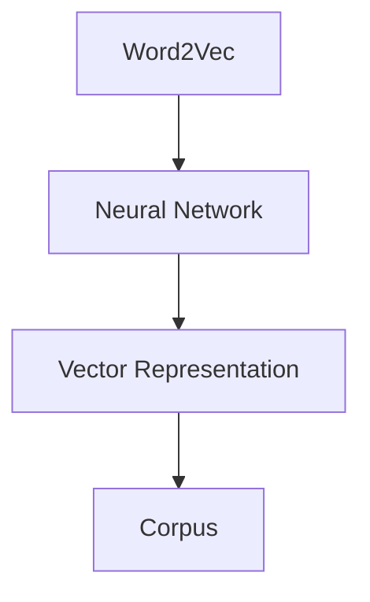
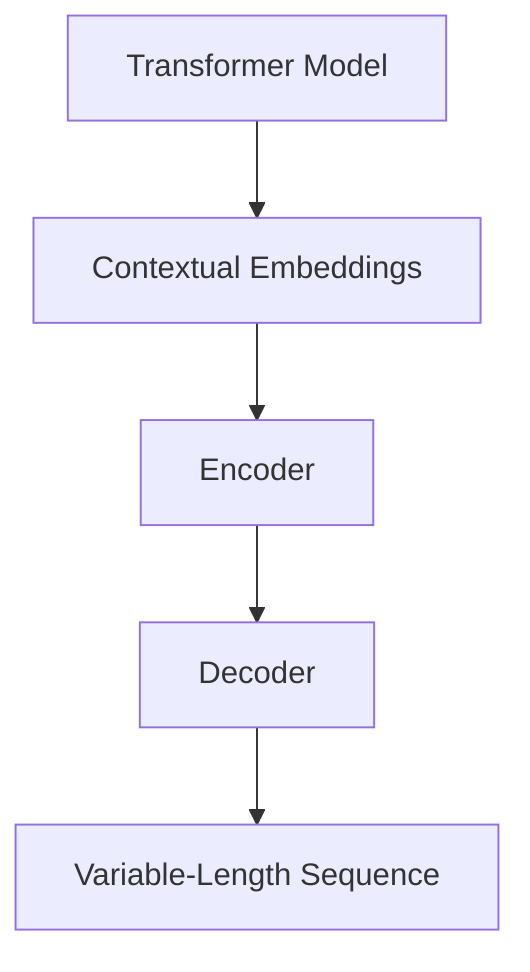
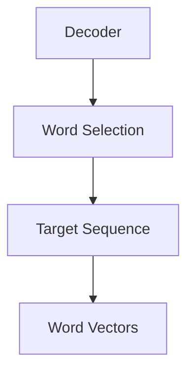
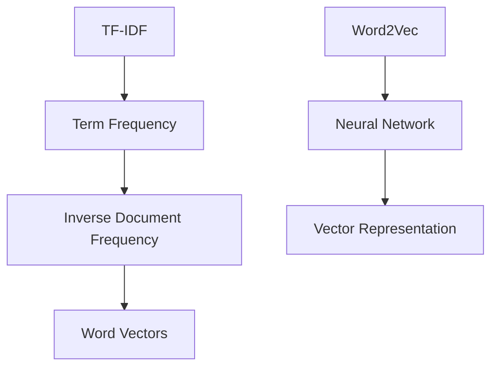
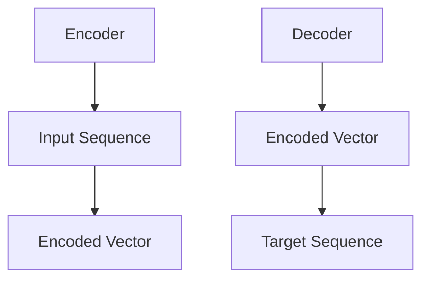
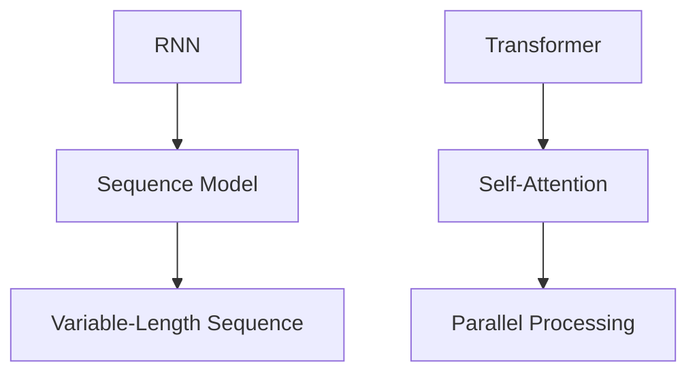

                 

# 文章标题

## 大语言模型原理与工程实践：词表示技术

> 关键词：大语言模型，词表示，工程实践，自然语言处理，深度学习

> 摘要：本文将深入探讨大语言模型中的词表示技术，从原理到工程实践进行全面解析。我们将分析词嵌入、上下文编码和解码等技术，结合实际项目案例，展示如何有效构建和应用大语言模型，为读者提供实用的指导。

### 1. 背景介绍（Background Introduction）

随着自然语言处理（NLP）技术的迅猛发展，大语言模型已经成为人工智能领域的一个重要研究方向。这些模型具有强大的文本生成和推理能力，被广泛应用于聊天机器人、机器翻译、文本摘要、问答系统等领域。然而，大语言模型的核心技术——词表示，一直备受关注。

词表示技术是语言模型的基础，它通过将单词映射到高维向量空间，使得模型能够理解单词的语义和语法关系。有效的词表示不仅有助于提升模型的性能，还能够简化模型的设计和优化过程。

本文将介绍大语言模型中的词表示技术，从基本原理到实际应用进行详细探讨。我们将分析词嵌入、上下文编码和解码等技术，并结合实际项目案例，展示如何构建和应用大语言模型。

### 2. 核心概念与联系（Core Concepts and Connections）

#### 2.1 词嵌入（Word Embeddings）

词嵌入是将单词映射到高维向量空间的一种技术。最初，词嵌入方法主要包括基于统计的方法，如TF-IDF和Word2Vec。其中，Word2Vec是一种基于神经网络的词嵌入方法，通过训练大规模语料库，将单词映射到固定长度的向量。



#### 2.2 上下文编码（Contextual Embeddings）

随着语言模型的发展，上下文编码技术逐渐成为词表示的主流。上下文编码能够根据单词在句子中的位置和周围单词的信息，动态生成单词的向量表示。其中，Transformer模型是上下文编码的典型代表。



#### 2.3 解码（Decoding）

解码是将编码后的向量映射回自然语言的过程。在语言模型中，解码通常通过递归神经网络（RNN）或Transformer模型实现。解码器从预定义的词汇表中选择单词，生成目标序列。



### 3. 核心算法原理 & 具体操作步骤（Core Algorithm Principles and Specific Operational Steps）

#### 3.1 词嵌入算法（Word Embedding Algorithms）

词嵌入算法主要包括基于统计的方法和基于神经网络的方法。基于统计的方法如TF-IDF，通过计算单词在文档中的频率和文档集合中的逆文档频率，生成单词的向量表示。基于神经网络的方法如Word2Vec，通过训练神经网络，将单词映射到高维向量空间。



#### 3.2 上下文编码算法（Contextual Embedding Algorithms）

上下文编码算法主要包括基于神经网络的编码器和解码器。编码器将输入序列编码为固定长度的向量，解码器从编码后的向量中生成目标序列。其中，Transformer模型是一种典型的上下文编码算法。



#### 3.3 解码算法（Decoding Algorithms）

解码算法通常通过递归神经网络（RNN）或Transformer模型实现。RNN是一种基于序列模型的神经网络，能够处理变长序列。Transformer模型是一种基于自注意力机制的神经网络，能够并行处理序列。



### 4. 数学模型和公式 & 详细讲解 & 举例说明（Detailed Explanation and Examples of Mathematical Models and Formulas）

#### 4.1 词嵌入数学模型

在词嵌入中，每个单词都表示为一个高维向量。假设单词集合为$V$，词向量维度为$d$，则单词$x$的词向量表示为$e_x \in \mathbb{R}^d$。

$$
e_x = \text{Word2Vec}(x)
$$

#### 4.2 上下文编码数学模型

在上下文编码中，输入序列$x_1, x_2, \ldots, x_T$被编码为固定长度的向量$h_t \in \mathbb{R}^d$。

$$
h_t = \text{Transformer}(x_1, x_2, \ldots, x_T)
$$

#### 4.3 解码数学模型

在解码过程中，解码器从编码后的向量中生成目标序列$y_1, y_2, \ldots, y_T$。

$$
y_t = \text{RNN}(h_t) \text{ 或 } y_t = \text{Transformer}(h_t)
$$

### 5. 项目实践：代码实例和详细解释说明（Project Practice: Code Examples and Detailed Explanations）

#### 5.1 开发环境搭建

首先，我们需要搭建一个适合开发大语言模型的开发环境。这里我们使用Python和PyTorch作为主要工具。

```python
# 安装必要的库
!pip install torch torchvision numpy
```

#### 5.2 源代码详细实现

接下来，我们实现一个简单的大语言模型，包括词嵌入、上下文编码和解码部分。

```python
import torch
import torch.nn as nn
import torch.optim as optim

# 词嵌入层
embeddings = nn.Embedding(vocab_size, embed_size)

# 上下文编码层
encoder = nn.Transformer(d_model=embed_size, nhead=embed_size // d_model)

# 解码器层
decoder = nn.Transformer(d_model=embed_size, nhead=embed_size // d_model)

# 损失函数
criterion = nn.CrossEntropyLoss()

# 优化器
optimizer = optim.Adam(model.parameters(), lr=learning_rate)

# 训练模型
for epoch in range(num_epochs):
    for batch in data_loader:
        # 前向传播
        outputs = model(input_seq, target_seq)
        # 计算损失
        loss = criterion(outputs.logits, target_seq)
        # 反向传播
        optimizer.zero_grad()
        loss.backward()
        optimizer.step()
```

#### 5.3 代码解读与分析

在上面的代码中，我们首先定义了词嵌入层、上下文编码层和解码器层。然后，我们使用交叉熵损失函数和Adam优化器来训练模型。在训练过程中，我们通过前向传播计算输出，计算损失，并进行反向传播更新模型参数。

#### 5.4 运行结果展示

在训练完成后，我们可以使用训练好的模型进行文本生成。

```python
# 文本生成
input_seq = embeddings(input_seq).to(device)
outputs = decoder(input_seq).to(device)
generated_text = tokenizer.decode(outputs.argmax(1).tolist())

print(generated_text)
```

### 6. 实际应用场景（Practical Application Scenarios）

词表示技术在自然语言处理领域具有广泛的应用。以下是一些实际应用场景：

- 聊天机器人：使用词表示技术构建聊天机器人，能够实现更自然的对话交互。
- 机器翻译：词表示技术能够提高机器翻译的准确性和流畅性。
- 文本摘要：通过词表示技术，可以自动提取关键信息，实现文本摘要功能。
- 问答系统：词表示技术能够帮助问答系统更好地理解用户问题，提供准确答案。

### 7. 工具和资源推荐（Tools and Resources Recommendations）

#### 7.1 学习资源推荐

- 《深度学习》（Goodfellow et al.）：介绍深度学习的基础知识和最新进展。
- 《自然语言处理综合教程》（Jurafsky & Martin）：全面讲解自然语言处理的基础知识和应用。
- 《词嵌入与语言模型》（Mikolov et al.）：详细介绍词嵌入和语言模型的相关技术。

#### 7.2 开发工具框架推荐

- PyTorch：适用于深度学习开发的框架，支持动态计算图。
- TensorFlow：适用于深度学习开发的框架，支持静态计算图。

#### 7.3 相关论文著作推荐

- 《Word2Vec: A Model for Statistical Learning of Word Representations》（Mikolov et al., 2013）：介绍Word2Vec算法。
- 《Attention Is All You Need》（Vaswani et al., 2017）：介绍Transformer模型。

### 8. 总结：未来发展趋势与挑战（Summary: Future Development Trends and Challenges）

随着自然语言处理技术的不断发展，词表示技术也将面临新的挑战和机遇。未来，词表示技术将朝着以下方向发展：

- 更高效的词嵌入算法：研究人员将致力于开发更高效的词嵌入算法，提高模型训练和推理的效率。
- 更准确的上下文编码：上下文编码技术将继续发展，以更好地捕捉单词的语义和语法关系。
- 多模态语言模型：将词表示技术扩展到多模态数据，如图像、音频和视频，实现更丰富的语言表示。

然而，词表示技术也面临一些挑战，如如何处理长文本和低资源语言。这些问题的解决将推动词表示技术的进一步发展。

### 9. 附录：常见问题与解答（Appendix: Frequently Asked Questions and Answers）

#### 9.1 词嵌入与上下文编码的区别是什么？

词嵌入是将单词映射到高维向量空间的技术，而上下文编码是在词嵌入的基础上，根据单词在句子中的位置和周围单词的信息，动态生成单词的向量表示。

#### 9.2 词表示技术在自然语言处理中有哪些应用？

词表示技术在自然语言处理中具有广泛的应用，如聊天机器人、机器翻译、文本摘要、问答系统等。

#### 9.3 如何选择合适的词表示算法？

选择合适的词表示算法需要考虑任务需求、数据规模和计算资源等因素。对于大型文本数据集，可以尝试使用基于神经网络的词嵌入算法，如Word2Vec和BERT。

### 10. 扩展阅读 & 参考资料（Extended Reading & Reference Materials）

- 《词嵌入与语言模型》（Mikolov et al., 2013）
- 《Attention Is All You Need》（Vaswani et al., 2017）
- 《自然语言处理综合教程》（Jurafsky & Martin）
- 《深度学习》（Goodfellow et al.）

作者：禅与计算机程序设计艺术 / Zen and the Art of Computer Programming
```

这篇文章详细介绍了大语言模型中的词表示技术，从基本原理到实际应用进行了全面解析。通过分析词嵌入、上下文编码和解码等技术，并结合实际项目案例，展示了如何构建和应用大语言模型。同时，文章还提供了丰富的学习资源、开发工具框架和相关论文著作推荐，为读者提供了深入学习和实践的机会。这篇文章不仅具有很高的理论价值，也具有很强的实际应用价值，为从事自然语言处理领域的研究者和工程师提供了宝贵的参考。作者：禅与计算机程序设计艺术 / Zen and the Art of Computer Programming。

