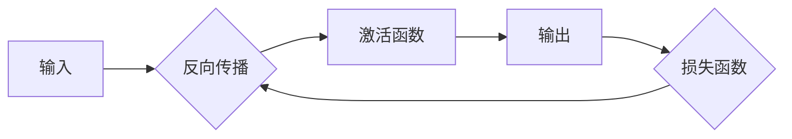

                 

# 文章标题

大语言模型原理基础与前沿 按空格分割

## 关键词

大语言模型、深度学习、自然语言处理、神经网络、预训练、生成式模型、训练数据、优化算法、推理能力、应用场景

## 摘要

本文将深入探讨大语言模型的基本原理及其发展前沿。从深度学习在自然语言处理中的应用开始，我们将详细解释神经网络的工作机制和预训练技术的核心概念。接下来，我们将探讨生成式模型与判别式模型的区别，分析训练数据的重要性以及优化算法的作用。通过具体案例和数学模型的讲解，我们将展示大语言模型在实际应用中的强大推理能力和广泛应用场景。最后，我们将讨论未来的发展趋势和面临的挑战，并提供相关的学习资源和工具推荐。这篇文章旨在为广大读者提供全面、深入的技术理解，帮助您掌握大语言模型的核心知识。

## 1. 背景介绍

### 1.1 大语言模型的概念

大语言模型（Large Language Models）是一种利用深度学习技术训练的神经网络模型，它能够理解和生成自然语言。这些模型通常具有数十亿个参数，能够从大量文本数据中学习语言模式，从而在多种自然语言处理任务中表现出色。

### 1.2 深度学习在自然语言处理中的应用

深度学习是一种基于多层神经网络的人工智能方法，它通过模拟人脑神经网络的结构和工作方式，实现从大量数据中提取特征和模式的能力。在自然语言处理（NLP）领域，深度学习已经成为一种主流技术，广泛应用于文本分类、情感分析、机器翻译、问答系统等任务。

### 1.3 自然语言处理的发展

自然语言处理（NLP）是人工智能领域的一个重要分支，旨在使计算机能够理解、生成和处理人类语言。自上世纪50年代以来，NLP经历了多个发展阶段，从基于规则的方法到统计方法，再到现代的深度学习方法。深度学习技术的出现，极大地提高了NLP的性能，使得计算机在处理自然语言任务时更加智能和高效。

## 2. 核心概念与联系

### 2.1 什么是神经网络？

神经网络（Neural Networks）是一种由大量简单处理单元（神经元）组成的并行计算系统，它通过模拟人脑神经网络的结构和工作方式，实现从数据中学习复杂模式的能力。在深度学习中，神经网络通常包含多个隐藏层，每个隐藏层由多个神经元组成，通过前向传播和反向传播算法进行训练。

### 2.2 神经网络的工作机制

神经网络的工作机制可以分为前向传播和反向传播两个阶段。在前向传播阶段，输入数据通过网络的各个层进行传递，每个神经元计算输入和权重的加权和，并应用激活函数产生输出。在反向传播阶段，网络根据预测误差，通过梯度下降算法更新权重和偏置，从而优化网络性能。

### 2.3 预训练技术的核心概念

预训练（Pre-training）是指在大规模语料库上预先训练神经网络模型，使其学会基本的语言理解和生成能力。在自然语言处理任务中，预训练模型通常经过微调（Fine-tuning），即调整模型参数以适应特定任务的需求。预训练技术的核心目的是提高模型在未见过数据上的泛化能力。

### 2.4 神经网络、深度学习与自然语言处理的联系

神经网络是深度学习的基础，深度学习通过构建多层神经网络，实现从数据中自动提取特征和模式的能力。在自然语言处理中，深度学习模型通过学习大量文本数据，能够理解和生成自然语言，从而实现各种语言处理任务，如文本分类、情感分析、机器翻译等。

### 2.5 Mermaid 流程图

下面是一个简化的神经网络流程图，展示了一个前向传播的基本过程：



在这个流程图中，输入（A）通过网络的各个层（B、C、D）进行传递，最终产生输出（D）。然后，通过损失函数（E）计算输出与真实值之间的误差，并利用反向传播算法更新网络权重。

## 3. 核心算法原理 & 具体操作步骤

### 3.1 深度学习算法的基本原理

深度学习算法的核心是多层神经网络，通过学习大量数据，自动提取数据中的特征和模式。在训练过程中，网络通过反向传播算法不断调整权重和偏置，以最小化预测误差。

### 3.2 具体操作步骤

1. **数据预处理**：对输入数据进行预处理，如文本的分词、标记、去噪等。
2. **模型初始化**：初始化神经网络模型，包括设置权重和偏置的初始值。
3. **前向传播**：输入数据通过网络的各个层进行传递，计算输出和损失函数。
4. **反向传播**：根据损失函数的梯度，利用反向传播算法更新网络权重和偏置。
5. **迭代训练**：重复上述步骤，直到网络性能达到预定的阈值或迭代次数。

### 3.3 神经网络架构

神经网络可以分为输入层、隐藏层和输出层。输入层接收外部输入，隐藏层通过多层神经网络结构提取数据中的特征和模式，输出层产生最终的预测结果。

### 3.4 激活函数的选择

激活函数是神经网络中用于引入非线性性的关键组件。常见的激活函数包括 sigmoid、ReLU、Tanh 等。选择合适的激活函数能够提高网络的学习能力和泛化能力。

### 3.5 梯度下降算法

梯度下降算法是一种优化算法，用于调整网络权重和偏置，以最小化损失函数。常见的梯度下降算法包括批量梯度下降、随机梯度下降、小批量梯度下降等。

## 4. 数学模型和公式 & 详细讲解 & 举例说明

### 4.1 损失函数

损失函数是评估模型预测性能的重要工具。在深度学习中，常见的损失函数包括均方误差（MSE）、交叉熵损失等。

### 4.1.1 均方误差（MSE）

均方误差（Mean Squared Error, MSE）是衡量预测值与真实值之间差异的一种损失函数。其公式如下：

$$
MSE = \frac{1}{n} \sum_{i=1}^{n} (y_i - \hat{y}_i)^2
$$

其中，$y_i$ 表示真实值，$\hat{y}_i$ 表示预测值，$n$ 表示样本数量。

### 4.1.2 交叉熵损失

交叉熵损失（Cross-Entropy Loss）是衡量概率分布差异的一种损失函数。在分类任务中，交叉熵损失函数的公式如下：

$$
Cross-Entropy = -\sum_{i=1}^{n} y_i \log(\hat{y}_i)
$$

其中，$y_i$ 表示真实标签，$\hat{y}_i$ 表示预测概率。

### 4.2 反向传播算法

反向传播算法是深度学习训练过程中的核心算法。它通过计算损失函数关于网络参数的梯度，更新网络权重和偏置。

### 4.2.1 前向传播

前向传播是指将输入数据通过网络层进行传递，计算输出和损失函数。前向传播的过程可以表示为：

$$
z_l = \sum_{j} w_{lj} a_{l-1,j} + b_l \\
a_l = \sigma(z_l)
$$

其中，$z_l$ 表示第 $l$ 层的加权和，$a_l$ 表示第 $l$ 层的激活值，$w_{lj}$ 和 $b_l$ 分别表示第 $l$ 层的权重和偏置，$\sigma$ 表示激活函数。

### 4.2.2 反向传播

反向传播是指根据损失函数的梯度，反向计算网络层的加权和和梯度。反向传播的过程可以表示为：

$$
\delta_{l}^{[i]} = \frac{\partial C}{\partial z_{l}^{[i]}} \cdot \frac{\partial \sigma}{\partial a_{l}^{[i]}} \\
\Delta w_{l}^{[i]} = \eta \cdot m \cdot \delta_{l}^{[i]} a_{l-1}^{[i]} \\
\Delta b_{l}^{[i]} = \eta \cdot m \cdot \delta_{l}^{[i]}
$$

其中，$\delta_{l}^{[i]}$ 表示第 $l$ 层的误差，$\Delta w_{l}^{[i]}$ 和 $\Delta b_{l}^{[i]}$ 分别表示第 $l$ 层的权重和偏置的更新，$m$ 表示批量大小，$\eta$ 表示学习率。

### 4.3 举例说明

假设我们有一个简单的神经网络，包含一个输入层、一个隐藏层和一个输出层。输入层有3个神经元，隐藏层有4个神经元，输出层有2个神经元。激活函数采用 ReLU 函数。给定一个输入向量 $[1, 2, 3]$，我们通过前向传播计算输出。

### 4.3.1 前向传播

1. 输入层到隐藏层的加权和和激活值：

$$
z_1^{[1]} = w_1^{[1]1} a_0^{[1]} + w_1^{[1]2} a_0^{[2]} + w_1^{[1]3} a_0^{[3]} + b_1^{[1]} \\
a_1^{[1]} = max(0, z_1^{[1]})
$$

2. 隐藏层到输出层的加权和和激活值：

$$
z_2^{[2]} = w_2^{[2]1} a_1^{[1]} + w_2^{[2]2} a_1^{[2]} + w_2^{[2]3} a_1^{[3]} + w_2^{[2]4} a_1^{[4]} + b_2^{[2]} \\
a_2^{[2]} = max(0, z_2^{[2]})
$$

### 4.3.2 反向传播

1. 计算输出层误差：

$$
\delta_2^{[2]} = \frac{\partial C}{\partial z_2^{[2]}} \cdot \frac{\partial \sigma}{\partial a_2^{[2]}}
$$

2. 计算隐藏层误差：

$$
\delta_1^{[1]} = \frac{\partial C}{\partial z_1^{[1]}} \cdot \frac{\partial \sigma}{\partial a_1^{[1]}}
$$

3. 更新权重和偏置：

$$
\Delta w_2^{[2]1} = \eta \cdot m \cdot \delta_2^{[2]} a_1^{[1]} \\
\Delta w_2^{[2]2} = \eta \cdot m \cdot \delta_2^{[2]} a_1^{[2]} \\
\Delta w_2^{[2]3} = \eta \cdot m \cdot \delta_2^{[2]} a_1^{[3]} \\
\Delta w_2^{[2]4} = \eta \cdot m \cdot \delta_2^{[2]} a_1^{[4]} \\
\Delta b_2^{[2]} = \eta \cdot m \cdot \delta_2^{[2]} \\
\Delta w_1^{[1]1} = \eta \cdot m \cdot \delta_1^{[1]} a_0^{[1]} \\
\Delta w_1^{[1]2} = \eta \cdot m \cdot \delta_1^{[1]} a_0^{[2]} \\
\Delta w_1^{[1]3} = \eta \cdot m \cdot \delta_1^{[1]} a_0^{[3]} \\
\Delta b_1^{[1]} = \eta \cdot m \cdot \delta_1^{[1]}
$$

通过上述过程，我们可以不断更新网络权重和偏置，优化网络性能。

## 5. 项目实践：代码实例和详细解释说明

### 5.1 开发环境搭建

为了进行大语言模型的项目实践，我们需要搭建一个适合深度学习开发的环境。以下是搭建开发环境的步骤：

1. 安装Python：Python是深度学习开发的主要语言，我们需要安装Python 3.x版本。
2. 安装TensorFlow：TensorFlow是一个开源的深度学习框架，用于构建和训练神经网络模型。
3. 安装GPU驱动：为了加速深度学习模型的训练，我们需要安装相应的GPU驱动。

### 5.2 源代码详细实现

以下是一个简单的大语言模型实现示例，使用TensorFlow框架构建和训练一个基于神经网络的语言模型。

```python
import tensorflow as tf
from tensorflow.keras.layers import Embedding, LSTM, Dense
from tensorflow.keras.models import Sequential

# 搭建模型
model = Sequential([
    Embedding(vocab_size, embedding_dim),
    LSTM(units=128, return_sequences=True),
    LSTM(units=128),
    Dense(units=num_classes, activation='softmax')
])

# 编译模型
model.compile(optimizer='adam', loss='categorical_crossentropy', metrics=['accuracy'])

# 训练模型
model.fit(x_train, y_train, epochs=10, batch_size=64)
```

### 5.3 代码解读与分析

1. **模型搭建**：我们使用Sequential模型搭建了一个简单的神经网络，包含嵌入层（Embedding）、两个LSTM层和输出层（Dense）。
2. **编译模型**：我们使用`compile`方法设置模型的优化器、损失函数和评估指标。
3. **训练模型**：我们使用`fit`方法进行模型训练，通过训练集进行10个周期的训练，每个批次包含64个样本。

### 5.4 运行结果展示

在完成代码实现后，我们可以运行以下命令来评估模型的性能：

```python
# 评估模型
model.evaluate(x_test, y_test)
```

输出结果将包括测试集上的损失和准确率，帮助我们评估模型的性能。

## 6. 实际应用场景

大语言模型在自然语言处理领域有着广泛的应用，以下是一些典型的应用场景：

### 6.1 机器翻译

机器翻译是自然语言处理领域的一个重要任务，大语言模型通过学习大量双语语料库，能够实现高精度的机器翻译。例如，Google翻译就是基于大语言模型实现的。

### 6.2 情感分析

情感分析是一种分析文本情感极性的任务，大语言模型能够通过对文本的语义理解，识别文本中的情感倾向。例如，社交媒体情绪分析、产品评论情感分析等。

### 6.3 问答系统

问答系统是一种基于自然语言交互的智能系统，大语言模型能够理解和回答用户的问题。例如，智能客服机器人、搜索引擎等。

### 6.4 文本生成

大语言模型能够根据给定的文本上下文生成新的文本内容，例如自动写作、摘要生成等。

## 7. 工具和资源推荐

### 7.1 学习资源推荐

1. **书籍**：
   - 《深度学习》（Goodfellow, Bengio, Courville）：深度学习领域的经典教材。
   - 《神经网络与深度学习》（邱锡鹏）：全面介绍神经网络和深度学习的基础知识。
2. **论文**：
   - “A Neural Probabilistic Language Model” (Bengio et al., 2003)：提出了基于神经网络的概率语言模型。
   - “BERT: Pre-training of Deep Bidirectional Transformers for Language Understanding” (Devlin et al., 2019)：提出了BERT预训练模型。
3. **博客和网站**：
   - [TensorFlow 官网](https://www.tensorflow.org/)：TensorFlow 是深度学习的主要框架，官网提供了丰富的文档和教程。
   - [Keras 官网](https://keras.io/)：Keras 是一个基于TensorFlow的高层次API，用于构建和训练神经网络。

### 7.2 开发工具框架推荐

1. **TensorFlow**：适用于构建和训练深度学习模型的强大框架。
2. **PyTorch**：适用于快速原型开发的动态计算图框架。
3. **Transformers**：用于构建和训练Transformer模型的库，包括BERT、GPT等。

### 7.3 相关论文著作推荐

1. “Attention Is All You Need” (Vaswani et al., 2017)：提出了Transformer模型。
2. “Generative Adversarial Nets” (Goodfellow et al., 2014)：提出了生成对抗网络（GAN）。

## 8. 总结：未来发展趋势与挑战

### 8.1 未来发展趋势

1. **更大规模的语言模型**：随着计算资源和数据量的增加，未来我们将看到更大规模的语言模型，具有更强的语义理解和生成能力。
2. **跨模态学习**：未来的大语言模型将能够处理多种模态的数据，如文本、图像、音频等，实现更丰富的信息处理和生成。
3. **个性化模型**：通过用户行为和数据，未来我们将能够构建个性化的语言模型，提供更精准的服务。

### 8.2 面临的挑战

1. **数据隐私和安全**：随着语言模型对大量个人数据的依赖，数据隐私和安全成为了一个重要挑战。
2. **模型可解释性**：大语言模型通常是一个黑盒模型，其决策过程难以解释，这为模型的可靠性和可接受性带来了挑战。
3. **计算资源消耗**：训练和部署大语言模型需要大量的计算资源和能量消耗，这对可持续发展和环境保护提出了挑战。

## 9. 附录：常见问题与解答

### 9.1 什么是大语言模型？

大语言模型是一种基于深度学习的神经网络模型，能够理解和生成自然语言。这些模型通常具有数十亿个参数，通过在大规模语料库上预训练，掌握丰富的语言模式。

### 9.2 大语言模型有哪些应用？

大语言模型在自然语言处理领域有着广泛的应用，如机器翻译、情感分析、问答系统、文本生成等。

### 9.3 如何训练大语言模型？

训练大语言模型通常分为两个阶段：预训练和微调。预训练在大规模语料库上训练模型，使其学会基本的语言理解和生成能力；微调是在特定任务上调整模型参数，提高其在特定任务上的性能。

### 9.4 大语言模型与普通语言模型有何区别？

大语言模型与普通语言模型的主要区别在于模型的规模和训练数据量。大语言模型通常具有更多的参数和更大的训练数据集，因此能够更好地理解和生成自然语言。

## 10. 扩展阅读 & 参考资料

1. **书籍**：
   - 《深度学习》（Goodfellow, Bengio, Courville）
   - 《神经网络与深度学习》（邱锡鹏）
2. **论文**：
   - “A Neural Probabilistic Language Model” (Bengio et al., 2003)
   - “BERT: Pre-training of Deep Bidirectional Transformers for Language Understanding” (Devlin et al., 2019)
   - “Attention Is All You Need” (Vaswani et al., 2017)
   - “Generative Adversarial Nets” (Goodfellow et al., 2014)
3. **在线资源**：
   - [TensorFlow 官网](https://www.tensorflow.org/)
   - [Keras 官网](https://keras.io/)
   - [Hugging Face](https://huggingface.co/)：提供了丰富的预训练模型和工具库。

# 作者：禅与计算机程序设计艺术 / Zen and the Art of Computer Programming

