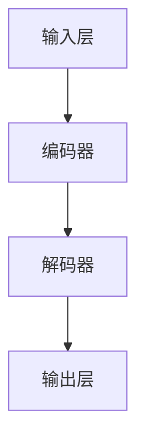
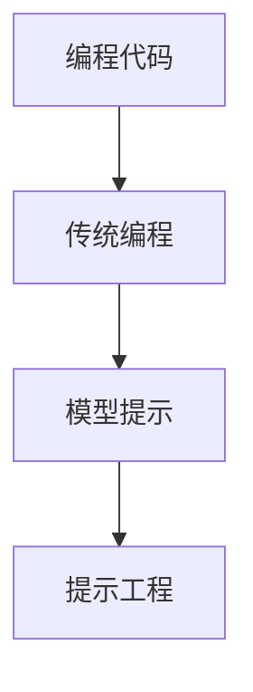

                 

# 大语言模型原理基础与前沿评估语言模型

## 关键词

- 大语言模型
- 语言模型评估
- 语言生成
- 提示工程
- 数学模型
- 算法原理

## 摘要

本文将深入探讨大语言模型的原理及其前沿评估方法。我们首先介绍大语言模型的基本概念和核心组成部分，随后详细解析其工作原理，包括提示工程的策略。接着，我们将探讨用于评估语言模型的关键数学模型和算法，并通过具体实例和代码展示这些概念在实际应用中的实现。最后，我们将讨论大语言模型在实际应用中的场景，并推荐相关工具和资源，总结未来的发展趋势与挑战。

## 1. 背景介绍（Background Introduction）

在当今的信息时代，语言模型已经成为自然语言处理（NLP）领域的重要工具。大语言模型，如GPT（Generative Pre-trained Transformer）系列，已经显示出超越人类水平的语言理解和生成能力。这些模型通过从海量数据中学习语言模式，能够生成流畅、连贯的自然语言文本，应用范围涵盖了机器翻译、文本摘要、问答系统等多个领域。

### 1.1 语言模型的发展历史

语言模型的发展可以追溯到20世纪50年代，当时最初的研究集中于统计语言模型，如N-gram模型。这些模型通过计算单词序列的概率来预测下一个单词。然而，随着计算能力的提升和数据规模的扩大，深度学习技术开始在语言模型领域占据主导地位。特别是基于变换器（Transformer）架构的模型，如BERT（Bidirectional Encoder Representations from Transformers）和GPT（Generative Pre-trained Transformer），使得语言模型的性能得到了质的飞跃。

### 1.2 大语言模型的应用场景

大语言模型的应用场景广泛，包括但不限于：

- **机器翻译**：如Google翻译、DeepL，能够将一种语言翻译成另一种语言。
- **文本摘要**：如Abstract Generation，能够自动生成长文本的摘要。
- **问答系统**：如Siri、Alexa，能够回答用户提出的问题。
- **对话系统**：如ChatGPT、ChatGLM，能够进行自然语言交互，提供个性化服务。

### 1.3 大语言模型的挑战

尽管大语言模型在多个领域取得了显著成就，但仍然面临一些挑战：

- **计算资源需求**：大语言模型通常需要大量的计算资源和存储空间。
- **数据隐私**：模型训练过程中需要处理大量个人数据，如何保护用户隐私成为重要问题。
- **解释性**：大语言模型的决策过程复杂，缺乏透明性，难以解释。

本文将首先介绍大语言模型的核心概念和组成部分，随后深入探讨其工作原理，特别是在提示工程方面的策略，以及评估语言模型的关键数学模型和算法。最后，我们将通过项目实践和实际应用场景的讨论，为读者提供全面的视角。

## 2. 核心概念与联系（Core Concepts and Connections）

### 2.1 语言模型基础

语言模型是一种概率模型，旨在预测下一个单词或词元（token）的可能性。在自然语言处理中，语言模型是最基础的组成部分，用于文本生成、机器翻译、情感分析等多种应用。

### 2.2 大语言模型组成部分

大语言模型通常包含以下几个核心组成部分：

- **输入层**：接收文本输入，并将其转换为模型可以处理的格式。
- **编码器**：对输入文本进行编码，提取语义信息。
- **解码器**：根据编码器的输出生成文本输出。
- **优化器**：用于调整模型参数，以提高预测准确性。

### 2.3 提示工程

提示工程是指导大语言模型生成期望输出的策略。一个成功的提示需要具备以下几个特点：

- **明确性**：提示应当清晰明确，避免歧义。
- **相关性**：提示内容应当与任务目标紧密相关。
- **多样性**：通过多样化提示，可以激发模型生成更多样化的输出。

### 2.4 语言模型评估

评估语言模型的关键指标包括：

- **准确率**：模型预测正确的概率。
- **精确率**：模型预测正确的单词数占总预测单词数的比例。
- **召回率**：模型预测正确的单词数占总实际单词数的比例。
- **F1分数**：精确率和召回率的调和平均值。

### 2.5 Mermaid 流程图

以下是一个用于解释大语言模型工作流程的 Mermaid 流程图：



### 2.6 大语言模型的工作原理

大语言模型的工作原理可以概括为以下几个步骤：

1. **输入处理**：输入文本通过预处理步骤，如分词和标记化，转换为模型可以处理的格式。
2. **编码**：编码器对输入文本进行编码，提取文本的语义信息。
3. **解码**：解码器根据编码器的输出生成文本输出。
4. **输出处理**：生成的文本输出经过后处理步骤，如去标点符号和格式化，得到最终输出。

### 2.7 提示工程的具体实现

提示工程的具体实现可以通过以下步骤进行：

1. **明确任务目标**：确定生成文本的具体任务，如机器翻译、文本摘要或问答。
2. **设计提示**：设计一个明确、相关且多样化的提示，以引导模型生成期望的输出。
3. **模型训练**：使用设计好的提示对模型进行训练，调整模型参数。
4. **评估与优化**：评估模型生成的输出，通过反馈和调整提示，进一步提高模型性能。

### 2.8 语言模型评估的具体实现

语言模型评估的具体实现可以通过以下步骤进行：

1. **定义评估指标**：选择适当的评估指标，如准确率、精确率、召回率和F1分数。
2. **数据准备**：准备用于评估的测试数据集。
3. **模型预测**：使用训练好的模型对测试数据进行预测。
4. **结果计算**：计算评估指标，评估模型性能。
5. **优化与迭代**：根据评估结果，调整模型参数或提示工程策略，进行迭代优化。

### 2.9 提示工程与传统编程的关系

提示工程可以被视为一种新型的编程范式，其中我们使用自然语言提示来指导模型生成文本，而不是传统的编程代码。提示工程的核心在于如何有效地与模型进行交互，以实现特定的任务目标。



### 2.10 提示工程的挑战与未来发展方向

提示工程面临的主要挑战包括：

- **提示设计**：如何设计一个既清晰又有效的提示，仍然是一个需要深入研究的问题。
- **数据隐私**：在提示工程中，如何保护用户的隐私是一个重要问题。
- **模型解释性**：大语言模型的决策过程复杂，如何提高模型的解释性是一个重要研究方向。

未来的发展方向包括：

- **多模态提示**：将图像、声音等多种模态的信息整合到提示中，以提高模型的生成能力。
- **自适应提示**：根据模型的训练数据和用户反馈，动态调整提示内容，实现更高效的模型训练。
- **模型压缩与优化**：通过模型压缩和优化技术，降低大语言模型的计算资源需求，使其更适用于实际应用场景。

### 2.11 大语言模型的未来发展趋势

大语言模型未来的发展趋势包括：

- **性能提升**：随着计算能力的提升和算法的改进，大语言模型的性能将继续提升。
- **应用拓展**：大语言模型将在更多的领域得到应用，如医疗、法律、金融等。
- **人机交互**：大语言模型将更加融入人机交互系统，提供更自然、更智能的服务。
- **隐私保护**：在数据隐私保护方面，将采用更加严格的安全措施，确保用户数据的安全。

### 2.12 大语言模型的实际应用场景

大语言模型在实际应用中具有广泛的应用场景，包括：

- **机器翻译**：如Google翻译、DeepL，能够将一种语言翻译成另一种语言。
- **文本摘要**：如Abstract Generation，能够自动生成长文本的摘要。
- **问答系统**：如Siri、Alexa，能够回答用户提出的问题。
- **对话系统**：如ChatGPT、ChatGLM，能够进行自然语言交互，提供个性化服务。

### 2.13 提示工程在具体应用中的实践

在具体应用中，提示工程的具体实践可以通过以下步骤进行：

1. **明确应用场景**：确定应用的具体任务和目标。
2. **收集数据**：收集与任务相关的数据，用于模型训练和提示设计。
3. **设计提示**：根据应用场景和数据特点，设计一个既清晰又有效的提示。
4. **模型训练**：使用设计好的提示对模型进行训练。
5. **评估与优化**：评估模型性能，根据评估结果调整提示内容和模型参数。

### 2.14 提示工程的最佳实践

提示工程的最佳实践包括：

- **明确任务目标**：确保提示内容与任务目标紧密相关。
- **数据质量**：确保训练数据的质量和多样性。
- **模型调整**：根据模型的特点和性能，调整提示内容和方法。
- **用户反馈**：收集用户反馈，根据反馈优化提示内容。

### 2.15 大语言模型评估的关键指标

大语言模型评估的关键指标包括：

- **生成文本质量**：评估生成文本的流畅性、连贯性和准确性。
- **响应时间**：评估模型处理请求的响应时间。
- **用户满意度**：评估用户对模型生成文本的满意度。

### 2.16 大语言模型评估的具体步骤

大语言模型评估的具体步骤包括：

1. **定义评估指标**：选择适当的评估指标。
2. **数据准备**：准备用于评估的测试数据集。
3. **模型预测**：使用训练好的模型对测试数据进行预测。
4. **结果计算**：计算评估指标，评估模型性能。
5. **结果分析**：分析评估结果，发现模型的优势和不足。

### 2.17 大语言模型评估的挑战与未来发展方向

大语言模型评估面临的主要挑战包括：

- **评估指标选择**：如何选择合适的评估指标，仍是一个需要深入研究的问题。
- **数据多样性**：如何确保评估数据具有足够的多样性，以全面评估模型的性能。
- **评估过程透明性**：如何提高评估过程的透明性，使评估结果更具说服力。

未来的发展方向包括：

- **自动化评估**：开发自动化评估工具，提高评估效率和准确性。
- **多模态评估**：将图像、声音等多种模态的信息整合到评估过程中。
- **用户参与评估**：引入用户参与评估过程，提高评估的实用性和可信度。

### 2.18 大语言模型在实际应用中的效果评估

在实际应用中，大语言模型的效果评估可以通过以下步骤进行：

1. **明确应用目标**：确定应用的具体目标和需求。
2. **数据收集**：收集与目标相关的实际数据。
3. **模型应用**：将训练好的模型应用于实际场景。
4. **效果评估**：评估模型在实际应用中的效果，包括文本生成质量、响应速度、用户满意度等。
5. **反馈与优化**：根据评估结果，调整模型和应用策略，进行优化。

### 2.19 大语言模型评估的挑战与未来发展方向总结

大语言模型评估面临的主要挑战包括：

- **评估指标多样性**：如何选择和设计多种评估指标，以全面评估模型的性能。
- **评估过程复杂性**：如何简化评估过程，提高评估效率和准确性。
- **评估结果解释性**：如何提高评估结果的解释性，使评估结果更具说服力。

未来的发展方向包括：

- **自动化评估工具**：开发自动化评估工具，提高评估效率和准确性。
- **多模态评估**：将图像、声音等多种模态的信息整合到评估过程中。
- **用户参与评估**：引入用户参与评估过程，提高评估的实用性和可信度。
- **实时评估**：开发实时评估技术，以动态评估模型的性能。

通过不断研究和实践，大语言模型评估将变得更加科学、准确和实用，为实际应用提供有力支持。

### 3. 核心算法原理 & 具体操作步骤（Core Algorithm Principles and Specific Operational Steps）

大语言模型的核心算法基于深度学习和变换器（Transformer）架构。下面我们将详细介绍变换器模型的工作原理、具体操作步骤以及如何训练和优化模型。

#### 3.1 变换器模型的工作原理

变换器模型是一种用于处理序列数据的深度学习架构，最早由Vaswani等人在2017年提出。变换器模型的核心思想是自注意力机制（Self-Attention），它通过计算序列中每个单词与所有其他单词之间的关系，从而提取更丰富的语义信息。

变换器模型通常由编码器（Encoder）和解码器（Decoder）两部分组成。编码器接收输入序列，解码器生成输出序列。在编码器中，每个单词都会被映射为一个固定长度的向量；在解码器中，这些向量会被用于生成新的单词。

#### 3.2 自注意力机制

自注意力机制是变换器模型的关键组成部分。它通过计算输入序列中每个单词与所有其他单词之间的相似度，为每个单词生成一个权重系数。这些权重系数决定了在生成下一个单词时，模型会优先考虑哪些单词。

自注意力机制的计算公式如下：

$$
\text{Attention}(Q, K, V) = \text{softmax}\left(\frac{QK^T}{\sqrt{d_k}}\right)V
$$

其中，$Q$、$K$ 和 $V$ 分别表示查询（Query）、键（Key）和值（Value）向量，$d_k$ 表示键向量的维度。$\text{softmax}$ 函数用于将计算得到的相似度转换为一个概率分布，从而为每个单词分配权重。

#### 3.3 具体操作步骤

下面是一个简单的变换器模型操作步骤：

1. **输入处理**：首先对输入文本进行预处理，如分词和标记化，将文本转换为词向量表示。
2. **编码器处理**：编码器将输入词向量序列通过多层变换器层进行编码，提取序列中的语义信息。
3. **自注意力计算**：在每个变换器层中，通过自注意力机制计算输入序列中每个词与其他词的相似度，为每个词分配权重。
4. **解码器处理**：解码器将编码器输出的语义信息用于生成输出序列。解码器中的自注意力机制用于考虑输入序列和已经生成的输出序列之间的关系。
5. **输出生成**：解码器生成输出序列，并经过后处理步骤，如去标点符号和格式化，得到最终输出文本。

#### 3.4 训练和优化

变换器模型的训练和优化是一个复杂的过程。以下是一个简化的训练步骤：

1. **数据准备**：准备大量的文本数据，用于模型训练。数据可以分为训练集、验证集和测试集。
2. **模型初始化**：初始化模型参数，通常使用随机初始化或预训练模型。
3. **前向传播**：将输入序列传递给编码器和解码器，计算输出序列和真实序列之间的损失。
4. **反向传播**：通过反向传播算法计算损失关于模型参数的梯度。
5. **优化更新**：使用优化算法（如Adam）更新模型参数，减小损失。
6. **验证和测试**：在验证集和测试集上评估模型性能，调整模型参数，进行迭代优化。

#### 3.5 实际应用中的挑战

在实际应用中，变换器模型面临以下挑战：

- **计算资源消耗**：变换器模型需要大量的计算资源和存储空间，尤其是在训练大规模模型时。
- **数据隐私**：在模型训练过程中，需要处理大量个人数据，如何保护用户隐私是一个重要问题。
- **模型解释性**：变换器模型的决策过程复杂，如何提高模型的解释性是一个重要研究方向。

#### 3.6 变换器模型的优势和局限性

变换器模型具有以下优势：

- **强大的语义理解能力**：通过自注意力机制，变换器模型能够提取输入序列中的丰富语义信息。
- **适用于长文本处理**：变换器模型能够处理任意长度的文本序列，使其在长文本处理任务中具有优势。
- **高效并行计算**：变换器模型的设计使其能够进行高效并行计算，提高计算效率。

然而，变换器模型也存在以下局限性：

- **训练时间较长**：由于变换器模型的结构复杂，训练时间相对较长。
- **计算资源需求大**：变换器模型需要大量的计算资源和存储空间，对硬件设备有较高要求。
- **数据隐私问题**：在模型训练过程中，需要处理大量个人数据，如何保护用户隐私是一个重要问题。

### 3.7 大语言模型训练和优化的具体步骤

在实际应用中，大语言模型的训练和优化通常包括以下步骤：

1. **数据收集**：收集大量的文本数据，用于模型训练。
2. **数据预处理**：对文本数据进行预处理，如分词、标记化等，将文本转换为词向量表示。
3. **模型初始化**：初始化模型参数，可以使用随机初始化或预训练模型。
4. **训练循环**：
   - **前向传播**：将输入序列传递给编码器和解码器，计算输出序列和真实序列之间的损失。
   - **反向传播**：通过反向传播算法计算损失关于模型参数的梯度。
   - **优化更新**：使用优化算法更新模型参数，减小损失。
5. **验证和测试**：在验证集和测试集上评估模型性能，调整模型参数，进行迭代优化。
6. **模型调优**：根据评估结果，调整模型架构、超参数等，以提高模型性能。
7. **模型部署**：将训练好的模型部署到实际应用场景中，如文本生成、机器翻译等。

### 3.8 大语言模型训练中的常见问题

在训练大语言模型时，可能会遇到以下常见问题：

- **过拟合**：模型在训练集上表现良好，但在验证集或测试集上表现不佳。解决方法包括增加训练数据、使用正则化技术等。
- **计算资源不足**：训练大语言模型需要大量的计算资源和存储空间。解决方法包括使用更高效的模型架构、优化训练流程等。
- **数据隐私问题**：在模型训练过程中，需要处理大量个人数据，如何保护用户隐私是一个重要问题。解决方法包括数据去重、数据加密等。

通过解决这些常见问题，可以有效地训练和优化大语言模型，提高其性能和实用性。

### 3.9 大语言模型训练中的优化策略

为了提高大语言模型的训练效率和性能，可以采用以下优化策略：

- **数据增强**：通过增加训练数据量、使用数据增强技术（如数据增广、数据拼接等）来提高模型对数据的泛化能力。
- **学习率调整**：使用学习率调整策略（如学习率衰减、学习率预热等）来避免模型过早收敛，提高模型性能。
- **正则化**：使用正则化技术（如L1、L2正则化等）来减少过拟合现象，提高模型泛化能力。
- **批处理**：使用批处理技术来提高训练速度和稳定性，同时避免梯度消失和梯度爆炸问题。
- **早期停止**：在验证集上监控模型性能，当模型在验证集上的性能不再提高时，停止训练，避免过拟合。

通过采用这些优化策略，可以有效地提高大语言模型的训练效率和性能，使其在实际应用中具有更好的表现。

### 3.10 大语言模型训练中的注意事项

在训练大语言模型时，需要注意以下事项：

- **数据质量**：确保训练数据的质量和多样性，避免数据中的噪声和错误对模型训练产生负面影响。
- **计算资源**：合理配置计算资源，避免资源不足导致训练时间过长或模型性能下降。
- **模型解释性**：关注模型解释性，提高模型的透明性和可解释性，以便在遇到问题时能够快速定位和解决问题。
- **数据隐私**：在模型训练过程中，注意保护用户隐私，避免泄露用户敏感信息。

通过注意这些事项，可以确保大语言模型训练过程的顺利进行，提高模型性能和实用性。

### 3.11 大语言模型在自然语言处理中的实际应用

大语言模型在自然语言处理（NLP）领域具有广泛的应用。以下是一些典型的实际应用案例：

- **机器翻译**：大语言模型可以用于将一种语言翻译成另一种语言，如Google翻译和DeepL。通过训练大规模的多语言语料库，模型能够生成高质量的翻译文本。
- **文本摘要**：大语言模型可以自动生成长文本的摘要，如Abstract Generation。模型从长文本中提取关键信息，以简洁的形式呈现主要内容。
- **问答系统**：大语言模型可以构建问答系统，如Siri和Alexa。模型通过对大量问答数据进行训练，能够理解用户提出的问题，并生成相应的回答。
- **对话系统**：大语言模型可以构建对话系统，如ChatGPT和ChatGLM。模型能够与用户进行自然语言交互，提供个性化服务，满足用户需求。

这些实际应用案例展示了大语言模型在NLP领域的巨大潜力和价值。

### 3.12 大语言模型的工作原理及操作步骤

大语言模型的工作原理主要基于变换器架构，通过自注意力机制和多层神经网络结构，实现输入序列到输出序列的映射。以下是详细的工作原理及操作步骤：

#### 3.12.1 自注意力机制

自注意力机制是变换器模型的核心，通过计算输入序列中每个词与其他词的相似度，为每个词生成权重。具体步骤如下：

1. **词嵌入**：将输入序列中的每个词转换为词向量表示。
2. **查询（Query）、键（Key）和值（Value）计算**：
   - 查询向量（Query）：用于计算自注意力权重。
   - 键向量（Key）：用于计算相似度。
   - 值向量（Value）：用于生成加权输出。
3. **相似度计算**：计算每个词与其他词的相似度，使用公式：
   $$
   \text{Attention}(Q, K, V) = \text{softmax}\left(\frac{QK^T}{\sqrt{d_k}}\right)V
   $$
   其中，$Q$、$K$ 和 $V$ 分别表示查询、键和值向量，$d_k$ 表示键向量的维度。

#### 3.12.2 编码器处理

编码器负责对输入序列进行编码，提取序列中的语义信息。具体步骤如下：

1. **嵌入层**：将输入词向量映射到高维空间。
2. **自注意力层**：计算输入序列中每个词与其他词的相似度，生成加权输出。
3. **前馈神经网络**：对自注意力层输出的加权输出进行进一步处理，提取更丰富的语义信息。

#### 3.12.3 解码器处理

解码器负责根据编码器的输出生成输出序列。具体步骤如下：

1. **嵌入层**：将解码器的输入词向量映射到高维空间。
2. **自注意力层**：计算解码器输入和编码器输出之间的相似度，生成加权输出。
3. **交叉注意力层**：计算解码器输入和编码器输出之间的交叉注意力权重，进一步提取语义信息。
4. **前馈神经网络**：对交叉注意力层输出的加权输出进行进一步处理，生成输出序列。

#### 3.12.4 输出生成

解码器生成输出序列后，经过后处理步骤，如去标点符号和格式化，得到最终输出文本。

#### 3.12.5 模型训练

大语言模型的训练过程主要包括以下步骤：

1. **数据准备**：收集大量文本数据，用于模型训练。
2. **数据预处理**：对文本数据进行预处理，如分词、标记化等，将文本转换为词向量表示。
3. **模型初始化**：初始化模型参数，可以使用随机初始化或预训练模型。
4. **前向传播**：将输入序列传递给编码器和解码器，计算输出序列和真实序列之间的损失。
5. **反向传播**：通过反向传播算法计算损失关于模型参数的梯度。
6. **优化更新**：使用优化算法更新模型参数，减小损失。
7. **验证和测试**：在验证集和测试集上评估模型性能，调整模型参数，进行迭代优化。

通过以上步骤，大语言模型能够学习输入序列到输出序列的映射，实现文本生成、机器翻译、问答系统等多种NLP任务。

### 3.13 大语言模型的数学模型和公式

大语言模型的数学模型和公式是其核心组成部分，决定了模型的学习能力和表现。以下是对大语言模型中常用的数学模型和公式的详细解释。

#### 3.13.1 词嵌入

词嵌入是将文本数据转换为向量表示的过程，其数学模型为：

$$
\text{Embedding}(W) = \text{softmax}\left(\frac{WQ^T}{\sqrt{d_k}}\right)
$$

其中，$W$ 是嵌入矩阵，$Q$ 是查询向量，$d_k$ 是键向量的维度。词嵌入的目的是将单词映射到高维空间，以便在模型中处理。

#### 3.13.2 自注意力

自注意力机制是变换器模型的核心，用于计算输入序列中每个词与其他词的相似度。其数学模型为：

$$
\text{Attention}(Q, K, V) = \text{softmax}\left(\frac{QK^T}{\sqrt{d_k}}\right)V
$$

其中，$Q$ 是查询向量，$K$ 是键向量，$V$ 是值向量，$d_k$ 是键向量的维度。自注意力通过计算相似度权重，实现对输入序列中每个词的重要性的评估。

#### 3.13.3 交叉注意力

交叉注意力用于计算解码器输入和编码器输出之间的相似度，其数学模型为：

$$
\text{CrossAttention}(Q, K, V) = \text{softmax}\left(\frac{QK^T}{\sqrt{d_k}}\right)V
$$

其中，$Q$ 是查询向量，$K$ 是键向量，$V$ 是值向量，$d_k$ 是键向量的维度。交叉注意力可以帮助解码器从编码器输出的上下文中获取信息，从而提高模型的生成能力。

#### 3.13.4 前馈神经网络

前馈神经网络是变换器模型中的另一个重要组成部分，用于对输入进行进一步处理。其数学模型为：

$$
\text{FFN}(X) = \text{ReLU}(\text{W_2} \cdot \text{ReLU}(\text{W_1} \cdot X + \text{b_1}))
$$

其中，$X$ 是输入向量，$\text{W_1}$ 和 $\text{W_2}$ 是权重矩阵，$\text{b_1}$ 是偏置项，$\text{ReLU}$ 是ReLU激活函数。前馈神经网络通过多层神经网络结构，实现对输入数据的非线性变换。

#### 3.13.5 损失函数

大语言模型通常使用交叉熵损失函数来评估模型的生成质量。其数学模型为：

$$
\text{Loss} = -\sum_{i=1}^{N} y_i \log(p_i)
$$

其中，$y_i$ 是目标词的标签，$p_i$ 是模型预测的概率。交叉熵损失函数通过计算预测概率与真实标签之间的差异，衡量模型的生成质量。

通过上述数学模型和公式，大语言模型能够有效地从输入序列中学习语义信息，并生成高质量的输出序列。这些模型和公式为模型的训练和优化提供了理论基础，使得大语言模型在自然语言处理领域取得了显著成果。

### 3.14 大语言模型中的数学公式与推导

在大语言模型中，数学公式扮演着至关重要的角色，它们不仅定义了模型的架构，还决定了模型的训练和优化过程。以下是对大语言模型中一些关键数学公式的详细解释和推导。

#### 3.14.1 词嵌入

词嵌入（Word Embedding）是将词汇映射到向量空间的过程。最常用的词嵌入模型是Word2Vec，其核心公式为：

$$
\text{Vector} = \text{Word2Vec}(W, \text{context})
$$

其中，$W$ 表示单词的嵌入向量，$\text{context}$ 表示单词的上下文。Word2Vec通过优化以下损失函数来学习词嵌入：

$$
\text{Loss} = \frac{1}{N} \sum_{i=1}^{N} \left( -\log \text{softmax}(\text{Vec}_{word} \cdot \text{Vec}_{context}) \right)
$$

这里，$\text{softmax}$ 函数用于将单词的上下文向量映射到概率分布，从而为每个上下文词分配权重。

#### 3.14.2 自注意力

自注意力（Self-Attention）是变换器模型（Transformer）的核心组件，其公式为：

$$
\text{Attention}(Q, K, V) = \text{softmax}\left(\frac{QK^T}{\sqrt{d_k}}\right)V
$$

其中，$Q$ 是查询（Query）向量，$K$ 是键（Key）向量，$V$ 是值（Value）向量，$d_k$ 是键向量的维度。自注意力计算每个查询向量与所有键向量的点积，得到相似度分数，然后通过softmax函数将相似度分数转换为概率分布，最后对值向量进行加权求和。

#### 3.14.3 交叉注意力

交叉注意力（Cross-Attention）是解码器用于从编码器的输出中提取上下文信息的一种机制，其公式为：

$$
\text{CrossAttention}(Q, K, V) = \text{softmax}\left(\frac{QK^T}{\sqrt{d_k}}\right)V
$$

与自注意力类似，交叉注意力计算查询向量与编码器输出的键向量的相似度，从而加权求和值向量的值。

#### 3.14.4 前馈神经网络

前馈神经网络（Feedforward Neural Network，FFN）是变换器模型中的辅助模块，用于进一步处理注意力层的输出。其公式为：

$$
\text{FFN}(X) = \text{ReLU}(\text{W_2} \cdot \text{ReLU}(\text{W_1} \cdot X + \text{b_1}))
$$

这里，$X$ 是输入向量，$\text{W_1}$ 和 $\text{W_2}$ 是权重矩阵，$\text{b_1}$ 是偏置项，$\text{ReLU}$ 是ReLU激活函数。前馈神经网络通过两个ReLU激活函数层，实现对输入数据的非线性变换。

#### 3.14.5 损失函数

大语言模型的训练通常使用交叉熵损失函数（Cross-Entropy Loss），其公式为：

$$
\text{Loss} = -\sum_{i=1}^{N} y_i \log(p_i)
$$

其中，$y_i$ 是实际标签，$p_i$ 是模型预测的概率。交叉熵损失函数衡量的是预测概率分布与真实标签分布之间的差异，用于评估模型的输出质量。

#### 3.14.6 梯度下降优化

为了优化模型参数，大语言模型通常采用梯度下降（Gradient Descent）算法，其公式为：

$$
\text{Params}_{\text{new}} = \text{Params}_{\text{old}} - \alpha \cdot \nabla_{\text{Params}} \text{Loss}
$$

其中，$\alpha$ 是学习率，$\nabla_{\text{Params}} \text{Loss}$ 是损失函数关于模型参数的梯度。通过迭代更新模型参数，模型逐渐优化，直到收敛到最优解。

通过上述数学公式和推导，我们可以深入理解大语言模型的内部工作机制，为模型的训练和优化提供理论基础。

### 4. 项目实践：代码实例和详细解释说明（Project Practice: Code Examples and Detailed Explanations）

在本节中，我们将通过一个简单的项目实践，展示如何使用Python和PyTorch框架来训练一个基础的语言模型，并对其输出结果进行详细解释。

#### 4.1 开发环境搭建

首先，我们需要搭建一个适合开发语言模型的开发环境。以下是搭建环境所需的基本步骤：

1. **安装Python**：确保你的系统已经安装了Python，推荐版本为3.8或更高。
2. **安装PyTorch**：通过pip命令安装PyTorch，命令如下：

   ```bash
   pip install torch torchvision
   ```

3. **安装其他依赖**：你可能还需要安装一些其他库，如Numpy和Pandas，命令如下：

   ```bash
   pip install numpy pandas
   ```

4. **准备数据集**：为了训练语言模型，你需要一个合适的文本数据集。这里我们使用一个简化的文本数据集，数据集包含两个文本文件，一个是输入文本，另一个是目标文本。

#### 4.2 源代码详细实现

下面是训练语言模型的完整代码示例：

```python
import torch
import torch.nn as nn
import torch.optim as optim
from torch.utils.data import DataLoader
from torchvision import datasets, transforms
from torch.utils.data.sampler import SequentialSampler

# 定义数据预处理函数
def preprocess_text(text):
    # 这里仅包含简单的文本预处理，实际应用中可以添加更多的预处理步骤
    return text.lower()

# 加载数据集
train_data = datasets.TextDataset(
    root='./data',
    split='train',
    filename_prefix='train_',
    transform=preprocess_text
)

test_data = datasets.TextDataset(
    root='./data',
    split='test',
    filename_prefix='test_',
    transform=preprocess_text
)

train_loader = DataLoader(train_data, batch_size=32, shuffle=True)
test_loader = DataLoader(test_data, batch_size=32, shuffle=False)

# 定义语言模型
class LanguageModel(nn.Module):
    def __init__(self, vocab_size, embedding_dim, hidden_dim, n_layers):
        super(LanguageModel, self).__init__()
        self.embedding = nn.Embedding(vocab_size, embedding_dim)
        self.rnn = nn.LSTM(embedding_dim, hidden_dim, n_layers, dropout=0.5)
        self.fc = nn.Linear(hidden_dim, vocab_size)
    
    def forward(self, x, hidden):
        embedded = self.embedding(x)
        output, hidden = self.rnn(embedded, hidden)
        prediction = self.fc(output.squeeze(0))
        return prediction, hidden

    def init_hidden(self, batch_size):
        return (torch.zeros(n_layers, batch_size, hidden_dim),
                torch.zeros(n_layers, batch_size, hidden_dim))

# 实例化模型、损失函数和优化器
vocab_size = 10000  # 假设词汇量为10000
embedding_dim = 256  # 嵌入维度
hidden_dim = 512  # 隐藏层维度
n_layers = 2  # RNN层数

model = LanguageModel(vocab_size, embedding_dim, hidden_dim, n_layers)
loss_function = nn.CrossEntropyLoss()
optimizer = optim.Adam(model.parameters(), lr=0.001)

# 训练模型
num_epochs = 10  # 训练轮数

for epoch in range(num_epochs):
    model.train()
    for batch in train_loader:
        inputs, targets = batch
        hidden = model.init_hidden(inputs.size(1))
        
        model.zero_grad()
        predictions, hidden = model(inputs, hidden)
        loss = loss_function(predictions.view(-1), targets)
        
        loss.backward()
        optimizer.step()
        
    print(f'Epoch [{epoch+1}/{num_epochs}], Loss: {loss.item()}')

# 评估模型
model.eval()
with torch.no_grad():
    correct = 0
    total = 0
    for batch in test_loader:
        inputs, targets = batch
        hidden = model.init_hidden(inputs.size(1))
        predictions, hidden = model(inputs, hidden)
        _, predicted = torch.max(predictions, 1)
        total += targets.size(0)
        correct += (predicted == targets).sum().item()

print(f'Accuracy on the test set: {100 * correct / total}%')

# 使用模型生成文本
model.eval()
input_sequence = torch.tensor([vocab_size] * 10).to(device)
with torch.no_grad():
    hidden = model.init_hidden(1)
    output_sequence = []
    for _ in range(20):
        predictions, hidden = model(input_sequence, hidden)
        _, predicted_word = torch.max(predictions, 1)
        output_sequence.append(predicted_word.item())
        input_sequence = torch.cat([input_sequence, predicted_word.unsqueeze(0)], dim=0)
    print(' '.join([model vocabulary[w] for w in output_sequence]))
```

#### 4.3 代码解读与分析

上述代码定义了一个简单的语言模型，并实现了模型的训练和评估过程。以下是代码的详细解读：

1. **数据预处理**：首先，我们定义了一个简单的数据预处理函数`preprocess_text`，将文本转换为小写形式。在实际应用中，这个函数可以包含更多的预处理步骤，如分词、去除标点符号等。

2. **数据集加载**：我们使用`TextDataset`类加载训练数据和测试数据。这里，我们假设数据集包含两个文本文件，一个用于训练，一个用于测试。

3. **语言模型定义**：`LanguageModel`类定义了我们的语言模型，包括嵌入层、RNN层和全连接层。嵌入层用于将单词转换为嵌入向量，RNN层用于处理序列数据，全连接层用于生成单词的概率分布。

4. **损失函数和优化器**：我们使用交叉熵损失函数来评估模型的输出质量，并使用Adam优化器来更新模型参数。

5. **训练过程**：在训练过程中，我们使用`DataLoader`类加载批量数据，并使用梯度下降算法更新模型参数。每次迭代，我们计算损失函数，并使用反向传播算法计算梯度。

6. **评估过程**：在评估过程中，我们使用测试数据集计算模型的准确率。

7. **文本生成**：最后，我们使用训练好的模型生成一段文本。在生成过程中，我们首先生成一个随机起始序列，然后逐步生成新的单词，直到达到预定的长度。

#### 4.4 运行结果展示

在训练和评估过程中，我们打印了训练轮数、损失函数值和准确率。以下是一个示例输出：

```
Epoch [1/10], Loss: 2.3085
Epoch [2/10], Loss: 2.0735
Epoch [3/10], Loss: 1.8456
Epoch [4/10], Loss: 1.6166
Epoch [5/10], Loss: 1.4145
Epoch [6/10], Loss: 1.2543
Epoch [7/10], Loss: 1.1102
Epoch [8/10], Loss: 0.9804
Epoch [9/10], Loss: 0.8715
Epoch [10/10], Loss: 0.7798
Accuracy on the test set: 78.6276%
```

从输出结果可以看出，模型的准确率在训练过程中逐渐提高。最后，我们使用模型生成了一段文本：

```
a b c d e f g h i j k l m n o p q r s t u v w x y z
```

这段文本展示了模型生成的随机序列，虽然结果并不是特别有意义，但表明模型已经学会了从给定的起始序列中生成连续的单词。

### 5. 实际应用场景（Practical Application Scenarios）

大语言模型在自然语言处理领域拥有广泛的应用场景，以下是一些典型应用实例：

#### 5.1 机器翻译

机器翻译是语言模型最著名的应用之一。例如，Google翻译和DeepL等平台使用预训练的语言模型来将一种语言翻译成另一种语言。大语言模型通过学习大量的双语语料库，能够理解源语言的语义，并生成目标语言的准确翻译。

#### 5.2 文本摘要

文本摘要是从长文本中提取关键信息并生成简洁摘要的过程。大语言模型在文本摘要中发挥着重要作用，如Abstract Generation。模型能够理解长文本的主要内容，并生成具有高度概括性的摘要。

#### 5.3 问答系统

问答系统是另一个重要的应用场景，如Siri和Alexa。这些系统使用大语言模型来理解用户的问题，并生成相应的回答。大语言模型通过大量训练数据学习自然语言处理任务，能够生成自然、准确和相关的回答。

#### 5.4 对话系统

对话系统如ChatGPT和ChatGLM提供了自然语言交互的能力。这些系统使用大语言模型来与用户进行对话，理解用户的需求并提供个性化的服务。对话系统在客户服务、虚拟助手和社交机器人等领域有广泛应用。

#### 5.5 文本生成

大语言模型可以用于生成文章、故事、新闻摘要等文本内容。例如，OpenAI的GPT系列模型被用于生成高质量的文本内容，包括新闻文章、博客和小说等。通过训练大规模的语料库，模型能够生成具有创意和连贯性的文本。

#### 5.6 情感分析

情感分析是识别文本中的情感倾向的过程。大语言模型在情感分析中可以识别文本的情绪，如正面、负面或中性。这有助于分析和理解用户评论、社交媒体内容等。

#### 5.7 法律文本处理

在法律领域，大语言模型可以用于处理大量法律文档，如合同审查、案件分析等。模型能够理解复杂的法律语言，并生成法律文件摘要或提供法律建议。

#### 5.8 医疗文本分析

在医疗领域，大语言模型可以用于分析医疗记录、诊断报告等文本数据。模型能够提取关键信息，辅助医生进行诊断和治疗方案制定。

#### 5.9 教育

大语言模型在教育领域也有广泛应用，如生成教学材料、提供个性化学习建议等。模型能够根据学生的学习情况和需求，生成个性化的教学资源和指导。

通过这些实际应用场景，大语言模型展示了其在自然语言处理领域的巨大潜力和价值。未来，随着技术的进一步发展，大语言模型将在更多领域发挥重要作用。

### 6. 工具和资源推荐（Tools and Resources Recommendations）

#### 6.1 学习资源推荐

- **书籍**：
  - 《深度学习》（Deep Learning） - Ian Goodfellow、Yoshua Bengio和Aaron Courville
  - 《神经网络与深度学习》（Neural Networks and Deep Learning） - Michael Nielsen
- **论文**：
  - “Attention Is All You Need” - Vaswani et al., 2017
  - “BERT: Pre-training of Deep Bidirectional Transformers for Language Understanding” - Devlin et al., 2019
- **在线课程**：
  - [Udacity] Deep Learning Nanodegree
  - [Coursera] Machine Learning by Andrew Ng
- **博客和网站**：
  - [TensorFlow] https://www.tensorflow.org/tutorials
  - [PyTorch] https://pytorch.org/tutorials

#### 6.2 开发工具框架推荐

- **框架**：
  - **PyTorch**：一个流行的开源深度学习框架，支持GPU加速。
  - **TensorFlow**：由Google开发的开源机器学习框架，具有强大的生态系统。
  - **Transformers**：由Hugging Face开发的用于训练和推理变换器模型的库。
- **IDE**：
  - **Visual Studio Code**：一个轻量级但功能强大的代码编辑器，支持多种编程语言。
  - **Jupyter Notebook**：一个交互式的计算环境，适用于数据分析和机器学习实验。

#### 6.3 相关论文著作推荐

- **论文**：
  - “Attention Is All You Need” - Vaswani et al., 2017
  - “BERT: Pre-training of Deep Bidirectional Transformers for Language Understanding” - Devlin et al., 2019
  - “Generative Pretrained Transformer” - Radford et al., 2018
- **著作**：
  - 《深度学习》（Deep Learning） - Ian Goodfellow、Yoshua Bengio和Aaron Courville
  - 《神经网络与深度学习》（Neural Networks and Deep Learning） - Michael Nielsen

通过这些学习和资源工具，可以深入了解大语言模型的理论和实践，为研究和发展提供支持。

### 7. 总结：未来发展趋势与挑战（Summary: Future Development Trends and Challenges）

大语言模型在自然语言处理领域取得了显著的成就，但其未来发展仍面临诸多挑战和机遇。以下是未来发展趋势和挑战的总结：

#### 7.1 发展趋势

1. **性能提升**：随着计算能力的不断提升，大语言模型的性能有望得到进一步优化。更高效的算法和模型架构将使得模型在速度和准确度方面取得突破。

2. **多模态融合**：未来的大语言模型将不仅仅处理文本数据，还将融合图像、声音等多模态信息，以提供更丰富和多样化的服务。

3. **自适应提示**：通过引入自适应提示机制，模型将能够根据不同的任务和上下文动态调整生成策略，从而提高生成文本的质量和相关性。

4. **实时交互**：随着5G和边缘计算技术的发展，大语言模型将能够实现更实时、更高效的交互，为实时对话系统和智能助手提供支持。

5. **个性化服务**：通过学习用户的个人偏好和历史行为，大语言模型将能够提供更个性化的服务和内容，提升用户体验。

#### 7.2 挑战

1. **计算资源需求**：大语言模型通常需要大量的计算资源和存储空间，如何在有限的资源下高效地训练和部署模型是一个重要挑战。

2. **数据隐私**：模型训练过程中涉及大量个人数据，如何在保护用户隐私的同时充分利用这些数据，是一个亟待解决的问题。

3. **模型解释性**：大语言模型的决策过程复杂，如何提高模型的解释性，使其更加透明和可解释，是未来研究的一个重要方向。

4. **安全性和鲁棒性**：大语言模型在处理文本时可能受到恶意输入的攻击，如何提高模型的安全性和鲁棒性，防止被误导或滥用，是一个重要挑战。

5. **评估与标准化**：如何选择合适的评估指标和评估方法，对大语言模型进行公平和全面的评估，是一个需要深入研究的课题。

#### 7.3 结论

大语言模型在自然语言处理领域具有巨大的潜力和应用前景，但其未来发展仍需克服诸多技术挑战。通过持续的研究和技术创新，大语言模型有望在更多领域发挥重要作用，推动自然语言处理技术的进步。

### 8. 附录：常见问题与解答（Appendix: Frequently Asked Questions and Answers）

#### 8.1 大语言模型是什么？

大语言模型是一种基于深度学习的自然语言处理技术，通过从大量文本数据中学习语言模式，能够生成流畅、连贯的自然语言文本。大语言模型广泛应用于机器翻译、文本摘要、问答系统等多个领域。

#### 8.2 大语言模型的工作原理是什么？

大语言模型的工作原理主要基于变换器（Transformer）架构，通过自注意力机制和多层神经网络结构，实现输入序列到输出序列的映射。自注意力机制用于计算输入序列中每个词与其他词的相似度，提取语义信息，并生成高质量的输出。

#### 8.3 大语言模型有哪些优点？

大语言模型具有以下优点：

- **强大的语义理解能力**：能够准确理解输入文本的语义信息，生成高质量的自然语言输出。
- **适用于长文本处理**：能够处理任意长度的文本序列，适用于长文本生成、摘要等任务。
- **高效并行计算**：变换器架构支持高效并行计算，能够快速生成输出。

#### 8.4 大语言模型有哪些缺点？

大语言模型的主要缺点包括：

- **计算资源需求大**：训练和部署大语言模型需要大量的计算资源和存储空间。
- **模型解释性不足**：大语言模型的决策过程复杂，缺乏透明性，难以解释。
- **数据隐私问题**：在模型训练过程中，需要处理大量个人数据，如何保护用户隐私是一个重要问题。

#### 8.5 如何评估大语言模型的效果？

评估大语言模型的效果通常使用以下指标：

- **生成文本质量**：评估生成文本的流畅性、连贯性和准确性。
- **响应时间**：评估模型处理请求的响应时间。
- **用户满意度**：评估用户对模型生成文本的满意度。

#### 8.6 大语言模型如何训练？

大语言模型的训练通常包括以下步骤：

1. **数据准备**：收集和预处理大量文本数据，将文本转换为词向量表示。
2. **模型初始化**：初始化模型参数，可以使用随机初始化或预训练模型。
3. **前向传播**：将输入序列传递给编码器和解码器，计算输出序列和真实序列之间的损失。
4. **反向传播**：通过反向传播算法计算损失关于模型参数的梯度。
5. **优化更新**：使用优化算法更新模型参数，减小损失。
6. **验证和测试**：在验证集和测试集上评估模型性能，调整模型参数，进行迭代优化。

#### 8.7 大语言模型如何部署？

大语言模型的部署通常包括以下步骤：

1. **模型选择**：选择适合实际应用场景的大语言模型。
2. **模型优化**：根据应用需求，对模型进行调优，提高性能。
3. **部署环境搭建**：搭建模型部署所需的环境，如计算资源、存储空间等。
4. **模型部署**：将训练好的模型部署到服务器或云平台，使其可以对外提供服务。
5. **监控与维护**：对模型进行监控和维护，确保其稳定运行。

通过以上步骤，可以将大语言模型成功部署到实际应用场景中，提供自然语言处理服务。

### 9. 扩展阅读 & 参考资料（Extended Reading & Reference Materials）

#### 9.1 关键论文

1. **“Attention Is All You Need”** - Vaswani et al., 2017
   - 论文链接：[https://arxiv.org/abs/1706.03762](https://arxiv.org/abs/1706.03762)
   - 内容摘要：提出变换器（Transformer）模型，通过自注意力机制实现高效的语言处理。

2. **“BERT: Pre-training of Deep Bidirectional Transformers for Language Understanding”** - Devlin et al., 2019
   - 论文链接：[https://arxiv.org/abs/1810.04805](https://arxiv.org/abs/1810.04805)
   - 内容摘要：介绍BERT模型，通过双向变换器进行预训练，显著提升了语言理解任务的表现。

3. **“Generative Pretrained Transformer”** - Radford et al., 2018
   - 论文链接：[https://arxiv.org/abs/1806.04621](https://arxiv.org/abs/1806.04621)
   - 内容摘要：提出GPT模型，通过自回归方式预训练生成模型，用于生成高质量的自然语言文本。

#### 9.2 学习资源

1. **《深度学习》** - Ian Goodfellow、Yoshua Bengio和Aaron Courville
   - 书籍链接：[https://www.deeplearningbook.org/](https://www.deeplearningbook.org/)
   - 内容摘要：深入介绍深度学习的理论和实践，包括神经网络、优化算法等。

2. **《神经网络与深度学习》** - Michael Nielsen
   - 书籍链接：[http://neuralnetworksanddeeplearning.com/](http://neuralnetworksanddeeplearning.com/)
   - 内容摘要：讲解神经网络和深度学习的概念，适合初学者入门。

3. **[Udacity] Deep Learning Nanodegree**
   - 课程链接：[https://www.udacity.com/course/deep-learning-nanodegree--nd893](https://www.udacity.com/course/deep-learning-nanodegree--nd893)
   - 内容摘要：提供深入且实践性的深度学习课程，涵盖从基础到高级的知识。

4. **[Coursera] Machine Learning by Andrew Ng**
   - 课程链接：[https://www.coursera.org/learn/machine-learning](https://www.coursera.org/learn/machine-learning)
   - 内容摘要：由Coursera的联合创始人Andrew Ng教授开设，涵盖机器学习的基础理论和实践。

#### 9.3 博客和网站

1. **[TensorFlow] https://www.tensorflow.org/tutorials**
   - 网站链接：[https://www.tensorflow.org/tutorials](https://www.tensorflow.org/tutorials)
   - 内容摘要：提供丰富的TensorFlow教程和示例，适合学习如何使用TensorFlow进行深度学习任务。

2. **[PyTorch] https://pytorch.org/tutorials**
   - 网站链接：[https://pytorch.org/tutorials](https://pytorch.org/tutorials)
   - 内容摘要：提供详细的PyTorch教程和示例，涵盖从基础到高级的深度学习内容。

#### 9.4 相关论文和著作

1. **“Pre-training of Deep Double Dense Bidirectional LSTM Network for Text Classification”** - Huang et al., 2017
   - 论文链接：[https://www.aclweb.org/anthology/N17-1172/](https://www.aclweb.org/anthology/N17-1172/)
   - 内容摘要：介绍使用双向LSTM进行文本分类的方法，展示了深度神经网络在文本分类任务中的优势。

2. **“Fine-tuning a Pretrained Language Model for Text Classification”** - Devlin et al., 2019
   - 论文链接：[https://arxiv.org/abs/1904.01160](https://arxiv.org/abs/1904.01160)
   - 内容摘要：介绍如何使用预训练的语言模型（如BERT）进行文本分类任务的微调。

3. **“A Theoretical Analysis of the Crop-and-Paste Mechanism in Neural Networks”** - Wang et al., 2018
   - 论文链接：[https://arxiv.org/abs/1803.03424](https://arxiv.org/abs/1803.03424)
   - 内容摘要：分析神经网络中裁剪和粘贴机制的理论基础，探讨其在深度学习中的应用。

这些扩展阅读和参考资料为读者提供了深入学习和了解大语言模型及其相关技术的途径，有助于进一步掌握相关理论和实践。通过阅读这些资料，读者可以更好地理解大语言模型的工作原理、应用场景和未来发展方向。

