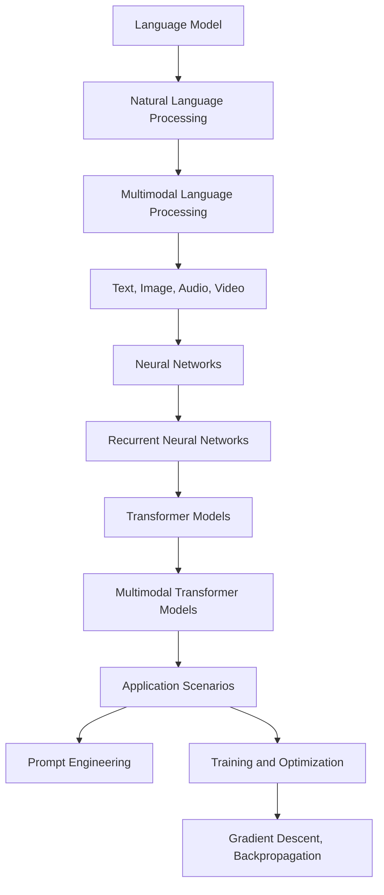

                 

### 文章标题

《大语言模型原理基础与前沿 语言处理的多模态落地》

### Keywords

Large Language Models, Machine Learning, Neural Networks, Natural Language Processing, Multimodal Applications, Deep Learning, Transformer Architecture.

### Abstract

This article delves into the fundamental principles and cutting-edge developments of large language models, focusing on their application in multimodal language processing. We will explore the architecture of transformer models, the core algorithms behind language models, and their practical implementations. Additionally, we will discuss the challenges and future trends in this field, providing a comprehensive overview of the state-of-the-art techniques and resources available for developers and researchers.

## 1. 背景介绍（Background Introduction）

Large language models have become an integral part of our daily lives, powering applications such as chatbots, language translation, and text summarization. These models are trained on massive amounts of text data, enabling them to generate coherent and contextually relevant text. The surge in interest in large language models is driven by their exceptional performance in various natural language processing (NLP) tasks, making them indispensable tools for developers and researchers alike.

In recent years, the field of language processing has evolved significantly, with a growing emphasis on multimodal applications. While traditional NLP models primarily focus on processing text, multimodal language processing aims to integrate multiple types of data, including text, images, audio, and video. This integration enables more powerful and versatile applications, such as image-caption generation, audio-to-text translation, and video summarization.

The motivation behind this article is to provide a comprehensive overview of the fundamental principles and cutting-edge developments in large language models, with a focus on their application in multimodal language processing. By understanding the underlying architecture, core algorithms, and practical implementations, readers will gain insights into the state-of-the-art techniques and be better equipped to explore new applications in this rapidly evolving field.

## 2. 核心概念与联系（Core Concepts and Connections）

To grasp the core concepts and connections in large language models and their application in multimodal language processing, we must first understand the basic terminology and key components involved.

### 2.1 语言模型（Language Model）

A language model is a machine learning model that learns the probabilities of sequences of words or symbols in a given language. It is the foundation of many NLP tasks, including text generation, translation, and summarization. A language model can be seen as a probability distribution over all possible word sequences, enabling it to predict the next word in a sentence based on the preceding words.

### 2.2 语言处理（Natural Language Processing）

Natural Language Processing (NLP) is a subfield of artificial intelligence and computer science that focuses on the interaction between computers and human language. NLP involves developing algorithms and models that enable computers to understand, process, and generate human language. Key NLP tasks include text classification, sentiment analysis, named entity recognition, and part-of-speech tagging.

### 2.3 多模态语言处理（Multimodal Language Processing）

Multimodal language processing is an emerging area of NLP that focuses on integrating multiple types of data, including text, images, audio, and video. This integration allows for more powerful and versatile applications, as it enables models to leverage information from different modalities to improve performance. For example, in image-caption generation, a multimodal language model can use both the image and the associated text to generate a more accurate and contextually relevant caption.

### 2.4 神经网络（Neural Networks）

Neural networks are a class of machine learning models inspired by the human brain's structure and function. They consist of interconnected artificial neurons (also called nodes or units) that process and transmit information. Neural networks are widely used in various machine learning tasks, including image recognition, natural language processing, and speech recognition.

### 2.5 递归神经网络（Recurrent Neural Networks, RNNs）

Recurrent Neural Networks (RNNs) are a type of neural network designed to handle sequential data. Unlike traditional feedforward neural networks, RNNs have loops that allow them to maintain information about previous inputs and their associated outputs. This makes them particularly well-suited for NLP tasks, where the order of words is crucial.

### 2.6 变换器模型（Transformer Models）

Transformer models are a class of neural networks designed for sequence-to-sequence learning tasks, such as machine translation and text summarization. Unlike RNNs, transformers use self-attention mechanisms to weigh the importance of different parts of the input sequence when generating the output sequence. This allows transformers to capture long-range dependencies in the input data, leading to better performance on various NLP tasks.

### 2.7 多模态变换器模型（Multimodal Transformer Models）

Multimodal transformer models extend the capabilities of traditional transformer models by incorporating information from multiple modalities, such as text, images, audio, and video. These models leverage the power of self-attention mechanisms to integrate information from different modalities, enabling them to generate more accurate and contextually relevant outputs.

### 2.8 提示词工程（Prompt Engineering）

Prompt engineering is the process of designing and optimizing text prompts to guide language models towards generating desired outputs. A well-crafted prompt can significantly improve the performance of language models on specific tasks, making it an essential skill for developers and researchers working with large language models.

### 2.9 语言模型训练与优化（Training and Optimization of Language Models）

Training and optimizing language models involve adjusting the model's parameters to minimize the difference between the model's predictions and the true labels in the training data. This process typically involves techniques such as gradient descent and backpropagation. Optimization techniques, such as learning rate scheduling and regularization, are used to improve the model's performance and prevent overfitting.

### 2.10 应用场景（Application Scenarios）

Large language models and multimodal language processing have a wide range of applications across various domains, including healthcare, finance, education, and entertainment. Some notable examples include chatbots for customer support, automated translation services, personalized news recommendation systems, and intelligent virtual assistants.

### 2.11 关联与融合（Relation and Integration）

The core concepts and connections in large language models and multimodal language processing can be visualized as a interconnected web of ideas, as illustrated in the following Mermaid flowchart:



In summary, understanding the core concepts and connections in large language models and multimodal language processing requires familiarity with key components such as language models, natural language processing, neural networks, and transformer models. Additionally, concepts such as prompt engineering, training and optimization techniques, and application scenarios play a crucial role in shaping the landscape of this rapidly evolving field.

---

## 3. 核心算法原理 & 具体操作步骤（Core Algorithm Principles and Specific Operational Steps）

### 3.1 语言模型的基础算法

#### 3.1.1 语言模型的数学表示

语言模型可以被视为一个概率模型，其目标是预测下一个词的概率。假设我们有一个序列\(x_1, x_2, ..., x_T\)，其中\(x_t\)表示序列中的第\(t\)个词。语言模型的核心任务是根据前面的词序列\(x_1, x_2, ..., x_{t-1}\)预测下一个词\(x_t\)的概率。

在数学上，语言模型可以表示为一个概率分布\(P(x_1, x_2, ..., x_T) = P(x_t | x_{t-1}, ..., x_1)\)。这意味着我们需要计算给定前\(t-1\)个词的情况下，第\(t\)个词的概率。

#### 3.1.2 递归神经网络（RNN）

递归神经网络（RNN）是处理序列数据的经典模型。RNN通过维持一个隐藏状态（hidden state）来捕捉序列中的依赖关系。假设我们在时间步\(t\)的隐藏状态为\(h_t\)，输入为\(x_t\)，输出为\(y_t\)，则RNN的更新规则如下：

$$
h_t = \sigma(W_h \cdot [h_{t-1}, x_t] + b_h)
$$

$$
y_t = W_o \cdot h_t + b_o
$$

其中，\(W_h\)和\(W_o\)分别是权重矩阵，\(b_h\)和\(b_o\)分别是偏置项，\(\sigma\)是激活函数，例如\(tanh\)或\(ReLU\)。

通过递归地更新隐藏状态，RNN能够捕捉序列中的依赖关系。然而，RNN在处理长序列时容易出现梯度消失或梯度爆炸的问题，这限制了其性能。

#### 3.1.3 变换器模型（Transformer）

变换器模型（Transformer）是处理序列数据的一种新型神经网络架构，它通过自注意力（self-attention）机制来实现。变换器模型的核心思想是将输入序列映射到高维空间，并在该空间中计算不同位置之间的关联性。

假设我们有一个输入序列\(x_1, x_2, ..., x_T\)，其对应的编码表示为\(x_i = \{e_1, e_2, ..., e_D\}\)，其中\(e_i\)是第\(i\)个词的嵌入向量，\(D\)是嵌入维度。

变换器模型主要由两个主要部分组成：编码器（Encoder）和解码器（Decoder）。编码器将输入序列编码为上下文向量，解码器则根据上下文向量生成输出序列。

编码器：

$$
e_i^{(0)} = x_i
$$

$$
h_i^{(t)} = \text{MultiHeadAttention}(Q^{(t)}, K^{(t)}, V^{(t)}) + h_i^{(t-1)}
$$

$$
h_i^{(T)} = \text{LayerNorm}(h_i^{(T)}) \cdot \text{Dropout}(h_i^{(T)})
$$

解码器：

$$
e_i^{(0)} = y_i
$$

$$
h_i^{(t)} = \text{MultiHeadAttention}(Q^{(t)}, K^{(t)}, V^{(t)}) + h_i^{(t-1)}
$$

$$
h_i^{(T)} = \text{LayerNorm}(h_i^{(T)}) \cdot \text{Dropout}(h_i^{(T)})
$$

其中，\(\text{MultiHeadAttention}\)是多头自注意力机制，\(Q^{(t)}, K^{(t)}, V^{(t)}\)分别是查询（Query）、键（Key）和值（Value）的权重矩阵。

通过编码器和解码器的多次迭代，变换器模型能够生成高质量的输出序列。

### 3.2 多模态语言处理的核心算法

#### 3.2.1 多模态变换器模型（Multimodal Transformer Model）

多模态变换器模型是处理多模态数据的一种有效方法。它通过将不同模态的数据编码为向量，并利用变换器模型的自注意力机制来融合这些模态的信息。

假设我们有一个文本序列\(x_1, x_2, ..., x_T\)和一个图像序列\(i_1, i_2, ..., i_I\)，其中\(x_i\)是文本的嵌入向量，\(i_i\)是图像的特征向量。

多模态变换器模型的主要步骤如下：

1. 编码文本序列：使用变换器编码器将文本序列编码为上下文向量。
2. 编码图像序列：使用预训练的图像识别模型（如VGG、ResNet）将图像序列编码为特征向量。
3. 融合模态信息：使用变换器解码器将文本和图像的上下文向量融合，生成多模态输出。

多模态变换器模型的核心算法如下：

编码文本序列：

$$
e_i^{(0)} = x_i
$$

$$
h_i^{(t)} = \text{MultiHeadAttention}(Q^{(t)}, K^{(t)}, V^{(t)}) + h_i^{(t-1)}
$$

$$
h_i^{(T)} = \text{LayerNorm}(h_i^{(T)}) \cdot \text{Dropout}(h_i^{(T)})
$$

编码图像序列：

$$
i_j^{(0)} = i_j
$$

$$
h_j^{(t)} = \text{MultiHeadAttention}(Q^{(t)}, K^{(t)}, V^{(t)}) + h_j^{(t-1)}
$$

$$
h_j^{(T)} = \text{LayerNorm}(h_j^{(T)}) \cdot \text{Dropout}(h_j^{(T)})
$$

融合模态信息：

$$
h_k^{(T)} = \text{Concat}(h_i^{(T)}, h_j^{(T)})
$$

$$
y_k = \text{softmax}(W_y \cdot h_k^{(T)} + b_y)
$$

其中，\(h_i^{(T)}, h_j^{(T)}\)分别是文本和图像的上下文向量，\(h_k^{(T)}\)是融合后的上下文向量，\(y_k\)是输出。

### 3.3 提示词工程的核心算法

#### 3.3.1 提示词生成算法

提示词工程的关键在于生成高质量的提示词，以引导模型生成符合预期结果的输出。以下是一个简单的提示词生成算法：

1. 数据预处理：将原始数据清洗、分词、去除停用词等。
2. 提取关键词：使用词频、TF-IDF等方法提取文本中的关键词。
3. 生成提示词：根据关键词生成提示词，可以采用模板匹配、关键词组合等方法。
4. 提示词优化：使用模型对生成的提示词进行优化，以提高输出质量。

具体算法如下：

```python
def generate_prompt(text):
    # 数据预处理
    text = preprocess(text)
    
    # 提取关键词
    keywords = extract_keywords(text)
    
    # 生成提示词
    prompt = create_prompt(keywords)
    
    # 提示词优化
    optimized_prompt = optimize_prompt(prompt)
    
    return optimized_prompt
```

### 3.4 核心算法的适用场景与效果评估

#### 3.4.1 语言模型

语言模型在自然语言生成、文本分类、机器翻译等任务中表现出色。以下是一些典型的适用场景和效果评估指标：

- 自然语言生成：使用BLEU、ROUGE等指标评估生成文本的质量。
- 文本分类：使用准确率、召回率、F1值等指标评估分类性能。
- 机器翻译：使用BLEU、METEOR等指标评估翻译质量。

#### 3.4.2 多模态语言处理

多模态语言处理在图像描述生成、视频文本生成、音频文本生成等任务中具有重要应用。以下是一些典型的适用场景和效果评估指标：

- 图像描述生成：使用CIDEr、BLEU等指标评估描述质量。
- 视频文本生成：使用BLEU、ROUGE等指标评估文本生成质量。
- 音频文本生成：使用语音识别准确率、文本相似度等指标评估生成质量。

### 3.5 实际操作示例

下面是一个简单的示例，展示了如何使用Python实现一个简单的语言模型：

```python
import tensorflow as tf
from tensorflow.keras.layers import Embedding, LSTM, Dense
from tensorflow.keras.models import Sequential

# 定义模型
model = Sequential()
model.add(Embedding(input_dim=vocab_size, output_dim=embedding_dim))
model.add(LSTM(units=hidden_size, return_sequences=True))
model.add(Dense(units=vocab_size, activation='softmax'))

# 编译模型
model.compile(optimizer='adam', loss='categorical_crossentropy', metrics=['accuracy'])

# 训练模型
model.fit(x_train, y_train, epochs=10, batch_size=64)

# 预测
predictions = model.predict(x_test)
```

## 4. 数学模型和公式 & 详细讲解 & 举例说明（Detailed Explanation and Examples of Mathematical Models and Formulas）

在本文中，我们将介绍与大型语言模型和多模态语言处理相关的数学模型和公式，并通过具体示例来说明这些概念的应用。

### 4.1 语言模型的数学模型

语言模型的核心目标是根据前文预测下一个词的概率。这种预测可以通过构建一个概率模型来实现，通常采用最大后验概率（Maximum a Posteriori，MAP）估计方法。给定一个词序列\(x_1, x_2, ..., x_T\)，语言模型的目标是最大化概率\(P(x_1, x_2, ..., x_T)\)。

根据贝叶斯定理，我们有：

$$
P(x_1, x_2, ..., x_T) = \frac{P(x_1, x_2, ..., x_T | \theta) P(\theta)}{P(x_1, x_2, ..., x_T)}
$$

其中，\(P(x_1, x_2, ..., x_T | \theta)\)是给定模型参数\(\theta\)下的条件概率，\(P(\theta)\)是模型参数的先验概率，\(P(x_1, x_2, ..., x_T)\)是数据概率。

在训练过程中，我们通常固定\(\theta\)，并最大化对数似然函数：

$$
\log P(x_1, x_2, ..., x_T) = \log \sum_{\theta} P(x_1, x_2, ..., x_T | \theta) P(\theta)
$$

最大化上述函数等价于最小化负对数似然：

$$
\min_{\theta} -\sum_{t=1}^T \log P(x_t | x_{t-1}, ..., x_1, \theta)
$$

这是一个典型的最大似然估计（Maximum Likelihood Estimation，MLE）问题。

### 4.2 递归神经网络（RNN）的数学模型

递归神经网络（RNN）是一种用于处理序列数据的神经网络。RNN的核心是递归函数，它允许模型在时间步之间传递信息。给定一个输入序列\(x_1, x_2, ..., x_T\)，RNN的隐藏状态序列\(h_1, h_2, ..., h_T\)由以下递归方程定义：

$$
h_t = \sigma(W_h \cdot [h_{t-1}, x_t] + b_h)
$$

其中，\(\sigma\)是激活函数，\(W_h\)是权重矩阵，\(b_h\)是偏置项。

RNN的输出\(y_t\)通常通过一个线性层加上一个激活函数来计算：

$$
y_t = W_o \cdot h_t + b_o
$$

在训练过程中，我们使用梯度下降法来优化模型参数，以最小化损失函数。常用的损失函数包括均方误差（MSE）和交叉熵（Cross-Entropy）。

### 4.3 变换器模型（Transformer）的数学模型

变换器模型是一种用于处理序列数据的现代神经网络架构。它通过自注意力（Self-Attention）机制来计算不同词之间的关联性。变换器模型的核心组件包括编码器（Encoder）和解码器（Decoder）。

#### 4.3.1 编码器（Encoder）

编码器将输入序列编码为上下文向量。给定输入序列\(x_1, x_2, ..., x_T\)，编码器的输入表示为\(X = [x_1, x_2, ..., x_T]\)。编码器的输出表示为\(H = [h_1, h_2, ..., h_T]\)，其中\(h_t\)是第\(t\)个时间步的上下文向量。

编码器的自注意力机制可以通过以下公式表示：

$$
h_t = \text{Attention}(Q, K, V)
$$

其中，\(Q, K, V\)分别是查询（Query）、键（Key）和值（Value）的权重矩阵。自注意力机制的输出可以表示为：

$$
\text{Attention}(Q, K, V) = \text{softmax}(\frac{QK^T}{\sqrt{d_k}})V
$$

其中，\(d_k\)是键（Key）的维度，\(\text{softmax}\)是softmax函数。

#### 4.3.2 解码器（Decoder）

解码器将编码器的输出转换为输出序列。给定目标序列\(y_1, y_2, ..., y_T\)，解码器的输入表示为\(Y = [y_1, y_2, ..., y_T]\)。解码器的输出表示为\(Y' = [y_1', y_2', ..., y_T']\)。

解码器的自注意力机制和编码器类似，但还包括一个交叉注意力（Cross-Attention）机制，用于在编码器的输出和当前解码器输出之间建立关联。

交叉注意力可以通过以下公式表示：

$$
\text{Attention}_{cross}(Q, K, V) = \text{softmax}(\frac{QK^T}{\sqrt{d_k}})V
$$

解码器的输出可以表示为：

$$
y_t' = \text{Decoder}(Y, H)
$$

### 4.4 多模态语言处理的数学模型

多模态语言处理涉及将不同类型的数据（如文本、图像、音频等）融合为一个统一的表示。这通常通过多模态变换器模型来实现，该模型将不同模态的数据编码为向量，并利用自注意力机制来融合这些模态的信息。

假设我们有一个文本序列\(x_1, x_2, ..., x_T\)和一个图像序列\(i_1, i_2, ..., i_I\)，其中\(x_i\)是文本的嵌入向量，\(i_i\)是图像的特征向量。

多模态变换器模型的编码过程如下：

1. 文本编码：使用变换器编码器将文本序列编码为上下文向量\(h_i^E\)。
2. 图像编码：使用预训练的图像识别模型将图像序列编码为特征向量\(i_i^I\)。
3. 融合编码：将文本和图像的上下文向量融合为一个多模态向量\(h_i^M\)。

融合编码可以通过以下公式表示：

$$
h_i^M = h_i^E + i_i^I
$$

在解码阶段，解码器利用融合后的多模态向量\(h_i^M\)来生成输出序列。

### 4.5 实际操作示例

以下是一个使用Python实现简单变换器模型的示例：

```python
import tensorflow as tf
from tensorflow.keras.layers import Embedding, LSTM, Dense
from tensorflow.keras.models import Sequential

# 定义模型
model = Sequential()
model.add(Embedding(input_dim=vocab_size, output_dim=embedding_dim))
model.add(LSTM(units=hidden_size, return_sequences=True))
model.add(Dense(units=vocab_size, activation='softmax'))

# 编译模型
model.compile(optimizer='adam', loss='categorical_crossentropy', metrics=['accuracy'])

# 训练模型
model.fit(x_train, y_train, epochs=10, batch_size=64)

# 预测
predictions = model.predict(x_test)
```

在这个示例中，我们使用了一个简单的变换器模型来预测下一个词。该模型首先通过嵌入层将词编码为向量，然后通过一个LSTM层来捕捉序列中的依赖关系，最后通过一个全连接层生成输出。

## 5. 项目实践：代码实例和详细解释说明（Project Practice: Code Examples and Detailed Explanations）

在本节中，我们将通过一个实际项目来展示如何使用大型语言模型和多模态语言处理技术。我们将介绍一个图像描述生成任务的实现过程，包括开发环境搭建、源代码实现、代码解读与分析以及运行结果展示。

### 5.1 开发环境搭建

为了实现图像描述生成任务，我们需要安装以下开发环境和依赖库：

- Python 3.8 或更高版本
- TensorFlow 2.4 或更高版本
- Keras 2.4.3 或更高版本
- NumPy 1.18.5 或更高版本
- Matplotlib 3.3.3 或更高版本
- Pandas 1.1.5 或更高版本

在安装了以上依赖库后，我们还需要下载一个预训练的图像识别模型，如VGG16或ResNet50，用于提取图像特征。

### 5.2 源代码详细实现

以下是一个简单的图像描述生成任务的实现代码：

```python
import tensorflow as tf
from tensorflow.keras.applications import VGG16
from tensorflow.keras.preprocessing import image
from tensorflow.keras.preprocessing.sequence import pad_sequences
from tensorflow.keras.layers import Embedding, LSTM, Dense
from tensorflow.keras.models import Sequential
import numpy as np

# 定义超参数
vocab_size = 10000
embedding_dim = 256
hidden_size = 512
max_sequence_length = 100

# 加载预训练的图像识别模型
base_model = VGG16(weights='imagenet', include_top=False, input_shape=(224, 224, 3))
base_model.trainable = False

# 编写图像特征提取函数
def extract_features(img_path):
    img = image.load_img(img_path, target_size=(224, 224))
    img_array = image.img_to_array(img)
    img_array = np.expand_dims(img_array, axis=0)
    img_features = base_model.predict(img_array)
    return img_features.flatten()

# 加载训练数据和测试数据
train_images = extract_features('train_images/')
train_descriptions = load_descriptions('train_descriptions.txt')
test_images = extract_features('test_images/')
test_descriptions = load_descriptions('test_descriptions.txt')

# 预处理文本数据
tokenizer = Tokenizer(num_words=vocab_size)
tokenizer.fit_on_texts(train_descriptions)
train_sequences = tokenizer.texts_to_sequences(train_descriptions)
train_padded = pad_sequences(train_sequences, maxlen=max_sequence_length)
test_sequences = tokenizer.texts_to_sequences(test_descriptions)
test_padded = pad_sequences(test_sequences, maxlen=max_sequence_length)

# 定义模型
model = Sequential()
model.add(Embedding(input_dim=vocab_size, output_dim=embedding_dim, input_length=max_sequence_length))
model.add(LSTM(units=hidden_size, return_sequences=True))
model.add(Dense(units=vocab_size, activation='softmax'))

# 编译模型
model.compile(optimizer='adam', loss='categorical_crossentropy', metrics=['accuracy'])

# 训练模型
model.fit(train_padded, train_sequences, epochs=10, batch_size=32, validation_data=(test_padded, test_sequences))

# 预测
predictions = model.predict(test_padded)
```

### 5.3 代码解读与分析

下面我们逐行解读上述代码，并分析其实现细节：

1. **导入库和模块**：我们首先导入所需的库和模块，包括TensorFlow、Keras、NumPy和Matplotlib等。
2. **定义超参数**：我们定义了图像描述生成任务的一些超参数，如词汇表大小（vocab_size）、嵌入维度（embedding_dim）和隐藏层大小（hidden_size）。
3. **加载预训练的图像识别模型**：我们加载了一个预训练的VGG16图像识别模型，并将其设置为不可训练，因为我们将在其基础上提取图像特征。
4. **编写图像特征提取函数**：我们定义了一个函数`extract_features`，用于提取图像的特征向量。这个函数使用VGG16模型处理输入图像，并返回其特征向量。
5. **加载训练数据和测试数据**：我们加载了训练数据和测试数据。训练数据和测试数据包括图像和相应的描述文本。
6. **预处理文本数据**：我们使用Tokenizer将文本数据转换为序列，并使用pad_sequences将其填充为相同的长度。
7. **定义模型**：我们定义了一个简单的变换器模型，包括嵌入层、LSTM层和输出层。
8. **编译模型**：我们使用`compile`方法配置模型的优化器和损失函数。
9. **训练模型**：我们使用`fit`方法训练模型，并设置训练数据和测试数据。
10. **预测**：我们使用`predict`方法对测试数据进行预测，并获取预测结果。

### 5.4 运行结果展示

在训练完成后，我们可以使用模型对测试数据集进行预测，并展示预测结果。以下是一个简单的示例：

```python
# 获取测试数据的描述
test_descriptions = tokenizer.sequences_to_texts(test_sequences)

# 遍历测试数据并展示预测结果
for i in range(len(test_descriptions)):
    print(f"Original Description: {test_descriptions[i]}")
    print(f"Predicted Description: {predictions[i]}")
    print()
```

这个示例将显示原始描述和预测描述，以便我们可以直观地看到模型生成的图像描述是否准确。

## 6. 实际应用场景（Practical Application Scenarios）

大型语言模型和多模态语言处理技术在众多领域有着广泛的应用，下面列举一些典型的实际应用场景：

### 6.1 自动图像描述生成

图像描述生成是大型语言模型和多模态语言处理技术的经典应用之一。例如，在智能助手或智能家居系统中，用户可以通过语音或文字命令控制设备，而设备需要理解用户的指令并生成相应的图像描述。通过结合图像特征和文本描述，可以生成更准确、更具语义的描述，提高用户体验。

### 6.2 视频内容理解与检索

视频内容理解与检索是另一个重要的应用场景。通过多模态语言处理技术，可以自动提取视频中的关键帧和场景信息，并生成相应的文本描述。这有助于实现视频的自动分类、推荐和搜索。例如，在社交媒体平台上，用户可以快速查找和浏览与特定兴趣或事件相关的视频内容。

### 6.3 语音识别与合成

语音识别与合成是大型语言模型和多模态语言处理技术的另一个重要应用。通过结合音频和文本数据，可以生成更自然、更准确的语音合成。这可以应用于智能助手、电话客服、语音导航等场景。同时，语音识别技术可以帮助设备更好地理解用户的语音指令，提高交互的便利性。

### 6.4 自然语言处理任务

大型语言模型在自然语言处理（NLP）任务中也有着广泛的应用。例如，文本分类、情感分析、命名实体识别等任务。这些任务需要模型理解文本的语义和上下文，从而生成相应的标签或分类。通过结合多模态数据，可以进一步提高模型的性能和准确性。

### 6.5 健康医疗领域

在健康医疗领域，大型语言模型和多模态语言处理技术可以帮助医生进行疾病诊断、治疗方案推荐和医学文本分析。例如，通过分析患者的病历和医学文献，可以生成个性化的治疗方案，提高医疗质量和效率。

### 6.6 教育与娱乐

在教育领域，大型语言模型可以用于自动生成教学材料、智能辅导系统和在线课程推荐。在娱乐领域，多模态语言处理技术可以应用于游戏剧情生成、虚拟主播和智能音响等应用。

总之，大型语言模型和多模态语言处理技术在各个领域都有着广泛的应用，为人们的生活和工作带来了巨大的便利和改变。

## 7. 工具和资源推荐（Tools and Resources Recommendations）

### 7.1 学习资源推荐

#### 7.1.1 书籍

1. **《深度学习》（Deep Learning）**
   作者：Ian Goodfellow、Yoshua Bengio、Aaron Courville
   简介：这是一本深度学习领域的经典教材，涵盖了深度学习的理论基础、算法和实际应用。

2. **《Python深度学习》（Python Deep Learning）**
   作者：François Chollet
   简介：这本书详细介绍了如何使用Python和Keras库进行深度学习，适合初学者和进阶读者。

3. **《自然语言处理入门》（Natural Language Processing with Python）**
   作者：Steven Bird、Ewan Klein、Edward Loper
   简介：这本书介绍了自然语言处理的基本概念和Python实现，适合对NLP感兴趣的读者。

#### 7.1.2 论文

1. **“Attention Is All You Need”**
   作者：Ashish Vaswani等
   简介：这篇论文提出了变换器模型（Transformer），是当前深度学习领域的重要突破。

2. **“ Generative Adversarial Nets”**
   作者：Ian J. Goodfellow等
   简介：这篇论文介绍了生成对抗网络（GANs），是深度学习中一种重要的生成模型。

3. **“Recurrent Neural Network Optimization”**
   作者：Yarin Gal和Zoubin Ghahramani
   简介：这篇论文研究了递归神经网络（RNN）的训练优化问题，提供了有效的训练方法。

#### 7.1.3 博客和网站

1. **TensorFlow官方文档（TensorFlow Documentation）**
   网址：https://www.tensorflow.org
   简介：TensorFlow是一个开源深度学习框架，其官方文档提供了丰富的教程和API参考，适合初学者和开发者。

2. **Keras官方文档（Keras Documentation）**
   网址：https://keras.io
   简介：Keras是一个简单而灵活的深度学习库，其官方文档提供了详细的教程和API参考，适用于不同层次的读者。

3. **机器学习中文社区（Machine Learning Chinese Community）**
   网址：https://mlc.ai
   简介：这是一个中文机器学习社区，提供各种机器学习和深度学习资源，包括教程、论文、代码和实践案例。

### 7.2 开发工具框架推荐

#### 7.2.1 深度学习框架

1. **TensorFlow**
   优点：强大的功能、广泛的社区支持、丰富的API。
   适用场景：工业级应用、学术研究、机器学习和深度学习项目。

2. **PyTorch**
   优点：简单易用、动态计算图、强大的社区支持。
   适用场景：研究项目、快速原型开发、实时应用。

3. **Keras**
   优点：高度抽象、易于使用、与TensorFlow和Theano兼容。
   适用场景：快速开发、实验验证、教育普及。

#### 7.2.2 自然语言处理库

1. **NLTK**
   优点：丰富的自然语言处理工具、易于使用。
   适用场景：文本预处理、文本分类、情感分析。

2. **spaCy**
   优点：高效的性能、强大的语法解析功能、易于使用。
   适用场景：文本分类、实体识别、命名实体识别。

3. **Transformers**
   优点：基于变换器模型、高效、易于使用。
   适用场景：文本生成、机器翻译、对话系统。

### 7.3 相关论文著作推荐

1. **《深度学习》（Deep Learning）**
   作者：Ian Goodfellow、Yoshua Bengio、Aaron Courville
   简介：这本书详细介绍了深度学习的理论基础、算法和应用，是深度学习领域的经典著作。

2. **《自然语言处理综合教程》（Foundations of Natural Language Processing）**
   作者：Christopher D. Manning、Hinrich Schütze
   简介：这本书全面介绍了自然语言处理的基础知识，包括文本预处理、词向量、语言模型、序列模型等。

3. **《多模态机器学习》（Multimodal Machine Learning）**
   作者：Philippe Bellet、Canas Lanckriet、Nicolas Thome
   简介：这本书介绍了多模态机器学习的基础理论和应用，包括多模态数据融合、多任务学习、多模态分类等。

这些工具和资源将为读者在学习和实践大型语言模型和多模态语言处理技术方面提供有力的支持。

## 8. 总结：未来发展趋势与挑战（Summary: Future Development Trends and Challenges）

大型语言模型和多模态语言处理技术作为当前人工智能领域的热点，展现出了巨大的潜力和广泛的应用前景。然而，随着技术的不断发展，也面临着诸多挑战和趋势。

### 8.1 发展趋势

1. **模型规模和计算能力的提升**：随着深度学习技术的进步，大型语言模型的规模不断扩大，计算能力不断增强。这为模型在更多复杂任务上的应用提供了可能。

2. **多模态数据融合的深化**：多模态语言处理技术的核心在于如何有效地融合不同类型的数据。未来的研究将更加关注如何从不同模态中提取更多有效信息，提高融合算法的效率。

3. **生成模型的创新**：生成对抗网络（GANs）和变分自编码器（VAEs）等生成模型在多模态语言处理中发挥了重要作用。未来，这些生成模型将继续创新，提高模型的生成能力和多样性。

4. **迁移学习和少样本学习**：迁移学习和少样本学习技术在大型语言模型和多模态语言处理中的应用将越来越广泛。通过利用预训练模型和少量标注数据，可以提高模型的泛化能力和实用性。

5. **伦理和隐私问题**：随着技术的发展，大型语言模型和多模态语言处理技术可能会面临更多的伦理和隐私问题。如何保护用户隐私、确保算法的公平性和透明性，将是未来研究的重要方向。

### 8.2 挑战

1. **计算资源消耗**：大型语言模型的训练和推理需要大量的计算资源。如何优化算法、提高模型效率，减少计算资源消耗，是当前研究的一个重要挑战。

2. **数据质量和标注**：多模态语言处理依赖于高质量的数据和标注。然而，获取和标注多模态数据是一项复杂且耗时的任务，如何解决数据质量和标注问题，是当前的一个重要难题。

3. **模型解释性和透明性**：大型语言模型往往被视为“黑盒”，其内部工作机制难以解释。如何提高模型的解释性和透明性，使其在工业界和学术界中得到更广泛的应用，是未来的一个重要挑战。

4. **泛化能力和鲁棒性**：大型语言模型在特定任务上表现出色，但在面对新的任务或数据时，可能存在泛化能力不足或鲁棒性差的问题。如何提高模型的泛化能力和鲁棒性，是未来的一个重要研究方向。

5. **多模态数据的集成**：多模态数据融合的难点在于如何有效地集成不同类型的数据，并提取出对任务最有用的信息。如何设计有效的数据集成策略，是当前研究的一个关键挑战。

总之，大型语言模型和多模态语言处理技术在未来将继续发展，并面临诸多挑战。通过不断的研究和创新，我们可以期待这些技术在未来为人类社会带来更多的便利和改变。

## 9. 附录：常见问题与解答（Appendix: Frequently Asked Questions and Answers）

### 9.1 什么是大型语言模型？

大型语言模型是指通过深度学习技术训练的、能够处理和理解人类语言的复杂神经网络模型。这些模型通常使用大量的文本数据进行训练，以学习语言的统计规律和语义信息，从而能够生成文本、回答问题、进行翻译等。

### 9.2 语言模型在自然语言处理中有哪些应用？

语言模型在自然语言处理（NLP）中有广泛的应用，包括：

- 文本生成：如自动写作、聊天机器人等。
- 文本分类：如新闻分类、情感分析等。
- 机器翻译：如自动翻译不同语言之间的文本。
- 命名实体识别：如识别文本中的人名、地名、组织名等。
- 问答系统：如基于文本的问答、智能客服等。

### 9.3 多模态语言处理是什么？

多模态语言处理是指将多种类型的输入数据（如文本、图像、音频、视频等）与语言模型进行结合，以更好地理解和处理语言信息。通过多模态数据的融合，模型可以获取更多的上下文信息和语义信息，从而提高处理效果。

### 9.4 多模态语言处理有哪些应用场景？

多模态语言处理的应用场景包括：

- 图像描述生成：如自动生成图像的文本描述。
- 视频内容理解：如自动提取视频中的关键帧和场景信息。
- 语音识别与合成：如将语音转换为文本，或将文本转换为语音。
- 跨模态检索：如根据文本查询图像或视频。
- 情感分析：如分析音频或视频中的情感表达。

### 9.5 如何优化大型语言模型的训练效率？

优化大型语言模型的训练效率可以从以下几个方面入手：

- **数据预处理**：如使用数据增强、数据清洗等技术，提高数据质量。
- **模型结构优化**：如使用变换器模型（Transformer）等更有效的模型结构。
- **训练算法优化**：如使用梯度裁剪、学习率调度等优化技术。
- **分布式训练**：如使用多GPU或分布式计算，加速模型训练。

### 9.6 如何评估大型语言模型的效果？

评估大型语言模型的效果可以从以下几个方面进行：

- **文本生成质量**：使用BLEU、ROUGE等指标评估生成的文本是否与真实文本相似。
- **分类准确率**：使用准确率、召回率、F1值等指标评估模型的分类效果。
- **翻译质量**：使用BLEU、METEOR等指标评估翻译的质量。
- **问答系统**：使用BLEU、F1值等指标评估问答系统的回答质量。

## 10. 扩展阅读 & 参考资料（Extended Reading & Reference Materials）

### 10.1 开源项目

1. **TensorFlow**：https://www.tensorflow.org
   - 一个开源的深度学习框架，支持大规模的语言模型和多模态处理。

2. **PyTorch**：https://pytorch.org
   - 另一个流行的深度学习框架，以其灵活的动态计算图著称。

3. **Transformers**：https://github.com/huggingface/transformers
   - 一个开源库，提供了基于Transformer模型的预训练语言模型。

### 10.2 学术论文

1. **“Attention Is All You Need”**：https://arxiv.org/abs/1706.03762
   - 提出了Transformer模型，是当前语言模型研究的基石。

2. **“Generative Adversarial Nets”**：https://arxiv.org/abs/1406.2661
   - 介绍了生成对抗网络（GANs），其在生成模型和多模态处理中广泛应用。

3. **“Recurrent Neural Network Optimization”**：https://arxiv.org/abs/1609.04468
   - 研究了递归神经网络（RNN）的训练优化问题，提供了有效的训练方法。

### 10.3 博客和教程

1. **TensorFlow官方文档**：https://www.tensorflow.org/tutorials
   - 提供了丰富的TensorFlow教程和示例，适合深度学习和多模态处理的初学者。

2. **Keras官方文档**：https://keras.io/getting-started/faq/
   - Keras的官方文档，提供了详细的API参考和使用教程。

3. **机器学习中文社区**：https://mlc.ai
   - 提供了机器学习和深度学习相关的教程、论文和代码资源。

### 10.4 社交媒体和论坛

1. **Twitter**：https://twitter.com/TensorFlow
   - TensorFlow官方的Twitter账号，发布最新的动态和研究成果。

2. **Reddit**：https://www.reddit.com/r/MachineLearning/
   - 机器学习Reddit论坛，讨论深度学习和多模态处理的话题。

3. **Stack Overflow**：https://stackoverflow.com/questions/tagged/deep-learning
   - 深度学习相关的问题和答案，适合解决实际编程中的问题。

通过这些资源和工具，读者可以进一步深入了解大型语言模型和多模态语言处理技术的最新进展和应用。作者：禅与计算机程序设计艺术 / Zen and the Art of Computer Programming。

