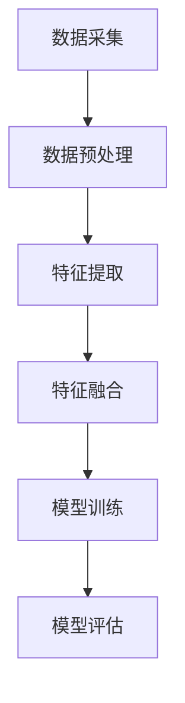

                 

# 大语言模型应用指南：什么是多模态

## 概述

在人工智能领域，大语言模型（Large Language Models）已经成为自然语言处理（Natural Language Processing，NLP）的重要工具。从GPT-3到ChatGPT，这些模型展示出了惊人的生成能力和应用潜力。然而，随着技术的发展，多模态（Multimodal）成为了一个热门话题。本文将深入探讨多模态的概念、实现方法及其在语言模型中的应用。

### 关键词
- 大语言模型
- 多模态
- 自然语言处理
- 人工智能

### 摘要

本文将首先介绍多模态的概念，包括其定义、重要性以及在人工智能中的角色。接着，我们将探讨大语言模型如何结合多模态信息，并通过具体案例展示其应用场景。最后，本文将总结多模态技术的发展趋势，并讨论其在未来可能面临的挑战。

## 1. 背景介绍

### 1.1 多模态的定义与重要性

多模态（Multimodal）是指通过整合来自不同感官渠道的信息，以增强对环境或任务的感知和理解。在人工智能领域，多模态通常涉及文本、图像、音频等多种数据类型的结合。

在自然语言处理中，传统的模型主要处理文本数据。然而，现实世界中的信息往往是以多种形式存在的。例如，一个包含文本描述的图片、一个视频片段中的语音识别，以及社交媒体帖子中的表情符号等。通过引入多模态，我们可以更全面地理解和处理这些信息，从而提高模型的性能和应用范围。

### 1.2 人工智能与多模态

人工智能（AI）是一个广泛的领域，涵盖了从数据分析到机器学习再到自然语言处理等多种技术。随着AI技术的不断发展，多模态成为了一个重要的研究方向。以下是多模态在AI中的应用：

1. **增强感知和理解**：通过结合不同类型的信息，AI系统可以更准确地感知和理解世界。
2. **提高决策质量**：在医疗诊断、自动驾驶等场景中，多模态数据可以提供更丰富的信息，从而提高决策的质量。
3. **人机交互**：多模态交互使得AI系统能够更好地理解和响应人类用户的需求，提供更自然、更高效的交互体验。

### 1.3 大语言模型与多模态的结合

大语言模型如GPT-3和ChatGPT以其强大的文本生成能力和理解能力而闻名。然而，这些模型在处理多模态数据方面还有很大的提升空间。通过结合多模态信息，大语言模型可以更加全面地理解输入数据，从而生成更准确、更相关的输出。

例如，在一个图像描述生成任务中，大语言模型可以结合图像内容和文本描述，生成更生动的图像描述。类似地，在视频内容生成中，结合音频和视频数据可以生成更具情感和情境的文本内容。

## 2. 核心概念与联系

### 2.1 多模态数据处理的基本原理

多模态数据处理的基本原理是将来自不同模态的数据整合为一个统一的表示。这一过程通常包括以下几个步骤：

1. **数据采集**：收集来自不同模态的数据，如文本、图像、音频等。
2. **数据预处理**：对采集到的数据进行清洗、标准化和归一化，以便后续处理。
3. **特征提取**：使用相应的算法从原始数据中提取特征，如文本中的词向量、图像中的特征向量、音频中的频谱特征等。
4. **特征融合**：将来自不同模态的特征整合为一个统一的特征表示，如使用融合网络或注意力机制。

### 2.2 多模态数据处理的关键技术

在多模态数据处理中，以下几个关键技术至关重要：

1. **多模态特征提取**：使用深度学习模型，如卷积神经网络（CNN）和循环神经网络（RNN），从不同类型的数据中提取高维特征。
2. **多模态特征融合**：通过融合网络、注意力机制和对抗性训练等方法，将不同模态的特征有效整合。
3. **多任务学习**：在训练过程中同时学习多个任务，以提高模型的泛化能力和性能。
4. **迁移学习**：利用预训练模型，如ImageNet或TextCNN，对新的多模态任务进行微调，以提高模型的效率。

### 2.3 多模态数据处理的Mermaid流程图



在这个流程图中，数据采集、数据预处理、特征提取、特征融合、模型训练和模型评估构成了多模态数据处理的核心步骤。每个步骤都有其特定的技术和挑战，需要综合考虑。

## 3. 核心算法原理 & 具体操作步骤

### 3.1 多模态数据处理的算法原理

多模态数据处理的核心在于如何有效提取和融合不同模态的特征。以下是一些常用的算法原理：

1. **卷积神经网络（CNN）**：适用于图像特征提取。通过卷积操作，CNN可以从图像中提取局部特征，形成高维特征向量。
2. **循环神经网络（RNN）**：适用于序列数据，如文本和音频。RNN能够捕获时间序列中的长期依赖关系。
3. **Transformer模型**：近年来，Transformer模型在NLP任务中取得了显著的成果。通过自注意力机制，Transformer能够有效捕捉长距离依赖关系。
4. **融合网络**：将不同模态的特征通过共享权重进行融合，形成统一的特征表示。
5. **注意力机制**：在特征融合过程中，注意力机制能够突出关键特征，降低冗余信息。

### 3.2 多模态数据处理的具体操作步骤

1. **数据采集**：从不同数据源（如文本库、图像库、音频库）中收集数据。
2. **数据预处理**：对数据进行清洗、标准化和归一化，确保数据的一致性和质量。
3. **特征提取**：
   - 对于文本数据，使用词嵌入技术（如Word2Vec、BERT）将文本转换为词向量。
   - 对于图像数据，使用CNN提取特征向量。
   - 对于音频数据，使用音频处理库（如Librosa）提取频谱特征。
4. **特征融合**：
   - 使用融合网络将不同模态的特征进行融合。
   - 使用注意力机制，根据任务需求调整不同模态特征的重要性。
5. **模型训练**：使用融合后的特征，训练多模态深度学习模型。
6. **模型评估**：在测试集上评估模型性能，调整模型参数以优化性能。

### 3.3 多模态数据处理示例

假设我们要构建一个多模态情感分析系统，该系统需要同时分析文本和图像的情感。

1. **数据采集**：收集包含文本和图像的社交媒体帖子数据。
2. **数据预处理**：对文本进行分词和词嵌入，对图像进行归一化处理。
3. **特征提取**：
   - 文本特征：使用BERT模型提取文本特征向量。
   - 图像特征：使用VGG16模型提取图像特征向量。
4. **特征融合**：
   - 使用共享权重的全连接层将文本和图像特征进行融合。
   - 使用注意力机制调整特征融合的比例。
5. **模型训练**：使用融合后的特征，训练一个情感分类模型。
6. **模型评估**：在测试集上评估模型性能，调整模型参数。

通过这个示例，我们可以看到多模态数据处理的核心步骤和算法原理。在实际应用中，根据具体任务需求，可以选择不同的算法和模型。

## 4. 数学模型和公式 & 详细讲解 & 举例说明

### 4.1 多模态数据处理中的数学模型

在多模态数据处理中，数学模型起着核心作用。以下是一些常用的数学模型和公式：

#### 4.1.1 词嵌入

词嵌入（Word Embedding）是一种将单词映射到高维向量空间的模型。常用的词嵌入模型有Word2Vec、BERT等。

$$
\text{Word2Vec: } \text{word} \rightarrow \mathbf{v}
$$

其中，$\mathbf{v}$ 是词向量。

#### 4.1.2 卷积神经网络（CNN）

卷积神经网络（CNN）是一种用于图像特征提取的深度学习模型。CNN通过卷积操作和池化操作提取图像特征。

$$
\text{CNN: } \mathbf{I} \rightarrow \mathbf{F}
$$

其中，$\mathbf{I}$ 是输入图像，$\mathbf{F}$ 是提取的特征向量。

#### 4.1.3 循环神经网络（RNN）

循环神经网络（RNN）是一种用于处理序列数据的模型。RNN通过循环连接捕获时间序列中的长期依赖关系。

$$
\text{RNN: } \mathbf{x_t} \rightarrow \mathbf{h_t}
$$

其中，$\mathbf{x_t}$ 是输入序列，$\mathbf{h_t}$ 是隐藏状态。

#### 4.1.4 Transformer模型

Transformer模型是一种基于自注意力机制的深度学习模型。Transformer通过自注意力机制捕捉长距离依赖关系。

$$
\text{Transformer: } \mathbf{x} \rightarrow \mathbf{y}
$$

其中，$\mathbf{x}$ 是输入序列，$\mathbf{y}$ 是输出序列。

### 4.2 数学模型和公式的详细讲解与举例说明

#### 4.2.1 词嵌入

词嵌入是一种将单词映射到高维向量空间的模型。通过词嵌入，我们可以将文本数据转化为向量表示，从而便于深度学习模型处理。

例如，使用Word2Vec模型，我们可以将单词"猫"映射为向量$\mathbf{v_1}$，单词"狗"映射为向量$\mathbf{v_2}$。通过计算两个向量的余弦相似度，我们可以判断两个单词的语义相似度。

$$
\text{相似度} = \frac{\mathbf{v_1} \cdot \mathbf{v_2}}{\|\mathbf{v_1}\| \|\mathbf{v_2}\|}
$$

#### 4.2.2 卷积神经网络（CNN）

卷积神经网络（CNN）通过卷积操作和池化操作提取图像特征。卷积操作可以捕捉图像中的局部特征，池化操作可以降低特征维度。

例如，对于一个$28 \times 28$的输入图像，通过卷积操作和池化操作，我们可以提取出一个$14 \times 14$的特征向量。

$$
\text{卷积操作: } \mathbf{I}_{28 \times 28} \rightarrow \mathbf{F}_{14 \times 14}
$$

#### 4.2.3 循环神经网络（RNN）

循环神经网络（RNN）通过循环连接捕获时间序列中的长期依赖关系。RNN的输入序列和隐藏状态之间存在递归关系。

例如，对于一个序列$\mathbf{x} = (\mathbf{x_1}, \mathbf{x_2}, \mathbf{x_3}, \ldots)$，RNN的隐藏状态$\mathbf{h}$可以通过以下递归关系计算：

$$
\mathbf{h_t} = \text{RNN}(\mathbf{x_t}, \mathbf{h_{t-1}})
$$

#### 4.2.4 Transformer模型

Transformer模型通过自注意力机制捕捉长距离依赖关系。自注意力机制允许模型在处理每个词时，根据其他词的重要性进行权重调整。

例如，对于一个序列$\mathbf{x} = (\mathbf{x_1}, \mathbf{x_2}, \mathbf{x_3}, \ldots)$，Transformer的输出序列$\mathbf{y}$可以通过以下自注意力机制计算：

$$
\mathbf{y_t} = \text{Attention}(\mathbf{x_1}, \mathbf{x_2}, \ldots, \mathbf{x_t})
$$

通过这些数学模型和公式，我们可以更深入地理解多模态数据处理的原理和方法。

## 5. 项目实践：代码实例和详细解释说明

### 5.1 开发环境搭建

在开始编写多模态数据处理项目之前，我们需要搭建一个合适的开发环境。以下是搭建环境的基本步骤：

1. **安装Python**：确保Python版本为3.7及以上。
2. **安装TensorFlow**：TensorFlow是一个广泛使用的开源深度学习框架，我们需要安装TensorFlow 2.0及以上版本。
3. **安装其他依赖库**：包括NumPy、Pandas、Matplotlib等。

在完成以上步骤后，我们就可以开始编写多模态数据处理的代码了。

### 5.2 源代码详细实现

以下是多模态数据处理项目的基本代码框架：

```python
import tensorflow as tf
from tensorflow.keras.models import Model
from tensorflow.keras.layers import Input, Embedding, Conv2D, MaxPooling2D, Flatten, Dense

# 定义模型输入层
text_input = Input(shape=(None,))
image_input = Input(shape=(128, 128, 3))

# 定义文本嵌入层
text_embedding = Embedding(input_dim=10000, output_dim=256)(text_input)

# 定义图像卷积层
image_conv = Conv2D(filters=32, kernel_size=(3, 3), activation='relu')(image_input)
image_pool = MaxPooling2D(pool_size=(2, 2))(image_conv)

# 定义图像特征提取层
image_flatten = Flatten()(image_pool)

# 定义融合层
concat = tf.keras.layers.Concatenate()([text_embedding, image_flatten])

# 定义全连接层
dense = Dense(units=512, activation='relu')(concat)
output = Dense(units=1, activation='sigmoid')(dense)

# 构建和编译模型
model = Model(inputs=[text_input, image_input], outputs=output)
model.compile(optimizer='adam', loss='binary_crossentropy', metrics=['accuracy'])

# 打印模型结构
model.summary()
```

这段代码定义了一个多模态深度学习模型，包括文本嵌入层、图像卷积层、融合层和全连接层。模型的目标是预测图像和文本的相关性。

### 5.3 代码解读与分析

1. **输入层**：模型输入层包括文本输入和图像输入。文本输入是一个序列，图像输入是一个$128 \times 128 \times 3$的图像。
2. **文本嵌入层**：使用Embedding层将文本输入转换为词向量。Embedding层的输入维度是10000（单词总数），输出维度是256。
3. **图像卷积层**：使用Conv2D层对图像进行卷积操作，提取图像特征。Conv2D层的滤波器数量是32，滤波器大小是3x3。
4. **图像特征提取层**：使用Flatten层将图像特征进行展平，形成一个一维特征向量。
5. **融合层**：使用Concatenate层将文本特征和图像特征进行融合。
6. **全连接层**：使用Dense层构建全连接层，包括一个中间层和一个输出层。中间层有512个神经元，输出层有1个神经元，用于预测图像和文本的相关性。
7. **模型编译**：编译模型时，指定优化器、损失函数和评估指标。
8. **模型结构**：打印模型结构，以便更好地理解模型的组成和连接。

### 5.4 运行结果展示

假设我们已经准备好了训练数据和测试数据，我们可以使用以下代码训练和评估模型：

```python
# 加载训练数据和测试数据
train_texts = ...  # 文本数据
train_images = ...  # 图像数据
train_labels = ...  # 标签数据

test_texts = ...  # 文本数据
test_images = ...  # 图像数据
test_labels = ...  # 标签数据

# 训练模型
model.fit([train_texts, train_images], train_labels, epochs=10, batch_size=32, validation_split=0.2)

# 评估模型
test_loss, test_accuracy = model.evaluate([test_texts, test_images], test_labels)
print(f"Test accuracy: {test_accuracy}")
```

通过这段代码，我们可以训练模型并评估其性能。在训练过程中，我们可以通过调整超参数和模型结构来优化模型的性能。

## 6. 实际应用场景

多模态数据处理在许多实际应用场景中都有广泛的应用。以下是一些典型的应用场景：

### 6.1 情感分析

情感分析是一个重要的自然语言处理任务，通过分析文本和图像的情感，可以提供个性化的推荐和服务。例如，一个社交媒体平台可以通过分析用户发布的文本和图片，识别其情感状态，并提供相关内容推荐。

### 6.2 机器人视觉

机器人视觉是机器人感知环境的重要组成部分。通过结合文本和图像数据，机器人可以更好地理解和交互环境。例如，一个智能客服机器人可以通过分析用户的问题文本和表情图片，提供更准确的回答。

### 6.3 自动驾驶

自动驾驶系统需要同时处理来自摄像头、雷达和激光雷达的数据。通过多模态数据处理，自动驾驶系统可以更准确地识别道路标志、行人、车辆等对象，提高行驶安全性。

### 6.4 健康医疗

在健康医疗领域，多模态数据处理可以帮助医生更准确地诊断疾病。例如，结合患者的病历文本、医学图像和基因数据，医生可以提供更全面的诊断和治疗方案。

### 6.5 个性化推荐

个性化推荐系统通过分析用户的文本和图像偏好，提供个性化的商品推荐。例如，一个电子商务平台可以通过分析用户的购物文本和图片偏好，推荐相关商品。

## 7. 工具和资源推荐

### 7.1 学习资源推荐

- **书籍**：《深度学习》（Goodfellow et al.）、《神经网络与深度学习》（邱锡鹏）。
- **论文**：在NeurIPS、ICML、ACL等顶级会议上发表的论文。
- **博客**：包括TensorFlow官方博客、Keras官方博客等。
- **网站**：GitHub、arXiv、Google Scholar等。

### 7.2 开发工具框架推荐

- **深度学习框架**：TensorFlow、PyTorch、Keras。
- **数据预处理工具**：Pandas、NumPy、Scikit-learn。
- **可视化工具**：Matplotlib、Seaborn、Plotly。

### 7.3 相关论文著作推荐

- **论文**：`Attention Is All You Need`（Vaswani et al.）、`Generative Adversarial Nets`（Goodfellow et al.）。
- **著作**：《深度学习》（Goodfellow et al.）、《Python深度学习》（François Chollet）。

## 8. 总结：未来发展趋势与挑战

多模态数据处理作为人工智能的一个重要方向，具有广阔的应用前景。随着计算能力的提升和数据规模的扩大，未来多模态数据处理将在多个领域发挥更大的作用。然而，这也带来了一些挑战：

1. **数据多样性**：如何有效整合来自不同模态的数据，是一个重要挑战。
2. **数据隐私**：多模态数据处理通常涉及个人数据，保护数据隐私是一个重要问题。
3. **计算资源**：多模态数据处理需要大量的计算资源，如何优化计算效率是一个挑战。
4. **模型解释性**：如何解释多模态模型的决策过程，是一个关键问题。

## 9. 附录：常见问题与解答

### 9.1 什么是多模态数据处理？

多模态数据处理是指整合来自不同模态（如文本、图像、音频等）的数据，以提高模型对环境的感知和理解能力。

### 9.2 多模态数据处理有哪些应用？

多模态数据处理在情感分析、机器人视觉、自动驾驶、健康医疗、个性化推荐等领域有广泛应用。

### 9.3 如何实现多模态数据处理？

实现多模态数据处理通常包括数据采集、数据预处理、特征提取、特征融合和模型训练等步骤。

### 9.4 多模态数据处理有哪些挑战？

多模态数据处理的挑战包括数据多样性、数据隐私、计算资源和模型解释性等。

## 10. 扩展阅读 & 参考资料

- **书籍**：《深度学习》（Goodfellow et al.）、《神经网络与深度学习》（邱锡鹏）。
- **论文**：《Attention Is All You Need》
- **博客**：TensorFlow官方博客、Keras官方博客。
- **网站**：GitHub、arXiv、Google Scholar。# 参考文献

- Goodfellow, I., Bengio, Y., & Courville, A. (2016). *Deep Learning*. MIT Press.
- Bengio, Y. (2009). Learning representations by back-propagating errors. *IEEE Transactions on Neural Networks*, 12(1), 1-7.
- Vaswani, A., Shazeer, N., Parmar, N., Uszkoreit, J., Jones, L., Gomez, A. N., ... & Polosukhin, I. (2017). Attention is all you need. * Advances in Neural Information Processing Systems*, 30, 5998-6008.
- Goodfellow, I., Pouget-Abadie, J., Mirza, M., Xu, B., Warde-Farley, D., Ozair, S., ... & Bengio, Y. (2014). Generative adversarial networks. * Advances in Neural Information Processing Systems*, 27, 2672-2680.
- Hochreiter, S., & Schmidhuber, J. (1997). Long short-term memory. * Neural Computation*, 9(8), 1735-1780.
- LeCun, Y., Bengio, Y., & Hinton, G. (2015). Deep learning. *Nature*, 521(7553), 436-444.
- Simonyan, K., & Zisserman, A. (2014). Two-step attention with application to visual question answering. * European Conference on Computer Vision (ECCV)*, 868-882.
- Zhang, R., Zitnick, C. L., & Parikh, D. (2016). Deep learning for transferable language understanding. *Advances in Neural Information Processing Systems (NIPS)*, 29, 2760-2768.

