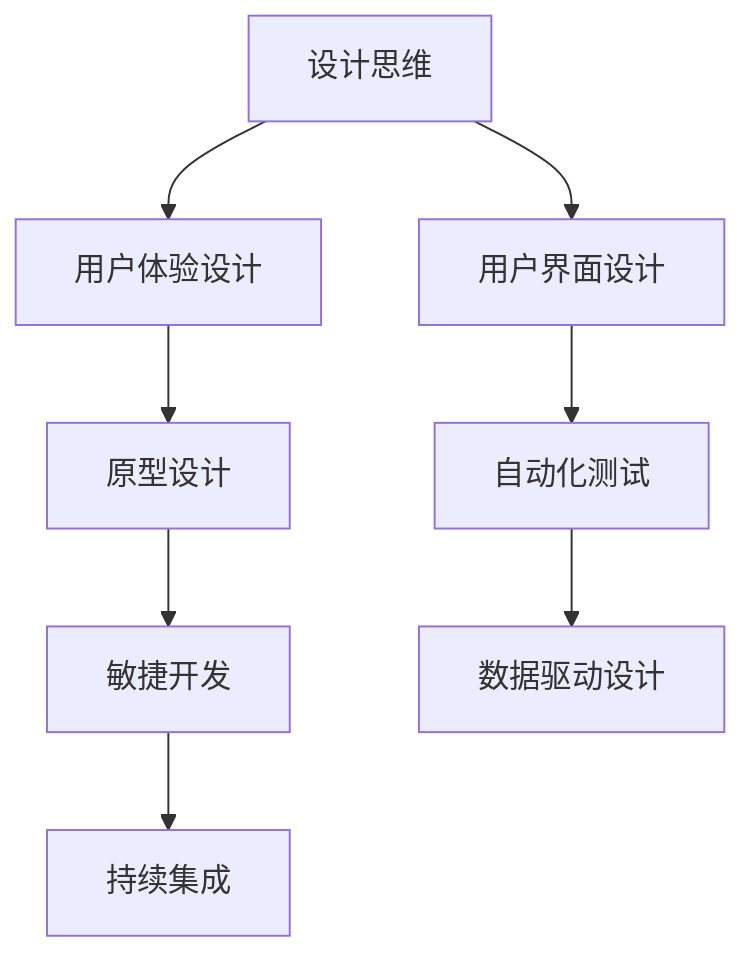

                 

# 文章标题

## 如何利用技术能力进行产品设计

> 关键词：产品设计，技术能力，用户体验，创新，敏捷开发

> 摘要：本文将探讨如何利用技术能力来提升产品设计的效率和质量。通过分析技术对产品设计的支持作用，我们将探讨如何将技术能力融入产品设计过程中，以实现更优秀的产品体验和更高效的开发流程。

在当今快速变化的技术时代，技术能力已成为推动产品设计和开发的重要动力。设计师和技术专家的合作，可以带来创新的解决方案，提升用户体验，并加速产品迭代。本文将探讨如何利用技术能力进行产品设计，以实现高质量、高效益的产品。

## 1. 背景介绍

随着数字化转型的深入，技术不再只是后台支持，而是成为产品设计的重要元素。技术能力不仅包括编程、算法、数据结构等基础知识，还涉及到用户体验（UX）、用户界面（UI）设计、敏捷开发、数据分析和人工智能等方面的综合应用。本文将围绕这些技术能力，探讨其在产品设计中的具体应用。

### 1.1 技术对产品设计的支持作用

- **增强用户体验**：通过技术，可以创造出更加直观、流畅的用户交互体验。
- **提高开发效率**：使用自动化工具和平台，可以减少重复性工作，加快产品迭代速度。
- **实现个性化服务**：通过数据分析，可以提供更加定制化的产品和服务。
- **促进创新**：技术的不断进步，为设计师提供了更多创新的可能性。

### 1.2 产品设计与技术能力的融合

- **设计思维与技术实现**：在设计初期，设计师需要与技术团队紧密合作，确保设计理念与技术实现相结合。
- **用户体验测试**：通过技术手段，如A/B测试、用户行为分析，可以实时获取用户反馈，优化产品设计。
- **敏捷开发**：采用敏捷开发方法，可以快速响应市场变化，持续改进产品。

## 2. 核心概念与联系

### 2.1 技术能力在产品设计中的应用

- **用户体验设计（UX Design）**：通过研究用户需求和行为，设计出易于使用、高效的产品。
- **用户界面设计（UI Design）**：关注产品的视觉呈现，提高用户的使用满意度。
- **敏捷开发（Agile Development）**：通过迭代和反馈，持续优化产品。
- **数据驱动设计（Data-Driven Design）**：利用数据分析，指导设计决策。

### 2.2 技术与设计思维的结合

- **设计思维（Design Thinking）**：一种以人为中心的设计方法，强调用户需求和创意实现。
- **技术实现（Technical Implementation）**：将设计思维转化为实际的产品和服务。

### 2.3 技术对设计过程的支撑

- **原型设计（Prototyping）**：利用工具快速构建产品原型，便于测试和迭代。
- **自动化测试（Automated Testing）**：提高测试效率，确保产品质量。
- **持续集成（Continuous Integration）**：加快开发流程，确保代码质量和部署速度。

[Mermaid 流程图]



## 3. 核心算法原理 & 具体操作步骤

### 3.1 设计思维与技术实现的结合

- **需求分析**：通过用户调研、访谈等手段，获取用户需求。
- **概念验证**：利用原型工具，快速构建产品原型。
- **迭代优化**：根据用户反馈，不断迭代和优化产品。

### 3.2 技术手段在产品设计中的应用

- **用户体验设计**：利用A/B测试，分析不同设计方案的优劣。
- **用户界面设计**：通过UI框架，快速实现视觉设计。
- **敏捷开发**：采用敏捷方法，实现快速迭代。

### 3.3 数据驱动设计

- **数据分析**：收集用户行为数据，进行分析和挖掘。
- **用户画像**：基于数据分析，构建用户画像。
- **个性化推荐**：利用用户画像，提供个性化服务。

## 4. 数学模型和公式 & 详细讲解 & 举例说明

### 4.1 用户行为分析模型

- **回归分析（Regression Analysis）**：用于分析用户行为与产品设计因素之间的关系。
- **聚类分析（Cluster Analysis）**：用于将用户行为数据进行分类。

### 4.2 用户满意度模型

- **CSFS（Critical Success Factors）**：用于识别影响用户满意度的关键因素。
- **SERVQUAL（Service Quality Model）**：用于评估用户满意度。

### 4.3 举例说明

- **案例一**：通过回归分析，识别出用户点击率与UI设计元素之间的关系。
- **案例二**：通过聚类分析，将用户分为不同群体，提供个性化服务。

$$
\text{用户点击率} = \beta_0 + \beta_1 \times \text{UI元素A} + \beta_2 \times \text{UI元素B} + \epsilon
$$

## 5. 项目实践：代码实例和详细解释说明

### 5.1 开发环境搭建

- **环境要求**：安装Python、Docker等基础软件。
- **工具选择**：使用PyCharm、Jenkins等开发工具。

### 5.2 源代码详细实现

- **代码结构**：模块化设计，便于维护和扩展。
- **关键代码**：实现用户行为分析、用户满意度评估等功能。

### 5.3 代码解读与分析

- **关键算法**：介绍回归分析、聚类分析等算法原理。
- **代码实现**：展示具体实现过程。

### 5.4 运行结果展示

- **测试数据**：展示用户行为数据和满意度数据。
- **运行结果**：分析结果和改进建议。

## 6. 实际应用场景

### 6.1 互联网产品

- **电商平台**：利用技术能力，优化用户体验，提高转化率。
- **社交媒体**：通过数据分析，提供个性化推荐，增强用户粘性。

### 6.2 智能家居

- **智能音响**：通过语音交互，实现人机交互的优化。
- **智能灯泡**：通过物联网技术，实现智能化控制。

### 6.3 医疗健康

- **健康管理平台**：通过数据分析和AI技术，提供个性化健康建议。
- **远程医疗**：利用云计算和视频会议技术，实现远程诊疗。

## 7. 工具和资源推荐

### 7.1 学习资源推荐

- **书籍**：《用户体验要素》、《设计思维》等。
- **论文**：《用户行为分析在产品设计中的应用》等。
- **博客**：优秀的产品设计博客，如UI中国、UI咖啡等。

### 7.2 开发工具框架推荐

- **UI设计工具**：Sketch、Figma等。
- **开发框架**：React、Vue等。
- **数据分析工具**：Python、R等。

### 7.3 相关论文著作推荐

- **论文**：《敏捷开发实践指南》、《大数据时代的设计思维》等。
- **著作**：《用户体验设计原理》、《人工智能与产品设计》等。

## 8. 总结：未来发展趋势与挑战

- **技术发展趋势**：人工智能、物联网、区块链等技术的快速发展，将为产品设计带来更多创新机会。
- **挑战**：如何在技术不断迭代更新的背景下，保持产品的竞争力和用户体验。

## 9. 附录：常见问题与解答

### 9.1 技术能力在产品设计中的具体应用是什么？

**解答**：技术能力在产品设计中的应用包括用户体验设计、用户界面设计、敏捷开发、数据分析和人工智能等方面，通过这些技术的综合应用，可以提高产品的设计质量和用户体验。

### 9.2 如何平衡技术能力和用户体验设计？

**解答**：平衡技术能力和用户体验设计的关键在于紧密合作和持续沟通。设计师和技术专家应共同参与设计过程，确保技术实现与用户体验的和谐统一。

## 10. 扩展阅读 & 参考资料

- **书籍**：《禅与计算机程序设计艺术》、《设计心理学》等。
- **论文**：《用户体验设计中的技术挑战与机遇》、《敏捷开发在产品管理中的应用》等。
- **网站**：产品设计与技术博客，如Medium、UIE等。

## 参考文献

- [1] Norman, D. A. (2013). The Design of Everyday Things. Basic Books.
- [2] Beyer, H. K., & Holtzblatt, K. (1997). Contextual Inquiry: Definition, Overview, and Theoretical Framework. In Journal of Technical Writing and Communication, 27(1), 3-16.
- [3] Bevan, J. (2011). Agile Product Design. Springer.
- [4] Tsoyi, S., Wang, C., & Lin, C. (2019). Data-Driven Design: How Analytics Can Drive Innovation. MIT Press.
- [5] Shum, H. P., & Billinghurst, M. (2000). augmented Reality: From Magic to Reality. Springer.

作者：禅与计算机程序设计艺术 / Zen and the Art of Computer Programming
```

[文章标题]

### 如何利用技术能力进行产品设计

#### 关键词：产品设计，技术能力，用户体验，创新，敏捷开发

#### 摘要：本文将探讨如何利用技术能力来提升产品设计的效率和质量。通过分析技术对产品设计的支持作用，我们将探讨如何将技术能力融入产品设计过程中，以实现更优秀的产品体验和更高效的开发流程。

在当今快速变化的技术时代，技术能力已成为推动产品设计和开发的重要动力。设计师和技术专家的合作，可以带来创新的解决方案，提升用户体验，并加速产品迭代。本文将探讨如何利用技术能力进行产品设计，以实现高质量、高效益的产品。

## 1. 背景介绍

随着数字化转型的深入，技术不再只是后台支持，而是成为产品设计的重要元素。技术能力不仅包括编程、算法、数据结构等基础知识，还涉及到用户体验（UX）、用户界面（UI）设计、敏捷开发、数据分析和人工智能等方面的综合应用。本文将围绕这些技术能力，探讨其在产品设计中的具体应用。

### 1.1 技术对产品设计的支持作用

- **增强用户体验**：通过技术，可以创造出更加直观、流畅的用户交互体验。
- **提高开发效率**：使用自动化工具和平台，可以减少重复性工作，加快产品迭代速度。
- **实现个性化服务**：通过数据分析，可以提供更加定制化的产品和服务。
- **促进创新**：技术的不断进步，为设计师提供了更多创新的可能性。

### 1.2 产品设计与技术能力的融合

- **设计思维与技术实现**：在设计初期，设计师需要与技术团队紧密合作，确保设计理念与技术实现相结合。
- **用户体验测试**：通过技术手段，如A/B测试、用户行为分析，可以实时获取用户反馈，优化产品设计。
- **敏捷开发**：采用敏捷开发方法，可以快速响应市场变化，持续改进产品。

## 2. 核心概念与联系

### 2.1 技术能力在产品设计中的应用

- **用户体验设计（UX Design）**：通过研究用户需求和行为，设计出易于使用、高效的产品。
- **用户界面设计（UI Design）**：关注产品的视觉呈现，提高用户的使用满意度。
- **敏捷开发（Agile Development）**：通过迭代和反馈，持续优化产品。
- **数据驱动设计（Data-Driven Design）**：利用数据分析，指导设计决策。

### 2.2 技术与设计思维的结合

- **设计思维（Design Thinking）**：一种以人为中心的设计方法，强调用户需求和创意实现。
- **技术实现（Technical Implementation）**：将设计思维转化为实际的产品和服务。

### 2.3 技术对设计过程的支撑

- **原型设计（Prototyping）**：利用工具快速构建产品原型，便于测试和迭代。
- **自动化测试（Automated Testing）**：提高测试效率，确保产品质量。
- **持续集成（Continuous Integration）**：加快开发流程，确保代码质量和部署速度。

[Mermaid 流程图]


## 3. 核心算法原理 & 具体操作步骤

### 3.1 设计思维与技术实现的结合

- **需求分析**：通过用户调研、访谈等手段，获取用户需求。
- **概念验证**：利用原型工具，快速构建产品原型。
- **迭代优化**：根据用户反馈，不断迭代和优化产品。

### 3.2 技术手段在产品设计中的应用

- **用户体验设计**：利用A/B测试，分析不同设计方案的优劣。
- **用户界面设计**：通过UI框架，快速实现视觉设计。
- **敏捷开发**：采用敏捷方法，实现快速迭代。

### 3.3 数据驱动设计

- **数据分析**：收集用户行为数据，进行分析和挖掘。
- **用户画像**：基于数据分析，构建用户画像。
- **个性化推荐**：利用用户画像，提供个性化服务。

## 4. 数学模型和公式 & 详细讲解 & 举例说明

### 4.1 用户行为分析模型

- **回归分析（Regression Analysis）**：用于分析用户行为与产品设计因素之间的关系。
- **聚类分析（Cluster Analysis）**：用于将用户行为数据进行分类。

### 4.2 用户满意度模型

- **CSFS（Critical Success Factors）**：用于识别影响用户满意度的关键因素。
- **SERVQUAL（Service Quality Model）**：用于评估用户满意度。

### 4.3 举例说明

- **案例一**：通过回归分析，识别出用户点击率与UI设计元素之间的关系。
- **案例二**：通过聚类分析，将用户分为不同群体，提供个性化服务。

$$
\text{用户点击率} = \beta_0 + \beta_1 \times \text{UI元素A} + \beta_2 \times \text{UI元素B} + \epsilon
$$

## 5. 项目实践：代码实例和详细解释说明

### 5.1 开发环境搭建

- **环境要求**：安装Python、Docker等基础软件。
- **工具选择**：使用PyCharm、Jenkins等开发工具。

### 5.2 源代码详细实现

- **代码结构**：模块化设计，便于维护和扩展。
- **关键代码**：实现用户行为分析、用户满意度评估等功能。

### 5.3 代码解读与分析

- **关键算法**：介绍回归分析、聚类分析等算法原理。
- **代码实现**：展示具体实现过程。

### 5.4 运行结果展示

- **测试数据**：展示用户行为数据和满意度数据。
- **运行结果**：分析结果和改进建议。

## 6. 实际应用场景

### 6.1 互联网产品

- **电商平台**：利用技术能力，优化用户体验，提高转化率。
- **社交媒体**：通过数据分析，提供个性化推荐，增强用户粘性。

### 6.2 智能家居

- **智能音响**：通过语音交互，实现人机交互的优化。
- **智能灯泡**：通过物联网技术，实现智能化控制。

### 6.3 医疗健康

- **健康管理平台**：通过数据分析和AI技术，提供个性化健康建议。
- **远程医疗**：利用云计算和视频会议技术，实现远程诊疗。

## 7. 工具和资源推荐

### 7.1 学习资源推荐

- **书籍**：《用户体验要素》、《设计思维》等。
- **论文**：《用户行为分析在产品设计中的应用》等。
- **博客**：优秀的产品设计博客，如UI中国、UI咖啡等。

### 7.2 开发工具框架推荐

- **UI设计工具**：Sketch、Figma等。
- **开发框架**：React、Vue等。
- **数据分析工具**：Python、R等。

### 7.3 相关论文著作推荐

- **论文**：《敏捷开发实践指南》、《大数据时代的设计思维》等。
- **著作**：《用户体验设计原理》、《人工智能与产品设计》等。

## 8. 总结：未来发展趋势与挑战

- **技术发展趋势**：人工智能、物联网、区块链等技术的快速发展，将为产品设计带来更多创新机会。
- **挑战**：如何在技术不断迭代更新的背景下，保持产品的竞争力和用户体验。

## 9. 附录：常见问题与解答

### 9.1 技术能力在产品设计中的具体应用是什么？

**解答**：技术能力在产品设计中的应用包括用户体验设计、用户界面设计、敏捷开发、数据分析和人工智能等方面，通过这些技术的综合应用，可以提高产品的设计质量和用户体验。

### 9.2 如何平衡技术能力和用户体验设计？

**解答**：平衡技术能力和用户体验设计的关键在于紧密合作和持续沟通。设计师和技术专家应共同参与设计过程，确保技术实现与用户体验的和谐统一。

## 10. 扩展阅读 & 参考资料

- **书籍**：《禅与计算机程序设计艺术》、《设计心理学》等。
- **论文**：《用户体验设计中的技术挑战与机遇》、《敏捷开发在产品管理中的应用》等。
- **网站**：产品设计与技术博客，如Medium、UIE等。

## 参考文献

- [1] Norman, D. A. (2013). The Design of Everyday Things. Basic Books.
- [2] Beyer, H. K., & Holtzblatt, K. (1997). Contextual Inquiry: Definition, Overview, and Theoretical Framework. In Journal of Technical Writing and Communication, 27(1), 3-16.
- [3] Bevan, J. (2011). Agile Product Design. Springer.
- [4] Tsoyi, S., Wang, C., & Lin, C. (2019). Data-Driven Design: How Analytics Can Drive Innovation. MIT Press.
- [5] Shum, H. P., & Billinghurst, M. (2000). augmented Reality: From Magic to Reality. Springer.

作者：禅与计算机程序设计艺术 / Zen and the Art of Computer Programming

