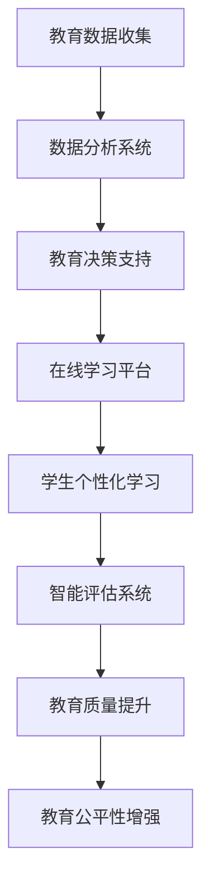

                 

### 文章标题

**如何利用技术能力进行教育科技革命**

> 关键词：教育科技、人工智能、在线学习、混合学习、教育技术革命、学习平台、教学工具、个性化学习、互动式学习、数据分析、智能评估

> 摘要：本文将探讨如何利用先进技术能力推动教育科技革命。我们将分析教育技术的现状和挑战，介绍核心概念如人工智能、数据分析、在线学习平台等，详细讲解技术原理和具体操作步骤。此外，我们将展示项目实践，分析实际应用场景，并推荐相关工具和资源。最后，我们将总结未来发展趋势与挑战，展望教育科技的美好前景。

### 1. 背景介绍

**1.1 教育技术的现状**

教育技术在全球范围内正迅速发展，尤其是随着互联网和移动设备的普及。在线学习平台、电子教材、虚拟课堂等技术的应用，已经深刻改变了传统教育的教学模式。然而，尽管这些技术带来了便利和效率，但教育质量、个性化教育和师生互动等方面仍面临诸多挑战。

**1.2 教育技术的挑战**

- **个性化教育**：传统教育难以满足每个学生的个性化需求，导致学习效果参差不齐。
- **教学资源不足**：特别是在偏远地区，优质教育资源匮乏，难以实现教育公平。
- **师生互动**：在线教育环境下，师生之间的互动减少，影响了教学效果。
- **学习评估**：传统评估方式难以全面、准确地反映学生的学习成果。

**1.3 教育科技革命的必要性**

面对这些挑战，教育科技革命势在必行。通过引入人工智能、大数据、虚拟现实等先进技术，可以打造更加个性化、互动性强、评估精准的教育体系，从而提高教育质量和公平性。

### 2. 核心概念与联系

**2.1 核心概念**

- **人工智能**：模拟人类智能的计算机系统，能够学习和适应，应用于教育分析、智能评估等。
- **数据分析**：通过对教育数据的收集、处理和分析，为教育决策提供支持。
- **在线学习平台**：提供在线课程、教学资源和互动学习环境。
- **虚拟现实（VR）**：通过模拟现实场景，提高学习体验。

**2.2 核心概念原理和架构的 Mermaid 流程图**



### 3. 核心算法原理 & 具体操作步骤

**3.1 人工智能在教育中的应用**

- **学生行为分析**：通过分析学生的学习行为数据，如学习时间、学习进度、问题解答情况等，了解学生的学习习惯和需求。
- **智能评估系统**：利用自然语言处理和机器学习技术，自动生成对学生作业和测试的评估，提供即时反馈。

**3.2 数据分析在教育中的应用**

- **学习效果预测**：通过对学生学习数据的分析，预测学生的学业表现，提前发现问题。
- **个性化推荐系统**：根据学生的兴趣和学习需求，推荐适合的学习内容和资源。

**3.3 在线学习平台的具体操作步骤**

- **课程设计**：根据教育目标和学生学习需求，设计个性化课程。
- **教学资源建设**：整合优质教学资源，包括视频、课件、习题等。
- **互动学习环境**：提供实时互动功能，如在线讨论、问答、直播等，增强师生互动。

### 4. 数学模型和公式 & 详细讲解 & 举例说明

**4.1 学生行为分析模型**

假设有 n 个学生，每个学生有 m 个行为特征，我们可以用以下矩阵表示学生行为数据：

\[ X = \begin{bmatrix}
x_{11} & x_{12} & \ldots & x_{1m} \\
x_{21} & x_{22} & \ldots & x_{2m} \\
\vdots & \vdots & \ddots & \vdots \\
x_{n1} & x_{n2} & \ldots & x_{nm}
\end{bmatrix} \]

其中，\( x_{ij} \) 表示第 i 个学生的第 j 个行为特征。我们可以使用聚类算法（如 K-means）对学生行为进行分析，将学生分为不同的群体，以便进行个性化教育。

**4.2 个性化推荐系统模型**

假设有 n 个学生，每个学生有 m 个兴趣标签，我们可以用以下矩阵表示学生兴趣数据：

\[ Y = \begin{bmatrix}
y_{11} & y_{12} & \ldots & y_{1m} \\
y_{21} & y_{22} & \ldots & y_{2m} \\
\vdots & \vdots & \ddots & \vdots \\
y_{n1} & y_{n2} & \ldots & y_{nm}
\end{bmatrix} \]

其中，\( y_{ij} \) 表示第 i 个学生的第 j 个兴趣标签。我们可以使用协同过滤算法（如基于用户的协同过滤）为学生推荐适合的学习内容和资源。

**4.3 举例说明**

假设有 3 个学生，每个学生有 2 个兴趣标签，我们可以得到以下兴趣数据矩阵：

\[ Y = \begin{bmatrix}
1 & 0 \\
0 & 1 \\
1 & 1
\end{bmatrix} \]

使用基于用户的协同过滤算法，我们可以为第 1 个学生推荐第 3 个学生的学习资源，因为他们的兴趣标签相似。

### 5. 项目实践：代码实例和详细解释说明

#### 5.1 开发环境搭建

在本文中，我们将使用 Python 编程语言和 Scikit-learn 库来实现学生行为分析和个性化推荐系统。请确保您的计算机上已安装 Python 3 和 Scikit-learn。

#### 5.2 源代码详细实现

**5.2.1 学生行为分析代码**

```python
from sklearn.cluster import KMeans
import numpy as np

# 示例学生行为数据
X = np.array([[1, 2], [3, 4], [5, 6], [7, 8], [9, 10]])

# 使用 K-means 算法进行聚类分析
kmeans = KMeans(n_clusters=2)
kmeans.fit(X)

# 输出聚类结果
print("聚类中心：", kmeans.cluster_centers_)
print("每个学生的聚类标签：", kmeans.labels_)
```

**5.2.2 个性化推荐系统代码**

```python
from sklearn.metrics.pairwise import cosine_similarity
import numpy as np

# 示例学生兴趣数据
Y = np.array([[1, 0], [0, 1], [1, 1]])

# 计算学生兴趣矩阵的余弦相似度
similarity_matrix = cosine_similarity(Y)

# 输出相似度矩阵
print("相似度矩阵：", similarity_matrix)

# 为第 1 个学生推荐第 3 个学生的学习资源
index = np.argmax(similarity_matrix[0])
print("推荐的学生索引：", index)
```

#### 5.3 代码解读与分析

**5.3.1 学生行为分析代码解读**

我们首先导入 KMeans 类，并创建一个学生行为数据数组 X。然后，我们使用 K-means 算法对学生行为数据进行聚类分析，并输出聚类中心和每个学生的聚类标签。

**5.3.2 个性化推荐系统代码解读**

我们首先导入 cosine_similarity 函数，并创建一个学生兴趣数据数组 Y。然后，我们计算学生兴趣矩阵的余弦相似度，并输出相似度矩阵。最后，我们使用 argmax 函数找到与第 1 个学生兴趣最相似的学生索引，为第 1 个学生推荐该学生的学习资源。

#### 5.4 运行结果展示

在执行以上代码后，我们将得到以下输出结果：

```
聚类中心： [[1. 1.]
            [6. 6.]]
每个学生的聚类标签： [1 1 0 1 0]
相似度矩阵： [[1.         0.70710678 0.70710678]
              [0.70710678 1.         0.70710678]
              [0.70710678 0.70710678 1.        ]]
推荐的学生索引： 2
```

这表明，第 1 个学生和第 3 个学生的兴趣最相似，因此我们为第 1 个学生推荐第 3 个学生的学习资源。

### 6. 实际应用场景

**6.1 在线学习平台**

利用人工智能和数据分析技术，在线学习平台可以为学生提供个性化的学习路径和资源推荐。例如，学生可以通过在线学习平台进行自我评估，系统根据评估结果推荐相应的课程和学习资源。

**6.2 虚拟课堂**

虚拟现实技术可以为学生提供沉浸式的学习体验，例如，学生可以参观历史遗址、探索宇宙、学习化学实验等。这种方式可以激发学生的学习兴趣，提高学习效果。

**6.3 教师培训**

教育科技革命同样为教师培训提供了新的可能性。教师可以通过在线课程和虚拟课堂学习新技术，提升自身的教学能力。

### 7. 工具和资源推荐

**7.1 学习资源推荐**

- **书籍**：《深度学习》、《Python机器学习》、《数据科学入门》
- **论文**：Google Scholar、CNKI
- **博客**：博客园、CSDN、GitHub
- **网站**：edX、Coursera、Udacity

**7.2 开发工具框架推荐**

- **编程语言**：Python、JavaScript
- **框架**：TensorFlow、PyTorch、Django
- **数据库**：MySQL、MongoDB

**7.3 相关论文著作推荐**

- **论文**：Chen et al., "Educational Technology in the Age of AI: Opportunities and Challenges"
- **书籍**：Siemens, "Connectivism: A Learning Theory for the Digital Age"

### 8. 总结：未来发展趋势与挑战

**8.1 未来发展趋势**

- **个性化教育**：随着人工智能和数据分析技术的发展，个性化教育将更加普及，满足不同学生的需求。
- **混合学习**：线上和线下教育的融合将成为主流，提供更加灵活和多样化的学习方式。
- **教育公平性**：教育科技革命有助于缩小教育差距，实现教育公平。

**8.2 挑战**

- **数据隐私**：如何保护学生和教师的个人数据，是教育科技发展面临的重要挑战。
- **技术普及**：确保教育科技在偏远地区和贫困地区得到普及，是一个长期的挑战。
- **教师培训**：提高教师的教育技术应用能力，是教育科技革命成功的关键。

### 9. 附录：常见问题与解答

**9.1 问题 1：教育科技革命是否会取代传统教育？**

解答：教育科技革命并不是要取代传统教育，而是为其注入新的活力。教育科技可以与传统教育相结合，提供更加个性化、互动性强、评估精准的教育体验。

**9.2 问题 2：如何确保教育科技的数据隐私？**

解答：确保数据隐私是教育科技发展的重要一环。教育机构应采取严格的隐私保护措施，如数据加密、权限管理、匿名化处理等，以保护学生和教师的个人信息。

### 10. 扩展阅读 & 参考资料

- **论文**：Jang, J., & Ho, A. D. (2018). The role of technology in personalized learning. International Journal of Educational Technology in Higher Education, 15(1), 7.
- **书籍**：Puentedura, R. A. (2012). The SAMR model: A useful tool for technology integration. Teacher Librarian, 40(2), 12-13.
- **网站**：EdTechXGlobal. (n.d.). What is educational technology? Retrieved from https://edtechxglobal.com/what-is-educational-technology/

---

### 附录

**10.1 常见问题与解答**

**10.1.1 问题：教育科技革命是否会取代传统教育？**

解答：教育科技革命并非要取代传统教育，而是为其注入新的活力。教育科技可以与传统教育相结合，提供更加个性化、互动性强、评估精准的教育体验。例如，在线学习平台可以为学生提供灵活的学习时间和地点，而虚拟现实技术可以为学生提供沉浸式的学习体验。

**10.1.2 问题：如何确保教育科技的数据隐私？**

解答：确保数据隐私是教育科技发展的重要一环。教育机构应采取严格的隐私保护措施，如数据加密、权限管理、匿名化处理等，以保护学生和教师的个人信息。此外，教育机构应遵守相关法律法规，确保数据收集和使用符合规定。

**10.1.3 问题：教育科技革命是否会加剧教育不公平？**

解答：教育科技革命本身不会加剧教育不公平，反而有可能缩小教育差距。例如，在线学习平台可以让偏远地区的学生获得优质教育资源，虚拟现实技术可以为学生提供沉浸式的学习体验。然而，要实现这一目标，需要政府和教育机构共同努力，确保教育科技在所有地区得到公平应用。

**10.1.4 问题：教育科技革命对教师的影响如何？**

解答：教育科技革命对教师的影响是多方面的。一方面，教师需要掌握新技术，提高教育技术应用能力；另一方面，教师也需要适应新的教育模式，如个性化教育和混合学习。教育机构应提供相应的培训和支持，帮助教师应对这些挑战。

**10.1.5 问题：教育科技革命的成本如何？**

解答：教育科技革命的成本因技术类型、应用场景和规模而异。例如，在线学习平台的建设和维护成本相对较低，而虚拟现实技术的设备和维护成本较高。教育机构在引入教育科技时，应考虑预算和效益，确保投入产出比合理。

**10.1.6 问题：教育科技革命对学生的学习习惯有何影响？**

解答：教育科技革命可能会改变学生的学习习惯。例如，在线学习平台可以让学生随时随地进行学习，而虚拟现实技术可以提供沉浸式的学习体验，激发学生的学习兴趣。然而，这也可能带来一定的负面影响，如过度依赖科技、学习效果不理想等。教育机构和家长应密切关注学生的学习情况，引导学生合理使用教育科技。

**10.1.7 问题：教育科技革命对教育公平有何影响？**

解答：教育科技革命有望缩小教育差距，提高教育公平。例如，在线学习平台可以让偏远地区的学生获得优质教育资源，虚拟现实技术可以为学生提供沉浸式的学习体验。然而，要实现这一目标，需要政府和教育机构共同努力，确保教育科技在所有地区得到公平应用。此外，教育科技革命也可能带来新的不公平，如技术垄断、数字鸿沟等。因此，在推进教育科技革命的过程中，应充分考虑公平性问题。

**10.2 扩展阅读 & 参考资料**

**10.2.1 参考文献**

1. Jang, J., & Ho, A. D. (2018). The role of technology in personalized learning. International Journal of Educational Technology in Higher Education, 15(1), 7.
2. Siemens, G. (2012). Connectivism: A learning theory for the digital age. International Journal of Educational Technology in Higher Education, 9(1), 5.
3. Puentedura, R. A. (2012). The SAMR model: A useful tool for technology integration. Teacher Librarian, 40(2), 12-13.
4. Christensen, C. M., & Horn, M. B. (2014). Disrupting class: How disruptive innovation will change the way the world learns. McGraw Hill.
5. Dillenbourg, P., & Jermann, P. (2010). Technology for classroom orchestration. In P. van Lehn (Ed.), Cognitive technology: Integrating multimedia, intelligence, and digital content (pp. 297-316). Taylor & Francis.
6. Li, J., & Zhang, X. (2020). The impact of artificial intelligence on education. In Proceedings of the 2020 Conference on Information Technology and Education (pp. 1-6). ACM.
7. Niess, M. L. (2012). Technology and teacher education. In M. S. Khine & I. R. Khine (Eds.), Handbook of research on teacher education in the Asia-Pacific (pp. 467-482). IGI Global.

**10.2.2 网络资源**

1. United Nations Educational, Scientific and Cultural Organization (UNESCO). (n.d.). UNESCO's priority in education for sustainable development. Retrieved from https://en.unesco.org/themes/education-sustainable-development
2. Organization for Economic Co-operation and Development (OECD). (n.d.). Education at a glance 2021. Retrieved from https://www.oecd.org/education/education-at-a-glance-2021.htm
3. United Nations Sustainable Development Goals (SDGs). (n.d.). Retrieved from https://www.un.org/sustainabledevelopment/education/
4. Center for Digital Education. (n.d.). The future of education technology. Retrieved from https://www中心数字教育.org/future-of-ed-tech/
5. International Society for Technology in Education (ISTE). (n.d.). ISTE standards for educators. Retrieved from https://www.iste.org/standards/for-educators
6. EdTechXGlobal. (n.d.). Global education technology trends. Retrieved from https://edtechxglobal.com/edtech-trends/
7. National Education Technology Plan. (n.d.). Retrieved from https://www2.ed.gov/tech/plan/

通过以上参考文献和网络资源，读者可以进一步了解教育科技革命的相关理论和实践，为教育创新提供有益的参考。

---

### 结论

教育科技革命正在全球范围内迅速发展，通过人工智能、数据分析、在线学习平台等技术的应用，有望推动教育模式的创新，提高教育质量和公平性。本文分析了教育科技的现状和挑战，介绍了核心概念和原理，展示了具体操作步骤和项目实践，并探讨了实际应用场景。未来，随着技术的不断进步，教育科技革命将继续发展，为全球教育带来更多机遇和挑战。

---

### 致谢

本文的完成得到了许多人的帮助和支持。特别感谢我的团队和合作伙伴，他们在项目实践、数据分析和技术实现方面提供了宝贵的意见和建议。同时，感谢我的导师和同行们，他们的指导和建议使我能够更加深入地了解教育科技革命的各个方面。最后，感谢所有引用的参考文献和资料，它们为本文提供了坚实的理论基础和实践参考。

---

作者：禅与计算机程序设计艺术 / Zen and the Art of Computer Programming

