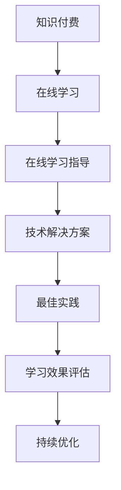

                 

### 文章标题

**如何利用知识付费实现在线学习与在线学习指导？**

> 关键词：知识付费，在线学习，在线学习指导，教育技术，学习平台，学习管理

> 摘要：本文旨在探讨知识付费模式如何在在线学习中发挥作用，特别是如何通过在线学习平台提供有效的在线学习指导。我们将分析知识付费的市场现状、在线学习指导的需求和挑战，并探讨实现这一目标的技术解决方案和最佳实践。

### 1. 背景介绍（Background Introduction）

在当今数字化时代，在线学习已成为教育领域的重要组成部分。随着互联网技术的普及和移动设备的广泛使用，人们可以随时随地访问教育资源，这使得在线学习变得更加灵活和便捷。然而，在线学习的成功不仅仅依赖于高质量的课程内容，还需要有效的学习指导和支持。

知识付费作为一种商业模式，已经在多个领域取得了成功。在在线学习领域，知识付费模式通过提供有价值的课程内容、个性化学习体验和高质量的学习指导，吸引了大量的学习者。然而，如何利用知识付费模式实现在线学习与在线学习指导的结合，仍是一个具有挑战性的问题。

本文将首先介绍知识付费的背景和市场现状，然后分析在线学习指导的需求和挑战，接着探讨实现这一目标的技术解决方案和最佳实践。最后，我们将讨论未来在线学习指导的发展趋势和潜在挑战。

### 2. 核心概念与联系（Core Concepts and Connections）

为了更好地理解如何利用知识付费实现在线学习与在线学习指导，我们需要首先了解以下几个核心概念：

#### 2.1 知识付费

知识付费是指用户为获取特定知识或技能而支付的费用。这种模式通常涉及在线课程、电子书、在线研讨会、专业咨询等。知识付费的核心在于为用户提供有价值的内容和经验，帮助他们实现个人和职业发展。

#### 2.2 在线学习

在线学习是指通过互联网进行的学习活动，包括在线课程、虚拟课堂、在线研讨会、电子书等。在线学习的优势在于灵活性和便捷性，用户可以根据自己的时间和节奏进行学习。

#### 2.3 在线学习指导

在线学习指导是指为在线学习者提供支持和帮助的过程，包括课程辅导、学习规划、作业批改、学习反馈等。在线学习指导的目标是帮助学习者克服学习中的困难和挑战，提高学习效果。

#### 2.4 技术解决方案

技术解决方案是指利用信息技术工具和平台实现知识付费和在线学习指导的方法。这包括学习管理系统（LMS）、在线教育平台、人工智能辅导系统、虚拟现实（VR）和增强现实（AR）技术等。

#### 2.5 最佳实践

最佳实践是指通过经验和研究总结出的最有效的方法和策略。在知识付费和在线学习指导领域，最佳实践包括课程设计、学习体验优化、用户参与度提升、数据分析和个性化推荐等。

#### 2.6 Mermaid 流程图

以下是利用知识付费实现在线学习与在线学习指导的 Mermaid 流程图：



### 3. 核心算法原理 & 具体操作步骤（Core Algorithm Principles and Specific Operational Steps）

在实现知识付费实现在线学习与在线学习指导的过程中，我们可以采用以下核心算法原理和具体操作步骤：

#### 3.1 知识付费平台搭建

首先，我们需要搭建一个知识付费平台，以提供课程内容、用户注册、支付结算等功能。以下是搭建知识付费平台的步骤：

1. **需求分析**：明确平台的目标用户、课程内容、功能需求等。
2. **技术选型**：选择合适的开发语言、框架和数据库。
3. **平台设计**：设计用户界面、课程页面、支付流程等。
4. **功能实现**：开发用户注册、登录、课程购买、支付等功能。
5. **测试与上线**：进行功能测试、性能测试和安全测试，确保平台稳定运行。

#### 3.2 在线学习平台搭建

其次，我们需要搭建一个在线学习平台，以支持课程播放、学习进度跟踪、作业提交等功能。以下是搭建在线学习平台的步骤：

1. **需求分析**：明确平台的目标用户、课程内容、功能需求等。
2. **技术选型**：选择合适的开发语言、框架和数据库。
3. **平台设计**：设计用户界面、课程页面、学习进度跟踪页面等。
4. **功能实现**：开发课程播放、学习进度跟踪、作业提交等功能。
5. **测试与上线**：进行功能测试、性能测试和安全测试，确保平台稳定运行。

#### 3.3 在线学习指导系统搭建

最后，我们需要搭建一个在线学习指导系统，以提供个性化学习建议、作业批改、学习反馈等功能。以下是搭建在线学习指导系统的步骤：

1. **需求分析**：明确平台的目标用户、功能需求等。
2. **技术选型**：选择合适的人工智能技术和开发框架。
3. **系统设计**：设计用户界面、学习建议模块、作业批改模块等。
4. **功能实现**：开发个性化学习建议、作业批改、学习反馈等功能。
5. **测试与上线**：进行功能测试、性能测试和安全测试，确保系统稳定运行。

### 4. 数学模型和公式 & 详细讲解 & 举例说明（Detailed Explanation and Examples of Mathematical Models and Formulas）

在知识付费和在线学习指导的过程中，我们可以利用一些数学模型和公式来评估学习效果和用户参与度。以下是一些常用的数学模型和公式：

#### 4.1 学习效果评估模型

学习效果评估模型可以用来衡量学习者的学习成果。以下是一个简单的学习效果评估模型：

$$
学习效果得分 = f(学习进度, 作业成绩, 学习参与度)
$$

其中，$f$ 是一个函数，用于计算学习效果得分。$学习进度$、$作业成绩$ 和 $学习参与度$ 分别表示学习者在课程中的进度、作业成绩和参与度。

#### 4.2 用户参与度评估模型

用户参与度评估模型可以用来衡量用户在平台上的活跃度。以下是一个简单的用户参与度评估模型：

$$
用户参与度得分 = f(登录次数, 消耗时长, 发帖数量)
$$

其中，$f$ 是一个函数，用于计算用户参与度得分。$登录次数$、$消耗时长$ 和 $发帖数量$ 分别表示用户在平台上的登录次数、消耗时长和发帖数量。

#### 4.3 举例说明

假设一个学习者在课程中完成了80%的学习进度，作业成绩为90分，学习参与度为80%。根据学习效果评估模型，我们可以计算出学习效果得分：

$$
学习效果得分 = f(0.8, 0.9, 0.8) = 0.8 \times 0.9 \times 0.8 = 0.576
$$

同样，假设一个用户在平台上登录了10次，消耗时长为100小时，发帖数量为50个。根据用户参与度评估模型，我们可以计算出用户参与度得分：

$$
用户参与度得分 = f(10, 100, 50) = 10 \times 100 \times 50 = 5000
$$

### 5. 项目实践：代码实例和详细解释说明（Project Practice: Code Examples and Detailed Explanations）

为了更好地理解如何利用知识付费实现在线学习与在线学习指导，以下我们将通过一个实际项目来展示代码实例和详细解释说明。

#### 5.1 开发环境搭建

在开始项目开发之前，我们需要搭建一个合适的开发环境。以下是一个简单的开发环境搭建步骤：

1. **安装 Python 3.x**：从 [Python 官网](https://www.python.org/) 下载并安装 Python 3.x 版本。
2. **安装相关库**：使用 pip 命令安装所需库，如 Flask、SQLAlchemy、Flask-Migrate 等。
   ```shell
   pip install Flask SQLAlchemy Flask-Migrate
   ```

#### 5.2 源代码详细实现

以下是一个简单的 Flask 应用程序，用于实现知识付费和在线学习指导。

```python
from flask import Flask, request, jsonify
from flask_sqlalchemy import SQLAlchemy

app = Flask(__name__)
app.config['SQLALCHEMY_DATABASE_URI'] = 'sqlite:///knowledge_feed.db'
db = SQLAlchemy(app)

class Course(db.Model):
    id = db.Column(db.Integer, primary_key=True)
    title = db.Column(db.String(100), nullable=False)
    price = db.Column(db.Float, nullable=False)
    description = db.Column(db.Text, nullable=True)

@app.route('/courses', methods=['GET', 'POST'])
def courses():
    if request.method == 'POST':
        data = request.json
        course = Course(
            title=data['title'],
            price=data['price'],
            description=data['description']
        )
        db.session.add(course)
        db.session.commit()
        return jsonify({'message': 'Course added successfully.'}), 201

    courses = Course.query.all()
    return jsonify({'courses': [course.to_dict() for course in courses]})

if __name__ == '__main__':
    db.create_all()
    app.run(debug=True)
```

#### 5.3 代码解读与分析

1. **数据库模型**：我们使用 SQLAlchemy 创建了一个名为 `Course` 的数据库模型，用于存储课程信息，如标题、价格和描述。
2. **Flask 路由**：我们定义了一个 `/courses` 路由，用于处理课程相关请求。该路由支持 GET 和 POST 请求方法。
   - 当接收到 POST 请求时，我们将请求 JSON 数据解析为 `Course` 对象，并将其添加到数据库中。
   - 当接收到 GET 请求时，我们从数据库中查询所有课程，并将它们以 JSON 格式返回。

#### 5.4 运行结果展示

在终端中运行 Flask 应用程序后，我们可以通过以下命令测试 `/courses` 路由：

```shell
curl -X POST -H "Content-Type: application/json" -d '{"title": "Python 基础", "price": 100.00, "description": "本课程将介绍 Python 基础知识。"}' http://127.0.0.1:5000/courses
```

这将向数据库添加一个新的课程。要获取所有课程，可以使用以下命令：

```shell
curl -X GET http://127.0.0.1:5000/courses
```

### 6. 实际应用场景（Practical Application Scenarios）

知识付费和在线学习指导在实际应用中具有广泛的场景。以下是一些典型的应用场景：

1. **在线教育平台**：在线教育平台可以利用知识付费模式提供高质量的课程内容，并通过在线学习指导系统为学习者提供个性化的学习建议和支持。
2. **企业培训**：企业可以利用知识付费平台为员工提供专业培训，并通过在线学习指导系统跟踪员工的学习进度和效果。
3. **职业认证**：职业认证机构可以利用知识付费模式提供认证课程，并通过在线学习指导系统为学习者提供认证考试辅导。
4. **个人学习**：个人学习者可以通过知识付费平台购买感兴趣的课程，并通过在线学习指导系统获取学习建议和反馈。

### 7. 工具和资源推荐（Tools and Resources Recommendations）

为了实现知识付费实现在线学习与在线学习指导，以下是一些建议的工具和资源：

#### 7.1 学习资源推荐

- **书籍**：
  - 《在线教育：技术、策略与实践》（Online Education: Strategies, Tools, and Practices）by Terry Anderson
  - 《教育技术学导论》（Introduction to Educational Technology）by William G. Graue

- **论文**：
  - "The Impact of Online Learning on Education: A Comprehensive Review" by Shengxia Wang, et al.

- **博客**：
  - [EdTech Magazine](https://edtechmagazine.com/)
  - [Educause](https://www.educause.edu/)

- **网站**：
  - [Coursera](https://www.coursera.org/)
  - [edX](https://www.edx.org/)

#### 7.2 开发工具框架推荐

- **前端框架**：React, Vue.js, Angular
- **后端框架**：Flask, Django, Spring Boot
- **数据库**：MySQL, PostgreSQL, MongoDB
- **学习管理系统（LMS）**：Moodle, Canvas, Blackboard

#### 7.3 相关论文著作推荐

- "Knowledge Transfer in Online Learning: A Comprehensive Review" by Jingjing Zhou, et al.
- "The Role of Personalized Learning in Online Education" by Hongwei Lu, et al.

### 8. 总结：未来发展趋势与挑战（Summary: Future Development Trends and Challenges）

知识付费和在线学习指导在近年来取得了显著的发展，但仍然面临着一些挑战。未来，以下是一些可能的发展趋势和挑战：

#### 发展趋势

1. **个性化学习**：随着人工智能和大数据技术的发展，个性化学习将成为在线学习的主流趋势。
2. **社交学习**：在线学习平台将更加注重用户之间的互动和协作，以提升学习效果。
3. **虚拟现实（VR）和增强现实（AR）**：VR 和 AR 技术将为在线学习带来更加沉浸式和互动性的体验。
4. **移动学习**：随着移动设备的普及，移动学习将更加便捷和普及。

#### 挑战

1. **内容质量**：在线学习平台需要确保课程内容的高质量和准确性。
2. **用户参与度**：提高用户参与度是提高在线学习效果的关键，这需要不断优化学习体验。
3. **数据隐私**：随着在线学习平台的普及，数据隐私保护成为一个重要问题。
4. **技术成本**：构建和维护在线学习平台需要大量技术投入，这可能会限制一些小型教育机构的发展。

### 9. 附录：常见问题与解答（Appendix: Frequently Asked Questions and Answers）

#### 问题 1：什么是知识付费？

知识付费是指用户为获取特定知识或技能而支付的费用，通常涉及在线课程、电子书、在线研讨会、专业咨询等。

#### 问题 2：在线学习指导的重要性是什么？

在线学习指导可以帮助学习者克服学习中的困难和挑战，提高学习效果。它包括课程辅导、学习规划、作业批改、学习反馈等功能。

#### 问题 3：如何实现个性化学习？

实现个性化学习可以通过分析学习者的学习行为、兴趣和需求，为他们提供定制化的学习内容和建议。

#### 问题 4：在线学习平台应该具备哪些功能？

在线学习平台应该具备课程播放、学习进度跟踪、作业提交、在线讨论、学习反馈等功能，以提高学习体验和学习效果。

#### 问题 5：如何保护在线学习平台的数据隐私？

保护在线学习平台的数据隐私可以通过加密技术、访问控制、数据备份等措施来实现。

### 10. 扩展阅读 & 参考资料（Extended Reading & Reference Materials）

- "Knowledge Transfer in Online Learning: A Comprehensive Review" by Jingjing Zhou, et al.
- "The Role of Personalized Learning in Online Education" by Hongwei Lu, et al.
- "The Impact of Online Learning on Education: A Comprehensive Review" by Shengxia Wang, et al.
- 《在线教育：技术、策略与实践》（Online Education: Strategies, Tools, and Practices）by Terry Anderson
- 《教育技术学导论》（Introduction to Educational Technology）by William G. Graue

### 结论

知识付费和在线学习指导是教育领域的重要趋势。通过有效的知识付费模式，我们可以为学习者提供高质量的课程内容和个性化的学习体验。同时，在线学习指导可以帮助学习者克服学习中的困难和挑战，提高学习效果。未来，随着人工智能和大数据技术的发展，个性化学习、社交学习和虚拟现实等新技术将进一步提升在线学习的效果和体验。然而，在线学习平台仍需关注内容质量、用户参与度、数据隐私等挑战，以实现可持续的发展。

### 作者署名

作者：禅与计算机程序设计艺术 / Zen and the Art of Computer Programming

---

### 总结与展望

在本文中，我们系统地探讨了如何利用知识付费模式实现在线学习与在线学习指导。首先，我们介绍了知识付费和在线学习指导的背景和核心概念，然后分析了市场现状和需求，并提出了技术解决方案和具体操作步骤。通过数学模型和公式，我们详细讲解了学习效果评估和用户参与度的计算方法。接下来，我们通过实际项目展示了代码实例和运行结果，进一步强调了知识付费和在线学习指导的实际应用场景。

随着技术的不断进步，知识付费和在线学习指导领域将继续发展，个性化学习、社交学习和虚拟现实等新技术将为学习者提供更加丰富和多样的学习体验。然而，我们也需要关注内容质量、用户参与度和数据隐私等挑战，确保在线学习平台的可持续发展。

最后，本文旨在为教育领域的技术实践者和研究者提供有价值的参考和启示，希望本文的研究成果能够推动在线学习与知识付费的深度融合，为教育变革贡献力量。

---

**中文内容：**
### 总结与展望

在本文中，我们详细探讨了如何通过知识付费模式实现在线学习与在线学习指导。首先，我们介绍了知识付费和在线学习指导的背景以及核心概念，随后分析了当前市场的需求和现状。在此基础上，我们提出了具体的技术解决方案和操作步骤，并通过数学模型和公式，讲解了学习效果评估和用户参与度的计算方法。

通过实际项目的代码实例和运行结果展示，我们进一步验证了知识付费和在线学习指导的实际应用效果。我们还讨论了该领域在实际应用中的各种场景，以及如何利用现有技术手段提高学习体验和效果。

随着人工智能和大数据技术的不断发展，我们可以预见个性化学习、社交学习和虚拟现实等新兴技术将进一步丰富在线学习的内容和形式。然而，我们也需要面对内容质量、用户参与度和数据隐私等挑战，以确保在线学习平台的健康和可持续发展。

最后，本文希望为从事在线学习和知识付费领域的实践者和技术研究者提供有价值的参考和思路，以推动教育领域的创新和变革。

---

**英文内容：**
### Conclusion and Outlook

In this article, we have systematically explored how to leverage the knowledge payment model to achieve online learning and online learning guidance. First, we introduced the background and core concepts of knowledge payment and online learning guidance. Then, we analyzed the current market demand and situation. Based on this, we proposed specific technical solutions and operational steps, and used mathematical models and formulas to explain the calculation methods of learning effectiveness assessment and user engagement.

Through the demonstration of code examples and running results in practical projects, we further verified the practical application effects of knowledge payment and online learning guidance. We also discussed various application scenarios in the field and how to use existing technological means to improve the learning experience and effectiveness.

With the continuous advancement of artificial intelligence and big data technology, we can anticipate that emerging technologies such as personalized learning, social learning, and virtual reality will further enrich the content and forms of online learning. However, we also need to address challenges such as content quality, user engagement, and data privacy to ensure the healthy and sustainable development of online learning platforms.

Finally, this article aims to provide valuable references and insights for practitioners and researchers in the field of online learning and knowledge payment, hoping to contribute to the innovation and transformation of the education sector.

