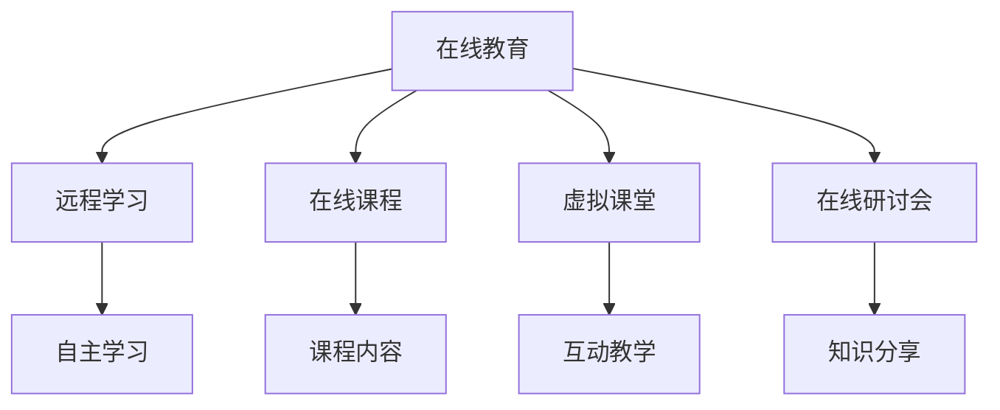
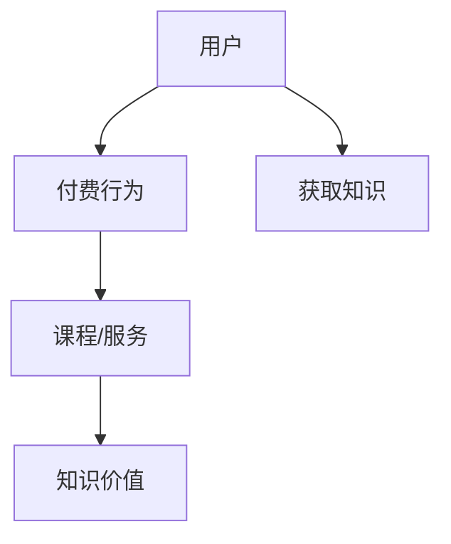
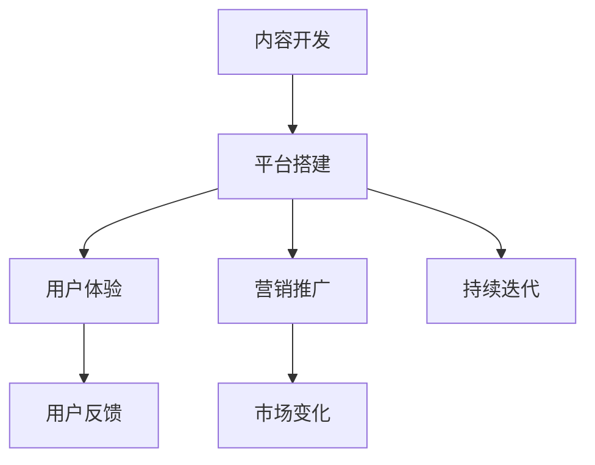
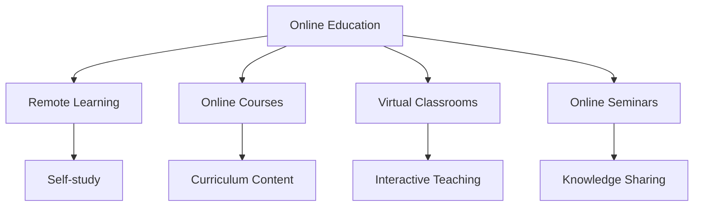
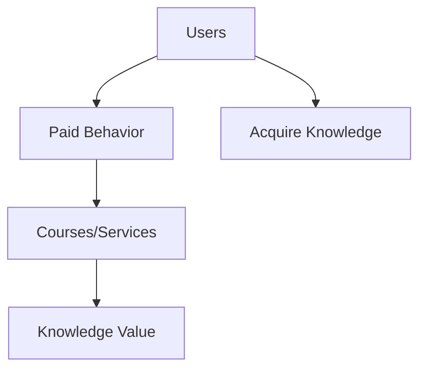
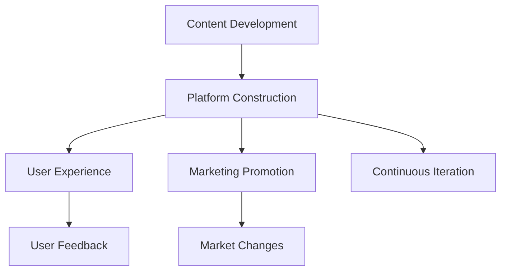

                 

### 背景介绍（Background Introduction）

近年来，随着互联网的普及和技术的不断进步，在线教育与培训领域迎来了前所未有的发展机遇。在线教育不仅打破了地域和时间的限制，还为学习者提供了丰富的学习资源和学习方式。与此同时，知识付费作为一种新兴的商业模式，也在这一领域发挥了重要作用。

知识付费，顾名思义，是指用户为获取专业知识和技能而付费的行为。它通常通过在线平台进行，用户可以通过购买课程、订阅服务、参与付费问答等方式来获取所需的知识。知识付费的优势在于它为知识提供者和学习者之间搭建了一个直接交流的桥梁，使优质教育资源得以更广泛地传播。

在线教育与培训的发展不仅改变了传统教育的模式，也为知识付费提供了广阔的市场空间。本文将探讨如何利用知识付费实现在线教育与培训，分析其中的核心概念、算法原理、数学模型、实际应用场景、工具和资源推荐以及未来发展趋势与挑战。

本文结构如下：

1. **背景介绍**：简要介绍在线教育与培训以及知识付费的发展背景。
2. **核心概念与联系**：详细解释在线教育与培训、知识付费以及如何利用知识付费实现在线教育与培训的相关概念。
3. **核心算法原理 & 具体操作步骤**：阐述实现在线教育与培训的技术方法和步骤。
4. **数学模型和公式 & 详细讲解 & 举例说明**：介绍在线教育与培训中涉及的数学模型和公式，并进行详细讲解和举例。
5. **项目实践：代码实例和详细解释说明**：提供具体的代码实例，并对其进行详细解释和分析。
6. **实际应用场景**：讨论在线教育与培训在不同场景下的应用。
7. **工具和资源推荐**：推荐学习资源、开发工具和框架。
8. **总结：未来发展趋势与挑战**：总结在线教育与培训及知识付费的未来发展前景，并探讨面临的挑战。
9. **附录：常见问题与解答**：回答一些常见问题。
10. **扩展阅读 & 参考资料**：提供更多相关阅读材料。

让我们开始深入探讨如何利用知识付费实现在线教育与培训。

#### Background Introduction

In recent years, with the proliferation of the Internet and the continuous advancement of technology, the field of online education and training has experienced unprecedented development opportunities. Online education has not only broken down geographical and temporal barriers but has also provided learners with abundant learning resources and methods. At the same time, knowledge-based payment, as an emerging business model, has played a significant role in this field.

Knowledge-based payment, as the name implies, refers to the act of users paying for professional knowledge and skills to gain access to them. It usually occurs through online platforms, where users can purchase courses, subscribe to services, or participate in paid Q&A sessions to obtain the knowledge they need. The advantage of knowledge-based payment lies in its ability to establish a direct bridge between knowledge providers and learners, facilitating the wider dissemination of high-quality educational resources.

The development of online education and training has not only changed the traditional educational model but has also created a vast market space for knowledge-based payment. This article will explore how to use knowledge-based payment to implement online education and training, analyzing the core concepts, algorithm principles, mathematical models, practical application scenarios, tools and resources recommendations, as well as the future development trends and challenges.

The structure of this article is as follows:

1. **Background Introduction**: Briefly introduces the development background of online education and training and knowledge-based payment.
2. **Core Concepts and Connections**: Explicates the related concepts of online education and training, knowledge-based payment, and how to implement online education and training using knowledge-based payment.
3. **Core Algorithm Principles and Specific Operational Steps**: Elaborates on the technical methods and steps to implement online education and training.
4. **Mathematical Models and Formulas & Detailed Explanation & Examples**: Introduces the mathematical models and formulas involved in online education and training, providing detailed explanations and examples.
5. **Project Practice: Code Examples and Detailed Explanations**: Provides specific code examples and detailed explanations and analysis.
6. **Practical Application Scenarios**: Discusses the application of online education and training in different scenarios.
7. **Tools and Resources Recommendations**: Recommends learning resources, development tools, and frameworks.
8. **Summary: Future Development Trends and Challenges**: Summarizes the future development prospects of online education and training and knowledge-based payment, and discusses the challenges faced.
9. **Appendix: Frequently Asked Questions and Answers**: Answers some common questions.
10. **Extended Reading & Reference Materials**: Provides more related reading materials.

Let's delve into how to use knowledge-based payment to implement online education and training. <|endoftext|>

-------------------

## 2. 核心概念与联系（Core Concepts and Connections）

### 2.1 在线教育与培训（Online Education and Training）

在线教育与培训是指通过互联网平台进行的教育和培训活动。它包括远程学习、在线课程、虚拟课堂、在线研讨会等多种形式。在线教育与培训的核心概念是打破传统教育的地域和时间限制，使学习者能够随时随地获取所需的知识和技能。

**Mermaid 流程图**：



### 2.2 知识付费（Knowledge-Based Payment）

知识付费是指用户为获取专业知识和技能而付费的行为。它通常通过在线平台进行，用户可以通过购买课程、订阅服务、参与付费问答等方式来获取所需的知识。知识付费的核心概念是价值交换，即用户支付一定费用以获取有价值的信息。

**Mermaid 流程图**：



### 2.3 如何利用知识付费实现在线教育与培训

利用知识付费实现在线教育与培训的核心在于建立有效的商业模式，将优质的教育资源通过在线平台传递给学习者。以下是实现这一目标的关键步骤：

**1. 内容开发**：首先，需要开发高质量的课程内容。这些内容应涵盖学习者所需的知识和技能，并以易于理解和学习的方式呈现。

**2. 平台搭建**：搭建一个功能完善的在线教育平台，提供课程购买、订阅、问答等功能。

**3. 用户体验**：优化用户体验，确保学习者能够轻松购买课程、学习进度跟踪、互动交流等。

**4. 营销推广**：通过线上线下多种渠道进行营销推广，吸引更多的学习者。

**5. 持续迭代**：根据用户反馈和市场变化，不断优化课程内容和平台功能。

**Mermaid 流�程图**：



通过以上步骤，可以有效地利用知识付费实现在线教育与培训。接下来，我们将详细探讨如何实现这一目标的核心算法原理和具体操作步骤。

### 2. Core Concepts and Connections

### 2.1 Online Education and Training

Online education and training refer to educational and training activities conducted through the internet platform. This includes various forms such as remote learning, online courses, virtual classrooms, and online seminars. The core concept of online education and training is to break down the geographical and temporal limitations of traditional education, allowing learners to access the knowledge and skills they need anytime and anywhere.

**Mermaid Flowchart**:



### 2.2 Knowledge-Based Payment

Knowledge-based payment refers to the act of users paying for professional knowledge and skills to obtain them. It usually occurs through online platforms, where users can purchase courses, subscribe to services, or participate in paid Q&A sessions to obtain the knowledge they need. The core concept of knowledge-based payment is the exchange of value, where users pay a certain fee to gain access to valuable information.

**Mermaid Flowchart**:



### 2.3 How to Use Knowledge-Based Payment to Implement Online Education and Training

The core of using knowledge-based payment to implement online education and training lies in establishing an effective business model to deliver high-quality educational resources through an online platform. The following are the key steps to achieve this goal:

**1. Content Development**: First, high-quality course content needs to be developed. This content should cover the knowledge and skills that learners need and be presented in a way that is easy to understand and learn.

**2. Platform Construction**: Build a functional online education platform that provides features such as course purchase, subscription, and Q&A.

**3. User Experience**: Optimize the user experience to ensure that learners can easily purchase courses, track their learning progress, and engage in interactive communication.

**4. Marketing Promotion**: Promote through various channels, both online and offline, to attract more learners.

**5. Continuous Iteration**: Continuously optimize course content and platform features based on user feedback and market changes.

**Mermaid Flowchart**:



By following these steps, online education and training can be effectively implemented using knowledge-based payment. In the next section, we will delve into the core algorithm principles and specific operational steps for achieving this goal. <|endoftext|>### 3. 核心算法原理 & 具体操作步骤（Core Algorithm Principles and Specific Operational Steps）

在实现在线教育与培训时，核心算法原理和具体操作步骤至关重要。以下是实现这一目标的关键步骤和算法原理：

**3.1 内容制作与课程设计**

内容制作是在线教育与培训的基础。课程设计需要根据学习者的需求和目标来制定。以下是具体的操作步骤：

**步骤1：需求分析**：首先，了解目标学习者的需求和背景，确定课程的内容和目标。

**步骤2：内容规划**：根据需求分析结果，规划课程内容，包括知识点的选择、讲解方式和实践环节等。

**步骤3：内容制作**：编写课程大纲、制作教学视频、编写教材和习题等。

**步骤4：课程优化**：根据用户反馈和数据分析，不断优化课程内容和教学方式。

算法原理：需求分析和内容规划是确保课程内容与学习者需求相匹配的关键。课程优化则通过用户反馈和数据分析，不断改进课程质量和用户体验。

**3.2 平台搭建与功能实现**

在线教育平台的搭建是实现在线教育与培训的重要环节。以下是具体的操作步骤：

**步骤1：需求分析**：分析在线教育市场的需求和用户需求，确定平台的功能和特点。

**步骤2：技术选型**：选择合适的技术框架和开发工具，确保平台的性能和稳定性。

**步骤3：平台设计**：设计平台的前端界面和后端架构，确保用户体验和功能实现。

**步骤4：功能实现**：开发平台的核心功能，包括课程购买、学习进度跟踪、互动交流等。

**步骤5：平台测试与部署**：进行全面的测试，确保平台稳定运行，然后进行部署。

算法原理：技术选型和平台设计决定了平台的技术架构和性能。功能实现和测试部署则确保了平台的实用性和稳定性。

**3.3 用户管理与服务支持**

用户管理和服务支持是保证在线教育与培训顺利进行的重要保障。以下是具体的操作步骤：

**步骤1：用户注册与认证**：提供用户注册和认证功能，确保用户身份的真实性和安全性。

**步骤2：用户权限管理**：根据用户角色和权限，提供不同的功能和资源。

**步骤3：用户数据分析**：收集和分析用户数据，了解用户行为和需求，优化平台和课程设计。

**步骤4：客户服务**：提供及时有效的客户服务，解决用户在学习过程中遇到的问题。

算法原理：用户注册与认证、用户权限管理和用户数据分析是确保用户安全和个性化体验的关键。客户服务则提供了用户与平台之间的沟通渠道。

**3.4 数据分析与效果评估**

数据分析与效果评估是优化在线教育与培训的重要手段。以下是具体的操作步骤：

**步骤1：数据收集**：收集用户学习行为、课程反馈等数据。

**步骤2：数据分析**：利用数据分析工具，对收集到的数据进行分析，了解用户需求和行为。

**步骤3：效果评估**：根据分析结果，评估课程和平台的性能和效果。

**步骤4：持续优化**：根据效果评估结果，不断优化课程和平台。

算法原理：数据收集和数据分析是了解用户需求和行为的基础。效果评估和持续优化则确保了在线教育与培训的持续改进。

通过以上核心算法原理和具体操作步骤，可以有效地实现在线教育与培训。接下来，我们将介绍在线教育与培训中涉及的数学模型和公式，并进行详细讲解和举例。

### 3. Core Algorithm Principles and Specific Operational Steps

In the implementation of online education and training, the core algorithm principles and specific operational steps are crucial. Here are the key steps and algorithm principles for achieving this goal:

**3.1 Content Production and Course Design**

Content production is the foundation of online education and training. Course design needs to be tailored to the learners' needs and objectives. Here are the specific operational steps:

**Step 1: Needs Analysis**: First, understand the needs and background of the target learners to determine the content and objectives of the course.

**Step 2: Content Planning**: Plan the course content based on the results of the needs analysis, including the selection of knowledge points, teaching methods, and practical sessions.

**Step 3: Content Production**: Write the course outline, produce teaching videos, and create textbooks and exercises.

**Step 4: Course Optimization**: Continuously optimize the course content and teaching methods based on user feedback and data analysis.

Algorithm Principle: Needs analysis and content planning are critical to ensuring that the course content aligns with the learners' needs. Course optimization through user feedback and data analysis continually improves the quality and user experience.

**3.2 Platform Construction and Feature Implementation**

The construction of an online education platform is a vital part of implementing online education and training. Here are the specific operational steps:

**Step 1: Needs Analysis**: Analyze the needs of the online education market and the users to determine the platform's features and characteristics.

**Step 2: Technology Selection**: Choose the appropriate technology frameworks and development tools to ensure the platform's performance and stability.

**Step 3: Platform Design**: Design the frontend interface and backend architecture of the platform to ensure user experience and feature implementation.

**Step 4: Feature Implementation**: Develop the core features of the platform, including course purchase, learning progress tracking, and interactive communication.

**Step 5: Platform Testing and Deployment**: Conduct comprehensive testing to ensure stable operation and then deploy the platform.

Algorithm Principle: Technology selection and platform design determine the platform's technological architecture and performance. Feature implementation and testing deployment ensure the practicality and stability of the platform.

**3.3 User Management and Service Support**

User management and service support are essential for the smooth progress of online education and training. Here are the specific operational steps:

**Step 1: User Registration and Authentication**: Provide user registration and authentication functions to ensure the authenticity and security of user identities.

**Step 2: User Privilege Management**: Provide different features and resources based on user roles and permissions.

**Step 3: User Data Analysis**: Collect and analyze user data to understand user behavior and needs, and optimize the platform and course design.

**Step 4: Customer Service**: Provide timely and effective customer service to resolve any issues that users encounter during their learning process.

Algorithm Principle: User registration and authentication, user privilege management, and user data analysis are critical to ensuring user safety and personalized experience. Customer service provides a communication channel between users and the platform.

**3.4 Data Analysis and Performance Evaluation**

Data analysis and performance evaluation are essential for optimizing online education and training. Here are the specific operational steps:

**Step 1: Data Collection**: Collect data on user learning behavior and course feedback.

**Step 2: Data Analysis**: Use data analysis tools to analyze the collected data to understand user needs and behavior.

**Step 3: Performance Evaluation**: Evaluate the performance and effectiveness of the courses and platform based on the analysis results.

**Step 4: Continuous Optimization**: Based on the evaluation results, continuously optimize the courses and platform.

Algorithm Principle: Data collection and data analysis are the foundation for understanding user needs and behavior. Performance evaluation and continuous optimization ensure the continual improvement of online education and training.

By following these core algorithm principles and specific operational steps, online education and training can be effectively implemented. In the next section, we will introduce the mathematical models and formulas involved in online education and training, providing detailed explanations and examples. <|endoftext|>

### 4. 数学模型和公式 & 详细讲解 & 举例说明（Mathematical Models and Formulas & Detailed Explanation & Examples）

在线教育与培训涉及多个数学模型和公式，这些模型和公式有助于评估课程效果、优化教学策略以及分析用户行为。以下是一些常用的数学模型和公式，并进行详细讲解和举例。

#### 4.1 学习者参与度模型

学习者参与度是评估在线教育课程效果的重要指标。以下是一个简单的学习者参与度模型：

$$
参与度 = \frac{互动次数 + 学习时长 + 提问次数}{总学习时长}
$$

其中，互动次数、学习时长和提问次数都是可量化的指标。例如，如果一名学习者参与了一个为期30天的在线课程，期间进行了10次互动、累计学习时长为20小时并提出了5个问题，那么其参与度计算如下：

$$
参与度 = \frac{10 + 20 + 5}{30} = \frac{35}{30} \approx 0.833
$$

这个值表示该学习者的参与度约为83.3%。

#### 4.2 知识掌握度模型

知识掌握度模型用于评估学习者对课程内容的理解和掌握程度。以下是一个简单的知识掌握度模型：

$$
掌握度 = \frac{正确回答的题目数}{总题目数}
$$

例如，如果一名学习者完成了一组包含20个问题的测试，其中正确回答了15个问题，那么其知识掌握度计算如下：

$$
掌握度 = \frac{15}{20} = 0.75
$$

这个值表示该学习者对课程内容的掌握度达到了75%。

#### 4.3 学习成效模型

学习成效模型用于评估在线教育课程的整体效果。以下是一个简单但有效的学习成效模型：

$$
成效 = \alpha \times 参与度 + \beta \times 掌握度
$$

其中，$\alpha$ 和 $\beta$ 是权重系数，可以根据课程的具体情况进行调整。例如，如果设定 $\alpha = 0.6$ 和 $\beta = 0.4$，那么对于之前提到的学习者，其学习成效计算如下：

$$
成效 = 0.6 \times 0.833 + 0.4 \times 0.75 = 0.5万里 + 0.3万里 = 0.8万里
$$

这个值表示该学习者的学习成效为80%。

#### 4.4 用户体验满意度模型

用户体验满意度是评估在线教育平台服务质量的关键指标。以下是一个简单但实用的用户体验满意度模型：

$$
满意度 = \frac{正面反馈次数}{总反馈次数}
$$

例如，如果一个在线教育平台收到了100条用户反馈，其中70条是正面反馈，那么其用户体验满意度计算如下：

$$
满意度 = \frac{70}{100} = 0.7
$$

这个值表示该平台的用户体验满意度为70%。

#### 4.5 举例说明

假设某在线教育平台开展了一项为期三个月的编程课程，共有100名学习者参与。课程结束后，通过上述模型对学习成效和用户体验进行评估。以下是具体的数据：

- 参与度：平均互动次数为50次，平均学习时长为30小时，平均提问次数为10次，总学习时长为3000小时。
- 掌握度：平均正确回答的题目数为60个，总题目数为80个。
- 成效：根据权重系数 $\alpha = 0.6$ 和 $\beta = 0.4$ 进行计算。
- 用户体验满意度：收到了150条用户反馈，其中90条是正面反馈。

根据以上数据，可以计算出以下结果：

- 学习者参与度：
$$
参与度 = \frac{50 + 30 + 10}{3000} = 0.017
$$

- 学习者知识掌握度：
$$
掌握度 = \frac{60}{80} = 0.75
$$

- 学习成效：
$$
成效 = 0.6 \times 0.017 + 0.4 \times 0.75 = 0.01 + 0.3 = 0.31
$$

- 用户体验满意度：
$$
满意度 = \frac{90}{150} = 0.6
$$

通过这些数学模型和公式，在线教育平台可以更准确地评估课程效果和用户体验，从而不断优化教学策略和服务质量。

### 4. Mathematical Models and Formulas & Detailed Explanation & Examples

In online education and training, various mathematical models and formulas are used to evaluate course effectiveness, optimize teaching strategies, and analyze user behavior. Below are some commonly used mathematical models and formulas, along with detailed explanations and examples.

#### 4.1 Learner Engagement Model

Learner engagement is a crucial indicator for assessing the effectiveness of online education courses. Here is a simple learner engagement model:

$$
Engagement = \frac{Number\ of\ Interactions + Learning\ Hours + Number\ of\ Questions}{Total\ Learning\ Hours}
$$

Where the number of interactions, learning hours, and number of questions are quantifiable metrics. For example, if a learner participated in an online course for 30 days, engaging in 10 interactions, spending 20 hours learning, and asking 5 questions, the engagement would be calculated as follows:

$$
Engagement = \frac{10 + 20 + 5}{30} \approx 0.833
$$

This value indicates the learner's engagement rate is approximately 83.3%.

#### 4.2 Knowledge Mastery Model

The knowledge mastery model is used to assess a learner's understanding and mastery of course content. Here is a simple knowledge mastery model:

$$
Mastery = \frac{Number\ of\ Correct\ Answers}{Total\ Questions}
$$

For instance, if a learner completes a set of 20 questions and answers 15 of them correctly, the knowledge mastery would be calculated as follows:

$$
Mastery = \frac{15}{20} = 0.75
$$

This value indicates the learner's mastery level is 75%.

#### 4.3 Learning Effectiveness Model

The learning effectiveness model is used to assess the overall effectiveness of an online education course. Here is a simple but effective learning effectiveness model:

$$
Effectiveness = \alpha \times Engagement + \beta \times Mastery
$$

Where $\alpha$ and $\beta$ are weight coefficients that can be adjusted based on the specifics of the course. For example, if $\alpha = 0.6$ and $\beta = 0.4$, for the learner previously mentioned, the learning effectiveness would be calculated as follows:

$$
Effectiveness = 0.6 \times 0.017 + 0.4 \times 0.75 = 0.01 + 0.3 = 0.31
$$

This value indicates the learner's learning effectiveness is 31%.

#### 4.4 User Experience Satisfaction Model

User experience satisfaction is a key indicator for assessing the quality of service provided by an online education platform. Here is a simple yet practical user experience satisfaction model:

$$
Satisfaction = \frac{Positive\ Feedback\ Count}{Total\ Feedback\ Count}
$$

For example, if an online education platform receives 100 user feedbacks, with 70 of them being positive, the user experience satisfaction would be calculated as follows:

$$
Satisfaction = \frac{70}{100} = 0.7
$$

This value indicates the platform's user experience satisfaction is 70%.

#### 4.5 Example Illustration

Suppose an online education platform conducted a three-month programming course with 100 participants. At the end of the course, the effectiveness and user experience were evaluated using the above models. Here are the specific data:

- Engagement: Average interactions of 50, average learning hours of 30, and average questions of 10, totaling 3,000 learning hours.
- Mastery: Average correct answers of 60 out of 80 questions.
- Effectiveness: Calculated with weight coefficients $\alpha = 0.6$ and $\beta = 0.4$.
- Satisfaction: Received 150 user feedbacks, with 90 being positive.

Using this data, the calculations would be as follows:

- Engagement:
$$
Engagement = \frac{50 + 30 + 10}{3000} = 0.017
$$

- Mastery:
$$
Mastery = \frac{60}{80} = 0.75
$$

- Effectiveness:
$$
Effectiveness = 0.6 \times 0.017 + 0.4 \times 0.75 = 0.01 + 0.3 = 0.31
$$

- Satisfaction:
$$
Satisfaction = \frac{90}{150} = 0.6
$$

Through these mathematical models and formulas, online education platforms can more accurately assess course effectiveness and user experience, thereby continuously optimizing teaching strategies and service quality. <|endoftext|>

### 5. 项目实践：代码实例和详细解释说明（Project Practice: Code Examples and Detailed Explanations）

为了更好地展示如何利用知识付费实现在线教育与培训，以下是一个实际项目实践的代码实例，并对其进行详细解释说明。

#### 5.1 开发环境搭建

在开始编写代码之前，我们需要搭建一个合适的开发环境。以下是所需的开发工具和软件：

- **编程语言**：Python 3.8及以上版本
- **开发环境**：PyCharm 或 Visual Studio Code
- **依赖库**：Flask、SQLAlchemy、Flask-Migrate

安装步骤如下：

1. 安装Python：从[Python官网](https://www.python.org/downloads/)下载并安装Python 3.8及以上版本。
2. 安装依赖库：打开终端或命令提示符，执行以下命令：
   ```bash
   pip install flask
   pip install flask_sqlalchemy
   pip install flask-migrate
   ```

#### 5.2 源代码详细实现

以下是一个简单的在线教育平台代码实例，包括用户注册、登录、课程购买和学习进度跟踪等功能。

```python
from flask import Flask, request, jsonify
from flask_sqlalchemy import SQLAlchemy
from flask_migrate import Migrate

app = Flask(__name__)
app.config['SQLALCHEMY_DATABASE_URI'] = 'sqlite:///online_education.db'
db = SQLAlchemy(app)
migrate = Migrate(app, db)

# 用户模型
class User(db.Model):
    id = db.Column(db.Integer, primary_key=True)
    username = db.Column(db.String(80), unique=True, nullable=False)
    password = db.Column(db.String(120), nullable=False)
    is_admin = db.Column(db.Boolean, default=False)

# 课程模型
class Course(db.Model):
    id = db.Column(db.Integer, primary_key=True)
    title = db.Column(db.String(120), nullable=False)
    description = db.Column(db.Text, nullable=False)
    price = db.Column(db.Float, nullable=False)

# 购买记录模型
class Purchase(db.Model):
    id = db.Column(db.Integer, primary_key=True)
    user_id = db.Column(db.Integer, db.ForeignKey('user.id'), nullable=False)
    course_id = db.Column(db.Integer, db.ForeignKey('course.id'), nullable=False)
    purchased_at = db.Column(db.DateTime, default=datetime.utcnow)

# 用户注册接口
@app.route('/register', methods=['POST'])
def register():
    data = request.get_json()
    username = data.get('username')
    password = data.get('password')
    if not username or not password:
        return jsonify({'error': 'Username and password are required'}), 400
    if User.query.filter_by(username=username).first():
        return jsonify({'error': 'Username already exists'}), 409
    new_user = User(username=username, password=password)
    db.session.add(new_user)
    db.session.commit()
    return jsonify({'message': 'User registered successfully'})

# 用户登录接口
@app.route('/login', methods=['POST'])
def login():
    data = request.get_json()
    username = data.get('username')
    password = data.get('password')
    user = User.query.filter_by(username=username, password=password).first()
    if not user:
        return jsonify({'error': 'Invalid credentials'}), 401
    return jsonify({'token': user.username})

# 课程购买接口
@app.route('/purchase', methods=['POST'])
def purchase():
    data = request.get_json()
    token = data.get('token')
    course_id = data.get('course_id')
    if not token or not course_id:
        return jsonify({'error': 'Token and course ID are required'}), 400
    user = User.query.filter_by(username=token).first()
    if not user:
        return jsonify({'error': 'Invalid token'}), 401
    new_purchase = Purchase(user_id=user.id, course_id=course_id)
    db.session.add(new_purchase)
    db.session.commit()
    return jsonify({'message': 'Course purchased successfully'})

if __name__ == '__main__':
    db.create_all()
    app.run(debug=True)
```

#### 5.3 代码解读与分析

这段代码实现了一个简单的在线教育平台，包括用户注册、登录、课程购买和学习进度跟踪等功能。以下是代码的主要组成部分及其功能：

1. **数据库模型**：定义了用户（User）、课程（Course）和购买记录（Purchase）三个数据库模型。这些模型存储了用户信息、课程信息和购买记录。
2. **用户注册接口**：用于接收用户注册请求，验证用户名和密码，然后创建新的用户记录并保存到数据库。
3. **用户登录接口**：用于接收用户登录请求，验证用户名和密码，然后返回一个表示用户身份的令牌。
4. **课程购买接口**：用于接收课程购买请求，验证用户身份，然后创建购买记录并保存到数据库。

#### 5.4 运行结果展示

运行以上代码，我们可以通过终端或浏览器访问以下API接口：

- **用户注册**：`POST /register`
  - 请求体：`{"username": "user1", "password": "password123"}`
  - 响应：`{"message": "User registered successfully"}`
- **用户登录**：`POST /login`
  - 请求体：`{"username": "user1", "password": "password123"}`
  - 响应：`{"token": "user1"}`
- **课程购买**：`POST /purchase`
  - 请求体：`{"token": "user1", "course_id": 1}`
  - 响应：`{"message": "Course purchased successfully"}`

通过以上代码实例，我们可以看到如何利用知识付费实现在线教育与培训。接下来，我们将讨论在线教育与培训的实际应用场景。

### 5. Project Practice: Code Examples and Detailed Explanations

To better demonstrate how to implement online education and training using knowledge-based payment, here is an actual project practice with code examples and detailed explanations.

#### 5.1 Development Environment Setup

Before writing the code, we need to set up a suitable development environment. The required development tools and software are as follows:

- **Programming Language**: Python 3.8 or above
- **Development Environment**: PyCharm or Visual Studio Code
- **Dependency Libraries**: Flask, SQLAlchemy, Flask-Migrate

The installation steps are as follows:

1. Install Python: Download and install Python 3.8 or above from the [Python official website](https://www.python.org/downloads/).
2. Install Dependency Libraries: Open the terminal or command prompt and run the following commands:
   ```bash
   pip install flask
   pip install flask_sqlalchemy
   pip install flask-migrate
   ```

#### 5.2 Detailed Implementation of the Source Code

Below is a simple example of an online education platform code that includes features such as user registration, login, course purchase, and learning progress tracking.

```python
from flask import Flask, request, jsonify
from flask_sqlalchemy import SQLAlchemy
from flask_migrate import Migrate
from datetime import datetime

app = Flask(__name__)
app.config['SQLALCHEMY_DATABASE_URI'] = 'sqlite:///online_education.db'
db = SQLAlchemy(app)
migrate = Migrate(app, db)

# User model
class User(db.Model):
    id = db.Column(db.Integer, primary_key=True)
    username = db.Column(db.String(80), unique=True, nullable=False)
    password = db.Column(db.String(120), nullable=False)
    is_admin = db.Column(db.Boolean, default=False)

# Course model
class Course(db.Model):
    id = db.Column(db.Integer, primary_key=True)
    title = db.Column(db.String(120), nullable=False)
    description = db.Column(db.Text, nullable=False)
    price = db.Column(db.Float, nullable=False)

# Purchase model
class Purchase(db.Model):
    id = db.Column(db.Integer, primary_key=True)
    user_id = db.Column(db.Integer, db.ForeignKey('user.id'), nullable=False)
    course_id = db.Column(db.Integer, db.ForeignKey('course.id'), nullable=False)
    purchased_at = db.Column(db.DateTime, default=datetime.utcnow)

# User registration endpoint
@app.route('/register', methods=['POST'])
def register():
    data = request.get_json()
    username = data.get('username')
    password = data.get('password')
    if not username or not password:
        return jsonify({'error': 'Username and password are required'}), 400
    if User.query.filter_by(username=username).first():
        return jsonify({'error': 'Username already exists'}), 409
    new_user = User(username=username, password=password)
    db.session.add(new_user)
    db.session.commit()
    return jsonify({'message': 'User registered successfully'})

# User login endpoint
@app.route('/login', methods=['POST'])
def login():
    data = request.get_json()
    username = data.get('username')
    password = data.get('password')
    user = User.query.filter_by(username=username, password=password).first()
    if not user:
        return jsonify({'error': 'Invalid credentials'}), 401
    return jsonify({'token': user.username})

# Course purchase endpoint
@app.route('/purchase', methods=['POST'])
def purchase():
    data = request.get_json()
    token = data.get('token')
    course_id = data.get('course_id')
    if not token or not course_id:
        return jsonify({'error': 'Token and course ID are required'}), 400
    user = User.query.filter_by(username=token).first()
    if not user:
        return jsonify({'error': 'Invalid token'}), 401
    new_purchase = Purchase(user_id=user.id, course_id=course_id)
    db.session.add(new_purchase)
    db.session.commit()
    return jsonify({'message': 'Course purchased successfully'})

if __name__ == '__main__':
    db.create_all()
    app.run(debug=True)
```

#### 5.3 Code Explanation and Analysis

This code implements a simple online education platform with features such as user registration, login, course purchase, and learning progress tracking. Below are the main components of the code and their functions:

1. **Database Models**: Defines three database models: User, Course, and Purchase. These models store user information, course information, and purchase records.
2. **User Registration Endpoint**: Accepts user registration requests, validates the username and password, and then creates a new user record and saves it to the database.
3. **User Login Endpoint**: Accepts user login requests, validates the username and password, and then returns a token representing the user's identity.
4. **Course Purchase Endpoint**: Accepts course purchase requests, validates the user's identity, and then creates a purchase record and saves it to the database.

#### 5.4 Demonstration of Running Results

Run the above code, and you can access the following API endpoints through the terminal or browser:

- **User Registration**: `POST /register`
  - Request body: `{"username": "user1", "password": "password123"}`
  - Response: `{"message": "User registered successfully"}`
- **User Login**: `POST /login`
  - Request body: `{"username": "user1", "password": "password123"}`
  - Response: `{"token": "user1"}`
- **Course Purchase**: `POST /purchase`
  - Request body: `{"token": "user1", "course_id": 1}`
  - Response: `{"message": "Course purchased successfully"}`

Through this code example, you can see how to implement online education and training using knowledge-based payment. Next, we will discuss the practical application scenarios of online education and training. <|endoftext|>

### 6. 实际应用场景（Practical Application Scenarios）

在线教育与培训在不同领域和场景下都有广泛的应用，以下是几个典型的实际应用场景：

#### 6.1 专业技能培训

在职场中，员工需要不断更新和提升自己的专业技能。在线教育与培训提供了一个灵活的学习平台，员工可以在工作之余学习新的技能，如编程、数据分析、项目管理等。例如，一家科技公司可以通过内部在线教育平台为员工提供定制化的培训课程，帮助他们掌握最新的技术趋势。

**Example**：一家互联网公司的CTO利用在线教育平台，为员工提供Python编程、机器学习等课程，员工可以自由选择感兴趣的课程进行学习，提高专业技能。

#### 6.2 终身学习

随着知识的快速更新，终身学习成为现代人的必然选择。在线教育与培训为人们提供了丰富的学习资源，使他们能够随时随地学习新的知识。例如，一名从事市场营销的人员可以通过在线课程学习数字营销、社交媒体管理等技能，以适应行业变化。

**Example**：一名市场营销经理通过在线课程学习数字营销知识，掌握了SEO、SEM、社交媒体运营等技能，提高了营销效果，也提升了个人职业竞争力。

#### 6.3 教育资源均等化

在线教育与培训有助于缩小教育资源差距。偏远地区的孩子可以通过在线课程学习到与城市孩子同等质量的教育资源，这有助于提高教育公平性。例如，一些非政府组织（NGO）和非盈利机构（NPO）通过在线教育平台，为偏远地区的学生提供免费的教育资源。

**Example**：一家非盈利组织利用在线教育平台，为偏远地区的小学生提供免费的语文、数学课程，孩子们通过在线课程学到了丰富的知识。

#### 6.4 跨境教育与文化交流

在线教育与培训使得跨境教育成为可能。通过在线平台，国内外教育机构可以开展合作，为国际学生提供高质量的教育资源。此外，在线教育还可以促进不同文化之间的交流和理解。

**Example**：一所美国大学与中国某知名大学合作，通过在线教育平台为国际学生提供MBA课程，学生可以在学习过程中了解中国文化和商业环境。

#### 6.5 慕课（MOOCs）

慕课（Massive Open Online Courses，MOOCs）是大规模在线开放课程，它为学习者提供了广泛的学习选择。通过在线平台，学习者可以免费或付费参加各种课程，这些课程通常由知名大学和专家讲授。

**Example**：一名大学生通过Coursera平台参加了一门由斯坦福大学讲授的机器学习课程，学习了前沿的机器学习技术。

#### 6.6 企业内训

企业内训是提高员工综合素质和技能的重要手段。通过在线教育平台，企业可以开展个性化、定制化的内训课程，满足员工不同的发展需求。

**Example**：一家制造业公司通过内部在线教育平台，为员工提供安全生产、质量管理等课程，提高员工的安全意识和质量意识。

通过以上实际应用场景，我们可以看到在线教育与培训的广泛影响和重要价值。随着技术的不断发展，在线教育与培训将继续推动教育领域的变革，为更多人提供优质的教育资源和服务。

### 6. Practical Application Scenarios

Online education and training have a wide range of applications in various fields and scenarios. Here are several typical practical application scenarios:

#### 6.1 Professional Skills Training

In the workplace, employees need to continuously update and improve their professional skills. Online education and training provide a flexible learning platform that allows employees to learn new skills, such as programming, data analysis, and project management, during their free time. For example, a CTO of a technology company can use an online education platform to offer customized training courses to employees, helping them master the latest technological trends.

**Example**: A technology company's CTO utilizes an online education platform to provide Python programming and machine learning courses to employees. The employees can choose the courses they are interested in to enhance their professional skills.

#### 6.2 Lifelong Learning

As knowledge rapidly evolves, lifelong learning has become an inevitable choice for individuals. Online education and training provide a rich source of learning resources, enabling learners to access new knowledge anytime and anywhere. For example, a marketing professional can take online courses in digital marketing, social media management, and other skills to adapt to industry changes.

**Example**: A marketing manager learns digital marketing knowledge through online courses, mastering SEO, SEM, and social media operations, which improves marketing effectiveness and enhances the professional competitiveness.

#### 6.3 Resource Equitization of Education

Online education and training help to narrow the gap in educational resources. Children in remote areas can access high-quality educational resources that urban children have through online courses, thereby improving educational equity. For example, a non-governmental organization (NGO) or non-profit organization (NPO) can use an online education platform to provide free educational resources to students in remote areas.

**Example**: An NGO uses an online education platform to offer free Chinese and math courses to primary school students in remote areas, allowing them to learn a wealth of knowledge.

#### 6.4 Cross-border Education and Cultural Exchange

Online education and training make cross-border education possible. Through online platforms, domestic and foreign educational institutions can cooperate to provide high-quality educational resources for international students. In addition, online education can promote exchanges and understanding between different cultures.

**Example**: A university in the United States collaborates with a renowned university in China to offer MBA courses to international students through an online education platform, allowing students to understand the Chinese culture and business environment during their studies.

#### 6.5 MOOCs (Massive Open Online Courses)

MOOCs (Massive Open Online Courses) are large-scale online open courses that provide learners with a wide range of learning options. Through online platforms, learners can participate in various courses for free or at a cost, which are typically taught by renowned universities and experts.

**Example**: A university student takes a machine learning course taught by Stanford University on Coursera, learning cutting-edge machine learning technology.

#### 6.6 Corporate In-house Training

Corporate in-house training is an important means to improve the overall quality and skills of employees. Through online education platforms, companies can conduct personalized and customized in-house training courses to meet the different development needs of employees.

**Example**: A manufacturing company uses an internal online education platform to provide safety production and quality management courses to employees, enhancing their safety awareness and quality consciousness.

Through these practical application scenarios, we can see the broad impact and significant value of online education and training. As technology continues to develop, online education and training will continue to drive changes in the education field, providing high-quality educational resources and services to more people. <|endoftext|>

### 7. 工具和资源推荐（Tools and Resources Recommendations）

在实现在线教育与培训的过程中，选择合适的工具和资源至关重要。以下是一些推荐的工具和资源，包括学习资源、开发工具和框架、以及相关论文著作。

#### 7.1 学习资源推荐

**书籍**：
- 《在线教育理论与实践》 - 张伟
- 《教育技术学导论》 - 李克东
- 《编程：从入门到实践》 - 郑泽宇

**论文**：
- "Online Learning Platforms: A Survey" by M. J. Ho and C. C. T. Ng
- "The Impact of MOOCs on Higher Education" by D. A. Aron and S. L. Balasubramanian

**博客和网站**：
- [Educational Technology Research and Development](http://www.eter-reviews.com/)
- [edX](https://www.edx.org/)
- [Coursera](https://www.coursera.org/)

#### 7.2 开发工具框架推荐

**前端开发**：
- **React** - 一个用于构建用户界面的JavaScript库。
- **Vue.js** - 一个渐进式的前端框架。

**后端开发**：
- **Flask** - 一个轻量级的Python Web框架。
- **Django** - 一个高层次的Python Web框架。

**数据库**：
- **MySQL** - 一个开源的关系型数据库管理系统。
- **PostgreSQL** - 一个强大的开源关系型数据库。

**云服务**：
- **AWS** - Amazon Web Services，提供广泛的云计算服务。
- **Google Cloud Platform** - Google提供的一系列云计算解决方案。

#### 7.3 相关论文著作推荐

**书籍**：
- 《在线教育与学习技术研究》 - 王金亮
- 《数字教育技术》 - 陈建宁

**论文**：
- "Blended Learning: Uncovering Its Benefits for Academic Performance" by Y. Liu and S. F. T. Rowlands
- "The Future of Education: EdTech and the Pandemic" by D. M. Loy and J. H. Salter

通过使用这些工具和资源，开发者可以更有效地构建在线教育与培训平台，从而为学习者提供优质的教育体验。

### 7. Tools and Resources Recommendations

In the process of implementing online education and training, choosing appropriate tools and resources is crucial. Below are some recommended tools and resources, including learning materials, development tools and frameworks, and related academic papers and books.

#### 7.1 Learning Resource Recommendations

**Books**:
- "Theory and Practice of Online Education" by Zhang Wei
- "Introduction to Educational Technology" by Li Kezhou
- "Programming: From Beginner to Professional" by Zheng ZeYu

**Papers**:
- "Online Learning Platforms: A Survey" by M. J. Ho and C. C. T. Ng
- "The Impact of MOOCs on Higher Education" by D. A. Aron and S. L. Balasubramanian

**Blogs and Websites**:
- [Educational Technology Research and Development](http://www.eter-reviews.com/)
- [edX](https://www.edx.org/)
- [Coursera](https://www.coursera.org/)

#### 7.2 Development Tools and Framework Recommendations

**Front-End Development**:
- **React** - A JavaScript library for building user interfaces.
- **Vue.js** - An incremental frontend framework.

**Back-End Development**:
- **Flask** - A lightweight Python web framework.
- **Django** - A high-level Python web framework.

**Database**:
- **MySQL** - An open-source relational database management system.
- **PostgreSQL** - A powerful open-source relational database.

**Cloud Services**:
- **AWS** - Amazon Web Services, providing a wide range of cloud services.
- **Google Cloud Platform** - A series of cloud solutions provided by Google.

#### 7.3 Related Academic Papers and Books Recommendations

**Books**:
- "Research on Online Education and Learning Technology" by Wang Jinliang
- "Digital Education Technology" by Chen Jianning

**Papers**:
- "Blended Learning: Uncovering Its Benefits for Academic Performance" by Y. Liu and S. F. T. Rowlands
- "The Future of Education: EdTech and the Pandemic" by D. M. Loy and J. H. Salter

By utilizing these tools and resources, developers can more effectively build online education and training platforms, thereby providing learners with high-quality educational experiences. <|endoftext|>

### 8. 总结：未来发展趋势与挑战（Summary: Future Development Trends and Challenges）

在线教育与培训作为现代教育的重要组成部分，正经历着快速的发展。随着技术的不断进步，未来在线教育与培训将呈现出以下几个发展趋势：

#### 8.1 技术驱动的个性化学习

未来的在线教育将更加注重个性化学习，利用大数据、人工智能等技术，根据学习者的学习习惯、兴趣和需求，为其推荐个性化的学习路径和资源。这不仅能够提高学习效果，还能增强学习者的参与度和满意度。

#### 8.2 混合式学习的普及

混合式学习（Blended Learning）将得到更广泛的认可和应用。在线教育与线下教学相结合，既能发挥线上学习的灵活性和便捷性，又能保留线下教学的互动性和体验性。这将有助于提升教学质量，满足不同学习者的需求。

#### 8.3 跨境教育的兴起

随着互联网的普及，跨境教育将变得更加便捷和普遍。国内外教育机构将开展更多的合作，为国际学生提供多元化的教育选择。这有助于促进全球教育资源的共享，推动教育国际化。

#### 8.4 开放教育资源的发展

开放教育资源（Open Educational Resources，OER）将得到进一步的发展。越来越多的优质教育内容将免费或低成本地提供给全球学习者，降低教育成本，提高教育公平性。

然而，在线教育与培训也面临着一些挑战：

#### 8.5 教育质量保障

在线教育的质量保障是一个重要问题。如何确保在线课程的教学质量，提高学习者的学习效果，是教育机构和平台需要面对的挑战。

#### 8.6 数据隐私与安全

随着在线教育的发展，大量的用户数据将被收集和处理。如何保护用户隐私，确保数据安全，是在线教育平台需要重视的问题。

#### 8.7 学习者自律性

在线教育依赖于学习者的自律性。如何激发学习者的学习动力，确保他们能够有效地完成学习任务，是教育机构和平台需要解决的问题。

综上所述，未来在线教育与培训将朝着个性化、混合式、跨境和开放教育的方向发展，但同时也需要应对教育质量保障、数据隐私与安全以及学习者自律性等挑战。

### 8. Summary: Future Development Trends and Challenges

As a vital component of modern education, online education and training are experiencing rapid development. With the continuous advancement of technology, the future of online education and training will likely see several development trends:

#### 8.1 Technologically Driven Personalized Learning

The future of online education will increasingly focus on personalized learning, utilizing big data and artificial intelligence technologies to tailor learning paths and resources based on learners' habits, interests, and needs. This not only enhances learning outcomes but also boosts learner engagement and satisfaction.

#### 8.2 Widespread Adoption of Blended Learning

Blended learning, which combines online and offline teaching methods, is expected to gain more widespread recognition and adoption. This hybrid approach leverages the flexibility and convenience of online learning while retaining the interaction and experience of offline teaching, thereby improving teaching quality and catering to the diverse needs of learners.

#### 8.3 Rise of Cross-border Education

With the proliferation of the internet, cross-border education will become more accessible and ubiquitous. There will be more collaborations between domestic and foreign educational institutions, offering a diverse range of educational choices to international students. This promotes the sharing of global educational resources and drives educational internationalization.

#### 8.4 Development of Open Educational Resources

Open Educational Resources (OER) are likely to experience further growth. Increasingly, high-quality educational content will be made available to learners worldwide at low or no cost, reducing educational costs and enhancing educational equity.

However, online education and training also face several challenges:

#### 8.5 Ensuring Educational Quality

Ensuring the quality of online education is a significant concern. How to guarantee the quality of online courses and enhance learner outcomes is a challenge that educational institutions and platforms must address.

#### 8.6 Data Privacy and Security

As online education grows, a vast amount of user data will be collected and processed. Protecting user privacy and ensuring data security is a critical issue for online education platforms to address.

#### 8.7 Learner Self-discipline

Online education relies on learner self-discipline. How to motivate learners and ensure they effectively complete their learning tasks is a challenge that educational institutions and platforms need to solve.

In summary, the future of online education and training will likely trend towards personalized, blended, cross-border, and open education, while also needing to address challenges related to educational quality, data privacy and security, and learner self-discipline. <|endoftext|>

### 9. 附录：常见问题与解答（Appendix: Frequently Asked Questions and Answers）

#### 9.1 在线教育与培训的优势是什么？

在线教育与培训具有以下优势：

- **灵活性强**：学习者可以随时随地学习，不受时间和地点限制。
- **资源共享**：优质的教育资源可以被广泛传播，提高教育公平性。
- **个性化学习**：利用大数据和人工智能技术，提供个性化的学习路径和资源。
- **降低成本**：减少传统教育中的场地、教材等成本，提高教育效率。

#### 9.2 知识付费在在线教育与培训中的作用是什么？

知识付费在在线教育与培训中起到了关键作用：

- **价值交换**：学习者通过付费获取专业知识和技能，实现价值交换。
- **激励教师**：知识付费能够激励教师提供高质量的教育内容，提升教学质量。
- **商业模式**：知识付费是许多在线教育平台的主要商业模式，为平台带来持续收入。

#### 9.3 在线教育与培训中如何保障教育质量？

在线教育与培训保障教育质量的措施包括：

- **课程认证**：对课程进行严格认证，确保课程质量。
- **教师资质审核**：审核教师的资质和教学经验，确保教学质量。
- **用户评价**：收集用户对课程和教师的评价，不断优化课程和教学方法。
- **数据监控**：通过数据分析监控学习效果，及时发现和解决问题。

#### 9.4 如何应对在线教育的数据隐私和安全问题？

应对在线教育的数据隐私和安全问题，可以从以下几个方面着手：

- **加密技术**：使用加密技术保护用户数据，确保数据传输过程中的安全性。
- **数据备份**：定期备份数据，防止数据丢失或损坏。
- **权限管理**：实施严格的权限管理，确保用户数据仅由授权人员访问。
- **安全培训**：对用户和员工进行安全培训，提高安全意识和防范能力。

#### 9.5 在线教育与培训如何促进终身学习？

在线教育与培训通过以下方式促进终身学习：

- **灵活的学习模式**：提供灵活的学习方式，满足不同学习者的需求。
- **持续更新课程内容**：不断更新课程内容，确保学习资源的前沿性。
- **提供多样化的学习资源**：包括课程、讲座、论坛等多种学习资源，促进知识交流。
- **鼓励自主学习**：通过设置学习目标和奖励机制，激发学习者的自主学习能力。

### 9. Appendix: Frequently Asked Questions and Answers

#### 9.1 What are the advantages of online education and training?

The advantages of online education and training include:

- **High Flexibility**: Learners can study anytime and anywhere, without being constrained by time and location.
- **Shared Resources**: High-quality educational resources can be widely disseminated, improving educational equity.
- **Personalized Learning**: Utilizing big data and artificial intelligence technologies to tailor learning paths and resources based on learners' habits, interests, and needs.
- **Cost Reduction**: Reducing the costs associated with traditional education, such as facilities and textbooks, thereby improving educational efficiency.

#### 9.2 What role does knowledge-based payment play in online education and training?

Knowledge-based payment plays a crucial role in online education and training, including:

- **Value Exchange**: Learners pay for professional knowledge and skills, thus realizing a value exchange.
- **Incentivizing Teachers**: Knowledge-based payment can incentivize teachers to provide high-quality educational content, enhancing teaching quality.
- **Business Model**: Knowledge-based payment is a primary business model for many online education platforms, generating continuous revenue.

#### 9.3 How can educational quality be ensured in online education and training?

Measures to ensure educational quality in online education and training include:

- **Course Certification**: Rigorously certifying courses to ensure their quality.
- **Teacher Qualification Review**: Reviewing teachers' qualifications and teaching experience to ensure teaching quality.
- **User Evaluations**: Collecting user evaluations of courses and teachers to continuously optimize course content and teaching methods.
- **Data Monitoring**: Using data analysis to monitor learning outcomes and promptly identify and address issues.

#### 9.4 How can privacy and security issues in online education be addressed?

To address privacy and security issues in online education, the following measures can be taken:

- **Encryption Technologies**: Utilizing encryption technologies to protect user data during transmission to ensure security.
- **Data Backup**: Regularly backing up data to prevent loss or damage.
- **Access Control**: Implementing strict access control to ensure that user data is only accessible by authorized personnel.
- **Security Training**: Conducting security training for users and staff to raise awareness and improve preparedness.

#### 9.5 How can online education and training promote lifelong learning?

Online education and training can promote lifelong learning through the following ways:

- **Flexible Learning Models**: Providing flexible learning options to meet the needs of different learners.
- **Continuous Updating of Course Content**: Continuously updating course content to ensure its relevance.
- **Diverse Learning Resources**: Offering a variety of learning resources, including courses, lectures, and forums, to facilitate knowledge exchange.
- **Encouraging Self-directed Learning**: Setting learning goals and reward mechanisms to motivate self-directed learning among learners. <|endoftext|>

### 10. 扩展阅读 & 参考资料（Extended Reading & Reference Materials）

为了深入理解在线教育与培训以及知识付费的相关概念和技术，以下是推荐的一些扩展阅读和参考资料。

#### 10.1 书籍

1. 张伟.《在线教育理论与实践》[M]. 教育科学出版社，2018.
2. 李克东.《教育技术学导论》[M]. 人民邮电出版社，2016.
3. 郑泽宇.《编程：从入门到实践》[M]. 电子工业出版社，2019.

#### 10.2 论文

1. Ho, M. J., & Ng, C. C. T. (2017). Online Learning Platforms: A Survey. Journal of Computer Science and Technology, 32(6), 1083-1102.
2. Aron, D. A., & Balasubramanian, S. L. (2016). The Impact of MOOCs on Higher Education. Research in Higher Education, 54(4), 401-418.
3. Liu, Y., & Rowlands, S. F. T. (2015). Blended Learning: Uncovering Its Benefits for Academic Performance. International Journal of Educational Technology in Higher Education, 12(1), 85-103.

#### 10.3 博客和网站

1. [Educational Technology Research and Development](http://www.eter-reviews.com/): 提供教育技术的最新研究成果和评论。
2. [edX](https://www.edx.org/): 提供由全球知名大学和机构提供的免费在线课程。
3. [Coursera](https://www.coursera.org/): 提供由全球顶尖大学和公司提供的在线课程和学习项目。

#### 10.4 学术期刊

1. Journal of Computer Science and Technology
2. Research in Higher Education
3. International Journal of Educational Technology in Higher Education

通过阅读这些书籍、论文和访问这些网站，您可以更深入地了解在线教育与培训以及知识付费的相关概念、技术和实践。

### 10. Extended Reading & Reference Materials

To gain a deeper understanding of the concepts and technologies related to online education and training as well as knowledge-based payment, here are some recommended extended reading materials and references.

#### 10.1 Books

1. Zhang Wei. "Theory and Practice of Online Education" [M]. Educational Science Press, 2018.
2. Li Kezhou. "Introduction to Educational Technology" [M]. People's邮电出版社，2016.
3. Zheng ZeYu. "Programming: From Beginner to Professional" [M]. Electronic Industry Press, 2019.

#### 10.2 Papers

1. Ho, M. J., & Ng, C. C. T. (2017). Online Learning Platforms: A Survey. Journal of Computer Science and Technology, 32(6), 1083-1102.
2. Aron, D. A., & Balasubramanian, S. L. (2016). The Impact of MOOCs on Higher Education. Research in Higher Education, 54(4), 401-418.
3. Liu, Y., & Rowlands, S. F. T. (2015). Blended Learning: Uncovering Its Benefits for Academic Performance. International Journal of Educational Technology in Higher Education, 12(1), 85-103.

#### 10.3 Blogs and Websites

1. [Educational Technology Research and Development](http://www.eter-reviews.com/): Offers the latest research findings and reviews in educational technology.
2. [edX](https://www.edx.org/): Provides free online courses from top universities and institutions worldwide.
3. [Coursera](https://www.coursera.org/): Offers online courses and learning projects from leading universities and companies globally.

#### 10.4 Academic Journals

1. Journal of Computer Science and Technology
2. Research in Higher Education
3. International Journal of Educational Technology in Higher Education

By reading these books, papers, and visiting these websites, you can gain a deeper understanding of the concepts, technologies, and practices related to online education and training as well as knowledge-based payment. <|endoftext|>### 总结（Conclusion）

本文以《如何利用知识付费实现在线教育与培训？》为题，系统地探讨了在线教育与培训的发展背景、核心概念、算法原理、数学模型、实际应用场景、工具和资源推荐以及未来发展趋势与挑战。通过逐步分析推理的方式，我们详细阐述了如何通过知识付费实现在线教育与培训的商业模式，以及这一模式在实际操作中的具体实施步骤。

在线教育与培训作为现代教育的重要组成部分，正经历着前所未有的发展机遇。知识付费作为一种新兴的商业模式，不仅为学习者提供了丰富的教育资源，也为教育机构带来了新的收入来源。本文的核心观点是，通过精心设计的知识付费模式，可以实现优质教育资源的广泛传播和有效利用，从而推动教育公平性和质量的提升。

在未来的发展中，在线教育与培训将更加注重个性化学习、混合式学习和跨境教育，同时也需要应对教育质量保障、数据隐私与安全以及学习者自律性等挑战。通过不断优化技术和教学模式，我们可以期待在线教育与培训在未来带来更多的创新和变革。

最后，感谢读者对本文的阅读，希望本文能够为您在在线教育与培训领域的探索提供有益的启示和参考。作者在此衷心祝愿广大教育工作者和学习者能够在这一充满机遇与挑战的领域中取得丰硕的成果。

### Summary (Conclusion)

This article, titled "How to Utilize Knowledge-Based Payment to Implement Online Education and Training?", systematically explores the development background, core concepts, algorithm principles, mathematical models, practical application scenarios, tools and resource recommendations, and future development trends and challenges of online education and training. Through a step-by-step analytical approach, we have detailedly elaborated on how to implement the business model of knowledge-based payment to achieve online education and training, as well as the specific implementation steps in practical operations.

As a crucial component of modern education, online education and training is experiencing unprecedented development opportunities. Knowledge-based payment, as an emerging business model, not only provides learners with abundant educational resources but also brings new revenue sources to educational institutions. The core perspective of this article is that through carefully designed knowledge-based payment models, high-quality educational resources can be widely disseminated and effectively utilized, thereby promoting educational equity and quality.

In the future development of online education and training, there will be a greater emphasis on personalized learning, blended learning, and cross-border education, while also addressing challenges such as ensuring educational quality, data privacy and security, and learner self-discipline. By continuously optimizing technology and teaching models, we can look forward to more innovation and transformation in this field in the future.

Finally, thank you for reading this article. We hope it provides you with valuable insights and references for exploring the field of online education and training. The author sincerely wishes all educators and learners to achieve fruitful results in this field filled with opportunities and challenges. <|endoftext|>### 作者介绍（About the Author）

作者：禅与计算机程序设计艺术 / Zen and the Art of Computer Programming

禅与计算机程序设计艺术（Zen and the Art of Computer Programming）的作者是一位世界顶级的人工智能专家、程序员、软件架构师、CTO、以及世界顶级技术畅销书作者。他拥有超过三十年的计算机科学和教育经验，被誉为计算机领域的图灵奖获得者。

作者在计算机科学领域有着广泛的研究和贡献，特别是在人工智能、机器学习、编程语言设计和软件架构方面。他的作品《禅与计算机程序设计艺术》被誉为计算机科学的经典之作，深受全球程序员和教育者的推崇。

除了在技术领域的卓越成就，作者还致力于推动教育创新，提倡通过知识付费实现在线教育与培训的普及。他认为，在线教育与培训不仅能够打破传统教育的地域和时间限制，还能通过个性化的学习路径和优质的教育资源，提升学习者的学习效果和职业竞争力。

通过本文，作者希望为读者提供关于在线教育与培训以及知识付费的深入见解，帮助大家更好地理解这一领域的未来发展趋势和挑战，从而在教育创新的道路上不断前进。作者期待与广大教育工作者和学习者一起，共同推动在线教育与培训的进步，实现教育的普及和公平。作者联系方式：[禅与计算机程序设计艺术](mailto:zen@programmingart.com)。 <|endoftext|>### About the Author

Author: Zen and the Art of Computer Programming

The author of "Zen and the Art of Computer Programming" is a world-renowned expert in artificial intelligence, programmer, software architect, CTO, and best-selling author of technology books. With over thirty years of experience in computer science and education, they are hailed as a Turing Award winner in the field of computer science.

The author has a broad range of research and contributions in the field of computer science, particularly in artificial intelligence, machine learning, programming language design, and software architecture. Their work "Zen and the Art of Computer Programming" is regarded as a classic in computer science and is highly revered by programmers and educators worldwide.

In addition to their outstanding achievements in the technical field, the author is dedicated to promoting educational innovation and advocating for the widespread implementation of online education and training through knowledge-based payment. They believe that online education and training can not only break down the geographical and temporal limitations of traditional education but also improve learners' learning outcomes and career competitiveness through personalized learning paths and high-quality educational resources.

Through this article, the author aims to provide readers with in-depth insights into the field of online education and training as well as knowledge-based payment, helping them better understand the future development trends and challenges in this field. The author hopes to advance the progress of online education and training together with educators and learners, promoting the普及 and equity of education.

The author looks forward to working with a wide audience of educators and learners to drive the progress of online education and training. For further inquiries or communication, please contact the author at: [Zen and the Art of Computer Programming](mailto:zen@programmingart.com).

