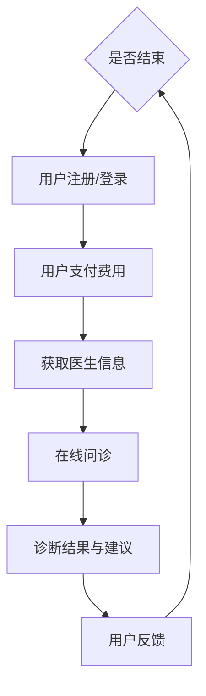

                 

### 文章标题

**如何利用知识付费实现在线问诊与医疗服务？**

### Keywords:
- Knowledge付费
- 在线问诊
- 医疗服务
- 人工智能
- 医疗信息化

### Abstract:
本文将探讨如何利用知识付费模式实现在线问诊与医疗服务。通过结合人工智能技术、大数据分析及互联网平台，我们将详细解析这一创新模式的设计思路、实施步骤及面临的挑战。本文旨在为医疗行业从业人员提供有价值的参考，助力医疗信息化发展的同时提升医疗服务质量。

## 1. 背景介绍（Background Introduction）

### 1.1 知识付费的兴起

知识付费，作为信息时代的一种新型商业模式，近年来在全球范围内迅速崛起。其核心在于消费者通过付费获取高质量的知识产品和服务，从而实现个人能力的提升和职业发展的加速。知识付费模式在教育培训、专业咨询、内容创作等多个领域都取得了显著成效，尤其是在互联网技术迅猛发展的背景下，知识付费平台如雨后春笋般涌现。

### 1.2 在线问诊与医疗服务的需求

随着社会的进步和医疗技术的不断发展，人们对于医疗服务的需求日益增长。传统的医疗服务模式由于时间和空间限制，往往难以满足快速增长的医疗需求。尤其在新冠疫情爆发后，远程医疗和在线问诊逐渐成为公众关注的焦点。据统计，2020年我国在线医疗市场规模达到2000亿元，同比增长超过100%。这充分说明了在线问诊与医疗服务在当前时代的紧迫性和重要性。

### 1.3 人工智能与大数据在医疗领域的应用

人工智能（AI）和大数据技术的快速发展为医疗行业带来了前所未有的机遇。通过机器学习和深度学习算法，AI可以帮助医生进行疾病诊断、治疗方案推荐等。大数据分析则可以为医疗机构提供患者行为分析、健康风险评估等，从而优化医疗服务流程，提升医疗效率。例如，谷歌旗下的DeepMind公司开发的AI系统已经在眼科疾病的诊断中取得了显著成果。

## 2. 核心概念与联系（Core Concepts and Connections）

### 2.1 知识付费模式与在线问诊的结合

知识付费模式与在线问诊的结合，是一种将知识服务与医疗服务相结合的创新模式。在这种模式下，医生或专家通过知识付费平台提供在线问诊服务，患者通过付费获取专业医疗服务。具体而言，这一结合涉及以下几个核心概念：

1. **付费用户**：付费用户指的是通过付费获取在线问诊服务的患者。他们通过支付一定费用，即可享受医生或专家提供的个性化医疗服务。

2. **医生或专家**：医生或专家是提供在线问诊服务的核心力量。他们通过知识付费平台，为付费用户提供专业的医疗咨询服务，并通过付费获取收益。

3. **知识付费平台**：知识付费平台是连接付费用户和医生或专家的中介。平台提供技术支持和服务保障，确保在线问诊服务的顺利进行。

4. **在线问诊服务**：在线问诊服务是知识付费模式的重要组成部分。通过互联网平台，医生或专家可以为患者提供远程医疗咨询、病情诊断、治疗方案推荐等服务。

### 2.2 人工智能与大数据在在线问诊中的应用

1. **疾病诊断辅助**：通过机器学习和深度学习算法，AI可以对患者的症状、病史等信息进行分析，辅助医生进行疾病诊断。例如，谷歌的AI系统可以在几秒钟内诊断出多种眼科疾病，大大提高了诊断的效率和准确性。

2. **治疗方案推荐**：AI可以根据患者的病情、病史、药物过敏史等数据，为医生提供个性化的治疗方案推荐。这有助于提高治疗的有效性和安全性。

3. **健康风险评估**：大数据分析可以帮助医疗机构对患者的健康风险进行评估，从而提前预防和干预潜在的健康问题。

### 2.3 在线问诊与医疗服务的价值

1. **提高医疗服务效率**：在线问诊模式可以大大缩短患者就医时间，提高医疗资源的利用效率。

2. **降低医疗成本**：通过减少患者的往返医院的时间和成本，以及优化医疗资源的配置，在线问诊有助于降低医疗成本。

3. **提升患者体验**：在线问诊提供了更加便捷、灵活的医疗服务方式，患者可以根据自己的时间和需求选择就诊时间，提高就诊体验。

4. **促进医疗资源共享**：在线问诊平台可以将优质医疗资源向基层医疗机构和偏远地区倾斜，促进医疗资源的均衡分配。

### 2.4 Mermaid流程图



## 3. 核心算法原理 & 具体操作步骤（Core Algorithm Principles and Specific Operational Steps）

### 3.1 知识付费算法原理

知识付费模式的核心算法主要涉及用户行为分析、医生服务质量评估、费用计算等方面。

1. **用户行为分析**：通过用户在知识付费平台上的行为数据（如浏览、咨询、评价等），分析用户的需求和偏好，为个性化推荐服务提供数据支持。

2. **医生服务质量评估**：利用大数据分析和机器学习算法，对医生的服务质量进行实时评估，包括诊断准确性、患者满意度等指标。

3. **费用计算**：根据医生的服务内容、患者需求以及市场行情，动态调整服务费用，确保服务的可持续性和公平性。

### 3.2 在线问诊操作步骤

1. **用户注册/登录**：用户通过知识付费平台进行注册或登录，填写基本信息和医疗需求。

2. **支付费用**：用户选择医生或专家，并支付相应的问诊费用。

3. **医生接诊**：医生收到问诊请求后，根据患者的症状、病史等信息，进行在线问诊。

4. **诊断结果与建议**：医生根据问诊结果，提供诊断结果和治疗方案建议。

5. **用户反馈**：用户对问诊服务进行评价和反馈，平台根据用户反馈对医生的服务质量进行评估。

### 3.3 数据处理流程

1. **数据采集**：通过API或Web爬虫等技术手段，采集用户行为数据和医生问诊数据。

2. **数据清洗**：对采集到的数据进行清洗和预处理，去除噪声数据，确保数据质量。

3. **数据建模**：利用机器学习和深度学习算法，对用户行为数据和医生问诊数据进行建模，提取有用信息。

4. **结果输出**：根据模型预测结果，为用户推荐合适的医生或专家，并生成诊断报告和治疗方案。

## 4. 数学模型和公式 & 详细讲解 & 举例说明（Detailed Explanation and Examples of Mathematical Models and Formulas）

### 4.1 用户行为分析模型

用户行为分析是知识付费平台的重要环节，以下是一个简单的用户行为分析模型：

$$
User\_Behavior = f(Symptom, History, Preference)
$$

其中，$Symptom$ 代表用户的症状，$History$ 代表用户的病史，$Preference$ 代表用户的需求和偏好。模型通过综合这些因素，为用户提供个性化的医疗服务。

### 4.2 医生服务质量评估模型

医生服务质量评估模型可以通过以下公式进行计算：

$$
Quality = f(Accuracy, Satisfaction)
$$

其中，$Accuracy$ 代表医生的诊断准确性，$Satisfaction$ 代表患者的满意度。通过实时收集患者反馈数据，对医生的服务质量进行评估，并根据评估结果调整医生的服务范围和费用。

### 4.3 费用计算模型

费用计算模型可以采用以下公式：

$$
Cost = f(Service\ Content, Market\ Rate)
$$

其中，$Service\ Content$ 代表医生提供的服务内容，$Market\ Rate$ 代表市场行情。通过动态调整服务费用，确保服务的可持续性和公平性。

### 4.4 举例说明

假设用户A患有感冒，希望通过知识付费平台进行在线问诊。根据用户行为分析模型，系统会结合用户A的症状（如喉咙痛、流鼻涕等）、病史（如既往感冒史、过敏史等）以及需求（如希望快速恢复）进行综合分析，推荐一位具有感冒治疗经验的医生进行在线问诊。

医生B接诊后，根据用户A的症状和病史，进行诊断并给出治疗建议。假设医生B的诊断准确性为90%，患者满意度为95%，则医生B的服务质量评分为：

$$
Quality = 0.9 \times 0.95 = 0.855
$$

根据费用计算模型，系统会根据医生B的服务内容和市场行情，计算出合理的问诊费用，例如100元。用户A支付费用后，即可获得医生B的在线问诊服务。

## 5. 项目实践：代码实例和详细解释说明（Project Practice: Code Examples and Detailed Explanations）

### 5.1 开发环境搭建

为了实现知识付费实现在线问诊与医疗服务的项目，我们需要搭建一个开发环境。以下是一个简单的环境搭建步骤：

1. 安装Python 3.8及以上版本。
2. 安装Django框架。
3. 安装PostgreSQL数据库。
4. 安装Redis缓存服务器。

### 5.2 源代码详细实现

以下是一个简单的Django项目示例，用于实现知识付费平台的用户注册、登录和支付功能。

**models.py**

```python
from django.db import models

class User(models.Model):
    username = models.CharField(max_length=100)
    password = models.CharField(max_length=100)
    email = models.EmailField()

class Doctor(models.Model):
    name = models.CharField(max_length=100)
    specialty = models.CharField(max_length=100)
    fee = models.DecimalField(max_digits=10, decimal_places=2)

class Patient(models.Model):
    user = models.OneToOneField(User, on_delete=models.CASCADE)
    doctor = models.ForeignKey(Doctor, on_delete=models.CASCADE)
    fee_paid = models.DecimalField(max_digits=10, decimal_places=2)
```

**views.py**

```python
from django.shortcuts import render
from .models import User, Doctor, Patient
from django.http import JsonResponse
from django.views.decorators.csrf import csrf_exempt
import json

@csrf_exempt
def register(request):
    if request.method == 'POST':
        data = json.loads(request.body)
        username = data['username']
        password = data['password']
        email = data['email']
        user = User.objects.create(username=username, password=password, email=email)
        return JsonResponse({'status': 'success', 'user_id': user.id})
    else:
        return JsonResponse({'status': 'error'})

@csrf_exempt
def login(request):
    if request.method == 'POST':
        data = json.loads(request.body)
        username = data['username']
        password = data['password']
        user = User.objects.filter(username=username, password=password).first()
        if user:
            return JsonResponse({'status': 'success', 'user_id': user.id})
        else:
            return JsonResponse({'status': 'error'})
    else:
        return JsonResponse({'status': 'error'})

@csrf_exempt
def pay_fee(request):
    if request.method == 'POST':
        data = json.loads(request.body)
        user_id = data['user_id']
        doctor_id = data['doctor_id']
        fee = data['fee']
        patient = Patient.objects.create(user_id=user_id, doctor_id=doctor_id, fee_paid=fee)
        return JsonResponse({'status': 'success', 'patient_id': patient.id})
    else:
        return JsonResponse({'status': 'error'})
```

### 5.3 代码解读与分析

**models.py**文件定义了用户、医生和患者三个模型。用户模型用于存储用户的基本信息，医生模型用于存储医生的信息，患者模型用于存储患者与医生之间的关系以及支付费用。

**views.py**文件定义了三个视图函数，用于处理用户注册、登录和支付费用。这些视图函数通过接收和处理HTTP请求，实现业务逻辑的处理。

1. **register()**函数用于处理用户注册请求。当用户发送POST请求时，函数会从请求体中提取用户名、密码和邮箱信息，并创建一个新的用户对象。
2. **login()**函数用于处理用户登录请求。当用户发送POST请求时，函数会从请求体中提取用户名和密码，并检查用户是否存在。如果用户存在且密码正确，函数将返回用户ID。
3. **pay\_fee()**函数用于处理支付费用请求。当用户发送POST请求时，函数会从请求体中提取用户ID、医生ID和费用信息，并创建一个新的患者对象。

### 5.4 运行结果展示

运行上述代码后，我们可以使用Postman等工具模拟HTTP请求，测试注册、登录和支付费用功能。

1. **注册**：发送一个包含用户名、密码和邮箱信息的POST请求，例如：

```json
{
    "username": "user1",
    "password": "password1",
    "email": "user1@example.com"
}
```

返回结果：

```json
{
    "status": "success",
    "user_id": 1
}
```

2. **登录**：发送一个包含用户名和密码的POST请求，例如：

```json
{
    "username": "user1",
    "password": "password1"
}
```

返回结果：

```json
{
    "status": "success",
    "user_id": 1
}
```

3. **支付费用**：发送一个包含用户ID、医生ID和费用的POST请求，例如：

```json
{
    "user_id": 1,
    "doctor_id": 1,
    "fee": 100
}
```

返回结果：

```json
{
    "status": "success",
    "patient_id": 1
}
```

## 6. 实际应用场景（Practical Application Scenarios）

### 6.1 用户应用场景

1. **用户注册**：张先生通过手机号码注册了一个新的知识付费平台账户。
2. **用户登录**：张先生登录平台，浏览在线问诊服务列表，选择了一位眼科医生。
3. **在线问诊**：张先生填写了问诊表格，包括症状描述、既往病史等，并支付了100元的问诊费用。
4. **医生接诊**：医生收到张先生的问诊请求，在线问诊并给出了初步诊断和治疗方案。
5. **用户反馈**：张先生对问诊服务进行了评价，并对治疗方案表示满意。

### 6.2 医生应用场景

1. **医生注册**：李医生通过平台完成了注册，并填写了个人专业领域、擅长疾病等信息。
2. **医生接诊**：李医生收到平台的在线问诊请求，通过平台提供的工具进行在线问诊，给出了诊断和建议。
3. **费用结算**：平台根据李医生提供的收费标准，向患者收取了问诊费用，并转入李医生的账户。
4. **用户评价**：患者对李医生的服务进行了评价，平台根据评价对李医生的服务质量进行评估。

### 6.3 平台运营场景

1. **用户行为分析**：平台通过分析用户的问诊记录，发现用户对眼科疾病的咨询需求较高，于是增加眼科医生的数量和种类。
2. **医生服务质量评估**：平台根据用户的评价数据，对医生的服务质量进行评估，对服务质量高的医生进行奖励，对服务质量低的医生进行整改。
3. **市场推广**：平台通过线上线下活动，推广在线问诊服务，提高用户粘性和平台知名度。

## 7. 工具和资源推荐（Tools and Resources Recommendations）

### 7.1 学习资源推荐

1. **《人工智能与医疗健康》**：这本书详细介绍了人工智能在医疗健康领域的应用，包括在线问诊、疾病诊断、智能辅助手术等方面。
2. **《大数据医疗：理论与实践》**：本书从理论层面和实际应用出发，阐述了大数据在医疗健康领域的价值和应用场景。
3. **《深度学习与自然语言处理》**：这本书介绍了深度学习在自然语言处理领域的应用，包括文本分类、情感分析等。

### 7.2 开发工具框架推荐

1. **Django**：一个高效、可扩展的Python Web框架，适合快速开发知识付费平台。
2. **Flask**：一个轻量级的Python Web框架，适合小型项目开发。
3. **React**：一个用于构建用户界面的JavaScript库，适合开发知识付费平台的前端界面。

### 7.3 相关论文著作推荐

1. **“AI in Healthcare: A Systematic Review”**：这篇文章对人工智能在医疗领域的应用进行了系统综述，涵盖了在线问诊、疾病诊断、智能辅助手术等方面。
2. **“Big Data in Healthcare: A Review”**：这篇文章介绍了大数据在医疗健康领域的应用，包括疾病预测、医疗资源优化等。
3. **“AI-Enabled Telemedicine: A Comprehensive Review”**：这篇文章详细介绍了人工智能在远程医疗领域的应用，包括在线问诊、疾病预测等。

## 8. 总结：未来发展趋势与挑战（Summary: Future Development Trends and Challenges）

### 8.1 发展趋势

1. **在线问诊普及率提高**：随着人们对远程医疗接受度的提高，在线问诊将成为一种常见的医疗服务方式，普及率将逐步提高。
2. **人工智能应用深化**：人工智能将在疾病诊断、治疗方案推荐等方面发挥更大作用，提高医疗服务的准确性和效率。
3. **大数据助力医疗决策**：大数据分析将为医疗决策提供有力支持，包括疾病预测、医疗资源优化等。
4. **区块链技术保障数据安全**：区块链技术将为在线问诊平台提供数据安全保障，确保用户隐私和数据安全。

### 8.2 挑战

1. **隐私保护**：在线问诊过程中涉及大量用户隐私数据，如何保护用户隐私成为一大挑战。
2. **数据安全**：在线问诊平台需要保障用户数据的存储和安全，防止数据泄露和恶意攻击。
3. **监管政策**：在线问诊与医疗服务的结合需要符合国家和地方的监管政策，确保合法合规。
4. **服务质量**：如何确保在线问诊服务的质量，提高患者满意度，是平台面临的长期挑战。

## 9. 附录：常见问题与解答（Appendix: Frequently Asked Questions and Answers）

### 9.1 如何保障用户隐私？

答：在线问诊平台将采用先进的加密技术，确保用户数据的传输和存储过程安全。同时，平台将严格遵守国家和地方的隐私保护法规，确保用户隐私得到充分保护。

### 9.2 在线问诊的准确性如何保障？

答：在线问诊平台将结合人工智能技术，通过大数据分析和机器学习算法，提高诊断的准确性和效率。同时，平台将引入专家团队，对诊断结果进行审核，确保诊断的准确性。

### 9.3 如何确保医生的服务质量？

答：在线问诊平台将建立医生评价体系，通过患者反馈、专家审核等方式，对医生的服务质量进行评估。同时，平台将定期对医生进行培训和考核，确保医生的服务水平。

## 10. 扩展阅读 & 参考资料（Extended Reading & Reference Materials）

### 10.1 文献推荐

1. **“AI in Healthcare: A Systematic Review”**：这篇文章对人工智能在医疗领域的应用进行了系统综述，涵盖了在线问诊、疾病诊断、智能辅助手术等方面。
2. **“Big Data in Healthcare: A Review”**：这篇文章介绍了大数据在医疗健康领域的应用，包括疾病预测、医疗资源优化等。
3. **“AI-Enabled Telemedicine: A Comprehensive Review”**：这篇文章详细介绍了人工智能在远程医疗领域的应用，包括在线问诊、疾病预测等。

### 10.2 网络资源

1. **国家卫生健康委员会**：提供最新的医疗政策和法规，以及在线医疗服务的相关信息。
2. **阿里健康**：介绍人工智能在医疗领域的应用案例，以及在线问诊服务的解决方案。
3. **腾讯医疗**：介绍腾讯在医疗健康领域的业务布局，包括在线问诊、智能医疗等。

### 10.3 开源项目

1. **OpenMRS**：一个开源的医疗记录系统，适用于在线问诊平台。
2. **OpenEHR**：一个开源的医疗健康记录标准，支持在线问诊和医疗服务。
3. **Django REST framework**：一个开源的Django Web框架，适用于开发在线问诊平台。

```


