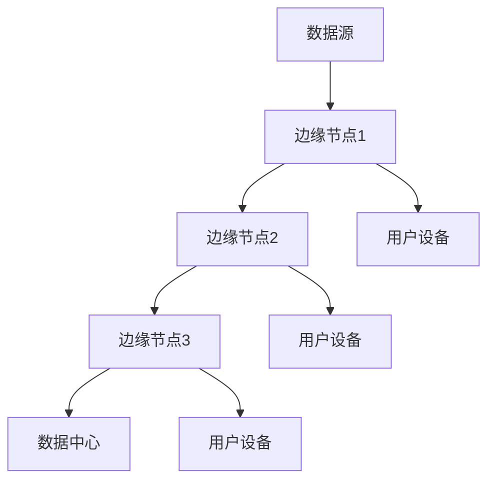

                 

# 如何利用边缘计算提升应用性能

## 关键词

边缘计算，应用性能，数据处理，延迟优化，实时响应，分布式系统

## 摘要

边缘计算作为一种分布式计算架构，正逐渐成为提升应用性能的关键技术。本文将探讨边缘计算的原理、核心概念及其在实际应用中的性能提升策略。通过分析边缘计算在数据处理、延迟优化和实时响应等方面的优势，我们将展示如何通过边缘计算优化应用的性能。

### 1. 背景介绍

#### 1.1 边缘计算的概念

边缘计算是一种分布式计算架构，将数据处理和计算任务从集中式数据中心转移到网络边缘。网络边缘通常指靠近数据源或最终用户的位置，如智能设备、物联网（IoT）设备和无线接入点。通过在边缘进行数据处理和计算，边缘计算能够显著降低数据传输的延迟，提高系统的响应速度和可靠性。

#### 1.2 应用性能的重要性

应用性能是企业成功的关键因素之一。高效的性能可以带来更好的用户体验，提高业务效率，减少运营成本。然而，随着数据量和用户数量的增加，传统的集中式计算架构面临着数据传输延迟、带宽限制和计算资源不足等问题。边缘计算提供了一种解决方案，通过在数据产生的地方进行数据处理，可以减少数据传输的距离和时间，从而提升应用性能。

### 2. 核心概念与联系

#### 2.1 边缘计算的核心概念

边缘计算的核心概念包括以下方面：

- **数据分布**：将数据分布到网络的边缘节点，以便在靠近数据源的地方进行数据处理。
- **实时分析**：对实时数据进行快速分析，以支持快速决策和响应。
- **计算与存储的融合**：在边缘节点上集成计算和存储资源，以提高数据处理效率。
- **网络边缘设备**：包括各种智能设备和物联网设备，它们负责数据的收集和初步处理。

#### 2.2 边缘计算架构的 Mermaid 流程图



在这个流程图中，数据源产生的数据通过边缘节点进行处理和存储，然后根据需要传输到数据中心或直接发送给用户设备。

### 3. 核心算法原理 & 具体操作步骤

#### 3.1 边缘计算的优势

边缘计算在以下方面具有显著优势：

- **降低延迟**：通过在数据产生的地方进行数据处理，可以显著降低数据传输的延迟。
- **提高带宽利用率**：减少需要传输到中心数据中心的原始数据量，从而提高网络带宽的利用率。
- **增强安全性**：将敏感数据留在边缘节点，减少数据在网络上传输的风险。
- **支持实时响应**：边缘节点可以快速响应实时事件，提高系统的实时性。

#### 3.2 边缘计算的具体操作步骤

1. **数据收集**：在数据源处收集数据，并将其发送到边缘节点。
2. **数据预处理**：在边缘节点对数据进行初步处理，如清洗、过滤和转换。
3. **数据分析和存储**：在边缘节点对数据进行实时分析，并将处理结果存储在边缘节点或数据中心。
4. **数据转发**：根据应用需求，将处理结果转发给用户设备或数据中心。

### 4. 数学模型和公式 & 详细讲解 & 举例说明

#### 4.1 延迟模型

延迟 \( D \) 可以用以下公式表示：

\[ D = \frac{L}{B} \]

其中，\( L \) 是数据传输距离，\( B \) 是数据传输速率。

#### 4.2 例子说明

假设数据传输距离 \( L \) 为 100 公里，数据传输速率 \( B \) 为 1 Mbps。则延迟 \( D \) 为：

\[ D = \frac{100 \text{ km}}{1 \text{ Mbps}} = 100 \text{ s} \]

如果使用边缘计算，将数据处理转移到靠近数据源的位置，假设数据传输距离减少到 10 公里，则延迟 \( D \) 减少到：

\[ D = \frac{10 \text{ km}}{1 \text{ Mbps}} = 10 \text{ s} \]

### 5. 项目实践：代码实例和详细解释说明

#### 5.1 开发环境搭建

在本项目实践中，我们将使用 Python 编写边缘计算应用程序。首先，确保已经安装了 Python 环境。然后，安装必要的库，如 Flask（用于构建 Web 应用程序）和 Pandas（用于数据操作）。

```bash
pip install flask pandas
```

#### 5.2 源代码详细实现

下面是一个简单的边缘计算应用程序示例：

```python
from flask import Flask, request, jsonify
import pandas as pd

app = Flask(__name__)

@app.route('/process_data', methods=['POST'])
def process_data():
    data = request.get_json()
    df = pd.DataFrame(data['data'])
    processed_data = df.sum()  # 对数据进行简单的处理，例如求和
    return jsonify(processed_data.to_dict())

if __name__ == '__main__':
    app.run(host='0.0.0.0', port=5000)
```

在这个示例中，我们创建了一个 Flask Web 应用程序，通过 `/process_data` 接口接收数据，使用 Pandas 对数据进行处理，并将处理结果返回给客户端。

#### 5.3 代码解读与分析

- **数据接收**：应用程序通过 Flask 的 `request` 对象接收客户端发送的 JSON 数据。
- **数据转换**：使用 Pandas 将接收到的 JSON 数据转换为 DataFrame 对象。
- **数据处理**：对 DataFrame 对象进行简单的处理，例如求和。
- **数据返回**：将处理结果转换为 JSON 格式，并通过 Flask 的 `jsonify` 函数返回给客户端。

#### 5.4 运行结果展示

运行此应用程序后，您可以使用任何 HTTP 客户端（如 curl 或 Postman）向应用程序发送 POST 请求，并接收处理结果。例如：

```bash
curl -X POST -H "Content-Type: application/json" -d '{"data": [{"name": "Alice", "age": 30}, {"name": "Bob", "age": 25}]}' http://localhost:5000/process_data
```

这将返回一个包含数据总和的 JSON 响应。

### 6. 实际应用场景

边缘计算在以下实际应用场景中具有显著优势：

- **物联网（IoT）**：在物联网应用中，边缘计算可以实时处理传感器数据，支持智能设备快速响应。
- **智能交通**：在智能交通系统中，边缘计算可以实时分析交通流量，优化交通信号控制。
- **工业自动化**：在工业自动化领域，边缘计算可以实时监控生产设备状态，预测故障，提高生产效率。
- **智慧城市**：在智慧城市应用中，边缘计算可以支持智能监控、环境监测和城市管理。

### 7. 工具和资源推荐

#### 7.1 学习资源推荐

- **书籍**：《边缘计算：边缘智能时代的技术与应用》
- **论文**：《边缘计算：架构、挑战与未来趋势》
- **博客**：[边缘计算技术博客](https://www.edgecomputing.org/blog)
- **网站**：[边缘计算联盟](https://www边缘计算联盟.org)

#### 7.2 开发工具框架推荐

- **边缘计算框架**：Kubernetes、OpenFaaS、KubeEdge
- **编程语言**：Python、JavaScript、Go
- **开发工具**：Visual Studio Code、Docker

#### 7.3 相关论文著作推荐

- **论文**：《边缘计算中的资源调度策略研究》
- **著作**：《边缘智能：原理、架构与应用》

### 8. 总结：未来发展趋势与挑战

边缘计算作为一种新兴技术，正在快速发展并逐步应用于各个领域。未来的发展趋势包括：

- **更高效的边缘计算架构**：随着硬件技术的发展，边缘计算架构将更加高效，支持更复杂的计算任务。
- **更广泛的应用场景**：边缘计算将在更多的领域得到应用，如智能医疗、智慧农业和智能家居等。
- **更安全的边缘计算**：随着边缘计算应用的普及，安全性将成为一个重要的挑战，需要开发更加安全的边缘计算系统。

然而，边缘计算仍面临一些挑战，如计算资源的有限性、网络稳定性和数据隐私等。未来需要解决这些挑战，以实现边缘计算的广泛应用。

### 9. 附录：常见问题与解答

#### 9.1 边缘计算与云计算有什么区别？

边缘计算和云计算都是分布式计算架构，但它们有不同的应用场景。云计算主要涉及集中式数据处理，而边缘计算则强调在靠近数据源的地方进行数据处理。边缘计算可以显著降低数据传输的延迟，提高系统的实时性。

#### 9.2 边缘计算对网络带宽有什么影响？

边缘计算可以降低网络带宽的占用，因为数据处理被转移到靠近数据源的地方。这有助于减少需要传输到中心数据中心的原始数据量，从而提高网络带宽的利用率。

#### 9.3 边缘计算是否适用于所有应用？

边缘计算在某些应用中具有显著优势，但并不适用于所有应用。对于实时性要求高、数据处理量大的应用，如智能交通和工业自动化，边缘计算是一个很好的选择。然而，对于一些数据处理量较小、对延迟要求不高的应用，云计算可能更为合适。

### 10. 扩展阅读 & 参考资料

- **书籍**：《边缘计算：边缘智能时代的技术与应用》
- **论文**：《边缘计算：架构、挑战与未来趋势》
- **网站**：[边缘计算联盟](https://www边缘计算联盟.org)
- **博客**：[边缘计算技术博客](https://www.edgecomputing.org/blog)

### 作者署名

作者：禅与计算机程序设计艺术 / Zen and the Art of Computer Programming

