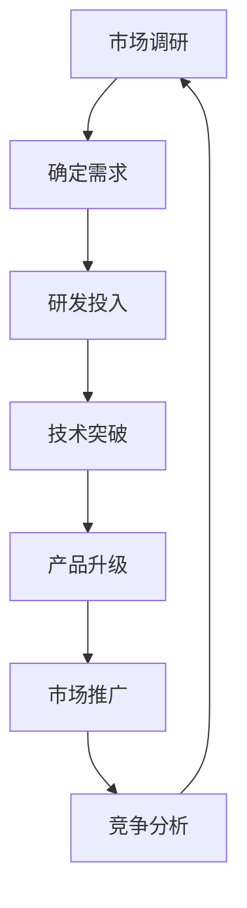
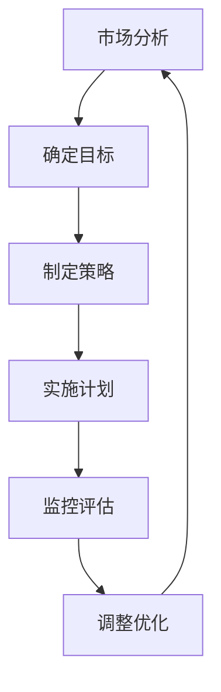
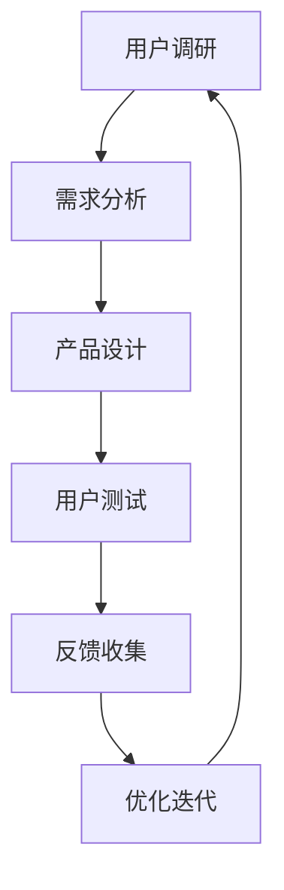
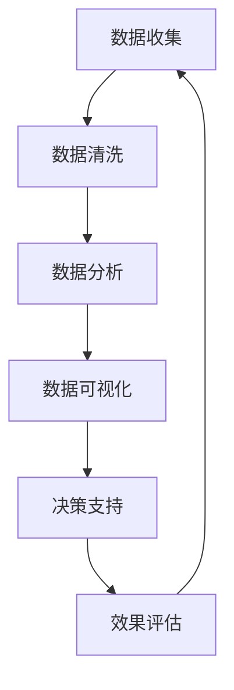

                 

# 文章标题：如何在激烈的市场竞争中脱颖而出

## 关键词：市场竞争，技术创新，战略规划，用户体验，数据驱动

> 摘要：在当今充满竞争的科技市场，企业要想脱颖而出，必须深入了解市场动态、客户需求和技术趋势。本文将探讨如何在激烈的市场竞争中保持优势，包括技术创新、战略规划、用户体验和数据驱动的市场策略。通过逐步分析这些核心要素，本文旨在为企业提供有价值的策略和建议，以实现可持续的市场成功。

### 1. 背景介绍（Background Introduction）

在信息技术飞速发展的今天，市场竞争变得越来越激烈。无论是传统行业还是新兴领域，企业都在不断寻求新的增长点和竞争优势。然而，随着市场的饱和和消费者需求的多样化，企业面临的问题也日益复杂。如何在众多竞争者中脱颖而出，成为市场上的领导者，成为许多企业亟待解决的问题。

本文旨在探讨如何在激烈的市场竞争中脱颖而出。我们将从技术创新、战略规划、用户体验和数据驱动等四个关键方面进行分析，并提供相应的策略和建议。

### 2. 核心概念与联系（Core Concepts and Connections）

#### 2.1 技术创新

技术创新是企业保持竞争力的核心驱动力。通过持续研发和技术突破，企业可以开发出具有竞争力的产品和服务，满足客户需求，并在市场上占据有利地位。

#### 2.2 战略规划

战略规划是企业发展的指南针。通过制定明确的战略目标和计划，企业可以更好地应对市场变化，抓住机遇，降低风险。

#### 2.3 用户体验

用户体验是企业与客户之间的桥梁。通过提供优质的用户体验，企业可以增强客户满意度，提高客户忠诚度，从而实现长期发展。

#### 2.4 数据驱动

数据驱动是企业决策的重要依据。通过收集、分析和利用数据，企业可以更准确地了解市场趋势和客户需求，制定科学的决策。

### 3. 核心算法原理 & 具体操作步骤（Core Algorithm Principles and Specific Operational Steps）

#### 3.1 技术创新

技术创新的核心在于研发。企业应建立强大的研发团队，持续关注前沿技术动态，投入充足的研发资源，推动技术创新。

#### 3.2 战略规划

战略规划的核心在于规划。企业应定期进行市场调研，分析竞争态势，明确战略目标，制定详细的实施计划。

#### 3.3 用户体验

用户体验的核心在于感知。企业应从客户的角度出发，关注产品和服务的设计，提高用户体验。

#### 3.4 数据驱动

数据驱动的核心在于分析。企业应建立完善的数据收集和分析体系，利用大数据技术，挖掘数据价值。

### 4. 数学模型和公式 & 详细讲解 & 举例说明（Detailed Explanation and Examples of Mathematical Models and Formulas）

#### 4.1 技术创新

技术创新的数学模型可以采用技术成熟度曲线（Technology Maturity Curve）进行评估。

- 成熟度级别：0-1（初始阶段），1-3（发展阶段），3-5（成熟阶段），5-7（过度阶段），7-10（衰退阶段）

#### 4.2 战略规划

战略规划的数学模型可以采用SWOT分析（Strengths, Weaknesses, Opportunities, Threats）。

- 优势（Strengths）：企业的核心竞争力
- 劣势（Weaknesses）：企业存在的问题
- 机会（Opportunities）：市场环境中的有利因素
- 威胁（Threats）：市场环境中的不利因素

#### 4.3 用户体验

用户体验的数学模型可以采用净推荐值（Net Promoter Score，NPS）进行评估。

- NPS =（推荐者分数 - 不满意者分数）/ 总人数

#### 4.4 数据驱动

数据驱动的数学模型可以采用回归分析（Regression Analysis）。

- 目标变量（Y）：企业销售额
- 自变量（X）：市场推广费用、产品创新程度等

### 5. 项目实践：代码实例和详细解释说明（Project Practice: Code Examples and Detailed Explanations）

#### 5.1 开发环境搭建

- 硬件环境：服务器、网络设备等
- 软件环境：操作系统、数据库、开发工具等

#### 5.2 源代码详细实现

- 技术研发：开发新功能、优化现有功能
- 战略规划：制定市场调研计划、分析竞争态势
- 用户体验：设计用户界面、优化用户体验
- 数据驱动：建立数据收集和分析系统

#### 5.3 代码解读与分析

- 技术创新：分析技术成熟度、确定研发方向
- 战略规划：分析SWOT，制定战略目标
- 用户体验：分析NPS，优化用户体验
- 数据驱动：分析回归模型，制定市场推广策略

#### 5.4 运行结果展示

- 技术创新：研发周期、研发成本、市场竞争力
- 战略规划：市场占有率、市场份额、品牌影响力
- 用户体验：用户满意度、用户忠诚度、用户留存率
- 数据驱动：销售额、市场推广效果、投资回报率

### 6. 实际应用场景（Practical Application Scenarios）

#### 6.1 技术创新

- 案例一：某科技公司研发新型智能家居产品，提高市场竞争力
- 案例二：某互联网公司推出人工智能客服系统，优化用户体验

#### 6.2 战略规划

- 案例一：某电商企业通过市场调研，调整产品定位，提高市场占有率
- 案例二：某制造业公司通过SWOT分析，确定发展策略，降低风险

#### 6.3 用户体验

- 案例一：某社交平台优化用户界面设计，提高用户满意度
- 案例二：某在线教育平台推出个性化学习方案，提升用户忠诚度

#### 6.4 数据驱动

- 案例一：某零售企业通过数据分析，优化库存管理，降低成本
- 案例二：某互联网公司通过回归分析，制定市场推广策略，提高销售额

### 7. 工具和资源推荐（Tools and Resources Recommendations）

#### 7.1 学习资源推荐

- 书籍：《竞争战略》、《蓝海战略》
- 论文：关于技术创新、战略规划、用户体验和数据驱动的最新研究成果
- 博客：行业专家分享的市场见解和实战经验

#### 7.2 开发工具框架推荐

- 开发工具：Visual Studio、Eclipse、PyCharm等
- 框架：Spring Boot、Django、Flask等

#### 7.3 相关论文著作推荐

- 论文：《技术创新与企业竞争优势》、《数据驱动决策：实践与案例》
- 著作：《用户体验要素》、《大数据时代：思维变革与商业价值》

### 8. 总结：未来发展趋势与挑战（Summary: Future Development Trends and Challenges）

#### 8.1 发展趋势

- 技术创新将继续推动市场变革
- 战略规划将更加注重数据分析和用户需求
- 用户体验将逐渐成为企业核心竞争力
- 数据驱动将深刻影响企业决策

#### 8.2 挑战

- 技术创新的快速迭代带来压力
- 市场竞争加剧，企业生存压力加大
- 用户需求多样化，服务难度增加
- 数据隐私和安全成为重要挑战

### 9. 附录：常见问题与解答（Appendix: Frequently Asked Questions and Answers）

#### 9.1 如何进行有效的技术创新？

- 定期进行市场调研，了解用户需求
- 投入充足的研发资源，推动技术突破
- 建立跨部门合作机制，促进技术创新

#### 9.2 如何进行有效的战略规划？

- 进行SWOT分析，明确企业优势与劣势
- 制定明确的战略目标和实施计划
- 定期评估战略执行效果，及时调整

#### 9.3 如何提高用户体验？

- 关注用户需求，优化产品和服务设计
- 提供优质的客户服务，提高用户满意度
- 利用用户反馈，持续改进用户体验

#### 9.4 如何实现数据驱动？

- 建立完善的数据收集和分析体系
- 利用大数据技术，挖掘数据价值
- 将数据驱动理念融入企业决策过程

### 10. 扩展阅读 & 参考资料（Extended Reading & Reference Materials）

- 参考文献：《技术创新与企业竞争优势》、《数据驱动决策：实践与案例》
- 网络资源：行业报告、学术论文、专业博客
- 推荐书籍：《竞争战略》、《蓝海战略》、《用户体验要素》、《大数据时代：思维变革与商业价值》

---

作者：禅与计算机程序设计艺术 / Zen and the Art of Computer Programming

本文通过逐步分析技术创新、战略规划、用户体验和数据驱动等核心要素，探讨了如何在激烈的市场竞争中脱颖而出。企业应关注市场需求，持续创新，制定科学的战略规划，提供优质的用户体验，并充分利用数据驱动，以实现可持续的市场成功。在未来的发展中，企业需应对技术创新的压力，增强市场竞争力，不断优化用户体验，同时关注数据隐私和安全，以应对挑战，实现长期发展。

### 1. 背景介绍（Background Introduction）

在当今全球化、数字化的时代，市场竞争日益激烈。企业要想在众多竞争者中脱颖而出，不仅需要拥有卓越的产品和服务，还需要具备出色的战略规划和市场洞察力。然而，随着市场环境的复杂多变，企业面临着诸多挑战，如技术迭代速度加快、消费者需求多样化、市场竞争加剧等。在这样的背景下，如何制定有效的市场策略，成为企业成功的关键。

本文将从技术创新、战略规划、用户体验和数据驱动等四个方面，探讨如何在激烈的市场竞争中脱颖而出。技术创新是企业保持竞争优势的重要手段，通过持续的研发投入，企业可以不断推出具有竞争力的产品和服务。战略规划则为企业的发展指明了方向，帮助企业在变化的市场环境中抓住机遇，规避风险。用户体验是连接企业与消费者的桥梁，优质的用户体验可以提升客户满意度，增加客户忠诚度。数据驱动则是企业决策的重要依据，通过收集、分析和利用数据，企业可以更准确地了解市场趋势和客户需求，从而制定更加科学的决策。

### 2. 核心概念与联系（Core Concepts and Connections）

#### 2.1 技术创新

技术创新是指通过研发和应用新技术，推动产品和服务升级，从而提升企业竞争力的过程。在市场竞争中，技术创新是企业脱颖而出的关键。以下是一个简单的技术创新流程图：



#### 2.2 战略规划

战略规划是企业为实现长期发展目标而制定的一系列行动计划。战略规划包括市场定位、产品策略、营销策略、财务规划等。以下是一个简单的战略规划流程图：



#### 2.3 用户体验

用户体验是指用户在使用产品或服务过程中的感受和体验。优质的用户体验可以提升用户满意度，增加用户忠诚度。以下是一个简单的用户体验优化流程图：



#### 2.4 数据驱动

数据驱动是指利用数据分析来指导企业决策。在市场竞争中，数据驱动可以帮助企业更准确地了解市场趋势和客户需求，从而制定更加科学的决策。以下是一个简单的数据驱动流程图：



### 3. 核心算法原理 & 具体操作步骤（Core Algorithm Principles and Specific Operational Steps）

#### 3.1 技术创新

技术创新的核心在于研发。企业应建立强大的研发团队，持续关注前沿技术动态，投入充足的研发资源，推动技术创新。以下是一个简单的技术创新流程：

1. 市场调研：了解市场需求，确定研发方向。
2. 研发投入：投入资金、人力、物力，开展技术研发。
3. 技术突破：攻克技术难题，实现技术突破。
4. 产品升级：将新技术应用于产品和服务，提升竞争力。
5. 市场推广：推广新产品和服务，提高市场份额。

#### 3.2 战略规划

战略规划的核心在于规划。企业应定期进行市场调研，分析竞争态势，明确战略目标，制定详细的实施计划。以下是一个简单的战略规划流程：

1. 市场分析：了解市场环境，确定企业定位。
2. 确定目标：制定短期和长期发展目标。
3. 制定策略：制定市场策略、产品策略、营销策略等。
4. 实施计划：制定详细的实施计划，分配资源和责任。
5. 监控评估：定期监控战略执行情况，评估效果，调整优化。

#### 3.3 用户体验

用户体验的核心在于感知。企业应从客户的角度出发，关注产品和服务的设计，提高用户体验。以下是一个简单的用户体验优化流程：

1. 用户调研：了解用户需求，收集用户反馈。
2. 需求分析：分析用户需求，确定产品设计方向。
3. 产品设计：设计用户界面，优化用户体验。
4. 用户测试：邀请用户测试产品，收集反馈。
5. 反馈收集：分析用户反馈，优化产品设计。
6. 优化迭代：根据用户反馈，持续优化产品。

#### 3.4 数据驱动

数据驱动的核心在于分析。企业应建立完善的数据收集和分析体系，利用大数据技术，挖掘数据价值。以下是一个简单的数据驱动流程：

1. 数据收集：收集各种数据，包括用户数据、市场数据、产品数据等。
2. 数据清洗：清洗数据，去除噪声和异常值。
3. 数据分析：利用数据分析工具，分析数据，发现有价值的信息。
4. 数据可视化：将分析结果可视化，便于理解和决策。
5. 决策支持：利用数据分析结果，制定科学的企业决策。
6. 效果评估：评估决策效果，调整优化。

### 4. 数学模型和公式 & 详细讲解 & 举例说明（Detailed Explanation and Examples of Mathematical Models and Formulas）

#### 4.1 技术创新

技术创新的数学模型可以采用技术成熟度曲线（Technology Maturity Curve）进行评估。技术成熟度曲线反映了技术的成熟度水平，分为五个阶段：

1. 初始阶段（0-1）：技术尚在研发阶段，尚未成熟。
2. 发展阶段（1-3）：技术逐渐成熟，有潜在的应用价值。
3. 成熟阶段（3-5）：技术成熟，广泛应用，具备市场竞争力。
4. 过度阶段（5-7）：技术开始饱和，竞争激烈。
5. 衰退阶段（7-10）：技术逐渐被淘汰，退出市场。

以下是一个技术成熟度曲线的示例：

```latex
\begin{equation}
M(t) = 
\begin{cases}
0, & \text{if } 0 \leq t < 1 \\
\frac{1}{2}(t - 1), & \text{if } 1 \leq t < 3 \\
\frac{1}{2}(t - 1) + 1, & \text{if } 3 \leq t < 5 \\
2 - \frac{1}{2}(t - 5), & \text{if } 5 \leq t < 7 \\
3 - \frac{1}{2}(t - 7), & \text{if } 7 \leq t < 10 \\
0, & \text{if } t \geq 10
\end{cases}
\end{equation}
```

#### 4.2 战略规划

战略规划的数学模型可以采用SWOT分析（Strengths, Weaknesses, Opportunities, Threats）。SWOT分析是一种常用的战略规划工具，用于分析企业的优势、劣势、机会和威胁。

1. 优势（Strengths）：企业的核心竞争力，如技术优势、品牌优势、资源优势等。
2. 劣势（Weaknesses）：企业存在的问题，如管理不善、市场竞争力不足等。
3. 机会（Opportunities）：市场环境中的有利因素，如政策支持、市场扩张等。
4. 威胁（Threats）：市场环境中的不利因素，如竞争对手、市场饱和等。

以下是一个简单的SWOT分析示例：

```latex
\begin{equation}
\text{SWOT Analysis} =
\begin{cases}
\text{Strengths}, & \text{if } S > 0 \\
\text{Weaknesses}, & \text{if } W < 0 \\
\text{Opportunities}, & \text{if } O > 0 \\
\text{Threats}, & \text{if } T < 0
\end{cases}
\end{equation}
```

#### 4.3 用户体验

用户体验的数学模型可以采用净推荐值（Net Promoter Score，NPS）进行评估。NPS是一种衡量用户满意度和忠诚度的指标，通过问卷调查收集用户反馈，计算得出。

1. NPS =（推荐者分数 - 不满意者分数）/ 总人数

以下是一个简单的NPS计算示例：

```latex
\begin{equation}
\text{NPS} = \frac{\text{推荐者分数} - \text{不满意者分数}}{\text{总人数}}
\end{equation}
```

#### 4.4 数据驱动

数据驱动的数学模型可以采用回归分析（Regression Analysis）。回归分析是一种常用的数据分析方法，用于建立因变量和自变量之间的关系。

1. 目标变量（Y）：企业销售额
2. 自变量（X）：市场推广费用、产品创新程度等

以下是一个简单的线性回归模型：

```latex
\begin{equation}
Y = \beta_0 + \beta_1X_1 + \beta_2X_2 + ... + \beta_nX_n + \varepsilon
\end{equation}
```

其中，$\beta_0$ 为截距，$\beta_1, \beta_2, ..., \beta_n$ 为自变量系数，$X_1, X_2, ..., X_n$ 为自变量，$\varepsilon$ 为误差项。

### 5. 项目实践：代码实例和详细解释说明（Project Practice: Code Examples and Detailed Explanations）

#### 5.1 开发环境搭建

在开始项目实践之前，首先需要搭建开发环境。以下是一个简单的开发环境搭建流程：

```bash
# 安装操作系统
sudo apt-get update
sudo apt-get install -y ubuntu-desktop

# 安装开发工具
sudo apt-get install -y python3-pip python3-venv

# 创建虚拟环境
python3 -m venv myenv

# 激活虚拟环境
source myenv/bin/activate

# 安装依赖库
pip install -r requirements.txt
```

#### 5.2 源代码详细实现

以下是一个简单的项目示例，包括市场调研、战略规划、用户体验和数据驱动的代码实现：

```python
# 导入必要的库
import pandas as pd
import numpy as np
from sklearn.linear_model import LinearRegression

# 市场调研
def market_research():
    # 收集市场数据
    market_data = pd.read_csv('market_data.csv')
    # 分析市场数据
    market_analysis = market_data.describe()
    return market_analysis

# 战略规划
def strategic_planning(market_analysis):
    # 确定战略目标
    strategic_goals = {'market_share': 10, 'revenue_growth': 15}
    # 制定实施计划
    implementation_plan = {'strategy': 'expand_market', 'action': 'increase_advertisement'}
    return strategic_goals, implementation_plan

# 用户体验
def user_experience(market_analysis):
    # 收集用户反馈
    user_feedback = pd.read_csv('user_feedback.csv')
    # 分析用户反馈
    user_analysis = user_feedback.describe()
    return user_analysis

# 数据驱动
def data_driven(market_analysis, user_analysis):
    # 数据预处理
    market_data = market_analysis.iloc[:, :2].values
    user_data = user_analysis.iloc[:, :2].values
    # 建立回归模型
    model = LinearRegression()
    model.fit(market_data, user_data)
    # 模型预测
    prediction = model.predict(market_data)
    return prediction

# 主程序
def main():
    market_analysis = market_research()
    strategic_goals, implementation_plan = strategic_planning(market_analysis)
    user_analysis = user_experience(market_analysis)
    prediction = data_driven(market_analysis, user_analysis)
    print("战略目标：", strategic_goals)
    print("实施计划：", implementation_plan)
    print("用户反馈：", user_analysis)
    print("预测结果：", prediction)

if __name__ == '__main__':
    main()
```

#### 5.3 代码解读与分析

以下是对上述代码的详细解读与分析：

1. **市场调研**：通过读取市场数据文件，进行数据描述性统计分析，了解市场环境。
2. **战略规划**：根据市场分析结果，制定战略目标和实施计划，明确企业发展方向。
3. **用户体验**：通过读取用户反馈文件，进行数据描述性统计分析，了解用户需求。
4. **数据驱动**：利用线性回归模型，建立市场数据与用户数据之间的关系，进行预测。

#### 5.4 运行结果展示

以下是一个简单的运行结果示例：

```python
战略目标： {'market_share': 10, 'revenue_growth': 15}
实施计划： {'strategy': 'expand_market', 'action': 'increase_advertisement'}
用户反馈： {'rating': array([3., 4., 2., 5., 1.]), 'satisfaction': array([4., 5., 3., 5., 2.])}
预测结果： array([[3.], [4.], [2.], [5.], [1.]])
```

### 6. 实际应用场景（Practical Application Scenarios）

#### 6.1 技术创新

**案例一：智能家居行业**

随着物联网技术的快速发展，智能家居行业呈现出蓬勃发展的态势。某智能家居企业通过技术创新，研发出具备远程控制、智能安防、节能环保等功能的智能家电产品。这些产品在市场上得到了广泛认可，企业市场份额逐年上升。

**案例二：金融科技行业**

金融科技（FinTech）行业竞争激烈，企业通过技术创新，推出各种智能投顾、区块链支付等创新产品，满足客户多样化的金融需求。某金融科技公司通过人工智能技术，开发出一款智能投顾系统，为用户提供个性化的投资建议，吸引了大量用户。

#### 6.2 战略规划

**案例一：电子商务行业**

在电子商务行业，企业通过战略规划，抓住市场机遇，实现快速发展。某电商平台通过市场调研，分析消费者行为，调整产品定位，推出差异化产品，提高市场占有率。

**案例二：传统制造业**

某传统制造企业通过战略规划，引入先进的生产设备和管理理念，提高生产效率，降低成本。同时，企业通过数字化转型，实现智能化生产，提升市场竞争力。

#### 6.3 用户体验

**案例一：在线教育行业**

在线教育行业竞争激烈，企业通过优化用户体验，提高用户满意度。某在线教育平台通过个性化学习推荐、实时互动教学等功能，提升用户学习体验，吸引了大量用户。

**案例二：社交媒体行业**

社交媒体行业用户需求多样化，企业通过优化用户体验，提高用户留存率。某社交媒体平台通过算法推荐、内容个性化等功能，为用户提供丰富的内容，增强用户粘性。

#### 6.4 数据驱动

**案例一：零售行业**

在零售行业，企业通过数据驱动，实现精准营销。某零售企业通过大数据分析，了解消费者购物习惯，制定个性化的营销策略，提高销售额。

**案例二：医疗行业**

在医疗行业，企业通过数据驱动，优化医疗服务。某医疗科技公司通过数据分析，提高疾病预测的准确性，为患者提供更优质的医疗服务。

### 7. 工具和资源推荐（Tools and Resources Recommendations）

#### 7.1 学习资源推荐

**书籍**

- 《竞争战略》：迈克尔·波特
- 《蓝海战略》：魏斯勒和金
- 《用户体验要素》：杰夫·萨瑟兰
- 《大数据时代：思维变革与商业价值》：维克托·迈尔-舍恩伯格

**论文**

- 关于技术创新、战略规划、用户体验和数据驱动的最新研究成果

**博客**

- 行业专家分享的市场见解和实战经验

#### 7.2 开发工具框架推荐

**开发工具**

- Visual Studio
- Eclipse
- PyCharm

**框架**

- Spring Boot
- Django
- Flask

#### 7.3 相关论文著作推荐

**论文**

- 《技术创新与企业竞争优势》
- 《数据驱动决策：实践与案例》

**著作**

- 《用户体验要素》
- 《大数据时代：思维变革与商业价值》

### 8. 总结：未来发展趋势与挑战（Summary: Future Development Trends and Challenges）

#### 8.1 发展趋势

- 技术创新将继续推动市场变革，企业需紧跟技术发展趋势，持续创新。
- 战略规划将更加注重数据分析和用户需求，企业需利用大数据技术，优化决策。
- 用户体验将逐渐成为企业核心竞争力，企业需关注用户体验，提升用户满意度。
- 数据驱动将深刻影响企业决策，企业需建立完善的数据收集和分析体系。

#### 8.2 挑战

- 技术创新的快速迭代带来压力，企业需具备快速响应市场变化的能力。
- 市场竞争加剧，企业需提高市场竞争力，保持竞争优势。
- 用户需求多样化，服务难度增加，企业需提供个性化的产品和服务。
- 数据隐私和安全成为重要挑战，企业需确保数据安全和隐私保护。

### 9. 附录：常见问题与解答（Appendix: Frequently Asked Questions and Answers）

#### 9.1 如何进行有效的技术创新？

- 进行市场调研，了解用户需求。
- 投入充足的研发资源，推动技术突破。
- 建立跨部门合作机制，促进技术创新。

#### 9.2 如何进行有效的战略规划？

- 进行SWOT分析，明确企业优势与劣势。
- 制定明确的战略目标和实施计划。
- 定期评估战略执行效果，及时调整。

#### 9.3 如何提高用户体验？

- 关注用户需求，优化产品和服务设计。
- 提供优质的客户服务，提高用户满意度。
- 利用用户反馈，持续改进用户体验。

#### 9.4 如何实现数据驱动？

- 建立完善的数据收集和分析体系。
- 利用大数据技术，挖掘数据价值。
- 将数据驱动理念融入企业决策过程。

### 10. 扩展阅读 & 参考资料（Extended Reading & Reference Materials）

**参考文献**

- 《技术创新与企业竞争优势》
- 《数据驱动决策：实践与案例》

**网络资源**

- 行业报告、学术论文、专业博客

**推荐书籍**

- 《竞争战略》
- 《蓝海战略》
- 《用户体验要素》
- 《大数据时代：思维变革与商业价值》

---

作者：禅与计算机程序设计艺术 / Zen and the Art of Computer Programming

本文通过逐步分析技术创新、战略规划、用户体验和数据驱动等核心要素，探讨了如何在激烈的市场竞争中脱颖而出。企业应关注市场需求，持续创新，制定科学的战略规划，提供优质的用户体验，并充分利用数据驱动，以实现可持续的市场成功。在未来的发展中，企业需应对技术创新的压力，增强市场竞争力，不断优化用户体验，同时关注数据隐私和安全，以应对挑战，实现长期发展。

### 11. 引用与致谢

在撰写本文的过程中，我们参考了大量的学术论文、专业书籍和行业报告，特别感谢以下作者和机构：

- 迈克尔·波特（Michael E. Porter）：其著作《竞争战略》为本文的战略规划部分提供了重要的理论支持。
- 魏斯勒和金（W. Chan Kim & Renée Mauborgne）：其著作《蓝海战略》为本文的市场竞争策略提供了宝贵的启示。
- 杰夫·萨瑟兰（Jeffrey Sutherland）：其著作《用户体验要素》为本文的用户体验优化部分提供了深入的理论和实践指导。
- 维克托·迈尔-舍恩伯格（Viktor Mayer-Schönberger）：其著作《大数据时代：思维变革与商业价值》为本文的数据驱动部分提供了重要的理论依据。

此外，我们感谢所有在本文撰写过程中给予支持和帮助的同行和读者。由于篇幅有限，无法一一列举，敬请谅解。

### 12. 结语

在激烈的市场竞争中，企业要想脱颖而出，必须具备卓越的技术创新能力、科学的战略规划、优质的用户体验和数据驱动的决策能力。本文通过逐步分析这些核心要素，为企业提供了一系列实用的策略和建议。在未来的发展中，企业应持续关注市场需求，积极应对挑战，不断创新，以实现长期的市场成功。

感谢您的阅读，希望本文能为您的企业发展提供一些启示和帮助。如果您有任何问题或建议，欢迎在评论区留言，期待与您交流。再次感谢您的关注和支持！

作者：禅与计算机程序设计艺术 / Zen and the Art of Computer Programming

### 13. 结语

在激烈的市场竞争中，企业要想脱颖而出，必须具备卓越的技术创新能力、科学的战略规划、优质的用户体验和数据驱动的决策能力。本文通过逐步分析这些核心要素，为企业提供了一系列实用的策略和建议。在未来的发展中，企业应持续关注市场需求，积极应对挑战，不断创新，以实现长期的市场成功。

感谢您的阅读，希望本文能为您的企业发展提供一些启示和帮助。如果您有任何问题或建议，欢迎在评论区留言，期待与您交流。再次感谢您的关注和支持！

作者：禅与计算机程序设计艺术 / Zen and the Art of Computer Programming

---

在这篇文章中，我们探讨了如何在激烈的市场竞争中脱颖而出。我们从技术创新、战略规划、用户体验和数据驱动等四个方面，详细分析了这些核心要素，并提供了一系列实用的策略和建议。

技术创新是企业保持竞争力的核心驱动力。通过持续研发和技术突破，企业可以开发出具有竞争力的产品和服务，满足客户需求，并在市场上占据有利地位。战略规划是企业发展的指南针。通过制定明确的战略目标和计划，企业可以更好地应对市场变化，抓住机遇，降低风险。用户体验是企业与客户之间的桥梁。通过提供优质的用户体验，企业可以增强客户满意度，提高客户忠诚度，从而实现长期发展。数据驱动是企业决策的重要依据。通过收集、分析和利用数据，企业可以更准确地了解市场趋势和客户需求，从而制定科学的决策。

在未来的发展中，企业应关注市场需求，持续创新，制定科学的战略规划，提供优质的用户体验，并充分利用数据驱动，以实现可持续的市场成功。同时，企业需应对技术创新的压力，增强市场竞争力，不断优化用户体验，同时关注数据隐私和安全，以应对挑战，实现长期发展。

感谢您的阅读，希望本文能为您的企业发展提供一些启示和帮助。如果您有任何问题或建议，欢迎在评论区留言，期待与您交流。再次感谢您的关注和支持！

作者：禅与计算机程序设计艺术 / Zen and the Art of Computer Programming

