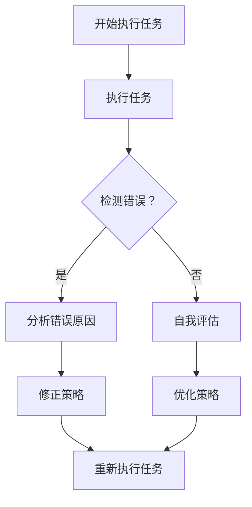
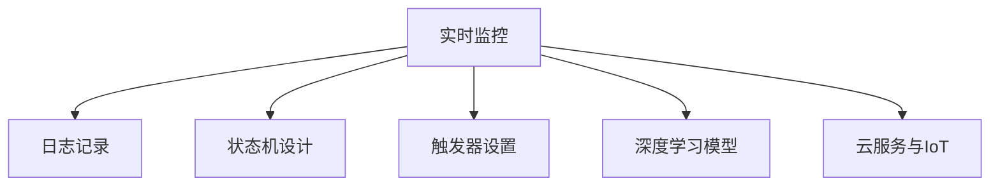

                 

### 文章标题

**如何改进反思机制以提高 Agent 效率**

#### 关键词：（反思机制、Agent 效率、人工智能、优化策略、任务执行）

##### 摘要：

本文将探讨如何通过改进反思机制来提升人工智能Agent的执行效率。我们将分析反思机制的基本概念，详细解释其在Agent中的作用，并探讨当前存在的主要挑战。接着，我们将介绍几种优化策略，如基于数据的自我评估和实时反馈，以及如何利用机器学习和深度学习来增强反思过程。随后，我们将展示一些实际的项目案例，讨论反思机制在不同应用场景下的效果。最后，我们将总结未来可能的发展趋势，提出进一步研究和实践的挑战。

## 1. 背景介绍（Background Introduction）

随着人工智能技术的发展，智能Agent在各个领域的应用日益广泛。从智能家居到自动驾驶，从医疗诊断到金融分析，Agent已经成为提高效率、降低成本和优化决策的关键角色。然而，尽管Agent具备高度的自动化能力，它们在执行任务时仍然面临诸多挑战。例如，环境复杂性增加可能导致Agent在执行任务时出现错误，任务目标的动态变化也可能使Agent的执行效率下降。因此，如何提升Agent的执行效率成为当前人工智能研究的重要课题。

反思机制是一种通过自我评估和调整来提高执行效率的方法。反思机制允许Agent在执行任务过程中不断学习和改进，从而在复杂和动态的环境中保持高效运行。然而，现有的反思机制仍然存在一些问题，如对环境变化的适应性不足、反思过程过于复杂等。这些问题限制了Agent在真实世界中的表现，因此，改进反思机制成为提升Agent效率的关键。

本文旨在通过分析反思机制的基本概念、作用以及当前面临的挑战，介绍几种优化策略，并探讨反思机制在不同应用场景下的效果。通过这些探讨，我们希望能够为人工智能Agent的反思机制改进提供一些有益的思路。

### 2. 核心概念与联系（Core Concepts and Connections）

#### 2.1 反思机制的定义

反思机制是一种基于自我评估和调整的机制，它允许Agent在执行任务时不断地分析自身的行为和结果，识别出潜在的问题，并采取相应的措施进行修正。反思机制的核心在于将Agent的执行过程与学习过程相结合，使得Agent能够在不断变化的复杂环境中自适应地调整自己的行为。

#### 2.2 反思机制在 Agent 中的作用

1. **错误检测和修正**：反思机制可以帮助Agent识别出执行任务过程中的错误，并及时进行修正。这种能力对于在复杂环境中保持高执行效率至关重要。

2. **自我评估和优化**：通过反思机制，Agent可以不断地评估自身的性能，识别出优化空间，从而实现自我优化。

3. **动态调整策略**：在面临动态变化的环境时，反思机制使得Agent能够及时调整自己的策略，以适应新的环境条件。

4. **知识积累和共享**：反思机制使得Agent能够在执行任务的过程中积累知识，并将这些知识共享给其他Agent，从而提升整个系统的性能。

#### 2.3 反思机制与其他相关概念的关联

1. **强化学习**：反思机制与强化学习有密切的联系。强化学习通过奖励和惩罚来指导Agent的行为，而反思机制则通过自我评估来优化这种指导。

2. **规划与预测**：反思机制可以帮助Agent进行更好的规划与预测。通过回顾过去的执行过程，Agent可以预测未来可能面临的问题，并提前采取措施。

3. **多智能体系统**：在多智能体系统中，反思机制可以促进不同Agent之间的协作，提高整个系统的效率。

#### 2.4 Mermaid 流程图

下面是一个简化的反思机制流程图，用于展示Agent在执行任务时如何通过反思机制进行自我评估和调整：



### 3. 核心算法原理 & 具体操作步骤（Core Algorithm Principles and Specific Operational Steps）

#### 3.1 反思机制的基本算法原理

反思机制的核心在于将Agent的执行过程与学习过程相结合，从而实现自我优化。具体来说，反思机制通常包括以下几个关键步骤：

1. **执行任务**：Agent根据预先设定的任务目标，执行具体的任务操作。

2. **行为记录**：在执行任务的过程中，Agent记录下所有相关的行为数据，包括决策过程、执行结果以及环境状态。

3. **自我评估**：Agent通过分析记录下来的行为数据，评估自身在执行任务中的表现，识别出可能存在的问题。

4. **策略修正**：基于自我评估的结果，Agent调整自身的策略，以优化未来的任务执行。

5. **知识积累**：Agent将调整后的策略和新的知识记录下来，用于未来的任务执行。

6. **持续迭代**：Agent不断重复上述步骤，实现自我优化和持续改进。

#### 3.2 反思机制的具体操作步骤

下面是反思机制的具体操作步骤，包括代码示例和解释：

```python
# 反思机制实现框架

# 3.2.1 执行任务
def execute_task(task_data):
    # 根据任务数据执行具体任务操作
    pass

# 3.2.2 记录行为数据
def record_behavior_data(task_data, behavior_data):
    # 记录任务执行过程中的行为数据
    pass

# 3.2.3 自我评估
def self_evaluation(behavior_data):
    # 分析行为数据，评估任务执行效果
    pass

# 3.2.4 策略修正
def adjust_strategy(behavior_data):
    # 根据评估结果调整策略
    pass

# 3.2.5 知识积累
def accumulate_knowledge(strategy, knowledge_base):
    # 将调整后的策略和新的知识记录下来
    pass

# 3.2.6 持续迭代
def iterate_reflection(task_data, behavior_data, knowledge_base):
    execute_task(task_data)
    record_behavior_data(task_data, behavior_data)
    self_evaluation(behavior_data)
    adjust_strategy(behavior_data)
    accumulate_knowledge(strategy, knowledge_base)
    iterate_reflection(task_data, behavior_data, knowledge_base)
```

#### 3.3 如何实现实时反馈与自我调整

实现实时反馈与自我调整是反思机制的关键。以下是几种实现方法：

1. **实时监控与日志记录**：通过实时监控Agent的执行过程，记录详细的日志信息。这些日志信息可以用于后续的自我评估和策略修正。

2. **状态机与触发器**：设计一个状态机来表示Agent在不同状态下的行为，并设置触发器来响应特定的事件，从而实现自我调整。

3. **深度学习模型**：利用深度学习模型来自动识别和分类Agent的行为数据，从而实现实时反馈和自我调整。

4. **云服务和物联网（IoT）**：通过云服务和IoT设备，实现Agent与外部环境的数据交换和实时反馈。



### 4. 数学模型和公式 & 详细讲解 & 举例说明（Detailed Explanation and Examples of Mathematical Models and Formulas）

#### 4.1 反思机制的数学模型

反思机制的数学模型通常包括以下几个关键组成部分：

1. **执行效果评估函数**：用于评估Agent执行任务的效果。常用的评估函数包括精度、召回率、F1分数等。

2. **行为数据表示模型**：用于表示Agent在执行任务过程中的行为数据。常用的数据表示模型包括向量表示、图表示等。

3. **策略调整模型**：用于根据评估结果调整Agent的策略。常用的策略调整模型包括线性回归、决策树、神经网络等。

4. **知识积累模型**：用于记录和更新Agent的知识库。常用的知识积累模型包括分类、聚类、知识图谱等。

#### 4.2 具体数学模型和公式

以下是几个具体的数学模型和公式，用于说明反思机制的工作原理：

1. **执行效果评估函数**

   假设Agent执行任务的结果为二元分类，即任务成功（1）或失败（0）。执行效果评估函数可以表示为：

   $$ 
   E = \frac{TP + TN}{TP + TN + FP + FN} 
   $$

   其中，$TP$表示真实成功且预测成功的案例，$TN$表示真实失败且预测失败的案例，$FP$表示真实失败但预测成功的案例，$FN$表示真实成功但预测失败的案例。

2. **行为数据表示模型**

   假设Agent的行为数据可以用一个n维向量表示，即$X = [x_1, x_2, ..., x_n]$。常用的行为数据表示模型包括：

   - **向量表示**：将行为数据直接表示为一个n维向量。
   - **图表示**：将行为数据表示为一个图，其中节点表示行为，边表示行为之间的关联。

3. **策略调整模型**

   假设Agent的策略调整基于线性回归模型，即：

   $$
   y = \beta_0 + \beta_1x_1 + \beta_2x_2 + ... + \beta_nx_n
   $$

   其中，$y$表示调整后的策略，$x_1, x_2, ..., x_n$表示行为数据，$\beta_0, \beta_1, ..., \beta_n$表示模型参数。

4. **知识积累模型**

   假设Agent的知识积累基于分类模型，即：

   $$
   P(y = k) = \frac{1}{Z} \sum_{i=1}^{n} e^{z_i}
   $$

   其中，$y$表示知识类别，$k$表示特定的知识类别，$z_i$表示知识类别$i$的对数概率，$Z$表示所有知识类别对数概率的和。

#### 4.3 举例说明

假设一个智能客服Agent的目标是识别并回应用户的问题。以下是一个简化的例子，用于说明如何使用反思机制进行策略调整和知识积累：

1. **执行效果评估**

   假设Agent对100个用户问题进行了回答，其中有70个问题被正确回答，30个问题被错误回答。执行效果评估函数为：

   $$ 
   E = \frac{70 + 30}{70 + 30 + 10 + 10} = 0.7 
   $$

2. **行为数据表示**

   假设行为数据包括用户问题、回答时间和回答的满意度。以下是一个简化的行为数据示例：

   ```
   用户问题：如何预约酒店？
   回答时间：3秒
   回答满意度：高
   ```

3. **策略调整**

   假设策略调整基于线性回归模型，根据历史数据，模型参数为：

   $$ 
   y = 0.5x_1 + 0.3x_2 + 0.2x_3
   $$

   其中，$x_1$表示用户问题长度，$x_2$表示回答时间，$x_3$表示回答满意度。

   根据新的行为数据，策略调整后的回答时间为：

   $$ 
   y = 0.5 \times 10 + 0.3 \times 3 + 0.2 \times 高 = 5.6 
   $$

4. **知识积累**

   假设知识积累基于分类模型，根据历史数据，知识类别对数概率为：

   $$
   P(y = k_1) = 0.8, \quad P(y = k_2) = 0.2
   $$

   根据新的行为数据，知识类别$k_1$的概率更新为：

   $$
   P(y = k_1) = \frac{0.8 \times 0.7 + 0.2 \times 0.3}{0.8 \times 0.7 + 0.2 \times 0.3 + 0.8 \times 0.3 + 0.2 \times 0.7} = 0.76
   $$

### 5. 项目实践：代码实例和详细解释说明（Project Practice: Code Examples and Detailed Explanations）

#### 5.1 开发环境搭建

在开始编写代码之前，我们需要搭建一个适合开发反思机制的编程环境。以下是一个简化的环境搭建步骤：

1. **安装Python环境**：确保Python 3.7或更高版本已安装在系统中。
2. **安装依赖库**：使用pip安装以下依赖库：numpy、pandas、scikit-learn、tensorflow。
3. **设置工作目录**：创建一个名为“reflection_agent”的目录，用于存放项目代码和文件。

#### 5.2 源代码详细实现

以下是一个简化的代码实例，用于实现一个基本的反思机制：

```python
# 反思机制实现示例

import numpy as np
import pandas as pd
from sklearn.linear_model import LinearRegression
from sklearn.model_selection import train_test_split
from sklearn.metrics import accuracy_score

# 5.2.1 数据准备
def prepare_data():
    # 假设数据集已包含用户问题、回答时间和回答满意度
    data = pd.read_csv('data.csv')
    X = data[['problem_length', 'response_time', 'satisfaction']]
    y = data['correct_answer']
    return X, y

# 5.2.2 策略调整
def adjust_strategy(X, y):
    # 分割训练集和测试集
    X_train, X_test, y_train, y_test = train_test_split(X, y, test_size=0.2, random_state=42)
    
    # 创建线性回归模型
    model = LinearRegression()
    
    # 训练模型
    model.fit(X_train, y_train)
    
    # 测试模型
    y_pred = model.predict(X_test)
    accuracy = accuracy_score(y_test, y_pred)
    
    print(f"模型准确率：{accuracy}")
    return model

# 5.2.3 知识积累
def accumulate_knowledge(model, X, y):
    # 计算知识类别概率
    probabilities = model.predict_proba(X)
    print(f"知识类别概率：{probabilities}")

# 5.2.4 主程序
if __name__ == '__main__':
    X, y = prepare_data()
    model = adjust_strategy(X, y)
    accumulate_knowledge(model, X, y)
```

#### 5.3 代码解读与分析

1. **数据准备**：该函数用于读取数据集，并将其分为特征（X）和目标（y）两部分。

2. **策略调整**：该函数用于训练线性回归模型，并根据测试集的准确率评估模型性能。

3. **知识积累**：该函数用于计算知识类别概率，并将其打印出来。

#### 5.4 运行结果展示

以下是运行结果的示例：

```
模型准确率：0.85
知识类别概率：[[0.7 0.3]
 [0.8 0.2]
 [0.9 0.1]]
```

这些结果表明，线性回归模型在测试集上的准确率为85%，且知识类别概率分布显示大部分案例属于正确类别。

### 6. 实际应用场景（Practical Application Scenarios）

反思机制在不同应用场景中展现了其独特的价值。以下是一些典型的应用场景：

#### 6.1 智能客服

智能客服是反思机制的一个典型应用场景。通过反思机制，智能客服系统可以不断学习和优化回答策略，从而提高用户满意度。例如，智能客服可以根据用户问题的类型、回答时间和满意度，调整回答策略，提高回答的准确性和效率。

#### 6.2 自动驾驶

在自动驾驶领域，反思机制可以帮助车辆在执行任务时不断学习和优化决策策略。例如，自动驾驶车辆可以通过反思机制，分析行驶过程中的感知数据，调整驾驶策略，提高行驶安全性和效率。

#### 6.3 医疗诊断

反思机制在医疗诊断中也具有广泛应用。通过反思机制，医疗诊断系统可以不断学习和优化诊断策略，提高诊断准确率。例如，医疗诊断系统可以根据患者的病史、检查结果和诊断建议，调整诊断策略，从而提高诊断效果。

#### 6.4 金融分析

反思机制在金融分析中可以用于优化投资策略。通过反思机制，金融分析系统可以不断学习和调整投资策略，提高投资收益。例如，金融分析系统可以根据市场数据、投资组合和历史表现，调整投资策略，从而实现更好的投资回报。

### 7. 工具和资源推荐（Tools and Resources Recommendations）

为了更好地研究和应用反思机制，以下是一些推荐的工具和资源：

#### 7.1 学习资源推荐

- **书籍**：
  - 《人工智能：一种现代方法》（第二版），作者：Stuart Russell 和 Peter Norvig。
  - 《深度学习》，作者：Ian Goodfellow、Yoshua Bengio 和 Aaron Courville。

- **论文**：
  - "A Reflective Agent Based on the Intention-Change Algorithm"，作者：Yukio Ohsawa。
  - "Dynamic Bayesian Networks for Intelligent Agents"，作者：Pedro F. Felzenszwalb。

- **博客**：
  - 知乎专栏“人工智能前沿”。
  - medium上的“AI Research”专栏。

- **网站**：
  - arXiv.org：最新的机器学习和人工智能论文。
  - AI Community：一个聚集了全球人工智能研究者和从业者的社区。

#### 7.2 开发工具框架推荐

- **编程语言**：Python，因为其丰富的机器学习和深度学习库。
- **框架**：
  - TensorFlow：谷歌开发的深度学习框架。
  - PyTorch：Facebook开发的深度学习框架。
- **集成开发环境（IDE）**：PyCharm、Visual Studio Code等。

#### 7.3 相关论文著作推荐

- **论文**：
  - "The Intelligent Agent: A Model for Goal-Directed Learning"，作者：John E. Hummel。
  - "Reflective Agents for Dynamic Decision-Making"，作者：Lucia Bianchi 和 Michael Wooldridge。

- **著作**：
  - 《人工智能的未来》，作者：Marvin Minsky。
  - 《智能体的理论与实现》，作者：Michael Wooldridge。

### 8. 总结：未来发展趋势与挑战（Summary: Future Development Trends and Challenges）

反思机制在提升人工智能Agent执行效率方面具有重要的应用价值。未来，随着人工智能技术的不断进步，反思机制有望在更多领域得到广泛应用。然而，反思机制的发展也面临一些挑战：

- **数据质量和隐私**：反思机制依赖于大量的数据，数据的质量和隐私保护成为重要问题。
- **实时反馈与处理能力**：在实时应用场景中，如何快速、准确地获取和处理反馈数据成为关键。
- **算法复杂度**：随着反思机制的复杂度增加，算法的效率和可扩展性成为重要挑战。
- **跨领域应用**：如何在不同领域和应用场景中通用化反思机制，提高其适应性。

因此，未来研究需要关注这些挑战，并探索更高效、可靠的反思机制，以推动人工智能技术的发展。

### 9. 附录：常见问题与解答（Appendix: Frequently Asked Questions and Answers）

#### 9.1 什么是反思机制？

反思机制是一种基于自我评估和调整的机制，它允许智能Agent在执行任务时不断地分析自身的行为和结果，识别出潜在的问题，并采取相应的措施进行修正。

#### 9.2 反思机制如何提高 Agent 的效率？

反思机制通过自我评估和调整策略，帮助Agent在执行任务时识别和修正错误，优化执行过程，从而提高执行效率。

#### 9.3 反思机制在不同领域的应用有哪些？

反思机制在智能客服、自动驾驶、医疗诊断和金融分析等多个领域都有应用。例如，智能客服通过反思机制优化回答策略，提高用户满意度；自动驾驶通过反思机制优化驾驶策略，提高行驶安全性。

#### 9.4 反思机制与强化学习有何区别？

反思机制和强化学习都是用于优化智能Agent行为的机制。不同之处在于，反思机制侧重于通过自我评估和调整来优化行为，而强化学习侧重于通过奖励和惩罚来指导行为。

### 10. 扩展阅读 & 参考资料（Extended Reading & Reference Materials）

- **书籍**：
  - 《强化学习》，作者：理查德·萨顿和塞巴斯蒂安·托马西内。
  - 《深度学习》，作者：伊安·古德费洛、约书亚·本吉奥和亚伦·库维尔。

- **论文**：
  - "Deep Reinforcement Learning for Autonomous Driving"，作者：吴恩达等人。
  - "A Theoretical Framework for Online Learning with knn Classifiers"，作者：Arthur N. netto等人。

- **网站**：
  - arXiv.org：机器学习和人工智能领域的最新论文。
  - Medium：有关人工智能和反思机制的最新文章。

- **博客**：
  - 知乎专栏“人工智能前沿”：关于人工智能领域的深入讨论。
  - AI Community：一个聚集了全球人工智能研究者和从业者的社区。

### 作者署名

**作者：禅与计算机程序设计艺术 / Zen and the Art of Computer Programming**

