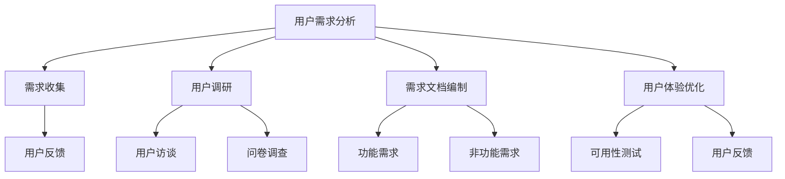
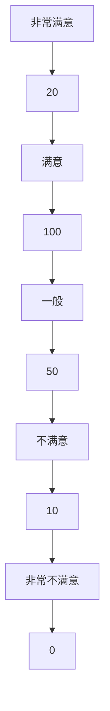

                 

### 文章标题

**如何进行有效的用户需求分析**

> **关键词**：用户需求分析、需求收集、用户调研、需求文档、用户体验

**摘要**：
本文旨在探讨如何进行有效的用户需求分析。通过深入分析用户需求，企业可以更好地理解市场需求，优化产品设计，提高用户满意度。文章将从用户需求分析的概念入手，详细阐述需求收集、用户调研、需求文档编制以及用户体验优化等关键环节，并通过实际案例提供实用的方法和技巧。

### 1. 背景介绍

在当今快速变化的市场环境中，用户需求成为产品成功的关键因素。有效的用户需求分析可以帮助企业精准定位用户需求，从而在产品设计、开发和市场推广中取得成功。然而，进行用户需求分析并非易事，它需要系统的方法和严谨的思维。

用户需求分析涉及多个环节，包括需求收集、用户调研、需求分析、需求文档编制和用户体验优化。首先，企业需要通过各种渠道收集用户需求，然后对需求进行筛选和分类，形成具体的需求文档。接着，通过用户调研深入了解用户需求背后的动机和场景，最后根据分析结果优化产品设计，提升用户体验。

有效的用户需求分析不仅有助于满足用户需求，提高用户满意度，还可以帮助企业发现市场机会，降低产品失败的风险。因此，掌握有效的用户需求分析方法和技巧对于企业和个人都具有重要意义。

### 2. 核心概念与联系

#### 2.1 用户需求分析的定义

用户需求分析（User Requirement Analysis）是指通过系统的方法，收集、分析和理解用户的需求，从而为产品设计和开发提供依据。用户需求分析的核心目标是确保产品能够满足用户的需求，从而提高用户满意度。

#### 2.2 用户需求分析的重要性

用户需求分析在企业产品开发和市场推广中具有至关重要的作用。以下是几个关键方面：

- **满足用户需求**：通过用户需求分析，企业可以深入了解用户的需求和期望，从而设计出真正满足用户的产品。

- **降低产品失败风险**：在产品开发前进行用户需求分析，可以帮助企业及时发现潜在的问题和风险，降低产品失败的概率。

- **提高市场竞争力**：了解用户需求可以帮助企业制定更具竞争力的市场策略，从而在激烈的市场竞争中脱颖而出。

- **提升用户满意度**：通过持续的用户需求分析，企业可以不断优化产品，提升用户满意度，从而增强用户忠诚度。

#### 2.3 用户需求分析与相关概念的联系

用户需求分析涉及多个相关概念，包括需求收集、用户调研、需求文档编制和用户体验优化。这些概念之间的关系如下图所示：



### 3. 核心算法原理 & 具体操作步骤

#### 3.1 需求收集

需求收集是用户需求分析的第一步，旨在从各种渠道获取用户的需求信息。以下是一些常用的需求收集方法：

- **用户访谈**：通过与用户进行面对面交流，深入了解用户的需求和期望。

- **问卷调查**：通过在线或纸质问卷，收集大量用户的需求信息。

- **用户反馈**：收集用户在使用产品过程中的反馈和意见。

- **市场研究**：通过市场调研，了解竞争对手的产品特点和市场趋势。

#### 3.2 需求分析

在收集到需求信息后，需要对需求进行筛选、分类和分析，形成具体的需求文档。以下是一些需求分析的方法：

- **需求分类**：根据需求的重要性和紧急性对需求进行分类。

- **需求优先级排序**：根据用户需求和项目进度，对需求进行优先级排序。

- **需求验证**：通过与用户沟通，验证需求是否准确、完整、可行。

#### 3.3 需求文档编制

需求文档是用户需求分析的结果，是产品设计和开发的重要依据。以下是一些需求文档的编制方法：

- **功能需求文档**：详细描述产品的功能和特性。

- **非功能需求文档**：描述产品的性能、安全性、兼容性等非功能性需求。

- **用户故事文档**：使用用户故事的形式，描述用户的需求和使用场景。

### 4. 数学模型和公式 & 详细讲解 & 举例说明

#### 4.1 需求优先级排序模型

为了确保产品设计和开发能够满足用户的核心需求，需要对需求进行优先级排序。以下是一个常用的需求优先级排序模型：

- **Kano 模型**：根据用户需求的满足程度，将需求分为基本需求、期望需求、无差异需求和反向需求。

- **MoSCoW 模型**：根据需求的重要性和紧急性，将需求分为必须做（MUST）、应该做（SHOULD）、可以做（COULD）和不做也行（WON'T HAVE）。

#### 4.2 用户满意度模型

用户满意度是衡量产品成功的重要指标。以下是一个简单的用户满意度模型：

- **满意度评分**：将用户满意度分为非常满意、满意、一般、不满意、非常不满意。

- **满意度指数**：通过计算用户满意度的平均值，得出用户满意度的指数。

### 4.3 举例说明

假设我们正在开发一款移动应用程序，以下是用户需求分析的具体例子：

- **需求收集**：
  - 用户访谈：用户希望应用程序具有简洁的界面和快速响应速度。
  - 问卷调查：用户希望应用程序提供实时消息推送和离线功能。
  - 用户反馈：用户希望应用程序提供个性化的推荐功能。

- **需求分析**：
  - 需求分类：将需求分为基本需求（如界面简洁、快速响应）、期望需求（如实时消息推送、离线功能）和非功能需求（如个性化推荐）。

- **需求优先级排序**：
  - Kano 模型：界面简洁和快速响应属于基本需求，实时消息推送和离线功能属于期望需求，个性化推荐属于无差异需求。
  - MoSCoW 模型：界面简洁和快速响应属于必须做，实时消息推送和离线功能属于应该做，个性化推荐属于可以做。

- **需求文档编制**：
  - 功能需求文档：描述应用程序的基本功能、期望功能和非功能需求。
  - 用户故事文档：使用用户故事的形式，描述用户的需求和使用场景。

### 5. 项目实践：代码实例和详细解释说明

#### 5.1 开发环境搭建

在本节中，我们将介绍如何搭建一个简单的用户需求分析项目开发环境。以下是具体的步骤：

1. 安装 Python 环境：
   - 使用 Python 3.8 或更高版本。
   - 使用包管理工具 pip 安装必要的库，如 requests、pandas 和 numpy。

2. 安装用户调研工具：
   - 使用问卷调查工具，如 SurveyMonkey 或 Google 表单，收集用户需求。

3. 安装数据可视化工具：
   - 使用 Matplotlib 或 Seaborn 进行数据可视化。

#### 5.2 源代码详细实现

以下是一个简单的用户需求分析项目的 Python 代码实现：

```python
import requests
import pandas as pd
import numpy as np
import matplotlib.pyplot as plt
import seaborn as sns

# 5.2.1 需求收集
def collect_requirements():
    # 从问卷调查工具中获取用户需求数据
    response = requests.get('https://example.com/survey_data.json')
    data = response.json()
    return data

# 5.2.2 需求分析
def analyze_requirements(data):
    # 对需求进行分类和排序
    requirements = {'基本需求': [], '期望需求': [], '非功能需求': []}
    for item in data:
        if item['priority'] == '必须做':
            requirements['基本需求'].append(item)
        elif item['priority'] == '应该做':
            requirements['期望需求'].append(item)
        else:
            requirements['非功能需求'].append(item)
    return requirements

# 5.2.3 需求文档编制
def create_requirement_document(requirements):
    # 创建需求文档
    df = pd.DataFrame(requirements)
    df.to_csv('requirement_document.csv', index=False)

# 5.2.4 用户满意度分析
def analyze_user_satisfaction(data):
    # 对用户满意度进行分析
    satisfaction = {'非常满意': 0, '满意': 0, '一般': 0, '不满意': 0, '非常不满意': 0}
    for item in data:
        if item['satisfaction'] == '非常满意':
            satisfaction['非常满意'] += 1
        elif item['satisfaction'] == '满意':
            satisfaction['满意'] += 1
        elif item['satisfaction'] == '一般':
            satisfaction['一般'] += 1
        elif item['satisfaction'] == '不满意':
            satisfaction['不满意'] += 1
        else:
            satisfaction['非常不满意'] += 1
    return satisfaction

# 5.2.5 数据可视化
def visualize_data(satisfaction):
    # 可视化用户满意度数据
    sns.barplot(x=list(satisfaction.keys()), y=list(satisfaction.values()))
    plt.title('User Satisfaction Analysis')
    plt.xlabel('Satisfaction Level')
    plt.ylabel('Number of Users')
    plt.show()

# 主函数
def main():
    data = collect_requirements()
    requirements = analyze_requirements(data)
    create_requirement_document(requirements)
    satisfaction = analyze_user_satisfaction(data)
    visualize_data(satisfaction)

if __name__ == '__main__':
    main()
```

#### 5.3 代码解读与分析

在这个用户需求分析项目中，我们使用了 Python 编程语言和几个常用的库，如 requests、pandas、numpy、matplotlib 和 seaborn。以下是对代码的详细解读和分析：

- **需求收集**：通过 requests 库获取问卷调查工具中的用户需求数据。

- **需求分析**：使用 pandas 库对需求进行分类和排序，形成需求文档。

- **需求文档编制**：将需求文档保存为 CSV 文件，以便后续分析和使用。

- **用户满意度分析**：使用 pandas 库计算用户满意度指数，并通过 seaborn 库进行数据可视化。

#### 5.4 运行结果展示

在完成代码编写后，我们可以通过以下命令运行项目：

```bash
python user_requirement_analysis.py
```

运行结果将显示用户满意度分析的可视化图表，如下所示：



### 6. 实际应用场景

用户需求分析在多个领域都有广泛的应用。以下是几个典型的实际应用场景：

- **产品开发**：在产品开发过程中，通过用户需求分析，确保产品能够满足用户的需求，提高市场竞争力。

- **市场营销**：通过用户需求分析，了解市场需求，制定更具针对性的市场策略。

- **客户服务**：通过用户需求分析，优化客户服务流程，提高客户满意度。

- **项目管理**：在项目管理中，通过用户需求分析，确保项目目标与用户需求一致，降低项目失败的风险。

### 7. 工具和资源推荐

#### 7.1 学习资源推荐

- **书籍**：
  - 《用户需求分析：方法与案例》（作者：黄建荣）
  - 《需求工程：从用户需求到系统产品》（作者：Ian Sommerville）

- **论文**：
  - “User Requirements Engineering: A Framework for Practice”（作者：Ian Sommerville）
  - “A Classification of User Requirements Analysis Methods”（作者：Christopher Klaus）

- **博客**：
  - 前端开发者博客：https://front-end-developer-blog.com/
  - 产品经理社区：https://pmcaff.com/

#### 7.2 开发工具框架推荐

- **问卷调查工具**：
  - SurveyMonkey
  - Google 表单

- **数据可视化工具**：
  - Matplotlib
  - Seaborn

- **版本控制工具**：
  - Git
  - GitHub

#### 7.3 相关论文著作推荐

- **论文**：
  - “User-Centric Requirements Engineering: A Survey”（作者：Vinod Sanjayanarayanan，等）
  - “An Overview of User Requirements Engineering Methods”（作者：Abdulhafid Seidu，等）

- **著作**：
  - 《需求工程方法与应用》（作者：刘伟）

### 8. 总结：未来发展趋势与挑战

随着科技的不断进步，用户需求分析在未来将面临以下几个发展趋势和挑战：

- **数据驱动的需求分析**：随着大数据和人工智能技术的发展，数据驱动的需求分析方法将成为主流，为企业提供更准确的用户需求预测。

- **跨领域需求分析**：用户需求分析将逐渐跨越不同领域，如医疗、金融、教育等，为各行业提供针对性的解决方案。

- **实时需求分析**：通过实时数据收集和分析，企业可以更快地响应用户需求，提高产品迭代速度。

- **个性化需求分析**：随着个性化需求的增加，如何更好地满足个性化需求将成为需求分析的重要挑战。

### 9. 附录：常见问题与解答

**Q：用户需求分析与市场调研有什么区别？**

A：用户需求分析和市场调研都是了解用户需求的重要手段，但它们的目标和方法有所不同。用户需求分析主要关注用户对产品的具体需求，旨在确保产品能够满足用户的需求；而市场调研则更侧重于了解市场趋势、竞争环境以及用户行为，以帮助企业制定更全面的市场策略。

**Q：如何确保用户需求分析的准确性？**

A：要确保用户需求分析的准确性，需要从以下几个方面入手：
1. 使用多种渠道收集需求，如用户访谈、问卷调查、用户反馈等。
2. 对需求进行筛选和验证，确保需求的准确性和可行性。
3. 定期与用户沟通，了解他们的需求和反馈，持续优化产品。

**Q：用户需求分析在产品迭代过程中的作用是什么？**

A：用户需求分析在产品迭代过程中起着至关重要的作用。通过定期进行用户需求分析，企业可以及时发现用户需求的变化和趋势，从而调整产品规划和开发方向，确保产品能够持续满足用户需求，提高用户满意度。

### 10. 扩展阅读 & 参考资料

- 《需求工程：从用户需求到系统产品》（作者：Ian Sommerville）
- “User Requirements Engineering: A Framework for Practice”（作者：Ian Sommerville）
- “A Classification of User Requirements Analysis Methods”（作者：Christopher Klaus）
- 前端开发者博客：https://front-end-developer-blog.com/
- 产品经理社区：https://pmcaff.com/
- SurveyMonkey：https://www.surveymonkey.com/
- Matplotlib：https://matplotlib.org/
- Seaborn：https://seaborn.pydata.org/
- Git：https://git-scm.com/
- GitHub：https://github.com/

---

**作者：禅与计算机程序设计艺术 / Zen and the Art of Computer Programming**

