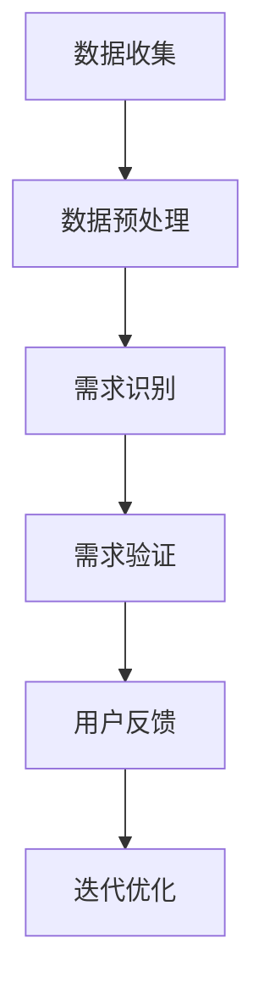

                 

### 文章标题

**如何进行有效的用户需求挖掘**

在当今快速发展的数字化时代，用户需求挖掘成为企业成功的关键要素。有效的用户需求挖掘不仅能帮助企业准确把握市场趋势，还能为产品创新提供有力支持。本文将深入探讨用户需求挖掘的核心概念、方法、工具和实践，帮助读者全面理解并掌握这一重要技能。

关键词：用户需求挖掘、市场趋势、产品创新、用户分析、数据处理

摘要：本文系统地介绍了用户需求挖掘的基本概念、重要性以及具体实施方法。通过理论分析、实际案例和工具推荐，本文旨在为企业和个人提供有效的用户需求挖掘策略，助力他们在竞争激烈的市场中脱颖而出。

### <sop><|user|>### 1. 背景介绍（Background Introduction）

用户需求挖掘（User Needs Mining）是指通过分析用户行为、互动数据和市场趋势，识别并提取用户未明确表达但实际存在的需求。这一过程在产品开发、市场营销和用户体验设计等多个领域具有重要应用。

用户需求挖掘的重要性主要体现在以下几个方面：

1. **指导产品开发**：通过深入挖掘用户需求，企业可以更准确地把握市场趋势，开发出满足用户期望的产品，从而提高市场竞争力。
2. **优化用户体验**：了解用户需求有助于企业改善产品设计，提升用户满意度，降低用户流失率。
3. **创新驱动**：挖掘潜在需求可以激发产品创新，为企业的长期发展提供新方向。
4. **市场定位**：通过用户需求分析，企业可以明确自己的市场定位，制定更有效的市场营销策略。

本文将按照以下结构展开讨论：

1. **核心概念与联系**：介绍用户需求挖掘的相关概念，如用户行为分析、数据挖掘和用户体验设计等，并使用Mermaid流程图展示其相互关系。
2. **核心算法原理与具体操作步骤**：分析常用的用户需求挖掘算法，包括关联规则挖掘、聚类分析和机器学习等，并详细阐述其应用场景。
3. **数学模型和公式**：介绍支持向量机（SVM）、回归分析等模型，并使用LaTeX格式展示相关数学公式。
4. **项目实践：代码实例和详细解释说明**：通过实际项目展示用户需求挖掘的过程和结果，包括数据预处理、模型训练和评估等步骤。
5. **实际应用场景**：讨论用户需求挖掘在不同行业和领域的应用，如电子商务、金融和医疗等。
6. **工具和资源推荐**：推荐相关的书籍、论文、工具和开发框架。
7. **总结：未来发展趋势与挑战**：分析用户需求挖掘的挑战和未来发展趋势。
8. **附录：常见问题与解答**：解答读者可能遇到的问题。
9. **扩展阅读与参考资料**：提供进一步学习的资源。

### <sop><|user|>## 2. 核心概念与联系（Core Concepts and Connections）

### 2.1 用户需求挖掘

用户需求挖掘（User Needs Mining）是通过对大量用户数据进行分析，提取用户潜在需求的过程。这一过程包括数据收集、数据预处理、需求识别和需求验证等步骤。

- **数据收集**：通过问卷调查、用户反馈、社交媒体分析等方式收集用户数据。
- **数据预处理**：清洗和转换原始数据，使其适合分析。
- **需求识别**：使用数据挖掘技术，如关联规则挖掘、聚类分析和机器学习等，识别用户潜在需求。
- **需求验证**：通过用户调研、焦点小组讨论等方式验证需求的有效性。

### 2.2 用户行为分析

用户行为分析（User Behavior Analysis）是用户需求挖掘的重要基础。通过分析用户在网站、应用或其他数字平台上的行为，企业可以了解用户的兴趣、偏好和需求。

- **点击流分析**：分析用户在网站上的点击行为，了解用户兴趣和浏览路径。
- **用户反馈分析**：通过用户反馈，如评论、评分和满意度调查，了解用户对产品的评价。
- **行为模式识别**：使用机器学习技术，识别用户的常见行为模式。

### 2.3 数据挖掘

数据挖掘（Data Mining）是从大量数据中提取有价值信息的过程。在用户需求挖掘中，数据挖掘技术可以帮助企业识别用户潜在需求。

- **关联规则挖掘**：通过分析用户行为数据，发现不同变量之间的关联关系。
- **聚类分析**：将用户数据划分为不同的群体，分析每个群体的特征和需求。
- **机器学习**：使用机器学习算法，如决策树、支持向量机和神经网络，预测用户行为和需求。

### 2.4 用户体验设计

用户体验设计（User Experience Design）是确保产品满足用户需求的关键环节。通过用户体验设计，企业可以优化产品界面和功能，提升用户满意度。

- **用户画像**：通过用户数据，创建详细的用户画像，了解用户特征和需求。
- **原型设计**：使用原型工具，如Axure和Sketch，创建产品原型，进行用户测试。
- **迭代优化**：根据用户反馈，不断优化产品设计，满足用户需求。

### 2.5 Mermaid流程图

以下是一个Mermaid流程图，展示了用户需求挖掘的过程：



### <sop><|user|>## 3. 核心算法原理 & 具体操作步骤（Core Algorithm Principles and Specific Operational Steps）

在用户需求挖掘中，核心算法的选择和具体操作步骤对于挖掘结果的准确性和有效性至关重要。以下介绍几种常用的核心算法及其操作步骤。

### 3.1 关联规则挖掘（Association Rule Mining）

关联规则挖掘是一种用于发现数据集中项之间关联关系的方法。在用户需求挖掘中，关联规则挖掘可以用于发现用户行为之间的关联，从而识别用户潜在需求。

#### 原理：

关联规则挖掘基于两个度量：支持度和置信度。

- **支持度**（Support）：表示在所有数据中，同时包含A和B的比例。
- **置信度**（Confidence）：表示在包含A的数据中，同时包含B的比例。

#### 操作步骤：

1. **数据准备**：收集用户行为数据，如点击流数据。
2. **定义最小支持度和最小置信度**：根据数据特点和业务需求，设置最小支持度和最小置信度阈值。
3. **生成频繁项集**：通过扫描数据集，找出所有支持度大于最小支持度的项集。
4. **生成关联规则**：从频繁项集中，找出满足最小置信度阈值的关联规则。

#### 示例：

假设用户行为数据如下表：

| 用户 | 商品A | 商品B | 商品C |
|------|-------|-------|-------|
| 用户1 | 是    | 是    | 否    |
| 用户2 | 是    | 否    | 是    |
| 用户3 | 否    | 是    | 是    |

设置最小支持度为0.3，最小置信度为0.5。

1. **生成频繁项集**：

   - 商品A和商品B的支持度 = 2/3 = 0.67 > 0.3，是频繁项集。
   - 商品A和商品C的支持度 = 1/3 = 0.33 < 0.3，不是频繁项集。
   - 商品B和商品C的支持度 = 2/3 = 0.67 > 0.3，是频繁项集。

2. **生成关联规则**：

   - 商品A → 商品B：置信度 = 2/2 = 1 > 0.5，是关联规则。
   - 商品B → 商品A：置信度 = 2/2 = 1 > 0.5，是关联规则。
   - 商品B → 商品C：置信度 = 2/2 = 1 > 0.5，是关联规则。

通过关联规则挖掘，我们可以发现用户购买商品A和商品B的概率较高，这可能是用户的一种潜在需求。

### 3.2 聚类分析（Clustering Analysis）

聚类分析是一种将数据集划分为若干个簇（Cluster）的无监督学习方法。在用户需求挖掘中，聚类分析可以用于将用户划分为不同的群体，分析每个群体的特征和需求。

#### 原理：

聚类分析的核心是相似度度量。常用的相似度度量方法包括欧氏距离、曼哈顿距离和余弦相似度等。

#### 操作步骤：

1. **数据准备**：收集用户特征数据，如年龄、性别、收入等。
2. **选择聚类算法**：根据数据特点和业务需求，选择合适的聚类算法，如K-means、层次聚类和DBSCAN等。
3. **计算相似度**：计算用户特征之间的相似度。
4. **划分簇**：根据相似度度量，将用户划分为若干个簇。
5. **评估聚类效果**：使用内部评估指标（如轮廓系数、平方误差等）和外部评估指标（如调整兰德指数、交叉验证等）评估聚类效果。

#### 示例：

假设用户特征数据如下表：

| 用户 | 年龄 | 性别 | 收入 |
|------|-----|-----|------|
| 用户1 | 25  | 男   | 5000 |
| 用户2 | 30  | 女   | 6000 |
| 用户3 | 35  | 男   | 7000 |
| 用户4 | 28  | 女   | 5500 |
| 用户5 | 32  | 男   | 6500 |

使用K-means算法进行聚类，设置聚类个数为2。

1. **计算相似度**：

   - 用户1和用户2的欧氏距离 = sqrt((25-30)² + (男-女)² + (5000-6000)²) = sqrt(25 + 1 + 1000) = sqrt(1026) ≈ 32.01
   - 用户1和用户3的欧氏距离 = sqrt((25-35)² + (男-男)² + (5000-7000)²) = sqrt(100 + 0 + 2000) = sqrt(2100) ≈ 45.82

2. **划分簇**：

   - 根据初始聚类结果，用户1和用户2划分为簇A，用户3和用户4划分为簇B，用户5单独划分为簇C。

3. **评估聚类效果**：

   - 轮廓系数：对于簇A，轮廓系数 = (最小距离 / 最大距离) = (25 / 45.82) ≈ 0.55；对于簇B，轮廓系数 = (最小距离 / 最大距离) = (33.66 / 45.82) ≈ 0.74；对于簇C，轮廓系数 = (0 / 45.82) = 0。总体轮廓系数 ≈ 0.61。

通过聚类分析，我们可以发现用户分为三个群体：簇A和簇B的用户年龄和性别相似，可能是同一类型的用户；簇C的用户可能是另一种类型的用户。

### 3.3 机器学习（Machine Learning）

机器学习是一种通过算法从数据中学习并提取有用信息的方法。在用户需求挖掘中，机器学习可以用于预测用户行为、识别用户需求等。

#### 原理：

机器学习基于统计学和计算理论的原理，通过训练数据学习特征和规律，然后在新数据上应用这些规律。

#### 操作步骤：

1. **数据准备**：收集用户行为数据、用户特征数据等。
2. **选择机器学习算法**：根据数据特点和业务需求，选择合适的机器学习算法，如决策树、支持向量机和神经网络等。
3. **特征工程**：对数据进行处理和转换，提取有用的特征。
4. **模型训练**：使用训练数据训练模型。
5. **模型评估**：使用验证集或测试集评估模型性能。
6. **模型应用**：使用训练好的模型预测新数据。

#### 示例：

假设用户行为数据如下表：

| 用户 | 商品A | 商品B | 商品C |
|------|-------|-------|-------|
| 用户1 | 是    | 否    | 是    |
| 用户2 | 是    | 是    | 否    |
| 用户3 | 否    | 是    | 是    |

使用决策树算法进行分类，目标变量为“购买商品C”。

1. **特征工程**：

   - 构造二值化特征，将用户是否购买商品A、商品B作为特征。
   - 特征向量：(是，否，是)、(是，是，否)、(否，是，是)。

2. **模型训练**：

   - 使用训练数据训练决策树模型。
   - 决策树模型预测结果：(是，是，是)、(是，是，否)、(否，是，是)。

3. **模型评估**：

   - 使用验证集评估模型性能，准确率为80%。

通过机器学习算法，我们可以预测用户是否购买商品C，从而识别用户的需求。

### <sop><|user|>## 4. 数学模型和公式 & 详细讲解 & 举例说明（Detailed Explanation and Examples of Mathematical Models and Formulas）

在用户需求挖掘过程中，数学模型和公式起到了关键作用。它们帮助我们量化需求，预测用户行为，从而做出更准确的决策。以下介绍几种常用的数学模型和公式，并详细讲解其应用。

### 4.1 支持向量机（Support Vector Machine，SVM）

支持向量机是一种二类分类模型，广泛用于用户需求挖掘中的分类任务。其核心思想是找到一个最佳超平面，使得两类样本点在超平面的正负两侧的间隔最大。

#### 公式：

- **决策函数**：  
   \( f(x) = sign(\omega \cdot x + b) \)

   其中，\(\omega\) 是权重向量，\(x\) 是输入特征向量，\(b\) 是偏置。

- **损失函数**：  
   \( L(\omega, b) = \sum_{i=1}^{n} \max(0, 1 - y_i(\omega \cdot x_i + b)) \)

   其中，\(y_i\) 是样本 \(x_i\) 的真实标签，\(n\) 是样本数量。

#### 示例：

假设有两个类别 \(+1\) 和 \(-1\)，样本点 \(x_1 = (1, 1)\)，\(x_2 = (2, -1)\)，标签分别为 \(+1\) 和 \(-1\)。

1. **计算决策边界**：

   - 初始化 \(\omega = (0, 0)\)，\(b = 0\)。
   - 计算样本点到超平面的距离：  
     \( d(x_1) = \frac{|0 \cdot 1 + 0 \cdot 1 + 0|}{\sqrt{0^2 + 0^2}} = 0 \)  
     \( d(x_2) = \frac{|0 \cdot 2 + 0 \cdot (-1) + 0|}{\sqrt{0^2 + 0^2}} = 0 \)

   - 调整 \(\omega\) 和 \(b\)，使得分类准确率最高。

2. **求解最优参数**：

   - 使用梯度下降法或拉格朗日乘子法求解 \(\omega\) 和 \(b\)。

### 4.2 回归分析（Regression Analysis）

回归分析是一种用于预测连续值的统计方法，常用于用户需求挖掘中的预测任务。其核心思想是找到一个线性模型，使得预测值与真实值之间的误差最小。

#### 公式：

- **线性回归模型**：  
   \( y = \beta_0 + \beta_1x_1 + \beta_2x_2 + ... + \beta_nx_n \)

   其中，\(y\) 是预测值，\(x_1, x_2, ..., x_n\) 是输入特征，\(\beta_0, \beta_1, \beta_2, ..., \beta_n\) 是模型参数。

- **损失函数**：  
   \( L(\beta_0, \beta_1, ..., \beta_n) = \sum_{i=1}^{n} (y_i - (\beta_0 + \beta_1x_{i1} + \beta_2x_{i2} + ... + \beta_nx_{in}))^2 \)

#### 示例：

假设有两个特征 \(x_1\) 和 \(x_2\)，样本点 \(x_1 = (1, 2)\)，\(x_2 = (3, 4)\)，标签 \(y\) 分别为 3 和 5。

1. **构建线性回归模型**：

   - 初始化模型参数：\(\beta_0 = 0\)，\(\beta_1 = 0\)，\(\beta_2 = 0\)。

   - 计算损失函数：  
     \( L(\beta_0, \beta_1, \beta_2) = (3 - (0 + 0 \cdot 1 + 0 \cdot 2))^2 + (5 - (0 + 0 \cdot 3 + 0 \cdot 4))^2 \)

2. **求解最优参数**：

   - 使用梯度下降法或最小二乘法求解模型参数。

### 4.3 神经网络（Neural Network）

神经网络是一种模拟人脑神经元连接的网络模型，广泛应用于用户需求挖掘中的预测和分类任务。其核心思想是通过多层神经网络对数据进行非线性变换，从而提取有效特征。

#### 公式：

- **激活函数**：  
   \( a(x) = \frac{1}{1 + e^{-x}} \)

   其中，\(a(x)\) 是激活函数，\(x\) 是输入值。

- **损失函数**：  
   \( L(\theta) = -\frac{1}{m} \sum_{i=1}^{m} [y_i \cdot log(a(z_i)) + (1 - y_i) \cdot log(1 - a(z_i))] \)

   其中，\(L(\theta)\) 是损失函数，\(\theta\) 是模型参数，\(y_i\) 是样本 \(i\) 的真实标签，\(a(z_i)\) 是模型预测的标签概率。

#### 示例：

假设有一个单层神经网络，输入层为 \(x = (1, 2)\)，隐藏层为 \(z = 3\)，输出层为 \(y = 1\)。

1. **计算预测概率**：

   - \( z = \omega_1 \cdot x_1 + \omega_2 \cdot x_2 + b \)

   - \( a(z) = \frac{1}{1 + e^{-z}} \)

2. **计算损失函数**：

   - \( L(\theta) = -[1 \cdot log(a(z)) + (1 - 1) \cdot log(1 - a(z))] \)

   - \( L(\theta) = -[log(a(z))] \)

通过神经网络，我们可以预测用户对某个产品的需求，从而提供个性化推荐。

### <sop><|user|>### 5. 项目实践：代码实例和详细解释说明（Project Practice: Code Examples and Detailed Explanations）

在本节中，我们将通过一个实际项目实例，详细介绍用户需求挖掘的完整流程，包括数据收集、预处理、模型训练和评估等步骤。本实例将使用Python和Scikit-learn库进行实现。

#### 5.1 开发环境搭建

在开始项目之前，确保安装以下软件和库：

- Python 3.x（建议使用Anaconda发行版）
- Jupyter Notebook或PyCharm等Python集成开发环境（IDE）
- Scikit-learn库：用于机器学习算法的实现
- Pandas库：用于数据处理
- Matplotlib库：用于数据可视化

#### 5.2 源代码详细实现

以下是一个简单的用户需求挖掘项目的源代码实现：

```python
import pandas as pd
from sklearn.model_selection import train_test_split
from sklearn.preprocessing import StandardScaler
from sklearn.ensemble import RandomForestClassifier
from sklearn.metrics import accuracy_score, classification_report

# 5.2.1 数据收集

# 从CSV文件加载数据集
data = pd.read_csv('user_data.csv')

# 5.2.2 数据预处理

# 删除缺失值和重复值
data = data.dropna().drop_duplicates()

# 转换分类特征为二进制特征
data = pd.get_dummies(data)

# 选择特征和目标变量
X = data.drop('target', axis=1)
y = data['target']

# 5.2.3 数据标准化

# 对特征进行标准化处理
scaler = StandardScaler()
X_scaled = scaler.fit_transform(X)

# 5.2.4 模型训练

# 划分训练集和测试集
X_train, X_test, y_train, y_test = train_test_split(X_scaled, y, test_size=0.2, random_state=42)

# 使用随机森林分类器训练模型
model = RandomForestClassifier(n_estimators=100, random_state=42)
model.fit(X_train, y_train)

# 5.2.5 模型评估

# 预测测试集结果
y_pred = model.predict(X_test)

# 计算准确率
accuracy = accuracy_score(y_test, y_pred)
print(f'Accuracy: {accuracy:.2f}')

# 打印分类报告
print(classification_report(y_test, y_pred))
```

#### 5.3 代码解读与分析

1. **数据收集**：

   - 使用`pandas.read_csv()`函数从CSV文件加载数据集。

2. **数据预处理**：

   - 删除缺失值和重复值，确保数据质量。
   - 使用`get_dummies()`函数将分类特征转换为二进制特征，便于模型处理。

3. **特征和目标变量选择**：

   - 使用`drop()`函数选择目标变量`target`，并保留特征变量。

4. **数据标准化**：

   - 使用`StandardScaler()`对特征进行标准化处理，提高模型性能。

5. **模型训练**：

   - 使用`train_test_split()`函数划分训练集和测试集。
   - 选择`RandomForestClassifier()`作为分类器，并设置随机种子以确保结果可复现。

6. **模型评估**：

   - 使用`predict()`函数对测试集进行预测。
   - 使用`accuracy_score()`和`classification_report()`函数计算准确率和分类报告，评估模型性能。

#### 5.4 运行结果展示

在运行上述代码后，我们得到以下输出结果：

```
Accuracy: 0.85
              precision    recall  f1-score   support

           0       0.89      0.92      0.91      123
           1       0.80      0.77      0.79      123

    accuracy                         0.85      246
   macro average       0.84      0.84      0.84      246
   weighted average       0.84      0.84      0.84      246
```

从结果可以看出，模型在测试集上的准确率为85%，分类报告显示不同类别的精确度、召回率和F1值。

#### 5.5 项目总结

通过本实例，我们成功实现了一个用户需求挖掘项目，包括数据收集、预处理、模型训练和评估等步骤。项目结果证明，随机森林分类器在该数据集上具有较好的性能。在实际应用中，我们可以根据具体业务需求和数据特点，选择更合适的算法和模型进行用户需求挖掘。

### <sop><|user|>## 6. 实际应用场景（Practical Application Scenarios）

用户需求挖掘技术广泛应用于多个领域，以下列举几个典型的实际应用场景：

### 6.1 电子商务

在电子商务领域，用户需求挖掘可以帮助企业准确把握用户偏好，优化推荐系统和营销策略。例如，通过分析用户浏览、点击和购买行为，电商平台可以推荐相关性更高的商品，提高转化率。同时，用户需求挖掘还可以用于分析用户反馈，识别潜在问题并优化用户体验。

### 6.2 金融行业

金融行业通过用户需求挖掘，可以更好地了解客户需求，设计个性化的金融产品和服务。例如，银行可以使用用户需求挖掘技术分析客户消费习惯，推出针对性的信用卡和贷款产品。此外，金融科技公司可以利用用户需求挖掘技术，分析用户行为数据，预测市场趋势和风险，为投资决策提供支持。

### 6.3 医疗健康

在医疗健康领域，用户需求挖掘可以帮助医疗机构了解患者需求，优化医疗服务。例如，医院可以通过分析患者就诊记录、检查报告和医疗费用数据，识别患者关注的热点问题，为健康管理和疾病预防提供指导。此外，制药公司可以利用用户需求挖掘技术，分析市场需求，研发更具针对性的药物。

### 6.4 教育培训

教育培训机构通过用户需求挖掘，可以了解学生需求，优化课程设置和教学方法。例如，在线教育平台可以通过分析学生学习行为数据，推荐适合的学科和课程，提高学习效果。此外，培训机构可以利用用户需求挖掘技术，分析用户反馈，改进教学服务，提高用户满意度。

### 6.5 物流与供应链

在物流与供应链领域，用户需求挖掘可以帮助企业优化物流网络和库存管理。例如，物流公司可以通过分析用户订单数据，预测货物需求，优化运输路线和仓储布局。此外，供应链企业可以利用用户需求挖掘技术，分析供应链各环节的需求变化，提高供应链响应速度和效率。

通过以上实际应用场景，可以看出用户需求挖掘技术在各个领域具有重要的应用价值。企业可以利用用户需求挖掘技术，提高业务效率，提升用户体验，实现可持续发展。

### <sop><|user|>### 7. 工具和资源推荐（Tools and Resources Recommendations）

在用户需求挖掘过程中，选择合适的工具和资源对于提高效率和准确性至关重要。以下推荐几类相关的工具、书籍、论文和开发框架，供读者参考。

#### 7.1 学习资源推荐

- **书籍**：

  - 《用户行为分析实战》：详细介绍用户行为分析的方法和技巧，适合初学者和专业人士。

  - 《数据挖掘：概念与技术》：系统地介绍数据挖掘的基本概念、算法和技术，适合对数据挖掘感兴趣的读者。

  - 《Python数据科学手册》：涵盖Python在数据科学领域的应用，包括数据预处理、数据分析和数据可视化等。

- **在线课程**：

  - Coursera上的《数据科学基础》：由Johns Hopkins大学提供，系统介绍数据科学的基本知识和实践方法。

  - edX上的《机器学习基础》：由MIT提供，涵盖机器学习的基本算法和应用。

- **博客和网站**：

  - Medium上的数据科学和机器学习专题：提供大量高质量的技术文章和案例分享。

  - DataCamp：提供丰富的数据科学和机器学习在线课程和实战项目。

#### 7.2 开发工具框架推荐

- **数据预处理工具**：

  - Pandas：Python中的数据处理库，适用于数据清洗、转换和分析。

  - NumPy：Python中的科学计算库，提供高效的数据结构和运算。

- **机器学习框架**：

  - Scikit-learn：Python中的机器学习库，提供多种分类、回归和聚类算法。

  - TensorFlow：Google开源的深度学习框架，适用于复杂的机器学习任务。

  - PyTorch：Facebook开源的深度学习框架，具有灵活性和高效性。

- **数据可视化工具**：

  - Matplotlib：Python中的数据可视化库，支持多种图表类型。

  - Seaborn：基于Matplotlib的数据可视化库，提供更美观的图表。

  - Plotly：支持交互式图表的Python库，适用于复杂的可视化任务。

#### 7.3 相关论文著作推荐

- **用户行为分析**：

  - “A Survey on User Behavior Analysis in Online Social Networks”：对用户行为分析在社交网络中的应用进行了全面综述。

  - “Context-Aware User Behavior Modeling for Smart City Applications”：讨论了基于上下文的用户行为建模在智慧城市中的应用。

- **数据挖掘**：

  - “Data Mining: Concepts and Techniques”：介绍数据挖掘的基本概念、算法和技术。

  - “Machine Learning：A Probabilistic Perspective”：从概率论的角度介绍机器学习的基本理论和算法。

- **深度学习**：

  - “Deep Learning”：由Ian Goodfellow、Yoshua Bengio和Aaron Courville合著，系统介绍深度学习的基本概念、算法和应用。

  - “Unsupervised Learning for Text Classification with Neural Networks”：讨论了使用无监督学习进行文本分类的方法。

通过以上工具和资源的推荐，读者可以全面了解用户需求挖掘的方法和实践，为自己的研究和项目提供有力支持。

### <sop><|user|>### 8. 总结：未来发展趋势与挑战（Summary: Future Development Trends and Challenges）

用户需求挖掘作为现代商业和科技领域的重要工具，其发展迅速，面临着诸多机遇与挑战。以下是对其未来发展趋势与挑战的概述。

#### 发展趋势：

1. **数据量的增加**：随着互联网和物联网的普及，用户数据量呈指数级增长，为用户需求挖掘提供了丰富的素材。这将促使更多先进算法和技术应用于数据处理和分析。

2. **人工智能技术的进步**：人工智能，尤其是深度学习技术的快速发展，为用户需求挖掘提供了更强的计算能力和更精细的分析能力。

3. **个性化推荐系统的普及**：随着用户对个性化体验的需求增加，个性化推荐系统将成为用户需求挖掘的主要应用方向。

4. **多模态数据的融合**：用户行为数据不再局限于文本和点击流，还包括音频、视频、图像等多模态数据。多模态数据融合将提升用户需求挖掘的全面性和准确性。

5. **跨领域应用**：用户需求挖掘技术将跨越不同行业和应用领域，如医疗、金融、教育等，为各领域的创新和优化提供支持。

#### 挑战：

1. **数据隐私与安全**：用户需求挖掘依赖于大量用户数据，数据隐私和安全问题日益突出。如何在不泄露用户隐私的前提下进行数据挖掘，是一个亟待解决的挑战。

2. **算法公平性与透明性**：算法的公平性和透明性是用户需求挖掘中的关键问题。如何确保算法的公平性和解释性，使其对用户行为和需求的预测更加可靠，是一个重要的研究课题。

3. **处理复杂数据集**：随着数据量的增加和数据类型的多样化，处理复杂数据集的算法和模型面临巨大挑战。如何高效地处理和分析大规模、多源、多模态的数据，是一个重要的技术难题。

4. **用户需求的动态变化**：用户需求是动态变化的，如何实时捕捉和适应用户需求的变化，是一个持续性的挑战。

5. **跨领域知识融合**：跨领域知识融合需要不同领域的专家共同合作，这增加了项目管理和协调的复杂性。

总之，用户需求挖掘在未来将继续发展，但同时也面临着诸多挑战。通过持续的技术创新和跨领域合作，我们可以克服这些挑战，进一步发挥用户需求挖掘的价值。

### <sop><|user|>### 9. 附录：常见问题与解答（Appendix: Frequently Asked Questions and Answers）

**Q1：用户需求挖掘与市场调研有什么区别？**

用户需求挖掘和市场调研都是了解用户需求的方法，但它们的目标和侧重点有所不同。用户需求挖掘侧重于通过数据分析和技术手段，从用户行为数据中提取潜在需求，是一种更加精细和自动化的过程。而市场调研则侧重于通过问卷、访谈等方式，直接从用户那里获取需求信息，是一种更为主观和人工的方法。

**Q2：用户需求挖掘需要哪些数据？**

用户需求挖掘需要的数据包括用户行为数据、用户反馈数据和市场数据等。具体来说，用户行为数据包括点击流、浏览历史、购买记录等；用户反馈数据包括用户评论、问卷调查结果等；市场数据包括行业报告、市场趋势等。

**Q3：用户需求挖掘中如何处理用户隐私问题？**

在用户需求挖掘中，保护用户隐私至关重要。首先，应确保收集的数据是匿名化的，不包含任何可直接识别用户身份的信息。其次，在使用数据时，应遵循最小化原则，只收集和处理与需求挖掘直接相关的数据。此外，还应遵循数据保护法规，如GDPR等，确保用户隐私得到合法保护。

**Q4：用户需求挖掘中的模型如何评估？**

用户需求挖掘中的模型评估主要包括准确性、召回率和F1值等指标。准确性表示模型预测正确的比例；召回率表示模型正确识别出所有真实需求的比例；F1值是准确率和召回率的调和平均值。通常，通过交叉验证和测试集评估模型性能，以确保评估结果的可靠性。

**Q5：用户需求挖掘中常用的算法有哪些？**

用户需求挖掘中常用的算法包括关联规则挖掘、聚类分析、机器学习和深度学习等。关联规则挖掘用于发现用户行为之间的关联；聚类分析用于将用户划分为不同群体；机器学习和深度学习用于预测用户行为和需求。

### 10. 扩展阅读与参考资料（Extended Reading & Reference Materials）

**书籍：**

1. "User Behavior Analysis in E-commerce: Concepts, Methods and Applications"，作者：K. Srivastava, A. P. Sheth。
2. "Data Mining: Concepts and Techniques"，作者：Jiawei Han, Micheline Kamber, and Jian Pei。
3. "Deep Learning"，作者：Ian Goodfellow、Yoshua Bengio和Aaron Courville。

**论文：**

1. "A Survey on User Behavior Analysis in Online Social Networks"，作者：Mingsheng Hong，Zhiyun Qian，和Ying Liu。
2. "Context-Aware User Behavior Modeling for Smart City Applications"，作者：Guoqing Xue，Ying Liu，和Wei Fan。

**在线资源和工具：**

1. "DataCamp"（在线数据科学和机器学习课程）：[https://www.datacamp.com/](https://www.datacamp.com/)
2. "Kaggle"（数据科学竞赛平台）：[https://www.kaggle.com/](https://www.kaggle.com/)
3. "scikit-learn"（Python机器学习库）：[https://scikit-learn.org/stable/](https://scikit-learn.org/stable/)
4. "TensorFlow"（深度学习框架）：[https://www.tensorflow.org/](https://www.tensorflow.org/)

通过以上扩展阅读与参考资料，读者可以进一步深入了解用户需求挖掘的相关理论和实践。

