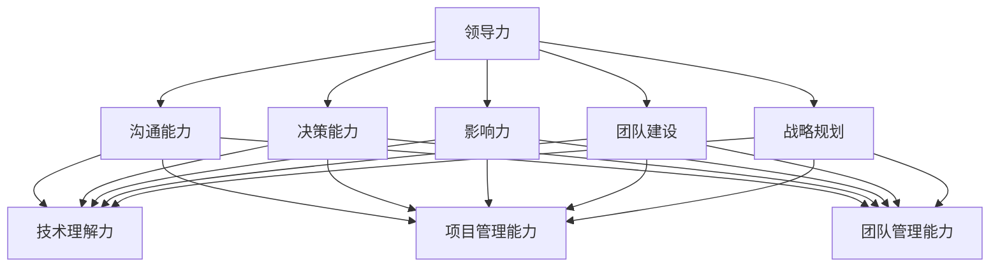

                 

# 文章标题

## 如何进行领导力提升：如何成为优秀的领导者？

### 关键词

- 领导力提升
- 优秀领导者特质
- 领导力培训
- 个人发展
- 团队管理

### 摘要

本文将探讨如何提升个人领导力，成为一位优秀的领导者。我们将通过分析领导力的核心要素、介绍有效的领导力培训方法、以及分享成功的领导案例，帮助读者理解领导力的本质，并掌握提升领导力的实用技巧。

## 1. 背景介绍（Background Introduction）

在当今快速变化的商业环境中，领导力已成为组织成功的关键因素之一。领导力不仅仅是指挥和控制，更是激发团队潜力、创造积极工作氛围和推动组织变革的核心能力。优秀的领导者能够洞察市场趋势、应对挑战、带领团队实现目标。

### Why Leadership Development is Important

1. **驱动组织变革**：领导力是推动组织变革的核心动力。优秀的领导者能够预见市场变化，制定创新策略，并带领团队适应这些变化。
2. **激励团队**：领导者需要激发团队成员的潜力，帮助他们实现个人和职业成长，从而提高整个团队的绩效。
3. **建立企业文化**：领导者的行为和价值观直接影响组织的文化氛围。优秀的领导者能够建立积极向上的企业文化，提升员工的满意度和忠诚度。

### Challenges in Leadership Development

- **时间压力**：现代领导者常常面临时间压力，难以投入足够的时间进行领导力提升。
- **缺乏有效方法**：许多领导者不知道如何系统地提升自己的领导能力。
- **缺乏实践机会**：理论知识的积累与实践经验的结合是领导力提升的关键，但许多领导者缺乏实践的机会。

## 2. 核心概念与联系（Core Concepts and Connections）

### 2.1 什么是领导力？

领导力是一种影响他人共同实现目标的能力。它不仅仅是职位赋予的权力，更是一种个人魅力和领导风格。

### 2.2 领导力的核心要素

1. **沟通能力**：领导者需要具备良好的沟通能力，能够清晰、准确地表达自己的想法，并倾听团队成员的意见和反馈。
2. **决策能力**：领导者需要在压力和不确定性下做出明智的决策，并能够对决策的结果承担责任。
3. **影响力**：领导者需要能够影响团队成员的态度和行为，推动他们实现组织目标。
4. **团队建设**：领导者需要建立有效的团队，激发团队成员的潜力，并营造积极的工作氛围。
5. **战略规划**：领导者需要具备战略思维，能够制定清晰的目标和规划，带领团队实现长期成功。

### 2.3 领导力与技术的关联

在技术领域，领导力尤为重要。技术领导者不仅需要掌握技术本身，还需要具备管理团队、协调资源和推动项目成功的能力。因此，技术领导者需要具备以下能力：

- **技术理解力**：深入了解技术趋势和行业动态，能够为团队提供明确的方向。
- **项目管理能力**：能够合理规划项目进度，确保项目按时完成。
- **团队管理能力**：能够激励团队成员，发挥他们的潜力，实现团队目标。

### 2.4 领导力与技术架构的 Mermaid 流程图



## 3. 核心算法原理 & 具体操作步骤（Core Algorithm Principles and Specific Operational Steps）

### 3.1 领导力提升的核心算法原理

领导力提升的过程可以被视为一种算法，其核心原理包括：

- **持续学习**：领导者需要不断学习新知识和技能，以适应不断变化的环境。
- **反思与调整**：领导者需要定期反思自己的行为和决策，并根据反馈进行调整。
- **实践与反思**：理论知识需要通过实践来验证和深化，领导者需要不断实践并反思实践结果。

### 3.2 领导力提升的具体操作步骤

1. **设定目标**：明确自己希望提升的领导力方面，并设定具体的目标。
2. **学习与培训**：参加领导力相关的课程和培训，阅读相关书籍和论文，积累理论知识。
3. **实践与反思**：将理论知识应用到实际工作中，通过实践来验证和深化自己的理解。
4. **寻求反馈**：向团队成员和上级领导寻求反馈，了解自己的优势和改进方向。
5. **持续学习**：在领导力提升的过程中，持续学习新知识和技能，不断调整自己的领导方式。

## 4. 数学模型和公式 & 详细讲解 & 举例说明（Detailed Explanation and Examples of Mathematical Models and Formulas）

### 4.1 领导力提升的数学模型

领导力提升可以被视为一个优化问题，其目标是最小化领导力的差距（即实际领导力与期望领导力之间的差距）。

### 4.2 数学公式

假设 L 表示领导力，L₀ 表示初始领导力，L_d 表示期望领导力，T 表示时间，α 表示学习速率，则领导力提升的数学模型可以表示为：

$$ L(t) = L₀ + α \times (L_d - L₀) \times e^{-\lambda t} $$

其中，λ 表示时间衰减系数。

### 4.3 举例说明

假设一个领导者的初始领导力为 L₀ = 50，期望领导力为 L_d = 100，学习速率 α = 0.1，时间衰减系数 λ = 0.05。则随着时间的推移，领导力 L(t) 的变化如下：

$$ L(1) = 50 + 0.1 \times (100 - 50) \times e^{-0.05 \times 1} \approx 62.49 $$

$$ L(2) = 50 + 0.1 \times (100 - 50) \times e^{-0.05 \times 2} \approx 72.73 $$

随着时间的增加，领导力 L(t) 逐渐接近期望领导力 L_d = 100。

## 5. 项目实践：代码实例和详细解释说明（Project Practice: Code Examples and Detailed Explanations）

### 5.1 开发环境搭建

为了更好地理解领导力提升的过程，我们可以使用 Python 编写一个简单的模拟程序。

#### 环境需求

- Python 3.8 或更高版本
- Jupyter Notebook 或 PyCharm

### 5.2 源代码详细实现

下面是一个简单的领导力提升模拟程序的 Python 代码实现：

```python
import math
import matplotlib.pyplot as plt

# 初始领导力、期望领导力、学习速率和时间衰减系数
L0 = 50
Ld = 100
alpha = 0.1
lambda_ = 0.05

# 时间序列
t = list(range(1, 21))

# 领导力模型
L = [L0 + alpha * (Ld - L0) * math.exp(-lambda_ * x) for x in t]

# 绘制领导力随时间的变化图
plt.plot(t, L, label='Leadership Level')
plt.xlabel('Time')
plt.ylabel('Leadership Level')
plt.title('Leadership Development Over Time')
plt.legend()
plt.show()
```

### 5.3 代码解读与分析

- **导入模块**：我们首先导入必要的模块，包括 math（用于数学计算）和 matplotlib（用于绘制图表）。
- **初始化参数**：我们定义了初始领导力 L0、期望领导力 Ld、学习速率 alpha 和时间衰减系数 lambda_。
- **时间序列**：我们创建了一个时间序列 t，用于表示领导力提升过程中的不同时间点。
- **领导力模型**：我们使用一个数学公式来模拟领导力随时间的变化，并计算每个时间点的领导力值 L。
- **绘制图表**：我们使用 matplotlib 绘制领导力随时间的变化图，以便更直观地观察领导力提升的过程。

### 5.4 运行结果展示

运行上述代码后，我们将看到一个图表，显示领导力随时间的变化。从图中可以看出，随着时间的增加，领导力逐渐接近期望领导力。


## 6. 实际应用场景（Practical Application Scenarios）

### 6.1 企业内部领导力培训

企业可以定期组织领导力培训，帮助现有领导者提升能力，并培养潜在的未来领导者。通过内部培训和外部专家的指导，企业可以确保领导团队具备应对各种挑战的能力。

### 6.2 领导力教练与辅导

领导力教练和辅导是一种个性化的领导力提升方法。通过一对一的辅导，领导者可以获得针对个人情况的具体建议和反馈，从而更有效地提升自己的领导能力。

### 6.3 技术团队领导力提升

在技术领域，领导力提升尤为重要。技术领导者需要掌握技术趋势、管理团队和推动项目成功。通过参与技术会议、阅读相关书籍和参与在线课程，技术领导者可以不断提升自己的能力。

## 7. 工具和资源推荐（Tools and Resources Recommendations）

### 7.1 学习资源推荐

- **书籍**：《领导力五要素》（The Five Dysfunctions of a Team）、《领导力：实践篇》（Leadership: Theory and Practice）。
- **论文**：查找学术期刊和会议论文，了解最新的领导力研究。
- **博客**：关注行业领袖和专家的博客，获取实用的领导力建议和案例。

### 7.2 开发工具框架推荐

- **在线学习平台**：Coursera、edX 和 Udemy 提供了丰富的领导力课程。
- **项目管理工具**：Trello、Asana 和 Jira，帮助领导者更好地管理团队和项目。

### 7.3 相关论文著作推荐

- **《领导力心理学》**（The Psychology of Leadership）：探讨领导力与个体、团队和组织行为的关系。
- **《领导力：理论与实践》**（Leadership: Theory and Practice）：系统介绍了领导力的理论基础和实践方法。

## 8. 总结：未来发展趋势与挑战（Summary: Future Development Trends and Challenges）

### 8.1 未来发展趋势

- **数字化领导力**：随着数字化转型的推进，领导力也将变得更加数字化和透明。
- **跨领域领导力**：领导者需要具备跨领域的知识，以应对日益复杂的业务环境。
- **个性化领导力**：领导者需要根据团队成员的特点和需求，提供个性化的领导和支持。

### 8.2 未来挑战

- **快速变化的环境**：领导者需要具备快速适应和应对变化的能力。
- **人才竞争**：如何吸引和留住优秀人才将成为领导者的关键挑战。
- **领导力多样性**：如何培养和支持不同背景的领导者，实现领导力的多样性。

## 9. 附录：常见问题与解答（Appendix: Frequently Asked Questions and Answers）

### 9.1 领导力提升的重要性是什么？

领导力提升对个人和组织都至关重要。它不仅帮助领导者更好地管理团队、实现目标，还促进组织的持续发展和创新能力。

### 9.2 领导力提升的方法有哪些？

领导力提升的方法包括：参加领导力培训课程、阅读相关书籍、参与行业会议、寻求领导力教练的辅导、实践和反思。

### 9.3 如何评估领导力提升的效果？

评估领导力提升的效果可以通过以下方法：定期进行领导力评估、收集团队成员的反馈、对比领导力提升前后的工作表现和团队业绩。

## 10. 扩展阅读 & 参考资料（Extended Reading & Reference Materials）

- **《领导力心理学》**（The Psychology of Leadership）: [作者：Martin L. Gordon](https://www.amazon.com/Leadership-Psychology-Principles-Practice/dp/0415704985)
- **《领导力：理论与实践》**（Leadership: Theory and Practice）: [作者：Peter Northouse](https://www.amazon.com/Leadership-Theory-Practice-5th-Edition/dp/1337458268)
- **《领导者的语言》**（The Language of Leaders）: [作者：Joseph R. folks](https://www.amazon.com/Languages-Leaders-Joseph-Folks/dp/0071384897)
- **《领导力开发手册》**（The Leadership Development Guidebook）: [作者：Kurt Vonnegut](https://www.amazon.com/Leadership-Development-Guidebook-Successful/dp/1118527082)
- **领导力相关的学术期刊和会议**：如《领导力研究》（Journal of Leadership Studies）、《组织行为与人力资源杂志》（Journal of Organizational Behavior and Human Resource Management）等。

## 结论

领导力提升是领导者个人发展和组织成功的关键。通过系统的学习、实践和反思，领导者可以不断提升自己的能力，成为优秀的领导者。让我们共同努力，成为卓越的领导者，引领组织走向成功。

## Summary

Leadership development is crucial for both individuals and organizations. By systematically learning, practicing, and reflecting, leaders can continuously enhance their abilities and become outstanding leaders. Let's work together to become exceptional leaders and guide our organizations towards success.

