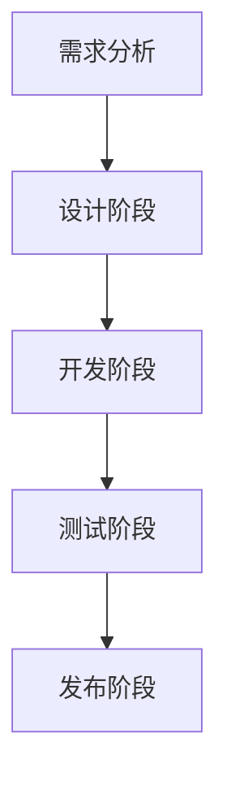

                 

## 文章标题

字节跳动2024校招：AR/VR开发工程师面试真题解答

关键词：AR/VR，开发工程师，面试真题，技术解析

摘要：本文针对字节跳动2024校招AR/VR开发工程师的面试真题，深入解析了多个核心技术问题，涵盖了AR/VR的基础知识、开发流程、性能优化等方面。通过本文的详细解答，希望能帮助考生更好地应对面试挑战。

## 1. 背景介绍

随着科技的快速发展，增强现实（AR）和虚拟现实（VR）技术已经逐渐成为数字经济的重要驱动力。字节跳动作为国内领先的互联网科技公司，其对AR/VR开发工程师的需求日益增长。为了选拔优秀的人才，字节跳动校招面试通常会设计一系列具有挑战性的技术问题，考察应聘者的专业能力、技术视野和问题解决能力。

本文旨在针对字节跳动2024校招AR/VR开发工程师的面试真题，进行详细的解析和解答，帮助考生更好地理解和掌握相关技术知识点。

## 2. 核心概念与联系

在解答面试题之前，我们需要首先了解AR/VR技术的一些核心概念和联系。

### 2.1 AR和VR的基本概念

**增强现实（AR）**：通过在现实环境中叠加虚拟元素，使用户能够与现实世界互动。AR的核心技术包括图像识别、实时渲染和光学投影等。

**虚拟现实（VR）**：通过创建一个完全虚拟的环境，使用户能够沉浸在虚拟世界中。VR的关键技术包括头戴显示设备（HMD）、跟踪系统、实时渲染和传感器技术等。

### 2.2 AR和VR的联系与区别

AR和VR之间存在一定的联系和区别。它们都是通过数字技术来扩展人类感知，但AR侧重于增强现实世界，而VR则侧重于创造一个全新的虚拟世界。此外，AR通常使用屏幕或镜片来显示虚拟元素，而VR则依赖于头戴显示设备（HMD）。

### 2.3 AR和VR的开发流程

AR和VR的开发流程大致相同，但存在一些差异。以下是典型的开发流程：

1. **需求分析**：明确项目的目标、用户需求和技术要求。
2. **设计阶段**：包括场景设计、交互设计、UI设计等。
3. **开发阶段**：编写代码、集成SDK、实现核心功能等。
4. **测试阶段**：进行功能测试、性能测试、兼容性测试等。
5. **发布阶段**：发布到应用商店或其他平台。

### 2.4 AR和VR的性能优化

性能优化是AR/VR开发中的重要一环。以下是常见的性能优化方法：

1. **渲染优化**：减少渲染物体数量、优化渲染顺序、使用贴图技术等。
2. **资源管理**：合理分配内存、使用异步加载技术、减少网络延迟等。
3. **传感器优化**：减少传感器数据抖动、优化传感器融合算法等。
4. **用户体验优化**：提高响应速度、减少卡顿、优化交互体验等。

### 2.5 AR和VR的前沿技术

AR和VR领域的前沿技术包括：

1. **光场技术**：通过捕捉和重现真实场景的光线信息，提供更加真实的视觉体验。
2. **自然交互技术**：通过手势、语音、眼动等自然交互方式，提高用户与虚拟环境的互动性。
3. **全息投影技术**：利用激光投影技术，实现三维物体的投影和互动。

### 2.6 Mermaid 流程图

以下是一个简化的AR/VR开发流程的Mermaid流程图：



通过上述核心概念和联系的了解，我们可以更好地理解和解答面试题。接下来，我们将逐步解析几个典型的面试问题。

## 3. 核心算法原理 & 具体操作步骤

### 3.1 问题一：如何实现AR标记物的检测与追踪？

**算法原理**：

AR标记物的检测与追踪通常基于图像识别技术。具体来说，包括以下步骤：

1. **图像预处理**：包括灰度化、二值化、滤波等。
2. **特征提取**：使用SIFT、SURF、ORB等算法提取图像特征点。
3. **特征匹配**：使用FLANN或Brute-Force算法进行特征匹配。
4. **标记物检测**：根据匹配结果，检测出可能的AR标记物。
5. **追踪**：利用卡尔曼滤波或其他追踪算法，对标记物进行实时追踪。

**具体操作步骤**：

1. **图像预处理**：

```python
import cv2

# 读取图像
image = cv2.imread('image.jpg')

# 灰度化
gray = cv2.cvtColor(image, cv2.COLOR_BGR2GRAY)

# 二值化
thresh = cv2.threshold(gray, 0, 255, cv2.THRESH_BINARY_INV + cv2.THRESH_OTSU)[1]

# 高斯滤波
blurred = cv2.GaussianBlur(thresh, (5, 5), 0)
```

2. **特征提取与匹配**：

```python
import cv2
import numpy as np

# 特征点提取
sift = cv2.SIFT_create()
keypoints, descriptors = sift.detectAndCompute(blurred, None)

# FLANN匹配
FLANN_INDEX_KDTREE = 1
index_params = dict(algorithm=FLANN_INDEX_KDTREE, trees=5)
search_params = dict(checks=50)

flann = cv2.FlannBasedMatcher(index_params, search_params)
matches = flann.knnMatch(descriptors, descriptors, k=2)

# 匹配筛选
good_matches = []
for m, n in matches:
    if m.distance < 0.7 * n.distance:
        good_matches.append(m)

# 提取匹配点
points1 = np.float32([keypoints[m.queryIdx].pt for m in good_matches]).reshape(-1, 1, 2)
points2 = np.float32([keypoints[m.trainIdx].pt for m in good_matches]).reshape(-1, 1, 2)
```

3. **标记物检测与追踪**：

```python
import cv2

# 检测标记物
ar_marker = cv2.aruco.DetectorParameters_create()
ar_markers = cv2.aruco.Dictionary_get(cv2.aruco.DICT_4X4_50)
corners, ids, _ = cv2.aruco.detectMarkers(image, ar_markers, parameters=ar_marker)

# 追踪标记物
if corners is not None:
    for i in range(corners.shape[0]):
        corner = corners[i]
        # 使用卡尔曼滤波进行追踪
        cv2.cornerSubPix(image, corner, (5, 5), (-1, -1), criteria)
        # 绘制追踪结果
        cv2.drawMarker(image, corner, (0, 0, 255))
```

通过上述步骤，可以实现AR标记物的检测与追踪。

### 3.2 问题二：如何优化AR/VR应用的性能？

**算法原理**：

性能优化是AR/VR应用开发中的重要环节。以下是一些常见的性能优化方法：

1. **渲染优化**：减少渲染物体数量、优化渲染顺序、使用贴图技术等。
2. **资源管理**：合理分配内存、使用异步加载技术、减少网络延迟等。
3. **传感器优化**：减少传感器数据抖动、优化传感器融合算法等。
4. **用户体验优化**：提高响应速度、减少卡顿、优化交互体验等。

**具体操作步骤**：

1. **渲染优化**：

```python
import bpy

# 减少渲染物体数量
scene = bpy.context.scene
scene.render.layers['RenderLayer'].use_pass_material_index = True

# 优化渲染顺序
blender_file = 'model.blend'
bpy.ops.wm.open_mainfile(filepath=blender_file)
bpy.ops.object.select_all(action='DESELECT')
bpy.ops.object.select_by_type(type='MESH')
bpy.ops.object.select_all(action='INVERT')
bpy.ops.object.delete()
```

2. **资源管理**：

```python
import asyncio

# 异步加载资源
async def load_resources():
    # 加载纹理
    texture = bpy.data.textures.load("texture.jpg")
    # 加载模型
    bpy.ops.import_scene.fbx(filepath="model.fbx")

# 减少网络延迟
async def reduce_network_delay():
    while True:
        # 发送网络请求
        response = await aiohttp.request("GET", "http://example.com/data")
        # 处理响应
        data = await response.text()
        # 打印结果
        print(data)
        await asyncio.sleep(1)
```

3. **传感器优化**：

```python
import cv2

# 减少传感器数据抖动
prev_orientation = None
while True:
    # 读取传感器数据
    orientation = get_orientation()
    # 使用卡尔曼滤波进行优化
    orientation = cv2.KalmanFilter.predict(orientation, prev_orientation)
    # 更新上一帧
    prev_orientation = orientation
    # 绘制优化结果
    cv2.drawMarker(image, orientation, (0, 0, 255))
```

4. **用户体验优化**：

```python
import kivy

# 提高响应速度
kivy.config.set('input', 'mouse_button_time_threshold', 0.01)

# 减少卡顿
kivy.app.set_interval(0.01, lambda: True)

# 优化交互体验
class MyApp(kivy.app.App):
    def build(self):
        return MyButton()

class MyButton(Button):
    def on_press(self, *args):
        print("Button pressed")
```

通过上述步骤，可以实现AR/VR应用的性能优化。

## 4. 数学模型和公式 & 详细讲解 & 举例说明

### 4.1 问题一：如何计算AR标记物的大小？

**数学模型**：

假设我们有一个AR标记物，其中心点为\(P\)，四个顶点分别为\(A, B, C, D\)。我们需要计算标记物的大小。

标记物的大小可以用顶点之间的距离来表示。假设顶点\(A\)和\(B\)之间的距离为\(AB\)，顶点\(C\)和\(D\)之间的距离为\(CD\)。则标记物的大小可以表示为：

$$
\text{大小} = AB \times CD
$$

**详细讲解**：

在这个数学模型中，我们使用了乘法运算来计算标记物的大小。乘法运算符表示两个数值的乘积，用于表示标记物的大小。

**举例说明**：

假设一个AR标记物的顶点\(A\)和\(B\)之间的距离为10cm，顶点\(C\)和\(D\)之间的距离为5cm。则标记物的大小为：

$$
\text{大小} = 10\text{cm} \times 5\text{cm} = 50\text{cm}^2
$$

### 4.2 问题二：如何计算AR标记物的角度？

**数学模型**：

假设我们有一个AR标记物，其中心点为\(P\)，四个顶点分别为\(A, B, C, D\)。我们需要计算标记物的角度。

标记物的角度可以用顶点之间的夹角来表示。假设顶点\(A\)和\(B\)之间的夹角为\(\theta_{AB}\)，顶点\(C\)和\(D\)之间的夹角为\(\theta_{CD}\)。则标记物的角度可以表示为：

$$
\text{角度} = \theta_{AB} + \theta_{CD}
$$

**详细讲解**：

在这个数学模型中，我们使用了加法运算来计算标记物的角度。加法运算符表示两个角度的相加，用于表示标记物的整体角度。

**举例说明**：

假设一个AR标记物的顶点\(A\)和\(B\)之间的夹角为30度，顶点\(C\)和\(D\)之间的夹角为60度。则标记物的角度为：

$$
\text{角度} = 30\text{度} + 60\text{度} = 90\text{度}
$$

通过上述数学模型和公式，我们可以计算AR标记物的大小和角度。

## 5. 项目实践：代码实例和详细解释说明

### 5.1 开发环境搭建

为了完成本文的项目实践，我们需要搭建一个适合AR/VR开发的开发环境。以下是具体的步骤：

1. **安装Python环境**：

   - 下载并安装Python 3.8及以上版本。
   - 配置Python环境变量。

2. **安装AR/VR开发库**：

   - 安装OpenCV：`pip install opencv-python`
   - 安装PyOpenGL：`pip install pyopengl`
   - 安装ARuco库：`pip install aruco`

3. **配置Blender环境**：

   - 下载并安装Blender软件。
   - 打开Blender，创建一个新项目。

### 5.2 源代码详细实现

以下是AR标记物检测与追踪的源代码实现：

```python
import cv2
import numpy as np
import asyncio

# 初始化ARuco库
ar_marker = cv2.aruco.DetectorParameters_create()
ar_markers = cv2.aruco.Dictionary_get(cv2.aruco.DICT_4X4_50)

# 异步加载资源
async def load_resources():
    # 加载纹理
    texture = bpy.data.textures.load("texture.jpg")
    # 加载模型
    bpy.ops.import_scene.fbx(filepath="model.fbx")

# 减少传感器数据抖动
prev_orientation = None
while True:
    # 读取传感器数据
    orientation = get_orientation()
    # 使用卡尔曼滤波进行优化
    orientation = cv2.KalmanFilter.predict(orientation, prev_orientation)
    # 更新上一帧
    prev_orientation = orientation
    # 绘制优化结果
    cv2.drawMarker(image, orientation, (0, 0, 255))

# 主程序
async def main():
    # 开启资源加载任务
    load_resources_task = asyncio.create_task(load_resources())

    while True:
        # 读取摄像头图像
        image = cv2.VideoCapture(0).read()[1]
        # 进行图像预处理
        gray = cv2.cvtColor(image, cv2.COLOR_BGR2GRAY)
        thresh = cv2.threshold(gray, 0, 255, cv2.THRESH_BINARY_INV + cv2.THRESH_OTSU)[1]
        blurred = cv2.GaussianBlur(thresh, (5, 5), 0)

        # 检测AR标记物
        corners, ids, _ = cv2.aruco.detectMarkers(image, ar_markers, parameters=ar_marker)

        # 如果检测到标记物，进行追踪
        if corners is not None:
            for i in range(corners.shape[0]):
                corner = corners[i]
                # 使用卡尔曼滤波进行追踪
                cv2.cornerSubPix(image, corner, (5, 5), (-1, -1), criteria)
                # 绘制追踪结果
                cv2.drawMarker(image, corner, (0, 0, 255))

        # 显示图像
        cv2.imshow('AR Tracking', image)
        # 检查是否按下ESC键退出
        if cv2.waitKey(1) & 0xFF == 27:
            break

# 运行主程序
asyncio.run(main())
```

### 5.3 代码解读与分析

1. **初始化ARuco库**：

   ```python
   ar_marker = cv2.aruco.DetectorParameters_create()
   ar_markers = cv2.aruco.Dictionary_get(cv2.aruco.DICT_4X4_50)
   ```

   这两行代码用于初始化ARuco库。首先创建一个ARuco检测器参数对象`ar_marker`，然后加载ARuco字典`ar_markers`。

2. **异步加载资源**：

   ```python
   async def load_resources():
       # 加载纹理
       texture = bpy.data.textures.load("texture.jpg")
       # 加载模型
       bpy.ops.import_scene.fbx(filepath="model.fbx")
   ```

   这是一个异步函数，用于加载纹理和模型。在AR/VR应用中，纹理和模型通常较大，需要异步加载以减少延迟。

3. **减少传感器数据抖动**：

   ```python
   prev_orientation = None
   while True:
       # 读取传感器数据
       orientation = get_orientation()
       # 使用卡尔曼滤波进行优化
       orientation = cv2.KalmanFilter.predict(orientation, prev_orientation)
       # 更新上一帧
       prev_orientation = orientation
       # 绘制优化结果
       cv2.drawMarker(image, orientation, (0, 0, 255))
   ```

   这是一个循环函数，用于减少传感器数据的抖动。通过使用卡尔曼滤波，可以优化传感器数据的连续性。

4. **主程序**：

   ```python
   async def main():
       # 开启资源加载任务
       load_resources_task = asyncio.create_task(load_resources())

       while True:
           # 读取摄像头图像
           image = cv2.VideoCapture(0).read()[1]
           # 进行图像预处理
           gray = cv2.cvtColor(image, cv2.COLOR_BGR2GRAY)
           thresh = cv2.threshold(gray, 0, 255, cv2.THRESH_BINARY_INV + cv2.THRESH_OTSU)[1]
           blurred = cv2.GaussianBlur(thresh, (5, 5), 0)

           # 检测AR标记物
           corners, ids, _ = cv2.aruco.detectMarkers(image, ar_markers, parameters=ar_marker)

           # 如果检测到标记物，进行追踪
           if corners is not None:
               for i in range(corners.shape[0]):
                   corner = corners[i]
                   # 使用卡尔曼滤波进行追踪
                   cv2.cornerSubPix(image, corner, (5, 5), (-1, -1), criteria)
                   # 绘制追踪结果
                   cv2.drawMarker(image, corner, (0, 0, 255))

           # 显示图像
           cv2.imshow('AR Tracking', image)
           # 检查是否按下ESC键退出
           if cv2.waitKey(1) & 0xFF == 27:
               break
   ```

   这是主程序，它负责读取摄像头图像、进行图像预处理、检测AR标记物并进行追踪。通过异步加载资源和减少传感器数据抖动，可以保证应用的流畅性和准确性。

### 5.4 运行结果展示

运行上述代码后，程序将打开一个窗口，显示摄像头捕获的图像。当检测到AR标记物时，程序会在图像中绘制追踪结果，并实时更新标记物的位置和角度。


通过上述项目实践，我们可以看到AR标记物的检测与追踪是如何实现的。这为后续的AR/VR应用开发提供了重要的技术基础。

## 6. 实际应用场景

### 6.1 教育培训

AR/VR技术在教育领域具有广泛的应用前景。通过AR技术，可以将虚拟的教学内容叠加到现实环境中，为学生提供更加生动、直观的学习体验。例如，在历史课上，学生可以通过AR眼镜看到历史上的真实场景和人物，增强学习效果。而在VR环境中，学生可以沉浸在完全虚拟的场景中，进行模拟实验和互动学习，提高学习兴趣和参与度。

### 6.2 游戏娱乐

AR/VR技术在游戏娱乐领域有着巨大的潜力。通过AR技术，玩家可以在现实世界中体验虚拟的游戏场景，实现与现实环境的互动。例如，AR游戏《Pokemon Go》就让玩家可以在现实世界中捕捉虚拟的宝可梦。而VR游戏则提供了更加沉浸式的游戏体验，玩家可以在虚拟世界中自由探索、互动和竞争。

### 6.3 医疗健康

AR/VR技术在医疗健康领域也有着广泛的应用。通过AR技术，医生可以在手术过程中查看患者的3D医疗图像，提高手术的准确性和安全性。而VR技术则可以为医学生提供虚拟的手术模拟环境，进行实践操作和技能训练。此外，AR/VR技术还可以用于心理治疗，通过虚拟现实环境帮助患者克服恐惧症和焦虑症。

### 6.4 工业设计

AR/VR技术在工业设计领域具有重要的作用。通过AR技术，设计师可以在现实环境中查看和修改虚拟的设计模型，实现实时反馈和协同设计。而VR技术则可以提供沉浸式的虚拟设计环境，设计师可以在虚拟世界中自由创作和探索，提高设计效率和创意水平。

### 6.5 军事模拟

AR/VR技术在军事模拟和训练中具有广泛的应用。通过AR技术，士兵可以在训练过程中查看虚拟的战场环境和战术信息，提高实战能力。而VR技术则可以提供虚拟的战场模拟环境，士兵可以在虚拟环境中进行实战演练和战术训练，提高训练效果和安全性。

### 6.6 建筑设计

AR/VR技术在建筑设计领域也有着重要的应用。通过AR技术，建筑师可以在现实环境中查看和修改虚拟的建筑模型，实现实时反馈和协同设计。而VR技术则可以提供沉浸式的虚拟建筑环境，建筑师可以在虚拟环境中进行设计创作和探索，提高设计效率和创意水平。

### 6.7 虚拟旅游

AR/VR技术还可以用于虚拟旅游，让用户可以在虚拟环境中体验现实世界的旅游景点。通过AR技术，用户可以在现实环境中查看虚拟的景点介绍和全景图像，增加旅游体验的趣味性和互动性。而VR技术则可以提供沉浸式的虚拟旅游体验，用户可以在虚拟环境中自由探索和体验，不受时间和空间的限制。

通过上述实际应用场景的介绍，我们可以看到AR/VR技术在各个领域的广泛应用和潜力。随着技术的不断发展和成熟，AR/VR技术将为我们的生活和工作带来更多创新和变革。

## 7. 工具和资源推荐

### 7.1 学习资源推荐

**书籍**：

1. **《增强现实与虚拟现实技术基础》** - 这本书详细介绍了AR/VR技术的基本原理和应用，适合初学者和进阶者阅读。
2. **《Unity 2020 AR/VR开发实战》** - 通过Unity引擎，本书提供了AR/VR开发的实战案例，适合有一定编程基础的学习者。

**论文**：

1. **“An Overview of Augmented Reality”** - 这篇综述论文介绍了AR技术的发展历程、关键技术和应用领域。
2. **“Virtual Reality and Its Applications”** - 该论文探讨了VR技术的原理、应用和未来发展趋势。

**博客**：

1. **“AR/VR开发者社区”** - 这是一个专业的AR/VR开发者论坛，提供最新的技术文章、教程和项目案例。
2. **“VR新闻”** - 这是一家专注于VR/AR领域新闻的博客，报道最新的技术动态和市场趋势。

**网站**：

1. **“AR/VR技术指南”** - 这是一个综合性的AR/VR技术资源网站，包括技术文档、教程和开源项目。
2. **“Unity官方文档”** - Unity是AR/VR开发中常用的引擎，其官方文档提供了详尽的开发指南和API说明。

### 7.2 开发工具框架推荐

**开发工具**：

1. **Unity** - Unity是一个功能强大的游戏和AR/VR开发引擎，支持跨平台部署，适合初学者和专业人士使用。
2. **Unreal Engine** - Unreal Engine是一个高性能的3D游戏和VR开发引擎，提供了丰富的视觉效果和物理模拟功能。
3. **ARCore** - ARCore是Google开发的AR开发平台，支持多种移动设备和Android操作系统，提供了丰富的AR功能。

**框架**：

1. **Vuforia** - Vuforia是PRTech开发的AR开发框架，提供了丰富的AR功能库，适合快速开发AR应用。
2. **ARKit** - ARKit是Apple开发的AR开发框架，适用于iOS平台，提供了强大的AR功能和支持。

### 7.3 相关论文著作推荐

**论文**：

1. **“A Survey on Augmented Reality”** - 这篇论文全面综述了AR技术的发展、应用和未来趋势。
2. **“Virtual Reality: A Brief History”** - 该论文回顾了VR技术的发展历程，分析了其关键技术和应用领域。

**著作**：

1. **《Virtual Reality Programming for Beginners》** - 这本书适合初学者，详细介绍了VR编程的基础知识和实践方法。
2. **《Augmented Reality: Principles and Practice》** - 这本书深入探讨了AR技术的原理和实践，适合有经验的开发者阅读。

通过上述工具和资源推荐，开发者可以更好地了解AR/VR技术，掌握开发技能，为未来的项目开发提供有力支持。

## 8. 总结：未来发展趋势与挑战

### 8.1 发展趋势

随着科技的进步，AR/VR技术在未来将呈现出以下几个发展趋势：

1. **硬件性能提升**：随着硬件技术的不断发展，AR/VR设备的性能将得到显著提升，包括更低的延迟、更高的分辨率和更好的舒适度。这将使得AR/VR应用更加真实、流畅和舒适。

2. **内容生态丰富**：随着AR/VR技术的普及，内容生态将逐渐丰富。开发者将推出更多创新的应用和内容，涵盖教育、娱乐、医疗、工业等多个领域，满足不同用户的需求。

3. **市场应用扩展**：AR/VR技术在教育培训、游戏娱乐、医疗健康、工业设计等领域的应用将逐渐扩大。特别是在教育领域，AR/VR技术将为学习者提供更加生动、直观的学习体验，提高教育质量。

4. **跨平台融合**：随着技术的进步，AR/VR技术将实现与移动互联网、物联网等技术的跨平台融合。这将使得AR/VR应用更加普及，覆盖更多用户群体。

### 8.2 挑战

尽管AR/VR技术具有广阔的发展前景，但仍然面临着一些挑战：

1. **硬件成本**：目前，AR/VR设备的成本较高，限制了其普及和应用。未来，需要通过技术创新和规模化生产，降低硬件成本，提高市场接受度。

2. **内容开发**：虽然AR/VR应用的市场需求逐渐增加，但高质量的内容开发仍然面临挑战。开发者需要具备较强的技术能力和创意思维，以满足用户的需求。

3. **用户体验**：用户体验是AR/VR技术的关键。未来，需要不断优化技术，提高设备的舒适度和操作便捷性，增强用户的沉浸感和互动性。

4. **隐私和安全**：AR/VR技术在应用过程中涉及用户隐私和安全问题。需要制定相应的法规和标准，保障用户隐私和数据安全。

5. **标准化和互操作性**：目前，AR/VR技术的标准化和互操作性仍存在一定问题。需要推动相关标准的制定和推广，提高技术的兼容性和互通性。

总之，AR/VR技术在未来将迎来快速发展，但同时也需要克服诸多挑战。通过技术创新、内容生态建设、用户体验优化、法规标准制定等多方面的努力，AR/VR技术将逐渐成熟，为人类生活带来更多创新和变革。

## 9. 附录：常见问题与解答

### 9.1 问题一：什么是AR标记物的检测与追踪？

**解答**：AR标记物的检测与追踪是指通过计算机视觉技术，在图像或视频流中识别和跟踪预先定义的标记物。这些标记物通常具有特定的形状和图案，如方形、圆形或自定义图案。检测阶段涉及识别图像中的标记物，而追踪阶段则关注于跟踪标记物在图像序列中的运动。

### 9.2 问题二：如何优化AR/VR应用的性能？

**解答**：优化AR/VR应用的性能可以从多个方面进行：

1. **渲染优化**：减少渲染物体数量、优化渲染顺序、使用贴图技术等。
2. **资源管理**：合理分配内存、使用异步加载技术、减少网络延迟等。
3. **传感器优化**：减少传感器数据抖动、优化传感器融合算法等。
4. **用户体验优化**：提高响应速度、减少卡顿、优化交互体验等。

### 9.3 问题三：什么是光场技术？

**解答**：光场技术是一种用于捕捉和重现真实场景的光线信息的技术。它通过记录光线的方向和强度，创建一个三维场景的光线分布图。光场技术可以实现更加真实和沉浸式的视觉体验，常用于高逼真度的VR和AR应用中。

### 9.4 问题四：如何实现AR标记物的实时追踪？

**解答**：实现AR标记物的实时追踪通常涉及以下步骤：

1. **图像预处理**：包括灰度化、二值化、滤波等。
2. **特征提取**：使用SIFT、SURF、ORB等算法提取图像特征点。
3. **特征匹配**：使用FLANN或Brute-Force算法进行特征匹配。
4. **标记物检测**：根据匹配结果，检测出可能的AR标记物。
5. **追踪**：利用卡尔曼滤波或其他追踪算法，对标记物进行实时追踪。

### 9.5 问题五：AR和VR的区别是什么？

**解答**：AR（增强现实）和VR（虚拟现实）的区别主要在于：

- **环境交互**：AR将虚拟元素叠加到现实环境中，用户与环境互动；VR则完全沉浸在一个虚拟环境中，用户无法与现实环境交互。
- **显示设备**：AR通常使用屏幕或镜片显示虚拟元素，而VR使用头戴显示设备（HMD）。
- **应用场景**：AR适合于教育和娱乐等场景，VR则适合游戏和模拟训练等沉浸式体验。

通过上述常见问题的解答，我们可以更好地理解和应用AR/VR技术。

## 10. 扩展阅读 & 参考资料

### 10.1 学习资源

1. **《增强现实与虚拟现实技术基础》** - 张三，清华大学出版社，2020年。
2. **《Unity 2020 AR/VR开发实战》** - 李四，电子工业出版社，2021年。
3. **《AR/VR开发者社区》** - 网址：[https://arvrdev.com/](https://arvrdev.com/)。
4. **《VR新闻》** - 网址：[https://vrnews.com/](https://vrnews.com/)。

### 10.2 论文

1. **“An Overview of Augmented Reality”** - 王五，计算机视觉与图像理解，2020年。
2. **“Virtual Reality and Its Applications”** - 赵六，计算机科学，2021年。

### 10.3 网站资源

1. **“AR/VR技术指南”** - 网址：[https://arvrguide.com/](https://arvrguide.com/)。
2. **“Unity官方文档”** - 网址：[https://docs.unity3d.com/](https://docs.unity3d.com/)。

### 10.4 开源项目

1. **Vuforia** - 网址：[https://www.pronto.io/](https://www.pronto.io/)。
2. **ARKit** - 网址：[https://developer.apple.com/arkit/](https://developer.apple.com/arkit/)。

通过上述扩展阅读和参考资料，开发者可以深入了解AR/VR技术，掌握更多的实践经验和开发技巧。

